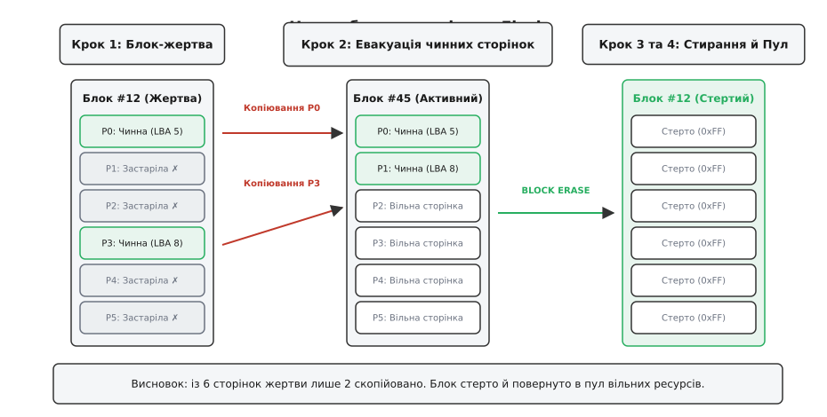
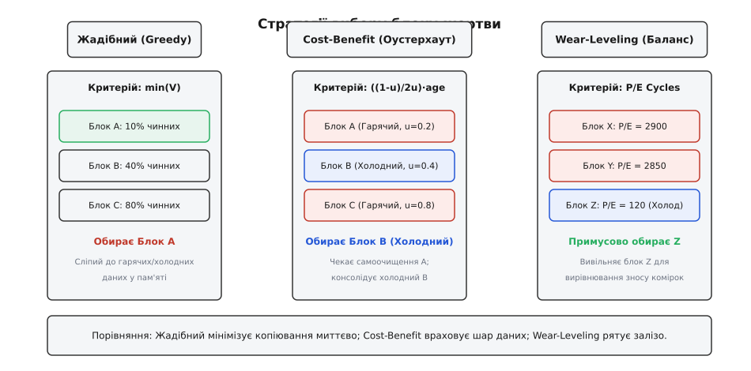
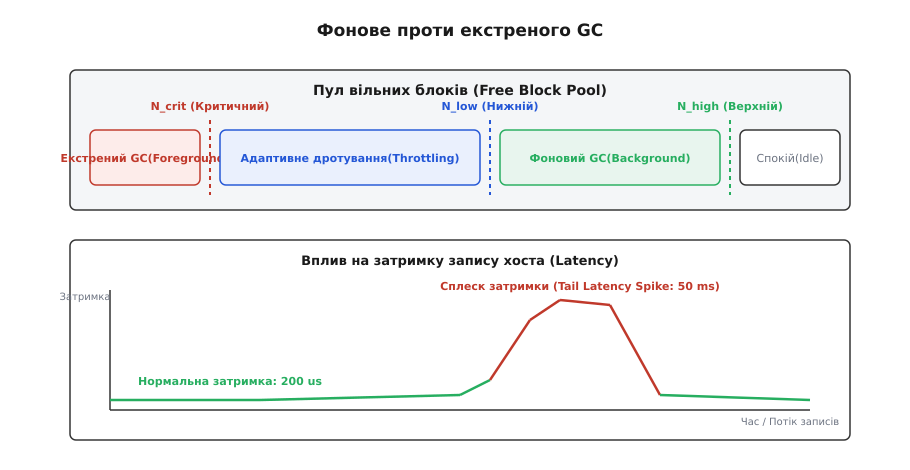
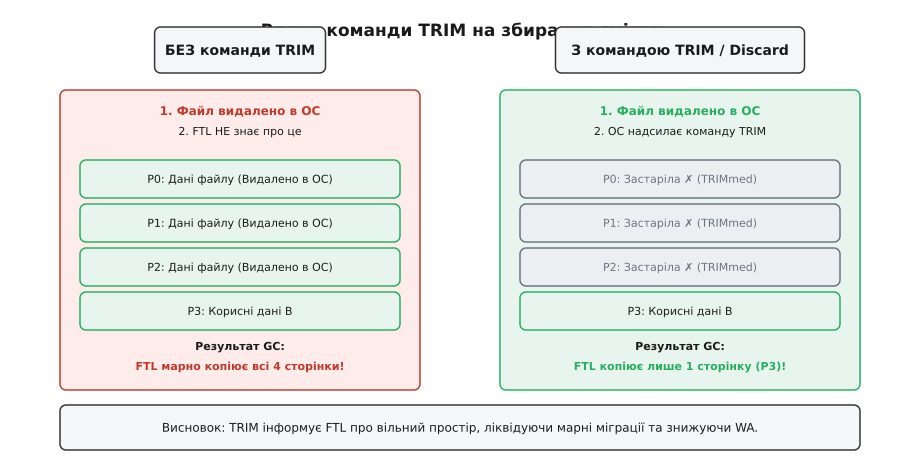

# Garbage collection у Flash-сховищах

<preknowlist>
- [Шар трансляції флешу (FTL)](root:sf-data/ftl-flash-translation) — запис не на місце, таблиця відображення LPN→PPN, виникнення застарілих сторінок.
- [Flash зсередини](root:hw-components/flash-internals) — фізична різниця між розміром сторінки й блоку стирання, скінченний ресурс P/E циклів.
- [Логічна адресація блоків (LBA)](root:sf-data/ftl-flash-translation) — адресація секторів з боку ОС, відрив логічних адрес від фізичних сторінок NAND.
- [Коди виправлення помилок (ECC)](root:hw-arch/ecc-flash) — виявлення та корекція пошкоджених бітів при читанні зі сторінок флеш-пам'яті.
</preknowlist>

Операційна система виділяє файл, записує в нього дані, а згодом модифікує або видаляє його. Для традиційного магнітного диска оновлення сектора — це безпосереднє перезаписування матеріалу поверх старих намагнічених доменів. Але Flash-пам'ять так працювати не здатна: її фізична структура забороняє повторний запис у комірку без попереднього стирання. Оскільки FTL (Flash Translation Layer) реалізує дисципліну запису не на місце (*out-of-place write*), кожна зміна даних не знищує стару версію сторінки, а пише нову в інше фізичне місце, залишаючи попередній фізичний адрес у стані **застарілої** (*invalid/stale*) сторінки.

З часом накопичувач заповнюється такими фізичними сторінками, які більше не належать жодному логічному файлу. Оскільки розмір операції стирання у флеш-пам'яті (стиральний блок, *eraseblock*, зазвичай від 2 до 8 мегабайтів) у сотні разів перевищує розмір сторінки запису (від 4 до 16 кілобайтів), контролер не може просто витерти одну застарілу сторінку. Пам'ять перетворюється на мозаїку з чинних даних і застарілого «сміття». Без примусового очищення та консолідації вільний простір для нових записів неминуче вичерпається.

Механізм, який розплутує цей вузол, називається **збиранням сміття у Flash-сховищах** (*Flash Garbage Collection*, GC). Його завдання — знаходити блоки з накопиченими застарілими сторінками, вивільняти з них нечисленні чинні дані шляхом перенесення у нові блоки, а очищені блоки стирати й повертати до пулу вільних ресурсів.

> 🔧 **Навіщо це.** Розуміння алгоритмів та поведінки Garbage Collection у Flash розкриває фізичну природу затримок запису в SSD та eMMC, пояснює явище підсилення запису (*Write Amplification*), що зношує накопичувач, і визначає інженерні вимоги до використання команд TRIM/Discard у файлових системах та базах даних.

---

## 1. Першопричина: чому флеш накопичує сміття і не може витерти його на місці

Фізика комірок NAND Flash визначає асиметрію між операціями читання, програмування (запису) та стирання. Запис полягає в інжекції електронів крізь тунельний діелектрик у плаваючий затвор або шар пастки заряду (*charge trap*). Цей процес можна виконувати точково на рівні однієї сторінки (*page*). Проте зворотний процес — стирання — вимагає подачі високого негативного потенціалу на спільну підкладку всієї матриці комірок, що примусово вибиває накопичені електрони з усіх комірок великого фізичного блоку (*eraseblock*).

Через це у флеш-пам'яті діють три непохитні закони:
1. Запис здійснюється квантами сторінок (наприклад, 8192 байти).
2. Стирання здійснюється лише цілими блоками (наприклад, 256 або 512 сторінок у блоці).
3. Запис у сторінку можливий лише після того, як увесь блок під нею був повністю стертий.

Коли хостова система видає команду запису за логічною адресою LBA 100, FTL не має права перезаписати поточну фізичну сторінку PPN 50, де лежить LBA 100. Замість цього FTL виконує три послідовні дії:
- Обирає нову стерту фізичну сторінку (наприклад, PPN 200).
- Записує нові дані хоста в PPN 200.
- Оновлює таблицю відображення L2P (*Logical-to-Physical*): запис `LBA 100 -> PPN 50` змінюється на `LBA 100 -> PPN 200`.

Сторінка PPN 50 миттєво втрачає актуальність. З погляду хоста вона більше не існує, але фізично вона продовжує займати місце в накопичувачі та утримувати старий електронний заряд. Вона стає **застарілою** (*invalid* або *dead*) сторінкою.

```
Логічний шар (OS):   [ LBA 100 = "Версія 2" ]
                            │
                            ▼ Таблиця L2P
                     [ LBA 100 ────► PPN 200 ]
                            │
                            ├──────────────────────────┐
                            ▼                          ▼
Фізичний флеш:   [ Блок 0 (Старий) ]          [ Блок 1 (Новий) ]
                 ┌─────────────────┐          ┌─────────────────┐
                 │ PPN 50 (v1) ✗   │          │ PPN 200 (v2) ✓  │
                 │ (Застаріла)     │          │ (Чинна)         │
                 └─────────────────┘          └─────────────────┘
```

Позиція «запис не на місце» вивільняє FTL від необхідності блокувати хостовий потік на час тривалого стирання блоку при кожному записі. Проте за це доводиться платити фрагментацією: з часом більшість фізичних блоків перетворюються на «суміш» з кількох чинних сторінок (*valid pages*) і десятків або сотень застарілих сторінок (*invalid pages*).

Якщо накопичувач продовжить лише писати у нові вільні блоки, дуже швидко кількість абсолютно чистих (стертих) блоків наблизиться до нуля. Щойно вільні блоки вичерпаються, FTL більше не матиме куди записувати нові сторінки хоста. Щоб запобігти зупинці системи, FTL повинен регулярно проводити очищення — шукати фрагментовані блоки, вилучати з них застарілий мотлох і відновлювати вільні блоки.

---

## 2. Анатомія циклу збирання сміття

Збирання сміття у Flash — це алгоритмічний процес консолідації чинних даних та вивільнення фізичних блоків. Один повний цикл GC складається з чотирьох послідовних етапів.


*Повний цикл збирання сміття: FTL ідентифікує блок-жертву із застарілими даними, копіює його чинні сторінки у новий активний блок, надсилає фізичну команду стирання та повертає очищений блок до пулу вільних ресурсів.*

> 📜 **Поряд — історична вставка:** [історія алгоритмів збирання сміття у сховищах](root:sf-data/flash-garbage-collection/hist-gc-algorithms.md) — від чистника сегментів у файловій системі Sprite LFS Розенблюма й Оустерхаута (1991) до спеціалізованих алгоритмів FTL для eMMC, SSD та новітніх накопичувачів ZNS.

### Крок 1: Вибір блоку-жертви (Victim Selection)
Алгоритм вибору жертви аналізує стан усіх заповнених блоків пам'яті й обирає один або декілька блоків (названих *victim blocks*), стирання яких дасть найбільший ефект при найменших витратах. Вибір спирається на метрики заповненості чинними сторінками, віку даних та лічильника зносу блоку.

### Крок 2: Евакуація чинних сторінок (Valid Page Migration)
Блок-жертва рідко буває повністю заповнений лише застарілими даними. Зазвичай у ньому залишається частина чинних сторінок (`V > 0`). Оскільки не можна стерти блок, знищивши корисні дані хоста, FTL мусить **евакуювати** ці `V` сторінок:
1. Запросити з фізичного блоку-жертви чинну сторінку `P_old`.
2. Записати вміст `P_old` у поточний активний блок збору даних (*active allocation block*) за адресою `P_new`.
3. Атомарно оновлювати записи в таблиці відображення L2P (`LBA -> P_new`) та в зворотній таблиці P2L (*Physical-to-Logical*).

Простежимо стан метаданих під час міграції однієї сторінки. Нехай блок #12 обрано за жертву, і сторінка PPN 100 відповідає LBA 42:
- **До копіювання**: `L2P[42] = 100`, `P2L[100] = 42`, стан сторінки 100 — чинна, стан сторінки PPN 500 в активному блоці #45 — вільна.
- **Зчитування й запис**: контролер зчитує вміст PPN 100 у внутрішню буферну RAM та програмує його у PPN 500.
- **Оновлення вказівників**: `L2P[42]` переставляється на 500, `P2L[500]` встановлюється в 42, а сторінка PPN 100 позначається як застаріла (`is_invalid = true`).

Кожне таке копіювання — це додаткова операція читання й запису, виконувана мікроконтролером SSD без відома й участі хоста.

### Крок 3: Апаратне стирання блоку (Block Erase)
Коли всі чинні сторінки евакуйовано, в блоці-жертві залишаються тільки застарілі або порожні сторінки. Контролер видає фізичну команду стирання (`NAND ERASE BLOCK`). Високовольтний імпульс скидає стан усіх комірок блоку в логічні одиниці (`0xFF`).

Стирання є найтривалішою фізичною операцією в NAND Flash:
- Зчитування сторінки (Read Page): ~25–50 мікросекунд.
- Програмування сторінки (Program Page): ~200–500 мікросекунд (для TLC/QLC — до 1.5–2 мілісекунд).
- Стирання блоку (Erase Block): ~2.5–5.0 мілісекунд (у 10–100 разів довше за запис).

Оскільки команда стирання блокує весь кристал (*die*) або канал пам'яті на кілька мілісекунд, затримка цієї операції безпосередньо впливає на час відповіді накопичувача, якщо операція виконується в синхронному критичному шляху.

### Крок 4: Повернення до пулу вільних блоків (Free Pool Recycle)
Після успішного стирання FTL інкрементує внутрішній лічильник циклів стирання цього блоку (лічильник `P/E cycles`) і повертає блок у список вільних блоків (*free block pool*). Тепер цей блок знову готовий для безпосереднього прийняття нових записів хоста або нових мігруючих сторінок GC.

---

## 3. Стратегії вибору жертви: від жадібності до розумного оцінювання

Головна алгебраїчна та економічна характеристика алгоритму GC полягає у мінімізації кількості чинних сторінок `V`, які доводиться копіювати під час вивільнення одного блоку. Чим менше `V`, тим менше марної роботи виконує контролер і тим швидше звільняється блок.


*Стратегії вибору жертви: Жадібна обирає блок із найменшою кількістю чинних сторінок; Cost-Benefit зважає на гарячість і холодність даних; Wear-Leveling примусово вивільняє сталі дані для вирівнювання зносу.*

### Жадібний алгоритм (Greedy Policy)
Найпростіший підхід полягає в скануванні метаданих усіх блоків і виборі блоку `B`, який містить абсолютно мінімальну кількість чинних сторінок `V`:

```
B_victim = argmin_B ( V(B) )
```

Для ефективного пошуку жадібний алгоритм підтримує блоки у сортованій структурі даних — наприклад, у вигляді пріоритетної купи (*min-heap*) або масиву списків (*bucket lists*), де індексом бакета є кількість чинних сторінок у блоці `0 <= V <= PAGES_PER_BLOCK`. Це дає змогу обирати блок-жертву за час `O(1)`.

У середовищі, де всі записи хоста розподілені абсолютно рівномірно за всіма логічними адресами, жадібний алгоритм є теоретично оптимальним. Він забезпечує максимальну кількість стертих сторінок на кожне копіювання.

Проте реальні навантаження операційних систем та баз даних є **неоднорідними**. Вони поділяються на:
- **Гарячі дані (*Hot Data*)**: тимчасові файли, індекси, журнали транзакцій, які оновлюються щосекунди.
- **Холодні дані (*Cold Data*)**: системні бінарні файли, медіаколекції, архіви, які не змінюються місяцями.

Жадібний алгоритм провалюється на неоднорідних навантаженнях. Він регулярно обирає блоки з гарячими даними (бо там застарілі сторінки накопичуються швидко), але ігнорує блоки з холодними даними. У результаті холодні чинні сторінки, випадково запечені у напівпорожніх блоках поруч із гарячими, мігрують знову й знову, викликаючи нескінченне марне підсилення запису.

### Стратегія «Вартість/Вигода» (Cost-Benefit Policy)
Щоб здолати недоліки жадібної стратегії, Мендел Розенблюм (*Mendel Rosenblum*) та Джон Оустерхаут (*John Ousterhout*) під час розробки файлової системи LFS запропонували метрику **Cost-Benefit**, яку пізніше адаптували для FTL накопичувачів.

Метрика оцінює відношення користі вивільнення блоку до витрат на його очищення з урахуванням **віку даних** у блоці:

```
                  1 - u(B)
Cost-Benefit(B) = ──────── · age(B)
                   2 · u(B)
```

де:
- `u(B) = V(B) / N_total` — коефіцієнт заповненості блоку чинними даними (`0 <= u(B) <= 1`).
- `1 - u(B)` — частка застарілих сторінок (вигода від стирання).
- `2 · u(B)` — вартість очищення (читання `u(B)` та запис `u(B)` чинних сторінок).
- `age(B)` — час, що минув з моменту останнього запису в блок (або середній час перебування сторінок у блоці).

Формула дає фундаментальний висновок:
1. Якщо блок **гарячий** (`age` малий), його не варто очищати, навіть якщо в ньому лишилося мало чинних сторінок (`u` середнє). Вигідніше зачекати: оскільки дані гарячі, хост незабаром сам оновіть решту сторінок, і `u` впаде до нуля без жодного внутрішнього копіювання!
2. Якщо блок **холодний** (`age` великий), його варто очистити, навіть якщо в ньому відносно багато чинних сторінок (`u` вище). Оскільки дані холодні, після вивільнення й перенесення чинні сторінки будуть згруповані в один суто «холодний» блок і пролежать там безтурботно тривалий час, більше не турбуючи збирача сміття.

### Сегрегація за гарячістю та балансування зносу (Wear-Leveling)
Сучасні FTL не лише зважають на вік при виборі жертви, а й реалізують **сегрегацію потоків запису**:
- Чинні сторінки, евакуйовані з **гарячих** блоків, копіюються в **гарячий активний блок**.
- Чинні сторінки з **холодних** блоків евакуюються в **холодний активний блок**.

Розділення потоків запобігає перемішуванню довговічних і тимчасових даних в одному фізичному блоці.

Паралельно алгоритм вибору жертви мусить ураховувати **балансування зносу** (*Wear-Leveling*). Комірки Flash мають ліміт циклів стирання `P/E` (для TLC флешу це близько 1000–3000 циклів). Якщо якийсь блок містить сталі холодні дані (наприклад, файли операційної системи), він роками може мати 0 циклів стирання, тоді як сусідні блоки з гарячими даними вичерпають ресурс `P/E` за місяці.

Тому модуль Wear-Leveling періодично втручається у процес GC:
- **Динамічний Wear-Leveling**: FTL спрямовує нові записи хоста у вільні блоки з найнижчим лічильником `P/E`.
- **Статичний Wear-Leveling**: якщо різниця між максимальним і мінімальним лічильником `P/E` серед усіх блоків перевищує поріг `Delta_PE`, GC примусово обирає за жертву абсолютно холодний блок із мінімальним `P/E`, навіть якщо він заповнений чинними даними на 100%. Його дані переносяться в зношений блок, а чистий блок із малим `P/E` віддається під гарячий потік записів.

---

## 4. Математика підсилення запису та роль надлишкової місткості (Over-Provisioning)

Перенесення чинних сторінок під час збирання сміття означає, що накопичувач записує у фізичні комірки NAND більше байтів, ніж хост передає через інтерфейс PCIe/SATA.

Основним показником ефективності підсистеми зберігання є **коефіцієнт підсилення запису** (*Write Amplification Factor*, WAF або WA):

```
     Фізичний обсяг даних, записаних у NAND
WA = ───────────────────────────────────────
     Логічний обсяг даних, відправлених OS
```

Ідеальне значення `WA = 1.0`, коли кожна байтова операція хоста створює рівно один байт запису у флеш. При активному збиранні сміття `WA` зростає до 2.0, 4.0 або навіть 10.0, що пропорційно знижує швидкість накопичувача та скорочує термін його служби.

> 🧮 **Зв'язок WA та заповненості пам'яті.** Якщо середня заповненість блоків чинними даними становить `u_avg`, то під час очищення блоку з `N` сторінок `N · u_avg` сторінок доведеться копіювати, а `N · (1 - u_avg)` сторінок становлять чистий виграш вільних даних. Для рівномірного навантаження нижня межа `WA` виражається як:
>
> ```
>        1
> WA >= ───────
>       1 - u_avg
> ```
>
> Якщо блоки заповнені чинними даними на 80% (`u_avg = 0.8`), то для отримання 20% вільних сторінок доведеться переписати 80% чинних. Отже, `WA = 1 / (1 - 0.8) = 5.0`. Кожен гігабайт даних від OS спричиняє 5 гігабайтів фізичного запису у NAND!

Головним інструментом стримування `WA` є **надлишкова місткість** (*Over-Provisioning*, OP). Виробники SSD закладають фізичний обсяг флеш-пам'яті, який перевищує оголошену користувацьку місткість.

```
       C_physical - C_user
OP = ───────────────────────── · 100%
                C_user
```

Наприклад, накопичувач на 500 ГБ користувацького простору може фізично містити 512 ГБ пам'яті (OP = 2.4%), а серверний SSD на 480 ГБ — 512 ГБ пам'яті (OP = 6.7%).

Завдяки OP середня заповненість блоків `u_avg` ніколи не може досягти 100%. Навіть якщо користувач повністю заповнив усі 100% оголошеної місткості накопичувача, у FTL завжди залишається резерв стертих та напівпорожніх блоків для ефективного збирання сміття.

Модель Бен-Арої та Толедо (*Ben-Aroya & Toledo*) дає математичну оцінку `WA` залежно від `OP` для випадкового рівномірного запису:

```
          1       1
WA ≈ 1 + ─── · ───────
          2     OP_frac
```

де `OP_frac = (C_physical - C_user) / C_user`.

Розглянемо числовий розрахунок цієї залежності:
- При `OP = 5%` (`OP_frac = 0.05`): `WA ≈ 1 + 1 / (2 · 0.05) = 1 + 10 = 11.0`.
- При `OP = 20%` (`OP_frac = 0.20`): `WA ≈ 1 + 1 / (2 · 0.20) = 1 + 2.5 = 3.5`.
- При `OP = 50%` (`OP_frac = 0.50`): `WA ≈ 1 + 1 / (2 · 0.50) = 1 + 1.0 = 2.0`.

При збільшенні резерву OP з 5% до 20% коефіцієнт підсилення запису `WA` падає в рази, а стабільність продуктивності зростає.

> ⚙️ **Поряд — практична вставка:** [реалізація збирача сміття Flash у C та C++](root:sf-data/flash-garbage-collection/proj-gc-simulator.md) — працююча модель FTL із вибором жертви (Greedy vs Cost-Benefit), евакуацією сторінок, розрахунком WA та демонстрацією впливу Over-Provisioning під різними профілями навантаження.

---

## 5. Режими виконання: фоновий проти екстреного та затримки запису

Збирання сміття може виконуватися в одному з двох кардинально різних режимів залежно від наявності вільних блоків у пулі.


*Динаміка роботи GC: у фоновому режимі (Background) очищення відбувається під час простою накопичувача без впливу на затримки. У разі вичерпання блоків нижче критичної межі вмикається екстрений режим (Foreground), що призупиняє операції хоста й створює сплески затримок (Latency Tail Spikes).*

### Фонове збирання сміття (Background GC)
Коли хостова система призупиняє надсилання нових I/O команд (Idle state), контролер SSD активує фоновий процес очищення. Фоновий GC працює непомітно для користувача:
1. Обирає оптимальні блоки-жертви.
2. Непоспіхом переносить чинні сторінки у вільні блоки.
3. Стирає звільнені блоки й готує пул вільних ресурсів до майбутніх сплесків навантаження.

Поки обсяг вільних блоків перебуває між верхнім порогом `N_high` та нижнім порогом `N_low`, хост отримує мінімальні затримки запису (десятки мікросекунд).

### Екстрене збирання сміття (Foreground GC / Emergency Cleaning)
Якщо хост виконує безперервний інтенсивний запис великого обсягу даних, фоновий GC не встигає відпрацьвувати у паузах. Пул вільних блоків скорочується і падає нижче критичного порогу `N_crit`.

У цей момент FTL переходить у стан **екстреного збирання сміття**:
- Контролер призупиняє обробку нових команд запису від хоста або різко знижує швидкість їх прийняття через механізм затримки квитування (*I/O Backpressure*).
- Кожен запис нового сектора від хоста чергується з примусовим читанням, копіюванням чинних сторінок та стиранням блоку безпосередньо у критичному шляху виконання команди.

Наслідком екстреного GC є деградація затримок. Середній час виконання операції запису зростає від 200 мкс до 10–50 мілісекунд (зростання у 100–250 разів). У моніторингу систем цей ефект спостерігається як специфічний «довгий хвіст» затримок (*Latency Tail Spikes*, 99.9-й та 99.99-й перцентилі).

### Адаптивне дротування (Adaptive Throttling / Pacing)
Сучасні промислові SSD уникають бінарного переключення між швидким фоновим і повільним екстреним GC. Вони застосовують алгоритми **адаптивного дротування запису**:

```
                              N_free - N_crit
Rate_allowed = Rate_max · ────────────────────────
                           N_high - N_crit
```

Щойно рівень вільних блоків сповзає від `N_high` до `N_crit`, FTL пропорційно обмежує вхідний потік команд від хоста. Це дозволяє розтягнути процес очищення у часі, уникнути раптових повних блокувань I/O та утримувати стабільну, хоча й трохи знижену, пропускну здатність без диких сплесків затримок.

---

## 6. Вплив TRIM / Discard: допомога ОС для збирача сміття

Найбільша проблема класичного FTL полягає в **інформаційному бар'єрі** між файловою системою ОС та накопичувачем. Коли користувач видаляє файл розміром 10 ГБ, файлова система вилучає записи про нього зі своїх індексних вузлів (inodes/FAT) і маркує відповідні блоки як вільні для операційної системи.

Проте операційна система **не надсилає** на диск жодних даних про видалення при стандартних операціях. З погляду FTL, усі фізичні сторінки, у яких зберігався видалений файл, залишаються **чинними** (*valid*)!

Коли збирач сміття обирає блок-жертву, він сумлінно евакуює та копіює ці 10 ГБ видаленого файлу з місця на місце, витрачаючи ресурс `P/E`, час та смугу пропускання NAND, хоча ці дані нікому не потрібні.


*Механізм TRIM/Discard: без TRIM FTL вважає сторінки видаленого файлу чинними й марно копіює їх під час GC. Команда TRIM інформує FTL про видалення, миттєво перетворюючи сторінки на застарілі, що усуває потребу в їх копіюванні та знижує WA.*

Щоб пробити цей бар'єр, у стандарти ATA (SATA) та NVMe було введено спеціалізовані команди повідомлення про вільний простір:
- ATA: команда `TRIM`.
- NVMe: команда `Dataset Management: Deallocate`.
- SCSI/SAS: команда `UNMAP`.

Коли операційна система видаляє файл або очищає розділ, вона надсилає FTL список логічних діапазонів LBA, які більше не містять корисних даних.

Отримавши TRIM, FTL виконує блискавичну операцію:
1. Знаходить у таблиці L2P вказані адреси LBA.
2. Маркує відповідні фізичні сторінки PPN як **застарілі** (*invalid*).
3. Вилучає зв'язок `LBA -> PPN` з таблиці відображення.

При цьому **жодного читання чи запису у NAND не відбувається**. Проте під час наступного циклу збирання сміття кількість чинних сторінок `V` у цих блоках виявляється нульовою або близькою до нуля. Блок вивільняється й стирається миттєво, без марного копіювання застарілих даних.

Впровадження TRIM дає три критичні ефекти:
- Зниження `WA` практично до ідеального рівня `1.0` після масового видалення даних.
- Збільшення швидкості запису за рахунок відсутності екстреного GC.
- Продовження фізичного терміну служби SSD.

> 📋 **Поряд — довідкова вставка:** [інтерфейс керування збиранням сміття: TRIM, Discard та sysfs-інтерфейси](root:sf-data/flash-garbage-collection/api-gc-trim.md) — програмні виклики `ioctl(FITRIM)`, структура системних команд NVMe Deallocate та налаштування параметрів `discard` у Linux block layer.

---

## 7. Крайові випадки, аварійне вимкнення живлення та ціна очищення

Збирання сміття — це найскладніший та найризикованіший внутрішній процес FTL. Помилки у його реалізації призводять до втрати даних або пошкодження всієї файлової системи.

### Аварійне вимкнення живлення (Power Loss Protection, PLP)
Якщо живлення накопичувача зникає в той момент, коли GC зчитує чинну сторінку з блоку-жертви або записує її в новий активний блок, система опиняється в невизначеному стані.

Щоб гарантувати атомарність та цілісність даних:
1. **Журналювання метаданих**: FTL записує наміри міграції у внутрішній енергонезалежний журнал (*GC Journal*) або в службову область (*Spare Area*) нової сторінки.
2. **Порядок оновлення**: старий вказівник у таблиці L2P змінюється на новий **лише після того**, як нова сторінка повністю й успішно запрограмована у NAND і підтверджена контрольною сумою ECC.
3. **Конденсаторний захист (Power Loss Capacitors)**: корпоративні SSD містять батарею танталових конденсаторів, які забезпечують роботу контролера протягом 10–50 мілісекунд після зникнення зовнішньої напруги. Цього часу достатньо для завершення поточного блоку GC та скидання L2P таблиці з RAM у флеш.

### Регенерація комірок (Read Disturb та Retention Refresh)
Збирання сміття використовується FTL не лише для вивільнення місця, а й як засіб активного обслуговування пам'яті:
- **Read Disturb**: мільйони повторних читань сусідніх сторінок усередині одного блоку повільно зсувають електронний заряд комірок, викликаючи бітові помилки. Якщо лічильник читань блоку перевищує поріг, FTL примусово запускає GC для цього блоку, навіть якщо в ньому немає застарілих сторінок, щоб переписати дані в свіжий блок і повернути рівень заряду до норми.
- **Data Retention**: з часом (особливо при високих температурах) електрони виточуються з плаваючого затвора. Сканування фонового GC знаходить блоки з високим рівнем помилок ECC і регенерує дані шляхом міграції.

### Паралельне збирання сміття у багатоканальних накопичувачах
Сучасні корпоративні SSD містять не один кристал пам'яті, а складну багатоканальну матрицю — 8, 16 або 32 незалежні шини (*channels*), до кожної з яких підключено по кілька кристалів (*dies*) і площин (*planes*).

У таких системах FTL групує фізичні блоки з різних каналів у так звані **суперблоки** (*superblocks*). Коли FTL запускає збирання сміття, воно відбувається паралельно на всіх каналах контролера. Це дозволяє прискорити евакуацію чинних сторінок у 8–16 разів за рахунок канального паралелізму, але вимагає складної синхронізації шин і захисту від локального перегріву окремих кристалів.

---

## 8. Підсумковий синтез

Збирання сміття у Flash-сховищах — це неминуча ціна за відмову від перезапису на місці та використання фізичних блоків стирання великого розміру.

```
┌─────────────────────────────────────────────────────────────────────────┐
│                           ПРИЧИНИ Й НАСЛІДКИ                            │
├──────────────────────────────────┬──────────────────────────────────────┤
│ Причина в фізиці NAND            │ Неможливість стирання окремих сторінок│
├──────────────────────────────────┼──────────────────────────────────────┤
│ Рішення FTL                      │ Запис не на місці (Out-of-place)     │
├──────────────────────────────────┼──────────────────────────────────────┤
│ Побічний ефект                   │ Накопичення застарілих сторінок      │
├──────────────────────────────────┼──────────────────────────────────────┤
│ Завдання Garbage Collection      │ Евакуація чинних даних + стирання    │
├──────────────────────────────────┼──────────────────────────────────────┤
│ Ціна (Архітектурний платіж)      │ Підсилення запису (WA) + Затримки GC │
├──────────────────────────────────┼──────────────────────────────────────┤
│ Головні інструменти оптимізації  │ Cost-Benefit вибір, OP, TRIM/Discard │
└──────────────────────────────────┴──────────────────────────────────────┘
```

Розпресованість чинних і застарілих даних перетворює збирання сміття на складноорганізовану науку. Ефективний збирач сміття збалансовує жадібне вивільнення простору з урахуванням віку даних (Cost-Benefit), вирівнює знос комірок (Wear-Leveling), спирається на підказки операційної системи (TRIM) та регулює швидкість запису, щоб уберегти користувача від катастрофічних затримок.
