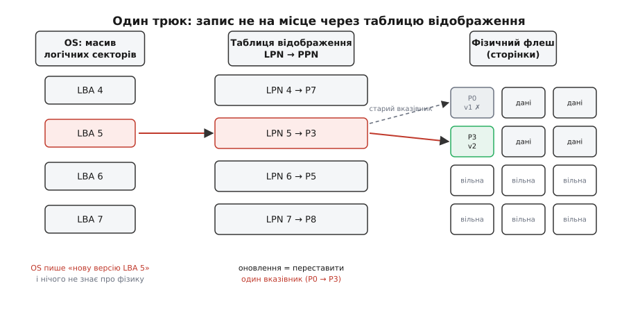
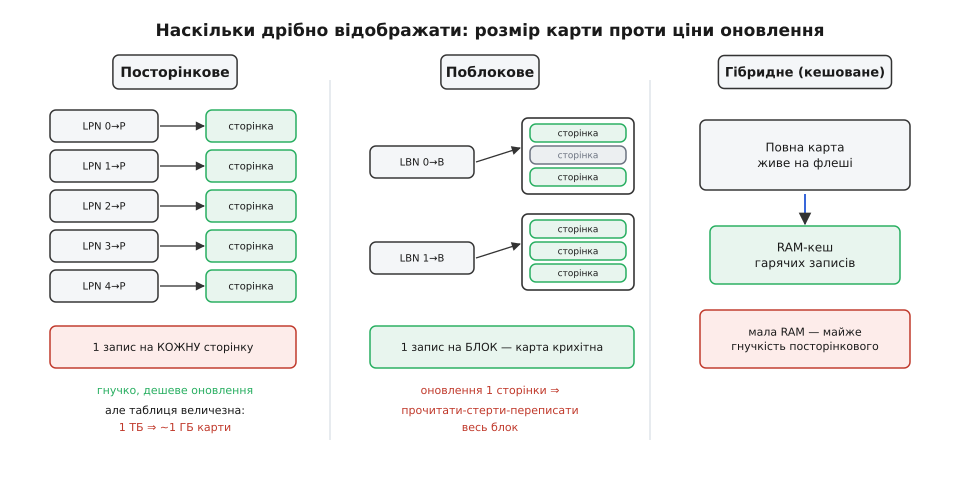
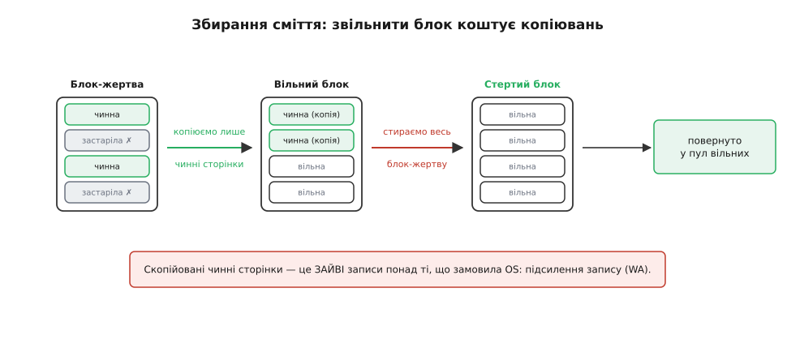

# Шар трансляції флешу (FTL)

<preknowlist>
- [Flash зсередини](topic:hw-components/flash-internals) — як флеш зберігає біти: читання й запис посторінково, стирання лише цілими блоками, скінченний ресурс перезаписів комірки.
</preknowlist>

Операційна система дивиться на будь-який накопичувач гранично просто: це довгий масив однакових комірок-секторів, пронумерованих від нуля, і кожен сектор можна прочитати або **перезаписати** будь-коли й будь-скільки разів. На цій обіцянці збудовані всі файлові системи. Команда «поклади цей вміст у сектор 5» мусить спрацювати незалежно від того, що там лежало раніше, — інакше жоден файл не оновиш.

Флеш-пам'ять цієї обіцянки виконати не може. І не через недоробку інженерів, а через власну фізику, яку [видно зсередини комірки](topic:hw-components/flash-internals). Флеш живе за трьома жорсткими правилами:

- **Пишуть і читають посторінково.** Сторінка — це кілька кілобайтів; дрібніше не звернешся.
- **Стерти окрему сторінку не можна.** Стирання йде лише цілим **блоком** — десятками, а то й сотнями сторінок за раз.
- **Записати у сторінку можна, лише якщо вона перед тим стерта.** Повторний запис «поверх» заборонений фізично. А кожне стирання потроху руйнує ізолятор комірки: блок витримує обмежене число циклів — тисячі, десятки тисяч, і все.

Складімо ці правила разом і подивімося, у що перетворюється невинне «перезапиши сектор 5». Треба знайти блок, де цей сектор лежить, **стерти весь блок** — а разом із нашим сектором у ньому живуть десятки чужих, ще потрібних, — тоді записати блок наново. Одне логічне оновлення обертається читанням, стиранням і перезаписом сотні сусідів. Дорого й повільно. Гірше: якби якийсь гарячий лічильник переписувався тисячу разів на секунду, він за години зносив би свій блок до смерті, поки решта флешу лишалася б незайманою.

Прірва між тим, чого **хоче** система (вільно перезаписуваний масив секторів), і тим, що **вміє** флеш (пиши раз, стирай гуртом, зношуйся), — і є причина існування FTL. **Шар трансляції флешу** (англ. *Flash Translation Layer*; *translatio* — лат. «перенесення») — це прошарок, який перекладає логічні адреси у фізичні так, щоб зверху флеш виглядав звичайним диском, а знизу жив за своїми правилами. Він народився на початку 1990-х саме як спосіб змусити нову дивну пам'ять прикинутися старим знайомим диском, щоб її прийняли наявні файлові системи.

> 📜 **Поряд — історична вставка:** [як народився FTL](topic:sf-data/ftl-flash-translation/hist-ftl-birth.md) — ізраїльська M-Systems, її TrueFFS, показаний 1992-го, патент Аміра Бана й специфікація FTL, яку 1994-го затвердила PCMCIA; і чому «зробити флеш схожим на диск» виявилося ключем до всієї індустрії.

## Один трюк: не переписуй, а перенаправ

Уся хитрість FTL тримається на єдиній ідеї — **непрямій адресації**. Якщо сторінку не можна переписати на місці, то й не треба. Коли надходить нова версія сектора 5, FTL бере **іншу**, заздалегідь стерту й вільну сторінку, кладе дані туди, а в окремій табличці записує: «сектор 5 віднині живе ось тут». Стара сторінка нікуди не зникає — вона просто оголошується **застарілою**, недійсною, майбутнім сміттям. Це називають **записом не на місце** (*out-of-place update*): дані ніколи не лягають поверх старих, завжди — на чисте.

По суті це та сама дисципліна, що й [копіювання-при-записі](topic:sf-algorithms/copy-on-write-structures): нічого не міняємо на місці, натомість пишемо нову копію й переставляємо вказівник на неї. Різниця лише в тому, що тут її нав'язує не бажання мати незмінні знімки, а фізична неможливість стерти одну сторінку.

Серцем усього стає **таблиця відображення** — карта з логічних номерів сторінок (LPN, *logical page number*) у фізичні (PPN, *physical page number*). Це і є та структура даних, заради якої затіяна вся стаття. У найпростішому вигляді вона — звичайний масив, проіндексований логічним номером: `map[LPN]` віддає фізичну адресу за одне звертання.


*Уся механіка FTL на одному кадрі. OS пише «нову версію LBA 5» і вважає, що перезаписала сектор на місці. Насправді FTL кладе дані у вільну фізичну сторінку P3, переставляє єдиний запис у таблиці (LPN 5 тепер вказує на P3), а стара сторінка P0 оголошується застарілою — недійсною v1, яку колись доведеться прибрати. Жодного стирання «поверх» не сталося: запис пішов на чисте, а вся «магія перезапису» звелася до одного нового вказівника.*

Ось як виглядає шлях запису в коді контролера. Мова тут — C: FTL живе у прошивці накопичувача, на маленькому вбудованому процесорі, де рахують кожен такт і кожен байт.

```c
// LPN — логічний номер сторінки (що дала OS), PPN — фізичний (де реально лежить)
uint32_t map[N_LOGICAL];                 // таблиця відображення: map[LPN] = PPN

void ftl_write(uint32_t lpn, const void *data) {
    uint32_t old_ppn = map[lpn];         // де лежала попередня версія
    uint32_t new_ppn = alloc_free_page();// беремо свіжу, вже стерту сторінку
    flash_program(new_ppn, data);        // пишемо НЕ поверх старої
    map[lpn] = new_ppn;                   // переставляємо один вказівник
    if (old_ppn != NONE)
        mark_invalid(old_ppn);           // стара версія стала сміттям
}
```

Читання симетричне й тривіальне: `flash_read(map[lpn])`. Обидві операції — пошук за індексом у масиві, тобто O(1); ніяких дерев чи хешів для базового відображення не треба. Уся складність FTL ховається не в пошуку, а в тому, що станеться далі зі стертими сторінками, які закінчуються, і зі сміттям, яке накопичується.

> 🔧 **Навіщо це.** FTL — не академічна абстракція, а те, що просто зараз крутиться в кожному вашому SSD, у пам'яті телефона (eMMC/UFS), у SD-картці, у флешці й у мікроконтролері з вбудованим флешем. Без цього прошарку файлова система бачила б голий флеш із його забороною перезапису й миттєвим зносом гарячих секторів — і жодна звична ФС на ньому просто не працювала б. Саме [SSD та eMMC ховають FTL усередині свого контролера](topic:hw-arch/emmc-ssd), тому зовні виглядають як звичайний диск.

## Наскільки дрібно відображати

Таблиця відображення розв'язує все — але скільки вона важить? Це головний компроміс у проєктуванні FTL, і він суто структурний: чим дрібніша одиниця відображення, тим гнучкіше, але тим більша карта.

**Порахуймо посторінкову карту.** Візьмімо накопичувач на 1 ТБ зі сторінкою 4 КБ.

```
сторінок     = 1 ТБ / 4 КБ = 2⁴⁰ / 2¹² = 2²⁸ ≈ 268 млн
запис у карті = 4 байти (вистачить, щоб адресувати 2²⁸ сторінок)
розмір карти  = 2²⁸ · 4 Б = 2³⁰ Б = 1 ГБ
```

Цілий гігабайт швидкої RAM — лише під карту, і то на кожен терабайт місткості. Для дешевого контролера це неприйнятно. Звідси й розвилка гранульованості.

**Поблокове відображення** йде в протилежний бік: один запис у карті на цілий блок, а не на сторінку. Карта миттєво худне у стільки разів, скільки сторінок у блоці (часто в 128–256). Але ціну ми лише пересунули. Тепер блок відображається як єдине ціле, тож щоб змінити **одну** сторінку в ньому, доводиться зібрати новий блок повністю: прочитати старий, підмінити в ньому потрібну сторінку, записати результат у свіжий стертий блок і переставити вказівник. Дрібне оновлення тягне за собою читання-стирання-перезапис цілого блоку — рівно та біда, від якої ми тікали.

**Гібридні та кешовані схеми** знімають дилему. Ідея: повна посторінкова карта лежить не в RAM, а на самому флеші (їй там і місце — вона теж дані), а в дорогій RAM тримають лише **кеш** її гарячих шматків — тих логічних сторінок, до яких звертаються зараз. Робоче навантаження майже завжди локальне: активна купка адрес мала, решта спить. Тож маленький кеш дає майже всю гнучкість посторінкового відображення за малу RAM. На цьому принципі побудовані реальні контролери (одна з класичних схем так і зветься — кешоване посторінкове відображення).


*Гранульованість — це торг між розміром карти й ціною оновлення. Посторінкова карта гнучка й оновлюється дешево (переставив вказівник), але роздута до гігабайтів. Поблокова карта крихітна, зате оновлення однієї сторінки перетворюється на перезбирання цілого блоку. Гібридна схема тримає повну карту на флеші, а в RAM кешує лише гарячі записи — і так дістає майже гнучкість посторінкової за малу пам'ять.*

## Сміття доводиться прибирати

Запис не на місце має неминучий наслідок: застарілі сторінки накопичуються. Кожне оновлення сектора лишає по собі одну мертву копію. Рано чи пізно вільних, стертих сторінок майже не лишається — а писати можна тільки на них. Хтось мусить перетворювати сміття назад на чистий простір. Цей хтось — **збирач сміття** (*garbage collection*, GC).

Механіка проста й невблаганна. GC вибирає **блок-жертву**, у якому переважно недійсні сторінки, **копіює** з нього ще живі сторінки в інший, вільний блок (заразом оновлюючи для них карту), а тоді **стирає жертву цілком** — тепер, коли всі її потрібні дані врятовані. Стертий блок повертається у пул вільних. Так недійсні сторінки, розсіяні по флешу, згортаються назад у придатний до запису простір.


*Чому вільне місце коштує роботи. У блоці-жертві живі й мертві сторінки перемішані; стерти його «як є» не можна — пропадуть живі. Тому GC спершу копіює чинні сторінки у вільний блок, і лише тоді стирає жертву цілком, повертаючи її в пул. Ті копіювання — записи, яких OS не замовляла.*

І тут криється підступ, що визначає довговічність і швидкість накопичувача. Копіювання живих сторінок під час GC — це **зайві записи**, понад ті, що просила система. Записав користувач 1 МБ, а флеш насправді перемолов 3 МБ, бо GC довелося перетягати чужі живі сторінки. Це відношення й називають [підсиленням запису](topic:sf-data/write-amplification) (*write amplification*): що воно більше, то швидше зношується флеш і то повільніший накопичувач під навантаженням. Уся дальша складність FTL — це, по суті, боротьба за менше підсилення запису.

Два важелі тримають його в шорах. Перший — **політика вибору жертви**: жадібна стратегія бере блок із найбільшою часткою мертвих сторінок (там копіювати найменше), розумніші зважають ще й на «холодність» даних, щоб не ганяти туди-сюди те, що й так лежить нерухомо. Це вже окрема тема — [збирання сміття у флеш-сховищах](topic:sf-data/flash-garbage-collection). Другий важіль — **надлишок місткості**: накопичувач ховає від користувача частину сторінок (скажімо, 7–28 %) як резерв суто для GC. Цей [запас над оголошеною місткістю](topic:sf-algorithms/over-provisioning) означає, що вільні блоки не закінчуються раптово, GC працює завчасно й спокійно, а не в паніці, — і підсилення запису падає.

## Рівномірний знос і биті блоки

Лишається згадана на початку загроза — знос. Кожне стирання наближає блок до смерті, а GC стирає блоки постійно. Якби FTL збирав сміття завжди з тих самих кількох блоків, вони б померли за місяці, тоді як блоки з «холодними» даними (що лежать роками й не оновлюються) стояли б майже незношені. Тому FTL навмисне **розрівнює знос**: скеровує нові записи в блоки з найменшим лічильником стирань, а зрідка й силоміць переселяє холодні дані з мало зношених блоків, щоб звільнити їх під загальну ротацію. Мета — щоб усі блоки старіли приблизно однаково й накопичувач помер не передчасно через кілька «мучеників». Це окремий, тісно сплетений із FTL механізм — [вирівнювання зносу](topic:sf-data/wear-leveling).

А ще частина блоків просто **биті** — або з заводу, або зносилися з часом. FTL веде табличку бракованих блоків і прозоро обходить їх, підміняючи справними зі свого резерву, так що OS ніколи їх не бачить. Це [керування бракованими блоками](topic:sf-data/bad-block-management), яке працює тихо під тим самим шаром відображення.

## Що буде після вимкнення живлення

Уся карта відображення живе в RAM — заради швидкості. Але RAM забуває все, щойно зникне живлення, а карта — це єдине, що знає, де насправді лежить сектор 5. Втратити її означало б перетворити весь флеш на купу безіменних сторінок. Тож карта мусить **пережити** вимкнення, зокрема раптове.

Рятує та сама природа флешу як журналу. Кожна фізична сторінка, крім даних, має невеличку **службову область** (*out-of-band*, OOB), і FTL записує в неї, кому ця сторінка належить: її логічний номер і **порядковий номер** (версію) запису. Тепер карта стає **відновлюваною з самого флешу**: після вмикання контролер проходить сторінки (спираючись на компактні контрольні точки й журнал, щоб не читати геть усе) і відбудовує таблицю, а порядкові номери підказують, яка з кількох копій однієї логічної сторінки — найновіша. Дані самі несуть свій індекс. Саме тому FTL по суті є журналом — і це підводить до найширшого погляду на всю конструкцію.

## Ширший погляд: FTL — це журнальне сховище

Відступімо на крок і подивімося на форму цілого. Записи ллються потоком у свіжі стерті сторінки — це **дописування в журнал**. Окремий індекс (таблиця відображення) вказує на **найновіше** місце кожного ключа. Фонове збирання сміття ущільнює журнал, викидаючи перекриті версії. Ця трійця — журнал плюс індекс плюс ущільнення — і є визначенням [журнального, log-structured сховища](topic:sf-data/log-structured-storage).

Форма ця не унікальна для флешу — вона повторюється всюди, де запис не на місце дешевший за запис на місце. Та сама ідея рухає [LSM-дерева](topic:sf-data/lsm-tree) в основі сучасних баз даних, журнальні файлові системи на дисках і навіть версійні сховища. FTL — це, у певному сенсі, крихітна база даних «ключ — значення», зашита у прошивку накопичувача, де ключ — логічна адреса, а значення — вміст сторінки. Побачивши цей спільний кістяк раз, ви впізнаватимете його знову й знову.

> ⚙️ **Поряд — код-вставка:** [навчальний FTL у ~150 рядках C](topic:sf-data/ftl-flash-translation/proj-ftl-sim-c.md) — модель флешу з блоків і сторінок, посторінкова таблиця, запис не на місце, жадібне збирання сміття й лічильник підсилення запису, який на очах показує, як надлишок місткості й локальність записів впливають на WA.

Варто підбити підсумок так, як його бачить інженер. Стара приказка каже: будь-яку проблему в інформатиці можна розв'язати ще одним рівнем непрямої адресації. FTL — її чистий взірець. Одна табличка вказівників перетворює впертий носій — той, що не терпить перезапису на місці, стирається лише гуртом і зношується від кожного стирання — на охайний, вільно перезаписуваний масив секторів, у який вірить операційна система. А все інше — збирання сміття, вирівнювання зносу, відновлення після збою — це ціна й повсякденний догляд за цією ілюзією. Ілюзією, без якої не запустився б жоден сучасний пристрій із флеш-пам'яттю.
