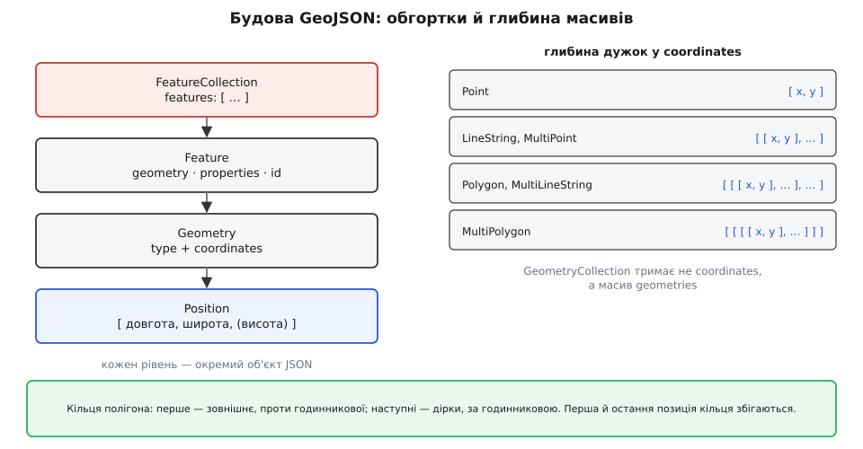
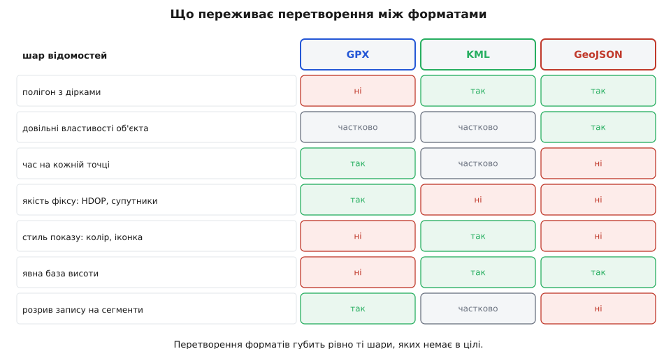

# Формати гео-даних: GeoJSON, KML, GPX

<preknowlist>
- [JSON](root:sf-data/json-format) — текстовий запис об'єктів, масивів і чисел: ключ, значення, вкладений масив.
- [XML](root:sf-data/xml-markup) — дерево елементів із тегами й атрибутами, простори імен, перевірка за схемою.
- [WGS-84](root:math-geometry/wgs84-datum) — еліпсоїд і датум, до яких прив'язані широта й довгота супутникової навігації.
- [Числа з рухомою комою](root:hw-arch/floating-point) — чому дробове число в машині зберігається наближено і що таке крок сітки представних значень.
</preknowlist>

Уявіть файл, у якому лежать два числа: `50.4501` і `30.5234`. Це місце? Ще ні. Поки що це просто два дробові числа, і програма, що їх прочитає, не має підстав вважати їх координатами. А якщо навіть вважатиме — не знатиме головного. Котре з них широта, а котре довгота? Це градуси чи, скажімо, гради? Відкладені від якої поверхні — бо Земля не куля, і «широта 50.4501°» на одній математичній моделі Землі та на іншій вказує на точки, що можуть розійтися на сотні метрів. Якщо поруч з'явиться третє число, `179.2`, — це висота над чим: над рівнем моря, над ґрунтом чи над математичною поверхнею, якої в природі не існує? І, врешті, що ця точка означає: ріг ділянки, стовп, чи мить, коли трекер увімкнули?

Жодну з цих відповідей неможливо вивести з самих чисел. Їх треба **домовитися записати** — і саме це робить формат гео-даних. Він фіксує чотири речі, і кожна з них потрібна, бо без будь-якої з них решта втрачає сенс:

1. **Що означають числа** — система координат, порядок, одиниці, база для висоти.
2. **Як із точок складається форма** — точка, лінія, площа з отворами; де межа однієї фігури, а де починається інша.
3. **Що можна причепити до форми** — назву, час, довільні властивості, вигляд на карті.
4. **Як усе це лягає в байти файлу** — текст чи двійкові дані, скільки знаків числа, яке кодування символів.

Три формати, які трапляються найчастіше, — **GeoJSON**, **KML** і **GPX** — відповіли на ці чотири питання по-різному. Не тому, що автори не змогли домовитися: кожен народився зі своєї практичної потреби, і форма кожного — точний відбиток його питання.


*GPX виріс із приладу, що записує шлях, і відповідає на питання «де я був і коли». KML виріс із земного браузера й відповідає «що показати й як». GeoJSON виріс із вебу й відповідає «які об'єкти і з якими властивостями». Різні питання — різні структури й різні втрати.*

Ця різниця в питаннях пояснює майже все інше, тож [обставини народження кожного з трьох](root:sf-data/geo-data-formats/hist-three-births.md) варті окремої розповіді: хто, коли й проти якої незручності їх робив. Тут же ми йдемо від структури до наслідків — що кожен формат уміє записати, а що мовчки губить.

### Спільний фундамент: WGS-84 і десяткові градуси

Перший шар — значення чисел — усі три вирішили однаково, і це рідкісний випадок повної згоди.

Щоб широта й довгота вказували на конкретне місце, потрібна **математична фігура Землі**, від якої їх відкладають, і прив'язка цієї фігури до самої планети — разом це зветься **датум** (лат. *datum* — «дане», те, що взято за основу). Без датуму координата — як довжина без одиниці. Різні датуми будували в різні епохи й під різні регіони, тож ті самі числа в різних датумах указують на різні точки, і розбіжність буває від десятків до сотень метрів — більша за все, що дає похибка сучасного приймача.

Усі три формати обрали **WGS-84** — той самий датум, у якому працює [супутникова навігація](root:hw-sensing/gnss), — і десяткові градуси. GPX закріпив це прямо в схемі: широта й довгота «завжди в десяткових градусах і завжди в датумі WGS84». RFC 7946 для GeoJSON каже те саме й забирає будь-який вибір. KML успадкував ту саму прив'язку від земного браузера, який показує глобус саме на WGS-84.

Згода закінчується на **порядку чисел**. GeoJSON пише позицію як масив `[довгота, широта]` — спершу довгота. Це не примха: у математичній парі `(x, y)` першою йде горизонтальна вісь, а довгота — саме вона. KML пише те саме в один рядок через кому: `довгота,широта[,висота]`. GPX не пише порядку взагалі — там це два **іменовані атрибути**, `lat` і `lon`, і переплутати їх неможливо навіть теоретично.

А люди говорять і пишуть у зворотному порядку: «п'ятдесят із половиною північної, тридцять із половиною східної». Звідси найпоширеніша помилка всієї галузі — числа міняються місцями десь на межі між форматами, і точка тихо переїжджає.

> 🔧 **Навіщо це.** Візьміть київську пару `50.4501, 30.5234` і подайте її в GeoJSON у тому вигляді, в якому вона записана, — вийде `[50.4501, 30.5234]`, тобто довгота 50.45° і широта 30.52°. Це узбережжя Перської затоки в Ірані, за три тисячі кілометрів від Києва. Найгірше, що така помилка **не падає**: обидва числа в допустимих межах, файл валідний, карта малюється. Тому в коді, що приймає координати ззовні, тримайте два правила. Перше: у назвах змінних і полів ніколи не пишіть `coords[0]`, пишіть `lon` і `lat` — іменована пара не міняється місцями. Друге: після розбору файлу перевіряйте, чи точка потрапила в очікувану область (обмежувальний прямокутник вашого району) — це два порівняння, що ловлять клас помилок, який більше не ловить ніщо.

### Третє число: над чим рахують висоту

З висотою згоди вже немає — і саме тут ховається найтихіша розбіжність між трьома форматами.

Висота потребує нуля, і природних кандидатів на нуль два. Перший — **еліпсоїд** WGS-84: гладка математична поверхня, задана двома числами, від якої легко рахувати, але яка ніде фізично не існує. Другий — **геоїд** (гр. *gê* — земля, *eîdos* — вигляд): поверхня однакового потенціалу сили тяжіння, продовжена під материки, тобто той рівень, на якому стояла б вода. Геоїд фізично осмислений — саме до нього прив'язані всі «висоти над рівнем моря» на картах, — але описується не двома числами, а моделлю з тисяч коефіцієнтів.

Ці дві поверхні не збігаються. Відхилення геоїда від еліпсоїда, яке позначають `N`, у моделі EGM96 змінюється приблизно від −105 м біля Індійського океану до +85 м біля Ісландії. Тому в кожній точці існують дві різні висоти, пов'язані простим співвідношенням:

```
h = H + N

h — висота над еліпсоїдом WGS-84 (те, що обчислює приймач із геометрії)
H — висота над геоїдом, тобто «над рівнем моря» (те, що показують карти)
N — хвиля геоїда в цій точці (з моделі, наприклад EGM96)
```


*Три поверхні й три висоти. Приймач природно рахує `h` — до еліпсоїда, бо еліпсоїд заданий формулою. Людині потрібне `H` — до рівня моря. Різниця `N` доходить до сотні метрів, тож переплутати `h` і `H` — це помилитися на висоту хмарочоса.*

Три формати вирішили це по-різному. **GeoJSON** говорить прямо: необов'язковий третій елемент позиції — «висота в метрах над еліпсоїдом WGS-84 або під ним», тобто `h`. **KML** при `altitudeMode` зі значенням `absolute` міряє висоту від рівня моря, і Google Earth бере за цей рівень геоїд EGM96 — тобто `H`. **GPX** у схемі каже лише «висота точки в метрах» і не уточнює, від чого; натомість дає окремий елемент `geoidheight` — «висота геоїда (середнього рівня моря) над еліпсоїдом WGS84, як у повідомленні NMEA GGA», тобто те саме `N`. Це не випадковість: приймачі беруть обидва числа просто з рядка NMEA, де вони й лежать поруч.

Наслідок практичний і неприємний. Якщо взяти висоту з GPX і покласти її в GeoJSON без перетворення, ви оголосили `H` як `h` і зсунули точку по вертикалі рівно на `N` — у наших широтах це десятки метрів. Файл при цьому лишиться валідним, а помилку побачить хіба той, хто накладе трек на модель рельєфу й здивується, чому шлях іде під землею. Що саме таке геоїд і чому «рівень моря» — не одна поверхня, а ціла модель, розібрано [окремо](root:math-geometry/geoid-and-amsl).

### GeoJSON: об'єкт із властивостями

GeoJSON (гр. *gê* — земля, плюс JSON) розв'язує другий і третій шари так, як це природно для вебу: геометрія — це вкладені масиви чисел, а все інше — звичайні поля об'єкта.

Синтаксис уже був готовий — [JSON](root:sf-data/json-format) уміє масиви й об'єкти. Бракувало домовленості про те, **який саме** JSON вважати геометрією, бо без неї кожна бібліотека вигадувала свою. GeoJSON — це така домовленість і нічого більше: чотири рівні вкладення, кожен із яких — звичайний об'єкт JSON.


*Позиція — масив чисел; геометрія — тип плюс `coordinates` потрібної глибини; `Feature` додає до геометрії властивості й ідентифікатор; `FeatureCollection` збирає об'єкти в одну колекцію. Глибина дужок у `coordinates` однозначно задана типом — саме тут найлегше помилитися на один рівень.*

**Позиція** — масив із двох або трьох чисел: довгота, широта і, за потреби, висота. Стандарт окремо застерігає не додавати четвертого елемента, «бо семантика зайвих елементів не визначена й неоднозначна». Це важливіше, ніж здається: спокуса покласти четвертим числом час або точність виникає в кожного, хто перетворює трек, і кожен такий файл ламає чужі парсери.

**Геометрія** — об'єкт із полями `type` і `coordinates`; типів сім: `Point`, `MultiPoint`, `LineString`, `MultiLineString`, `Polygon`, `MultiPolygon` і `GeometryCollection` (останній тримає не `coordinates`, а масив геометрій). Глибина вкладення `coordinates` жорстко випливає з типу: у точки це масив чисел, у лінії — масив позицій, у полігона — масив кілець, тобто масив масивів позицій, у мультиполігона — ще на рівень глибше.

**Feature** загортає геометрію разом із полем `properties` — довільним об'єктом JSON (або `null`), куди йдуть усі прикладні дані, — і необов'язковим `id`. **FeatureCollection** тримає масив таких об'єктів у полі `features`. Обидва можуть нести `bbox` — обмежувальний прямокутник, записаний як усі осі південно-західного кута, а потім усі осі північно-східного; це дозволяє програмі відсіяти файл, не читаючи його геометрії.

**Ділянка з вирізом і точка на ній.**

```json
{
  "type": "FeatureCollection",
  "features": [
    {
      "type": "Feature",
      "id": "well-17",
      "geometry": {
        "type": "Point",
        "coordinates": [30.523400, 50.450100, 179.2]
      },
      "properties": { "name": "свердловина 17", "depth_m": 84 }
    },
    {
      "type": "Feature",
      "geometry": {
        "type": "Polygon",
        "coordinates": [
          [[30.5200, 50.4480], [30.5280, 50.4480], [30.5280, 50.4530],
           [30.5200, 50.4530], [30.5200, 50.4480]],
          [[30.5230, 50.4495], [30.5230, 50.4515], [30.5255, 50.4515],
           [30.5255, 50.4495], [30.5230, 50.4495]]
        ]
      },
      "properties": { "name": "ділянка з вирізом" }
    }
  ]
}
```

Полігон тут показує три правила, які варто знати напам'ять. Перше: кільце **замкнене** — перша й остання позиція мусять мати ідентичні значення, і саме значення, а не «майже такі самі». Друге: **перше кільце зовнішнє**, решта — отвори. Третє: кільце обходиться за **правилом правої руки** — зовнішнє проти годинникової стрілки, отвори за годинниковою. У прикладі зовнішнє кільце йде вправо низом, угору правим боком, вліво верхом, тобто проти годинникової; внутрішнє — навпаки.

Напрям обходу здається формальністю, поки не згадати, що на сфері замкнена лінія ділить поверхню на дві частини, і жодна з них не «внутрішня» сама по собі. Саме напрям обходу каже, яку з двох половин ви маєте на увазі. Полігон із переверненим зовнішнім кільцем формально описує **всю Землю за винятком вашої ділянки** — і бібліотеки, що рахують площу чи перевіряють належність точки, чесно це й видадуть.

RFC 7946 (серпень 2016) прийняв ще два рішення, які варто розуміти як рішення, а не як обмеження.

Перше: **єдина система координат**. Чернетка 2008 року дозволяла оголосити в файлі власну систему через поле `crs`; RFC це поле прибрав, пояснивши, що різні системи «показали проблеми зі сумісністю». Логіка проста: формат, який обіцяє «будь-яку систему координат», насправді не обіцяє нічого — щоб прочитати такий файл, кожній програмі потрібна повна бібліотека [картографічних проєкцій](root:math-geometry/map-projections). Прибравши вибір, стандарт зробив читання GeoJSON тривіальним для будь-кого.

Друге: **розрізання по антимеридіану**. Довгота обривається на ±180°, тож фігура, що перетинає цю лінію, у наївному записі стає стрічкою через увесь глобус у зворотний бік. Стандарт велить різати такі геометрії на частини, жодна з яких меридіана не перетинає, — лінію на `MultiLineString`, площу на `MultiPolygon`. Це не косметика: без розрізу програма, що просто з'єднує точки за зростанням індексу, намалює лінію навколо світу.

### KML: не дані, а показ

KML — Keyhole Markup Language (англ. «мова розмітки Keyhole», за назвою компанії, чий земний браузер став Google Earth) — відповідає на інше питання. Не «які об'єкти є», а «що показати на глобусі й яким воно має бути на вигляд». Через це його структура — не модель даних, а сценарій показу, записаний в [XML](root:sf-data/xml-markup).

Одиниця KML — `Placemark`, мітка: назва, необов'язкове посилання на стиль, необов'язкові прикладні поля в `ExtendedData` і рівно одна геометрія. Геометрії ті самі, що й у GeoJSON (`Point`, `LineString`, `Polygon`, `MultiGeometry`), бо KML 2.2 узяв їх із GML. Мітки складають у `Folder` і `Document` — і ця вкладеність теж про показ: тека в KML — це рядок у дереві шарів, який користувач вимикає галочкою.

**Та сама свердловина в KML.**

```xml
<?xml version="1.0" encoding="UTF-8"?>
<kml xmlns="http://www.opengis.net/kml/2.2">
  <Document>
    <Style id="well">
      <IconStyle>
        <color>ff0000ff</color>
        <scale>1.2</scale>
      </IconStyle>
    </Style>
    <Placemark>
      <name>свердловина 17</name>
      <styleUrl>#well</styleUrl>
      <ExtendedData>
        <Data name="depth_m"><value>84</value></Data>
      </ExtendedData>
      <Point>
        <altitudeMode>absolute</altitudeMode>
        <coordinates>30.523400,50.450100,179.2</coordinates>
      </Point>
    </Placemark>
  </Document>
</kml>
```

Чотири речі в цьому фрагменті чужі для GeoJSON і саме тому характерні для KML.

**Стиль — частина файлу.** `Style` описує колір і розмір іконки, `styleUrl` на нього посилається; є ще `StyleMap`, що дає різний вигляд для звичайного й підсвіченого стану. Колір записаний як `ff0000ff`, і порядок каналів тут **aabbggrr** — прозорість, синій, зелений, червоний, тобто дзеркально до звичного `#rrggbb`. Перекладаючи стилі з вебу, цей рядок перевертають чи не всі й один раз.

**Координати — один текстовий вузол.** Усі точки геометрії лежать в одному елементі `coordinates`: складники розділені комами, самі точки — пропусками або переносами рядків. Пропуск усередині трійки заборонений, бо саме пропуск розділяє точки. Це означає, що розбір `coordinates` — не робота XML-парсера, а ваша власна: парсер віддасть один довгий рядок, і різати його на числа доведеться самотужки.

**База висоти оголошена явно.** `altitudeMode` має значення `clampToGround` (висота ігнорується, об'єкт кладеться на рельєф; це поведінка за замовчуванням), `relativeToGround` (від землі під об'єктом) і `absolute` (від рівня моря). Розширення Google додає ще `clampToSeaFloor` і `relativeToSeaFloor`. KML — єдиний із трьох, де база висоти є полем даних, а не домовленістю поза файлом.

**Файл може бути живим.** `NetworkLink` каже браузеру періодично тягнути KML за адресою — так KML перетворюється на канал даних, а не на знімок. Поруч живуть `GroundOverlay` (картинка, накладена на рельєф), `TimeStamp` і `TimeSpan` (мітка існує лише у своєму проміжку часу, і повзунок часу її показує чи ховає), а KML 2.3 узяв із розширень Google `Track` і `MultiTrack` — геометрію, де кожній координаті відповідає свій момент часу.

Оскільки таких файлів разом із іконками, накладками й тривимірними моделями буває багато, є **KMZ** — звичайний ZIP-архів із одним кореневим `.kml` усередині та всіма ресурсами поруч. Це не окремий формат, а спосіб доправлення; будь-яка бібліотека роботи з ZIP розкриє його за три рядки.

KML 2.2 став стандартом OGC 14 квітня 2008 року (документ 07-147r2), KML 2.3 опублікували 4 серпня 2015-го.

### GPX: запис пройденого шляху

GPX — GPS Exchange Format (англ. «формат обміну даними GPS») — відповідає на третє питання: не «що є» і не «що показати», а «що прилад бачив і коли». Це формат **журналу вимірювань**, і його структура — структура запису, а не карти.

Верхніх сутностей три, і різниця між ними змістовна. `wpt` — окрема шляхова точка, названа й самодостатня. `rte` — маршрут, тобто впорядкований список точок, куди **треба** дістатися. `trk` — трек, тобто те, де ви **справді** були; трек ділиться на `trkseg`, а сегмент містить точки `trkpt`.

Поділ треку на сегменти — не оформлення, а зафіксований факт: схема прямо каже починати новий сегмент там, де приймання зникло або приймач вимкнули. Тобто GPX уміє сказати «між цими двома точками я не знаю, де ви були» — а ні GeoJSON, ні KML такого твердження виразити не можуть: у ламаній лінії сусідні точки завжди з'єднані.

**Два виміри одного треку.**

```xml
<?xml version="1.0" encoding="UTF-8"?>
<gpx version="1.1" creator="field-logger"
     xmlns="http://www.topografix.com/GPX/1/1">
  <trk>
    <name>обхід ділянки</name>
    <trkseg>
      <trkpt lat="50.450100" lon="30.523400">
        <ele>179.2</ele>
        <time>2026-04-18T07:12:03Z</time>
        <geoidheight>25.4</geoidheight>
        <fix>3d</fix>
        <sat>11</sat>
        <hdop>0.8</hdop>
      </trkpt>
      <trkpt lat="50.450180" lon="30.523510">
        <ele>179.4</ele>
        <time>2026-04-18T07:12:04Z</time>
      </trkpt>
    </trkseg>
  </trk>
</gpx>
```

Тут видно те, чого немає в жодного з двох інших: **час на кожній точці** й **якість вимірювання**. `time` — мітка в UTC за [ISO 8601](root:sf-data/iso-8601), причому схема окремо наголошує: саме всесвітній час, не місцевий, і дробові секунди дозволені. `fix` каже, яким було рішення навігаційної задачі (`2d`, `3d`, `dgps`), `sat` — скільки супутників узяли участь, `hdop` — геометричний множник, на який похибка вимірювання перетворюється на похибку в плані. Ці поля роблять GPX єдиним із трьох форматів, що зберігає не лише результат, а й **довіру до результату**.

Розширення в GPX винесені в окремий елемент `extensions`, куди дозволено класти елементи з будь-якого чужого простору імен. Саме туди виробники приладів складають своє: найпоширеніший приклад — Garmin `TrackPointExtension`, що додає пульс `hr`, каденс `cad` і температуру `atemp`. Файл із такими розширеннями лишається валідним GPX, а програма, яка про них не знає, просто їх пропускає — це і є мета механізму.

І одна пастка, що коштує години на рівному місці: у GPX 1.1 діти точки описані як `xsd:sequence`, тобто **порядок елементів жорсткий**: `ele`, `time`, `magvar`, `geoidheight`, `name`, далі `cmt`, `desc`, `src`, `link`, `sym`, `type`, `fix`, `sat`, `hdop`, `vdop`, `pdop` і наприкінці `extensions`. Поставте `<time>` перед `<ele>` — файл прочитається більшістю поблажливих програм, але не пройде перевірку за схемою, і сувора програма його відкине. Свій GPX варто хоч раз пропустити через валідатор схеми, поки помилка ще не розійшлася в тисячі файлів.

### Числа як текст: скільки знаків має сенс

Четвертий шар — байти — усі три вирішили однаково: **координата пишеться десятковим текстом**. Це не найкомпактніший вибір ([двійкове подання](root:com-protocol/data-serialization) на ті самі числа витрачає вдвічі-втричі менше), але саме він робить файли читними людиною й незалежними від порядку байтів у машині. Розплата в тому, що точність тепер вимірюється не бітами, а **знаками після коми**, і питання «скільки їх треба» стає інженерним.

Переклад знаків у метри виходить із довжини градуса. Один градус широти — це дуга меридіана: від 110.6 км біля екватора до 111.7 км біля полюсів, у середньому близько 111.1 км. Один градус довготи на екваторі — 111.32 км, а на широті `φ` — у `cos φ` разів менше.

**Скільки метрів коштує один знак після коми (по широті).**

```
знаків    крок у градусах    ≈ метрів
  3          0.001             111
  4          0.0001             11.1
  5          0.00001             1.11
  6          0.000001            0.111
  7          0.0000001           0.0111
```

Шість знаків дають приблизно 11 см — і саме цю цифру RFC 7946 називає розумною за замовчуванням, зауважуючи, що шість знаків «дають близько 10 сантиметрів». Це трохи точніше за побутовий приймач і дуже близько до межі, за якою знаки перестають нести інформацію й починають нести шум. Сьомий знак має сенс лише там, де вимірювання справді сантиметрове.

По довготі та сама кількість знаків коштує менше метрів, і що ближче до полюса, то менше:

```
1° довготи на широті 50.45°:
111.32 км · cos 50.45° = 111.32 · 0.6367 = 70.9 км
0.000001° довготи там же = 0.0709 м ≈ 7 см
```

Тепер найпідступніше. Текст читають у число, і тип цього числа вирішує все. Візьміть `float` завширшки 32 біти — і шість знаків, які ви так старанно зберегли, зникнуть ще до першого обчислення. Причина в тому, що [числа з рухомою комою](root:hw-arch/floating-point) розкладені по осі не рівномірно: крок сітки представних значень пропорційний самому значенню, а широта близько 50 градусів — це вже досить велике число.

**Крок сітки представних значень біля 50.45°.**

```c
#include <stdio.h>
#include <math.h>

int main(void) {
    const double MET_PER_DEG = 111100.0;   /* 1° широти ≈ 111.1 км */

    float  lat32  = 50.4501f;
    double step32 = (double)nextafterf(lat32, INFINITY) - (double)lat32;

    double lat64  = 50.4501;
    double step64 = nextafter(lat64, INFINITY) - lat64;

    printf("float : крок %.3e° = %.3f м\n",  step32, step32 * MET_PER_DEG);
    printf("double: крок %.3e° = %.3e м\n",  step64, step64 * MET_PER_DEG);
    return 0;
}
```

```
float : крок 3.815e-06° = 0.424 м
double: крок 7.105e-15° = 7.894e-10 м
```

Отже, у 32-бітному типі сусідні представні значення біля 50.45° розділені 42 сантиметрами: усе, що ви записали точніше, округлиться до найближчого вузла цієї сітки, і похибка сягне ±21 см — більше за похибку доброго приймача. У 64-бітному типі крок становить частки нанометра, тобто запас безмежний. Звідси залізне правило: **координати тримають у `double`**, і `float` для широти-довготи не годиться ніде, крім хіба що екранних обчислень, де все одно все зводиться до пікселів. Докладний підрахунок бюджету точності — скільки метрів дає кожен знак на кожній широті і як помилка накопичується при квантуванні — винесено [окремо](root:sf-data/geo-data-formats/math-coordinate-precision.md).

Зворотний бік текстового запису — розмір. Трек із мільйона точок, де кожна пара координат займає близько двадцяти символів, — це десятки мегабайтів там, де змісту на кілька сотень кілобайтів. Класичний прийом — писати не самі координати, а **різниці між сусідніми**: сусідні точки треку відрізняються в шостому знаку, тож різниці — маленькі цілі числа, які й стискаються краще, і місця займають менше. Саме так влаштований TopoJSON, розширення GeoJSON, зроблене Майком Бостоком у 2012 році: воно квантує координати на цілочислову сітку, зберігає різниці замість абсолютних значень і додатково не дублює спільні межі сусідніх полігонів, тримаючи їх як спільні дуги.

### Що губиться при перетворенні

Тепер видно головне. Три формати описують три різні **зрізи** реальності, тож перетворення між ними — не переклад слово в слово, а проєкція на бідніший простір. Втрати не випадкові: губиться рівно те, для чого в цільовому форматі немає місця.


*Кожен формат тримає свій набір шарів. Перетворення зберігає перетин наборів — усе, що є в джерелі, але відсутнє в цілі, зникає без жодного попередження.*

Розберімо три найчастіші напрямки.

**GPX → GeoJSON.** Геометрія переживає перетворення без утрат: сегмент треку стає `LineString`, увесь трек — `MultiLineString`. Гине час на кожній точці, бо позиція GeoJSON не має четвертого елемента, а стандарт прямо радить його не вигадувати. Гинуть `hdop`, `sat` і `fix`. Чесний вихід — покласти масив часових міток у `properties` поруч із геометрією, як паралельний масив тієї самої довжини; це не стандартизовано, зате не ламає чужі парсери й лишається читним.

**KML → GeoJSON.** Гине все, що стосується показу: стилі, теки, накладки, `NetworkLink`. Гине `altitudeMode` — і разом із ним **сенс третього числа**: висота, що була «над рівнем моря», стає в GeoJSON висотою «над еліпсоїдом», хоча жодна цифра не змінилася. Це той рідкісний випадок, коли перетворення не втрачає даних, а мовчки їх перебріхує; правильно тут не перенести число, а перерахувати `H` у `h`, додавши `N`.

**GeoJSON → KML.** Геометрія переживає, властивості лягають в `ExtendedData` — а от стиль доводиться вигадувати, бо в джерелі його не було. Тут втрати нема, є **домисел**: кожен конвертер малює по-своєму, і два різні інструменти дадуть різні на вигляд карти з того самого файлу.

> 🔧 **Навіщо це.** З цього випливає робоче правило конвеєра: **зберігайте оригінал і конвертуйте якнайпізніше**. Прилад пише GPX — тримайте GPX; він єдиний носій часу й якості фіксу. GeoJSON робіть на межі з вебом, з нього ж і віддавайте назовні. KML породжуйте останнім кроком, коли справді треба показати щось у земному браузері. Найгірший із можливих конвеєрів — ланцюжок «GPX → KML → GeoJSON → GPX»: на першому кроці ви втратите точність фіксу, на другому — стиль і базу висоти, на третьому — час, і назад уже нічого не відновиться. Робочий приклад такого перетворення з розбором того, що саме доводиться домислювати, — [окремо](root:sf-data/geo-data-formats/proj-gpx-to-geojson.md).

### Пастки, які коштують найдорожче

Усі перелічені нижче помилки мають спільну рису: **файл лишається валідним**, а помилка виявляється далеко від місця, де сталася.

**Порядок чисел.** `[довгота, широта]` в GeoJSON і KML проти звичного людині порядку. Ліки — іменовані поля в коді й перевірка потрапляння в очікувану область одразу після розбору.

**Незамкнене кільце.** GeoJSON вимагає ідентичних першої й останньої позицій. Кільце, замкнене «майже» — з різницею в останньому знаку, — формально невалідне, і сувора бібліотека його відкине, а поблажлива замкне сама, змінивши площу.

**Напрям обходу.** Перевернуте зовнішнє кільце описує весь глобус за винятком вашої ділянки. Перевіряти дешево: знакова площа кільця, порахована за формулою трапецій, від'ємна для одного напрямку і додатна для іншого.

**Антимеридіан.** Фігура, що перетинає ±180°, мусить бути розрізана. Інакше ламана піде навколо світу, а обмежувальний прямокутник розтягнеться на всю планету.

**Висота без бази.** Три формати мають три різні домовленості, і жодна програма не попередить про підміну. Правило: переносячи висоту між форматами, завжди питайте себе, `h` це чи `H`.

**Простір імен.** І GPX, і KML розпізнаються парсерами **за простором імен**, а не за назвою кореневого елемента. Файл з `xmlns="http://earth.google.com/kml/2.1"` замість `http://www.opengis.net/kml/2.2` для суворої бібліотеки — інший формат. Так само GPX 1.0 і 1.1 мають різні простори імен, і бібліотека, налаштована на 1.1, файл версії 1.0 просто не побачить.

**Кодування.** JSON обмінюють у UTF-8, XML оголошує кодування в першому рядку. Байтова позначка порядку на початку файлу ламає частину парсерів JSON і збиває оголошення XML — а українські назви в `name` без правильного [кодування](root:sf-data/ascii-utf8) перетворюються на кашу, помітну лише після того, як файл віддали замовнику.

**Розмір.** Читання файлу на сотні мегабайтів у пам'ять цілим деревом з'їдає в кілька разів більше пам'яті, ніж займає сам файл. Для великих геоданих читають **потоково**, а для швидкого пошуку «що є поруч» будують [просторовий індекс](root:sf-algorithms/spatial-index) — лінійний перебір мільйона фігур на кожен запит не рятує ніщо.

### Формат — це домовленість про те, що ви згодні забути

Три формати неможливо впорядкувати від гіршого до кращого, бо вони відповідають на різні питання, і кожен свідомо не вміє того, що для його питання зайве. GPX не має полігонів, бо трекер не обходить площ. KML не має типізованих властивостей, бо земний браузер показує, а не рахує. GeoJSON не має часу на точці, бо веб-карта малює миттєвий стан.

Тому вибір формату — це не вибір синтаксису й не питання смаку. Обираючи формат, ви обираєте, **на які питання зможете відповісти згодом**, коли вихідних даних уже не буде під рукою. Записали трек у GeoJSON — більше ніколи не дізнаєтеся, з якою похибкою міряв приймач і де зникало приймання. Записали ділянку в GPX — не збережете отвору всередині. Кожен формат — це коротка угода: ось це я обіцяю донести, а про решту домовмося, що вона не має значення. Помилка майже завжди в тому, що угоду підписали, не прочитавши другої половини.
