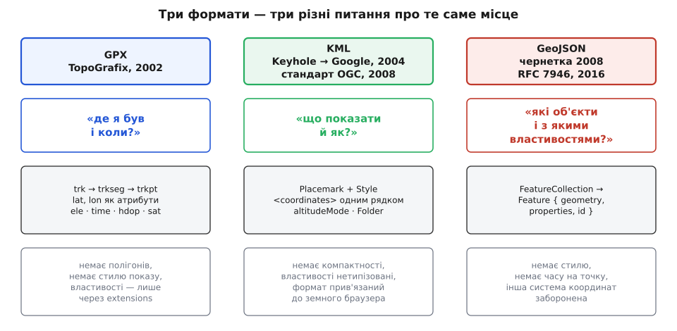
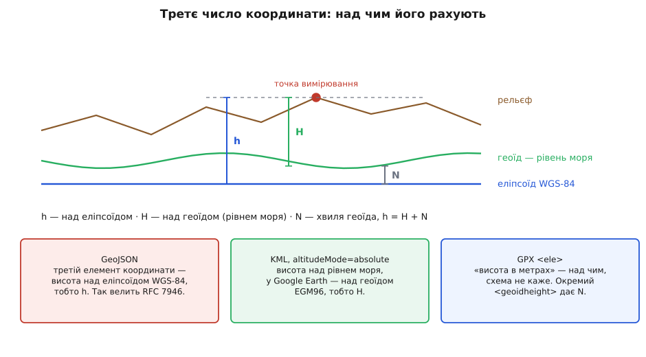

# Формати гео-даних: GeoJSON, KML, GPX

<preknowlist>
- [JSON](root:sf-data/json-format) — текстовий запис об'єктів і масивів: ключ, значення, вкладений масив чисел.
- [XML](root:sf-data/xml-markup) — дерево елементів із тегами, атрибутами й просторами імен.
- [WGS-84](root:math-geometry/wgs84-datum) — математична модель Землі, до якої прив'язані широта й довгота супутникової навігації.
- [Числа з рухомою комою](root:hw-arch/floating-point) — чому дробове число в машині зберігається наближено й що таке крок між сусідніми представними значеннями.
</preknowlist>

У файлі лежать два числа: `50.4501` і `30.5234`. Це місце? Ще ні. З самих чисел не видно, котре з них широта. Не видно, чи це градуси. Не видно, від якої поверхні їх відкладено — а Земля не куля, і на різних математичних моделях Землі ті самі числа вказують на точки, що розходяться на сотні метрів. Якщо поруч стане третє число, `179.2`, з нього так само не видно, це висота над рівнем моря чи над поверхнею, якої в природі не існує.

Жодної з цих відповідей число в собі не несе. Про них треба домовитися — і формат гео-даних є саме такою домовленістю. Він каже чотири речі: що означають числа; як із точок складається форма; що можна причепити до форми, крім координат; як усе це лягає в байти файлу.

Три найпоширеніші формати відповіли на ці питання по-різному, бо кожен виріс зі свого приладу й своєї потреби: GPX — із туристичного приймача, що пише шлях, KML — із програми, яка показує глобус, GeoJSON — із веб-карти. Хто, коли й проти якої незручності їх зробив — [окрема розповідь](root:sf-data/geo-data-formats/hist-three-births.md).


*GPX відповідає на питання «де я був і коли», KML — «що показати й як», GeoJSON — «які об'єкти і з якими властивостями». Різні питання дали різні структури й різні втрати.*

### Що всі троє вирішили однаково

Щоб широта й довгота вказували на конкретне місце, потрібна математична фігура Землі, від якої їх відкладають, і прив'язка цієї фігури до планети. Разом це зветься **датум** (лат. *datum* — «дане», те, що взято за основу). Без датуму координата — як довжина без одиниці: ті самі числа в різних датумах указують на різні точки, і розбіжність буває в сотні метрів.

Усі три формати взяли той самий датум — **WGS-84**, у якому працює [супутникова навігація](root:hw-sensing/gnss), — і десяткові градуси. Це рідкісний випадок повної згоди.

Згода закінчується на **порядку чисел**. GeoJSON пише позицію масивом `[30.5234, 50.4501]`, тобто спершу довготу: у парі `(x, y)` першою йде горизонтальна вісь. KML пише те саме в рядок через кому: `<coordinates>30.5234,50.4501,179.2</coordinates>`. GPX не має порядку взагалі — там це два іменовані атрибути: `<trkpt lat="50.4501" lon="30.5234">`. А люди говорять навпаки: спершу широта. Звідси найпоширеніша помилка галузі — числа міняються місцями на межі між форматами, і точка тихо переїжджає.

> 🔧 **Навіщо це.** Подайте київську пару `50.4501, 30.5234` у GeoJSON у тому вигляді, як вона записана, — вийде довгота 50.45° і широта 30.52°, тобто узбережжя Перської затоки. Найгірше, що така помилка не падає: обидва числа в допустимих межах, файл валідний, карта малюється. Тому в коді ніколи не пишіть `coords[0]` — пишіть `lon` і `lat`, бо іменована пара не міняється місцями. І після розбору файлу перевіряйте, чи точка потрапила в очікуваний прямокутник вашого району: два порівняння ловлять цілий клас помилок, який більше не ловить ніщо.

### Третє число: висота над чим

Нуля для висоти є два природні кандидати. Перший — **еліпсоїд** WGS-84: гладка поверхня, задана формулою, від якої зручно рахувати, але якої фізично немає. Другий — **геоїд** (гр. *gê* — земля, *eîdos* — вигляд): рівень, на якому стояла б вода, продовжений під материки. Геоїд фізично осмислений, до нього прив'язані всі «висоти над рівнем моря» на картах, але описується він не формулою, а моделлю з тисяч коефіцієнтів. Ці дві поверхні не збігаються, і в різних місцях планети розходяться на десятки метрів, а подекуди більше за сотню. Чому «рівень моря» — не одна поверхня, а ціла модель, розібрано [окремо](root:math-geometry/geoid-and-amsl); тут беремо цей факт готовим.


*Приймач природно рахує висоту до еліпсоїда, бо еліпсоїд заданий формулою. Людині потрібна висота над рівнем моря. Різниця між ними доходить до сотні метрів.*

Три формати вирішили це по-різному, і саме тут ховається найтихіша розбіжність. GeoJSON каже прямо: третє число — висота над еліпсоїдом. KML має поле `altitudeMode`, і зі значенням `absolute` висота міряється від рівня моря — тобто від геоїда. GPX не уточнює, від чого міряна його `<ele>`, зате дає окреме поле з відхиленням геоїда від еліпсоїда в цій точці, бо приймач бере обидва числа просто з рядка NMEA.

Наслідок неприємний. Перенесли висоту з KML у GeoJSON без перерахунку — і оголосили висоту над морем висотою над еліпсоїдом. Файл лишився валідним, жодна цифра не змінилася, а точка з'їхала по вертикалі на десятки метрів.

### Чим формати різняться по суті

**GeoJSON** описує **об'єкти з властивостями**. Геометрія — це `type` і вкладені масиви чисел; `Feature` додає до неї довільні поля `properties`, `FeatureCollection` збирає такі об'єкти разом. Площа записується кільцями: перше кільце зовнішнє, решта — отвори; кільце має бути замкнене, тобто перша й остання точки ідентичні.

**KML** описує **показ**. Його одиниця — мітка з назвою, геометрією і посиланням на стиль, а стилі, кольори й іконки лежать у тому самому файлі. Мітки складають у теки — це рядки в дереві шарів, які користувач вимикає галочкою. KML уміє те, чого не вміють інші: накладати картинку на рельєф, показувати мітку лише в її проміжок часу й періодично підтягувати свіжий файл за адресою.

**GPX** описує **запис приладу**. Трек ділиться на сегменти, і новий сегмент починають там, де приймання зникло, — тобто GPX уміє сказати «між цими двома точками я не знаю, де ви були», чого не виражають ні GeoJSON, ні KML. Кожна точка несе час у UTC і якість вимірювання: скільки супутників брало участь і яким було рішення навігаційної задачі. GPX єдиний із трьох зберігає не лише результат, а й довіру до результату.

### Точність вимірюється знаками після коми

Усі три пишуть координату десятковим текстом. Файл через це читний людиною й не залежить від машини, але точність тепер задають не біти, а знаки після коми. Один градус широти — близько 111.1 км, звідси проста таблиця:

```
знаків    крок у градусах    ≈ метрів
  4          0.0001             11.1
  5          0.00001             1.11
  6          0.000001            0.111
```

Шість знаків дають приблизно 11 см — цю цифру RFC 7946 (серпень 2016) називає розумною за замовчуванням, зауважуючи, що шість знаків «дають близько 10 сантиметрів». Це трохи точніше за побутовий приймач; сьомий знак має сенс лише там, де вимірювання справді сантиметрове.

І пастка, що зводить нанівець усю цю ощадність. Числа з рухомою комою розкладені по осі нерівномірно: крок між сусідніми представними значеннями пропорційний самому значенню. Біля широти 50° у 32-бітному типі цей крок становить 42 сантиметри — тобто збережені вами шість знаків округляться до найближчого вузла сітки ще до першого обчислення. Звідси залізне правило: **координати тримають у 64-бітному `double`**, де крок біля тих самих 50° — частки нанометра.

### Перетворення губить рівно те, для чого немає місця

Три формати описують три різні зрізи реальності, тож перетворення між ними — не переклад слово в слово, а проєкція на бідніший простір. З GPX у GeoJSON геометрія переходить ціла, а час на кожній точці й якість фіксу зникають, бо позиції GeoJSON нікуди їх покласти. З KML у GeoJSON гинуть стилі й теки, а разом із ними — сенс третього числа. З GeoJSON у KML не гине нічого, зате доводиться домислювати стиль, якого в джерелі не було.

Практичне правило звідси одне: **зберігайте оригінал і конвертуйте якнайпізніше**. Прилад пише GPX — тримайте GPX. GeoJSON робіть на межі з вебом. KML породжуйте останнім кроком, коли справді треба щось показати на глобусі.

Тому вибір формату — не питання смаку й не питання синтаксису. Обираючи формат, ви обираєте, на які питання зможете відповісти згодом, коли вихідних даних уже не буде під рукою. Кожен формат — коротка угода: ось це я обіцяю донести, а про решту домовмося, що вона не має значення.
