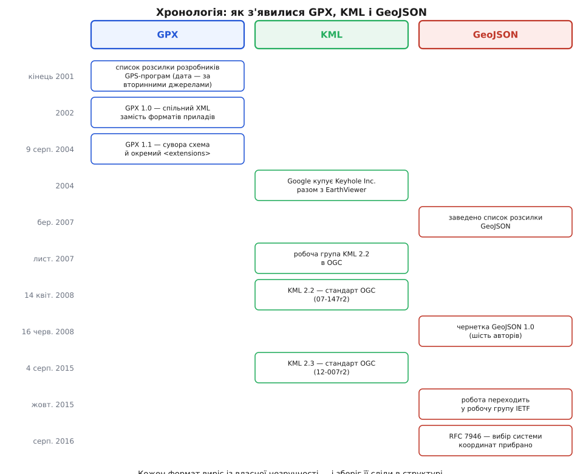

# 📜 Три народження: GPX, KML і GeoJSON

Три формати, якими сьогодні обмінюються місцями на Землі, з'явилися протягом п'ятнадцяти років — і кожен народився не з бажання «зробити стандарт», а з цілком конкретної незручності, яка комусь заважала працювати. Ця вставка простежує, хто, коли й проти чого їх робив, бо саме та початкова незручність досі вирішує, що формат уміє записати, а що мовчки губить.

*Три різні шляхи від незручності до формату: один — через список розсилки, другий — через компанію й консорціум, третій — через список розсилки і далі через IETF.*

## Кабель, драйвер і власний формат

На рубежі століть побутовий супутниковий приймач був річчю в собі. Він чесно писав трек, але дістати цей трек назовні можна було тільки через кабель виробника і програму виробника, яка знала внутрішній спосіб запису саме цієї моделі. Приймач — це пристрій, що обчислює своє положення з сигналів [супутникової навігації](topic:hw-sensing/gnss): він знає час кожної точки, знає висоту й навіть знає, наскільки добре бачив небо в момент вимірювання. Але все це лишалося замкненим усередині одного ланцюжка «прилад → його кабель → його програма».

Наслідок був простий і болючий: будь-яка стороння програма — для карт, для туристичних маршрутів, для геокешингу — мусила підтримувати десяток різних способів вивантаження, кожен зі своїми примхами. Автор такої програми витрачав місяці не на карти, а на драйвери до чужого заліза. І — що гірше — користувач, який змінив прилад, втрачав доступ до власних, ним же пройдених треків.

Розв'язок прийшов не від виробників приладів і не від комітету, а від тих, кому найбільше боліло: від розробників програм, що працювали з GPS. Вони зійшлися у списку розсилки й домовилися про спільний файл. Сам TopoGrafix — маленька компанія, що робила програми для роботи з приймачами, — досі називає це «відкритим процесом розробки» і показує список розсилки як головне місце участі; сторінки формату веде Ден Фостер (Dan Foster). Поширена в довідниках дата заснування списку — кінець 2001-го, а точний день випуску першої редакції часто подають як 1 березня 2002 року; первинні сторінки формату цих подробиць не фіксують і підтверджують лише рік — 2002-й, називаючи GPX «фактичним XML-стандартом легкого обміну GPS-даними від початкового випуску GPX 1.0 у 2002-му». Тож рік — факт, число й місяць — правдоподібне переказування.

## Чому GPX виглядає як приймач, а не як карта

Оскільки задача була «витягти вміст приладу», формат і побудували за вмістом приладу. У GPX три головні об'єкти — і це рівно ті три речі, які пам'ятає туристичний приймач: точка (`wpt` — waypoint, «шляхова точка»), маршрут як задум (`rte` — route) і записаний слід як факт (`trk` — track, що ділиться на сегменти `trkseg` і точки `trkpt`). Не «геометрія» і не «об'єкт із властивостями» — саме прилад, перекладений в [XML](topic:sf-data/xml-markup), мову розмітки з тегами й атрибутами, яка на початку 2000-х була очевидним вибором для будь-якого обміну даними.

Звідси ж усе інше в структурі. Точка треку несе час і висоту, бо приймач їх знає. Вона несе `hdop`, `sat`, `fix` — розмивання точності, число видимих супутників, тип фіксу, — бо приймач знає ще й **наскільки добре** він бачив, і викидати цю відомість було б безглуздо. І звідси ж головна прогалина: у GPX немає полігонів. Приймач ніколи не породжує площі — він породжує точки і ланцюжки точок. Формат, зроблений як дзеркало приладу, просто не мав звідки взяти поняття «область».

## GPX 1.1: коли схема стала суворою

Друга редакція вийшла **9 серпня 2004 року** — цю дату TopoGrafix подає прямо. Її причина знову практична. Щойно формат став популярним, виробники захотіли класти в нього своє: температуру води, частоту пульсу, глибину під кілем, дані геокешингових тайників. У першій редакції такі додатки з'являлися абияк, і файл із чужим доповненням переставав проходити перевірку схемою — тобто програма не могла відрізнити «файл із зайвим полем, яке можна ігнорувати» від «зіпсутий файл».

GPX 1.1 розв'язав це, вивівши розширення в окремий елемент `<extensions>` із власним простором імен і зробивши решту схеми суворішою. Тепер чужі дані мають законне місце: читач, який їх не розуміє, пропускає цю гілку й далі читає файл як звичайний GPX, а перевірка схемою лишається чинною. Garmin, Humminbird і геокешингові сервіси досі кладуть свої поля саме туди.

> 🔧 **Навіщо це.** Компроміс «сувора серцевина плюс огороджений закуток для чужого» — типовий спосіб дожити формату до старості. GPX 1.1 не змінювався з 2004 року й досі чинний: усе, що виробникам треба було додати за двадцять з гаком років, влізло в `<extensions>`, не зачепивши серцевини.

## Глобус як програма: Keyhole й EarthViewer

KML народився в іншому місці й з іншого приводу. Компанія Keyhole Inc. робила не формат обміну, а програму: земний браузер, що качав супутникові знімки мережею й показував їх на обертовому глобусі. Називався він Keyhole Earth Viewer — саме від назви компанії й пішла абревіатура KML, Keyhole Markup Language, «мова розмітки Keyhole». (Походження назви самої компанії часто пов'язують із серією американських розвідувальних супутників KH — Key Hole; це поширене пояснення, а не задокументоване первинним джерелом твердження.) 2004 року Keyhole купив Google, і наступного року програма вийшла під ім'ям Google Earth.

Тепер погляньмо, чим була KML **до** будь-якої стандартизації: це мова керування переглядачем. Не опис даних, а сценарій показу. Тому в ній є речі, яких у форматі обміну даними просто не буває:

- `Placemark` — позначка на глобусі, тобто те, що бачить око, а не абстрактний об'єкт;
- `Style` і `StyleMap` — колір лінії, іконка, поведінка при наведенні;
- `Folder` і `Document` — дерево в бічній панелі переглядача;
- `LookAt` і `Camera` — де стоїть **око спостерігача**;
- `NetworkLink` — вказівка підтягнути ще даних мережею під час показу;
- `altitudeMode` — як розуміти висоту: від землі, від рівня моря, чи взагалі притиснути до рельєфу.

Формат, у якому положення камери є частиною даних, міг з'явитися лише всередині переглядача. Це не вада — це прямий відбиток походження, як `hdop` у GPX.

## Від компанії до консорціуму

Далі сталося те, що для комерційного формату нетипове: Google віддав мову назовні. Компанія подала KML до Open Geospatial Consortium (OGC) — міжнародного об'єднання, що ухвалює стандарти гео-даних, — «щоб вона розвивалася в консенсусному процесі OGC», як формулює сам консорціум. У листопаді 2007-го при OGC створили робочу групу зі стандарту KML 2.2, зауваження збирали до 4 січня 2008 року, і **14 квітня 2008-го** KML 2.2 став офіційним стандартом OGC — документ **07-147r2**. Номер документа стоїть у самому реєстрі стандартів OGC, а от дати ухвалення реєстрова сторінка не наводить: вона йде з довідкових джерел, тож це усталений переказ, а не первинний запис. Наступна редакція, **KML 2.3**, — документ **12-007r2**, і в неї дати видно на титулі самого стандарту: ухвалено **18 травня**, оприлюднено **4 серпня 2015 року**.

Розрахунок був зрозумілий. Мова, яку може реалізувати будь-хто без дозволу власника, поширюється значно ширше — і Google Earth від цього виграє більше, ніж від монополії на формат. Але стандарт при цьому фіксує **мову**, а не програму: специфічні для Google додатки лишилися поза ним, у власному просторі імен `gx:` — анімація туру, часові проміжки показу, керування відтворенням. Тобто KML повторив ту саму хитрість, що й GPX 1.1, тільки в іншому виконанні: спільна серцевина — у стандарті, приватне — в окремому просторі імен.

## Список розсилки замість комітету: GeoJSON

Третя незручність визріла вже у вебі. У березні 2007 року розробники, що робили картографічні інструменти для браузера, завели окремий список розсилки: обговорити, як передавати гео-дані в [JSON](topic:sf-data/json-format) — текстовому форматі об'єктів і масивів, який браузер розбирає власними силами, без жодної бібліотеки. Проблема була в тому, що гео-дані приїжджали в браузер як XML — переважно як GML, мову геооб'єктів того ж OGC, — а це означало: тягни розбирач, розбирайся з просторами імен, знай схему. Для карти в браузері це була велика ціна за передачу купки точок.

Робота завершилася документом «GeoJSON Specification, Revision 1.0» від **16 червня 2008 року**. Під ним стоять шестеро: Говард Батлер (Howard Butler, Hobu Inc.), Мартін Дейлі (Martin Daly, Cadcorp), Аллан Дойл (Allan Doyle, MIT), Шон Гілліс (Sean Gillies, UNC-Chapel Hill), Тім Шауб (Tim Schaub, OpenGeo) і Крістофер Шмідт (Christopher Schmidt, MetaCarta) — практики з компаній і університетів, а не делегати організацій.

І формат вийшов таким, якою була їхня задача. Ніякого стилю показу: у вебі за вигляд відповідає клієнт, а не дані. Ніякого часу на точці: сцена цікавить веб-карту не як запис руху, а як набір об'єктів. Натомість — `Feature` з двома частинами: `geometry` (де воно) і `properties` (усе інше, довільний об'єкт JSON). Там, де GPX питає «де я був і коли?», а KML — «що показати й як?», GeoJSON питає «які тут об'єкти і які в них властивості?».

## Помилка, яку виправили відніманням

У чернетці 2008 року лишався один пункт, узятий за звичкою з великого гео-світу: поле `crs`, яким файл міг оголосити власну систему координат. Виглядало це щедро — читай хоч у метрах місцевої проєкції, хоч у градусах. На практиці вийшло навпаки: формат, що обіцяє «будь-яку систему координат», не обіцяє нічого, бо кожному читачеві для чесного розбору потрібна повна бібліотека [картографічних проєкцій](topic:math-geometry/map-projections) — способів розкласти криву земну поверхню на площину — і база параметрів перетворень.

Тим часом формат виріс. У жовтні 2015-го робота перейшла зі списку розсилки до робочої групи IETF — так межу проводить сам RFC у подяках («у списку розсилки GeoJSON до жовтня 2015-го і в робочій групі GeoJSON IETF після»); Вікіпедія датує заснування групи квітнем 2015-го, тож у джерелах є розбіжність між рішенням завести групу і фактичним переїздом обговорення. У **серпні 2016-го** вийшов **RFC 7946**.

І він поле `crs` **прибрав**. Формулювання документа варте того, щоб його прочитати буквально: використання інших систем координат «показало проблеми зі сумісністю», а «від програм, що обробляють GeoJSON, не очікується ані доступу до баз систем координат, ані мережевого доступу до параметрів перетворень». Натомість зафіксовано одне: географічні координати в [WGS-84](topic:math-geometry/wgs84-datum), довгота й широта в десяткових градусах. Заразом RFC дописав правила, яких чернетці бракувало саме тому, що реалізації розходилися: напрямок обходу кілець полігона, поводження з переходом через 180-й меридіан, зміст поля `bbox`.

## Три різні джерела влади

Найцікавіше в цій історії — не дати, а те, **хто** мав право змінювати кожен формат, бо це видно на самих форматах.

GPX не має за собою ні консорціуму, ні комітету — лише список розсилки й людину, яка веде сторінку. Тому він законсервувався: редакція 1.1 чинна від 2004 року, і зміни відбуваються не в схемі, а всередині `<extensions>`. Стабільність тут не рішення, а побічний ефект відсутності органу, який мав би повноваження щось ламати.

KML пройшов шлях «компанія → консорціум», і його стандарт назавжди лишився описом того, що вже вміла конкретна програма. Через це KML 2.3 і через десять з лишком років після ухвалення підтримано нерівно: стандарт можна ухвалити, а от змусити переглядачі його реалізувати — ні, якщо головний переглядач один і живе за власним розкладом.

GeoJSON пройшов «список розсилки → IETF» і єдиний із трьох дозволив собі **відняти** можливість. На таке рідко зважується стандарт, за яким стоїть постачальник: прибрати поле — значить визнати недійсною частину вже написаних файлів. Група практиків, що відповідала за сумісність, а не за продукт, змогла сказати, що краще формат, який усі читають однаково, ніж формат, який усе вміє на папері. Це рішення й зробило GeoJSON тим, чим він є: [обміном даними](topic:com-protocol/data-serialization), для якого читачеві не треба нічого, крім розбирача JSON.
