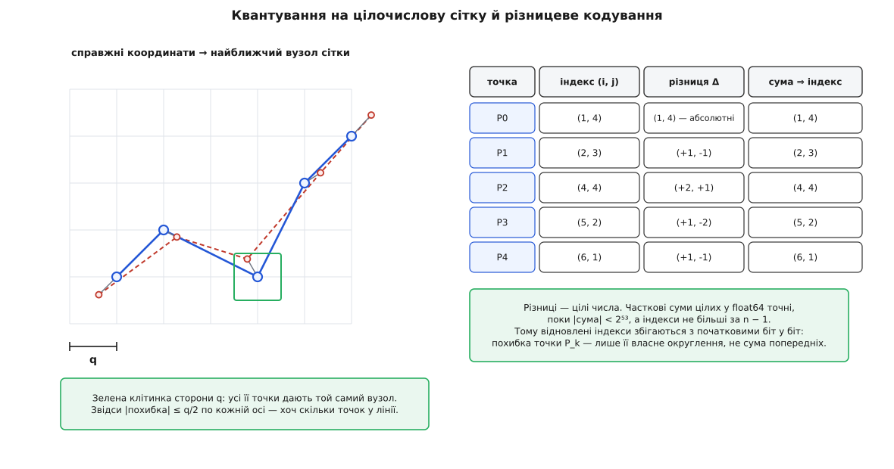
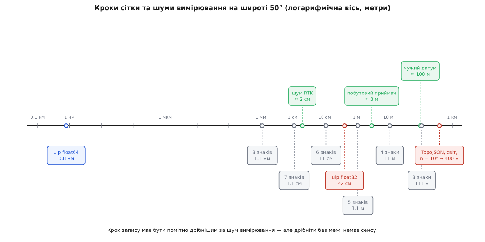

# 🧮 Бюджет точності координати: скільки метрів коштує знак, біт і крок сітки

Між місцем на Землі й числом у файлі стоїть ланцюжок округлень — довжина градуса, знак після коми, крок сітки чисел із рухомою комою, крок цілочислової сітки квантування, — і кожну ланку можна порахувати наперед, замість того щоб гадати «шести знаків, мабуть, вистачить». Тут ці ланки пораховані до метрів: скільки коштує знак на кожній широті, чому шість знаків не переживають 32-бітного типу, як вибрати крок квантування під задану метрову точність і чому різницеве кодування — попри інтуїцію — похибку не накопичує.

### Довжина градуса: звідки беруться 111 кілометрів

Усе переведення «градуси ↔ метри» тримається на одному питанні: яку довжину на поверхні дає зміна кута на один градус. Відповідь різна для широти й довготи — і навіть для однієї широти вона різна на різних широтах, бо Земля не куля.

Візьмімо еліпсоїд [WGS-84](topic:math-geometry/wgs84-datum) — еліпс, обернений навколо малої осі. Його задають двома числами:

```
a = 6378137 м            велика піввісь (екваторіальний радіус)
f = 1 / 298.257223563    стиснення

b  = a(1 − f)   = 6356752.314 м     мала піввісь (полярний радіус)
e² = f(2 − f)   = 0.00669437999     квадрат ексцентриситету
```

**Широта.** Зсув на північ — це рух уздовж меридіана, а меридіан — половина еліпса, кривина якого змінюється від екватора до полюса. Довжину дуги дає радіус кривини меридіана:

```
M(φ) = a(1 − e²) / (1 − e² sin²φ)^(3/2)

L_шир(φ) = M(φ) · π/180        метрів на градус широти
```

Тут ховається пастка інтуїції. Земля сплюснута біля полюсів — і напрошується, що градус широти там коротший. Насправді навпаки: сплюснутість означає, що поблизу полюса поверхня вигнута **менше**, радіус кривини більший, і той самий кут накриває довшу дугу.

**Довжина градуса широти.**

```
φ = 0°    M = 6335439.3 м    L_шир = 110574.3 м
φ = 45°   M = 6367381.8 м    L_шир = 111131.8 м
φ = 90°   M = 6399593.6 м    L_шир = 111694.0 м
```

Розкид — 1.1 км, тобто один відсоток на всю планету. Тому «111 кілометрів на градус» — наближення з похибкою менш ніж 0.7 %, і саме на ньому будують швидкі прикидки.

Перевірка з іншого боку: морська миля означена рівно як 1852 метри, а історично її брали як довжину однієї кутової мінути меридіана. Ділимо градус на середніх широтах на шістдесят:

```
L_шир(45°) / 60 = 111131.8 / 60 = 1852.20 м
```

Розбіжність — двадцять сантиметрів на 1852 метри, тобто одна десятитисячна. Формула відтворює означення, придумане задовго до неї.

**Довгота.** Зсув на схід — рух уздовж паралелі, а паралель — звичайне коло. Її радіус — це відстань не до центру Землі, а **до осі обертання**. Нормаль до еліпсоїда, продовжена вглиб, перетинає вісь обертання, і довжина від точки до цього перетину — це друга головна величина еліпсоїда:

```
N(φ) = a / √(1 − e² sin²φ)        радіус кривини поперек меридіана
r(φ) = N(φ) · cos φ               радіус паралелі

L_дов(φ) = N(φ) cos φ · π/180     метрів на градус довготи
```

На екваторі `N = a` і `cos φ = 1`, тож `L_дов(0) = 6378137 · π/180 = 111319.5 м`. Далі множник `cos φ` тисне все інше вниз, і тисне сильно: `N(φ)` від екватора до полюса зростає лише на третину відсотка, а косинус падає до нуля.

**Метрів на градус.**

```
  φ      L_шир, м     L_дов, м     L_дов / L_шир
  0°     110574.3     111319.5        1.007
 30°     110852.4      96486.3        0.870
 50°     111229.1      71695.8        0.645
 70°     111562.0      38186.5        0.342
 80°     111660.0      19393.5        0.174
 90°     111694.0          0.0        0.000
```

Звідси випливає перший висновок, який зазвичай пропускають: **градус широти й градус довготи — різні одиниці**. Однакове число градусів по двох осях дає на широті 50° відстані, що різняться в півтора раза, а на 70° — майже втричі.

### Знак після коми — це просто крок сітки

Записати координату з `d` знаками після коми — те саме, що округлити її до сітки з кроком `10⁻ᵈ` градуса. Округлення до найближчого вузла дає похибку не більшу за пів кроку, і це вся математика:

```
q = 10⁻ᵈ градуса              крок сітки
|похибка| ≤ q/2               у градусах
ε = q/2 · L(φ)                у метрах
```

Множник `L(φ)` беремо свій для кожної осі — і саме тому та сама кількість знаків коштує по-різному.

**Ціна знака в метрах (крок сітки, не пів кроку).**

```
знаків   крок, °      широта @50°   довгота @0°   @30°     @50°     @70°
   4     0.0001        11.123 м      11.132 м     9.649 м  7.170 м  3.819 м
   5     0.00001        1.1123        1.1132      0.9649   0.7170   0.3819
   6     0.000001       0.11123       0.11132     0.09649  0.07170  0.03819
   7     0.0000001      0.011123      0.011132    0.009649 0.007170 0.003819
```

Шість знаків по широті дають крок 11 см і похибку ±5.6 см. RFC 7946, стандарт GeoJSON, називає рівно цю цифру: «6 decimal places (a default common in, e.g., sprintf) amounts to about 10 centimeters» — і додає, що збільшення точності з 6 до 15 знаків роздуває файл із докладними полігонами майже вдвічі.

По довготі та сама кількість знаків завжди коштує менше метрів, і на 70° — утричі менше, ніж по широті. Файл, де обидві осі записані однаковою кількістю знаків, має **витягнуту клітинку сітки**: по схід-захід вона дрібніша, ніж по північ-південь. Заощадити на цьому не вийде — щоб зрівняти осі на 50°, довготі вистачило б на 0.19 знака менше, а знаки бувають лише цілі. Але для підрахунку похибки різниця істотна: у `ε = q/2 · L(φ)` треба підставляти **свій** множник для кожної осі, інакше похибка по схід-захід виявиться завищеною в півтора раза на середніх широтах і майже втричі на сімдесятій.

### Крок сітки чисел із рухомою комою

Текст читають у число, і тип цього числа накладає **свою** сітку — уже не десяткову. Число з [рухомою комою](topic:hw-arch/floating-point) — це ціла мантиса, помножена на степінь двійки:

```
x = m · 2^(e − p + 1),   де   2^(p−1) ≤ m < 2^p
```

Мантиса `m` ціла, тож сусідні представні значення відрізняються рівно на `2^(e − p + 1)`. Цю відстань звуть **ulp** (англ. *unit in the last place* — одиниця останнього розряду). Точність `p` — 24 біти для 32-бітного типу й 53 для 64-бітного, а `e = ⌊log₂|x|⌋`:

```
ulp₃₂(x) = 2^(e − 23)
ulp₆₄(x) = 2^(e − 52)
```

Головне тут — `e` в показнику: **сітка не рівномірна**. Вона вдвічі грубшає щоразу, коли значення переходить через степінь двійки. Широта 31° лежить у діапазоні `[16, 32)`, широта 33° — уже в `[32, 64)`, і між ними крок стрибає удвічі, хоч на місцевості між ними лише двісті кілометрів. Для координат це означає, що точність запису **залежить від того, де ви на планеті**.

**Крок сітки в метрах по широті.**

```
  φ     e   ulp₃₂, °        метрів    ulp₆₄, °          метрів
 10°    3   9.5367432e-07   0.1055    1.7763568e-15   1.96e-10
 30°    4   1.9073486e-06   0.2114    3.5527137e-15   3.94e-10
 50°    5   3.8146973e-06   0.4243    7.1054274e-15   7.90e-10
 70°    6   7.6293945e-06   0.8512    1.4210855e-14   1.59e-09
```

Для довготи діапазон значень удвічі ширший, і на `|λ| > 128°` показник додає ще один щабель: там `ulp₃₂ = 2^−16 = 1.53e-05°`, що на широті 50° дає 1.09 м по схід-захід.

Тепер порахуємо межу прямо. Щоб 32-бітний тип **розрізняв** сусідні шестизнакові значення, його крок має бути не більшим за десятковий:

```
2^(e − 23) ≤ 10⁻⁶
e − 23 ≤ log₂(10⁻⁶) = −19.9316
e ≤ 3.068   →   e ≤ 3   →   |x| < 2⁴ = 16
```

**Шість знаків після коми виживають у 32-бітному типі лише для координат, менших за 16 градусів.** По широті це смуга завширшки близько 1780 кілометрів по кожен бік екватора; по довготі умова та сама, тільки відлічується від нульового меридіана. На широті 50° крок сітки вчетверо грубший за шостий знак: шостого знака там просто немає, п'ятий іще тримається із запасом, а справжня роздільність лежить між ними. Те саме мовою значущих цифр: 32-бітний тип несе `24 · log₁₀2 = 7.22` десяткових цифри, а запис `50.450100` вимагає восьми.

Ту саму нерівність для 64-бітного типу:

```
2^(e − 52) ≤ 10⁻⁶   →   e ≤ 32   →   |x| < 2³³ ≈ 8.6·10⁹
```

Ця межа в сорок сім мільйонів разів більша за найбільшу можливу координату — 180 градусів. Тому правило «координати тримають у 64-бітному типі» — не забобон обережних, а прямий наслідок нерівності.

```c
#include <stdio.h>
#include <math.h>

/* метрів на градус широти для WGS-84 */
static double metres_per_deg_lat(double phi_deg) {
    const double a = 6378137.0, f = 1.0 / 298.257223563;
    const double e2 = f * (2.0 - f);
    double s = sin(phi_deg * M_PI / 180.0);
    double M = a * (1.0 - e2) / pow(1.0 - e2 * s * s, 1.5);
    return M * M_PI / 180.0;
}

int main(void) {
    const double lat[] = { 10.0, 30.0, 50.0, 70.0 };

    for (int i = 0; i < 4; i++) {
        double phi = lat[i];
        int    e   = (int)floor(log2(phi));
        double u32 = ldexp(1.0, e - 23);   /* 2^(e-23) */
        double u64 = ldexp(1.0, e - 52);   /* 2^(e-52) */
        double L   = metres_per_deg_lat(phi);

        printf("%3.0f  e=%d  ulp32=%.7e = %.4f м   ulp64=%.7e = %.2e м\n",
               phi, e, u32, u32 * L, u64, u64 * L);
    }
    return 0;
}
```

```
 10  e=3  ulp32=9.5367432e-07 = 0.1055 м   ulp64=1.7763568e-15 = 1.96e-10 м
 30  e=4  ulp32=1.9073486e-06 = 0.2114 м   ulp64=3.5527137e-15 = 3.94e-10 м
 50  e=5  ulp32=3.8146973e-06 = 0.4243 м   ulp64=7.1054274e-15 = 7.90e-10 м
 70  e=6  ulp32=7.6293945e-06 = 0.8512 м   ulp64=1.4210855e-14 = 1.59e-09 м
```

### Різниці гинуть першими

Абсолютна похибка 42 сантиметри на широті 50° звучить стерпно — вона менша за похибку побутового приймача. Але координати рідко потрібні самі по собі: майже завжди з них рахують **різниці** — відстань між точками, довжину сегмента, швидкість, площу. І тут 42 сантиметри перестають бути дрібницею.

Спершу — важливий і неочевидний факт: саме віднімання похибки **не додає**. Візьмімо дві широти, обидві в діапазоні `[32, 64)`. Після запису в 32-бітний тип кожна з них — ціле кратне того самого кроку `2⁻¹⁸`. Їхня різниця теж кратна `2⁻¹⁸`, а за модулем менша за 32, тобто дорівнює `k · 2⁻¹⁸`, де `|k| < 2²³` — таке ціле вміщається в 24-бітну мантису. Отже, різниця представна **точно**, і операція віднімання не втрачає жодного біта.

Похибка вже сталася — на етапі запису. Віднімання лише **знімає з неї маскування**. Кожне з двох чисел несе до 0.21 м похибки, і на тлі самого значення це нікчемно мало: широта 50° — це 5.6 мільйона метрів від екватора, тобто похибка становить чотири стомільйонні. Різниця цих чисел — уже метр, а обидві похибки лишилися в ній цілими, до 0.42 м разом. Те саме число, поділене на менший знаменник, — і стомільйонна частка стає сорока відсотками.

```
кожна координата:  |похибка| ≤ ulp/2
різниця двох:      |похибка| ≤ ulp          (дві по пів кроку)

відносна похибка відстані d:  ulp·L(φ) / d
```

На широті 50° у 32-бітному типі `ulp · L = 0.4243 м`:

```
сегмент       максимальна відносна похибка
     1 м            42.4 %
    10 м             4.2 %
   100 м             0.42 %
  1000 м             0.04 %
```

**Дві точки за метр одна від одної.**

```
істинні значення:   50.450100  і  50.450109      (Δ = 9e-06° = 1.001 м)
у 32-бітному типі:  50.450099945  і  50.450107574
різниця бітів:      7.629394531e-06° = рівно 2 ulp = 0.849 м
похибка:            0.152 м, тобто 15.2 %
```

Зверніть увагу на «рівно 2 ulp». Різниця двох чисел з одного двійкового діапазону завжди кратна кроку сітки, тож обчислена відстань — не гладка функція, а **сходинка** з висотою 42 см: за нерухомої першої точки будь-яка справжня відстань від 0.64 до 1.06 метра дасть той самий результат 0.849 м. Швидкість, порахована як така відстань, поділена на секунду, успадкує сходинку цілком.

У 64-бітному типі та сама сходинка має висоту `7.9·10⁻¹⁰` метра — менше за нанометр, і жодна геодезія на неї не наштовхнеться.

> 🔧 **Навіщо це.** Правило з двох частин, обидві прямо з нерівностей вище. Перша: **зберігай координати як 64-бітні**, бо 32-бітний тип ріже сітку до 42 см уже на середніх широтах, і ця межа не залежить від того, скільки знаків ви записали в текст. Друга: **вважай різницю двох близьких координат числом із власною похибкою** — вона дорівнює одному кроку сітки в абсолюті, а у відсотках роздувається обернено до довжини сегмента. Коли треба саме локальна геометрія — сотні точок у межах кварталу, — не рахуй її на глобальних градусах: відніми спільний початок один раз у 64-бітному типі, перейди в метри [місцевої дотичної площини](topic:math-geometry/local-tangent-plane) — і далі працюй із числами порядку сотень, де навіть 32-бітний тип дає крок у мікрометри.

### Квантування на цілочислову сітку

Другий спосіб задати крок — не знаками десяткового запису, а явно: накрити всю ділянку рівномірною цілочисловою сіткою й зберігати номери вузлів. Так робить TopoJSON, і його схема — це три рядки арифметики.

Ділянку задає обмежувальний прямокутник `[x₀, x₁] × [y₀, y₁]`, дрібність — одне число `n` (параметр квантування). Ось перетворення туди й назад:

```
кодування:     q = (x₁ − x₀) / (n − 1)          крок сітки, у градусах
               i = round((x − x₀) / q)          цілий індекс, 0 ≤ i ≤ n − 1

декодування:   x̂ = q · i + x₀
```

Еталонна реалізація TopoJSON зберігає в об'єкті `transform` саме пару `scale = [q_x, q_y]` і `translate = [x₀, y₀]`, а вузли рахує так само — `Math.round((x − x₀) · (n−1)/(x₁−x₀))`. Кожна вісь дістає **свій** крок, бо прямокутник, узагалі кажучи, не квадратний.

Похибка тут та сама, що й у знаків після коми, — рівномірне округлення до найближчого вузла:

```
|x̂ − x| ≤ q/2                        максимум
σ = q/√12 = 0.2887·q                 середньоквадратичне
```

Друге виводиться в один крок: похибка округлення рівномірно розподілена на відрізку `[−q/2, q/2]`, а дисперсія рівномірного розподілу на відрізку довжини `q` дорівнює `q²/12` — той самий вираз, що дає [шум квантування](topic:hw-analog/quantization-noise) в аналого-цифровому перетворювачі.

Звідси **правило вибору `n`** під задану метрову точність `ε` (максимальну, не середню):

```
q/2 · L(φ) ≤ ε      →      q ≤ 2ε / L(φ)

n ≥ (x₁ − x₀) · L(φ) / (2ε) + 1
```

І тут видно головну пастку: **`n` — це не точність, а відношення**. Одне й те саме `n` на файлі світу й на файлі міста дає зовсім різний крок у метрах.

```
метри — по широті, L = 111229 м/°

ділянка        n       q, °          q, м       ±похибка     σ
світ, 360°    10⁴     0.0360036     4004.6      2002.3     1156.0
світ, 360°    10⁵     0.0036000      400.4       200.2      115.6
світ, 360°    10⁶     0.0003600       40.0        20.0       11.6
місто, 0.5°   10⁴     0.000050005      5.562       2.781      1.606
район, 0.05°  10⁴     0.000005001      0.556       0.278      0.161
```

Значення `n = 10⁴` на карті світу — це похибка два кілометри. Для контурів країн на екрані завширшки в тисячу пікселів це непомітно (піксель там коштує близько 40 км), а для будь-чого дрібнішого — катастрофа. Зворотний бік: щоб на карті світу тримати метрову точність, потрібно `n ≥ 360 · 111229 / 2 + 1 ≈ 2.0·10⁷`, а такий індекс уже не вміщається в 24 біти — і жодної переваги над прямим записом координат немає.

Є й другий, якісний ефект. Якщо `q` перевищує відстань між сусідніми точками лінії, обидві можуть сісти на той самий вузол — тоді різниця стає нульовою, і повторний вузол просто зникає з ланцюжка. Це вже не зсув координати, а **зміна форми**: лінія втрачає вершини, тонкий півострів злипається в риску, крихітний полігон вироджується в точку. Поріг простий — сегменти, коротші за `q`, під загрозою.


*Кожна точка окремо притягується до найближчого вузла — звідси межа q/2 по кожній осі. Різницями зберігають уже цілі індекси, тож часткові суми відтворюють їх без єдиної втрати.*

### Чому різницеве кодування не накопичує похибки

Зберігати замість абсолютних координат різниці між сусідніми — очевидна економія: сусідні точки треку відрізняються в останніх розрядах, і різниці стискаються значно краще. Але інтуїція заперечує: ланцюжок різниць має **накопичувати** похибку, бо кожна наступна точка стоїть на попередній, а помилка першої нікуди не дінеться. Порахуймо, коли це справді так.

Після квантування ми маємо не координати, а **цілі індекси** `i₀, i₁, …, i_k`. Різницеве кодування зберігає `i₀` і різниці `dₖ = iₖ − iₖ₋₁` — теж цілі. Відновлення — часткові суми:

```
î₀ = i₀
îₖ = îₖ₋₁ + dₖ
```

Ключ у тому, що це арифметика **цілих**. 64-бітний тип із рухомою комою представляє всі цілі до `2⁵³ = 9007199254740992` точно, а сума двох таких цілих, якщо результат теж не виходить за межу, обчислюється без округлення. Усі часткові суми тут дорівнюють початковим індексам, а ті лежать у `[0, n−1]`, де `n` рідко перевищує `10⁹`. Отже, `îₖ = iₖ` **біт у біт**, для всіх `k` без винятку.

Похибка кожної точки — це рівно її власне округлення на етапі кодування:

```
x̂ₖ − xₖ = q · round((xₖ − x₀)/q) + x₀ − xₖ

|x̂ₖ − xₖ| ≤ q/2        для кожного k окремо
```

У правій частині немає `k`. Різницеве кодування нічого не накопичує, бо воно взагалі не є наближенням — це точне переписування тієї самої послідовності цілих в іншій формі. Уся втрата сталася раніше, на одному-єдиному кроці округлення до вузла.

А тепер контрприклад, який показує, де інтуїція таки має рацію. Уявіть, що різниці рахують **не від індексів, а від сирих координат**, і кожну різницю округлюють до шести знаків, як звичайне число:

```
δ = 10⁻⁶ · L(φ) = 0.1112 м        крок округлення однієї різниці
кожна різниця:  |похибка| ≤ δ/2

найгірший випадок:  |зсув після k кроків| ≤ k · δ/2
випадкові знаки:    σ_зсув = √k · δ/√12
```

Для треку з десяти тисяч точок на широті 50°:

```
найгірший випадок:  10⁴ · 0.0556 = 556 м
типовий (σ):        100 · 0.0321 = 3.2 м
```

Половина кілометра дрейфу в найгіршому випадку — і три метри в типовому, з нічого, самим лише порядком дій. Різниця між двома схемами вся в одному: **округлювати треба перед відніманням, а не після**. Квантуй координати до цілих, і різниці стануть точними; відніми спочатку, а округлюй різниці — і кожна принесе власну похибку в спільну суму.

:::tabs
```c
#include <stdio.h>
#include <math.h>

#define N     10000                /* параметр квантування */
#define K     5
#define L_LAT 111229.064           /* м на градус широти  @50° */
#define L_LON  71695.754           /* м на градус довготи @50° */

int main(void) {
    const double lon[K] = {30.523400, 30.524150, 30.525900, 30.527310, 30.528000};
    const double lat[K] = {50.450100, 50.450620, 50.451080, 50.450940, 50.452250};
    const double x0 = 30.2, x1 = 30.8, y0 = 50.2, y1 = 50.6;   /* обмежувальний прямокутник */

    double kx = (N - 1) / (x1 - x0), ky = (N - 1) / (y1 - y0);
    double qx = 1.0 / kx,            qy = 1.0 / ky;
    printf("q_x = %.10f° = %.4f м   q_y = %.10f° = %.4f м\n",
           qx, qx * L_LON, qy, qy * L_LAT);

    long ix[K], iy[K];
    for (int k = 0; k < K; k++) {                 /* 1. на цілочислову сітку */
        ix[k] = lround((lon[k] - x0) * kx);
        iy[k] = lround((lat[k] - y0) * ky);
    }

    long dx[K], dy[K];                            /* 2. різниці — цілі */
    dx[0] = ix[0]; dy[0] = iy[0];
    for (int k = 1; k < K; k++) { dx[k] = ix[k] - ix[k-1]; dy[k] = iy[k] - iy[k-1]; }

    long ax = 0, ay = 0;                          /* 3. відновлення — часткові суми */
    double mx = 0, my = 0;
    for (int k = 0; k < K; k++) {
        ax += dx[k]; ay += dy[k];
        double ex = (ax * qx + x0 - lon[k]) * L_LON;
        double ey = (ay * qy + y0 - lat[k]) * L_LAT;
        if (fabs(ex) > mx) mx = fabs(ex);
        if (fabs(ey) > my) my = fabs(ey);
        printf("  k=%d  Δ=(%+3ld,%+3ld)  індекс=(%ld,%ld)  похибка=(%+.3f, %+.3f) м\n",
               k, dx[k], dy[k], ax, ay, ex, ey);
    }
    printf("макс |Δx| = %.3f м (межа %.3f)   макс |Δy| = %.3f м (межа %.3f)\n",
           mx, qx * L_LON / 2, my, qy * L_LAT / 2);
    return 0;
}
```
```ts
const N = 10_000;                 // параметр квантування
const L_LAT = 111229.064;         // м на градус широти  @50°
const L_LON = 71695.754;          // м на градус довготи @50°

const pts: [number, number][] = [
  [30.523400, 50.450100], [30.524150, 50.450620], [30.525900, 50.451080],
  [30.527310, 50.450940], [30.528000, 50.452250],
];
const [x0, x1, y0, y1] = [30.2, 30.8, 50.2, 50.6];   // обмежувальний прямокутник

const kx = (N - 1) / (x1 - x0), ky = (N - 1) / (y1 - y0);
const transform = { scale: [1 / kx, 1 / ky], translate: [x0, y0] };
const [qx, qy] = transform.scale;
console.log(`q_x = ${qx.toFixed(10)}° = ${(qx * L_LON).toFixed(4)} м   ` +
            `q_y = ${qy.toFixed(10)}° = ${(qy * L_LAT).toFixed(4)} м`);

// 1. на цілочислову сітку
const idx = pts.map(([x, y]) => [Math.round((x - x0) * kx), Math.round((y - y0) * ky)]);

// 2. різниці — цілі
const deltas = idx.map((p, k) => k === 0 ? p : [p[0] - idx[k-1][0], p[1] - idx[k-1][1]]);

// 3. відновлення — часткові суми
const sgn = (v: number, d = 0) => (v >= 0 ? "+" : "") + v.toFixed(d);
let ax = 0, ay = 0, mx = 0, my = 0;
deltas.forEach(([dx, dy], k) => {
  ax += dx; ay += dy;
  const ex = (ax * qx + x0 - pts[k][0]) * L_LON;
  const ey = (ay * qy + y0 - pts[k][1]) * L_LAT;
  mx = Math.max(mx, Math.abs(ex)); my = Math.max(my, Math.abs(ey));
  console.log(`  k=${k}  Δ=(${sgn(dx)},${sgn(dy)})  індекс=(${ax},${ay})  ` +
              `похибка=(${sgn(ex, 3)}, ${sgn(ey, 3)}) м`);
});
console.log(`макс |Δx| = ${mx.toFixed(3)} м (межа ${(qx*L_LON/2).toFixed(3)})   ` +
            `макс |Δy| = ${my.toFixed(3)} м (межа ${(qy*L_LAT/2).toFixed(3)})`);
```
:::

```
q_x = 0.0000600060° = 4.3022 м   q_y = 0.0000400040° = 4.4496 м
  k=0  Δ=(+5389,+6252)  індекс=(5389,6252)  похибка=(-1.983, +0.557) м
  k=1  Δ=(+13,+13)      індекс=(5402,6265)  похибка=(+0.173, +0.563) м
  k=2  Δ=(+29,+11)      індекс=(5431,6276)  похибка=(-0.531, -1.657) м
  k=3  Δ=(+24, -3)      індекс=(5455,6273)  похибка=(+1.630, +0.567) м
  k=4  Δ=(+11,+33)      індекс=(5466,6306)  похибка=(-0.516, +1.694) м
макс |Δx| = 1.983 м (межа 2.151)   макс |Δy| = 1.694 м (межа 2.225)
```

Похибка стрибає туди-сюди в межах пів кроку й не має жодної тенденції зростати з номером точки. Абсолютні індекси — чотиризначні, різниці — двозначні: саме звідси й береться виграш у розмірі.

### Складання бюджету

Тепер усі доданки можна скласти. Похибки з різних причин незалежні, тож [додаються квадратично](topic:math-probability/error-propagation):

```
σ_заг = √( σ_приймача² + σ_запису² + σ_типу² )
```

Практичний критерій виводиться з цієї ж формули. Якщо додатковий доданок утричі менший за головний, повна похибка зростає на

```
√(1 + 1/9) = 1.0541,   тобто на 5.4 %
```

П'ять із половиною відсотків — прийнятна ціна, отже правило: **крок запису тримаємо так, щоб `σ` від нього був не більший за третину `σ` вимірювання.**

Побутовий приймач у відкритому небі дає горизонтальну похибку близько 3 метрів. Підставляємо:

```
σ_запису ≤ 3/3 = 1 м    →    q ≤ 1·√12 = 3.46 м
q ≤ 3.46 / 111229 = 3.11e-05°   →   d ≥ −log₁₀(3.11e-05) = 4.51
```

Отже **п'яти знаків уже досить**: крок 1.11 м дає `σ = 0.32 м`, а повна похибка виходить `√(3² + 0.32²) = 3.017 м` — на пів відсотка більша за саме вимірювання. Шостий знак — запас на подальші обчислення й на приймачі, кращі за типовий. Сьомий для побутового приймача не несе жодної інформації: він описує шум із роздільністю в сантиметр.

Геодезія з поправками реального часу (RTK) дає близько 2 сантиметрів. Той самий підрахунок:

```
σ_запису ≤ 0.0067 м    →    q ≤ 0.0231 м = 2.08e-07°   →   d ≥ 6.68
```

Тобто **сім знаків** — і рівно сім, бо восьмий описував би міліметри, яких у вимірюванні немає.


*Над віссю — те, чим шумить сама природа вимірювання; під віссю — кроки, які обираємо ми. Робоча зона — там, де вибраний крок утричі-вчетверо дрібніший за найближчий шум зверху: лівіше зайві знаки описують самий лише шум, правіше крок починає псувати вимірювання.*

Той самий критерій розсуджує й суперечку про 32-бітний тип. На широті 50° він дає `σ = 0.4243/√12 = 0.12 м`. Проти побутових трьох метрів це чотири відсотки — у квадратичній сумі повна похибка зростає на 0.08 %, тобто непомітно, і саме тому 32-бітні координати роками працюють у застосунках, де ніхто нічого не міряє точніше за метр. Проти двох сантиметрів RTK той самий крок ушестеро більший за все вимірювання: геодезична зйомка гине повністю. А в різницях він псує будь-який клас точності, бо там абсолютна похибка ділиться на довжину сегмента, а не на п'ятдесят градусів.
