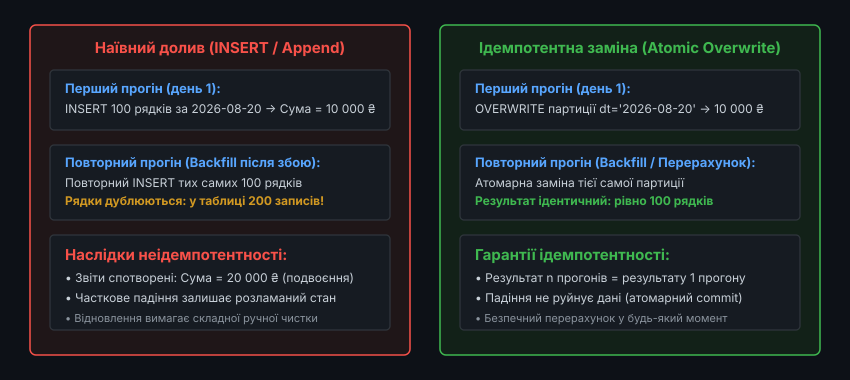
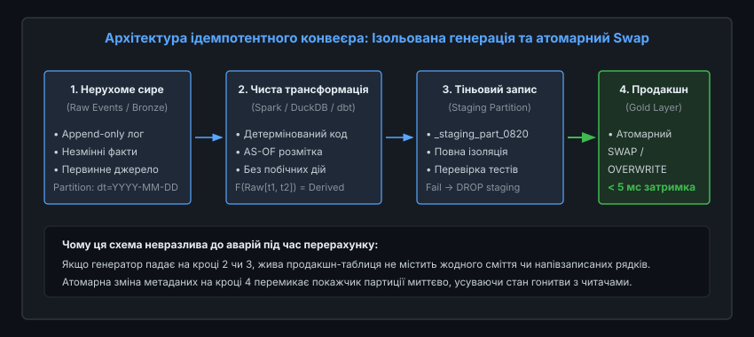
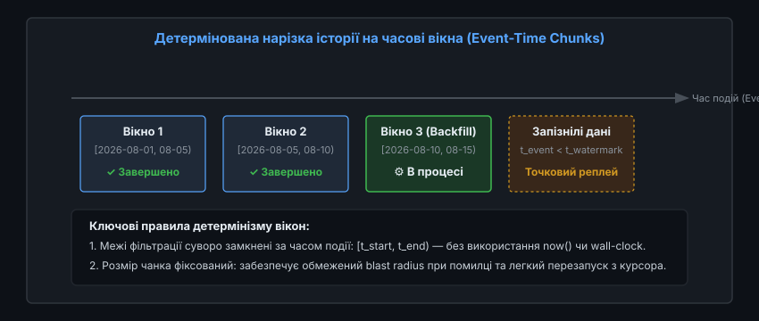
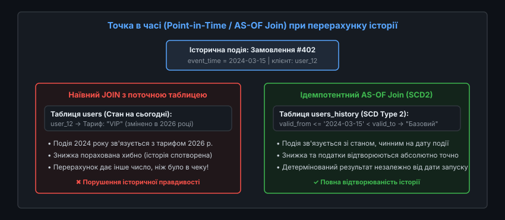

# 🔄 Ідемпотентний перерахунок історії та backfilling

<preknowlist>
- [Транзакції та ACID](root:sf-data/transactions-acid) — атомарність, узгодженість, ізоляція та надійність змін у сховищах.
- [ETL/ELT](root:sf-data/etl-elt) — конвеєри видобування, трансформації та завантаження даних.
- [Матеріалізовані в'ю як похідні дані](root:sf-data/materialized-views) — оновлення агрегатів і кешів поверх незмінних джерел.
- [Change Data Capture (CDC)](root:sf-data/change-data-capture) — захоплення змін та генерація неперервного потоку подій.
</preknowlist>

У білінговому конвеєрі великої платформи через помилку в розрахунку податкової ставки за травень 2026 року всі щоденні фінансові звіти виявилися завищеними на 5%. Інженер вносить виправлення в одну строчку бізнес-логіки та запускає повторну обробку травневих подій. Якщо конвеєр побудований наївно — тобто виконує звичайний `INSERT INTO monthly_revenue` або накопичує дельти поверх поточного стану таблиці — система подвоює показники: замість виправленого прибутку аналітики та бухгалтерія бачать подвійну виручку — 200 мільйонів гривень замість 100 мільйонів. Якщо ж процес падає на середині виконання через тимчасовий збій мережі, база даних залишається у розламаному стані, де частина днів містить подвоєні дані, а частина — старі помилкові значення.

Ця проблема виникає тому, що будь-який конвеєр обробки даних є розподіленою системою, в якій запуск обчислень над минулим часовим інтервалом (англ. *backfilling* — зворотне засипання, повторний прогін історії) неминуче стикається з дублюванням повідомлень, зміною порядку надходження подій та аварійними зупинками воркерів. Без строгої архітектурної дисципліни кожна спроба виправити помилку в історичних даних перетворюється на ручну кризову операцію, яка загрожує повною втратою цілісності сховища.

Розв'язанням цієї кризи є **ідемпотентність** (лат. *idem* — той самий, *potens* — здатний або могутній) — фундаментальна властивість операції, яка гарантує, що результат повторного застосування дії до того самого вхідного набору даних є тотожним результату її однократного виконання. Якщо конвеєр є ідемпотентним, перерахунок історії за будь-який інтервал можна запускати один раз, двічі або десять разів поспіль — стан цільової бази даних завжди залишатиметься детермінованим, узгодженим і вільним від дублікатів.


*Порівняння наївного додавання записів (дублювання та спотворення агрегатів) з атомарною заміною партиції (ідемпотентний результат)*

---

### Чому перерахунок історії неминучий: першопричини еволюції конвеєрів

У теорії ідеальний конвеєр обробки даних вичитує потік подій у реальному часі, одноразово трансформує кожен факт і записує його у фінальне сховище. На практиці ж у промислових системах потреба повторно обчислити минулі місяці або роки виникає щотижня з чотирьох об'єктивних причин:

1. **Виправлення логічних помилок у коді (Bug Fixes)**:
   Алгоритми обробки даних пишуть люди. Помилка у формулі нарахування кешбеку, неправильне парсування часових поясів або пропущена умова фільтрації призводять до того, що накопичені за пів року таблиці вітрин даних містять системне зміщення. Щоб виправити вітрину, необхідно застосувати оновлений код до всього обсягу сирих подій за минулий період.
2. **Еволюція бізнес-моделей та запровадження нових метрик**:
   Продуктова команда вирішує змінити класифікацію користувацьких сесій або впровадити нову модель атрибуції маркетингових каналів. Щоб порівняти поточні показники з динамікою минулого року, необхідно розрахувати нову метрику ретроспективно за останні 12 місяців на основі історичних фактів.
3. **Запізнілі та виправлені дані із зовнішніх джерел (Late-Arriving Data & Upstream Corrections)**:
   Банківські транзакції проходять кліринг протягом трьох діб, курси валют уточнюються центральними банками наприкінці місяця, а офлайн-термінали вивантажують черги подій лише під час підключення до мережі. Коли надходить пакет подій за минулий вівторок, конвеєр зобов'язаний оновити тижневі агрегати так, ніби ці дані були присутні від самого початку.
4. **Міграція на нові рушії та схеми зберігання**:
   Перехід з реляційної СУБД на хмарний колоночний формат (наприклад, Apache Iceberg або Delta Lake) вимагає повного первинного завантаження та перерахунку всієї накопиченої історії фактів з сирих архівів.

Якщо процес повторної обробки не є ідемпотентним, кожен із перелічених сценаріїв вимагає складання складних ручних міграційних сценаріїв із тимчасовою зупинкою продакшн-сервісів, що неприпустимо для сучасних цілодобових платформ.

> 🔧 **Навіщо це.** У фінансових та аналітичних системах можливість перезапустити розрахунок за будь-який день у минулому без страху щось зламати перетворює бекфіл зі стресової нічної аварії на стандартну рутинну команду. Інженер може випустити нову версію алгоритму, запустити перерахунок за 2025 рік і піти спати: якщо джоб впаде на 80%, ранковий рестарт просто підхопить роботу з останнього цілого дня, не залишивши жодного дублюючого рядка.

Історію розвитку та боротьби архітектурних підходів до перерахунку від нічних SQL-скриптів до Lambda та Kappa детально викладено у вставці [Від нічних латок до Lambda та Kappa: еволюція перерахунку історії](root:sf-data/idempotent-reprocessing/hist-lambda-kappa-evolution.md).

---

### Математична суть ідемпотентності в обробці даних

В алгебрі функція `f` називається ідемпотентною, якщо повторне застосування функції до її власного результату не змінює значення:

```
f(f(x)) = f(x)
```

Класичним прикладом в математиці є взяття абсолютного значення числа: `abs(abs(-5)) = abs(5) = 5`.

У контексті конвеєрів обробки даних поняття ідемпотентності розширюється на бінарні оператори та процеси мутації стану сховища. Нехай `S` — поточний стан бази даних, `E` — множина вхідних подій, а `Apply(S, E)` — функція трансформації та запису даних у сховище.

Конвеєр є ідемпотентним, якщо повторний прогін того самого набору подій над станом, який уже містить наслідки цих подій, залишає стан незмінним:

```
Apply(Apply(S, E), E) = Apply(S, E)
```

Аналогічно, якщо ми розділимо вхідні дані на основний набір `E` та його дублікати `E_dup ⊆ E`, результат обчислення має строго збігатися:

```
Apply(S, E ∪ E_dup) = Apply(S, E)
```

#### Чому прості агрегати втрачають ідемпотентність

Головна пастка полягає в тому, що базова арифметика не є ідемпотентною. Операція додавання не задовольняє умові `x + x = x` (якщо `x ≠ 0`). Якщо функція перерахунку реалізована як додавання суми платежів до колонки `total_amount = total_amount + event.amount`, повторний запуск призводить до монотонного роздування балансу.

Щоб зробити агрегацію ідемпотентною, конвеєр або трансформує саму функцію у напівґратку (*join-semilattice*), де діє оператор взяття максимуму чи об'єднання множин (`x ∨ x = x`), або переносить ідемпотентність на рівень транзакційного керування партиціями сховища.

Повний алгебраїчний апарат моноїдів, напівґраток та безконфліктних типів даних розібрано у вставці [Алгебраїчні структури ідемпотентної обробки: напівґратки та комутативні моноїди](root:sf-data/idempotent-reprocessing/math-idempotent-algebra.md).

---

### Незмінність сирого шару (Raw Immutability) як фундамент відтворюваності

Неможливо гарантувати детермінований перерахунок похідних таблиць, якщо саме джерело первинних даних змінюється за місцем (*in-place updates*). Якщо білінговий сервіс перезаписує статус замовлення з `PENDING` на `PAID` в одному й тому самому рядку таблиці PostgreSQL, інформація про точний момент зміни статусу та про початковий стан втрачається назавжди.

Фундаментом надійної аналітичної архітектури є концепція **незмінного сирого шару (Raw Immutable Log / Bronze Layer)**:

```
[Події бізнесу] ──► [Append-Only Log] ──► [Чиста функція F] ──► [Похідні вітрини Gold]
(Створення,          (Kafka / Parquet      (Spark / DuckDB /    (daily_metrics,
 Оплата, Зміна)       без мутацій)          dbt)                 user_profiles)
```

1. **Суто доданий лог фактів (Append-Only)**:
   Будь-яка дія користувача чи зміна стану сутності фіксується як окрема незмінна подія з унікальним ідентифікатором (*UUID*) та точною часовою міткою виникнення (*Event Time*). Скасування платежу — це не видалення старого рядка, а створення нової події `PaymentRefunded`.
2. **Вітрини як чисті математичні проекції**:
   Будь-яка аналітична таблиця, звіт або дашборд розглядаються не як первинні дані, а суто як матеріалізоване представлення:
   ```
   Derived_Table = Function(Raw_Events)
   ```
3. **Право на повне знищення та перебудову**:
   Оскільки сирі факти захищені від випадкової модифікації та зберігаються у довговічному об'єктному сховищі, похідні таблиці втрачають статус незамінних. Їх можна в будь-який момент видалити, змінити алгоритм розрахунку та повністю перебудувати з нуля.

---

### Стратегії досягнення ідемпотентності на рівні сховища

Існує три основні інженерні стратегії, що забезпечують ідемпотентність перерахунку на рівні фізичного запису даних у бази та озера даних.


*Чотирифазний конвеєр перерахунку: від незмінного сирого логу до атомарного перемикання партиції*

#### 1. Атомарна заміна партицій (Atomic Partition Overwrite)
Найбільш надійний та продуктивний підхід для пакетних конвеєрів великих даних (Data Lakes, Lakehouses, Data Warehouses).

* **Принцип**: Дані в таблиці фізично розбиваються на партиції за часом події (наприклад, `date = '2026-08-20'`). Коли конвеєр перераховує цей день, він повністю формує нові файли даних для цієї партиції та виконує атомарну заміну покажчика в метаданих каталогу:
  ```sql
  INSERT OVERWRITE TABLE gold_sales 
  PARTITION (sale_date = '2026-08-20')
  SELECT user_id, SUM(price) 
  FROM raw_events 
  WHERE sale_date = '2026-08-20'
  GROUP BY user_id;
  ```
* **Перевага**: Повна незалежність від попереднього стану таблиці. Якщо задача падає посеред розрахунку, стара партиція залишається неушкодженою. Немає потреби шукати та видаляти окремі рядки.

#### 2. Детермінований Upsert за унікальним бізнес-ключем (Deterministic Merge)
Застосовується у реляційних базах даних та OLAP-системах реального часу, де партиції є занадто великими для повної заміни або де дані оновлюються малими мікробатчами.

* **Принцип**: Кожен вихідний рядок має детермінований первинний ключ (наприклад, композитний ключ `(user_id, metric_date)` або сурогатний хеш `sha256(order_id + event_type)`). Запис здійснюється через конструкцію `MERGE INTO` або `INSERT ... ON CONFLICT DO UPDATE`:
  ```sql
  INSERT INTO user_daily_stats (user_id, stat_date, total_orders, total_spent)
  VALUES ('u123', '2026-08-20', 5, 1500)
  ON CONFLICT (user_id, stat_date) DO UPDATE SET
      total_orders = EXCLUDED.total_orders,
      total_spent  = EXCLUDED.total_spent,
      updated_at   = CURRENT_TIMESTAMP;
  ```
* **Критична вимога**: Поля у секції `DO UPDATE` повинні **перезаписувати** старі значення новими агрегатами (`= EXCLUDED.val`), а не додавати їх (`+ EXCLUDED.val`). Тільки повний перезапис детермінованим станом робить операцію ідемпотентною.

#### 3. Патерн «Тіньова таблиця та атомарне перемикання» (Stage-and-Swap)
Застосовується при масштабних бекфілах, зміні схеми або повному перерахунку всієї історії таблиці.

* **Принцип**:
  1. Створюється повна тіньова копія таблиці з новою схемою: `gold_sales_v2_staging`.
  2. Рушій паралельно перераховує всю історію та заповнює тіньову таблицю.
  3. Проводяться автоматичні тести узгодженості та звірки балансів.
  4. Виконується миттєве атомарне перейменування:
     ```sql
     ALTER TABLE gold_sales RENAME TO gold_sales_old;
     ALTER TABLE gold_sales_v2_staging RENAME TO gold_sales;
     DROP TABLE gold_sales_old;
     ```
* **Перевага**: Читачі ані на мілісекунду не бачать проміжних або напівпорожніх станів. У разі виявлення помилки тіньова таблиця просто видаляється без жодного впливу на живий сервіс.

---

### Внутрішня будова ACID-таблиць Lakehouse: ізоляція знімків та метадані

У сучасних хмарних сховищах на базі **Apache Iceberg**, **Delta Lake** та **Apache Hudi** ідемпотентний перерахунок досягається завдяки **ізоляції знімків (Snapshot Isolation)** та журналу метаданих AOM (Append-Only Manifests).

```
Версія 1 (Active Snapshot)  ──► [Manifest List 1] ──► [data_part1.parquet] [data_part2.parquet]
                                        ▲
Бекфіл пише нову версію:                 │  (Атомарний комміт метаданих)
Версія 2 (New Snapshot)     ──► [Manifest List 2] ──► [data_part1.parquet] [data_part2_NEW.parquet]
```

#### Механізм ізоляції при бекфілі:
1. **Незмінність файлів даних**: коли бекфіл перераховує партицію, він генерує нові файли Parquet (`data_part2_NEW.parquet`) в об'єктному сховищі, не видаляючи та не блокуючи старі файли.
2. **Атомарне створення нового знімка**: після завершення запису створюється новий список маніфестів (*Manifest List 2*), який посилається на старий незмінений файл `data_part1` та новий файл `data_part2_NEW`.
3. **Оптимістичний контроль конкурентності (OCC)**: фіксація змін у каталозі полягає в атомарній операції `Compare-And-Swap (CAS)` над покажчиком на поточний знімок таблиці. Якщо під час бекфілу паралельний процес не змінював цю саму партицію, комміт проходить миттєво. Якщо виник конфлікт, рушій автоматично повторює лише процедуру валідації метаданих, не перераховуючи самі важкі файли даних.

---

### Часова модель: час події (Event Time) проти системного часу (Processing Time)

Найбільш підступні помилки в логіці перерахунку виникають через плутанину між двома різними часовими шкалами:

1. **Час події (Event Time, `t_event`)**: реальний момент часу, коли фізична дія відбулася на клієнтському пристрої або сервері-джерелі (наприклад, користувач натиснув кнопку купівлі о `14:23:05.120 UTC`). Цей час фіксується у тілі повідомлення і є **абсолютно незмінним**.
2. **Час обробки (Processing Time / Ingestion Time, `t_proc`)**: момент часу, коли воркер конвеєра або база даних прочитали запис (наприклад, сервер запустив скрипт о `18:00:00.000 UTC` під час нічного бекфілу). Цей час залежить від швидкості заліза, затримок мережі та часу запуску задачі.


*Нарізка історії на ізольовані чанки за часом події (Event Time) та обробка запізнілих даних*

#### Залізне правило бекфілу:
**Будь-яка бізнес-логіка, фільтрація вікон, партиціонування та агрегація зобов'язані спиратися виключно на `Event Time`.**

Якщо всередині трансформації використовується системний годинник (наприклад, SQL-функції `CURRENT_TIMESTAMP`, `NOW()`, `SYSDATE` або `datetime.now()` у коді Python), обчислення стає недетермінованим:
* Перший запуск сьогодні згрупує записи в одну добу.
* Повторний запуск бекфілу через три місяці виконає `NOW()` у майбутньому і розкладе ті самі події у зовсім інші вікна.

Фільтрація вікна перерахунку завжди формується як строгий напіввідкритий інтервал за часом події:
```sql
WHERE event_time >= '2026-08-20T00:00:00Z' 
  AND event_time <  '2026-08-21T00:00:00Z'
```
Напіввідкритий інтервал `[t_start, t_end)` гарантує, що події на точній межі діб (`00:00:00.000`) будуть враховані рівно один раз і не потраплять одночасно у дві сусідні доби.

#### Механізм вотермарок (Watermarks) та обробка запізнілих подій

У неперервних потокових конвеєрах (Apache Flink, Spark Streaming) для закриття вікон використовується механізм **вотермарки** (*Watermark*). Вотермарка `W(t)` стверджує: система вважає, що всі події з `Event Time < t` уже надійшли.

```
Потік подій:  [e(10:14)] ──► [e(10:12)] ──► [Watermark(10:10)] ──► [e(10:08) - ЗАПІЗНІЛА!]
                                                    │
                                           Вікно [10:00, 10:10)
                                            вважається ЗАКРИТИМ
```

Якщо запізніла подія прибуває після проходження вотермарки (`t_event < W(t)`), потоковий рушій має два вибори:
1. **Відкинути подію** (скинути в чергу мертвих листів, *Dead Letter Queue*). Це зберігає стабільність потоку, але втрачає дані.
2. **Запустити ідемпотентний бекфіл вікна**: потоковий шар оновлює сирий лог і надсилає сигнал оркестратору на точкову заміну партиції за відповідну годину. Оскільки заміна партиції є ідемпотентною, перезапуск конвеєра за це вікно просто враховує запізнілу подію без подвоєння раніше врахованих фактів.

---

### Проблема дрейфу довідників: як не спотворити історію (AS-OF Joins)

Конвеєри рідко обробляють факти ізольовано. Зазвичай сирі події збагачуються атрибутами з довідників (таблиць вимірів, *Dimensions*): замовлення з'єднується з таблицею користувачів, щоб дізнатися його тарифний план, країну реєстрації чи активну знижку.

Тут виникає катастрофічна проблема **дрейфу довідників**:
Припустімо, у 2024 році користувач мав базовий тариф з 0% знижки і здійснив покупку на 1000 гривень. У 2026 році користувач став VIP-клієнтом і отримав знижку 20%. Якщо у 2026 році ми запустимо бекфіл замовлень за 2024 рік і наївно виконаємо звичайний `JOIN users ON orders.user_id = users.id`, замовлення дворічної давнини з'єднається з **поточним** VIP-статусом клієнта. Конвеєр розрахує знижку у 200 гривень, і перерахований чек не зійдеться з банківською випискою.


*З'єднання історичних фактів із версіями довідників, чинними на момент події (SCD Type 2), проти наївного з'єднання з поточним станом*

#### Розв'язання: повільно змінювані виміри (SCD Type 2) та AS-OF Joins

Щоб перерахунок був детермінованим, усі довідники повинні підтримувати версіонування за моделлю **SCD Type 2** (Slowly Changing Dimensions) або бітемпоральне моделювання. Кожен запис довідника містить інтервал своєї дійсності `[valid_from, valid_to)`:

```sql
-- Таблиця історичних версій тарифів
CREATE TABLE dim_user_tariffs (
    user_id VARCHAR(32),
    tariff_tier VARCHAR(16),
    discount_pct INT,
    valid_from TIMESTAMP WITH TIME ZONE,
    valid_to TIMESTAMP WITH TIME ZONE
);
```

Під час перерахунку факт з'єднується з тією версією виміру, яка була чинною на точний момент настання події (`Event Time` факту потрапляє в інтервал дійсності версії):

```sql
SELECT 
    o.order_id,
    o.amount,
    o.event_time,
    t.tariff_tier,
    (o.amount * (100 - t.discount_pct) / 100) AS final_amount
FROM raw_orders o
LEFT JOIN dim_user_tariffs t 
    ON o.user_id = t.user_id
   AND o.event_time >= t.valid_from 
   AND o.event_time <  t.valid_to;
```

Такий підхід (відомий як **Point-in-Time Join** або **AS-OF Join**) гарантує, що незалежно від того, коли саме запускається бекфіл — сьогодні чи через десять років — кожна історична подія отримає той самий контекст, який існував у реальності в момент її здійснення.

Практичну програмну реалізацію бекфіл-рушія з AS-OF з'єднанням, нарізкою вікон та механізмами чекпоінтів наведено у вставці [Реалізація ідемпотентного рушія перерахунку: чанкінг, атомарний SWAP та AS-OF джойни](root:sf-data/idempotent-reprocessing/proj-idempotent-backfill-engine.md).

---

### Детермінізм обчислень: усунення прихованого стану

Ідемпотентність конвеєра неможлива без **детермінізму** трансформуючого коду. Функція вважається детермінованою, якщо для одного й того самого вхідного набору даних вона завжди повертає абсолютно ідентичний результат.

Інженери часто несвідомо вносять недетермінізм у конвеєри через такі поширені помилки:

1. **Недетерміноване сортування при обмеженні вибірки**:
   Використання `LIMIT 1` або віконної функції `ROW_NUMBER() OVER (PARTITION BY user_id ORDER BY created_at)` у випадку, коли поле `created_at` містить однакові значення для кількох рядків. База даних має право повернути рядки у довільному порядку при кожному запуску.
   * *Виправлення*: завжди додавати унікальне поле для детермінованого розриву нічиєї: `ORDER BY created_at, event_id`.
2. **Неініціалізовані генератори псевдовипадкових чисел**:
   Використання `RAND()` для A/B-тестування або розбиття вибірок.
   * *Виправлення*: використання детермінованого криптографічного гешу від стабільного поля: `mod(hash(user_id), 100)`.
3. **Залежність від локалізації та системних налаштувань**:
   Сортування текстових рядків, що залежить від системної локалі сервера (`LC_COLLATE`), або парсування дат з неявним форматом (наприклад, `01/02/2026` може інтерпретуватися як 1 лютого або 2 січня залежно від налаштувань сесії).
   * *Виправлення*: явна фіксація локалі `COLLATE "C"` та суворий формат `ISO 8601 UTC`.
4. **Виклики зовнішніх синхронних REST API під час обробки**:
   Звернення зсередини SQL-запиту до стороннього сервісу за курсом валют. Якщо сервіс впаде або поверне нові дані, повторний прогін дасть інший результат.
   * *Виправлення*: попереднє вивантаження всіх зовнішніх довідників у незмінні таблиці зрізів до початку перерахунку.

---

### Взаємодія з Change Data Capture (CDC) та небезпека «зомбі-записів»

Коли джерелом історичних подій виступає потік фіксації змін бази даних (CDC на кшталт Debezium або Kafka Connect), процес перерахунку стикається з специфічною проблемою **«воскресіння» видалених сутностей** (*Tombstone Hazard*).

У реляційній базі видалення рядка генерує подію `DELETE`. У потоці Kafka ця подія маркується спеціальним записом із порожнім тілом — надгробком (*tombstone*, `key: id, value: null`). Механізм стиснення логу Kafka (*Log Compaction*) з часом очищає історію, залишаючи лише фінальний стан видалення.

#### Пастка наївного бекфілу CDC:
Якщо інженер відновлює стан аналітичної таблиці шляхом вичитування повного архіву старих подій, він послідовно читає події створення сутності `INSERT (id=101)`, її оновлення `UPDATE` та фінального видалення `DELETE`.

Якщо через аварію або помилку фільтрації чанків процес вичитав лише частину архіву до моменту видалення (наприклад, чанк за січень, де об'єкт ще існував, але пропустив чанк за лютий, де об'єкт було видалено), сутність «воскресає» у базі даних, хоча в джерелі вона давно знищена.

#### Захист через монотонні номери послідовностей (LSN / SCN):
Щоб запобігти «воскресінню» видалених рядків, конвеєр спирається на монотонні номери транзакцій ядра СУБД:
* У PostgreSQL це номер у журналі попереднього запису `Log Sequence Number (LSN)`.
* У MySQL — глобальний ідентифікатор транзакції `Global Transaction Identifier (GTID)`.
* В Oracle — системний номер зміни `System Change Number (SCN)`.

Кожен рядок цільової таблиці зберігає максимальний номер `_source_lsn`, за якого відбулася остання зміна. Будь-яка стара подія бекфілу з меншим номером транзакції автоматично відкидається на рівні умови злиття:
```sql
MERGE INTO gold_users target
USING staged_cdc_events source
ON target.user_id = source.user_id
WHEN MATCHED AND source._source_lsn > target._source_lsn THEN
    UPDATE SET 
        target.user_name = source.user_name,
        target._source_lsn = source._source_lsn,
        target.is_deleted = (source.op = 'd');
```

---

### Автоматизовані перевірки якості перед перемиканням (Pre-Commit Quality Gate)

У зрілих інженерних організаціях операція атомарного перемикання партиції ніколи не виконується «наосліп». Між фазою розрахунку в тіньовому шарі (*Staging Area*) та фінальною заміною в основній таблиці обов'язково запускається автоматизований набір тестів якості даних (Data Quality Assertions):

1. **Тести цілісності схеми та типів (Nullability & Cardinality)**:
   Перевірка відсутності порожніх первинних ключів (`assert count(id IS NULL) == 0`) та перевірка відсутності дублікатів ключів у межах обробленої партиції.
2. **Перевірка бізнес-інваріантів**:
   Метрики не можуть виходити за допустимі фізичні межі (наприклад, від'ємна кількість товарів на складі, знижка понад 100% або тривалість сесії понад 24 години).
3. **Звірка розбіжностей сум (Aggregate Drift Thresholds)**:
   Якщо перерахунок проводився з метою виправлення 5% похибки, підсумкова сума нової партиції не повинна відрізнятися від старої на 90%. Якщо розбіжність перевищує заданий поріг безпеки `max_drift_pct`, процес автоматично блокує комміт і надсилає сповіщення черговому інженеру на ручне підтвердження.

---

### Керування ресурсами, зворотний тиск (Backpressure) та blast radius аварії

Перерахунок історичних даних за тривалий період створює навантаження на інфраструктуру, яке на кілька порядків перевищує звичайний щоденний потік. Якщо наївно запустити бекфіл за три роки в один потік або неконтрольовано розпаралелити його на тисячі воркерів, це неминуче викличе деградацію всієї корпоративної системи:

```
                              ┌──► Воркер 1 (Січень) ──► Перевантаження CPU
[Оркестратор Бекфілу] ────────┼──► Воркер 2 (Лютий)   ──► Вичерпання I/O диску
(Контроль паралелізму & Lease)├──► Воркер 3 (Березень)──► Відставання реплікації
                              └──► Воркер 4 (Квітень) ──► Вичерпання пулу з'єднань
```

1. **Обмеження радіуса ураження (Blast Radius)**:
   Історія ніколи не обробляється одним гігантським масивом. Простір бекфілу нарізається на дискретні чанки (наприклад, розміром в одну добу чи один місяць). Якщо збій стається на 142-му чанку, аварія локалізується в межах цього єдиного дня. Інженер може перезапустити обробку з точки відмови, не чіпаючи вже успішно зафіксовані 141 день.
2. **Зворотний тиск та контроль затримки реплікації (Replication Lag)**:
   Масовий запис оновлених партицій генерує величезний обсяг журналу транзакцій (WAL у PostgreSQL або Binlog у MySQL). Якщо репліки баз даних перестають встигати за майстром, аналітичні запити клієнтів починають читати застарілі дані. Рушій бекфілу зобов'язаний динамічно знижувати швидкість або призупиняти роботу (*throttle*), якщо затримка реплікації перевищує допустимий ліміт.
3. **Ізоляція ресурсів кластера та моніторинг**:
   Задачі бекфілу повинні запускатися в окремих пулах обчислень (окремі черги YARN, виділені групи вузлів Kubernetes або окремі віртуальні склади у хмарних сховищах на кшталт Snowflake/BigQuery). Це гарантує, що важкий перерахунок минулого року не сповільнить виконання оперативних запитів бізнес-користувачів у реальному часі. Телеметрія процесу транслюється у Prometheus через стандартні метрики: `backfill_chunks_total`, `backfill_chunk_duration_seconds` та `backfill_drift_ratio`.
4. **Бітемпоральне моделювання для фінансового аудиту**:
   У фінансовому секторі для кожної вітрини зберігаються два виміри часу: час дійсності факту (*Valid Time*) та час запису в базу (*Transaction Time*). Це дозволяє аудиторам у будь-який момент часу відтворити точний стан звіту на будь-яку дату в минулому, відокремлюючи історичну реальність від ретроспективних виправлень помилок.

Повну специфікацію інтерфейсу оркестрації, параметрів CLI та механізмів розподілених замків наведено у вставці [Специфікація інтерфейсу бекфілу: контракт оркестратора, CLI та перевірка узгодженості](root:sf-data/idempotent-reprocessing/api-backfill-orchestration.md).

---

### Золоті правила побудови ідемпотентних конвеєрів

Підсумовуючи архітектурні принципи безпечного перерахунку даних, можна виділити шість залізних правил:

1. **Незмінне сире першоджерело**: первинні факти зберігаються як непорушний послідовний append-only лог подій. Похідні вітрини — це чисті функції від сирих даних.
2. **Суворий Event Time**: фільтрація вікон, партиціонування та агрегація спираються виключно на незмінний час виникнення події `Event Time` у форматі UTC. Використання системного часу `now()` у бізнес-логіці суворо заборонено.
3. **Атомарність на рівні партицій**: запис результатів здійснюється через повну заміну партиції (`INSERT OVERWRITE`), детермінований `MERGE` за бізнес-ключами або через атомарне перемикання тіньових таблиць (*Stage-and-Swap*).
4. **Історична точність через AS-OF Joins**: з'єднання фактів із довідниками використовує версіоновані зрізи (SCD Type 2), дійсні на момент події, захищаючи історію від викривлення сучасним станом.
5. **Захист від зомбі-записів через LSN**: при перерахунку потоків CDC порядок мутацій контролюється монотонними номерами системних транзакцій.
6. **Дискретний чанкінг та контроль чекпоінтів**: розбиття великих інтервалів на ізольовані кроки дозволяє безболісно відновлювати процес після збоїв та контролювати навантаження на сховище.

Дотримання цих правил перетворює перерахунок історії зі стресової аварійної операції на штатний, повністю автоматизований та передбачуваний інженерний процес.
