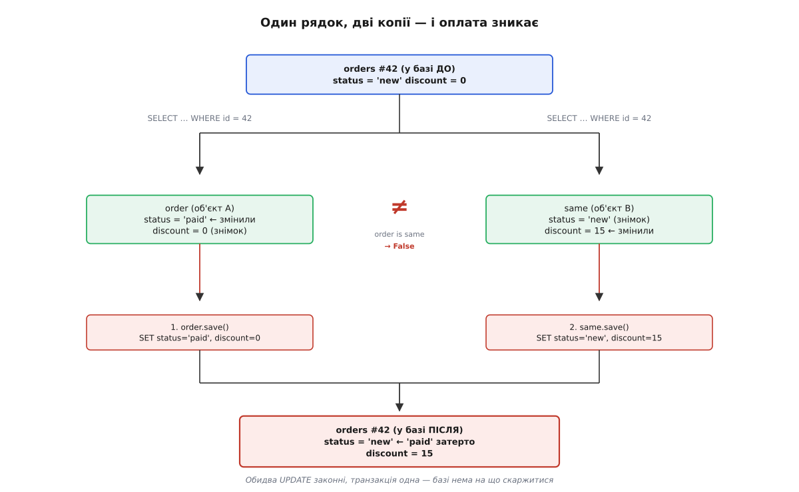
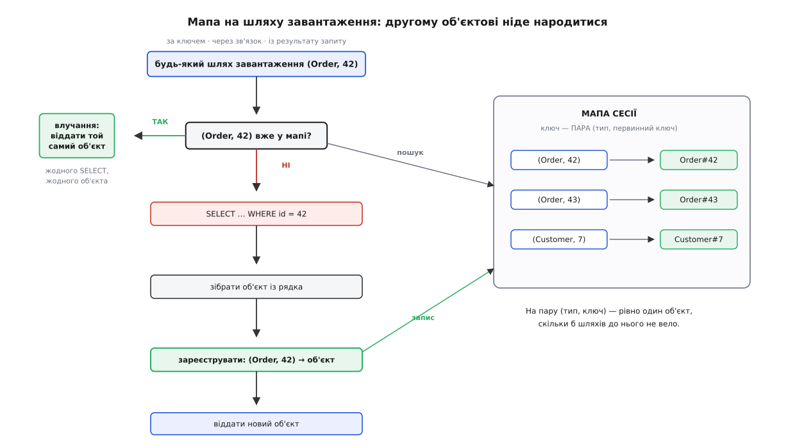
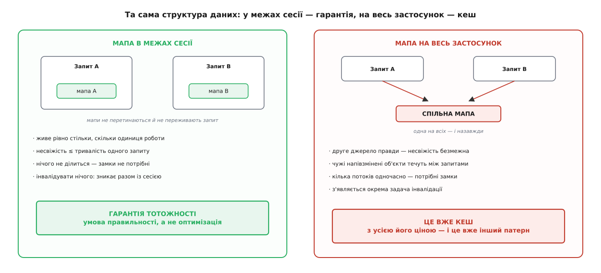

# Identity Map

<preknowlist>
- [Сутність і об'єкт-значення](topic:sf-apps/entity-value-object) — сутність має тотожність поза значеннями своїх полів, об'єкт-значення не має жодної; уся стаття про це розрізнення.
- [ORM](topic:sf-data/orm) — що таке відображення рядків бази на об'єкти пам'яті й хто його виконує.
- [Хеш-таблиця](topic:sf-algorithms/hash-table) — відображення «ключ → значення» зі сталим пошуком; сама мапа, про яку йдеться, це вона.
- [Транзакції та ACID](topic:sf-data/transactions-acid) — транзакція як межа, всередині якої робота або відбувається вся, або не відбувається зовсім.
</preknowlist>

У пам'яті програми «те саме» означає рівно одне: та сама адреса. Два імені вказують на один об'єкт — це один об'єкт, крапка. У базі даних «те саме» означає геть інше: той самий первинний ключ. Рядок №42 — це рядок №42, і байти, у яких він цієї миті лежить, нікого не обходять.

Поки ці два світи не зустрічаються, суперечності немає. Але [ORM](topic:sf-data/orm) саме тим і живе, що їх зводить, — і в місці зустрічі є тріщина, з якої випливає геть усе інше.

### Тріщина: читання — це копіювання

Прочитати рядок із бази — це його **скопіювати**. SELECT віддає значення стовпців, код будує з них новий об'єкт. Нічого іншого він зробити й не може: у пам'яті бази об'єктів твоєї мови немає, є сторінки з байтами.

А що буде, якщо прочитати той самий рядок двічі? Буде дві копії. Два об'єкти, за різними адресами, кожен зі своїм життям. Твоя мова про їхню спорідненість не знає нічого: для неї це два незнайомі об'єкти, які випадково мають однакове число в полі `id`. І тепер у тебе в руках дві речі, які **база вважає однією**, а **мова — двома**. Подивімося, чого це коштує.

**Умова: один HTTP-запит, дві незалежні гілки коду чіпають замовлення №42. Django ORM, карти тотожності немає взагалі.**

```py
# гілка 1 — служба оплати
order = Order.objects.get(pk=42)            # SELECT * FROM orders WHERE id=42
order.status = "paid"

# гілка 2 — служба знижок, дістає те саме замовлення через клієнта
customer = Customer.objects.get(pk=7)
same = customer.orders.get(pk=42)           # ЩЕ ОДИН SELECT * FROM orders WHERE id=42

order is same                               # False — два об'єкти на один рядок
same.discount = 15

order.save()   # UPDATE orders SET status='paid', discount=0  WHERE id=42
same.save()    # UPDATE orders SET status='new',  discount=15 WHERE id=42
```

У базі лишилося `status='new'`, `discount=15`. Оплата зникла. Не «зламалася», не «дала помилку» — **зникла тихо**, бо `same` тримав знімок рядка, зроблений до того, як `order` виставив `paid`, і чесно записав усі свої поля назад.



*Один рядок, дві копії, дві правди: другий запис затирає перший, і жодна перевірка цього не бачить.*

Найгірше тут не сама втрата, а те, що **ніщо в базі її не помітить і не завадить**. Це один процес, одне з'єднання, одна транзакція. Обидва UPDATE — цілком законні записи від того самого клієнта, у правильному порядку. [Рівні ізоляції](topic:sf-data/isolation-levels) боронять від чужих паралельних транзакцій — а тут паралельних транзакцій немає. [Оптимістичне блокування](topic:sf-data/optimistic-locking) звірило б версію рядка — але обидва об'єкти прочитали ту саму версію, тож обидва пройдуть перевірку. Втрачене оновлення сталося **всередині** твоєї власної одиниці роботи, а туди база не бачить: вона бачить два законні UPDATE і слухняно виконує обидва.

Отже, база тут не помічник. Лікувати треба вище — там, де народилася друга копія.

### Ліки: вузьке горло, яке пам'ятає

Якщо біда в тому, що один рядок породжує багато об'єктів, то й лікувати треба саме це: зробити так, щоб рядок міг породити об'єкт **лише раз**.

Для цього потрібне вузьке горло. Хай усі шляхи, якими об'єкт потрапляє в пам'ять — читання за ключем, обхід зв'язку, результат запиту, — проходять через одне місце. І хай це місце **пам'ятає**, кого вже впустило:

```
завантажити(тип, ключ):
    якщо (тип, ключ) є в мапі:
        віддати те, що лежить у мапі         ← жодного SELECT, жодного нового об'єкта
    інакше:
        рядок  = SELECT ... WHERE id = ключ
        об'єкт = зібрати(рядок)
        мапа[(тип, ключ)] = об'єкт
        віддати об'єкт
```

Ось і весь патерн. Мапа, ключ якої — тотожність, а значення — той єдиний об'єкт, що цю тотожність утілює. Звідси й назва: **Identity Map**, карта тотожності (англ. *identity* < латин. *idem* — «той самий»; *map* — «відображення»). Формулювання Мартіна Фаулера, який записав патерн у «Patterns of Enterprise Application Architecture» (2002), сухе й точне: кожен об'єкт завантажується **лише раз**, а далі на нього посилаються через мапу.

Поверни тепер приклад із оплатою в цю схему. Другий пошук замовлення №42 не дійде до бази: він знайде в мапі об'єкт, який гілка 1 туди поклала, і віддасть **його**. `order is same` стане `True`. Знижка й статус ляжуть на один і той самий об'єкт, збережеться він один раз, і затирати буде нічого. Тріщини більше немає — бо більше немає двох копій.



*Вузьке горло: перш ніж збирати об'єкт із рядка, шлях завантаження питає мапу — і другий об'єкт на той самий ключ просто не має де народитися.*

### Ключ — це пара, а не число

Дрібниця, на якій легко послизнутися: ключем мапи не може бути голе число. Клієнт №1 і Замовлення №1 обидва мають первинний ключ `1`, але це різні речі — і якщо мапа їх переплутає, з'явиться значно веселіший клас помилок, ніж той, який ми щойно лікували.

Тому ключ **складений**: пара «тип сутності + первинний ключ». Саме тому в Hibernate мапа сесії оголошена як `Map<EntityKey, Object>`, де `EntityKey` — клас сутності разом з ідентифікатором, а не `Map<Long, Object>`. Якщо первинний ключ сам складений із кількох стовпців, у ключ мапи йде весь кортеж.

Зберімо мінімальну карту тотожності — вона коротка, і в ній видно все, що ми досі проговорили:

:::tabs
```py
class IdentityMap:
    def __init__(self, db):
        self._objects = {}                    # (тип, ключ) → об'єкт
        self._db = db

    def get(self, cls, pk):
        return self._objects.get((cls, pk))

    def add(self, obj):
        key = (type(obj), obj.pk)
        existing = self._objects.get(key)
        if existing is not None and existing is not obj:
            raise ValueError(f"{key} уже в мапі — це двійник")
        self._objects[key] = obj
        return obj

    def load(self, cls, pk):
        found = self.get(cls, pk)
        if found is not None:
            return found                      # влучання: до бази не йдемо
        row = self._db.select_one(cls.table, pk)
        return self.add(cls.from_row(row)) if row else None
```
```ts
type Ctor<T> = new (...args: never[]) => T;
type Pk = string | number;

class IdentityMap {
  // Map порівнює ключі за посиланням, тож кортеж [Order, 42] не спрацює:
  // кожен літерал масиву — новий об'єкт. Тому мапа вкладена: тип → (ключ → об'єкт).
  readonly #byType = new Map<Ctor<unknown>, Map<Pk, unknown>>();

  constructor(private readonly db: Db) {}

  get<T>(cls: Ctor<T>, pk: Pk): T | undefined {
    return this.#byType.get(cls)?.get(pk) as T | undefined;
  }

  add<T extends { pk: Pk }>(cls: Ctor<T>, obj: T): T {
    let bucket = this.#byType.get(cls);
    if (!bucket) this.#byType.set(cls, (bucket = new Map()));
    const existing = bucket.get(obj.pk);
    if (existing !== undefined && existing !== obj) {
      throw new Error(`${cls.name}#${obj.pk} уже в мапі — це двійник`);
    }
    bucket.set(obj.pk, obj);
    return obj;
  }

  async load<T extends { pk: Pk }>(cls: Ctor<T> & { fromRow(r: Row): T }, pk: Pk) {
    const found = this.get(cls, pk);
    if (found !== undefined) return found;     // влучання: до бази не йдемо
    const row = await this.db.selectOne(cls, pk);
    return row ? this.add(cls, cls.fromRow(row)) : undefined;
  }
}
```
:::

Перевірка в `add` — не педантизм, а найдешевший спосіб зловити двійника рівно тієї миті, коли він з'явився, а не через три години в звіті про зниклу оплату. Якщо якийсь шлях завантаження обійшов мапу й побудував другий об'єкт, `add` про це скаже вголос.

Глибше — реєстрацію в [Unit of Work](topic:sf-data/unit-of-work), слабкі посилання, межі сесії й навантажувальний тест, який показує зниклу оплату до й після, — розібрано в [робочій реалізації карти тотожності](topic:sf-data/identity-map/proj-identity-map.md): там мапа доростає до придатної для вжитку разом із відстеженням змін і закриттям сесії.

### Що це відмикає

Карта тотожності платить не лише тим, що прибирає двійників. Щойно вона є, само собою починає працювати кілька речей, які без неї не працюють узагалі.

**Порівняння знову не бреше.** `a == b` для сутностей стає правдою тоді й лише тоді, коли це та сама сутність. Об'єкти можна класти в множини й брати ключами словників, не переписуючи щоразу порівняння за ідентифікатором.

**[Unit of Work](topic:sf-data/unit-of-work) стає можливим.** Одиниця роботи веде список змінених об'єктів і наприкінці записує їх одним заходом. Але «список змінених» має сенс лише тоді, коли на рядок припадає один об'єкт. Якби їх було два, одиниця роботи мала б два записи про рядок №42 з різними значеннями — і жодного способу вибрати правильний. Карта тотожності — це та передумова, на якій одиниця роботи взагалі тримається.

**Циклічні зв'язки замикаються.** Замовлення знає клієнта, клієнт знає свої замовлення. Завантажуємо замовлення №42 → треба клієнт №7 → щоб зібрати клієнта, треба його замовлення → серед них №42 → завантажуємо замовлення №42 → треба клієнт №7 → … Без мапи в цього спуску немає дна: він крутиться, доки не скінчиться стек.

Мапа розриває коло, і навіть не навмисно — просто через порядок дій. Об'єкт реєструють у мапі **до того**, як заповнюють його зв'язки. Тож коли спуск удруге доходить до замовлення №42, мапа вже його має — і віддає: ще недобудований, але **той самий**. Коло замикається на об'єкті, з якого почалося, і граф збирається за скінченну кількість кроків. Чому цей спуск скінченний обов'язково, а не за щасливим збігом, як інваріант «на пару (тип, ключ) — не більше одного живого об'єкта» робить завантаження ідемпотентним і де саме проходить межа цієї гарантії — виведено в [інваріантах карти тотожності](topic:sf-data/identity-map/math-identity-invariants.md).

Це, до речі, показує, що [ліниве завантаження](topic:sf-data/lazy-loading) й карта тотожності розв'язують різні задачі: ліниве відкладає похід у базу, мапа гарантує, що цей похід не породить двійника.

### Скільки живе мапа

Тепер найважливіше практичне питання — і те, на якому найчастіше помиляються. Мапа тримає об'єкти. Скільки саме вона має їх тримати?

Відповідь Фаулера: рівно стільки, скільки живе **одиниця роботи** — сесія, транзакція, запит. Не довше. Спокуса зробити інакше очевидна: мапа й так тримає об'єкти, вона й так прибирає зайві SELECT-и — то чому б не лишити її на весь застосунок і не читати ті самі рядки взагалі ніколи?

Бо тоді це вже не карта тотожності, а **кеш** — з усім, що до кеша додається. Мапа на весь застосунок — це [друге джерело правди](topic:sf-data/cache-invalidation-intro), і воно негайно вимагає плати. Несвіжість стає безмежною: рядок змінили ззовні, а мапа роками віддає об'єкт, зібраний із торішнього знімка, — і нема кому сказати їй про це. Об'єкти течуть між користувачами: запит користувача А тримає замовлення в напівзміненому стані, а запит користувача Б цієї ж миті отримує з мапи той самісінький об'єкт і бачить чужу недороблену роботу. Мапу починають смикати кілька потоків одночасно — отже, їй потрібні замки, а замки в гарячій точці, крізь яку проходить кожне завантаження, це вже окрема інженерна історія.

Мапа в межах сесії не має нічого з цього. Вона народжується на початку запиту й помирає в кінці. Несвіжість обмежена тривалістю одного запиту — тобто мілісекундами, і це усвідомлена ціна за узгоджений знімок. Жоден інший запит її не бачить, тож замків не треба. Інвалідувати нічого — мапа просто зникає разом із сесією.



*Одна й та сама структура даних: у межах сесії вона гарантує тотожність, а на весь застосунок — перетворюється на кеш і тягне за собою всі кешеві клопоти.*

Саме тому в Hibernate кеш першого рівня — мапа сесії — **увімкнений завжди, і вимкнути його не можна**, а кеш другого рівня, спільний на всю фабрику сесій, це окрема річ, яку вмикають свідомо й з відкритими очима. Це не примха реалізації, а прямий наслідок міркування вище: перше — умова правильності, друге — оптимізація з наслідками.

> 🔧 **Навіщо це.** Коли в проді «зникає» оплата або знижка, яку точно виставили в коді, перше питання — не до бази й не до рівня ізоляції, а таке: чи один це об'єкт. Дві гілки коду, що дістали замовлення різними шляхами, у Django отримають два об'єкти й затруть одна одну, а в Hibernate чи SQLAlchemy — один, і затирати буде нічого. Друге питання — про межі сесії: сесія, що живе довше за запит, тихо перетворює карту тотожності на спільний кеш і починає віддавати чужі напівзмінені об'єкти.

### Це не кеш — і є спосіб це довести

Мапа справді знімає зайві SELECT-и, і це спокушає вважати її оптимізацією. Фаулер попереджає прямо: вона **підробляє** кеш, але головна її турбота — тотожність, а не швидкодія бази. Різниця тут не в словах, і перевірити її можна одним питанням.

**Прибери її й подивись, що зламається.** Прибрав кеш — програма стала повільнішою, але лишилася правильною. Це, власне, й є означення оптимізації. Прибрав карту тотожності — програма не стала помітно повільнішою, зате стала **неправильною**: повернувся приклад із оплатою, що зникла.

Звідси випливає цілком практичний висновок. Промах карти тотожності — це не «просто повільніший шлях», як промах кеша. Промах, унаслідок якого народився другий об'єкт на той самий рядок, — це **дефект**. Через це карту тотожності не налаштовують «вимкнути, щоб заощадити пам'ять» і не міряють у відсотках влучань: у неї немає режиму, в якому вона працює гірше, але правильно.

### Хто це має, а хто ні

Патерн зручний тим, що його видно в реальних інструментах — і видно наслідки як його наявності, так і його відсутності.

**Hibernate і JPA** тримають мапу в самому осерді: сесія (у JPA — контекст персистентності) і **є** картою тотожності, тією самою `Map<EntityKey, Object>`. Усередині сесії на пару «клас + ідентифікатор» припадає рівно один екземпляр, хай би скільки шляхів до нього вело. **SQLAlchemy** робить те саме й навіть не ховає мапу — до неї можна просто звернутися:

:::tabs
```java
// Hibernate: мапа сесії увімкнена завжди — до неї не треба нічого налаштовувати
Order a = session.get(Order.class, 42L);
Order b = session.createQuery("from Order o where o.id = 42", Order.class)
                 .getSingleResult();

a == b;                       // true — той самий екземпляр, хоча шляхи різні:
                              // перший — за ключем, другий — через запит
```
```py
# SQLAlchemy: мапа сесії лежить на видноті — session.identity_map
a = session.get(Order, 42)
b = session.execute(select(Order).where(Order.id == 42)).scalar_one()

a is b                        # True — той самий об'єкт
session.identity_map.keys()   # [(<class Order>, (42,), None)]
                              # ключ = (клас, кортеж первинного ключа, токен)
```
:::

Ключ у SQLAlchemy видно просто очима — і він рівно такий, як ми вивели: клас плюс первинний ключ.

**Django** карти тотожності не має зовсім — з цього ми й почали. Це усвідомлений вибір, а не недогляд: Django тримається [Active Record](topic:sf-data/active-record), де об'єкт сам собі рядок і жодної сесії, яка володіла б мапою, просто немає. Ціну за цей вибір платить розробник — зокрема тим, що приклад із затертою оплатою в Django лишається живим і сьогодні.

**Rails** цю ціну спробували не платити — і вийшла повчальна історія. `ActiveRecord::IdentityMap` з'явився в Rails 3.1, так і не став увімкненим за замовчуванням, а в Rails 4.0 (2013) його прибрали зовсім, лишивши в журналі змін формулювання, від якого віє втомою: мапа так і не доросла до типового вмикання «через певні неузгодженості зі зв'язками». Корінь був у тому, що мапа стежила за об'єктами, але не за зв'язками між ними: розірвеш зв'язок на одному боці — а колекція на другому й далі показує старе. Тому патерн, який усередині Data Mapper тримає всю конструкцію, всередині Active Record виявився чужорідним тілом. Як карта тотожності визріла у TopLink іще в дев'яностих, потрапила в Hibernate, дістала ім'я у Фаулера — і чому саме в Rails вона не прижилася, розказано в [родоводі карти тотожності](topic:sf-data/identity-map/hist-identity-map-lineage.md).

Закономірність тут не випадкова: мапа природно живе там, де є [Data Mapper](topic:sf-data/data-mapper) і сесія, — тобто там, де вже є хтось, кому мапу віддати у власність.

### Про що мапа мовчить

Тепер, коли видно, що вона робить, варто рівно так само чітко побачити, чого вона не робить.

**Пам'ять.** Мапа тримає **сильні** посилання, тобто вона — корінь досяжності для [збирача сміття](topic:sf-lang/garbage-collection). Усе, що сесія завантажила, лишається живим, доки живе сесія, — навіть якщо код давно про ці об'єкти забув. Для запиту, що чіпає десяток рядків, це дрібниця. Для нічного пакетного завдання, яке в одній сесії проходить пів мільйона рядків, це гарантований OOM: мапа старанно тримає всі пів мільйона. Ліки — вужчі межі сесії й періодичне очищення мапи, а деякі реалізації дають вибір самої дисципліни зберігання: EclipseLink уміє тримати мапу на [слабких або м'яких посиланнях](topic:sf-lang/weak-references), даючи збирачеві сміття право забрати те, на що більше ніхто не дивиться, і за замовчуванням бере саме такий змішаний варіант, а не «тримати все».

**Несвіжість усередині сесії.** Об'єкт потрапив у мапу — і далі ти бачитимеш **його**, навіть якщо рядок у базі тим часом змінив хтось інший. Повторний SELECT нічого не дасть: він принесе свіжі стовпці, мапа знайде за їхнім ключем наявний об'єкт і віддасть його, а свіжопрочитаний рядок відкине. «Я перечитав із бази й отримав старі дані» — це не хиба, це патерн, який працює за своїм означенням. Потрібні свіжі дані — треба явно попросити оновлення (`refresh`), і це свідома дія, а не побічний ефект запиту.

Звідси — тонкість, на якій спотикаються всі. Запит із умовою йде в базу й повертає ті рядки, які **база** вважає відповідними. Якщо ти вже змінив об'єкт у пам'яті, але ще не записав його, база про зміну не знає — тож `select(Order).where(Order.status == "new")` слухняно поверне рядок №42, бо в базі там і досі `new`. А мапа віддасть тобі об'єкт, у якого `status == "paid"`. У результаті запиту опиниться об'єкт, який умові запиту явно не відповідає. Обидві сторони мають рацію, кожна у своєму світі — просто вони не синхронізовані.

**Це не замок.** Мапа живе в межах сесії, а отже, дає гарантію теж лише в межах сесії. Два процеси, дві сесії — дві мапи, два об'єкти на рядок №42, і жодна з мап про другу не знає. Приклад, з якого ми починали, у міжсесійному вигляді карта тотожності **не лікує**: там потрібне [оптимістичне блокування](topic:sf-data/optimistic-locking) з версією рядка або [песимістичне](topic:sf-data/pessimistic-locking) з реальним замком у базі. Карта тотожності прибирає двійників у себе вдома; порядок між домами — не її справа.

**Виїзд за межі.** Об'єкт, відчеплений від сесії — переданий у в'ю, покладений у чергу, повернений із закритої сесії, — уже поза мапою. Порівняння за посиланням для нього знову бреше: два відчеплені об'єкти з тим самим `id` — це знову два об'єкти. Гарантія тотожності діє рівно від межі сесії до межі сесії, ні на крок далі.

### Коли її просто не треба

Патерн не безкоштовний, тож варто знати, де він зайвий.

Дані **тільки для читання** й незмінні довідники двійниками не псуються: розійтися двом копіям нема куди, якщо їх ніхто не змінює. Дублікати тут — марна витрата пам'яті, а не дефект; лікує їх звичайний кеш, і саме кеш, з усіма своїми правилами інвалідації, а не карта тотожності.

**Об'єкти-значення** карті тотожності непідвладні за означенням: у них немає тотожності. Дві однакові суми грошей — це та сама сума, байдуже, скільки об'єктів її втілює, і питати «а чи той самий це екземпляр» безглуздо. Мапа працює виключно для сутностей — тих, у кого тотожність існує окремо від значень полів.

І, нарешті, там, де сесії немає як поняття — у тонкому шарі доступу до даних, у [Active Record](topic:sf-data/active-record) без одиниці роботи, — мапу нема кому тримати. Rails спробували й відступили. Ціна такого відступу відома й названа: приклад із зниклою оплатою лишається твоєю відповідальністю, і стерегтися його доводиться руками — читати рядок один раз і передавати далі об'єкт, а не ключ.

Уся конструкція, якщо стягнути її в одну думку, тримається на трьох цвяхах. Рядок бази й об'єкт пам'яті мають різні означення тотожності — звідси тріщина. Мапа «(тип, ключ) → об'єкт» на шляху завантаження цю тріщину закриває, бо не дає другому об'єктові народитися. А межа сесії тримає саму мапу в тих рамках, за якими вона перестала б бути гарантією правильності й стала б кешем.
