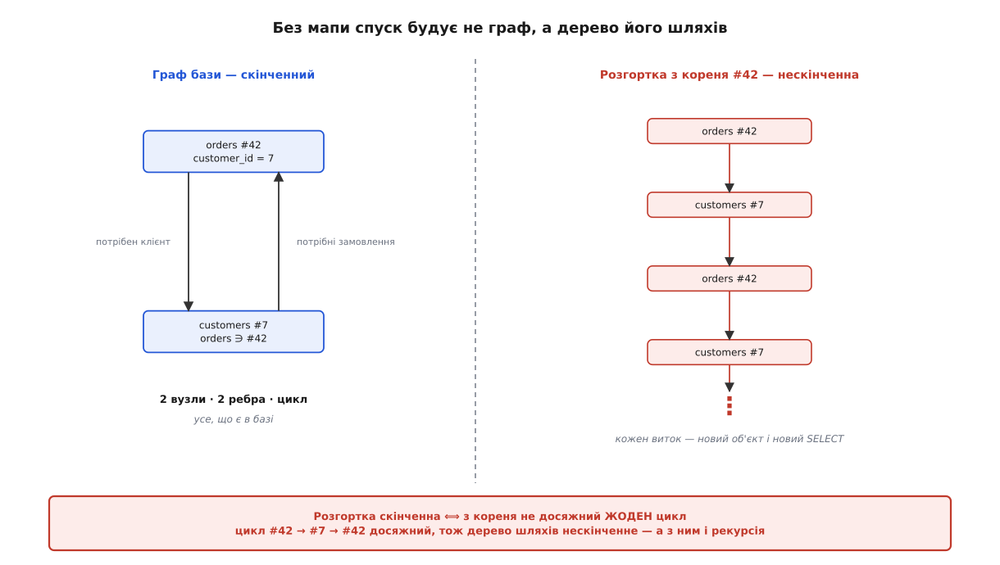
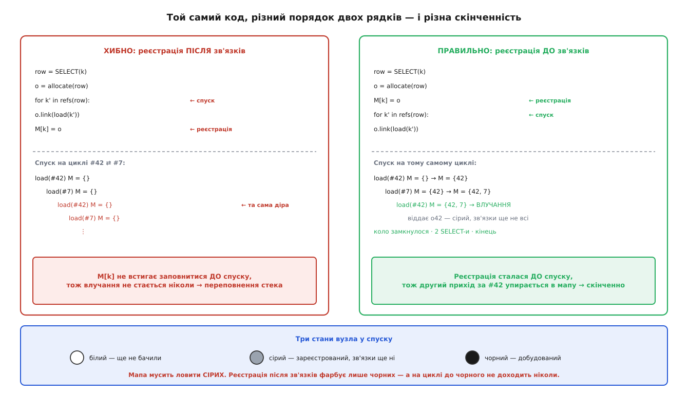

# 🧮 Інваріант тотожності: чому спуск має дно, а завантаження ідемпотентне

Замовлення знає свого клієнта, клієнт знає свої замовлення. Щоб зібрати замовлення №42, потрібен клієнт №7; щоб зібрати клієнта №7, потрібні його замовлення, а серед них — №42. Спуск, який будує об'єкти з рядків, іде цим колом і не має жодної причини спинитися. З картою тотожності він спиняється — і то не «зазвичай», а завжди, за наперед відому скінченну кількість кроків.

Оце «спиняється» і є предмет розмови. Його легко проголосити й важко заслужити, а різниця між проголошеним і доведеним тут не академічна: якщо скінченність спуску — щасливий збіг, то одного дня комусь стане зручно переставити два рядки місцями, збіг скінчиться, і впаде воно не там, де переставили. Тож виписуймо все точно.

Довести треба три речі, і вони складаються в одну. Перша: **що саме** стверджує карта тотожності — не гаслом «один об'єкт на рядок», а умовою, яку можна перевірити. Друга: чому з цієї умови **обов'язково** випливає, що спуск має дно, і в якому місці доведення ламається, якщо переставити ті два рядки. Третя: як та сама умова робить завантаження **ідемпотентним** — і де ця ідемпотентність закінчується, бо межа в неї є, і проходить вона не там, де здається.

## Що стверджується: мапа — це бієкція

Спершу нотація, бо махати руками тут нема на чому.

```
K = { (T, id) }      — ключі: пара «тип сутності + первинний ключ».
                       Голе число ключем бути не може: Клієнт №1 і Замовлення №1
                       мають однакове id, але це різні речі.
O                    — об'єкти в пам'яті; ототожнюємо їх за адресою.
a ≡ b                — «той самий об'єкт» (одна адреса), а не «рівні значення».
M : K ⇀ O            — мапа: ЧАСТКОВА функція зі скінченною областю визначення.
dom(M) ⊆ K           — ключі, за якими вже щось лежить.
im(M) ⊆ O            — об'єкти, що в мапі лежать.
```

Знак `⇀` (часткова функція) вибрано свідомо: мапа визначена не на всіх ключах, а лише на тих, які вже завантажили. Це не дрібниця нотації — уся гарантія стосується виключно `dom(M)`, і саме тому в неї є межа.

Тепер сам інваріант — умова, істинна між будь-якими двома операціями над мапою:

```
Інваріант тотожності (ІТ):
    M — часткова функція K ⇀ O, ін'єктивна на своїй області визначення.
```

Одне слово «бієкція», але всередині нього дві незалежні половини, і кожна стереже свій бік брехні:

```
(О) однозначність:   на один ключ припадає щонайбільше ОДИН об'єкт
                     ∀ k:  |{ o : M(k) = o }| ≤ 1
                     ⇒ НЕМА ДВІЙНИКІВ: один рядок не породжує двох об'єктів

(І) ін'єктивність:   різні ключі дають РІЗНІ об'єкти
                     ∀ k₁, k₂ ∈ dom(M):  k₁ ≠ k₂  ⇒  M(k₁) ≢ M(k₂)
                     ⇒ НЕМА ЗЛИТТЯ: два рядки не злипаються в один об'єкт
```

Разом вони кажуть, що `M` — бієкція між `dom(M)` і `im(M)`. І звідси задарма випадає та властивість, заради якої все й затівалося:

```
Наслідок (порівняння не бреше):
    ∀ k₁, k₂ ∈ dom(M):   M(k₁) ≡ M(k₂)   ⇔   k₁ = k₂
```

Прочитаймо біумову в обидва боки, бо кожен напрямок тримається на своїй половині. Справа наліво (⇐) — це однозначність: однакові ключі дають той самий об'єкт, бо другому взятися нема звідки. Зліва направо (⇒) — це ін'єктивність: однакові об'єкти означають однаковий ключ, бо різні ключі до одного об'єкта не сходяться. Порушиш будь-який напрямок — і `a ≡ b` перестає бути відповіддю на питання «чи це той самий рядок».

Ось що тут насправді сказано. Порівняння за посиланням — операція, яка про базу не знає нічого й знати не може, — стає **точною процедурою розв'язання** питання про тотожність рядка. Не наближенням, не евристикою: біумова діє в обидва боки. Дешевша перевірка, ніж порівняння адрес, у машині просто не існує, і карта тотожності примудряється навісити на неї змістовну відповідь про стан бази.

> 🔧 **Навіщо це.** Дві половини інваріанта ламаються різними руками, і плутати їх дорого. Однозначність ламає **шлях завантаження**, який обійшов мапу й побудував другий об'єкт: лікується тим, що всі шляхи заганяють у вузьке горло. Ін'єктивність ламає **зміна ключа вже зареєстрованого об'єкта**: жодне вузьке горло від цього не боронить, бо об'єкт уже всередині. Коли `a is b` дало несподівану відповідь, перше питання — котра з двох половин упала, бо ліки в них спільного не мають нічого.


*Бієкція ламається з двох боків, і поломки дзеркальні: двійник дає `False` для одного рядка, злиття дає `True` для різних.*

## Завантаження — це обхід графа, а мапа — множина відвіданих

Тепер про скінченність. Щоб її довести, треба спершу побачити, що спуск — це насправді за задача.

База — скінченний [граф](root:math-combinatorics/graph-theory): множина, на якій задано відношення «вести до». Вузли — рядки, ребра — зовнішні ключі:

```
R ⊆ K                — ключі рядків, що справді існують у базі. СКІНЧЕННА множина.
refs(k) ⊆ R          — ключі, на які посилається рядок k. Скінченна множина.
E = { (k, k') : k' ∈ refs(k) }        — ребра
G = (R, E)           — граф бази: скінченний, орієнтований, з циклами
```

Скінченність `R` тут не припущення, а факт: рядків у базі стільки, скільки їх є. Цикли теж не патологія — це нормальні двобічні зв'язки, за які ніхто не вибачається.

Наївний спуск, без жодної мапи, виглядає так:

```
load(k):
    row = SELECT(k)
    o   = allocate(row)
    for k' in refs(row):
        o.link(load(k'))          ← спуск
    return o
```

Що ця процедура обчислює? Питання не риторичне, і відповідь на нього пояснює геть усе подальше. Вона обчислює **не граф**. Вона обчислює **розгортку** графа з кореня — дерево, вузлами якого є не рядки, а **шляхи** до них:

```
Розгортка U(G, k₀):
    вузли  = усі скінченні шляхи в G, що починаються в k₀
    предок шляху (k₀ … kₙ) — це шлях (k₀ … kₙ₋₁)
```

Кожен виклик `load` — це один шлях, а не один рядок. Дійшов до №42 двома різними шляхами — маєш два вузли розгортки, тобто два виклики, два SELECT-и і два об'єкти. Наївний спуск ніколи й не збирався будувати граф: у нього немає жодного способу довідатися, що він тут уже був, бо пам'яті про це в нього немає.

І тоді все стає на місця:

```
Твердження 1:  розгортка U(G, k₀) скінченна  ⟺  з k₀ не досяжний ЖОДЕН цикл.
```

Доведення в обидва боки коротке. (⇐) Якщо циклів із `k₀` не досяжно, досяжна частина `G` — ациклічний граф. У ньому жоден шлях не повторює вузла (повтор і був би циклом), тож довжина шляху ≤ |R|, а шляхів обмеженої довжини у скінченному графі скінченно. (⇒) Якщо цикл досяжний — хай `k₀ ⇝ v` і `v ⇝ v`, — то шляхи `k₀ ⇝ v ⇝ v ⇝ v …` мають як завгодно велику довжину й попарно різні. Нескінченно багато вузлів. □

Тож переповнення стека на циклі — не збій і не край: це чесна спроба побудувати нескінченне дерево скінченною машиною. Спуск робить рівно те, що написано, просто написано не те.



*Дві вершини й два ребра породжують нескінченне дерево шляхів: скінченність графа сама собою не рятує нічого.*

## Ціна розгортки навіть там, де циклів немає

Спокуслива думка: «у нас схема ациклічна, тож розгортка скінченна, тож мапа нам не потрібна». Твердження 1 справді дає скінченність — але не дає нічого більше. Скінченне буває астрономічним.

Найпростіший граф, на якому це видно, — ланцюг із `n` ромбів: кожен рівень `vᵢ` посилається на двох посередників, і обидва посередники посилаються на наступний рівень `vᵢ₊₁`. Виглядає штучно, доки не згадаєш, що ромб з'являється щоразу, коли два різні шляхи ведуть до одного рядка, — а це в будь-якій живій схемі не виняток, а норма.

**Умова: ланцюг із 20 ромбів; рахуємо, скільки вузлів має граф і скільки — його розгортка.**

```
Граф:        |V| = 3n + 1 = 3·20 + 1 = 61 вузол
             |E| = 4n     = 4·20     = 80 ребер

Шляхів v₀ → v₂₀:  на кожному ромбі вибір із двох, вибори незалежні
             2ⁿ = 2²⁰ = 1 048 576

Вузлів розгортки (= викликів load = SELECT-ів у наївному спуску):
             Σ = 2ⁿ⁺² − 3 = 2²² − 3 = 4 194 301

Той самий обхід із мапою:
             SELECT-ів = |V| = 61
             викликів   ≤ 1 + |E| = 81
```

Шістдесят один рядок у базі — і чотири мільйони SELECT-ів, щоб їх прочитати. Різниця не у сталій: `2ⁿ` проти `3n + 1` — це різниця між експонентою й прямою, і жодне залізо її не з'їдає.

Висновок із цього ширший, ніж здається. Ациклічність рятує від нескінченності, але не рятує від розгортки як такої, бо розгортка — це та сама помилка, лише в іншій дозі. Обидві біди — і зациклення, і вибух — це один-єдиний факт, сказаний двічі: **спуск без пам'яті обчислює дерево шляхів замість графа**. Цикл робить дерево нескінченним, спільні посилання роблять його експоненційним. Ліки, отже, теж одні.

## Мапа складає розгортку назад у граф

Ліки — дати спускові пам'ять про те, де він уже був:

```
load(k):
    ①  якщо k ∈ dom(M):  return M(k)          ← влучання: ні SELECT-а, ні об'єкта
    ②  row = SELECT(k);  o = allocate(row)
    ③  M[k] = o                               ← РЕЄСТРАЦІЯ
    ④  for k' in refs(row):  o.link(load(k'))  ← спуск
        return o
```

Чотири рядки, і в них захована вся конструкція. Крок ① робить із дерева шляхів граф: усі шляхи, що закінчуються в `k`, злипаються в один вузол, бо другий і подальші приходи за `k` не породжують нічого. Це буквально факторизація розгортки за відношенням «однаковий кінець шляху» — операція, обернена до розгортання.

Тут варто спинитися й назвати річ своїм ім'ям. Мапа тотожності структурно — **множина відвіданих** із обходу вглиб. Це не аналогія й не спорідненість: предикати «цей рядок уже відвіданий» і «за цим ключем уже є об'єкт» — той самий предикат, записаний двічі. Обхід вглиб у сучасному вигляді вивчав ще у XIX столітті французький інженер-телеграфіст Шарль П'єр Тремо (Charles Pierre Trémaux, 1859–1882) як спосіб виходити з лабіринту, а силу його як інструмента для графових задач показали Гопкрофт і Тарʼян у 1970-х. Карта тотожності — це та сама множина відвіданих, у якої знайшлася друга робота: позначка «відвіданий» і сам об'єкт — це одна й та сама річ, тож реєстр і множина відвіданих збіглися в одну структуру. Через це вона й дістається задарма: платити за неї окремо не треба, вона й так мусила там бути.

## Теорема: спуск скінченний

Тепер власне доведення. Воно коротке, і кожна лема в ньому тягне свою вагу.

```
Лема 1 (монотонність):  dom(M) під час завантаження ніколи не меншає.
```
Крок ③ — єдине місце, де мапу чіпають, і він лише додає. Нічого не вилучає ніхто.

```
Лема 2 (поступ):  кожен виклик, що проминув ①, додає до dom(M) РІВНО ОДИН
                  ключ, якого там не було.
```
Проминув ① — отже, `k ∉ dom(M)`. Крок ③ кладе `k`. За Лемою 1 він там і лишиться.

```
Лема 3 (стеля):  dom(M) ⊆ R, а R скінченна.
```
У мапу потрапляють лише ключі рядків, які справді прочитали.

```
Теорема:  load(k₀) завершується, зробивши ≤ |R| SELECT-ів
          і ≤ 1 + |E| викликів.
```

Доведення. Назвімо **промахом** виклик, що проминув ①. За Лемою 2 кожен промах з'їдає один свіжий ключ із `dom(M)`, за Лемою 1 з'їдене не повертається, за Лемою 3 їжі скінченно — тож промахів ≤ |R|. SELECT робить лише промах, звідси перша оцінка. Кожен промах породжує `|refs(k)|` дочірніх викликів; решта викликів — влучання, які повертаються негайно, нікого не породжуючи. Отже, усіх викликів ≤ 1 + Σ|refs(k)| = 1 + |E|. Обидві суми скінченні. □

Величина, яка тут працює, — це `Φ = |R| − |dom(M)|`, кількість ще не зареєстрованих рядків. Вона невід'ємна за Лемою 3 і **строго спадає** на кожному промаху за Лемою 2. Строго спадна невід'ємна ціла величина не може спадати вічно — ось і все дно. Це [варіант циклу](root:math-logic/loop-variant) у чистому вигляді: доводячи скінченність, шукають не «здається, воно збігається», а конкретне число, яке не має куди падати нескінченно. Сама теорема тоді — звичайна [індукція](root:math-logic/mathematical-induction) за `Φ`.

Заразом випала й оцінка: `O(|V| + |E|)` замість `O(шляхів)`. Це рівно ціна обходу вглиб, і не випадково — це він і є.

## Чому порядок, а не щастя

Тепер найважливіше. Подивімося, де саме в цьому доведенні використано, що ③ стоїть **перед** ④.

У Лемі 2. Вона стверджує, що виклик, який проминув ①, додає ключ до `dom(M)` — і мовчазно припускає, що додає його **до того**, як спуститься. Переставмо ③ і ④ місцями:

```
load(k):
    якщо k ∈ dom(M):  return M(k)
    row = SELECT(k);  o = allocate(row)
    for k' in refs(row):  o.link(load(k'))   ← спуск ПЕРШИЙ
    M[k] = o                                  ← реєстрація ОСТАННЯ
    return o
```

Лема 2 стала хибною. Виклик проминув ①, але `dom(M)` не змінився — зміниться колись потім, після повернення зі спуску. А величина `Φ` тепер не спадає на промаху, і разом із нею випаровується вся теорема.

Це не формальна причіпка, у неї є конкретне тіло. Спуск за циклом `#42 → #7 → #42` приходить за ключем `42` **всередині** виклику `load(42)`, який ще не дійшов до свого рядка `M[k] = o`. Мапа порожня, ① не спрацьовує, промах, ще один SELECT, ще один спуск — і так до кінця стека. Реєстрація «наприкінці» ніколи не настає, бо «кінець» — за спуском, а спуск не завершиться, доки не буде реєстрації. Змія кусає себе за хвіст.

Найточніше це видно мовою трьох кольорів обходу вглиб. **Білий** — вузол ще не бачили. **Сірий** — зайшли, але ще не вийшли: об'єкт уже є, зв'язки ще не всі. **Чорний** — добудований остаточно. Мапа мусить ловити **сірих**: саме сірий вузол зустрічає спуск, коли замикає цикл. Реєстрація після зв'язків фарбує вузли одразу з білого в чорний, оминаючи сірий, — і на циклі до чорного не доходить ніколи, бо чорним вузол стає лише після спуску, а спуск і чекає на цю фарбу. Отже, порядок ③ перед ④ — не гігієна й не смак: це єдине місце, де народжується сірий колір, а без сірого немає скінченності.



*Переставлені два рядки не «трохи гірші»: вони змінюють не швидкість, а скінченність.*

Це не теорія на дошці. Hibernate робить рівно це і навіть називає речі точно: перед заповненням полів у контекст персистентності кладуть **порожній** екземпляр — javadoc `TwoPhaseLoad.addUninitializedEntity` пояснює його призначення як «placeholder to ensure object identity», а `postHydrate` окремо застерігає, що зв'язки на цьому кроці ще не розв'язують. Заглушка в мапі з'являється раніше за будь-яке поле. Двофазність тут — не оптимізація читання з JDBC, а прямий наслідок теореми: фаза перша існує лише для того, щоб сірий колір узагалі був.

## Неминуча ціна: сірий об'єкт неповний

За скінченність платять, і ціна теж доводиться, а не оцінюється на око.

```
Твердження 2:  хай спуск будує кожен об'єкт рівно раз і завершується на
               графі з циклом k₁ → k₂ → … → kₙ → k₁.
               Тоді існує мить, коли викликач одержує об'єкт із НЕ ВСІМА
               заповненими зв'язками.
```

Доведення. Розгляньмо мить замикання кола: внутрішній `load(k₁)` повертає об'єкт `o₁` своєму викликачеві — виклику `load(kₙ)`. Оскільки кожен об'єкт будують рівно раз, це той самий `o₁`, що його створив зовнішній `load(k₁)`. Але зовнішній `load(k₁)` цієї миті ще на стеку — він і породив увесь ланцюг, — тобто зі свого циклу по `refs` не вийшов. Отже, зв'язки `o₁` заповнені не всі, і саме такий `o₁` одержує `load(kₙ)`. □

Формулювання варте того, щоб його прочитати повільно, бо воно про неможливість. Три бажання — **будувати кожен об'єкт раз**, **завершуватися на циклах**, **ніколи не показувати недобудованого** — в однопрохідному спуску несумісні. Не «важко поєднати», а несумісні: доведення вище не лишає щілини. Хвиля «об'єкт існує» мусить бігти попереду хвилі «об'єкт добудований», бо на циклі друга хвиля залежить сама від себе.

Виходів рівно два, і обидва живуть у справжніх ORM. Або визнати сірий стан і жити з правилом «не чіпай сутність посеред завантаження» — тоді неповний об'єкт існує, але тільки всередині спуску. Або розірвати саму залежність: підставити замість зв'язку заглушку, яка вдає об'єкт і піде в базу лише тоді, коли до неї звернуться. Друге — це [ліниве завантаження](root:sf-data/lazy-loading): відкладаючи похід у базу, воно заразом ріже ребро графа, і цикл просто перестає бути циклом для спуску. Третій вихід — «зібрати все й тільки потім позв'язувати» — це та сама двофазність, лише винесена назовні, з тим самим сірим станом посередині.

## Ідемпотентність: що саме повторюється безкарно

Тепер друга обіцянка інваріанта. Слово «ідемпотентний» вимагає обережності, бо `load` — не [чиста функція](root:sf-apps/pure-functions-side-effects): вона повертає значення **і** міняє мапу. Означення `f(f(x)) = f(x)` до неї просто так не прикладеш, тож запишімо `load` як перетворювач стану:

```
⟨M, k⟩ ⇒ ⟨M', o⟩      — завантаження k зі стану M дає стан M' і об'єкт o
L_k : M ↦ M'          — те саме, як функція лише на стані
```

І тоді твердження звучить точно:

```
Твердження 3 (ідемпотентність):
    якщо ⟨M, k⟩ ⇒ ⟨M₁, o₁⟩  і  ⟨M₁, k⟩ ⇒ ⟨M₂, o₂⟩
    то  M₂ = M₁   і   o₂ ≡ o₁
еквівалентно:   L_k ∘ L_k = L_k
```

Доведення — один рядок, і весь він спирається на інваріант. Після першого завантаження `k ∈ dom(M₁)` за Лемою 2. Тому друге завантаження впирається в ①, повертає `M₁(k) = o₁` і до ② не доходить: ні SELECT-а, ні `allocate`, ні дотику до мапи. Отже `M₂ = M₁` і `o₂ ≡ o₁`. □

Тривіальність доведення тут не вада, а суть: [ідемпотентність](root:sf-distributed/idempotency) не додана до мапи окремим зусиллям, вона **вже є** в тому, що мапа — функція. Однозначність і означає, що другий виклик не має де взяти іншу відповідь.

Із того самого факту випадає й дещо сильніше. Мапа — функція, а не будь-яке відношення, тож ототожнення, яке вона наводить, **не залежить від порядку завантажень**: хоч `L_k ∘ L_j`, хоч `L_j ∘ L_k` — область визначення вийде та сама (`dom(M) ∪ досяжні(k) ∪ досяжні(j)`), і «той самий ключ ⇒ той самий об'єкт» триматиметься в обох. Конкретні адреси від порядку залежать, розбиття на класи тотожності — ні. Тому й не буває питання «а якщо два шляхи завантаження перегоняться, чий об'єкт переможе»: переможе той, хто прийшов першим, і саме тому це неважливо.

## Другий бік бієкції: ін'єктивність і незмінність ключа

Однозначність `M` дістається задарма — вона в самому типі структури. З ін'єктивністю не так: жодна мапа сама собою не боронить від того, щоб один об'єкт опинився під двома ключами. Як це стається?

Ключ об'єкта не береться з повітря — його читають із самого об'єкта: `key(o) = (type(o), o.pk)`. Доки `o.pk` незмінне, всі згодні. Але хай хтось поміняє `pk` уже зареєстрованому об'єктові:

```
M = { (Order, 42) ↦ o }      # o зареєстрований
o.pk = 58                     # ключ об'єкта поїхав
load(Order, 58)               # промах: (Order,58) ∉ dom(M) → SELECT → новий об'єкт o'
                              # а o все ще лежить під (Order, 42)

# тепер:  M(Order,42) ≡ o     — об'єкт, що вважає себе 58-м
#         M(Order,58) ≡ o'    — і мапа, і об'єкт кажуть різне
```

Мапа стала брехати обома половинами одразу: під ключем `42` лежить об'єкт, який не є рядком №42, а якщо цей самий `o` десь по дорозі ще й зареєструють під `58`, ін'єктивність упаде явно — два ключі, один об'єкт, і `a ≡ b` каже `True` про різні рядки. Це рівно дзеркальне лихо до двійника, і воно підступніше: двійник дає зайвий UPDATE, злиття дає **зниклу сутність**.

Ліки тут не в мапі, бо мапа вже безсила — біда сталася всередині неї. Ліки в тому, щоб зробити подію неможливою: **ключ зареєстрованого об'єкта не змінюють ніколи**. Це вимога інваріанта, а не смак реалізації, і промислові ORM її так і формулюють: документація Hibernate прямо каже, що вставлені значення ідентифікатора вже не можна змінювати, і додає, що JPA оголошує поведінку при зміні ідентифікатора невизначеною, а Hibernate її просто не підтримує. Рекомендація там же й практична: коли значення таки мусить мінятися, воно не має бути первинним ключем — хай буде природним ідентифікатором, а ключ лишиться сурогатним і мертвим.

Тобто «сурогатний ключ» — не бюрократія й не звичка. Це умова, за якої `key(o)` лишається сталою, а `M` — ін'єктивною.

## Де проходить межа гарантії

Тепер найтонше. Усе доведене вище доведено **відносно однієї мапи `M`** — і жодне слово не сказано про світ поза нею. Прочитаймо інваріант ще раз, звертаючи увагу на квантори: «∀ k₁, k₂ **∈ dom(M)**». Ось де межа, і в неї чотири боки.

**Мапа одна — гарантія одна.** Дві сесії мають дві мапи, `M_A` і `M_B`, і кожна бієктивна сама в собі. Але про пару `⟨M_A, M_B⟩` не стверджено нічого: `M_A(k) ≢ M_B(k)` — це нормально, це два різні об'єкти на той самий рядок, і жоден інваріант при цьому не порушено. Композиція `M_B ∘ M_A⁻¹` — теж бієкція, бездоганна математично й невидима для машини: у пам'яті немає нікого, хто б її втілював, тож `a ≡ b` між сесіями відповідає `False` і має рацію. Тому карта тотожності не є й не може бути замком: замок — це твердження **між** мапами, а вона нічого між ними не стверджує. Порядок між сесіями доводиться будувати іншими засобами — версією рядка чи справжнім замком у базі.

**Ключ мусить існувати.** `key(o)` — часткова функція: у щойно створеного об'єкта, який ще не дійшов до INSERT, первинного ключа немає. Такий об'єкт **не може** бути в мапі — не «його забули покласти», а в `K` для нього немає елемента. Тому реалізації тримають нові об'єкти в окремому списку до вставки й переносять у мапу лише після того, як база видасть ключ. Ця окремість не архітектурний смак: доти, доки ключа немає, ототожнювати нема за чим, і вся конструкція просто не має за що вхопитися.

**Виїзд за межу мапи.** Відчеплений об'єкт — переданий у в'ю, покладений у чергу, повернений із закритої сесії — це `k ∉ dom(M)`. Квантор його не покриває, і `≡` для нього знову нічого не значить: два відчеплені об'єкти з однаковим `id` — знову двійники. Гарантія діє рівно від межі сесії до межі сесії, і жодного кроку далі — не тому, що хтось поскупився, а тому, що доводили її про `dom(M)`.

**Ідемпотентність — про тотожність, не про свіжість.** Оце місце найпідступніше, бо тут інваріант тримається, а очікування — ні. Твердження 3 каже: другий `load` поверне **той самий об'єкт**. Воно не каже, що об'єкт буде **свіжий**, і саме тому ідемпотентність тут — не втішна звістка, а рахунок. Хай хтось інший тим часом змінив рядок:

```
⟨M, k⟩ ⇒ ⟨M₁, o⟩        # прочитали, o зібраний зі знімка v1
        (хтось інший записав рядок k: v1 → v2)
⟨M₁, k⟩ ⇒ ⟨M₁, o⟩       # ① влучає: той самий o, той самий v1

# L ідемпотентна — і саме тому v2 не побачить ніхто.
```

Ідемпотентність і несвіжість — не сусіди, а одне й те саме твердження з двох боків. «Другий виклик нічого не змінює» = «другий виклик не принесе нових даних». Хочеш свіжості — мусиш вийти за `load` і попросити явно (`refresh`), тобто виконати операцію, яка **не** ідемпотентна за побудовою. Одна дія не може водночас гарантувати сталість відповіді й приносити зміни: це суперечність, а не недогляд.

Звідси й та тонкість, на якій спотикаються всі. Запит із умовою йде в базу, і рядки добирає **база** — за тим, що записано в ній. Мапа ж підмінює зібрані об'єкти на вже наявні — за тим, що є в пам'яті. Дві половини відповіді приходять із двох різних світів, і ніхто не обіцяв, що вони узгоджені: у результат `where status = 'new'` цілком законно потрапить об'єкт зі `status = 'paid'`, якщо зміну ще не записали. Обидві сторони мають рацію, кожна у своєму — просто рація в них про різні стани.

## Що з цього лишається

Три обіцянки склалися в одну умову, і варто побачити, як щільно.

Скінченність спуску — не властивість мапи, а властивість **порядку**: реєстрація перед спуском створює сірий колір, сірий колір дає строго спадну величину `Φ`, спадна невід'ємна величина дає дно. Переставиш два рядки — зникне сірий, зникне спад, зникне дно, і то на всіх циклах одразу.

Ідемпотентність — не властивість порядку, а властивість **однозначності**: другий виклик не має де взяти іншу відповідь, бо мапа — функція. Це та сама однозначність, що прибирає двійників; двійники й повторні SELECT-и — один факт, сказаний двічі.

А межа в обох — не властивість реалізації, а **квантор**: усе доведено про `k ∈ dom(M)`. Поза цією множиною не порушено нічого — там просто нічого не стверджено. Тому карта тотожності й не рятує ні між сесіями, ні після відчеплення, ні від несвіжості: не тому, що погано зроблена, а тому, що це інші питання, до яких у неї не було й слова.
