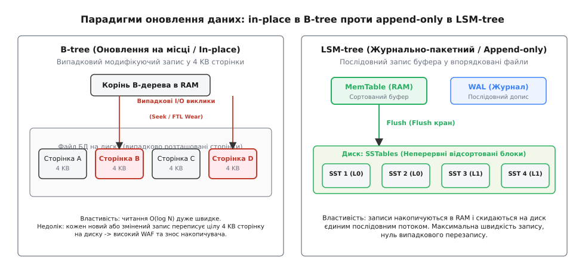
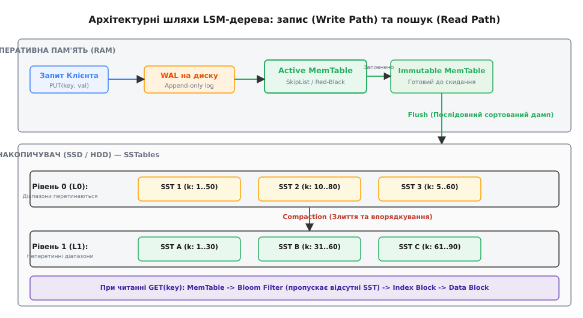
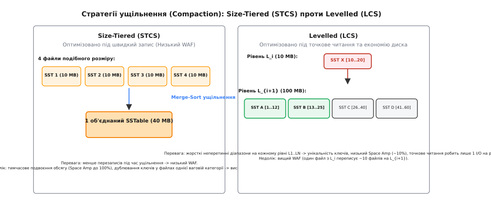

# B-tree vs LSM-tree / log-structured

<preknowlist>
- [B-дерево](root:sf-data/b-tree) — древоподібна структура індексації диска з фіксованими сторінками.
- [Шар трансляції флешу (FTL)](root:sf-data/ftl-flash-translation) — фізичні особливості запису та стирання блоків у SSD.
- [Фільтр Блума](root:sf-algorithms/bloom-filter) — ймовірнісна структура для швидкої перевірки відсутності ключа.
- [Коефіцієнт підсилення запису](root:sf-data/write-amplification) — відношення фізичних дискових записів до користувацьких даних.
</preknowlist>

Уявіть, що ви ведете журнал обліку товарів у великому складі. Кожного разу, коли надходить новий товар, у вас є два шляхи: або відкрити відповідну сторінку алфавітної книги й акуратно вписати назву (іноді стираючи стару або розсуваючи сусідні записи, якщо місце закінчилося), або просто швидко виписати нову позицію на аркуш паперу й кинути його у висувну шухляду столу.

Перший шлях вимагає тривалого пошуку та переформатування сторінки під час кожного запису, але робить подальше читання миттєвим. Другий шлях робить запис практично безкоштовним, але змушує передивитися всі накопичені аркуші, коли хтось запитує залишок товару.

Ця побутова дилема точно відображає розкол між двома фундаментальними парадигмами побудови сховищ даних у сучасній комп'ютерній інженерії: **B-деревами** (B-trees) та **лог-структурованими деревами зі злиттям** (**Log-Structured Merge-trees**, або **LSM-trees**).

---

## 1. Чому виникла потреба в новому підході: Фізичні межі накопичувачів

Десятиліттями основою класичних реляційних баз даних (PostgreSQL, Oracle, MySQL InnoDB) слугували B-дерева. Вони розбивають файл бази даних на фіксовані блоки — сторінки (розміром від 4 KB до 16 KB). Кожен новий або модифікований запис знаходить свою сторінку й модифікує її безпосередньо у файлі. Цей принцип називається **оновленням на місці** (**in-place update**).

Поки навантаження на систему складалося переважно з читання даних, B-дерева демонстрували чудові результати. Проте з настанням ери Big Data, високонавантаженого логування, сенсорних мереж IoT та фінансових транзакцій обсяг операцій запису різко зріс. Тут традиційна модель B-дерев зіштовхнулася із жорстким фізичним бар'єром обладнання.


*Парадигми оновлення даних: in-place в B-tree проти append-only в LSM-tree.*

### Механічний диск (HDD)
У класичних жорстких дисках зчитувальна голівка змушена фізично переміщуватися між доріжками (операція **seek**) та чекати обертання магнітного диска. При випадкових перезаписах 4 KB сторінок дисковий накопичувач виконує не більше 100–200 операцій на секунду (IOPS), перетворюючи I/O шину на пляшкове шийку. Натомість при послідовному записі той самий диск здатний прокачувати понад 100 MB даних за секунду.

### Твердотілий накопичувач (SSD)
З появою флеш-пам'яті затримки на переміщення голівки зникли, але з'явилася інша фізична проблема: осередки NAND-флеш не дозволяють перезаписувати окремі 4 KB сторінки на місці. Щоб змінити бодай один байт, контролер SSD змушений зчитати цілий блок стирання (**Erase Block** розміром 2–8 MB), витерти його й записати заново. Постійні випадкові записи в B-дереві викликають катастрофічне **підсилення запису** (**Write Amplification Factor, WAF**) та прискорений знос осередків SSD.

Концепція **лог-структурованого запису** (**log-structured / append-only**) виникла як пряма відповідь на ці фізичні обмеження. Головна ідея полягає в тому, щоб відмовитися від випадкових перезаписів на диску взагалі: **будь-які оновлення та видалення перетворюються на суцільний послідовний потік допису в кінець журналу**.

> 📜 Детальніше про історію створення LSM-дерева Патріком О'Нілом у 1996 році, розробку Google Bigtable, LevelDB та RocksDB читайте у вставці [Історія LSM-tree](root:sf-data/lsm-tree/hist-lsm-origin.md).

---

## 2. Анатомія та фізична модель LSM-дерева

Щоб забезпечити високу швидкість запису й при цьому зберегти можливість швидко шукати ключі, LSM-дерево розділяє збереження даних на два середовища: **оперативну пам'ять (RAM)** та **незмінні дискові файли (Disk)**.


*Архітектурні шляхи LSM-дерева: запис (Write Path) та пошук (Read Path).*

Розглянемо ключові компоненти цієї системи за шляхом проходження даних.

### 1. Write-Ahead Log (WAL)
При надходженні операції запису `PUT(key, value)` або видалення `DELETE(key)` запис спочатку дописується в кінець дискового журналу **WAL**. Це послідовний текстовий або бінарний файл. Оскільки запис іде суворо в кінець, ця операція виконується зі швидкістю фізичної шини диска. WAL гарантує стійкість (Durability): якщо в цей момент вимкнеться живлення, база даних відновить стан оперативно пам'яті, просто перечитавши WAL.

### 2. MemTable (Пам'ятна таблиця)
Паралельно із записом у WAL значення додається у внутрішньопам'ятну структуру — **MemTable**. MemTable підтримує дані у відсортованому за ключем вигляді. Для реалізації MemTable зазвичай використовують **SkipList** (список із пропусками) або **Червоно-чорне дерево** (Red-Black Tree). Вони забезпечують складність вставки та пошуку O(log N).

### 3. Immutable MemTable та Flush
Коли обсяг MemTable досягає заданого ліміту (наприклад, 32 MB або 64 MB), вона заморожується й перетворюється на **Immutable MemTable** (незмінну таблицю). На її місце відкривається нова порожня MemTable. 

Фоновий потік бази даних зчитує Immutable MemTable і послідовно скидає (**Flush**) її вміст на диск у вигляді незмінного відсортованого файлу — **SSTable** (**Sorted String Table**). Оскільки дані у MemTable вже впорядковані, дамп на диск відбувається повністю послідовно, без жодного випадкового I/O. Після успішного скидання відповідна частина WAL очищається.

### 4. SSTable (Sorted String Table)
SSTable — це фундаментальна дискова одиниця збереження в LSM-дереві. Файл SSTable є **абсолютно незмінним** (**immutable**). Він складається з трьох основних частин:
* **Block Data (Блок даних):** Впорядкована послідовність пар «ключ — значення», розбита на стиснені блоки (наприклад, по 4 KB або 64 KB, стиснені LZ4 або ZSTD).
* **Index Block (Індексний блок):** Масив офсетів, що вказує на початок кожного блоку даних та перший ключ у ньому. Дозволяє знайти потрібний блок за допомогою двійкового пошуку (O(log N)).
* **Bloom Filter (Фільтр Блума):** Ймовірнісна структура даних, що зберігається в заголовку SSTable або в RAM. Вона дозволяє за O(1) перевірити, чи існує ключ у цьому SSTable, здатна миттєво відповісти «ключ ТОЧНО відсутній» без єдиного звернення до диска.

```
Структурна анатомія SSTable файлу на диску:
┌────────────────────────────────────────────────────────────────────────┐
│ [ Header & Metadata ] -> Версія, прапорці, статистика                  │
├────────────────────────────────────────────────────────────────────────┤
│ [ Bloom Filter Block] -> Бітовий масив для перевірки відсутності ключа │
├────────────────────────────────────────────────────────────────────────┤
│ [ Index Block       ] -> "alpha": offset 0, "gamma": offset 4096 ...   │
├────────────────────────────────────────────────────────────────────────┤
│ [ Data Block 0      ] -> ("aaa", "v1"), ("abc", "v2"), ("alpha", "v3") │
├────────────────────────────────────────────────────────────────────────┤
│ [ Data Block 1      ] -> ("beta", "v4"), ("delta", "v5") ...          │
└────────────────────────────────────────────────────────────────────────┘
```

### 5. Видалення та надгробки (Tombstones)
Оскільки файли SSTable незмінні, LSM-дерево не може просто знайти й видалити старий ключ з диска. Замість цього операція видалення `DELETE(key)` записує у MemTable та WAL спеціальний маркер видалення — **надгробок** (**Tombstone**). 

Під час пошуку ключів зустріч із Tombstone означає, що ключ був вилучений. Фізичне видалення даних та вилучення самого Tombstone відбувається пізніше — під час процедури ущільнення (**Compaction**).

---

## 3. Глибоке порівняння: B-tree проти LSM-tree

Для правильного вибору інструменту під конкретне завдання інженер мусить бачити повний спектр переваг та недоліків обох архітектур.

```
       B-tree                                         LSM-tree
┌─────────────────────────┐                   ┌─────────────────────────┐
│ • Швидке точкове читання│                   │ • Екстремальний запис   │
│ • Низький Read Amp      │ ◄── Компроміс ──► │ • Низький Write Amp     │
│ • Високий Write Amp     │    архітектури    │ • Високий Read Amp      │
│ • In-place updates      │                   │ • Append-only SSTables  │
└─────────────────────────┘                   └─────────────────────────┘
```

### Пропускна здатність запису (Write Throughput)
* **LSM-tree:** Всі записи потрапляють у пам'ять (MemTable) та дописуються послідовно на диск (WAL). Затримка вставки мінімальна й не залежить від обсягу бази. LSM демонструє у 5–10 разів вищу швидкість запису, ніж B-дерево на аналогічному залізі.
* **B-tree:** Додавання ключа вимагає пошуку дискової сторінки, модифікації її в Buffer Pool та подальшого запису випадкової 4 KB сторінки на диск. При заповненні сторінки відбувається її розщеплення (**Page Split**), що спричиняє ланцюгову реакцію перебудови дерева.

### Затримка читання (Read Latency)
* **B-tree:** Абсолютний переможець для точкового читання. Будь-який ключ гарантовано знаходиться в одному конкретному місці дерева. Пошук вимагає від 1 до 4 дискових звернень (усі проміжні вузли зазвичай кешовані в RAM).
* **LSM-tree:** Читання потенційно складніше. Якщо ключа немає у MemTable, доводиться шукати його у відсортованих файлах SSTable від найновішого до найстарішого. Якщо ключ відсутній у базі взагалі, без фільтра Блума довелося б прочитати абсолютно всі SSTables!

### Підсилення простору (Space Amplification)
* **B-tree:** Дискова сторінка рідко заповнена на 100%. Через розщеплення сторінок середня корисна ємність B-дерева становить близько 67% (фрагментація складає 33–50%).
* **LSM-tree:** Файли SSTable заповнені на 100% і чудово стискаються блочними алгоритмами (LZ4, ZSTD), адже сортовані дані мають високий ступінь повторюваності префіксів. Проте у період проведення Compaction системі потрібен запас вільного дискового простору для створення нових об'єднаних файлів.

### Конкурентність та блокування (Concurrency Control)
* **B-tree:** Вимагає складних механізмів блокування сторінок (**Latch Crabbing / Latching**). При оновленні сторінки потоки читання змушені чекати зняття блокувань.
* **LSM-tree:** Завдяки незмінності SSTables потоки читання **ніколи не блокуються** потоками запису чи Compaction! Читачі працюють із незмінними снапшотами файлів без жодних блокувань.

---

## 4. Математика й стратегії ущільнення (Compaction)

З часом накопичення сотен дрібних файлів SSTable призводить до уповільнення читання та виснаження дискового простору за рахунок застарілих версій ключів. Щоб навести лад, у фоновому режимі запускається процес **ущільнення** (**Compaction**). 

Compaction зчитує кілька SSTables, виконує їхнє сортування злиттям (**Merge-Sort**), видаляє застарілі дублікати й надгробки, після чого записує нові впорядковані SSTables, а старі видаляє.

Існують дві основні стратегії Compaction, кожна з яких робить власний вибір у трилемі RUM:


*Стратегії ущільнення (Compaction): Size-Tiered (STCS) проти Levelled (LCS).*

### 1. Size-Tiered Compaction Strategy (STCS)
У цій стратегії системи групують файли SSTable за розміром. Коли накопичується N (наприклад, 4) файлів подібного обсягу, вони зливаються в один більший файл.

* **Переваги:** Низьке підсилення запису (WAF). Запис відбувається швидко з мінімальним перетиранням диска.
* **Недоліки:** Високе підсилення простору (Space Amp) — під час злиття великих файлів потрібно до 100% додаткового дискового простору. Високе підсилення читання (Read Amp) — файли однієї ваговій категорії мають діапазони ключів, що перетинаються.
* **Де використовується:** За замовчуванням в Apache Cassandra для високонавантаженого запису (Time-Series, logs).

### 2. Levelled Compaction Strategy (LCS)
Дисковий простір розділяється на ієрархічні рівні (L₀, L₁, L₂, ..., L_k). Обсяг кожного наступного рівня зростає в T разів (зазвичай T = 10, тобто L₁ = 10 MB, L₂ = 100 MB, L₃ = 1 GB). На рівнях від L₁ і нижче **діапазони ключів у файлах суворо не перетинаються**.

Коли рівень L_i переповнюється, один файл із L_i зливається з відповідними файлами рівня L_{i+1}, які перетинають його діапазон ключів.

* **Переваги:** Дуже низькі Read Amp та Space Amp (потрібно лише ~10% запасного місця на диску). Точкове читання здійснює максимум 1 I/O на кожен рівень.
* **Недоліки:** Вищий WAF. Один файл з L_i під час злиття змушений перезаписувати до 10 файлів на L_{i+1}.
* **Де використовується:** За замовчуванням у LevelDB та RocksDB.

> 🧮 Докладний математичний вивід формул WAF, аналіз трилеми RUM та розрахований приклад обчислення зносу SSD дивіться у вставці [Аналіз WAF та Compaction](root:sf-data/lsm-tree/math-write-amplification.md).

---

## 5. Техніки оптимізації LSM-рушіїв

Сучасні промислові рушії на основі LSM-дерев застосовують цілий спектр апаратних та алгоритмічних оптимізацій, щоб наблизити швидкість читання до B-дерев:

1. **Фільтри Блума в RAM (Bloom Filters):** Для кожного SSTable у пам'яті тримається бітовий масив. Більше 99% запитів до відсутніх ключів відсікаються на рівні RAM без єдиного звернення до диска.
2. **Блочний кеш (Block Cache):** Гарячі блоки даних з SSTables кешуються в оперативній пам'яті (LRU/CLOCK кеш), виключаючи повторне зчитування з накопичувача.
3. **Префіксні фільтри (Prefix Bloom Filters):** Оптимізують виконання діапазонних запитів `SCAN`. Фільтр перевіряє наявність префікса ключа (наприклад, `user_id`), дозволяючи пропускати цілі SSTables при ітерації.
4. **Каскадування злиттям (Fractional Cascading):** Індексні блоки верхніх рівнів містять вказівники безпосередньо на блоки нижчих рівнів, прискорюючи двійковий пошук.
5. **Префіксне стиснення (Key Delta Encoding):** Оскільки ключі у SSTable впорядковані, сусідні ключі мають спільні префікси (наприклад, `user_10001` та `user_10002`). Зберігання лише відмінностей (дельт) зменшує розмір індексу в рази.

---

## 6. Навіщо це в реальній розробці

> 🔧 **Навіщо це.**
> Розуміння різниці між B-tree та LSM-tree диктує вибір СУБД під конкретний профіль навантаження вашого застосунку:
>
> 1. **Вибирайте LSM-базовані СУБД (RocksDB, Cassandra, ClickHouse, ScyllaDB), якщо:**
>    * Ваша система генерує високий потік запису (понад 10 000–100 000 RPS): телеметрія IoT, логи, аналітика кліків, часові ряди (time-series).
>    * Ви працюєте на флеш-накопичувачах (SSD/NVMe) і прагнете мінімізувати знос носіїв за рахунок низького WAF.
>    * Вам потрібне екстремальне стиснення даних для економії дискового простору.
>
> 2. **Вибирайте B-tree базовані СУБД (PostgreSQL, MySQL InnoDB, SQLite), якщо:**
>    * Ваш профіль навантаження — класичний OLTP, де домінує точкове читання та складні вибірки з багатьма вторинними індексами.
>    * Вам потрібні жорсткі гарантії швидкого точного пошуку по унікальних ключах із мінімальною латентністю.

---

## 7. Реалізація у коді

Для закріплення розуміння механізмів MemTable, WAL, SSTable та Bloom Filter перегляньте практичну реалізацію вставка-коду:

> ⚙️ Повний робочий код міні-рушія LSM-tree мовами C++ та Python доступний у вставці [Практичний рушій LSM-tree](root:sf-data/lsm-tree/proj-lsm-engine.md).

---

## 8. Підсумок: Сучасний ландшафт двигунів баз даних

У сучасній архітектурі баз даних немає «єдиного ідеального алгоритму». B-дерева та LSM-дерева зайняли чіткі інженерні ніші:

* **B-дерева** залишаються золотим стандартом для класичних транзакційних систем (PostgreSQL, SQLite, Oracle), де важлива передбачувана латентність точкового читання та складна індексація.
* **LSM-дерева** стали основою сучасних розподілених баз даних (CockroachDB, TiKV, YugabyteDB), NoSQL-систем (Cassandra, RocksDB) та аналітичних колоночних сховищ (ClickHouse, DuckDB), забезпечуючи масштабування запису в еру петабайтних обсягів інформації.
