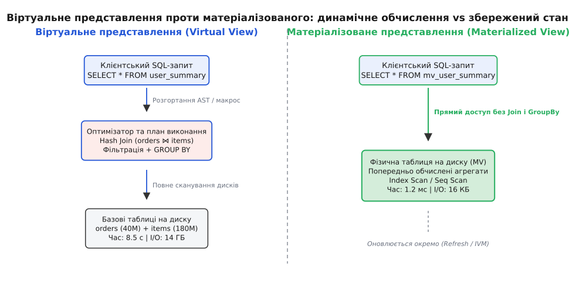
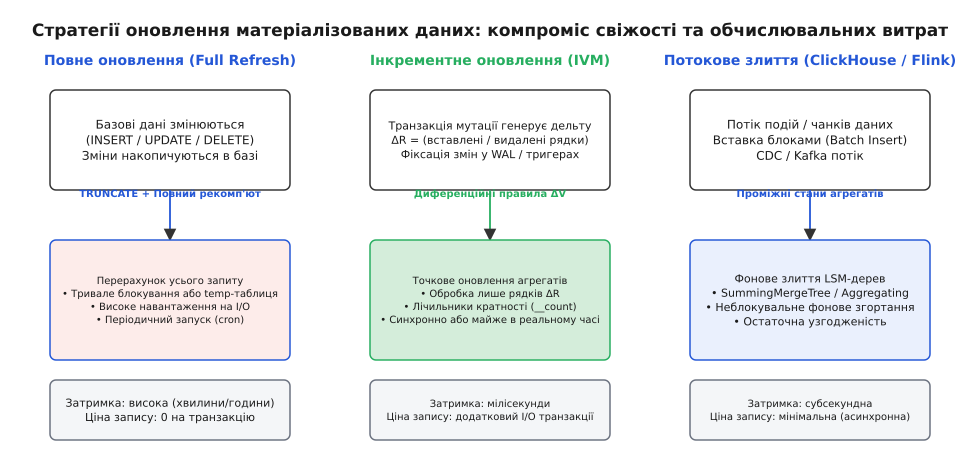
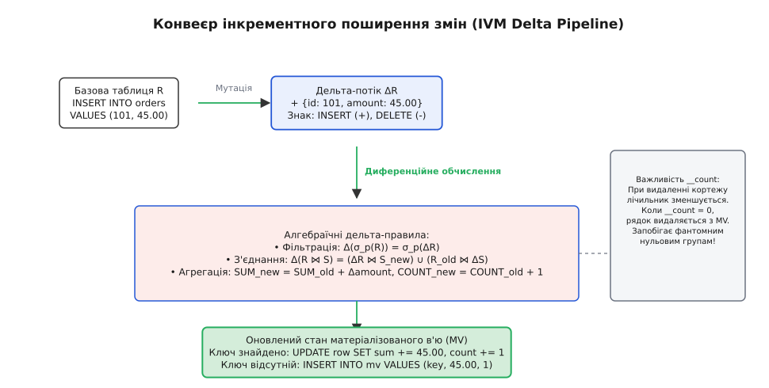
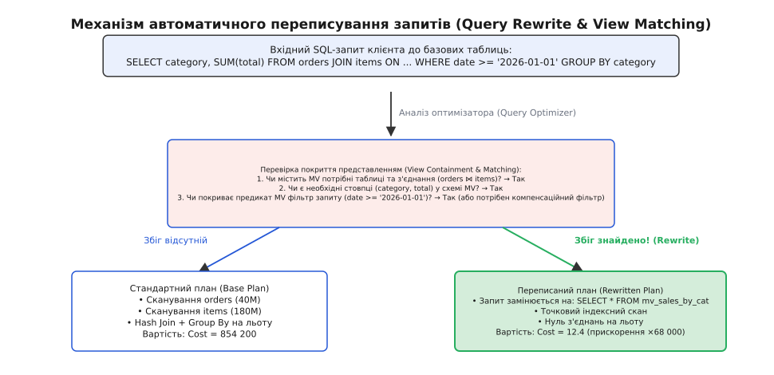

# 📊 Матеріалізовані в'ю як похідні дані (Materialized Views)

<preknowlist>
- [Реляційна модель даних](topic:sf-data/relational-model) — нормалізація, первинні та зовнішні ключі, реляційна алгебра.
- [Індекси баз даних: B-Tree та Hash](topic:sf-data/database-indexes) — структури швидкого пошуку, селективність та дисковий I/O.
- [Транзакції та властивості ACID](topic:sf-data/transactions-acid) — атомарність, рівні ізоляції та узгодженість даних.
- [Журнал попереднього запису (WAL)](topic:sf-data/write-ahead-log) — послідовне логування мутацій, LSN та реплікація стану.
</preknowlist>

У типовій інформаційній системі електронної комерції нормалізована реляційна схема розділяє операційні сутності: таблиця замовлень `orders` містить 40 мільйонів рядків, а зв'язана таблиця позицій замовлень `order_items` налічує 180 мільйонів записів. Коли аналітична панель керування або фінансовий модуль запитує щоденний підсумок виручки за категоріями товарів за останній квартал, реляційний планувальник змушений з'єднати обидві велетенські таблиці через алгоритм `Hash Join` або `Merge Join`, відфільтрувати діапазон дат і виконати сортування для групування `GROUP BY category_id`.

Навіть за наявності композитних B-Tree індексів виконання такого агрегатного запиту триває від 8 до 12 секунд. Процесорні ядра утилізуються на 100%, дискова підсистема зчитує гігабайти сторінок, а буферний пул оперативної пам'яті (Buffer Pool) вимиває гарячі кешовані сторінки операційних транзакцій. Якщо сотні менеджерів або клієнтів відкривають цю панель одночасно, база даних зазнає каскадного вичерпання пулу з'єднань і перестає обслуговувати звичайні купівельні операції.

Спроба розв'язати цю проблему через класичне реляційне представлення (Virtual View, *англ. view — вигляд, огляд*) не змінює ситуації. Віртуальне представлення є лише іменованим макросом у системному каталозі бази даних: щоразу під час виконання запиту клієнта оптимізатор просто розгортає тіло представлення в синтаксичне дерево (AST) і виконує весь важкий цикл сканування, з'єднання та групування заново.

Єдиний спосіб скоротити час відповіді з секунд до десятих часток мілісекунди полягає в перетворенні обчислення на збережений стан: фізично записати результат виконання важкого реляційного виразу на диск у вигляді окремого реляційного відношення. Такий об'єкт називається **матеріалізованим представленням** (Materialized View, від *лат. materia — речовина, фізична основа*).


*Принципова різниця між віртуальним представленням (динамічне обчислення під час кожного запиту) та матеріалізованим представленням (пряме читання попередньо обчисленого стану)*

---

### Архітектурна сутність: Похідні дані (Derived Data)

Матеріалізоване представлення є фундаментальним прикладом **похідних даних (Derived Data)**. У комп'ютерній архітектурі та теорії баз даних дані поділяються на дві категорії:
1. **Первинні дані (Primary / Source of Truth)**: записи, що надходять безпосередньо від користувачів або зовнішніх систем (рядки в таблицях `orders`, `users`, `payments`). Вони фіксують реальні події предметної області та нормалізуються для запобігання аномаліям модифікації.
2. **Похідні дані (Derived Data)**: структури, чий стан є чистою детермінованою функцією від первинних даних:

```
V = f(R₁, R₂, …, Rₖ)
```

де `Rᵢ` — базові реляційні таблиці, а `f` — реляційний вираз (композиція операторів селекції `σ`, проєкції `π`, з'єднання `⋈` та агрегації `γ`).

Матеріалізоване представлення не містить власної незалежної інформації. Воно існує виключно як попередньо обчислений кеш для оптимізації читання. Якщо первинні таблиці втрачено, матеріалізоване представлення марне; навпаки, якщо матеріалізоване представлення пошкоджено або видалено, його можна повністю відновити з первинних таблиць шляхом повторного обчислення функції `f`.

> 🔧 **Навіщо це.**
> У високонавантажених системах співвідношення операцій читання до запису (Read/Write Ratio) для аналітичних агрегатів часто перевищує 1000:1. Обчислювати з'єднання 180 мільйонів рядків тисячу разів на хвилину заради отримання 50 підсумкових чисел — неприпустиме марнотратство ресурсів. Матеріалізація зміщує обчислювальні витрати: ми виконуємо роботу один раз під час збереження стану, щоб тисячі читачів отримували готові дані за `O(1)` або `O(log K)` дискових звернень.

---

### Фізична організація, сторінкова структура та індексація

На фізичному рівні більшість реляційних рушіїв (зокрема PostgreSQL, Oracle, IBM DB2) виділяють під матеріалізоване представлення повноцінний файл даних (`relfilenode`), розбитий на стандартні сторінки фіксованого розміру (зазвичай 8 КБ).

Матеріалізоване представлення володіє всіма атрибутами звичайної реляційної таблиці:
* **Власні B-Tree, Hash, GiST або BRIN індекси**: над попередньо агрегованими стовпцями матеріалізованого представлення можна створювати унікальні та вторинні індекси, що робить точковий пошук за підсумковими категоріями миттєвим.
* **Статистика планувальника**: фоновий аналізатор (`ANALYZE`) збирає гістограми розподілу значень, кількість унікальних ключів та оцінку селективності безпосередньо за фізичними сторінками представлення.
* **Сторінковий буферний кеш**: гарячі блоки матеріалізованого відношення кешуються в оперативній пам'яті СУБД поруч зі звичайними таблицями, займаючи в тисячі разів менше місця, ніж вихідні неагреговані дані.
* **Заголовки кортежів та версійність MVCC**: кожен рядок матеріалізованого представлення містить стандартний системний заголовок транзакційного стану (поля `xmin`, `xmax`, `t_ctid` у PostgreSQL). Це означає, що операції оновлення рядків матеріалізованого представлення підпорядковуються загальним правилам багатоверсійного керування конкурентним доступом і вимагають періодичного очищення від застарілих кортежів фоновим процесом `autovacuum`.

---

### Проблема підтримки актуальності представлень (View Maintenance Problem)

Головна інженерна ціна матеріалізації — втрата автоматичної синхронності. У момент фіксації транзакції `INSERT` у базовій таблиці `orders` фізичний стан матеріалізованого представлення `V` миттєво стає застарілим (stale).

Вибір стратегії оновлення (View Refresh Strategy) є класичним архітектурним компромісом між:
1. **Свіжістю даних (Data Freshness)**: затримка між появою запису в базовій таблиці та його відображенням у матеріалізованому звіті.
2. **Накладними витратами на запис (Write Overhead)**: додатковий процесорний час, дисковий I/O та блокування, які транзакція модифікації первинних даних змушена витрачати на оновлення похідного стану.


*Три фундаментальні моделі оновлення: періодичний повний перерахунок, транзакційне інкрементне оновлення та неперервне потокове злиття*

Розглянемо детальні механізми кожного підходу.

---

### Стратегія 1: Повне оновлення (Full Refresh)

Повне оновлення є найпростішою моделлю: СУБД повністю очищає фізичне сховище представлення та виконує вихідний SQL-запит від початку до кінця над актуальним станом базових таблиць.

У PostgreSQL це виконується командою:

```sql
REFRESH MATERIALIZED VIEW mv_category_revenue;
```

#### Механізм блокувань та конкурентне оновлення

Під час виконання стандартного `REFRESH` рушій накладає на матеріалізоване представлення ексклюзивне блокування `AccessExclusiveLock`. Це блокування забороняє будь-які паралельні операції читання `SELECT`. Якщо повний перерахунок триває 3 хвилини, усі клієнтські запити до панелі керування стають у чергу очікування замка (Lock Wait Queue), що призводить до простою інтерфейсу.

Щоб уникнути блокування читачів, сучасні СУБД реалізують конкурентне оновлення:

```sql
REFRESH MATERIALIZED VIEW CONCURRENTLY mv_category_revenue;
```

Алгоритм конкурентного оновлення працює у чотири кроки:
1. Рушій створює тимчасову фізичну таблицю (Temp Table) і повністю виконує в ній вихідний запит. На представлення накладається лише легкий замок `ExclusiveLock`, який дозволяє паралельним процесам продовжувати читати старий стан.
2. Рушій вимагає наявності на матеріалізованому представленні хоча б одного **унікального індексу** (`UNIQUE INDEX`), що однозначно ідентифікує кожен рядок (наприклад, за `category_id`).
3. Виконується диференційне порівняння (Diff) рядків тимчасової таблиці з рядками поточного матеріалізованого представлення за унікальним індексом.
4. Знайдені різниці транслюються в точкові оператори `INSERT`, `UPDATE` та `DELETE`, які застосовуються до основного матеріалізованого відношення в межах поточної транзакції.

Ціна конкурентності полягає в подвоєнні дискового навантаження: СУБД змушена повністю записати на диск новий стан у тимчасовий файл, згенерувати гігабайти журналів WAL під час застосування диференційних оновлень і виконати сортування за унікальним індексом. Детальний синтаксичний контракт, налаштування та блокування описано в [довіднику інтерфейсів матеріалізованих представлень](topic:sf-data/materialized-views/api-postgresql-clickhouse-views.md).

#### Оптимізація пам'яті та паралелізм оновлення

Швидкість повного перерахунку матеріалізованого представлення безпосередньо залежить від виділених системних ресурсів СУБД. У PostgreSQL критичну роль відіграють параметри:
* `maintenance_work_mem`: обсяг пам'яті для побудови індексів та сортування кортежів. Якщо розмір вибірки перевищує `maintenance_work_mem`, сортування злиттям скидається на повільний диск (External Merge Sort).
* `max_parallel_maintenance_workers`: дозволяє планувальнику розпаралелювати сканування базових таблиць та побудову індексів між декількома процесорними ядрами, скорочуючи час виконання `REFRESH` у 3–6 разів.

---

### Стратегія 2: Інкрементне оновлення представлень (Incremental View Maintenance, IVM)

Замість повного сканування сотень мільйонів рядків ідеальний рушій обробляє лише невелику порцію змін — **дельту (Delta, Δ)**, породжену поточною транзакцією.

Якщо в таблицю `orders` додано 50 нових замовлень (`ΔR`), немає жодної потреби перечитувати решту 40 мільйонів рядків. Достатньо обчислити зміну результуючого агрегату `ΔV` і додати її до поточного збереженого стану:

```
V_new = V_old + ΔV
```


*Потік обробки дельт: мутація первинної таблиці перетворюється на диференційний потік, проходить крізь реляційні оператори та точково змінює стан матеріалізованого представлення*

#### Диференційне реляційне числення

Математичний апарат IVM спирається на дистрибутивність реляційних операторів над мультимножинами (кортежами з урахуванням кратності). Розглянемо поведінку базових операторів:

1. **Селекція (`σ_p`)**: оскільки предикат фільтрації застосовується до кожного кортежу незалежно, дельта фільтрованого представлення дорівнює фільтрації самої дельти:

```
Δ(σ_p(R)) = σ_p(ΔR)
```

2. **Проєкція (`π_A`) та семантика мультимножин**: якщо кілька різних рядків базової таблиці після відкидання непотрібних стовпців перетворюються на однаковий кортеж, матеріалізоване представлення зобов'язане зберігати службовий лічильник кратності `__count`.
   - Коли новий рядок додається: `__count` збільшується на 1.
   - Коли рядок видаляється: `__count` зменшується на 1.
   - Коли `__count` досягає 0, рядок остаточно видаляється з матеріалізованого сховища. Без лічильника кратності видалення одного замовлення видалило б усю категорію товарів, навіть якщо в ній лишаються тисячі інших замовлень.

3. **Реляційне з'єднання (`⋈`)**: зміна стану з'єднання двох таблиць `R` та `S` обчислюється за білінійним розкладом:

```
Δ(R ⋈ S) = (ΔR ⋈ S_new) ∪ (R_old ⋈ ΔS)
```

Щоб оновити матеріалізоване з'єднання при додаванні рядків у таблицю `R`, рушію достатньо виконати швидкий індексний пошук лише для доданих ключів `ΔR` у зв'язаній таблиці `S`, не чіпаючи решту даних.

4. **Агрегатні функції**:
   - **Дистрибутивні (`SUM`, `COUNT`)**: підтримуються прямим додаванням або відніманням дельти значення:
     ```
     SUM_new = SUM_old + ΔSUM
     COUNT_new = COUNT_old + ΔCOUNT
     ```
   - **Алгебраїчні (`AVG`, дисперсія `VAR`)**: середнє значення `AVG` неможливо оновити безпосередньо за новим середнім дельти. Проте воно детерміновано виражається через вектор дистрибутивних підсумків:
     ```
     AVG_new = (SUM_old + ΔSUM) / (COUNT_old + ΔCOUNT)
     ```
   - **Холістичні (`MEDIAN`, `PERCENTILE`, `MODE`)**: не мають компактного проміжного стану фіксованого розміру. Додавання або видалення одного числа може змістити медіану в будь-яку точку розподілу. Їхнє точне інкрементне оновлення вимагає збереження гістограм або повного дерева значень групи.

Повний математичний вивід усіх диференційних операторів та оцінка складності наведені в [математичному аналізі реляційного числення дельт](topic:sf-data/materialized-views/math-incremental-view-calculus.md).

#### Синхронне проти асинхронного IVM

* **Синхронне (Immediate / Eager IVM)**: диференційне оновлення виконується в межах тієї ж транзакції, що й мутація базової таблиці.
  - *Перевага*: абсолютна строга узгодженість (Serializable / Read Committed) — будь-який читач матеріалізованого в'ю негайно бачить зафіксовані зміни.
  - *Недолік*: суттєве уповільнення транзакцій запису (Write Amplification). Оновлення таблиці `orders` змушене накладати замки на рядки матеріалізованого представлення, що спричиняє конкуренцію та ризик дедлоків.
* **Асинхронне (Deferred / Lazy IVM)**: дельти складаються в транзакційний журнал (Change Log / CDC), а матеріалізоване представлення оновлюється фоновим демоном або в момент звернення читача.
  - *Перевага*: нульові накладні витрати на критичному шляху запису OLTP.
  - *Недолік*: читач отримує стан з певною затримкою реплікації (Eventual Consistency).

Робочу реалізацію синхронного рушія обробки дельт на C та C++ розібрано в [інженерному проєкті інкрементного рушія](topic:sf-data/materialized-views/proj-incremental-view-engine.md).

---

### Автоматичне переписування запитів (Query Rewrite / View Matching)

Найвищим рівнем інтеграції матеріалізованих представлень у реляційну СУБД є здатність оптимізатора автоматично перенаправляти клієнтські запити на матеріалізоване представлення, навіть якщо у вихідному SQL-запиті клієнт звернувся до базових таблиць.

Цей механізм називається **автоматичним переписуванням запитів (Query Rewrite)** або зіставленням представлень (View Matching).


*Логіка роботи оптимізатора: аналіз покриття запиту схемою матеріалізованого представлення та заміна важкого плану сканування на точкове читання*

#### Теорема еквівалентності та перевірка покриття (Subsumption Test)

Оптимізатор виконує синтаксичний та алгебраїчний аналіз вхідного AST-дерева запиту `Q` та виразу матеріалізованого представлення `V`:
1. **Покриття джерел (Table Coverage)**: чи містить представлення `V` усі базові таблиці та з'єднання, необхідні для запиту `Q`?
2. **Покриття атрибутів (Column Containment)**: чи присутні в схемі `V` усі стовпці, що входять до секцій `SELECT`, `WHERE`, `GROUP BY` та `HAVING` запиту `Q`?
3. **Еквівалентність предикатів (Predicate Subsumption)**: чи є фільтр запиту `p_Q` вужчим або еквівалентним до фільтра представлення `p_V`? Якщо предикат представлення ширший, оптимізатор може застосувати додатковий **компенсаційний фільтр (Compensation Predicate)**:
   ```
   p_comp = p_Q AND NOT p_V
   ```
4. **Сумісність групування (Group-by Rollup)**: якщо запит групує дані за `(category_id, date)`, а представлення заздалегідь агреговане за `(category_id, date, hour)`, оптимізатор може переписати запит як вторинне згортання над матеріалізованим представленням:
   ```sql
   -- Замість важкого сканування orders:
   SELECT category_id, date, SUM(hourly_revenue)
   FROM mv_hourly_category_revenue
   GROUP BY category_id, date;
   ```

Завдяки автоматичному переписуванню інженери можуть оптимізувати продуктивність бази даних шляхом додавання матеріалізованих представлень без зміни жодного рядка коду прикладного застосунку.

---

### Потокові матеріалізовані представлення та LSM-дерева

У сучасних аналітичних СУБД реального часу (ClickHouse, Apache Pinot, StarRocks) та розподілених потокових платформах (Materialize, Apache Flink) матеріалізоване представлення трансформувалося зі статичного знімка на **неперервний потоковий конвеєр**.

В аналітичній базі даних ClickHouse матеріалізоване представлення реалізоване як конвеєр перехоплення блоків під час вставки (`INSERT INTO raw_events`). Замість періодичного сканування дисків рушій на льоту агрегує щойно надісланий блок у пам'яті та записує результат у цільову таблицю на основі LSM-дерева (Log-Structured Merge-tree).

#### Агрегація через проміжні бінарні стани

Для обчислення складних метрик над потоками (наприклад, оцінка кількості унікальних користувачів за день або обчислення 95-го перцентиля затримки) рушії використовують спеціальні функції збереження стану (`AggregateFunction`):
* `HyperLogLogState`: зберігає бінарний бітовий масив алгоритму HyperLogLog замість мільйонів сирих ідентифікаторів користувачів.
* `TDigestState`: зберігає компактні кластери квантилів для обчислення перцентилів.

Під час запису нових блоків ці проміжні стани просто дописуються у нові LSM-чанки. У фоновому процесі злиття (Merge) рушій `AggregatingMergeTree` викликає оператори злиття станів, гарантуючи математичну точність фінального агрегату без повторного звернення до сирих подій.

Історію розвитку матеріалізованих представлень від ранніх реляційних систем 1980-х років до потокових рушіїв сьогодення викладено в [історичному екскурсі розвитку реляційних представлень](topic:sf-data/materialized-views/hist-view-materialization-origins.md).

---

### Похідні дані за межами СУБД: Архітектура на основі CDC

Концепція матеріалізованих представлень давно вийшла за межі монолітних реляційних баз даних і стала базовим патерном розподілених мікросервісних архітектур. У великих системах первинні транзакційні дані зберігаються в OLTP СУБД (PostgreSQL, MySQL), а похідні матеріалізовані представлення формуються в спеціалізованих сховищах:
1. **Повнотекстовий пошуковий індекс (Elasticsearch / OpenSearch)**: виступає матеріалізованим представленням товарного каталогу з морфологічним пошуком.
2. **Кеш швидкого доступу (Redis / KeyDB)**: матеріалізує знімки профілів користувачів та лічильники сесій у пам'яті.
3. **Аналітичне сховище (ClickHouse / Snowflake)**: підтримує денормалізовані широкі вітрини фактів (Wide Flat Tables).

#### Захоплення змін через CDC (Change Data Capture)

Для підтримки синхронності зовнішніх матеріалізованих сховищ без використання ненадійного подвійного запису в прикладному коді застосовується патерн **Change Data Capture (CDC)** на базі вичитування журналу WAL:
* Агент CDC (наприклад, Debezium) підключається до слота логічної реплікації PostgreSQL і неперервно читає потік зафіксованих змін.
* Кожна операція перетворюється на структуроване повідомлення в брокері (Apache Kafka):
  ```json
  {
    "op": "u",
    "before": {"id": 42, "status": "PENDING", "amount": 150.00},
    "after":  {"id": 42, "status": "PAID",    "amount": 150.00},
    "source": {"lsn": 104857600, "ts_ms": 1771400000000}
  }
  ```
* Споживачі потоку (потокові мікросервіси або рушії на зразок Apache Flink) застосовують правила диференційного обчислення дельт і атомарно оновлюють стан цільових матеріалізованих сховищ.

---

### Розподілені матеріалізовані представлення та запобігання причинним аномаліям

У розподілених базах даних (CockroachDB, Google Spanner, Citus), де базові таблиці шардовані по десятках серверів, підтримка матеріалізованого представлення стикається з проблемою асинхронного транспортування повідомлень.

Якщо транзакція змінює дані на шарді `A` та шарді `B`, дельти можуть прибути до вузла, що обслуговує матеріалізоване представлення, з різною затримкою (Network Jitter). Це створює загрозу **причинної інверсії (Causal Inversion)**: користувач бачить стан, у якому наслідок події вже відобразився в матеріалізованому звіті, а її першопричина ще не врахована.

Для усунення причинних аномалій розподілені рушії застосовують:
1. **Узгодження за LSN (Log Sequence Number) та гібридними логічними годинниками (HLC)**: дельти від різних шардів буферизуються і застосовуються до матеріалізованого стану строго пачками, впорядкованими за глобальним логічним часом фіксації транзакцій.
2. **Моніторинг затримки реплікації (Replication Lag)**: клієнтські запити, які вимагають строгої узгодженості читання (`read-your-own-writes`), супроводжуються маркером LSN останньої транзакції користувача. Якщо поточний LSN матеріалізованого представлення менший за маркер запиту, вузол або затримує відповідь до допливання дельт, або прозоро перенаправляє запит на первинні таблиці.

---

### Практичні інженерні сценарії застосування

#### Сценарій 1: Фінансові баланси в системі подвійного запису (Ledger Balances)
У банківських системах та платіжних шлюзах транзакції записуються до незмінної таблиці бухгалтерських проводок `ledger_entries (entry_id, account_id, amount, currency, created_at)`.
* *Проблема*: для перевірки платоспроможності клієнта перед списанням коштів потрібно обчислити баланс рахунку `SUM(amount)`. Якщо в клієнта 50 000 транзакцій, виконання суми під час кожної покупки блокує касу.
* *Рішення*: матеріалізована таблиця `account_balances (account_id, current_balance, last_entry_id)`. Під час фіксації нової проводки синхронний тригер IVM атомарно додає суму до балансу `current_balance += amount` під песимістичним блокуванням рядка рахунку (`SELECT FOR UPDATE`), гарантуючи неможливість подвійного списання та нульову затримку читання балансу.

#### Сценарій 2: Віконні агрегації телеметрії IoT (Time-Series Rollups)
Мережа промислових датчиків генерує 150 000 вимірювань температури та тиску на секунду в таблицю `sensor_readings`.
* *Проблема*: графіки в інтерфейсі моніторингу за місяць вимагають агрегації 400 мільярдів точок.
* *Рішення*: каскад матеріалізованих представлень у ClickHouse або TimescaleDB:
  - 1-хвилинні бакети: `mv_sensor_1m` (згортає сирі точки у `min, max, avg, count`);
  - 1-годинні бакети: `mv_sensor_1h` (згортає хвилинні бакети);
  - 1-добові бакети: `mv_sensor_1d`.
  Сирі дані видаляються за політикою TTL через 7 днів, тоді як матеріалізовані добові звіти зберігаються роками, займаючи мінімум дискового простору.

#### Сценарій 3: Лічильники активності у соціальних мережах (Social Reaction Counters)
Публікації популярних авторів отримують мільйони вподобань та коментарів у таблицю `post_reactions (post_id, user_id, reaction_type)`.
* *Проблема*: прямий `COUNT(*)` за `post_id` під час кожного завантаження стрічки призводить до вичерпання CPU.
* *Рішення*: асинхронне матеріалізоване представлення на базі Redis або денормалізованого поля `reaction_count`. Потік кліків буферизується в пам'яті (Batching) і скидається дельтами `+100` кожні 200 мілісекунд, усуваючи конкуренцію за гарячі рядки бази даних.

---

### Порівняльний аналіз архітектурних патернів оптимізації читання

Щоб обрати правильний інструмент для прискорення запитів, необхідно співвіднести матеріалізовані представлення з суміжними технологіями:

| Критерій | Віртуальне в'ю (View) | Матеріалізоване в'ю (MatView) | Зовнішній кеш (Redis / Memcached) | Денормалізована таблиця |
| :--- | :--- | :--- | :--- | :--- |
| **Фізичне зберігання** | Лише SQL-текст у каталозі | Власні дискові блоки та індекси в СУБД | Ключ-значення в оперативній пам'яті | Фізичні рядки в схемі |
| **Швидкість читання** | `O(N · M)` (повторний Join) | `O(1)` або `O(log K)` (індексний скан) | `O(1)` (мережевий RAM-доступ) | `O(log N)` (індексний скан) |
| **Узгодженість** | Абсолютна (завжди свіжі дані) | Залежить від політики оновлення (Refresh / IVM) | Слабкі гарантії (ручна інвалідація TTL) | Ручна синхронізація в коді сервісу |
| **Підтримка транзакцій (ACID)** | Так | Так (у межах СУБД) | Ні (розподілена транзакційність відсутня) | Так |
| **Гнучкість фільтрації** | Повна (довільний SQL) | Висока (можна будувати індекси по MV) | Низька (лише прямий пошук за ключем) | Висока |

---

### Підводні камені та типові інженерні антипатерни

1. **Каскадне оновлення залежних представлень (View Dependencies Cascade)**: Якщо матеріалізоване представлення `V₂` побудоване над іншим матеріалізованим представленням `V₁`, стандартна команда `REFRESH MATERIALIZED VIEW V2` у PostgreSQL не оновить автоматично `V₁`. Забуте оновлення батьківського шару призводить до тихої фіксації застарілих даних у `V₂`. Для запобігання цьому розробляють DAG-конвеєри оновлень у планувальниках задач (Airflow, Dagster).
2. **Вичерпання дискового простору при конкурентному оновленні**: `REFRESH CONCURRENTLY` вимагає тимчасового подвоєння дискового простору для таблиці та індексів, а також створює великий обсяг записів у журналі WAL. Якщо диск заповнений на 70%, операція конкурентного оновлення призведе до аварійної зупинки всієї СУБД через помилку `No space left on device`.
3. **Недетерміновані вирази у визначенні представлення**: Використання функцій на кшталт `NOW()`, `CURRENT_TIMESTAMP` або `RANDOM()` у виразі матеріалізованого представлення фіксує значення на момент запуску `REFRESH`. Конструкція `WHERE created_at >= NOW() - INTERVAL '7 days'` матеріалізує інтервал, прив'язаний до дати оновлення, і через 8 днів представлення повертатиме порожній результат, доки його не перезапустять примусово.
4. **Роздування таблиць через MVCC (Table Bloat)**: Часте виконання `REFRESH CONCURRENTLY` (наприклад, кожні 30 секунд) генерує колосальну кількість мертвих кортежів у пам'яті PostgreSQL. Без агресивного налаштування фонового очищувача `autovacuum` фізичний розмір представлення на диску може роздутися в десятки разів, сповільнюючи індексне сканування.

---

### Підсумок

Матеріалізоване представлення — це інженерний міст між реляційною нормалізацією запису (OLTP) та денормалізованою швидкістю читання (OLAP). Воно дозволяє зберегти чистоту доменної моделі та цілісність зовнішніх ключів у первинних таблицях, перекладаючи важкі аналітичні трансформації, багатотабличні з'єднання та обчислення агрегатів на рівень попередньо збереженого похідного стану.
