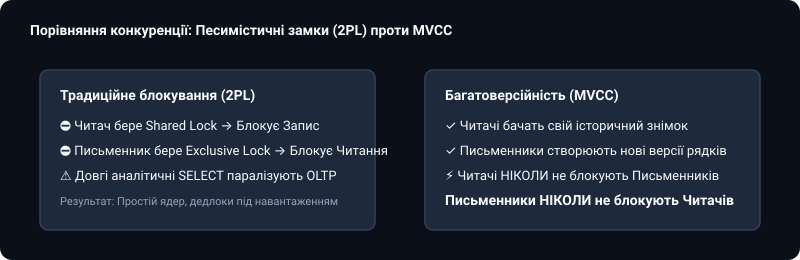
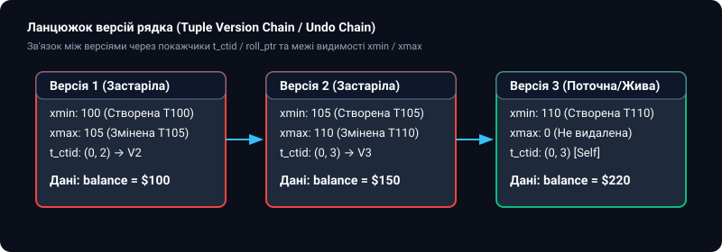
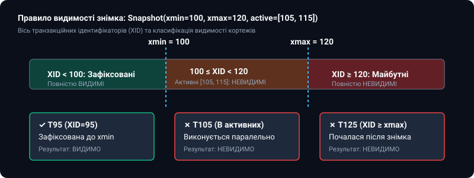
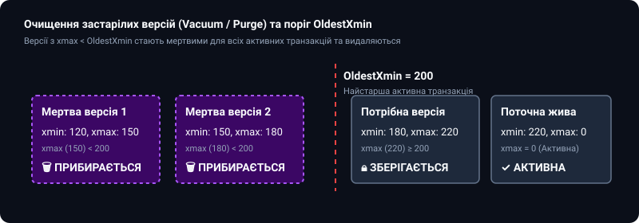

# 📦 Багатоверсійне керування конкурентним доступом (MVCC)

<preknowlist>
- [Реляційна модель даних](topic:sf-data/relational-model)
- [Індекси баз даних: B-Tree та Hash](topic:sf-data/database-indexes)
- [Транзакції та властивості ACID](topic:sf-data/transactions-acid)
- [Рівні ізоляції транзакцій](topic:sf-data/isolation-levels)
</preknowlist>

У класичній теорії реляційних систем керування базами даних забезпечення узгодженості під час одночасного доступу багатьох користувачів спиралося на песимістичне двофазне блокування (Two-Phase Locking, 2PL). Якщо одна транзакція зчитувала баланс банківського рахунку, вона захоплювала спільне блокування (Shared Lock), забороняючи будь-яким іншим процесам змінювати цей рядок. Якщо ж транзакція оновлювала статус замовлення, вона накладала ексклюзивне блокування (Exclusive Lock), через що всі інші користувачі навіть не могли прочитати поточний стан запису до моменту завершення транзакції.

На практиці такий підхід призводить до катастрофічного падіння пропускної здатності. Тривалі аналітичні звіти паралізують роботу операційних кас, а висока конкуренція за гарячі рядки перетворює сучасні багатоядерні сервери на черги очікування вивільнення замків.

Багатоверсійне керування конкурентним доступом (Multi-Version Concurrency Control, MVCC) докорінно змінює цю парадигму: **читачі ніколи не блокують письменників, а письменники ніколи не блокують читачів**. Замість блокування єдиного фізичного рядка рушій бази даних зберігає кілька історичних версій одного кортежу, надаючи кожній транзакції її власний узгоджений знімок стану даних на момент початку операції.


*Принципова різниця між песимістичним блокуванням 2PL та багатоверсійною ізоляцією знімків*

---

### Фізична анатомія кортежу даних та системні поля заголовка

Щоб забезпечити одночасне співіснування кількох версій одного логічного рядка, реляційні рушії додають до кожного фізичного кортежу на сторінці пам'яті системний заголовок із метаданими транзакційного стану.

У PostgreSQL кожен кортеж на сторінці розміром 8 КБ містить 23-байтний заголовок `HeapTupleHeader`, основними полями якого є:

1. **`t_xmin` (4 байти)**: Ідентифікатор транзакції (Transaction ID, XID), яка створила цю конкретну версію кортежу через команду `INSERT` або `UPDATE`.
2. **`t_xmax` (4 байти)**: Ідентифікатор транзакції, яка видалила цей кортеж або створила його новішу версію через команду `UPDATE`. Якщо рядок є поточною активною версією і не видалявся, поле `t_xmax` дорівнює нулю.
3. **`t_cid` (Command Identifier, 4 байти)**: Порядковий номер команди всередині однієї поточної транзакції. Дозволяє бачити зміни, зроблені попередніми операторами тієї ж транзакції.
4. **`t_ctid` (Item Pointer, 6 байтів)**: Фізична адреса кортежу у форматі `(номер_сторінки, індекс_зсуву)`. Якщо кортеж було оновлено, поле `t_ctid` старої версії вказує безпосередньо на нову версію, формуючи **ланцюжок версій кортежу (Tuple Version Chain)**.
5. **`t_infomask` (2 байти)**: Бітова маска статусів (наприклад, прапорці `HEAP_XMIN_COMMITTED`, `HEAP_XMAX_COMMITTED`, `HEAP_XMIN_FROZEN`), що дозволяють уникати постійного звернення до журналу фіксацій CLOG.


*Фізичний ланцюжок версій одного рядка: зв'язування застарілих та живих кортежів через вказівники t_ctid*

Коли рядок оновлюється кілька разів, рушій бази даних не перезаписує старі байти на диску. Він створює новий фізичний кортеж на вільній сторінці пам'яті та оновлює покажчик `t_ctid` у попередньому кортежі. Таким чином виникає однозв'язний список історичних версій.

---

### Механізм створення транзакційного знімка (Snapshot) та перевірка видимості

Коли клієнт виконує SQL-запит під рівнем ізоляції `Read Committed` або розпочинає транзакцію під рівнем `Repeatable Read`, рушій СУБД фіксує внутрішню структуру, яка називається **транзакційним знімком (Snapshot)**.

Транзакційний знімок є компактним масивом чисел:

```text
Snapshot = (xmin: 100, xmax: 120, xip_list: [105, 115])
```

Де:
* **`xmin` (100)**: Найменший ідентифікатор транзакції, яка все ще виконувалася в системі на момент фіксації знімка. Усі транзакції з ідентифікатором, меншим за 100, гарантовано зафіксовані або відкочені до створення знімка. Їхні зміни вважаються стабільним історичним минулим і є видимими.
* **`xmax` (120)**: Лічильник наступної транзакції, яка ще не була призначена на момент фіксації знімка. Усі транзакції з номером, більшим або рівним 120, належать майбутньому і є безумовно невидимими.
* **`xip_list` ([105, 115])**: Список активних транзакцій у діапазоні між `xmin` та `xmax`. Хоча транзакція 105 має номер менший за 120, вона ще не завершилася під час зняття знімка, тому її зміни мають бути приховані від читача.


*Класифікація видимості кортежів на осі XID за правилами побудови транзакційного знімка*

#### Алгоритм визначення видимості кортежу

Для кожного прочитаного кортежу рушій виконує швидку булеву перевірку:

:::tabs
@tab C
```c
#include <stdint.h>
#include <stdbool.h>

typedef uint32_t TransactionId;

typedef struct {
    TransactionId xmin;
    TransactionId xmax;
    TransactionId *xip_list;
    uint32_t xip_count;
} Snapshot;

typedef struct {
    TransactionId t_xmin;
    TransactionId t_xmax;
    uint16_t t_infomask;
} HeapTupleHeader;

bool HeapTupleSatisfiesSnapshot(HeapTupleHeader *tuple, Snapshot *snap, TransactionId current_xid) {
    // 1. Якщо кортеж створено нашою ж транзакцією — він видимий
    if (tuple->t_xmin == current_xid) {
        if (tuple->t_xmax == current_xid) return false; // Ми ж його і видалили
        return true;
    }

    // 2. Якщо транзакція-творець з майбутнього або ще активна — кортеж невидимий
    if (tuple->t_xmin >= snap->xmax) return false;
    for (uint32_t i = 0; i < snap->xip_count; ++i) {
        if (tuple->t_xmin == snap->xip_list[i]) return false;
    }

    // 3. Перевірка видалення кортежу (t_xmax)
    if (tuple->t_xmax == 0) return true; // Рядок ніхто не видаляв
    if (tuple->t_xmax == current_xid) return false; // Видалено нами
    if (tuple->t_xmax >= snap->xmax) return true; // Видалення відбулося в майбутньому

    for (uint32_t i = 0; i < snap->xip_count; ++i) {
        if (tuple->t_xmax == snap->xip_list[i]) return true; // Видалення ще не зафіксовано
    }

    // Якщо видалення зафіксовано в минулому — кортеж для нас мертвий
    return false;
}
```
@tab C++
```cpp
#include <vector>
#include <unordered_set>
#include <cstdint>

using TransactionId = uint32_t;

struct Snapshot {
    TransactionId xmin{0};
    TransactionId xmax{0};
    std::unordered_set<TransactionId> active_xids;
};

struct HeapTupleHeader {
    TransactionId t_xmin{0};
    TransactionId t_xmax{0};
    uint16_t t_infomask{0};
};

bool heap_tuple_satisfies_snapshot(const HeapTupleHeader& tuple, const Snapshot& snap, TransactionId current_xid) {
    if (tuple.t_xmin == current_xid) {
        if (tuple.t_xmax == current_xid) return false;
        return true;
    }

    if (tuple.t_xmin >= snap.xmax) return false;
    if (snap.active_xids.count(tuple.t_xmin)) return false;

    if (tuple.t_xmax == 0) return true;
    if (tuple.t_xmax == current_xid) return false;
    if (tuple.t_xmax >= snap.xmax) return true;
    if (snap.active_xids.count(tuple.t_xmax)) return true;

    return false;
}
```
:::

Детальний математичний апарат предикатної логіки видимості та алгебраїчний доказ неможливості фантомних читань розібрано в окремому додатку [Математична формалізація правил видимості кортежів у MVCC](topic:sf-data/mvcc/math-visibility-rules.md).

---

### Журнал фіксацій (Commit Log / CLOG) та бітові прапорці підказки

Оскільки перевірка статусу кожної окремої транзакції через системний каталог була б надто повільною, PostgreSQL зберігає статуси всіх транзакцій у спеціальному компактному масиві — **Commit Log (CLOG, або `pg_xact`)**.

У журналі CLOG кожна транзакція кодується рівно двома бітами:
* `00` — `IN_PROGRESS` (транзакція виконується або зазнала аварійного збою до запису фіксації);
* `01` — `COMMITTED` (успішно зафіксована);
* `10` — `ABORTED` (відкочена клієнтом або перервана через помилку);
* `11` — `SUB_COMMITTED` (вкладена транзакція/точка збереження підтверджена).

На одній сторінці CLOG розміром 8 КБ зберігається інформація про 32 768 транзакцій. Щоб навіть не звертатися до буферів CLOG під час кожного читання кортежу, перший читач, який перевірив статус транзакції, модифікує бітову маску `t_infomask` безпосередньо в заголовку кортежу, виставляючи прапорець `HEAP_XMIN_COMMITTED` (так званий Hint Bit). Наступні операції читання цього кортежу перевіряють лише біт у заголовку, досягаючи максимальної швидкості вибірки.

---

### Порівняння архітектур збереження: Append-Only проти Undo Log

Існує дві принципово різні інженерні філософії фізичної організації багатоверсійності в сучасних реляційних базах даних:

#### 1. Додавання версій у купу таблиці (In-Place Append / PostgreSQL)
У цій моделі кожна нова версія рядка записується як повноцінний новий запис безпосередньо у файл таблиці (Heap File).
* **Переваги**: Надзвичайно швидкий відкат транзакцій (`ROLLBACK` виконується миттєво, оскільки достатньо змінити статус транзакції в CLOG без переписування сторінок даних).
* **Недоліки**: Кожне оновлення рядка вимагає модифікації всіх вторинних індексів таблиці (якщо не спрацювала оптимізація HOT — Heap-Only Tuples), а старі версії роздувають розмір файлів на диску, вимагаючи періодичної роботи фонового процесу `VACUUM`.

#### 2. Збереження дельт у журналі відкату (Undo Log / MySQL InnoDB, Oracle)
У цій моделі файл таблиці завжди містить лише одну найновішу версію рядка. Старі версії зберігаються у вигляді різницевих записів (дельт) у виділеному журналі відкату (Undo Tablespace).
* **Переваги**: Відсутність розростання основних таблиць при масивних оновленнях. Вторинні індекси завжди вказують на єдиний первинний ключ без оновлення при зміні неіндексованих колонок.
* **Недоліки**: Читання старих історичних знімків вимагає обчислювальної реконструкції рядка шляхом послідовного застосування Undo-записів. Довгі транзакції ризикують отримати помилку переповнення Undo (`Snapshot too old`).

Історія створення обох архітектур від докторської праці в MIT до перших промислових релізів детально описана у розділі [Еволюція багатоверсійності: від дисертації Девіда Ріда до сучасних СУБД](topic:sf-data/mvcc/hist-reed-mvcc.md).

---

### Збирання сміття (Vacuum / Purge) та ліквідація розростання таблиць

Оскільки старі версії кортежів стають непотрібними після завершення транзакцій, що могли їх бачити, рушій бази даних зобов'язаний своєчасно звільняти пам'ять.

У PostgreSQL цим займається фоновий процес `VACUUM`:
1. Процес обчислює глобальний поріг `OldestXmin` — найменший ідентифікатор серед усіх активних транзакцій усього кластера бази даних.
2. Кортежі, у яких `t_xmax < OldestXmin` і статус транзакції `t_xmax` є `COMMITTED`, вважаються **мертвими (Dead Tuples)**.
3. Вакуум вилучає покажчики на ці кортежі з індексів B-Tree та позначає простір усередині сторінки як вільний для повторного використання новими командами `INSERT`.


*Фільтрація та очищення мертвих кортежів за порогом найстарішої активної транзакції OldestXmin*

Якщо в системі зависає довга аналітична транзакція або забуте відкрите з'єднання (`idle in transaction`), поріг `OldestXmin` перестає рухатися вперед. У результаті `VACUUM` втрачає здатність видаляти мертві кортежі, що призводить до лавиноподібного розростання таблиць (Table Bloat) та деградації продуктивності дискової підсистеми.

Повний довідник параметрів конфігурації `autovacuum`, налаштування паралельних воркерів та діагностичні запити представлено у вставці [Довідник конфігурації та налаштування VACUUM і Purge](topic:sf-data/mvcc/api-vacuum-tuning.md).

---

### Вторинні індекси та оптимізація HOT (Heap-Only Tuples)

У традиційній архітектурі Append-Only кожен вторинний індекс (наприклад, за адресою електронної пошти або датою створення) містить фізичні вказівники на адреси кортежів `t_ctid`. Якщо рядок оновлюється, його нова версія отримує нову фізичну адресу на іншій сторінці. Це вимагає вставки нових записів в усі наявні вторинні індекси, навіть якщо індексовані стовпчики взагалі не змінювалися під час операції `UPDATE`.

Таке явище називається розростанням індексів (Index Bloat) та створює значний накладний шум дискового введення-виведення. Для подолання цієї проблеми у PostgreSQL 8.3 було реалізовано механізм **Heap-Only Tuples (HOT)**.

Механізм HOT працює за таких умов:
1. Нова версія рядка поміщається на тій самій фізичній сторінці розміром 8 КБ, що й попередня версія (для цього на сторінці має залишатися вільний резерв пам'яті, що регулюється параметром `fillfactor`).
2. Жоден зі стовпчиків, що входять до складу вторинних індексів таблиці, не був змінений під час оновлення.

Якщо обидві умови виконуються, рушій не створює нових записів у деревах індексів B-Tree. Замість цього кореневий покажчик індексу продовжує вказувати на стару версію рядка, а при читанні процесор переходить за внутрішнім вказівником `t_ctid` безпосередньо всередині сторінки пам'яті до актуальної версії. Під час чергового звернення до сторінки внутрішній процес дефрагментації (Pruning) може безпечно вилучити проміжні мертві кортежі без звернення до дерев індексів.

---

### Проблема переповнення 32-бітного лічильника XID (Transaction ID Wraparound)

У більшості класичних СУБД ідентифікатор транзакції є 32-бітним беззнаковим цілим числом, що забезпечує близько 4.29 мільярда унікальних номерів. При інтенсивному навантаженні у 2000 транзакцій на секунду цей лічильник вичерпується за кілька місяців роботи.

Для розв'язання цієї проблеми вводиться **модульна арифметика транзакцій**:
* Простір чисел 2 у степені 32 розглядається як замкнене коло.
* Будь-який поточний номер транзакції ділить коло на дві рівні половини по 2 мільярди: числа, що передують йому за годинниковою стрілкою, вважаються минулим, а наступні — майбутнім.
* Щоб старі зафіксовані рядки не перетворилися раптово на «майбутні» після переходу лічильника через нуль, процес `VACUUM FREEZE` примусово замінює `t_xmin` старих кортежів на спеціальний системний псевдоідентифікатор `FrozenTransactionId` (значення 2), що позначає рядок як такий, що створений у нескінченному минулому.

---

### Практична реалізація та підсумки

Для закріплення розуміння внутрішніх механізмів MVCC перегляньте повноцінну реалізацію власного міні-рушія з версіонуванням, знімками та вакуумом у практичному проєкті [Розробка міні-рушія MVCC з версіонуванням та вакуумом](topic:sf-data/mvcc/proj-mini-mvcc-engine.md).

#### Підсумкові інженерні правила експлуатації MVCC

1. **Контроль тривалості транзакцій**: Забороняйте утримання довгих відкритих транзакцій у виробничих OLTP-середовищах. Встановлюйте параметри `idle_in_transaction_session_timeout` та `statement_timeout`.
2. **Агресивне налаштування Autovacuum**: Зменшуйте `autovacuum_vacuum_scale_factor` для великих таблиць з 20% до 2-5%, щоб запобігти накопиченню мільйонів мертвих кортежів.
3. **Використання HOT (Heap-Only Tuples)**: Проєктуйте таблиці із залишенням вільного місця на сторінці (`fillfactor = 85-90%`) для тих сутностей, де часто оновлюються неіндексовані стовпчики.
4. **Моніторинг затримки Undo в MySQL**: Відстежуйте метрику `History list length` в InnoDB, щоб уникати сповільнення операцій запису через перевантаження підсистеми Purge.
