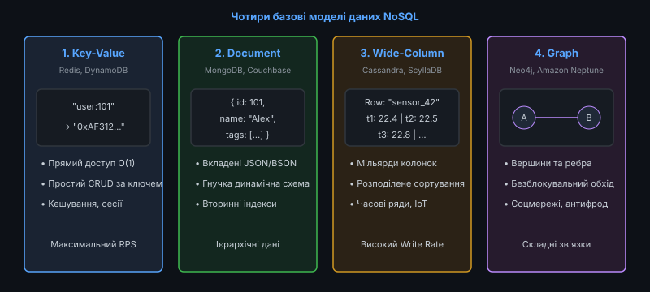
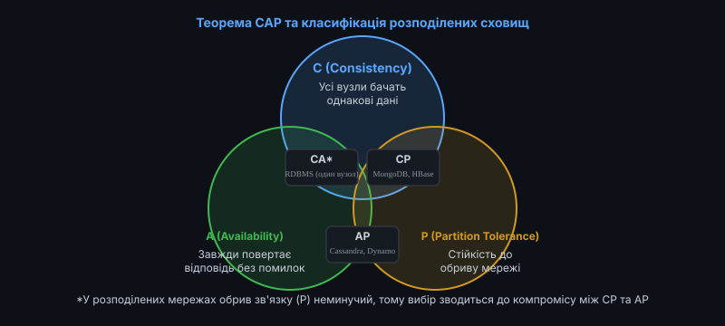
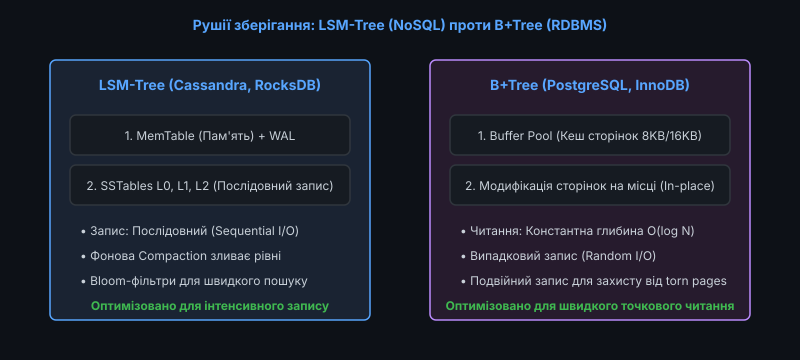

# 📜 Ландшафт NoSQL: Key-Value, Document, Column-Family та Graph

<preknowlist>
- [Реляційна модель даних](topic:sf-data/relational-model)
- [Індекси баз даних: B-Tree та Hash](topic:sf-data/database-indexes)
- [Планувальник та оптимізатор запитів](topic:sf-data/query-planner)
- [Транзакції та властивості ACID](topic:sf-data/transactions-acid)
- [Рівні ізоляції транзакцій](topic:sf-data/isolation-levels)
</preknowlist>

Протягом майже чотирьох десятиліть реляційні системи керування базами даних (RDBMS) були абсолютним і безальтернативним стандартом збереження інформації в корпоративному програмному забезпеченні. Проте вибухове зростання веб-сервісів початку 2000-х років, поява соціальних мереж та технологій Інтернету речей (IoT) виявили фундаментальні обмеження класичної реляційної моделі: жорсткість фіксованої схеми, високу вартість транзакційного блокування та неможливість ефективного горизонтального масштабування.

Відповіддю індустрії на ці виклики став рух **NoSQL («Not Only SQL»)** — парадигма використання нереляційних розподілених сховищ даних, оптимізованих під конкретні моделі доступу, надвисоку швидкість запису та відмовостійкість.


*Концептуальні сімейства NoSQL: від простого O(1) доступу за ключем до складного обходу топології графів*

---

### Чому реляційні бази зіткнулися з кризою масштабування

Класичні RDBMS (PostgreSQL, Oracle, MySQL) проєктувалися в епоху, коли обчислювальні ресурси коштували надзвичайно дорого, а єдиним способом масштабування було вертикальне нарощування потужностей сервера (Scale-Up): встановлення більшої кількості процесорів, гігабайтів оперативної пам'яті та дискових масивів.

Головні архітектурні бар'єри реляційної моделі при переході до розподілених кластерів:

#### 1. Вартість реляційних операцій JOIN у мережі
У межах одного сервера операція `JOIN` виконується швидко за рахунок прямого доступу до сторінок у пам'яті через B-Tree індекси. Якщо ж таблиці розбиті на шарди між сотнями серверів (Horizontal Sharding), виконання `JOIN` вимагає пересилання гігабайтів даних між вузлами через мережеві комутатори (Data Shuffling), що спричиняє колосальні затримки та блокує мережевий стек.

#### 2. Проблема розподілених транзакцій та протоколу 2PC
Гарантія повної ізольованості та атомарності (ACID) на багатьох серверах вимагає використання протоколу двофазної фіксації (Two-Phase Commit, 2PC). Якщо хоча б один вузол у кластері тимчасово недоступний або має високу затримку, вся транзакція блокується, утримуючи блокування рядків у базі даних і призводячи до простою всієї системи.

#### 3. Негнучкість фіксованої схеми (Schema-on-Write)
У реляційній базі кожен рядок повинен суворо відповідати заздалегідь визначеній схемі таблиці. Додавання нових колонок (`ALTER TABLE`) на таблицях із мільярдами записів у старих СУБД вимагало повного ексклюзивного блокування таблиці на години або дні.

Історію того, як інтернет-гіганти Google та Amazon подолали ці бар'єри, описано у вставці [Еволюція руху NoSQL: від Google Bigtable до NewSQL](topic:sf-data/nosql-landscape/hist-nosql-movement.md).

---

### Теорема CAP та модель узгодженості BASE

На відміну від реляційного стандарту ACID, розподілені NoSQL бази даних функціонують у парадигмі **теореми CAP** та моделі **BASE**.


*Класифікація розподілених сховищ: фундаментальний компроміс між строгістю CP та безперервною доступністю AP*

#### Теорема CAP (Брюер / Гілберт і Лінч)
Теорема стверджує, що в будь-якій асинхронній розподіленій системі неможливо одночасно гарантувати всі три властивості:
* **Consistency (C, Лінеаризовність)**: Усі клієнти завжди бачать один і той самий найсвіжіший стан даних, незалежно від того, до якого вузла вони звертаються.
* **Availability (A, Доступність)**: Кожен працездатний вузол завжди повертає коректну відповідь на будь-який запит без помилок і таймаутів.
* **Partition Tolerance (P, Стійкість до розділення мережі)**: Система продовжує функціонувати навіть у разі втрати зв'язку між частинами кластера.

Оскільки у фізичних комп'ютерних мережах обриви зв'язку та затримки пакетів є неминучими (наявність властивості P є обов'язковою), архітектор змушений обирати між двома режимами:
1. **CP-системи (MongoDB, HBase, CockroachDB)**: У разі розділення мережі вузли блокують операції запису або читання, якщо вони не можуть гарантувати актуальність даних, жертвуючи доступністю заради узгодженості.
2. **AP-системи (Apache Cassandra, Amazon DynamoDB, CouchDB)**: Усі вузли продовжують приймати записи та повертати відповіді, навіть якщо вони ізольовані, жертвуючи строгою миттєвою синхронізацією.

Математичне доведення теореми CAP та її сучасне розширення PACELC наведено у вставці [Математична формалізація теорем CAP та PACELC](topic:sf-data/nosql-landscape/math-cap-pacelc.md).

#### Модель узгодженості BASE:
* **Basically Available (Базова доступність)**: Система гарантує доступність даних, погоджуючись на можливу тимчасову деградацію швидкості або неповноту відповіді.
* **Soft State (М'який стан)**: Стан системи може змінюватися з часом навіть за відсутності нових запитів через фонові процеси синхронізації.
* **Eventual Consistency (Кінцева узгодженість)**: За відсутності нових змін усі репліки кластера з часом гарантовано зійдуться до однакового узгодженого стану.

---

### Чотири фундаментальні сімейства NoSQL систем

Усі нереляційні бази даних поділяються на чотири головні архітектурні категорії залежно від базової моделі даних:

#### 1. Key-Value сховища (Сховища «Ключ — Значення»)
Найпростіша та найшвидша модель даних. База даних розглядає значення як непрозорий масив байтів (BLOB), доступ до якого здійснюється виключно за унікальним рядковим ключем.
* **Приклади**: Redis, Memcached, AWS DynamoDB, Bitcask.
* **Переваги**: Швидкість доступу `O(1)`, простота автоматичного шардування через узгоджене хешування (Consistent Hashing), мінімальний оверхед пам'яті.
* **Сфери використання**: Кешування сесій користувачів, кошики інтернет-магазинів, лічильники переглядів, черги повідомлень.

#### 2. Document-Oriented бази даних (Документні сховища)
Зберігають дані у вигляді самоописових напівструктурованих ієрархічних документів (формати JSON, BSON, XML). Кожен документ містить унікальний ідентифікатор та довільний набір вкладених полів і масивів.
* **Приклади**: MongoDB, Couchbase, CouchDB, Amazon DocumentDB.
* **Переваги**: Відсутність жорсткої схеми (Schema-on-Read), природне відображення вкладених об'єктів мов програмування без нормалізації на окремі таблиці, наявність багатих вторинних індексів.
* **Сфери використання**: Системи керування контентом (CMS), каталоги товарів із різноманітними характеристиками, профілі користувачів, платформи електронної комерції.

#### 3. Wide-Column / Column-Family бази даних (Колонкові сімейства)
Походять від моделі Google Bigtable. Дані зберігаються у вигляді розрідженої двовимірної таблиці, де кожен рядок може містити мільйони динамічних стовпців, упорядкованих за ключем стовпця (Column Key / Clustering Key).
* **Приклади**: Apache Cassandra, ScyllaDB, Apache HBase.
* **Переваги**: Виключно висока швидкість запису, відсутність потреби у збереженні порожніх значень (NULL), лінійне горизонтальне масштабування на тисячі серверів.
* **Сфери використання**: Збір телеметрії IoT-пристроїв, обробка часових рядів (Time-Series), журналювання аудит-логів, зберігання фінансових транзакцій.

#### 4. Graph бази даних (Графові СУБД)
Модель базується на теорії графів і оперує двома основними типами сутностей: вузлами (Nodes / Vertices) та зв'язками (Edges / Relationships), кожен із яких може містити довільний набір властивостей (Properties).
* **Приклади**: Neo4j, Amazon Neptune, ArangoDB.
* **Переваги**: Обхід зв'язків довільної глибини за час `O(k)` завдяки прямим вказівникам (Index-free Adjacency) замість важких реляційних `JOIN`.
* **Сфери використання**: Соціальні мережі (друзі, підписники), системи виявлення шахрайства (Fraud Detection), рекомендаційні рушії, граматичні та семантичні мережі знань (Knowledge Graphs).

---

### Внутрішні рушії зберігання: LSM-Tree проти B+Tree

Продуктивність та поведінка NoSQL бази даних безпосередньо визначаються алгоритмічною структурою її низькорівневого рушія зберігання даних на диску (Storage Engine):


*Конфлікт архітектур зберігання: послідовний незмінний запис LSM-Tree проти точкового читання B+Tree*

#### 1. Рушії на основі B+Tree (Традиційні RDBMS та MongoDB WiredTiger)
* **Принцип роботи**: Дані розбиті на сторінки фіксованого розміру (зазвичай 4KB, 8KB або 16KB). Зміни записуються безпосередньо у відповідну дискову сторінку на місці (In-place Update).
* **Переваги**: Константна глибина дерева `O(log N)` та миттєвий пошук одного запису за кілька операцій дискового читання.
* **Недоліки**: Велика кількість операцій випадкового доступу до диска (Random I/O), фрагментація простору та необхідність подвійного запису (Doublewrite Buffer) для запобігання пошкодженню сторінок при аваріях.

#### 2. Рушії на основі LSM-Tree (Log-Structured Merge-Tree: Cassandra, RocksDB, ScyllaDB)
* **Принцип роботи**: Усі операції запису спочатку потрапляють до журналу відновлення WAL та впорядкованої структури в оперативній пам'яті (**MemTable**). Коли MemTable заповнюється, вона скидається на диск як незмінний відсортований файл (**SSTable, Sorted String Table**).
* **Фонова Compaction**: Спеціальні фонові потоки періодично зливають кілька рівнів SSTables, видаляючи застарілі та видалені записи (Tombstones).
* **Переваги**: Запис завжди виконується строго послідовно (Sequential Write) зі швидкістю фізичної шини накопичувача, що забезпечує максимальний throughput.
* **Недоліки**: Читання може вимагати перевірки кількох рівнів SSTables (для прискорення використовуються ймовірнісні **фільтри Блума**); навантаження на процесор і диск під час процедур ущільнення (Write Amplification).

---

### Реалізація базового рушія Key-Value та Append-Only Log

Для глибшого розуміння роботи низькорівневих сховищ розглянемо реалізацію базового Key-Value механізму з журналізацією на мовах C та C++:

:::tabs
@tab C
```c
#include <stdio.h>
#include <stdint.h>
#include <string.h>
#include <stdbool.h>

#define MAX_KV 64

typedef struct {
    char key[32];
    char value[64];
    bool is_active;
} kv_pair_t;

typedef struct {
    kv_pair_t data[MAX_KV];
    size_t count;
} simple_store_t;

void store_init(simple_store_t *s) {
    s->count = 0;
}

int store_put(simple_store_t *s, const char *key, const char *val) {
    for (size_t i = 0; i < s->count; ++i) {
        if (strcmp(s->data[i].key, key) == 0) {
            strncpy(s->data[i].value, val, 63);
            s->data[i].is_active = true;
            printf("[LOG] Оновлено ключ '%s' -> '%s'\n", key, val);
            return 0;
        }
    }
    if (s->count < MAX_KV) {
        strncpy(s->data[s->count].key, key, 31);
        strncpy(s->data[s->count].value, val, 63);
        s->data[s->count].is_active = true;
        s->count++;
        printf("[LOG] Записано новий ключ '%s' -> '%s'\n", key, val);
        return 0;
    }
    return -1;
}

const char* store_get(const simple_store_t *s, const char *key) {
    for (size_t i = 0; i < s->count; ++i) {
        if (s->data[i].is_active && strcmp(s->data[i].key, key) == 0) {
            return s->data[i].value;
        }
    }
    return NULL; // Ключ не знайдено
}
```
@tab C++
```cpp
#include <iostream>
#include <string>
#include <unordered_map>
#include <optional>

class SimpleKVStore {
public:
    void put(const std::string& key, const std::string& value) {
        table_[key] = value;
        std::cout << "[LOG C++] PUT ключ: " << key << " => " << value << "\n";
    }

    std::optional<std::string> get(const std::string& key) const {
        auto it = table_.find(key);
        if (it != table_.end()) {
            return it->second;
        }
        return std::nullopt;
    }

    void remove(const std::string& key) {
        table_.erase(key);
        std::cout << "[LOG C++] DELETE ключ: " << key << "\n";
    }

private:
    std::unordered_map<std::string, std::string> table_;
};
```
:::

Повну робочу реалізацію промислового Append-Only сховища з індексом у пам'яті (патерн Bitcask) наведено у практичному проєкті [Розробка міні-NoSQL сховища: Key-Value та Append-Only Log](topic:sf-data/nosql-landscape/proj-mini-kv-store.md).

---

### Порівняльний аналіз та критерії вибору СУБД

Вибір моделі даних повинен базуватися на точних технічних характеристиках завдання, а не на модних трендах:

| Критерій оцінки | RDBMS (PostgreSQL) | Key-Value (Redis) | Document (MongoDB) | Wide-Column (Cassandra) | Graph (Neo4j) |
| :--- | :--- | :--- | :--- | :--- | :--- |
| **Складність запитів** | Дуже висока (SQL, JOIN) | Низька (лише ключ) | Висока (фільтри, агрегації) | Середня (тільки Primary Key) | Складна (обхід шляхів) |
| **Транзакції** | Повний ACID (Serializable) | Атомарність однієї команди | Атомарність документа | Tunable Consistency (AP) | ACID для підграфів |
| **Масштабованість на запис**| Обмежена (Scale-Up) | Висока (In-Memory) | Середня (Auto-sharding) | Надвисока (Linear Scale-Out)| Середня |
| **Гнучкість схеми** | Жорстка (Schema-on-Write) | Відсутня (BLOB) | Гнучка (Schema-on-Read) | Напівжорстка | Гнучка |

Повний структурований алгоритм вибору СУБД для системних архітекторів наведено у вставці [Практичний довідник архітектора: Дерево рішень щодо вибору NoSQL СУБД](topic:sf-data/nosql-landscape/api-nosql-decision-tree.md).

---

### Підсумкові правила архітектурного проєктування

1. **Не відмовляйтеся від RDBMS передчасно**: Якщо обсяг даних вимірюється гігабайтами, а не терабайтами, сучасний PostgreSQL із типом `JSONB` та розширеннями закриє практично всі потреби без ускладнення розподіленим кластером.
2. **Проєктуйте Wide-Column схеми від шаблонів запитів (Access-Pattern-First)**: У Cassandra неможливо виконати довільний `SELECT` без створення таблиці, ключ якої точно відповідає фільтрам `WHERE`.
3. **Пам'ятайте про ціну дублювання в Document-моделях**: Денормалізація даних усередині документів прискорює читання, проте вимагає фонового оновлення всіх копій при зміні спільних полів.
4. **Контролюйте параметри кворумів ($R + W > N$)**: Налаштовуйте рівні узгодженості відповідно до бізнес-вимог конкретної операції: `LOCAL_QUORUM` для критичних транзакцій та `ONE` для некритичної аналітики або телеметрії.
5. **Використовуйте поліглотне збереження (Polyglot Persistence)**: Поєднуйте різні спеціалізовані бази даних у межах однієї мікросервісної системи: Redis для швидких сесій, PostgreSQL для білінгу, Elasticsearch для повнотекстового пошуку та Cassandra для аналізу логів.
6. **Остерігайтеся неконтрольованого зростання Tombstones**: При частому видаленні записів у LSM-Tree рушіях велика кількість маркерів видалення суттєво уповільнює сканування діапазонів ключів (Range Scans).
7. **Враховуйте накладні витрати на серіалізацію BSON/JSON**: Документні бази зберігають назви полів у кожному окремому документі, що вимагає вибору коротких ключів або використання бінарних схем для економії простору на дискових масивах.
