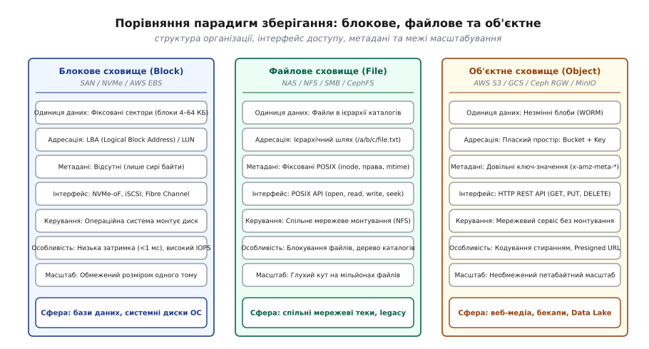
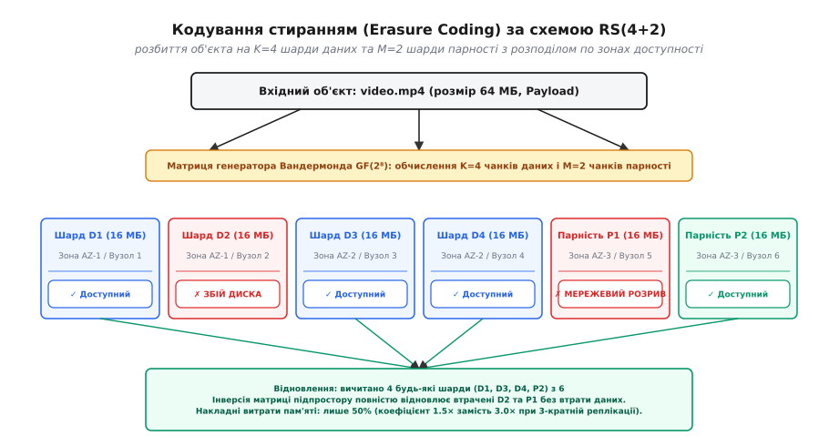
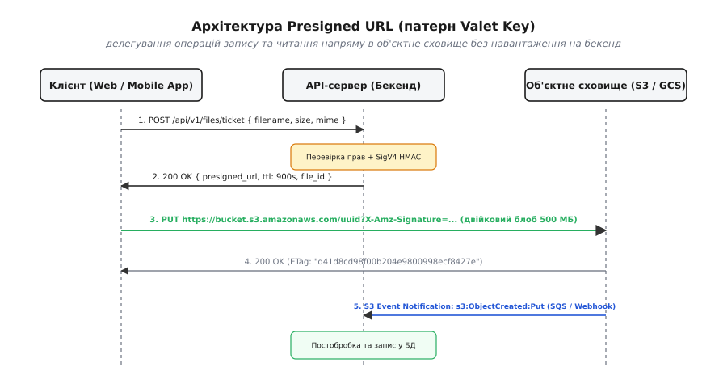
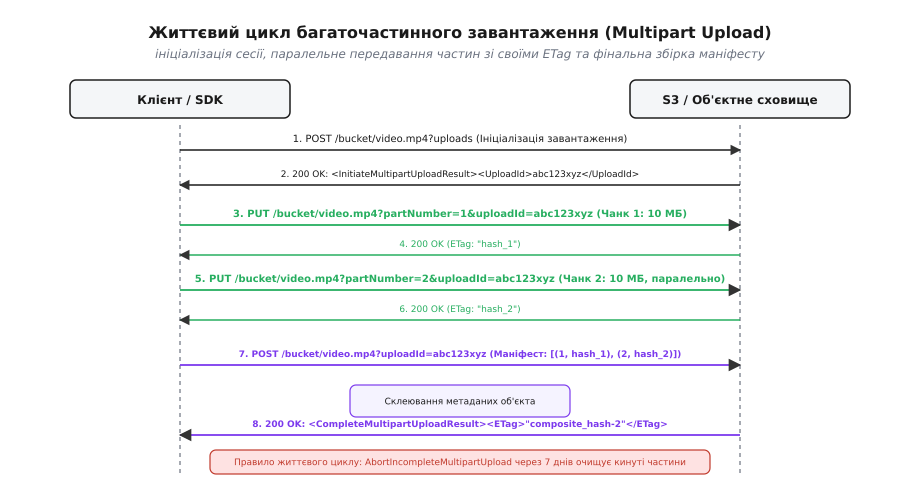

# Об'єктне сховище: модель WORM, плаский простір імен та прямий доступ

<preknowlist>
- [REST](root:com-protocol/rest-api) — ресурси й методи HTTP (GET, PUT, DELETE, HEAD), модель запит-відповідь та заголовки.
- [HTTP-кешування: Cache-Control, ETag й умовні запити](root:com-protocol/http-caching) — заголовки валідації (ETag, If-Match, If-None-Match) та умовні операції.
- [Ідемпотентність методів як частина контракту](root:com-protocol/api-idempotency) — повторювані мережеві виклики без побічних ефектів і дублювання стану.
- [Автентифікація](root:sf-security/authentication) — перевірка автентичності суб'єкта, криптографічні підписи та симетричні ключі.
- [Завантаження файлів як конвеєр](root:sf-data/file-uploads) — передача двійкових потоків, multipart-форми та стрімінг без накопичення в RAM.
</preknowlist>

Коли вебплатформа масштабується до мільйонів користувачів, спроба зберігати завантажені файли (аватари, документи, фотозвіти, відеоролики) у звичайній ієрархічній файловій системі на мережевому диску (NFS або SMB) неминуче призводить до катастрофічного колапсу інфраструктури. Щойно кількість файлів в одному каталозі або на одному дисковому томі перевищує кілька десятків мільйонів, час виконання системного виклику `stat()` або пошуку `lookup()` зростає з мікросекунд до десятків секунд. Процеси вебсервера блокуються в очікуванні м'ютексів віртуальної файлової системи ядра (VFS), таблиця дескрипторів `inode` вичерпує оперативну пам'ять, а фонова перевірка цілісності диска `fsck` після аварійного збою триває понад дві доби, паралізуючи роботу всього бізнесу.

Корінь цієї проблеми криється у фундаментальній невідповідності між суворими гарантіями стандарту POSIX та реальними потребами вебзастосунків. Класичні файлові системи створювалися для локальних дисків одного комп'ютера, де потрібні складні дерева каталогів, синхронне оновлення міток часу останнього доступу (`atime`), побайтове випадкове читання/запис (`pwrite`, `lseek`) та розподілені блокування файлів. Проте у вебі переважна більшість неструктурованих даних записується один раз і ніколи не модифікується по частинах — вони лише читаються мільйонами клієнтів або видаляються цілком.

Об'єктне сховище (англ. *Object Storage*) — це розподілена парадигма зберігання даних, яка повністю відкидає ієрархію каталогів та семантику POSIX на користь плаского простору незмінних двійкових блобів (англ. *Binary Large Objects, BLOB*), доступних через стандартний протокол HTTP REST API з практично безмежним горизонтальним масштабуванням.

## Парадигми зберігання даних: блок, файл, об'єкт

Щоби зрозуміти архітектурне місце об'єктних сховищ, необхідно чітко розмежувати три базові парадигми збереження цифрової інформації:

1. **Блокове сховище (Block Storage — SAN, NVMe-oF, AWS EBS).** Накопичувач представляється для операційної системи як сирий масив секторів фіксованого розміру (зазвичай 4 КБ або 512 байтів), що адресуються лінійними числовими номерами LBA (англ. *Logical Block Addressing*). Блоковий рівень нічого не знає про файли, назви чи метадані — він оперує виключно сирими байтами. Це забезпечує мінімальну затримку (менше 1 мс) та максимальну кількість операцій вводу-виводу на секунду (IOPS), що робить блокові диски ідеальним фундаментом для реляційних баз даних (PostgreSQL, MySQL, Oracle) та системних дисків віртуальних машин.
2. **Файлове сховище (File Storage — NAS, NFS, CIFS, CephFS).** Дані організовані у деревоподібну ієрархію каталогів і файлів. Операційна система монтує мережеву теку і надає прикладним процесам повноцінний інтерфейс POSIX (`open`, `read`, `write`, `close`, `mkdir`, `flock`). Сервер файлової системи зобов'язаний синхронізувати дерево метаданих, блокування та права доступу між усіма підключеними клієнтами, що створює нездоланне вузьке місце при зростанні навантаження.
3. **Об'єктне сховище (Object Storage — AWS S3, Google Cloud Storage, Ceph RGW, MinIO).** Дані зберігаються як дискретні, самодостатні сутності (об'єкти) у пласкому просторі імен. Тут немає операції монтування файлової системи до ядра ОС: клієнти взаємодіють зі сховищем як із мережевим вебсервісом через протокол HTTP(S).



*Порівняння блокового, файлового та об'єктного сховищ: перехід від локальних секторів та ієрархічних дерев POSIX до плаского простору незмінних блобів із REST-інтерфейсом забезпечує необмежене горизонтальне масштабування.*

Історично індустрія пройшла складний шлях від університетських експериментів із розумними дисками NASD до створення хмарного сервісу Amazon S3; [історія подолання кризи POSIX та народження Amazon S3](root:sf-data/object-storage/hist-s3-flat-namespace.md) детально показує, як відмова від стандарту POSIX на користь протоколу HTTP стала поворотним моментом в інженерії сховищ.

## Модель даних об'єктного сховища: бакети, ключі та блоби

Модель даних об'єктного сховища складається з трьох ключових абстракцій:

### 1. Бакет (Bucket — контейнер)

Бакет (від англ. *bucket* — відро, кошик) — це логічний контейнер верхнього рівня для групування об'єктів. Бакет є одиницею адміністративного керування:
* На рівні бакета призначаються політики безпеки та списки контролю доступу (IAM / Bucket Policies).
* Бакет жорстко прив'язаний до конкретного географічного регіону дата-центрів (наприклад, `eu-central-1` — Франкфурт).
* На рівні бакета налаштовуються правила життєвого циклу, шифрування, версіонування та конфігурація міждоменного доступу (CORS).
* Простір імен імен бакетів є глобально унікальним у межах усього хмарного провайдера (не можна створити два бакети з однаковим ім'ям `my-data` навіть у різних регіонах чи акаунтах).

### 2. Ключ (Key — ідентифікатор)

Ключ — це довільний рядок у кодуванні UTF-8 (довжиною до 1024 байтів), який однозначно ідентифікує об'єкт у межах конкретного бакета.

Критично важливо усвідомити: **в об'єктному сховищі не існує папок чи каталогів**. Рядок `users/2026/avatars/user_42.jpg` — це єдине монолітне ім'я ключа. Символ косої риски `/` є звичайним текстовим символом, точно таким самим, як літера `a` чи цифра `7`.

Сховище індексує ключі в розподілених структурах даних (LSM-деревах або B-деревах метаданих) як звичайні рядкові пари `Key -> MetadataPointer`. Це усуває необхідність у покроковому проходженні каталожного дерева: пошук об'єкта за ключем завжди виконується за константний час `O(1)` або `O(log N)` незалежно від того, скільки слешів містить рядок.

### 3. Об'єкт (Object)

Об'єкт є неподільною атомарною сутністю, що об'єднує три компоненти:

* **Корисне навантаження (Payload / Data).** Двійковий потік сирих байтів обсягом від 0 байтів до 5 терабайтів (образ диска, відеопотік, архів або JSON-документ).
* **Системні метадані (System Metadata).** Фіксований набір атрибутів, якими оперує саме сховище: точний розмір у байтах (`Content-Length`), MIME-тип вмісту (`Content-Type`), мітка часу створення (`Last-Modified`), криптографічний хеш цілісності (`ETag`), клас зберігання (`StorageClass`) та параметри шифрування.
* **Користувацькі метадані (User Metadata).** Довільні пари ключ-значення, які передаються клієнтом під час збереження з префіксом `x-amz-meta-*` (наприклад, `x-amz-meta-uploader: backend_worker`, `x-amz-meta-original-filename: contract.pdf`).

## Незмінність даних: модель WORM (Write Once, Read Many)

Фундаментальним інженерним законом об'єктних сховищ є **незмінність (Immutability)** об'єктів за моделлю WORM (від англ. *Write Once, Read Many* — записав один раз, прочитав багато разів).

У класичній файловій системі процес може відкрити файл, перемістити вказівник у середину за допомогою виклику `lseek(fd, 500, SEEK_SET)` і перезаписати лише 10 байтів викликом `write()`. В об'єктному сховищі **операції часткової модифікації за зміщенням не існує в принципі**.

Якщо в об'єкті розміром 1 ГБ потрібно змінити хоча б один байт, застосунок зобов'язаний завантажити новий об'єкт цілком, повністю замінивши старий файл.

Цей суворий компроміс дає колосальні архітектурні переваги:

1. **Повна відсутність блокувань запису (Lock-Free Concurrency).** Оскільки об'єкти не модифікуються на місці, системі не потрібні важкі розподілені блокування (Distributed Locks). Читачі можуть паралельно вичитувати байти старого об'єкта, поки інший клієнт завантажує нову версію під тим самим ключем.
2. **Безшовне кешування на CDN та проксі-серверах.** Якщо об'єкт незмінний, відповідь сервера з його хешем `ETag` можна безпечно кешувати на крайових серверах CDN (Cloudflare, CloudFront) на роки, унеможливлюючи появу частково пошкодженого або напів-оновленого стану.
3. **Спрощена асинхронна реплікація.** Реплікувати незмінний файл між дата-центрами тривіально: це звичайна потокова передача фіксованого блоку байтів без потреби розв'язувати конфлікти паралельних правок усередині файлу.

## Внутрішнє шардування простору ключів та оптимізація префіксів

Як розподілене об'єктне сховище обробляє десятки мільйонів запитів на секунду до одного бакета?

Внутрішня архітектура метаданих S3 розділяє простір ключів на діапазони — **партиції (Partitions)**, кожна з яких обслуговується окремим пулом серверів метаданих. За замовчуванням кожен префікс бакета забезпечує пропускну здатність щонайменше:
* **3 500 операцій запису** (`PUT`, `POST`, `DELETE`) на секунду;
* **5 500 операцій читання** (`GET`, `HEAD`) на секунду.

Якщо навантаження на конкретний префікс (наприклад, `images/2026/`) перевищує ці пороги, підсистема автоматичного масштабування сховища детектує гарячу партицію і динамічно розбиває її навпіл за лексикографічним ключем, подвоюючи пропускну здатність.

### Пастка послідовних ключів (Sequential Key Hotspotting)

Якщо застосунок генерує імена ключів із монотонно зростаючими числовими або часовими префіксами:

```text
logs/2026-08-20-12-00-01.log
logs/2026-08-20-12-00-02.log
logs/2026-08-20-12-00-03.log
```

Усі нові записи спрямовуються в один і той самий крайній правий сегмент лексикографічного B-дерева метаданих, перевантажуючи один сервер партиції (явище Hot Partitioning). У результаті клієнти починають отримувати помилки `503 SlowDown`.

Щоби досягти екстремальної паралельної продуктивності (понад 100 000 запитів/с), застосовують стратегії розсіювання префіксів:
* **Хешований префікс:** додавання випадкового або хешованого префікса на початку ключа: `a7f9-logs/2026-08-20-12-00-01.log` (де `a7f9` — перші символи MD5-хешу від мітки часу).
* **Шардування за ідентифікатором сутності:** розміщення ID користувача на початку префікса: `users/usr_876543/uploads/avatar.jpg`, що природно розносить трафік між тисячами незалежних партицій.

## Інтерфейс доступу: RESTful HTTP Semantics

Взаємодія з об'єктним сховищем здійснюється виключно через стандартні методи протоколу HTTP/1.1 та HTTP/2:

* `PUT /{bucket}/{key}`: створення нового об'єкта або повний перезапис існуючого.
* `GET /{bucket}/{key}`: потокове завантаження двійкового тіла та всіх пов'язаних метаданих.
* `HEAD /{bucket}/{key}`: отримання виключно HTTP-заголовків метаданих (розмір, ETag, MIME-тип) без передачі самого тіла файлу.
* `DELETE /{bucket}/{key}`: безповоротне видалення об'єкта.

### Умовні операції та оптимістичне блокування

Щоби запобігти конфліктам, коли два фонові процеси одночасно намагаються перезаписати той самий об'єкт, S3 REST API підтримує умовні HTTP-заголовки валідації:

```http
PUT /configs/routing.json HTTP/1.1
Host: app-bucket.s3.eu-central-1.amazonaws.com
If-Match: "9baddb367eee81ee20ad92f77957be43"
Content-Type: application/json
Content-Length: 512

{ "route_v2": true }
```

Якщо за час підготовки запиту інший воркер уже оновив файл `routing.json` (і його ETag змінився), сховище відхилить запит зі статусом `412 Precondition Failed`, запобігаючи втраті чужих змін; [повна специфікація S3 REST API](root:sf-data/object-storage/api-s3-operations.md) детально описує всі структури запитів, системні заголовки, параметри лістингу та схеми XML-помилок.

### Емуляція папок через лістинг ListObjectsV2

Коли користувацький інтерфейс або консоль адміністратора відображає список файлів у вигляді знайомих папок, це досягається виключно за рахунок параметрів пошуку у методі `GET /{bucket}?list-type=2`:

* Параметр `prefix=users/42/`: відбирає лише ті ключі, які починаються із зазначеного підрядка.
* Параметр `delimiter=/`: дає вказівку сховищу згорнути всі проміжні підрядки між префіксом і наступним слешем у список `<CommonPrefixes>`, які клієнтське ПЗ малює як «віртуальні каталоги».

## Еволюція моделей узгодженості: від Eventual до Strong Consistency

Історично однією з найбільших проблем розробки веббекендів була модель узгодженості метаданих об'єктних сховищ.

З моменту запуску у 2006 році і до кінця 2020 року Amazon S3 працювала за моделлю **узгодженості в кінцевому підсумку (Eventual Consistency)** для операцій перезапису та видалення об'єктів. Причина полягала в теоремі CAP: заради абсолютної доступності (Availability) під час мережевих розривів між дата-центрами S3 асинхронно реплікувала таблиці метаданих.

Це породжувало важкі аномалії паралелізму:
* **Аномалія Read-After-Create:** клієнт завантажував файл `PUT avatar.jpg`, отримував `200 OK`, але наступний миттєвий `GET avatar.jpg` з іншого сервера повертав `404 Not Found`, оскільки реплікація метаданих ще не завершилася.
* **Аномалія фантомного лістингу (List-After-Delete):** клієнт видаляв об'єкт `DELETE file.pdf`, але виклик `ListObjects` протягом кількох секунд продовжував показувати видалений файл у списку.

Розробники були змушені городити складні зовнішні шари координації на базі DynamoDB або Redis (наприклад, бібліотеку `S3Guard`), щоби синхронізувати стан файлів.

У грудні 2020 року інженери AWS реалізували технологічний прорив, перевівши S3 на **сувору узгодженість після запису (Strong Read-After-Write Consistency)** для всіх операцій (`PUT`, `GET`, `HEAD`, `DELETE`, `LIST`) без втрати продуктивності та без зростання затримок. Сучасні об'єктні сховища гарантують: щойно клієнт отримав статус `200 OK` на операцію `PUT` або `DELETE`, будь-який наступний запит `GET` або лістинг із будь-якої точки світу миттєво побачить оновлений стан.

## Відмовостійкість та надійність: реплікація проти кодування стиранням

Хмарні сховища декларують астрономічний рівень надійності зберігання — **99.999999999% (одинадцять дев'яток)** річної ймовірності збереження кожного об'єкта. Це означає, що при збереженні 100 мільярдів файлів очікується втрата не більше одного об'єкта за рік.

Як досягається така надійність на дешевих, ненадійних серверах та споживчих жорстких дисках?

### 1. Традиційна трикратна реплікація (3× Replication)

Найпростіший спосіб захисту — зберегти три повні копії кожного об'єкта на трьох незалежних серверах у різних стійках чи дата-центрах.
* **Перевага:** простота реалізації та швидке читання.
* **Недолік:** колосальні накладні витрати дискового простору. Коефіцієнт роздування становить `3.0×` (накладні витрати `200%`). Щоби зберегти 10 петабайтів корисних даних, потрібно придбати 30 петабайтів фізичних накопичувачів, що робить сховище економічно нерентабельним.

### 2. Кодування стиранням (Erasure Coding — Reed-Solomon)

Сучасні об'єктні сховища використовують вищу математику: кодування стиранням за алгоритмом Ріда-Соломона над скінченними полями Галуа `GF(2⁸)`.

Об'єкт розбивається на `K` фрагментів даних однакового розміру. За допомогою множення на матрицю генератора Вандермонда або Коші система обчислює `M` додаткових фрагментів парності:

```
Загальна кількість шардів = K + M
```

Всі `K + M` шардів розподіляються між різними серверами, стійками та зонами доступності (Availability Zones).



*Кодування стиранням RS(4+2): об'єкт розбивається на 4 чанки даних і 2 чанки парності. Одночасний збій двох будь-яких накопичувачів не призводить до втрати даних — система відновлює 100% інформації з 4 вцілілих шардів.*

Головна математична властивість кодування Ріда-Соломона: **для повного відновлення вихідного об'єкта достатньо прочитати будь-які `K` шардів із загальної кількості `K + M`**.

Для популярної промислової схеми `RS(8 + 4)` (`K = 8` даних, `M = 4` парності, всього 12 шардів):
* Сховище витримує одночасний повний вихід із ладу **будь-яких 4 накопичувачів або серверів** без втрати жодного байта.
* Коефіцієнт накладних витрат становить лише `(8 + 4) / 8 = 1.5×` (накладні витрати `50%` замість `200%` при реплікації).

Ця економія дозволяє провайдерам знизити вартість гігабайта пам'яті в 4 рази при одночасному подвоєнні фізичної надійності масиву; [математичне обґрунтування кодування стиранням та надійності одинадцяти дев'яток](root:sf-data/object-storage/math-erasure-coding.md) містить покрокове виведення матричних операцій у полях Галуа, розрахунок відновлення втрачених шардів та марковські моделі розрахунку часу до втрати даних (MTTDL).

## Делегований доступ: патерн Valet Key та Presigned URL

Найважливішим архітектурним патерном інтеграції веббекенду з об'єктним сховищем є **делегований доступ через тимчасово підписані посилання (Presigned URLs / Valet Key)**.

Якщо клієнти (веббраузери, мобільні додатки) надсилають важкі файли безпосередньо через прикладні сервери бекенду, виникають три критичні проблеми:
1. Робочі потоки бекенда блокуються повільними мережевими сокетами клієнтів (Socket Starvation).
2. Оперативна пам'ять серверів вичерпується буферизацією вхідних байтів (ризик спрацьовування OOM Killer).
3. Вартість вихідного трафіку подвоюється, оскільки дані двічі проходять через мережеву інфраструктуру.

Патерн Valet Key розв'язує цю проблему, повністю усуваючи бекенд зі шляху передачі сирих даних:



*Архітектура Presigned URL: клієнт отримує від бекенду короткоживуче підписане посилання з HMAC-хешем і передає потік байтів безпосередньо в об'єктне сховище, повністю розвантажуючи сервери додатків.*

Конвеєр завантаження працює за чотири кроки:

1. **Запит квитка (Ticket Request):** Клієнт надсилає легковаговий JSON-запит на бекенд: `POST /api/v1/uploads/ticket` із метаданими файлу (назва, MIME-тип, очікуваний розмір).
2. **Генерація підпису:** Бекенд перевіряє права користувача в базі даних і за допомогою свого секретного ключа генерує підписане посилання (**Presigned URL**) за стандартом AWS SigV4 з обмеженим терміном дії (наприклад, 15 хвилин). У підписі фіксуються дозволений HTTP-метод (`PUT`), ключ об'єкта, ім'я бакета та допустимий тип контенту.
3. **Пряме завантаження (Direct-to-Cloud Upload):** Клієнт отримує URL і виконує прямий виклик `PUT` на адресу сховища S3. Сховище автономно верифікує криптографічний HMAC-підпис та зберігає байти.
4. **Асинхронне сповіщення (Storage Event):** Після збереження сховище автоматично генерує подію `s3:ObjectCreated:Put` у чергу задач (AWS SQS / Webhook), звідки фонові воркери бекенду підхоплюють файл для генерації прев'ю, транскодування відео чи сканування антивірусом; [генерація та валідація Presigned URL за протоколом AWS SigV4](root:sf-data/object-storage/proj-presigned-signer.md) демонструє робочу реалізацію алгоритму підпису та верифікатора мовами C, C++ та Go.

> 🔧 **Навіщо це.** У системі відеохостингу пряме завантаження через Presigned URL дозволяє 10 000 користувачів одночасно завантажувати 4K-ролики обсягом по 2 ГБ. Сервери бекенду при цьому обробляють лише легковагові JSON-квитки розміром у кілька сотень байтів, утримуючи споживання пам'яті на рівні кількох мегабайтів замість 20 терабайтів RAM.

## Багаточастинне завантаження (Multipart Upload) та очищення сирітських блоків

При завантаженні файлів розміром понад 100 МБ через публічний Інтернет передача монолітним HTTP-запитом `PUT` стає ненадійною: будь-який розрив TCP-з'єднання на 99% завантаження змушує клієнта передавати всі гігабайти з нульового байта.

Для подолання цієї проблеми протокол S3 визначає обов'язковий стандарт **Multipart Upload** (багаточастинне завантаження):



*Життєвий цикл Multipart Upload: ініціалізація сесії завантаження, паралельна відправка чанків із власними ETag та фінальна збірка об'єкта за маніфестом.*

Конвеєр складається з трьох послідовних кроків:

1. **Ініціалізація (`CreateMultipartUpload`):** Клієнт надсилає `POST /bucket/key?uploads`. Сховище реєструє нову сесію та повертає унікальний рядок `UploadId`.
2. **Паралельне завантаження частин (`UploadPart`):** Клієнт нарізає файл на чанки розміром від 5 МБ до 5 ГБ і завантажує їх паралельними HTTP-потоками: `PUT /bucket/key?partNumber=N&uploadId=...`. Сховище повертає `ETag` для кожної частини. Якщо окремий чанк обривається через мережевий збій, клієнт повторює передачу лише цього 5-мегабайтного блоку.
3. **Фіналізація (`CompleteMultipartUpload`):** Клієнт надсилає XML-маніфест із переліком усіх номерів частин та їхніх ETag. Сховище зв'язує збережені шарди в єдиний цілісний об'єкт і робить його доступним для читання.

### Пастка «осиротілих» частин (Orphaned Parts Leak)

При використанні Multipart Upload криється небезпечна фінансова та інфраструктурна пастка.

Якщо клієнт ініціював багаточастинне завантаження, завантажив 50 ГБ частин, а потім закрив вкладку браузера або зазнав аварії, об'єктне сховище **продовжує безстроково зберігати всі завантажені фрагменти на дисках**, навіть якщо об'єкт так і не був зібраний. Оскільки незавершені частини не відображаються у звичайному лістингу `ListObjects`, компанії роками сплачують тисячі доларів за терабайти прихованого «сміття».

Єдиним надійним захистом від цього витоку є обов'язкове налаштування **правила життєвого циклу (Lifecycle Rule)** на рівні кожного бакета:

```xml
<LifecycleConfiguration>
    <Rule>
        <ID>AutoAbortAbandonedMultipartUploads</ID>
        <Status>Enabled</Status>
        <Filter><Prefix></Prefix></Filter>
        <AbortIncompleteMultipartUpload>
            <DaysAfterInitiation>7</DaysAfterInitiation>
        </AbortIncompleteMultipartUpload>
    </Rule>
</LifecycleConfiguration>
```

Це правило зобов'язує сховище автоматично видаляти будь-які незавершені частини, якщо з моменту ініціалізації сесії минуло понад 7 днів.

## Класи зберігання (Storage Tiers) та патерн Claim Check

Об'єктні сховища оптимізують вартість володіння інфраструктурою завдяки автоматичному розподілу даних за **класами зберігання (Storage Tiers)**:

| Клас зберігання | Час доступу (Latency) | Вартість зберігання | Мінімальний термін оплати | Сфера застосування |
| :--- | :--- | :--- | :--- | :--- |
| **Standard (Hot)** | Мілісекунди | Найвища | Відсутній | Активні медіафайли, веб-асети, аватари |
| **Infrequent Access (Warm)** | Мілісекунди | Вдвічі дешевше | 30 днів | Щомісячні звіти, резервні копії БД |
| **Glacier Flexible (Cold)** | Від хвилин до годин | У 5 разів дешевше | 90 днів | Архіви аудиту, логи піврічної давнини |
| **Deep Archive (Frozen)** | 12–48 годин | У 20 разів дешевше | 180 днів | Нормативні медичні та фінансові архіви (7+ років) |

Автоматичні правила життєвого циклу (Lifecycle Rules) дозволяють налаштувати прозору міграцію: файл через 30 днів автоматично переміщується зі `Standard` у `Standard-IA`, через 90 днів упаковується в `Glacier`, а через 365 днів безповоротно стирається.

### Патерн Claim Check (Квитанція камери схову)

У подійно-орієнтованих розподілених системах брокери повідомлень (Apache Kafka, RabbitMQ, AWS SQS) мають суворі обмеження на розмір одного повідомлення (зазвичай від 256 КБ до 1 МБ). Передача важких вантажів (наприклад, PDF-звіту на 50 МБ або дампу бази даних) через шину подій призводить до деградації пропускної здатності та переповнення пам'яті брокера.

Патерн **Claim Check** вирішує це завдання за допомогою об'єктного сховища:

1. Продюсер події записує важкий бінарний блоб в об'єктне сховище: `PUT /payloads/uuid_9876.dat`.
2. У шину повідомлень продюсер відправляє крихітне JSON-повідомлення («квитанцію»), яке містить лише метадані та посилання на збережений об'єкт:
   ```json
   {
     "event_type": "ReportGenerated",
     "report_id": "rep_42",
     "claim_check_url": "s3://my-bucket/payloads/uuid_9876.dat",
     "size_bytes": 52428800
   }
   ```
3. Споживач (Consumer) вичитує квитанцію з черги і за потреби самостійно зчитує тіло файлу з об'єктного сховища.

Таке розділення площини керування (Control Plane у черзі подій) та площини даних (Data Plane в об'єктному сховищі) гарантує стабільну роботу розподіленої системи під будь-яким навантаженням.

## Географічна реплікація та аварійне відновлення (CRR та SRR)

Для захисту від масштабних регіональних катастроф (Disaster Recovery) та виконання законодавчих вимог щодо суверенітету даних (GDPR, HIPAA) об'єктні сховища підтримують автоматичну кросрегіональну реплікацію:

* **Кросрегіональна реплікація (CRR — Cross-Region Replication):** об'єкти, що записуються в бакет у Франкфурті (`eu-central-1`), асинхронно копіюються в бакет в Ірландії (`eu-west-1`) або США.
* **Внутрішньорегіональна реплікація (SRR — Same-Region Replication):** дублювання даних між окремими обліковими записами в межах одного регіону для ізоляції виробничих і тестових середовищ.

Під час реплікації сховище автоматично передає тіло об'єкта, системні та користувацькі метадані, теги та шифрування. У версійованих бакетах реплікація поширюється як на створення нових версій, так і на створення маркерів видалення (Delete Markers).

Щоби уникнути нескінченних циклів реплікації при налаштуванні двонаправленої синхронізації (Active-Active CRR), метадані об'єкта містять спеціальний прапорець статусу реплікації: об'єкт, який потрапив у бакет через механізм CRR, не ініціює зворотну реплікацію у вихідний бакет.

## Обчислення за місцем: технологія S3 Select та фільтрація на сховищі

Традиційна аналітична обробка великих даних в об'єктних сховищах стикається з проблемою «транспортування зайвих байтів». Якщо аналітичному рушію (Apache Spark, Trino, Presto) потрібно обчислити агрегат над 5 колонками таблиці Parquet обсягом 100 ГБ, застосунок змушений викачати всі 100 ГБ по мережі, щоби відфільтрувати 99% рядків в оперативній пам'яті воркера.

Технологія **S3 Select (Pushdown Predicates)** переносить обчислення безпосередньо на вузли об'єктного сховища:

1. Клієнт надсилає виклик `POST /bucket/data.parquet?select&select-type=2` зі спрощеним SQL-запитом:
   ```sql
   SELECT customer_id, total_amount FROM S3Object WHERE status = 'COMPLETED'
   ```
2. Контролер сховища вичитує файл із дисків, самостійно розбирає стовпчикову структуру Parquet/CSV/JSON та виконує фільтрацію на процесорах вузлів сховища.
3. По мережі передаються виключно відфільтровані результати (наприклад, 20 МБ замість 100 ГБ).

Це скорочує навантаження на мережу та час виконання аналітичних запитів у 10–50 разів.

## Відкрита екосистема та подолання Vendor Lock-in

Успіх стандарту S3 перетворив його на загальноприйняту універсальну мову зберігання неструктурованих даних. Розробка бекенду з орієнтацією на протокол S3 повністю позбавляє систему прив'язки до одного постачальника хмарних послуг (Vendor Lock-in):

* **MinIO:** високопродуктивне сховище мовою Go, яке розгортається у кластерах Kubernetes як локальний сервіс зберігання для мікросервісів.
* **Ceph RADOS Gateway (RGW):** відкрита розподілена система для побудови петабайтних приватних дата-центрів на власному залізі компанії.
* **Cloudflare R2:** об'єктне сховище без оплати за вихідний трафік (Zero Egress Fees), сумісне з S3 API на рівні викликів.
* **Wasabi та Backblaze B2:** спеціалізовані комерційні платформи з фіксованими низькими тарифами на зберігання резервних копій та медіаархівів.

Завдяки єдиному стандарту протоколу прикладний код застосунку використовує один і той самий клієнтський SDK як під час локальної розробки в Docker-контейнері, так і під час промислової експлуатації в глобальних хмарах із петабайтами користувацьких файлів.

Об'єктне сховище перетворилося на фундаментальну опору сучасного бекенду, замінивши негнучкі файлові системи універсальним, надійним та економічно ефективним сховищем неструктурованих даних усього світового Інтернету.
