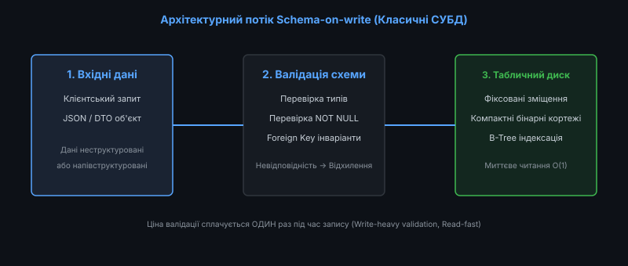
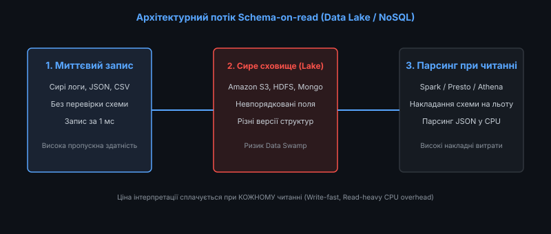
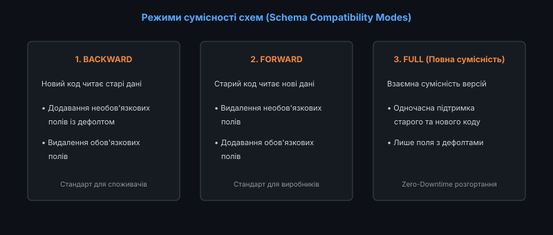

# 📜 Schema-on-write проти Schema-on-read

<preknowlist>
- [Реляційна модель даних](topic:sf-data/relational-model)
- [Міграції схеми баз даних та нульовий час простою (Zero-Downtime)](topic:sf-data/database-migrations)
- [Ландшафт NoSQL: Key-Value, Document, Column-Family та Graph](topic:sf-data/nosql-landscape)
- [Моделювання даних під шаблони доступу (Access-Pattern-First)](topic:sf-data/access-pattern-first)
- [Поліглотне збереження даних (Polyglot Persistence)](topic:sf-data/polyglot-persistence)
</preknowlist>

У будь-якій інформаційній системі дані володіють структурою: іменами атрибутів, типами значень, обмеженнями діапазонів та взаємними зв'язками. Проте момент, у який ця структура фіксується, перевіряється та застосовується до бітів пам'яті, розділяє всі технології збереження на дві фундаментальні парадигми: **Schema-on-write (Схема під час запису)** та **Schema-on-read (Схема під час читання)**.

Вибір між цими підходами визначає не лише спосіб моделювання сутностей, але й швидкість виконання запитів, надійність системи під час збоїв, вартість міграцій та масштабованість інфраструктури.

Розглянемо внутрішні механізми обох парадигм, їхні фізичні компроміси на рівні процесора й диска, а також сучасний індустріальний синтез у вигляді гібридних форматів та контрактів схем.

---

### Анатомія парадигми Schema-on-write

Парадигма **Schema-on-write** є фундаментом класичних реляційних систем управління базами даних (PostgreSQL, MySQL, Oracle, Microsoft SQL Server). Її головний принцип: *жоден біт інформації не може бути записаний на диск без попереднього оголошення та суворої валідації схеми*.


*Конвеєр Schema-on-write: валідація інваріантів та типів на етапі запису забезпечує миттєве константне читання*

#### Внутрішній механізм роботи
1. **Оголошення схеми через DDL**: Розробник заздалегідь визначає таблиці, стовпці, типи та обмеження (`CREATE TABLE users (id INT, email VARCHAR(255) NOT NULL UNIQUE)`).
2. **Перевірка інваріантів під час запису**: При спробі виконати `INSERT` рушій СУБД перевіряє відповідність типів даних, відсутність порожніх значень у стовпцях `NOT NULL`, унікальність індексів та зовнішні ключі `FOREIGN KEY`. У разі будь-якої невідповідності транзакція негайно відхиляється.
3. **Фіксований бінарний лейаут кортежів (Tuples)**: Оскільки типи та розміри полів відомі заздалегідь, база даних розміщує значення у блоці пам'яті за фіксованими зміщеннями. Назви стовпців зберігаються лише один раз у системному каталозі (System Catalog) і не дублюються всередині рядків.

#### Переваги Schema-on-write
* **Максимальна швидкість вибірки O(1)**: Зміщення будь-якого поля в пам'яті обчислюється миттєво без потреби в лексичному розборі рядків.
* **Гарантована цілісність даних**: Прикладний код захищений від неочікуваних типів даних (наприклад, потрапляння тексту в поле грошового балансу) на рівні ядра СУБД.
* **Компактність зберігання та ефективна компресія**: Відсутність назв ключів у кожному рядку скорочує обсяг пам'яті на диску у 3–10 разів порівняно з неструктурованим текстом.
* **Оптимізація індексів B-Tree**: Фіксована довжина ключів дозволяє будувати компактні збалансовані дерева пошуку з високим коефіцієнтом розгалуження (Fan-out).
* **Апаратна оптимізація пам'яті**: Процесор може застосовувати векторні інструкції SIMD для одночасної обробки кількох числових значень одного стовпця без розбору тексту.

#### Обмеження та компроміси
* **Висока ціна змін схеми**: Додавання нового поля або зміна типу вимагає виконання DDL-міграцій (`ALTER TABLE`), що на таблицях у сотні мільйонів рядків може блокувати читання або запис на тривалий час.
* **Неможливість збереження поліморфних та невідомих даних**: Якщо зовнішнє джерело передає об'єкти з динамічним набором атрибутів, реляційна схема змушує або створювати десятки розріджених стовпців (Sparse Columns), або використовувати небезпечні антипатерни на кшталт EAV (Entity-Attribute-Value).

---

### Анатомія парадигми Schema-on-read

Парадигма **Schema-on-read** виникла у відповідь на виклики обробки великих даних (Big Data) та неструктурованої інформації в документоорієнтованих NoSQL базах (MongoDB, CouchDB) та озерах даних (Data Lakes: Apache Hadoop HDFS, Amazon S3, Google Cloud Storage).

Її головний принцип: *дані зберігаються в сирому, первинному вигляді без попередньої перевірки схеми, а структура та типи інтерпретуються прикладним кодом безпосередньо в момент читання*.


*Конвеєр Schema-on-read: миттєвий запис сирих даних переносить накладні витрати парсингу на кожен запит читання*

#### Внутрішній механізм роботи
1. **Миттєва фіксація сирих байтів**: При надходженні запису (JSON-документ, CSV-рядок, сирий лог веб-сервера) рушій сховища просто записує байти на диск або в об'єктне сховище без будь-якої валідації.
2. **Збереження метаданих разом із даними (Self-describing formats)**: Кожен окремий запис містить як значення, так і назви полів та типи даних (наприклад, `{"user_id": 42, "status": "active"}`).
3. **Динамічна інтерпретація під час запиту**: Коли клієнт або аналітичний рушій (Apache Spark, Presto, Trino) виконує вибірку, він на льоту парсить сирий текст, виділяє потрібні поля та накладає схему, описану в SQL-запиті.

#### Переваги Schema-on-read
* **Нульовий час адаптації до змін (Agility)**: Додавання нових атрибутів не вимагає міграцій бази даних. Виробник може негайно почати відправляти нові поля в JSON.
* **Швидкий та простий Ingest**: Запис відбувається з максимальною пропускною здатністю, оскільки процесор не витрачає час на перевірку інваріантів та блокування системних каталогів.
* **Збереження первинного контексту**: Сирі логи зберігаються без втрати невідомих полів, що дозволяє витягти з них нові аналітичні метрики через місяці чи роки після запису.
* **Поділ обчислень і сховища (Separation of Compute and Storage)**: Аналітичні вузли можуть динамічно масштабуватися незалежно від об'єктного сховища Amazon S3.

#### Ризики та темний бік: Феномен «Болота даних» (Data Swamp)
* **Колосальні накладні витрати процесора**: Кожен запит на читання змушений виконувати парсинг тексту, перевірку наявності ключів та конвертацію рядків у числа, споживаючи гігагерци процесорного часу.
* **Приховані помилки в додатку**: Оскільки схема не контролюється базою, виправлення помилок перекладається на код додатку. Якщо в одному документі поле записано як `"age": 25`, а в іншому як `"age": "twenty-five"`, запит впаде з помилкою під час виконання (Runtime Exception).
* **Data Swamp (Болото даних)**: Без суворого контролю сховище з часом перетворюється на звалище несумісних версій даних, де ніхто в організації не знає точного значення та формату наявних файлів.

Історичну трансформацію від CODASYL до сучасних озер даних викладено у вставці [Історія та еволюція підходів Schema-on-write та Schema-on-read](topic:sf-data/schema-on-read-write/hist-schema-evolution.md).

---

### Порівняльний аналіз архітектурних характеристик

| Характеристика | Schema-on-write (RDBMS) | Schema-on-read (Data Lake / Document DB) |
| :--- | :--- | :--- |
| **Місце перевірки схеми** | Ядро СУБД під час запису (Ingestion) | Код додатку або аналітичний рушій під час читання |
| **Час доступу до поля** | Константний `O(1)` за фіксованим зміщенням | Лінійний `O(N)` або через хеш-пошук по ключах документа |
| **Вимоги до пам'яті на диску** | Мінімальні (назви полів не зберігаються у рядках) | Високі (назви ключів дублюються у кожному записі) |
| **Гнучкість зміни схеми** | Низька (вимагає DDL-міграцій та планування) | Висока (довільні структури без блокування) |
| **Гарантія типів** | 100% сувора типізація ядра | Відсутня (вимагає захисного програмування в додатку) |
| **Ефективність стиснення** | Екстремальна (однорідні бінарні стовпці) | Середня (текстовий шум та нерівномірний синтаксис) |

Математичний аналіз складності парсингу та розрахунок оверхеду пам'яті наведено у вставці [Математичний аналіз складності доступу та накладних витрат: Schema-on-write проти Schema-on-read](topic:sf-data/schema-on-read-write/math-schema-parsing-complexity.md).

---

### Сучасний інженерний синтез та гібридні формати

Сьогодні індустрія відійшла від протиставлення «біле або чорне» і розробила ефективні гібридні інструменти, що поєднують переваги обох підходів:

#### 1. Тип даних JSONB у реляційних СУБД (PostgreSQL)
PostgreSQL пропонує тип `JSONB`, який є реалізацією Schema-on-read усередині строго типізованої бази Schema-on-write. При записі JSON декомпілюється у бінарне дерево, де ключі впорядковані та проіндексовані. Це забезпечує гнучкість зберігання динамічних атрибутів із можливістю швидкого індексування через GIN-індекси (Generalized Inverted Index).

#### 2. Колонкові бінарні формати (Apache Parquet та ORC)
Apache Parquet поєднує гнучкість документоорієнтованих форматів із високою швидкістю Schema-on-write. Схема та типи описуються один раз у метаданих файлу (Footer), а дані розбиваються на колонкові чанки (Row Groups) з використанням високоефективних алгоритмів стиснення (Dictionary Encoding, Run-Length Encoding).

#### 3. Контракти схем та Schema Registry
У розподілених архітектурах на основі черг повідомлень (Apache Kafka) застосовується централізований реєстр схем (**Schema Registry**). Повідомлення серіалізуються у компактні бінарні формати (Apache Avro, Protocol Buffers), а брокер валідує схему на етапі відправки, захищаючи споживачів від випадкових несумісних змін.


*Правила еволюції схем: режими BACKWARD, FORWARD та FULL гарантують безпечне оновлення сервісів без простоїв*

#### 4. Транзакційні шари Lakehouse (Delta Lake, Apache Iceberg)
Формати таблиць Delta Lake та Iceberg накладають сувору перевірку схем (Schema Enforcement) поверх сирих файлів Parquet у сховищах Amazon S3, відхиляючи некоректні записи під час операцій запису й водночас підтримуючи автоматичну еволюцію схеми (Schema Evolution) через конфігураційні прапорці.

Матрицю режимів еволюції та правила зміни полів викладено у вставці [Довідник еволюції схем даних: Матриця сумісності та формати](topic:sf-data/schema-on-read-write/api-schema-evolution-matrix.md).

---

### Реалізація та бенчмарк парсерів на C та C++

Розглянемо практичну різницю в реалізації читання даних між моделлю з фіксованими бінарними зміщеннями та динамічним текстовим парсингом:

:::tabs
@tab C
```c
#include <stdio.h>
#include <stdint.h>
#include <stdbool.h>
#include <string.h>
#include <stdlib.h>

// 1. Schema-on-write: Пряме читання за зміщенням O(1)
typedef struct {
    uint32_t user_id;
    double balance;
    uint32_t created_at;
} account_record_t;

double read_balance_write(const account_record_t *rec) {
    return rec->balance; // 1 інструкція процесора
}

// 2. Schema-on-read: Текстовий парсинг рядка O(N)
double read_balance_read(const char *json_like_str) {
    const char *key = "\"balance\":";
    const char *pos = strstr(json_like_str, key);
    if (!pos) return 0.0;
    pos += strlen(key);
    return strtod(pos, NULL); // Лексичний розбір десяткового дробу
}
```
@tab C++
```cpp
#include <iostream>
#include <string_view>
#include <charconv>
#include <optional>

namespace schema {

// 1. Schema-on-write
struct Account {
    uint32_t user_id;
    double balance;
    uint32_t created_at;
};

// 2. Schema-on-read швидкий парсер через std::string_view
std::optional<double> extract_balance(std::string_view payload) {
    constexpr std::string_view key = "\"balance\":";
    auto pos = payload.find(key);
    if (pos == std::string_view::npos) return std::nullopt;

    payload.remove_prefix(pos + key.size());
    double balance = 0.0;
    auto res = std::from_chars(payload.data(), payload.data() + payload.size(), balance);
    if (res.ec == std::errc{}) {
        return balance;
    }
    return std::nullopt;
}

} // namespace schema
```
:::

Повний стенд тестування з вимірюванням латентності та кеш-промахів на 100 000 записах наведено у практичному проєкті [Розробка та порівняльний бенчмарк парсерів Schema-on-write та Schema-on-read на C та C++](topic:sf-data/schema-on-read-write/proj-schema-parsers-benchmark.md).

---

### Критерії вибору та підсумкові інженерні правила

1. **Транзакційні ядра та білінг -> Завжди Schema-on-write**: Для систем обліку фінансів, балансів та користувацьких профілів сувора схема є обов'язковою для запобігання втраті цілісності.
2. **Збір сирої телеметрії та логів -> Schema-on-read (Data Lake)**: Для збереження сотень гігабайтів метрик використовуйте дешеві об'єктні сховища без попередньої обробки.
3. **Аналітика великих обсягів -> Гібридні колонкові формати (Parquet)**: Перетворюйте сирі логи Data Lake на файли Parquet за допомогою фонових ETL/ELT конвеєрів для прискорення аналітичних SQL-запитів у 20–50 разів.
4. **Мікросервісна взаємодія -> Двійкові контракти (Protobuf / Avro)**: Відмовтеся від сирого нетипізованого JSON у внутрішніх шинах подій на користь Schema Registry з режимом сумісності `FULL_TRANSITIVE`.
5. **Захисне програмування при роботі з Schema-on-read**: При читанні неструктурованих документів завжди перевіряйте наявність ключів, обробляйте відсутні значення (Null Safety) та логуйте аномалії у Dead-Letter Queue.
6. **Автоматизуйте валідацію схем у CI/CD**: Інтегруйте статичні лінтери схем у конвеєри розгортання для запобігання випадковому порушенню сумісності.
7. **Встановлюйте політики очищення Data Swamp**: Впроваджуйте автоматичні правила видалення або архівування неструктурованих сирих файлів, що не читалися понад 90 днів.
8. **Моніторинг вартості аналітичних запитів**: Відстежуйте обсяг просканованих байтів під час кожного Schema-on-read запиту до BigQuery чи Amazon Athena, оскільки неконтрольований парсинг сирих JSON безпосередньо збільшує щомісячний рахунок за хмарну інфраструктуру.
9. **Єдине джерело правди для DTO**: Генеруйте структури даних для всіх мов програмування проекту (C++, Python, TypeScript, Go) з єдиного репозиторію схем protobuf/avro за допомогою інструментів автоматичної кодогенерації.
10. **Ізоляція сирого шару (Bronze Layer)**: У трирівневій архітектурі озера даних (Medallion Architecture) зберігайте сирий шар Schema-on-read ізольованим від аналітичних звітів, надаючи кінцевим споживачам лише очищений і строго типізований золотий шар (Gold Layer).
11. **Планування розширення типів**: Завжди закладайте типи достатньої розрядності (`BIGINT` замість `INT` для первинних ключів і лічильників), щоб уникнути вимушених блокуючих DDL-міграцій у майбутньому.
12. **Індексація динамічних структур**: При використанні полів `JSONB` у PostgreSQL обмежуйте створення індексів лише тими шляхами, які реально фігурують у вибірках `WHERE`, щоб уникнути деградації швидкості запису.
