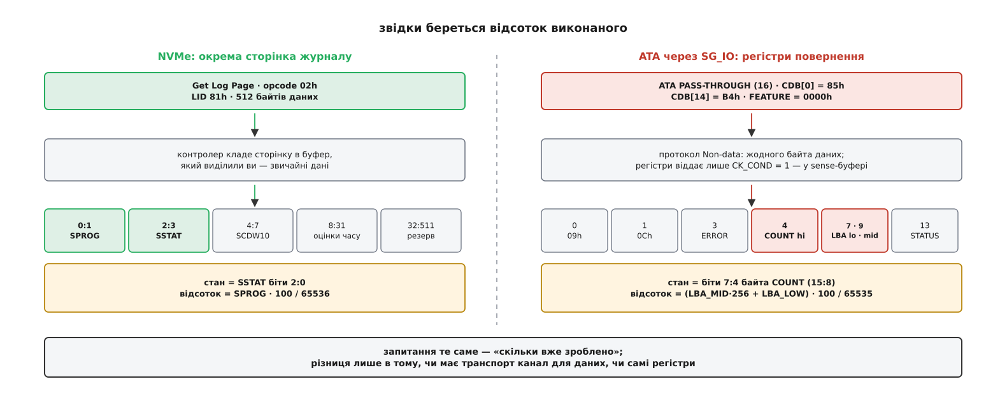

# ⚙️ Санітизація власними руками: подати команду й дочекатися кінця

Нижче — робоча програма мовою C, яка робить те саме, що `nvme sanitize` і `hdparm --sanitize-status`, але без утиліт: питає носія, чи він узагалі вміє санітизацію, подає команду й показує відсоток виконаного. Дивитися на це варто через одну незручну властивість операції: у неї немає спостережного результату. Усе, що ви про неї знатимете, — це те, що доповіла прошивка, і код показує, звідки саме та доповідь береться й скільки в ній насправді інформації.

Мова тут не з любові до низького рівня — інших варіантів немає. Команда подається структурою, яку ядро копіює в контролер майже дослівно, а відповідь приходить набором полів із фіксованими зсувами. Будь-яка обгортка над цим — це той самий код, лише з чужими іменами.

## Три кроки, і жоден не можна поміняти місцями

Спершу треба **запитати, чи пристрій уміє потрібний різновид**. Це не ввічливість. Команда з непідтримуваною дією повертає статус «Invalid Field in Command» — рівно той самий, який ви дістанете, склавши поле з помилкою. Ззовні ці два випадки не розрізнити, а розібратися потім не вийде: між «команда пішла» й «даних більше немає» паузи не передбачено. Перевірка перед поданням — єдине місце, де помилка ще безкоштовна.

Далі — **подати команду**. Вона повертається одразу, і підтверджує не стирання, а те, що підсистема ввійшла в стан санітизації.

І нарешті — **питати про поступ окремою командою**, бо перша нічого не чекала.

## Крок перший: чи вміє

Здатність носія оголошена в Identify Controller — у полі SANICAP за зсувом 328 від початку чотирикілобайтної структури. Три молодші біти означають, відповідно, крипто-стирання, блокове стирання й перезапис.

```c
#define _GNU_SOURCE
#include <endian.h>
#include <errno.h>
#include <fcntl.h>
#include <linux/nvme_ioctl.h>
#include <stdint.h>
#include <stdio.h>
#include <string.h>
#include <sys/ioctl.h>
#include <unistd.h>

#define NVME_ADMIN_GET_LOG   0x02
#define NVME_ADMIN_IDENTIFY  0x06
#define NVME_ADMIN_SANITIZE  0x84

/* Від'ємне — ядро не пустило (errno). Додатне — статус від самого контролера. */
static int admin(int fd, struct nvme_passthru_cmd *c)
{
    int rc = ioctl(fd, NVME_IOCTL_ADMIN_CMD, c);
    return rc < 0 ? -errno : rc;
}

static int read_sanicap(int fd, uint32_t *sanicap)
{
    uint8_t id[4096] = {0};
    struct nvme_passthru_cmd c = {
        .opcode     = NVME_ADMIN_IDENTIFY,
        .addr       = (uint64_t)(uintptr_t)id,
        .data_len   = sizeof id,
        .cdw10      = 1,              /* CNS = 1: Identify Controller */
        .timeout_ms = 15000,
    };
    int rc = admin(fd, &c);
    if (rc) return rc;

    uint32_t le;
    memcpy(&le, id + 328, 4);         /* SANICAP — байти 331:328 */
    *sanicap = le32toh(le);           /* дані від контролера — little-endian */
    return 0;
}
```

Зверніть увагу на дві різні домовленості про порядок байтів у одній структурі. Поля `cdwN` ядро приймає в порядку хоста й перекладає саме — ви кладете туди звичайне число. А от **буфер даних** приходить просто з дроту, як його виклав контролер, тобто в little-endian, і на машині з іншим порядком байтів `le32toh` перестане бути тотожністю. Плутанина тут дає не аварію, а тихо неправильні числа.

## Крок другий: подати команду

Уся команда вміщається в один CDW10. Дія — в бітах 2:0: `2` — блокове стирання, `3` — перезапис, `4` — крипто-стирання (`1` — вихід із режиму помилки, окрема історія). Біт 3 (AUSE) дозволяє пристроєві вийти зі стану санітизації, не довівши її до кінця; біти 7:4 — кількість проходів перезапису, біт 8 — інверсія візерунка між проходами, біт 9 (NODAS) — заборона звільняти логічні блоки після завершення. CDW11 несе сам візерунок перезапису.

```c
static int sanitize_start(int fd, unsigned sanact, int no_dealloc)
{
    uint32_t cdw10 = (sanact & 0x7)                        /* SANACT */
                   | (0u << 3)                             /* AUSE = 0 */
                   | (0u << 4)                             /* OWPASS */
                   | (0u << 8)                             /* OIPBP */
                   | ((uint32_t)(no_dealloc != 0) << 9);   /* NODAS */

    struct nvme_passthru_cmd c = {
        .opcode     = NVME_ADMIN_SANITIZE,
        .cdw10      = cdw10,
        .cdw11      = 0,             /* OVRPAT — візерунок для перезапису */
        .timeout_ms = 60000,
    };
    return admin(fd, &c);
}
```

`timeout_ms` тут стосується самої команди, а не операції. Шістдесят секунд — це запас на те, щоб контролер прийняв прохання; сама санітизація може тривати години й до цього таймауту жодного стосунку не має.

Додатне значення, повернуте `admin()`, — це поле Status із черги завершення, і читати його треба двома частинами: біти 7:0 — код помилки, біти 10:8 — тип коду. Тип `0` означає загальні коди, і саме там живе `0x02` — той самий «Invalid Field in Command», через який усе починалося з перевірки SANICAP. Тип `1` — коди, специфічні для команди. Одне число `2` у виводі без цього розбору не означає нічого: у різних типах воно позначає різні речі.

## Крок третій: відсоток

Поступ живе в окремій сторінці журналу з ідентифікатором 81h. Її беруть звичайною Get Log Page: молодший байт CDW10 — номер сторінки, старша половина — розмір у подвійних словах **мінус одиниця** (поле лічить від нуля, і забути цю одиницю — найпоширеніша помилка на цьому місці).

```c
struct sanitize_log {            /* сторінка журналу 81h, рівно 512 байтів */
    uint16_t sprog;              /* чисельник дробу зі знаменником 65536 */
    uint16_t sstat;              /* 2:0 — стан, 7:3 — зроблені проходи, 8 — GDE */
    uint32_t scdw10;             /* CDW10 команди, що почала операцію */
    uint32_t etfo, etfbe, etfce; /* оцінки часу, секунди */
    uint32_t etfownd, etfbewnd, etfcewnd;
    uint8_t  rsvd[480];
};

static int read_sanitize_log(int fd, struct sanitize_log *out)
{
    uint32_t numd = sizeof *out / 4 - 1;    /* 127, а не 128 */
    struct nvme_passthru_cmd c = {
        .opcode     = NVME_ADMIN_GET_LOG,
        .nsid       = 0xffffffff,
        .addr       = (uint64_t)(uintptr_t)out,
        .data_len   = sizeof *out,
        .cdw10      = 0x81 | (numd << 16),  /* LID | NUMDL */
        .timeout_ms = 15000,
    };
    return admin(fd, &c);
}

static const char *state_name(unsigned s)
{
    switch (s) {
    case 0: return "ніколи не санітизували";
    case 1: return "завершено успішно";
    case 2: return "триває";
    case 3: return "завершено з помилкою";
    case 4: return "успішно, блоки не звільнено";
    default: return "невідомий стан";
    }
}

static int watch(int fd)
{
    for (;;) {
        struct sanitize_log lg;
        int rc = read_sanitize_log(fd, &lg);
        if (rc) return rc;

        unsigned sstat = le16toh(lg.sstat);
        unsigned state = sstat & 0x7;

        if (state != 2) {
            printf("\n%s · проходів %u · уся медіа стерта: %s\n",
                   state_name(state), (sstat >> 3) & 0x1f,
                   (sstat & 0x100) ? "так" : "ні");
            return (state == 1 || state == 4) ? 0 : -1;
        }
        /* +32768 — округлення до найближчого, а не вниз */
        printf("\rтриває: %3u %%",
               (le16toh(lg.sprog) * 100u + 32768u) / 65536u);
        fflush(stdout);
        sleep(1);
    }
}
```

SPROG — не відсоток і не байти, а чисельник дробу зі сталим знаменником 65536. Знаменник вибрано степенем двійки навмисно: прошивці не потрібен ділильник, вона просто зсуває. Розбирати SPROG варто лише тоді, коли стан дорівнює двом; в усіх інших станах його вміст нічого не означає.

Біт 8 (Global Data Erased) — окремо цінний: він каже, що на носії немає жодних даних користувача, записаних до останньої санітизації. Це найближче до розписки, що прошивка взагалі видає.

Три поля `etf*` у тій самій сторінці — оцінка часу в секундах на кожен зі способів: перезапис у шістнадцять проходів, блокове стирання, крипто-стирання. Читати їх можна **до** подання команди, і саме тому вони корисні: це єдиний спосіб дізнатися заздалегідь, чи операція займе секунди, чи півдоби. Два значення тут особливі — нуль і `0xFFFFFFFF`: обидва означають, що оцінки пристрій не дає. Наступні три поля з суфіксом `wnd` дають ті самі оцінки для випадку, коли ввімкнено NODAS і прошивці доводиться робити додаткову роботу над медіа.

Лишається зібрати все докупи.

```c
int main(int argc, char **argv)
{
    const char *dev = argc > 1 ? argv[1] : "/dev/nvme0";
    int fd = open(dev, O_RDONLY);          /* вузол контролера, не простору імен */
    if (fd < 0) { perror(dev); return 1; }

    uint32_t sanicap;
    int rc = read_sanicap(fd, &sanicap);
    if (rc) { fprintf(stderr, "Identify не вдався: %d\n", rc); return 1; }

    if (!(sanicap & 0x2)) {
        fprintf(stderr, "блокового стирання немає (SANICAP = 0x%08x)\n", sanicap);
        return 1;
    }
    rc = sanitize_start(fd, 2 /* block erase */, 0);
    if (rc) { fprintf(stderr, "Sanitize відхилено: %d\n", rc); return 1; }

    return watch(fd) ? 1 : 0;
}
```

## Те саме для ATA: відповідь у регістрах

На SATA-диску тієї самої програми не вийде — у ATA немає ані адміністративних команд, ані журналів такого штибу. Команда SANITIZE DEVICE (код B4h) приходить туди [наскрізним каналом](topic:sys-unix/scsi-generic-passthrough): процес складає готовий блок SCSI-команди сам, а ядро передає його драйверові запитом `SG_IO`, майже не читаючи, разом із буфером під відповідь. Усередині того блока лежить ATA PASS-THROUGH (16), яку прошарок SAT розгортає назад в ATA. Підкоманду вибирає поле FEATURE: 0011h — крипто-скремблювання, 0012h — блокове стирання, 0014h — перезапис, 0000h — запит стану. Руйнівні підкоманди ще й вимагають ключа в полі LBA — чотирьох байтів, що читаються як `BkEr`, `Cryp` або `OW`. Це запобіжник проти команди, зібраної випадково: сміття в полі LBA дає відмову, а не стирання.

Але цікаве починається з відповіді. SANITIZE STATUS EXT не передає **жодного байта даних** — це команда протоколу Non-data, і поступ вона лишає в регістрах пристрою. Регістри ж SCSI-транспорт назовні не показує: він знає лише «команда вдалася / не вдалася». Тому SAT-прошарок має окремий гачок — біт CK_COND у CDB. Виставлений, він змушує транспорт удавати помилку навіть при успіху, аби мати привід повернути sense-буфер, а в ньому — дескриптор 09h із копією регістрів.

```c
#include <scsi/sg.h>

/* progress — частка від 0xFFFF; flags — байт стану (біти 7:4) */
static int ata_sanitize_status(int fd, unsigned *progress, unsigned *flags)
{
    uint8_t cdb[16] = {0}, sense[64] = {0};
    sg_io_hdr_t io;

    cdb[0]  = 0x85;             /* ATA PASS-THROUGH (16) */
    cdb[1]  = (3 << 1) | 1;     /* PROTOCOL = 3 (Non-data), EXTEND = 1 */
    cdb[2]  = 0x20;             /* CK_COND = 1, T_LENGTH = 0 */
    cdb[4]  = 0x00;             /* FEATURE (7:0) = SANITIZE STATUS EXT */
    cdb[14] = 0xb4;             /* COMMAND = SANITIZE DEVICE */

    memset(&io, 0, sizeof io);
    io.interface_id    = 'S';
    io.dxfer_direction = SG_DXFER_NONE;
    io.cmdp = cdb;   io.cmd_len   = sizeof cdb;
    io.sbp  = sense; io.mx_sb_len = sizeof sense;
    io.timeout = 10000;

    if (ioctl(fd, SG_IO, &io) < 0) return -errno;

    unsigned code = sense[0] & 0x7f;
    if (code != 0x72 && code != 0x73) return -EPROTO;  /* потрібен descriptor-формат */

    unsigned end = 8 + sense[7];
    if (end > sizeof sense) end = sizeof sense;
    for (unsigned i = 8; i + 13 < end; i += sense[i + 1] + 2) {
        if (sense[i] != 0x09) continue;                /* ATA Status Return */
        const uint8_t *d = sense + i;
        *flags    = d[4];                              /* COUNT (15:8) */
        *progress = ((unsigned)d[9] << 8) | d[7];      /* LBA_MID : LBA_LOW */
        return 0;
    }
    return -ENOENT;
}
```

У байті прапорців біт 7 означає, що остання операція завершилася без помилки, біт 6 — що операція триває, біт 5 — що пристрій у замороженому стані, біт 4 — що заборону на замороження встановлено. Відсоток рахують від 0xFFFF: `(100 * (progress + 1)) / 0xFFFF`, і повний 0xFFFF читають як сто.



*Питання однакове; різниця лише в тому, чи має транспорт канал для даних, чи саму лише пару регістрів.*

## Пастки

**Права — різні на двох дорогах.** Адміністративна команда NVMe до вузла контролера вимагає `CAP_SYS_ADMIN`: у ядрі шлях без простору імен веде просто в `capable(CAP_SYS_ADMIN)`. Запит `SG_IO` натомість перевіряє `CAP_SYS_RAWIO` — у нього є білий список нешкідливих команд, і ATA PASS-THROUGH туди не входить. Плутати їх не варто: набору [можливостей](topic:sys-unix/capabilities), якого вистачає для одного носія, для сусіднього забракне.

**Не той файл.** Відкривати треба `/dev/nvme0` — керуючий вузол контролера, а не `/dev/nvme0n1`, який є простором імен. Санітизація діє на цілу підсистему, тому й адресується контролерові. Пастка тут підступніша, ніж здається: розбір [ioctl](topic:sys-unix/ioctl-interface) упізнає адміністративну команду й на вузлі простору імен — і переадресовує її тому самому контролерові. Помилки ви не побачите, а операція однаково накриє всі простори імен, а не той, чий файл відкрито. Відкривати вузол контролера варто не тому, що інакше не спрацює, а тому, що лише він чесно називає те, на що команда діє.

**Ядро вас не страхує.** Воно не знає, що носій зараз санітизують, і не завадить примонтованій файловій системі писати в нього далі. Відмонтувати, розібрати dm- і RAID-шари, скинути [кеш сторінок](topic:sys-unix/page-cache-durability) — усе це на вас. Найгидкіше в цьому те, що система не зламається одразу: вона працюватиме з кешу ще довго після того, як під нею вже нічого немає.

**Невдача не минає сама.** Стан `3` у SSTAT — це не просто повідомлення про помилку, а режим, у якому підсистема застрягла: доки з нього не вийти, вона відмовляє на всі команди вводу-виводу. Виводить звідти єдина річ — та сама команда Sanitize із SANACT `1` (Exit Failure Mode). Тобто програма, яка вміє тільки запускати санітизацію, здатна лишити носій у стані, з якого сама ж його не витягне; обробити стан `3` — не ввічливість до користувача, а умова того, що диск узагалі знову запрацює.

**Живлення.** Вимкнути машину посеред операції — не спосіб її скасувати. Підсистема запам'ятала стан і після ввімкнення продовжить із того ж місця, а до кінця не віддасть жодного байта даних користувача. Тому програму можна спокійно вбити: перезапустивши, ви побачите той самий журнал і той самий відсоток, що зростає.

**І головне: не питайте статусу читанням блоків.** Спокуса очевидна — прочитати перший мегабайт і подивитися, чи там нулі. Не спрацює двічі. Поки операція триває, контролер відповідає на команди вводу-виводу статусом 1Dh «Sanitize In Progress» — читання просто не буде. А коли вона завершиться, читання поверне нулі, які видає сам контролер, побачивши в таблиці порожнє місце; фізичних сторінок ця відповідь не бачила. Єдине джерело відомостей про стан операції — журнал, тобто заява прошивки про саму себе.
