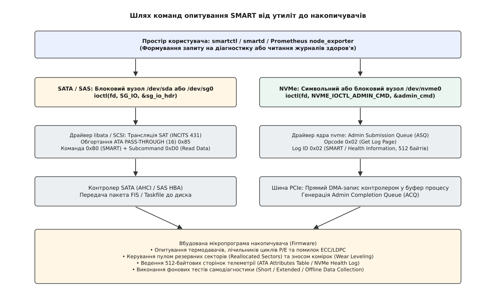
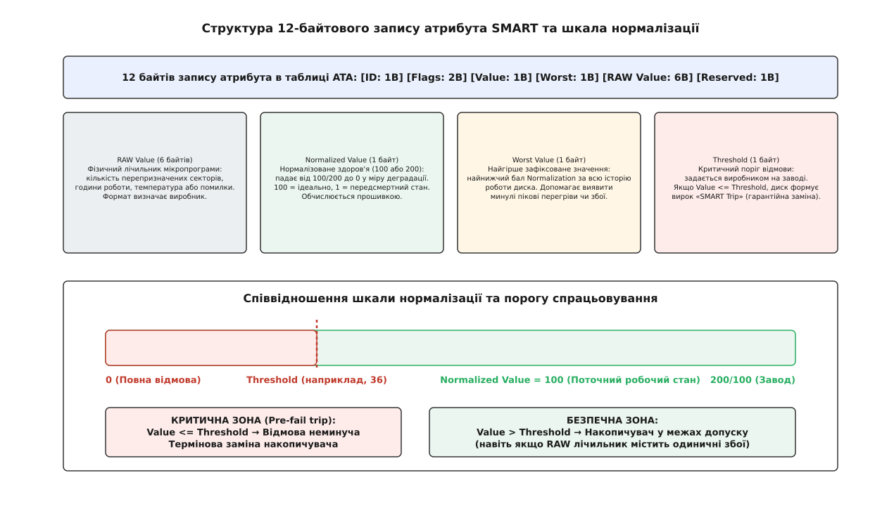
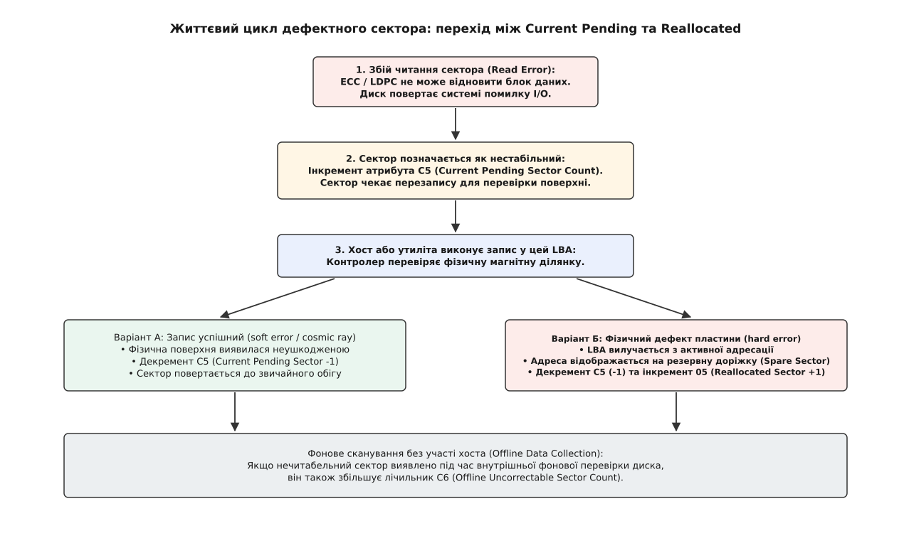
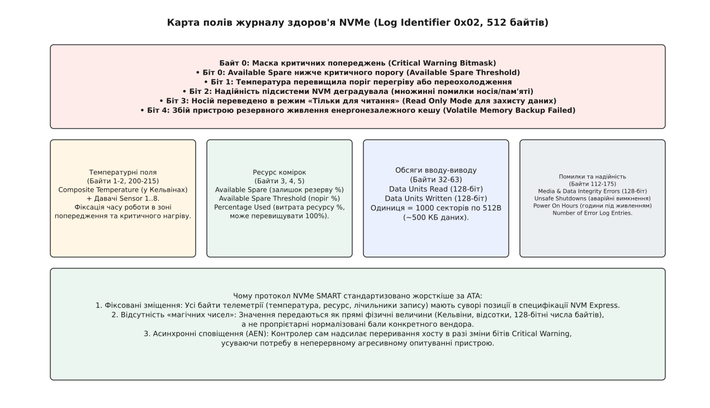

# SMART: що носій знає про власне здоров'я і як це прочитати

<preknowlist>
- [Блоковий пристрій: сектори, блоки й черга запитів](topic:sys-unix/block-device-model) — накопичувач надає ядру лінійний масив адресованих блоків, а операції вводу-виводу проходять крізь планувальник запитів.
- [Файл пристрою: символьний і блоковий](topic:sys-unix/device-file-model) — вузли в `/dev` слугують точками входу до драйверів, а не прямим доступом до внутрішнього стану апаратного контролера.
- [Канал керування до драйвера: ioctl](topic:sys-unix/ioctl-interface) — механізм передачі спеціальних інструкцій керування і структур повз стандартні виклики `read` та `write`.
- [Наскрізні команди до пристрою: SG_IO, ATA passthrough](topic:sys-unix/scsi-generic-passthrough) — як передати сформований командний пакет безпосередньо залізу без втручання блокового шару ядра.
- [Драйвер libata та переклад SAT](topic:sys-unix/libata) — шар трансляції між командами SCSI та апаратними регістрами SATA Taskfile.
- [Підсистема NVMe у Linux](topic:sys-unix/nvme-in-linux) — архітектура черг підпорядкування (Submission Queue) та завершення (Completion Queue) для зв'язку з енергонезалежною пам'яттю.
</preknowlist>

Під час нічного резервного копіювання база даних раптово отримує помилку введення-виведення `EIO`, транзакційний лог блокується, а масив RAID починає болісну процедуру аварійного відновлення на резервний диск. Для операційної системи ця подія виглядає як раптовий збій читання окремого сектора. Проте з погляду фізики накопичувача катастрофа дозрівала тижнями: мікропрограма диска зафіксувала сотні повторних спроб позиціювання магнітної голівки, коректор LDPC багаторазово вичерпував свій математичний бюджет на виправлення бітових помилок, а вільний пул резервних комірок флеш-пам'яті виснажився майже до нуля.

Накопичувач — це не пасивний масив комірок чи магнітних доменів, а автономна обчислювальна система з власним багатоядерним процесором, оперативною пам'яттю та складною мікропрограмою (*firmware*). Ця мікропрограма безупинно збирає внутрішню телеметрію: температуру кристалів, рівні зносу діелектрика, дрейф швидкості обертання шпинделя та статистику апаратних збоїв.

Комплекс технологій, що збирає цю телеметрію, аналізує динаміку зносу та прогнозує неминучу загибель пристрою, отримав назву **S.M.A.R.T.** (англ. *Self-Monitoring, Analysis and Reporting Technology* — технологія самомоніторингу, аналізу та звітування).

---

## Чому файлова система сліпа, а носій знає все

Традиційний стек введення-виведення Linux побудований на абстракції лінійного масиву логічних блоків (LBA, *Logical Block Addressing*). Коли ядро звертається до `/dev/sda` чи `/dev/nvme0n1`, воно передає драйверу запит «прочитай 8 секторів, починаючи з номера 1048576».

Блоковий шар оцінює накопичувач за бінарним принципом: операція або завершилася успішно (повернуто 0), або завершилася помилкою. Ядро не знає, якою ціною далося це читання:
- чи зчитався сектор із першої спроби за 0.5 мілісекунди;
- чи контролеру довелося повторити зчитування сім разів, змінюючи струм у котушці позиціонера голівки на мікроскопічні частки мікрона для точного вирівнювання на магнітний трек;
- чи відновлено дані за допомогою багаторівневих ітерацій апаратного коду корекції помилок (ECC / LDPC), коли кількість спотворених бітів ледь не перевищила поріг невідновності.

Якщо сектор усе ж вдалося розшифрувати, операційна система отримує чисті байти й вважає, що пристрій працює бездоганно. Але накопичувач уже знає, що на цій конкретній магнітній доріжці чи в цьому блоці NAND деградація досягла критичного рівня. Без спеціального протоколу опитування операційна система залишається в повній темряві аж до моменту, коли корекція остаточно спасує й сектор перетвориться на невідновну помилку (*Unrecoverable Read Error*, URE).

---

## Дороги телеметрії в Linux: від SG_IO до Admin Queue

Дані самодіагностики не зберігаються у звичайних секторах із даними користувача. Вони лежать у службовій зоні диска (*Service Area* на магнітних пластинах або виділених блоках SLC-пам'яті на SSD). Звичайні системні виклики `read()` та `write()` не мають адреси для читання цих даних. Щоб отримати телеметрію, процес простору користувача має звернутися до контролера спеціалізованими діагностичними командами.



*Діагностичні команди SMART надсилаються повз чергу звичайних блокових операцій: через SAT/SG_IO для дисків SATA або через чергу Admin Submission Queue для пристроїв NVMe.*

### 1. Інтерфейс SATA та шар трансляції SAT

Диски SATA підключаються до системи через підсистему ядра `libata`, яка представляє будь-який диск ATA як псевдо-SCSI пристрій. Тому процес (наприклад, утиліта `smartctl`) відкриває блоковий вузол `/dev/sda` або символьний вузол `/dev/sg0` і виконує системний виклик `ioctl` із командою `SG_IO`.

Усередині структури `sg_io_hdr` передається 16-байтовий командний блок SCSI (CDB) з кодом операції `0x85` (**ATA PASS-THROUGH 16**). Цей блок є «конвертом», у полях якого розміщено прямий командний кадр регістрів ATA (*Taskfile*):
- у регістр команди (*Command*) записується опкод `0xB0` (SMART);
- у регістр функцій (*Features*) поміщається код підкоманди: `0xD0` для завантаження 512-байтової таблиці значень атрибутів (`SMART READ DATA`), `0xD1` для читання порогів відмови (`SMART READ THRESHOLDS`) або `0xDA` для швидкої перевірки статусу (`SMART RETURN STATUS`);
- у регістри циліндрів записуються магічні сигнатури `LBA Mid = 0x4F` та `LBA High = 0xC2`.

Драйвер `libata` розгортає цей конверт і формує апаратний пакет FIS (H2D *Register Device-to-Host Frame Information Structure*) контролера AHCI. Контролер накопичувача зчитує байти з мікрокоду й повертає 512-байтовий блок даних прямо у виділений буфер пам'яті процесу.

Коли виконується команда перевірки стану `SMART RETURN STATUS` (`0xDA`), передача 512 байтів не відбувається. Замість цього контролер диска перевіряє свої внутрішні таблиці: якщо жоден атрибут не перетнув критичного порогу, у регістрах залишаються значення `LBA Mid = 0x4F` та `LBA High = 0xC2`. Якщо ж накопичувач зафіксував перетин порогу надійності, мікропрограма змінює ці регістри на сигнатуру відмови: `LBA Mid = 0xF4` та `LBA High = 0x2C`. Драйвер `libata` перехоплює ці байти й перетворює їх на статус SCSI `CHECK CONDITION` із додатковим сенс-кодом ASC/ASCQ `0x5D / 0x00` (*Failure Prediction Threshold Exceeded*).

### 2. Прямий інтерфейс NVMe Admin Queue

Накопичувачі стандарту NVM Express не використовують емуляцію SCSI чи застарілий Taskfile ATA. Простір користувача надсилає запит системним викликом `ioctl(fd, NVME_IOCTL_ADMIN_CMD)` безпосередньо у вузол контролера `/dev/nvme0` або простору імен `/dev/nvme0n1`.

Ядро отримує структуру `struct nvme_admin_cmd` і поміщає 64-байтовий запис у чергу адміністрування **Admin Submission Queue (ASQ)**:
- код операції `Opcode = 0x02` (**Get Log Page**);
- ідентифікатор сторінки журналу `Log Identifier = 0x02` (**SMART / Health Information Log**);
- адреса та розмір буфера хоста (512 байтів).

Контролер NVMe через прямий доступ до пам'яті (DMA) заповнює цей буфер стандартизованою структурою телеметрії та виставляє запис у чергу завершення **Admin Completion Queue (ACQ)**, генеруючи переривання MSI-X.

Повний бінарний опис структур, регістрів ATA та сторінок журналів NVMe/SCSI наведено у [довіднику протоколів SMART](topic:sf-data/smart-self-monitoring/api-smart-protocols.md).

> 🔧 **Навіщо це.** Якщо ви розробляєте власну службу моніторингу сховища, вам не потрібно парсити текстовий вивід консольних утиліт. Виклик `ioctl` із прямим зчитуванням 512 байтів журналу виконується за десятки мікросекунд без запуску сторонніх інтерпретаторів чи форків процесів.

---

## Чотири числа одного показника: анатомія атрибута ATA SMART

Коли ви запускаєте аналіз диска SATA, перед вами з'являється таблиця атрибутів. Кожен запис атрибута займає рівно 12 байтів у службовому секторі й описується чотирма ключовими числами: **ID**, **Value (Current)**, **Worst**, **Threshold** та **RAW**.



*Анатомія 12-байтового запису атрибута та принцип співвідношення нормалізованого балу з порогом відмови.*

Розуміння того, як ці числа взаємодіють між собою, позбавляє від найпоширеніших помилок під час діагностики.

```
ID# ATTRIBUTE_NAME          FLAG     VALUE WORST THRESH TYPE      RAW_VALUE
  5 Reallocated_Sector_Ct   0x0033   100   100   036    Pre-fail  0
  9 Power_On_Hours          0x0032   098   098   000    Old_age   14520
194 Temperature_Celsius     0x0022   064   052   000    Old_age   36 (Min/Max 18/48)
```

### 1. RAW Value (Необроблене фізичне значення)
Це сирі 48-бітні лічильники, які веде мікропрограма диска. Для атрибута `Power_On_Hours` це кількість відпрацьованих годин (14520). Для `Temperature_Celsius` — прямі показники терморезистора (36 °C). Для `Reallocated_Sector_Ct` — точна кількість секторів, виведених з експлуатації.

**Пастка RAW-значень:** стандарт ATA не регламентує єдиний формат для поля RAW. Наприклад, у накопичувачах Seagate та Fujitsu атрибут `01 Raw Read Error Rate` містить не абсолютну кількість помилок, а упаковану 48-бітну структуру, де старші 16 бітів є лічильником помилок, а молодші 32 біти — загальною кількістю прочитаних секторів. Утиліта, яка наївно інтерпретує це 48-бітне число як єдине ціле, покаже астрономічну цифру на кшталт `1844674407370`, що помилково лякає адміністратора. У дисках Western Digital або Hitachi те саме поле є простим лічильником збоїв.

### 2. Normalized Value (Нормалізований бал здоров'я)
Оскільки сирі значення у різних виробників відрізняються, мікропрограма перетворює RAW-лічильник на уніфіковану шкалу надійності — зазвичай від 100 (або 200/253) до 1.

Шкала працює за принципом зворотного відліку:
- **100 (або 200):** ідеальний заводський стан нового накопичувача;
- **100 → 50:** надійність компонента поступово деградує за поліноміальною або лінійною кривою зносу;
- **1:** передсмертний стан компонента.

Для кожного атрибута алгоритм нормалізації зашитий у мікропрограму. Наприклад, для температури нормалізація розраховується за формулою:

```
Normalized_Temp = 100 - (Current_Temp_C - Target_Temp_C) · Коефіцієнт
```

Один перепризначений сектор може знизити нормалізоване значення атрибута `05` зі 100 до 95 балів, а двадцять перепризначень — опустити його до 40.

### 3. Worst Value (Найгірший зафіксований бал)
Це найнижче значення нормалізованого балу, якого коли-небудь досягав цей накопичувач за всю історію своєї роботи. Якщо диск колись зазнав критичного перегріву до 65 °C, нормалізований бал температури міг просісти зі 100 до 35. Навіть після того, як диск охолонув і поточне `Value` повернулося до 70, у полі `Worst` назавжди залишиться 35. Це дозволяє аудиторам виявляти пристрої з прихованими тепловими чи механічними травмами.

### 4. Threshold (Критичний поріг відмови)
Поріг — це мінімально допустимий бал нормалізованого здоров'я, визначений інженерами виробника. Якщо поточне значення опускається до порогу або нижче (`Value <= Threshold`), контролер накопичувача офіційно фіксує подію **SMART Trip** (перетин порогу надійності).

Коли диск досягає цього стану, він повідомляє операційній системі про гарантійний випадок відмови, сигналізуючи, що накопичувач має бути негайно виведений з експлуатації та замінений.

### Класифікація: Pre-fail проти Old-age

Усі атрибути поділяються прапорцем у заголовку (біт 0) на два класи:
- **Pre-fail (Критичний індикатор надійності):** якщо такий атрибут перетинає поріг `Threshold`, виробник гарантує, що диск зазнає катастрофічної повної відмови впродовж найближчих 24 годин. До них належать лічильники перепризначених секторів, збої позиціювання та помилки внутрішнього тракту пам'яті.
- **Old-age (Індикатор природного зносу):** атрибути, які фіксують нормальний життєвий цикл пристрою (години роботи `Power-On Hours`, цикли розкручування шпинделя чи паркування голівок `Load/Unload Cycle Count`). Перетин порогу тут означає вичерпання розрахункового ресурсу, але не обов'язкову раптову аварію.

---

## П'ять смертних гріхів магнітного диска (HDD)

Серед десятків атрибутів магнітних дисків існує п'ять критичних маркерів, поява яких у сирому полі `RAW_VALUE` свідчить про початок незворотної деградації механіки або магнітної поверхні.



*Еволюція дефектного сектора: від первинного збою читання до статусу Current Pending і наступного перепризначення (Reallocation).*

### 1. Атрибут 05 (0x05) — Reallocated Sectors Count
Під час виробництва магнітного диска на внутрішніх та зовнішніх радіусах пластин резервується певна кількість запасних секторів (*Spare Sectors*, зазвичай від кількох сотень до кількох тисяч).

Коли диск натикається на фізично пошкоджений сектор, контролер вилучає його адресу з активної трансляції й натомість спрямовує запити до сектора з резервної доріжки. Цей процес називається **перепризначенням** (*Reallocation*).

Зростання лічильника `05` означає, що на поверхні пластини руйнується магнітний шар або накопичуються мікроскопічні частинки відлущеного феромагнетика. Навіть один перепризначений сектор є приводом для пильного нагляду, а стабільне збільшення цього лічильника вимагає негайної заміни диска.

### 2. Атрибут 0A (0x0A) — Spin Retry Count
Лічильник фіксує кількість повторних спроб розкручування шпиндельного двигуна до номінальної швидкості.

За нормальних умов шпиндель виходить на робочі оберти за одну спробу. Якщо з першого разу двигун не зміг розігнати пластини, це вказує на одну з двох проблем:
- деградацію підшипника рідинного тертя (FDB, *Fluid Dynamic Bearing*) або загустіння мастила внаслідок перегріву;
- просідання напруги по лінії 12V від блоку живлення під час пікового пускового струму.

Якщо `Spin Retry Count` зростає — диск невдовзі не зможе запуститися після чергового перезавантаження сервера.

### 3. Атрибут B8 (0xB8) — End-to-End Error (IOEDC)
Сучасний жорсткий диск містить вбудований буфер ОЗП обсягом від 64 до 512 МБ, у якому кешуються дані перед записом на пластини. Під час проходження даних каналом зв'язку `Хост → Контролер диска → Кеш DRAM → Тракт запису голівки` обчислюються контрольні суми паритету (EDC/ECC).

Атрибут `B8` фіксує кількість випадків, коли дані всередині внутрішнього буфера накопичувача зазнали спотворення до того, як потрапили на магнітний носій. Це вирок не магнітним пластинам, а кремнію: збій ліній зв'язку всередині чипа SoC або деградація комірок внутрішньої DRAM диска.

### 4. Атрибут C5 (0xC5) — Current Pending Sector Count
Це найважливіший оперативний атрибут. Він показує кількість «нестабільних» секторів, які під час читання дали невідновну помилку корекції ECC і зараз очікують на повторне тестування.

**Чому сектор «зависає» (Pending):** накопичувач не може перепризначити сектор у момент збою читання, тому що дані втрачено, і контролер не знає, що саме треба записати в резервний блок. Диск ставить мітку на цей LBA і чекає, поки операційна система спробує записати туди нові дані.

Під час наступного запису в цей сектор контролер виконує тест надійності:
1. Якщо сектор вдало записується й проходить верифікацію читанням — контролер вважає, що попередній збій був викликаний випадковим зовнішнім фактором (наприклад, вібрацією або стрибком живлення). Сектор повертається до роботи, а лічильник `C5` зменшується на 1.
2. Якщо запис провалюється — сектор остаточно визнається дефектним, переноситься на резервну доріжку, лічильник `C5` зменшується на 1, а лічильник `05 (Reallocated)` збільшується на 1.

### 5. Атрибут C6 (0xC6) — Offline Uncorrectable Sector Count
Лічильник показує кількість невиправних дефектних секторів, які були виявлені автономним фоновим скануванням диска (*Offline Data Collection*), коли хост не виконував операцій введення-виведення.

Зростання цього лічильника свідчить про те, що руйнування поверхні відбувається просто під час обертання пластин у фоні, навіть без активного навантаження.

Про те, як інженери IBM та Compaq створювали ці метрики у 1990-х роках, читайте в [історичному нарисі про народження SMART](topic:sf-data/smart-self-monitoring/hist-from-predict-to-smart.md).

---

## Фізика зносу SSD та журнал здоров'я NVMe

Твердотільні накопичувачі на основі пам'яті NAND позбавлені рухомих деталей, але мають фундаментальне фізичне обмеження: деградацію тунельного діелектрика комірок під час циклів запису та стирання (**P/E Cycles**, *Program/Erase*).

Кожен запис у комірку вимагає подачі високої напруги (до 15–20 В) для проштовхування електронів крізь ізолюючий шар оксиду кремнію на плаваючий затвор або шар пастки заряду (*Charge Trap*). З часом у кристалічній решітці діелектрика утворюються мікротріщини та дефекти, ізоляція тоншає, і комірка втрачає здатність стабільно утримувати електричний заряд.

Крім того, через необхідність прати блоки розміром у кілька мегабайтів перед повторним записом 4-кілобайтових сторінок виникає ефект **підсилення запису** (WAF, *Write Amplification Factor*): контролер записує у фізичні комірки значно більше байтів, ніж передала операційна система.

```
WAF = (Обсяг даних, записаних у флеш-пам'ять NAND) ÷ (Обсяг даних, переданих хостом)
```

Для вирівнювання зносу мікропрограма накопичувача використовує алгоритми статичного та динамічного вирівнювання зносу (*Wear Leveling*). Статичний алгоритм періодично переносить незмінні «холодні» дані (наприклад, файли операційної системи) у зношені блоки, звільняючи менш зношені блоки для гарячих операцій перезапису.

### Критичні атрибути SATA SSD

У накопичувачах SATA SSD таблиця атрибутів адаптована під специфіку флеш-пам'яті:
- **E7 (0xE7) — SSD Life Left / Wear Range Delta:** нормалізований залишок ресурсу комірок у відсотках (від 100% до 0%).
- **E8 (0xE8) — Available Reserved Space:** стан пулу резервних блоків NAND. Коли під час прання блок перестає тримати заряд, він виводиться з експлуатації (*retires*), а замість нього береться блок із резерву. Якщо цей показник опускається нижче порогу, накопичувач вичерпав резерв і незабаром заблокує запис.
- **F1 (0xF1) — Total LBAs Written:** сумарна кількість секторів або гігабайтів, переданих хостом на запис. Дозволяє розрахувати реальне значення TBW (*Terabytes Written*) та порівняти його з гарантійним лімітом виробника.

### Анатомія NVMe Health Information Log (Log 0x02)

У протоколі NVMe застарілі 12-байтові атрибути замінено суворо типізованим журналом на 512 байтів.



*Структура полів сторінки NVMe SMART / Health Information Log (Log ID 0x02).*

Головним елементом швидкої діагностики NVMe є **байт 0 — Critical Warning**:

```
Біт 0: Available Spare нижче критичного порогу (Available Spare Threshold)
Біт 1: Температура перевищила поріг перегріву або опустилася нижче мінімуму
Біт 2: Надійність підсистеми NVM катастрофічно деградувала (множинні збої медіа)
Біт 3: Носій переведено в режим «Тільки для читання» (Read Only Mode)
Біт 4: Збій пристрою резервного живлення кешу (Power Loss Protection / Supercapacitor)
```

Якщо будь-який із цих бітів виставляється в `1`, контролер NVMe може згенерувати асинхронне сповіщення (AEN, *Asynchronous Event Notification*) операційній системі, змушуючи драйвер ядра зафіксувати подію в журналі `dmesg`.

Ключові поля телеметрії NVMe:
- **Available Spare (Байт 3):** відсоток залишкової резервної місткості NAND (від 100% до 0%).
- **Percentage Used (Байт 5):** відсоток спожитого ресурсу накопичувача за оцінкою виробника. Значення `100%` означає досягнення номінального гарантійного ресурсу TBW, але не означає негайну смерть пристрою: лічильник може продовжувати зростати до 150–200%, якщо комірки залишаються фізично справними та проходять верифікацію LDPC.
- **Data Units Read / Written (Байти 32–63):** 128-бітні лічильники обсягу вводу-виводу. Одиницею виміру є 1000 блоків по 512 байтів (рівно 512 000 байтів, приблизно 500 КБ). Щоб отримати обсяг у терабайтах, число множать на 512 000 і ділять на `10^12`.
- **Media and Data Integrity Errors (Байти 160–175):** кількість випадків, коли контролер виявив невідновні помилки цілісності даних (невідновний збій ECC або помилка контрольної суми CRC). На здоровому SSD це значення завжди дорівнює нулю.

---

## Автономне тестування: як змусити диск перевірити себе

Пасивне спостереження за лічильниками не завжди виявляє проблему, якщо до пошкодженого сектора ніхто не звертався. Щоб гарантувати цілісність даних, системний адміністратор може ініціювати внутрішні процедури самотестування накопичувача.

Команди тестування виконуються процесором самого диска автономно, практично не навантажуючи шину SATA/PCIe та центральний процесор сервера.

| Тип тесту | Тривалість | Що саме перевіряється | Вплив на продуктивність |
| :--- | :--- | :--- | :--- |
| **Short Self-Test** (`-t short`) | 1–2 хвилини | Електроніка контролера, внутрішня пам'ять DRAM/SRAM, позиціонер голівок, невеликий тестовий діапазон секторів. | Мінімальний, виконується паралельно з робочим навантаженням. |
| **Extended (Long)** (`-t long`) | 1–10 годин | Повна верифікація читанням кожного фізичного LBA від початку до кінця носія. | Може збільшувати затримки (latency) звичайних операцій читання/запису. |
| **Conveyance Test** (`-t conveyance`)| 2–5 хвилин | Пошук механічних пошкоджень, отриманих під час перевезення (деформація підвісу, зсув осі). | Мінімальний. |
| **Selective Test** (`-t select,N-M`) | Залежить від діапазону | Сканування конкретно вказаного діапазону секторів LBA (наприклад, навколо збійного сектора `C5`). | Залежить від розміру діапазону. |

Запуск тесту через утиліту `smartctl`:

```bash
# Запуск розширеного сканування всієї поверхні
smartctl -t long /dev/sdb

# Перевірка поточного прогресу тестування
smartctl -c /dev/sdb

# Перегляд журналу результатів самотестування
smartctl -l selftest /dev/sdb
```

Якщо під час розширеного тестування накопичувач натикається на нечитабельний сектор, тест негайно зупиняється зі статусом `Completed: read failure`, а в журналі фіксується точний номер збійного LBA:

```
# 1  Extended offline    Completed: read failure       90%      8421      104857600
```

Це дає адміністратору точну координату пошкодженого сектора, яку можна спробувати примусово перезаписати за допомогою утиліти `dd` (`dd if=/dev/zero of=/dev/sdb seek=104857600 count=1 bs=512 oflag=direct`), щоб змусити диск перепризначити проблемну ділянку.

---

## Практичний моніторинг: smartctl, smartd та автоматизація тривог

Для повсякденної роботи з технологією SMART у середовищі Linux використовується пакет **smartmontools**, який містить два основні інструменти: інтерактивну утиліту `smartctl` та фонову службу автоматичного моніторингу `smartd`.

### Основні сценарії використання smartctl

```bash
# Загальна інформація про пристрій (модель, серійний номер, версія прошивки)
smartctl -i /dev/sda

# Експрес-оцінка здоров'я (SMART Overall Health Assessment)
smartctl -H /dev/sda

# Вивід повної таблиці атрибутів (для SATA)
smartctl -A /dev/sda

# Детальний звіт про здоров'я накопичувача NVMe
smartctl -a /dev/nvme0

# Опитування диска SATA, підключеного через апаратний RAID-контролер MegaRAID
smartctl -d megaraid,0 -a /dev/sda

# Опитування диска в USB-кишені з мостом SAT
smartctl -d sat -a /dev/sdb
```

### Конфігурація фонового демона smartd

Служба `smartd` запускається як системний демон (`systemctl start smartd`) і періодично опитує всі накопичувачі системи згідно з правилами у файлі конфігурації `/etc/smartd.conf`.

Приклад бойової конфігурації `/etc/smartd.conf`:

```ini
# Автоматичне сканування всіх дисків із розширеним набором директив
DEVICESCAN -a \
  -o on \
  -S on \
  -n standby,q \
  -s (S/../.././02|L/../../6/03) \
  -W 4,45,55 \
  -R 5! -R 197! -R 198! \
  -m admin@infra.internal \
  -M exec /usr/local/bin/smart-alert.sh
```

Розшифрування директив:
- `-a` (*All*): увімкнути моніторинг усіх стандартних властивостей SMART.
- `-o on / -S on`: увімкнути автоматичне фонове оновлення атрибутів та автозбереження лічильників.
- `-n standby,q`: не будити диск, якщо він перебуває в режимі сну (*Standby*), щоб не витрачати енергію та ресурс механіки.
- `-s (S/../.././02|L/../../6/03)`: розклад автоматичного тестування: щодня о 02:00 запускати короткий тест (Short), а щосуботи о 03:00 — повний розширений тест (Long).
- `-W 4,45,55`: відстеження температури: надсилати попередження у разі стрибка температури на 4 °C за опитування, у разі досягнення 45 °C (Warning) або 55 °C (Critical).
- `-R 5! -R 197! -R 198!`: негайно надсилати тривогу в разі **будь-якого збільшення** сирих значень атрибутів `05` (Reallocated), `197/C5` (Pending) або `198/C6` (Offline Uncorrectable).
- `-m admin@infra.internal`: адреса електронної пошти для сповіщень.
- `-M exec /usr/local/bin/smart-alert.sh`: запуск кастомного скрипта обробки аварії.

Приклад обробника сповіщень `/usr/local/bin/smart-alert.sh`:

```bash
#!/usr/bin/env bash
set -euo pipefail

# Демон smartd передає змінні середовища:
# SMARTD_DEVICE — пристрій (/dev/sda)
# SMARTD_MESSAGE — текст повідомлення про помилку
# SMARTD_FAILTYPE — тип збою (EmailTest, Health, Attribute)

PAYLOAD=$(cat <<EOF
{
  "device": "${SMARTD_DEVICE}",
  "type": "${SMARTD_FAILTYPE}",
  "message": "${SMARTD_MESSAGE}",
  "timestamp": "$(date -Iseconds)"
}
EOF
)

# Відправка JSON-тривоги у внутрішній моніторинг (Alertmanager / Webhook)
curl -s -X POST -H "Content-Type: application/json" \
     -d "${PAYLOAD}" \
     http://alertmanager.internal:9093/api/v2/alerts || true
```

### Гаряча заміна дисків та багатошляховий доступ (Multipath)

У динамічних серверних середовищах носії можуть підключатися та відключатися під час роботи системи (*Hot-plug*). Підсистема керування пристроями Linux `udev` фіксує появу нових вузлів і може автоматично надсилати сигнал оновлення демону `smartd`:

```bash
# Правило udev для перезавантаження списку дисків smartd (/etc/udev/rules.d/99-smartd-reload.rules)
ACTION=="add|remove", SUBSYSTEM=="block", KERNEL=="sd[a-z]|nvme[0-9]n[0-9]", \
  RUN+="/usr/bin/systemctl try-reload-or-restart smartd.service"
```

Якщо накопичувачі корпоративного сховища SAN/SAS підключені через кілька надлишкових контролерів із використанням [DM-Multipath](topic:sys-unix/dm-multipath), звернення до агрегованого віртуального пристрою `/dev/mapper/mpathX` для опитування SMART є помилкою. Запити `SG_IO` необхідно надсилати до конкретних базових фізичних шляхів `/dev/sda` та `/dev/sdb`, що дозволяє відстежувати стан накопичувача незалежно від активного маршруту передачі даних.

Про те, як написати власний низькорівневий клієнт опитування SMART без використання `smartctl`, дивіться у [практичному проєкті на C та C++](topic:sf-data/smart-self-monitoring/proj-smart-reader.md).

---

## Межі передбачення: чому SMART не рятує від бекапів

Технологія SMART є незамінним інструментом раннього попередження, проте надмірна довіра до статусу `PASSED` створює небезпечну ілюзію повної захищеності.

Масштабні дослідження надійності накопичувачів, проведені компаніями **Google** (на вибірці з понад 100 000 дисків у 2007 році) та **Backblaze** (на квартальних звітах сотень тисяч дисків хмарного сховища), виявили стійку статистичну закономірність:

1. **Від 30% до 50% усіх дисків виходять із ладу раптово**, без жодного попереднього спрацьовування порогів SMART і без перетину критичних значень.
2. Раптові відмови найчастіше спричинені катастрофічним пробоєм силових кіл живлення, збоєм контролера на платі друкованого монтажу (PCB), електростатичним розрядом або миттєвим заклинюванням підшипника шпинделя. Жоден алгоритм телеметрії не може передбачити подію, яка розвивається за мілісекунди.
3. Проте, якщо критичні атрибути (`05 Reallocated`, `C5 Pending`, `B8 End-to-End`, `NVMe Media Errors`) починають зростати — річна інтенсивність відмов (AFR, *Annualized Failure Rate*) диска впродовж наступних 60 днів зростає у **39 разів** порівняно зі здоровими накопичувачами.

SMART працює за принципом одностороннього доказу:
- **Якщо SMART фіксує деградацію або перетин порогу — накопичувач точно вмирає.** Його необхідно вилучити з масиву й замінити без вагань.
- **Якщо SMART показує «Health Status: OK» — це не гарантує бездоганної роботи.** Це лише означає, що відомі сенсори поки що не зафіксували виходу параметрів за межі допуску.

Особливо небезпечними є приховані дефекти під час відновлення RAID-масивів (*RAID rebuild*). Коли один диск у масиві RAID 5 виходить із ладу, система починає неперервне читання всіх секторів решти дисків на максимальній швидкості. Це створює колосальне теплове й механічне навантаження, під час якого сплячі пошкоджені сектори `C5` перетворюються на невідновні помилки читання (URE), що призводить до краху всього масиву та повної втрати даних.

Тому інженерна дисципліна вимагає будувати надійність сховищ на трьох обов'язкових рівнях:
1. **Апаратна надмірність:** масиви RAID 6/10 або розподілені erasure coding кластери (Ceph, MinIO), здатні пережити одночасну загибель кількох носіїв.
2. **Безперервний моніторинг телеметрії:** регулярні короткі й довгі тести за розкладом у `smartd` із відстеженням динаміки лічильників та своєчасним видаленням підозрілих дисків до початку деградації масиву.
3. **Незмінні ізольовані резервні копії:** фізично відокремлені бекапи, створені за правилом 3-2-1, які залишаються неушкодженими навіть у разі одночасної загибелі всіх накопичувачів вузла.
