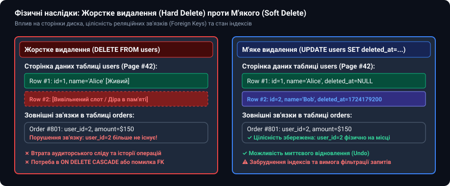
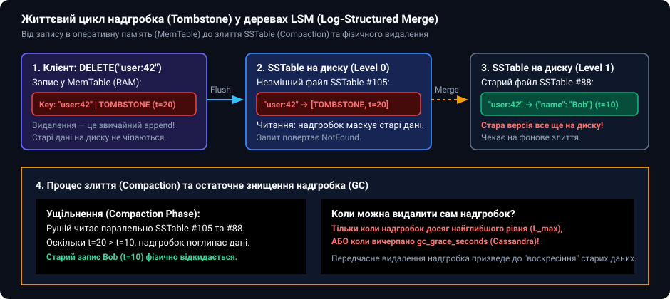
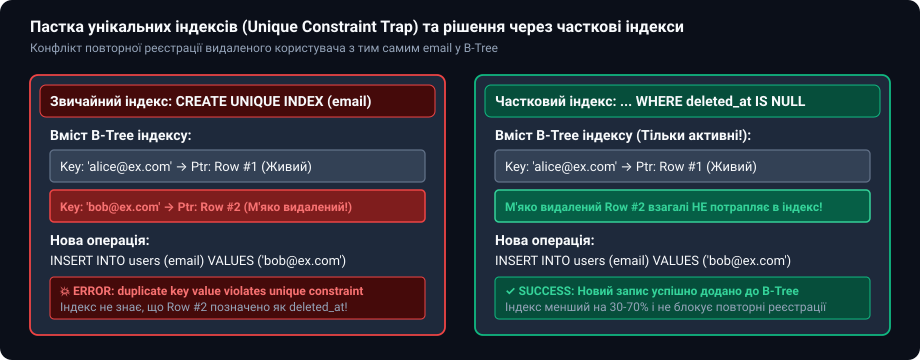
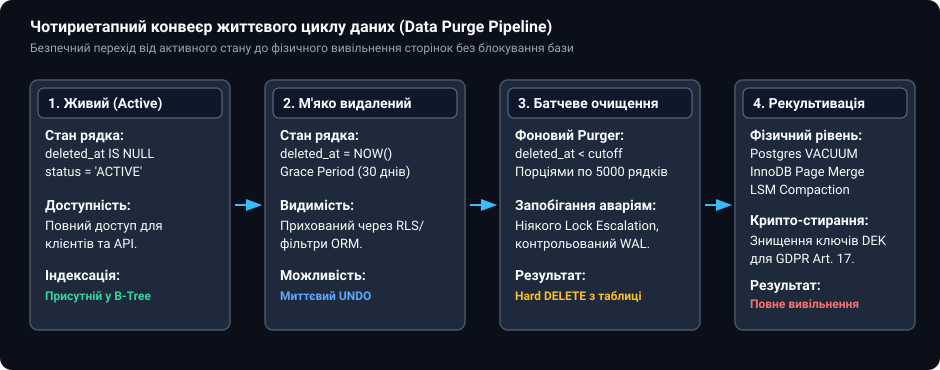

# 🪦 М'яке видалення, надгробки (Tombstones) та очищення даних

<preknowlist>
- [Реляційна модель і нормалізація як рішення](root:sf-data/relational-model) — реляційні зв'язки, зовнішні ключі та обмеження цілісності.
- [Індекси](root:sf-data/database-indexes) — влаштування B-Tree індексів, унікальні обмеження та вартість оновлення.
- [MVCC](root:sf-data/mvcc) — знімки транзакцій, версії кортежів та фізичне очищення застарілих даних.
- [Журнал попереднього запису (WAL)](root:sf-data/write-ahead-log) — принцип незмінного послідовного журналу операцій.
</preknowlist>

Коли оператор інтернет-магазину випадково натискає кнопку «Видалити обліковий запис» для клієнта з п'ятирічною історією покупок, класична реляційна команда `DELETE FROM users WHERE id = 42` створює одну з двох катастрофічних ситуацій. Якщо база даних сконфігурована з обмеженням зовнішнього ключа `ON DELETE RESTRICT`, операція аварійно переривається: СУБД відмовляється видаляти клієнта, на якого посилаються двісті фінансових накладних у таблиці `orders`. Якщо ж у схемі необачно увімкнено `ON DELETE CASCADE`, рушій разом із користувачем безповоротно знищує всі пов'язані замовлення, платежі, записи аудиту та податкову звітність за п'ять років, завдаючи непоправної фінансової шкоди.

Фізичне знищення даних (жорстке видалення, англ. *hard delete*) не залишає шансу на виправлення людської помилки, миттєво руйнує аудиторський слід і вимагає складного й тривалого відновлення з резервних копій.

Щоб розв'язати цю проблему, інженерія даних розробила дві фундаментальні парадигми: **м'яке видалення (англ. *soft delete*)** на рівні реляційного моделювання та **надгробки (англ. *tombstones*)** на рівні незмінних розподілених сховищ.


*Фізичні наслідки жорсткого та м'якого видалення: стан сторінок пам'яті, збереження реляційних зв'язків та індексні структури*

---

### Першопричина: конфлікт між незворотністю фізичного видалення та зв'язністю даних

У класичній реляційній теорії Едгара Кодда операція `DELETE` є математичним вилученням кортежу з відношення. На фізичному рівні сторінкового рушія (наприклад, InnoDB у MySQL або Heap у PostgreSQL) це означає звільнення слота на сторінці розміром 8 або 16 КБ та коригування списку вільних покажчиків сторінки.

Однак реальні бізнес-системи мають три фундаментальні властивості, які роблять негайне фізичне видалення неприпустимим:

1. **Історична зв'язність і збереження фінансового аудиту:** Податкові, медичні та банківські регуляції вимагають довічного або багаторічного зберігання первинних документів. Якщо рахунок виставлено клієнту «Боб», цей рахунок повинен посилатися на сутність «Боб» навіть після того, як Боб закрив свій обліковий запис. Заміна посилання на `NULL` позбавляє накладну контексту, а видалення накладної порушує баланс грошового гросбуху.
2. **Асинхронні бізнес-процеси та транзакційні скасування (Undo Windows):** Клієнт, який скасував підписку, має право відновити її протягом 30 днів зі збереженням усіх налаштувань. У разі фізичного видалення системі довелося б заново створювати сотні пов'язаних сутностей із генерацією нових первинних ключів, що порушує ідемпотентність зовнішніх інтеграцій.
3. **Незмінність журналів у розподілених сховищах:** У системах із послідовним записом (LSM-дерева, журнали Kafka, реплікація з багатьма майстрами) фізично неможливо «стерти» кілька байтів усередині вже записаного незмінного файлу на диску.

М'яке видалення перетворює деструктивну операцію `DELETE` на операцію `UPDATE`: фізичний запис залишається на дисковій сторінці, але позначається спеціальним маркером неактивності.

---

### Фізична анатомія сторінки та взаємодія м'якого видалення з MVCC

Щоб зрозуміти приховану ціну м'якого видалення, необхідно простежити, що відбувається всередині дискової сторінки реляційної СУБД.

У PostgreSQL кожен кортеж на сторінці містить системний заголовок `HeapTupleHeader` розміром 23 байти. Ключовими полями заголовка є `t_xmin` (номер транзакції, яка створила кортеж) та `t_xmax` (номер транзакції, яка змінила або видалила кортеж).

Коли виконується операція м'якого видалення:

```sql
UPDATE customers SET deleted_at = CURRENT_TIMESTAMP WHERE id = 42;
```

рушій СУБД **не модифікує наявні байти рядка на місці**. За законами багатоверсійного керування конкурентним доступом (MVCC) рушій виконує дві послідовні дії:

1. У поточному фізичному кортежі поле `t_xmax` заповнюється ідентифікатором поточної транзакції. Цей кортеж стає історичною версією, видимою лише старим паралельним транзакціям.
2. На вільній ділянці сторінки створюється **новий фізичний кортеж** із новим значенням `deleted_at`, де поле `t_xmin` дорівнює поточній транзакції, а `t_xmax = 0`.

#### Руйнування оптимізації Heap-Only Tuples (HOT)

У нормальних умовах PostgreSQL намагається застосувати оптимізацію HOT (Heap-Only Tuples): якщо новий кортеж вміщується на тій самій сторінці розміром 8 КБ і жоден індексований стовпець не змінився, СУБД зв'язує стару версію з новою внутрішнім покажчиком і **не оновлює жодного B-Tree індексу таблиці**.

Якщо ж розробник необачно створює індекс за стовпцем `deleted_at`:

```sql
-- АНТИПАТЕРН: повний індекс за полем м'якого видалення
CREATE INDEX idx_customers_deleted_at ON customers (deleted_at);
```

оптимізація HOT **миттєво і повністю вимикається**. Оскільки значення індексованого стовпця `deleted_at` змінилося з `NULL` на часову мітку, рушій СУБД зобов'язаний виконати модифікацію **всіх наявних індексів таблиці** (індексу первинного ключа `id`, унікального індексу `email`, індексів зовнішніх ключів тощо). 

В результаті просте м'яке видалення одного рядка в таблиці з десятьма індексами генерує одинадцять операцій дискового запису (один запис у купу та десять оновлень вузлів B-Tree), викликаючи масивне посилення запису (Write Amplification).

Крім того, оскільки кожна операція `UPDATE` створює мертвий кортеж, лічильник мертвих рядків `n_dead_tup` у системній статистиці стрімко зростає. Коли кількість мертвих кортежів перевищує поріг автовакуумування:

```
autovacuum_threshold + autovacuum_scale_factor × n_live_tup
```

демон `autovacuum` запускає фонове сканування таблиці, створюючи додаткове дискове навантаження на систему введення-виведення.

---

### Патерни м'якого видалення в реляційних базах даних

Існує п'ять основних інженерних патернів реалізації м'якого видалення, кожен із яких має власну ціну з точки зору обсягу пам'яті, зручності запитів та швидкодії індексів.

```
                           Патерни м'якого видалення
  ┌──────────────────┬─────────────────┬──────────────────┬─────────────────┐
  ▼                  ▼                 ▼                  ▼                 ▼
Булевий прапорець  Мітка часу       Машина станів      Тіньові таблиці   Темпоральні таблиці
(is_deleted)       (deleted_at)      (status ENUM)      (Archive tables)  (System Versioning)
```

#### 1. Булевий прапорець (`is_deleted BOOLEAN DEFAULT FALSE`)

Найпростіший підхід: до схеми таблиці додається колонка `is_deleted` типу `BOOLEAN` або `TINYINT(1)`:

```sql
CREATE TABLE customers (
    id BIGSERIAL PRIMARY KEY,
    email VARCHAR(255) NOT NULL,
    is_deleted BOOLEAN NOT NULL DEFAULT FALSE
);
```

* **Переваги:** Мінімальні витрати пам'яті (1 байт або бітова маска), гранична простота реалізації в коді застосунку.
* **Недоліки:** Повна відсутність часового контексту. Система не знає, *коли саме* запис було видалено, що унеможливлює автоматичне очищення за терміном давності (Retention Policy). Неможливо побудувати коректний унікальний індекс за полем `email`.

#### 2. Часова мітка видалення (`deleted_at TIMESTAMP WITH TIME ZONE NULL`)

Індустріальний стандарт для більшості веб-фреймворків та корпоративних систем. Замість булевого прапорця використовується колонка з нульовим значенням за замовчуванням:

```sql
CREATE TABLE customers (
    id BIGSERIAL PRIMARY KEY,
    email VARCHAR(255) NOT NULL,
    deleted_at TIMESTAMPTZ NULL DEFAULT NULL
);
```

* **Логіка роботи:** Запис вважається живим, якщо `deleted_at IS NULL`. М'яке видалення здійснюється командою:
  ```sql
  UPDATE customers SET deleted_at = CURRENT_TIMESTAMP WHERE id = 42;
  ```
* **Переваги:** Повний аудит часу видалення, просте формування умов для збирача сміття (`deleted_at < NOW() - INTERVAL '90 days'`), можливість сортування видалених записів у панелях адміністрування.

#### 3. Машина станів життєвого циклу (`status ENUM / VARCHAR`)

У складних доменах видалення є лише одним із багатьох кроків життєвого циклу сутності:

```sql
CREATE TYPE customer_status AS ENUM ('PENDING', 'ACTIVE', 'SUSPENDED', 'ARCHIVED', 'PURGED');

CREATE TABLE customers (
    id BIGSERIAL PRIMARY KEY,
    email VARCHAR(255) NOT NULL,
    status customer_status NOT NULL DEFAULT 'PENDING'
);
```

* **Особливість:** Дозволяє виразити бізнес-переходи (наприклад, сутність не можна видалити безпосередньо зі стану `PENDING` без проходження аудиту).

#### 4. Тіньові архівні таблиці (Shadow Archive Tables)

Замість того щоб тримати м'які видалені записи у гарячій оперативній таблиці, система переносить їх в окрему архівну таблицю в межах однієї транзакції:

```sql
BEGIN;
INSERT INTO customers_archive 
SELECT *, CURRENT_TIMESTAMP AS archived_at 
FROM customers 
WHERE id = 42;

DELETE FROM customers WHERE id = 42;
COMMIT;
```

* **Переваги:** Головна таблиця `customers` залишається компактною, B-Tree індекси не роздуваються мертвими записами, а унікальні обмеження (наприклад, `UNIQUE(email)`) працюють без жодних модифікацій та додаткових фільтрів.
* **Недоліки:** Складність підтримки схеми (будь-яка міграція стовпців повинна синхронно застосовуватися до обох таблиць) та втрата простоти швидкого відновлення через простий `UPDATE`.

#### 5. Системні темпоральні таблиці (SQL:2011 System-Versioned Tables)

Стандарт SQL:2011 запровадив вбудовану підтримку версіонування на рівні ядра СУБД (реалізовано у MariaDB, MS SQL Server, Oracle та через розширення у PostgreSQL):

```sql
CREATE TABLE customers (
    id BIGINT PRIMARY KEY,
    email VARCHAR(255),
    sys_start TIMESTAMPTZ GENERATED ALWAYS AS ROW START,
    sys_end TIMESTAMPTZ GENERATED ALWAYS AS ROW END,
    PERIOD FOR SYSTEM_TIME (sys_start, sys_end)
) WITH SYSTEM VERSIONING;
```

Під час виконання команди `DELETE FROM customers WHERE id = 42` СУБД автоматично встановлює поле `sys_end = CURRENT_TIMESTAMP` і переміщує історичний зріз у внутрішнє темпоральне сховище. Запит `SELECT * FROM customers` бачить лише актуальні рядки, а запит `SELECT * FROM customers FOR SYSTEM_TIME AS OF '2025-01-01'` прозоро зчитує стан на минулу дату.

---

### Анатомія надгробків (Tombstones) у розподілених сховищах та LSM-деревах

У сховищах на базі дерев зі структурою журнального злиття (LSM-tree: RocksDB, Apache Cassandra, ScyllaDB, LevelDB, SQLite WAL) дискові файли даних — **SSTable (Sorted String Table)** — є абсолютно **незмінними (англ. *immutable*)**.

Коли клієнт надсилає запит на видалення ключа `DELETE FROM users WHERE key = 'user:42'`, рушій фізично не може відкрити гігабайтний файл SSTable на диску і видалити з нього 50 байтів. Перезапис файлу на кожне видалення викликав би миттєве вичерпання ресурсу диска через катастрофічне посилення запису (Write Amplification).


*Життєвий цикл надгробка (Tombstone) у LSM-деревах: від запису в оперативну пам'ять до ущільнення та видалення застарілих версій*

Замість цього рушій виконує операцію запису спеціального службового маркера — **надгробка (англ. *tombstone*)**:

1. **Запис у MemTable:** У пам'ять додається запис `('user:42', TOMBSTONE, timestamp = 1724179200)`. Операція виконується зі швидкістю звичайної вставки `O(1)`.
2. **Скидання на диск (Flush):** Коли MemTable заповнюється, вона скидається на диск у новий файл рівня Level 0 як незмінна SSTable. Тепер на диску одночасно існують дві SSTable: старіша, яка містить `('user:42', {'name': 'Alice'}, t=100)`, і новіша, яка містить надгробок `('user:42', TOMBSTONE, t=200)`.
3. **Шлях зчитування (Read Path):** Коли клієнт запитує ключ `user:42`, рушій опитує MemTable та SSTable від найновіших до найстаріших. Натрапивши на надгробок із міткою часу `t=200`, рушій негайно припиняє пошук і повертає `NotFound`, оскільки надгробок маскує (shadows) будь-які старіші версії даних.

Детальніше про те, як надгробки еволюціонували від стрічкових накопичувачів і чому вони стали необхідністю в архітектурах без спільного стану, описано в окремому матеріалі: [історичний нарис](root:sf-data/soft-delete-tombstones/hist-right-to-be-forgotten.md).

#### Математична необхідність надгробків у структурах CRDT

У розподілених системах без блокувань, що базуються на реплікованих типах даних без конфліктів (CRDT, Conflict-Free Replicated Data Types), видалення елемента неможливо виразити без надгробків.

Розглянемо множину з двофазним видаленням (**2P-Set**, Two-Phase Set). Стан такої структури визначається парою множин:

```
2P-Set = (A, R)
де A — множина доданих елементів (Add-Set),
   R — множина надгробків (Remove-Set, Tombstones).
```

Елемент `e` вважається присутнім у системі тоді і тільки тоді, коли він належить до множини доданих і відсутній у множині видалених:

```
e ∈ 2P-Set ⇔ (e ∈ A ∧ e ∉ R)
```

Операція об'єднання станів двох реплік S₁ = (A₁, R₁) та S₂ = (A₂, R₂) визначається як теоретико-множинне об'єднання:

```
Merge(S₁, S₂) = (A₁ ∪ A₂, R₁ ∪ R₂)
```

Якщо репліка S₁ видаляє елемент `e`, вона просто додає його до множини надгробків R₁. Завдяки властивостям комутативності, асоціативності та ідемпотентності операції об'єднання множин (∪), надгробок гарантовано пошириться на всі репліки кластера, унеможливлюючи втрату факту видалення незалежно від порядку доставки мережевих пакетів.

#### Пастка сканування надгробків (Tombstone Scan Degradation)

Хоча точкове читання за ключем (Point Lookup) залишається швидким завдяки фільтрам Блума (Bloom Filters), операції читання діапазонів (**Range Scans**) зазнають катастрофічної деградації.

Уявімо чергу завдань, у якій мільйон оброблених повідомлень було видалено надгробками. Запит:

```sql
SELECT * FROM task_queue WHERE status = 'PENDING' LIMIT 10;
```

змушує дисковий рушій послідовно вичитати з диска та просканувати в пам'яті всі 1 000 000 надгробків, перш ніж знайти перші 10 живих записів. У production-системах на базі Cassandra це призводить до помилки `TombstoneOverwhelmingException` (за замовчуванням запит аварійно переривається, якщо під час сканування зустрічається понад 100 000 надгробків) та виклику тайм-аутів на стороні клієнтського застосунку.

---

### Архітектурні пастки м'якого видалення

Перехід на м'яке видалення виглядає оманливо простим, проте вносить до реляційної СУБД чотири важкі інженерні пастки.

#### 1. Пастка унікальних індексів (Unique Constraint Collision)

Якщо в таблиці `users` поле `email` має обмеження `UNIQUE`, виникає класичний конфлікт повторної реєстрації.

Сценарій збою:
1. Користувач `bob@example.com` реєструється (`id=1, deleted_at=NULL`).
2. Користувач видаляє свій профіль (`UPDATE users SET deleted_at = NOW() WHERE id = 1`). Рядок залишається у таблиці.
3. Через місяць новий користувач намагається зареєструватися з тим самим email `bob@example.com`.
4. СУБД виконує `INSERT INTO users (email) VALUES ('bob@example.com')` і викидає фатальну помилку:
   ```
   ERROR: duplicate key value violates unique constraint "users_email_key"
   ```

Спроба створити складений індекс `UNIQUE (email, deleted_at)` також зазнає фіаско у більшості СУБД (PostgreSQL, SQLite, Oracle), оскільки згідно зі стандартом ANSI SQL кожне значення `NULL` вважається унікальним (`NULL != NULL`). Це дозволяє створити безліч записів з однаковим email, поки `deleted_at IS NULL`, що повністю руйнує захист від дублювання активних користувачів!


*Механіка колізії в унікальному B-Tree індексі та ізоляція активних записів через частковий індекс (Partial Index)*

**Правильне інженерне рішення: частковий унікальний індекс (Partial / Filtered Unique Index).**

У PostgreSQL та SQLite створюється унікальний індекс, який індексує кортеж лише тоді, коли умова фільтра є істинною:

```sql
CREATE UNIQUE INDEX idx_users_unique_active_email 
ON users (email) 
WHERE deleted_at IS NULL;
```

У такій структурі:
* Будь-яка кількість видалених записів (`deleted_at IS NOT NULL`) взагалі не потрапляє у B-Tree індекс, не займає пам'яті й не створює колізій.
* Серед живих записів (`deleted_at IS NULL`) гарантується абсолютна унікальність email.
* Розмір індексу скорочується на 30–80%, а швидкість вставки нових записів зростає.

У СУБД, які не підтримують часткові індекси (наприклад, MySQL до версії 8.0), застосовують обчислювані віртуальні стовпці:

```sql
-- Рішення для MySQL / InnoDB
ALTER TABLE users ADD COLUMN active_email VARCHAR(255) 
GENERATED ALWAYS AS (IF(deleted_at IS NULL, email, NULL)) STORED;

CREATE UNIQUE INDEX idx_users_active_email ON users (active_email);
```

#### 2. Забруднення запитів та витік даних (The "Forgot WHERE NOT deleted" Bug)

Коли таблиця містить м'яко видалені дані, кожен розробник зобов'язаний пам'ятати про додавання умови фільтрації:

```sql
SELECT count(*) FROM employees WHERE department_id = 5 AND deleted_at IS NULL;
```

Втрата предиката `AND deleted_at IS NULL` в одному аналітичному звіті або мікросервісі призводить до:
* Відображення звільнених працівників у публічних довідниках (витік конфіденційних даних).
* Некоректного нарахування заробітної плати або бонусів на видалені облікові записи.
* Спотворення фінансових метрик та агрегатів (`SUM`, `AVG`, `COUNT`).

Для системного захисту від людської помилки використовують два підходи:
1. **Представлення бази даних (SQL Views):** базова таблиця перейменовується на `raw_users`, а клієнтам надається доступ лише до представлення `users`:
   ```sql
   CREATE VIEW users AS 
   SELECT * FROM raw_users WHERE deleted_at IS NULL;
   ```
2. **Безпека на рівні рядків (Row-Level Security, RLS):** політика СУБД, яка прозоро модифікує дерево запиту на етапі оптимізатора. Специфікація RLS-контракту наведена у довідковій вставці: [вставка API](root:sf-data/soft-delete-tombstones/api-retention-policy.md).

#### 3. Порівняльний аналіз планів виконання: роздування індексів на практиці

Щоб побачити деградацію планів запитів, порівняємо два плани виконання `EXPLAIN (ANALYZE, BUFFERS)` у таблиці на 10 мільйонів рядків, де 8 мільйонів позначено як м'яко видалені.

**Варіант А: Запит через звичайний нечастковий індекс `idx_orders_created_at`:**

```
Bitmap Heap Scan on orders (cost=1420.50..89450.00 rows=2000 width=64)
                           (actual time=12.450..185.320 rows=2000 loops=1)
  Recheck Cond: (created_at > '2026-01-01'::timestamptz)
  Filter: (deleted_at IS NULL)
  Rows Removed by Filter: 80000
  Buffers: shared hit=450 read=8200
  -> Bitmap Index Scan on idx_orders_created_at (cost=0.00..1420.00 rows=82000)
                                                (actual time=8.210..8.210 rows=82000 loops=1)
        Index Cond: (created_at > '2026-01-01'::timestamptz)
        Buffers: shared hit=350 read=450
```

Зверніть увагу: рушій вичитав з диска 8200 блоків пам'яті (понад 64 МБ даних) та відфільтрував 80 000 мертвих рядків у пам'яті. Час виконання склав 185 мілісекунд.

**Варіант Б: Запит через частковий індекс `idx_orders_active_created_at WHERE deleted_at IS NULL`:**

```
Index Scan using idx_orders_active_created_at on orders (cost=0.42..85.50 rows=2000 width=64)
                                                        (actual time=0.045..1.120 rows=2000 loops=1)
  Index Cond: (created_at > '2026-01-01'::timestamptz)
  Buffers: shared hit=18 read=0
```

Результат: 0 дискових читань, 18 звернень до кешу пам'яті, час виконання — 1.12 мілісекунди. Продуктивність зросла у **165 разів**, а навантаження на підсистему пам'яті знизилося на 99.8%.

---

### Чотириетапний конвеєр очищення (Data Purge Pipeline)

М'яке видалення не є альтернативою фізичному видаленню — воно є лише **першою фазою керованого життєвого циклу даних**. Без періодичного фізичного очищення база даних неминуче стикається з вичерпанням дискового простору та падінням продуктивності.


*Чотириетапний конвеєр життєвого циклу даних (Data Purge Pipeline): від активного стану до фізичного вивільнення сторінок пам'яті*

#### Фаза 1. Активний стан (Active)
Рядок активно модифікується, має `deleted_at IS NULL` та повністю доступний для всіх бізнес-операцій.

#### Фаза 2. М'яке видалення та вікно утримання (Soft Deleted / Grace Period)
Користувач ініціює видалення. Встановлюється мітка `deleted_at = CURRENT_TIMESTAMP`. Дані приховуються від звичайних клієнтських запитів за допомогою RLS або представлень, але залишаються доступними для:
* Миттєвого відновлення облікового запису (Self-service Undo).
* Аудиторських перевірок безпеки та фінансового комплаєнсу.
* Завершення розподіленої реплікації у вузлах кластера.

Стандартна тривалість вікна утримання (Retention Window) становить від 14 до 90 днів залежно від бізнес-вимог та вимог законодавства.

#### Фаза 3. Неблокувальне порційне очищення (Chunked Batch Purge)
Після завершення вікна утримання (`deleted_at < NOW() - INTERVAL '30 days'`) дані підлягають фізичному видаленню.

> ⚠️ **Чому прямий `DELETE WHERE deleted_at < cutoff` вбиває production-базу:**
> 1. **Ескалація замків (Lock Escalation):** Спроба видалити 500 000 рядків однією командою змушує СУБД заблокувати сотні сторінок пам'яті або всю таблицю повністю, паралізуючи роботу користувачів.
> 2. **Вибух журналу транзакцій (WAL / Undo Exhaustion):** Усі зміни записуються в один гігантський транзакційний лог, що призводить до затримок реплікації (Replication Lag) та переповнення дисків реплік.
> 3. **Тайм-аути та аварійні відкати:** Будь-який конфлікт блокувань призводить до відкату півгодинної операції з гігантськими накладними витратами процесора.

Для безпечного очищення застосовують **ітеративний батчевий алгоритм (Keyset Batch Purge)**:

```sql
-- Безпечний шаблон порційного очищення в транзакційному циклі
DELETE FROM customers
WHERE id IN (
    SELECT id 
    FROM customers 
    WHERE deleted_at < NOW() - INTERVAL '30 days'
    ORDER BY id
    LIMIT 5000
);
```

Програмну реалізацію високоефективного неблокувального очищувача та рушія злиття надгробків на мовах C та C++ наведено у практичній вставці: [практичний проєкт](root:sf-data/soft-delete-tombstones/proj-soft-delete-cleaner.md).

#### Фаза 4. Фізична рекультивація пам'яті та крипто-стирання

Фізичне видалення рядка через команду `DELETE` не зменшує розмір файлу таблиці на диску. СУБД лише позначає кортеж як «мертвий» (Dead Tuple) у структурі сторінки для повторного використання простору майбутніми операціями `INSERT`.

Щоб повернути дисковий простір операційній системі та виконати вимоги GDPR (Право на забуття), застосовують три механізми:

1. **Реляційне вакуумування (PostgreSQL VACUUM / VACUUM FULL):** Процес `VACUUM` очищує покажчики на мертві кортежі та оновлює карту вільного простору (Free Space Map). Для фізичного стиснення таблиці та повернення гігабайтів диску ОС виконується утиліта `pg_repack` або `VACUUM FULL` (з переписуванням таблиці у фоні).
2. **Мажорне ущільнення LSM (Major Compaction):** У розподілених базах (Cassandra, RocksDB) фоновий потік зливає файли SSTable усіх рівнів. Якщо надгробок старіший за `gc_grace_seconds`, він відкидається разом з усіма замаскованими ним історичними версіями, повністю звільняючи сектори диска.
3. **Криптографічне стирання (Crypto-shredding):** Якщо дані розподілені по десятках незмінних резервних копій та черг повідомлень, персональні дані користувача шифруються унікальним ключем DEK (Data Encryption Key). Фізичне знищення ключа DEK у сховищі ключів (KMS) миттєво й безповоротно перетворює збережені байти на нерозшифровний шум на всіх носіях одночасно.

---

### Порівняльний аналіз стратегій видалення даних

Вибір стратегії є компромісом між безпекою бізнес-операцій, продуктивністю читання/запису та складністю підтримки системи.

| Критерій | Жорстке видалення (Hard Delete) | М'яке видалення (Soft Delete) | Надгробки (LSM Tombstones) | Архівні таблиці (Shadow Archive) |
| :--- | :--- | :--- | :--- | :--- |
| **Швидкість операції видалення** | Повільна (блокування сторінок, видалення з індексів) | Швидка (`UPDATE` одного поля) | Максимальна (послідовний append у пам'ять) | Середня (дві операції: `INSERT` + `DELETE`) |
| **Вплив на розмір індексів** | Індекси залишаються компактними | Індекси роздуваються (якщо не часткові) | Індекси не чіпаються, створюються нові SSTable | Індекси основної таблиці компактні |
| **Швидкість читання діапазонів (Range Scans)** | Максимальна (немає сміття) | Середня (потребує фільтрації `deleted_at`) | Деградує при великій кількості надгробків | Максимальна (в основній таблиці лише живі дані) |
| **Можливість скасування (Undo)** | Неможливо (тільки бекап) | Миттєва (`deleted_at = NULL`) | Складна (потребує нового запису поверх) | Середня (`INSERT` назад із архіву) |
| **Цілісність Foreign Keys** | Ризик порушення або каскадного знищення | Повна збереженість реляційних зв'язків | Не підтримуються на рівні рушія | Потребує зняття зовнішніх ключів або каскадів |
| **Відповідність GDPR Art. 17** | Повна (дані фізично знищено) | 0% (потребує додаткового етапу Hard Purge) | Потребує очікування завершення Compaction | Потребує очищення архівної таблиці |

---

### Підсумковий інженерний висновок

М'яке видалення — це не кінцева точка збереження даних, а транзитний механізм узгодження людських процесів із транзакційною надійністю. 

Стійка до навантажень архітектура базується на трьох непорушних правилах:
1. **Ізоляція через часткові індекси:** Будь-яка таблиця з м'яким видаленням повинна мати часткові унікальні індекси з умовою `WHERE deleted_at IS NULL`, щоб уникнути блокування повторних реєстрацій та роздування B-Tree дерев.
2. **Прозорість запитів через RLS:** Бізнес-код не повинен вручну дописувати умови фільтрації — фільтрація мертвих записів має гарантуватися на рівні представлень або Row-Level Security.
3. **Обов'язковий конвеєр асинхронного очищення:** М'яке видалення без автоматизованого батчевого сервісу Hard Purge перетворює базу даних на звалище застарілих кортежів, що неминуче призводить до деградації пропускної здатності та порушення міжнародних норм захисту персональних даних.
