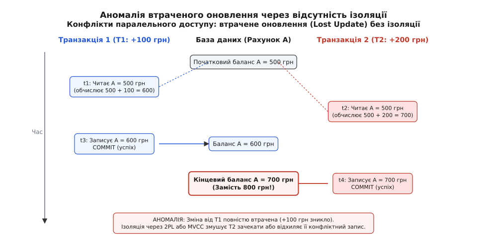
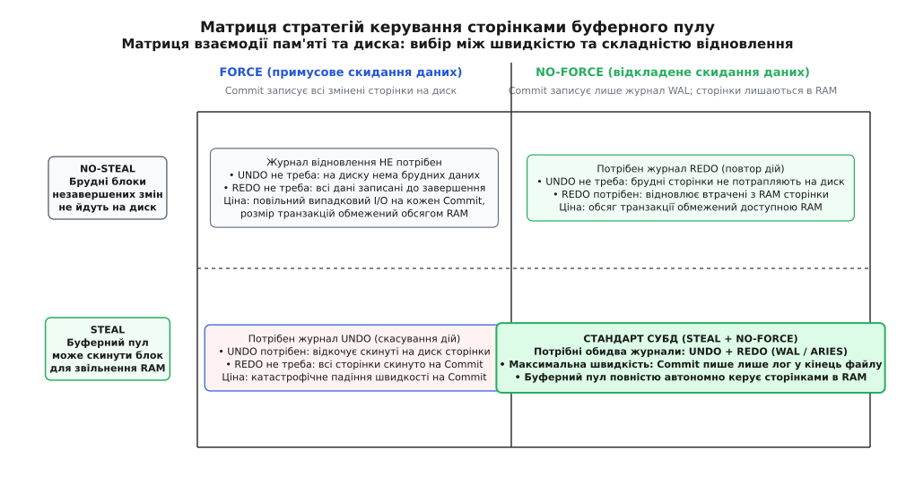
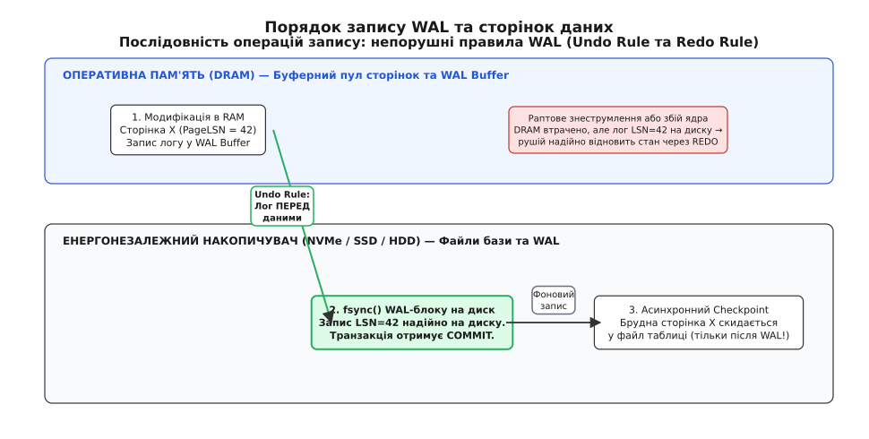
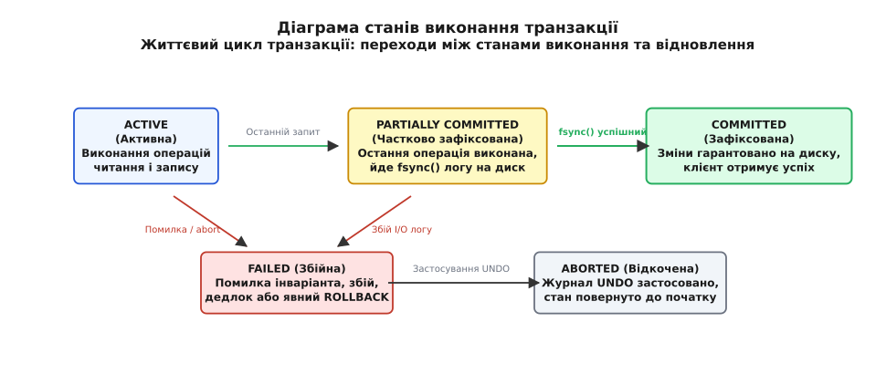

# Транзакції та гарантії ACID

<preknowlist>
- [Реляційна модель даних](topic:sf-data/relational-model) — відношення, кортежі, обмеження цілісності та реляційні операції.
- [Журнал попереднього запису (WAL)](topic:sf-data/write-ahead-log) — послідовне скидання змін на диск до модифікації сторінок пам'яті.
- [Песимістичне блокування](topic:sf-data/pessimistic-locking) — взаємне виключення читачів і письменників для уникнення гонок.
</preknowlist>

Переказ ста гривень між двома банківськими рахунками здається елементарною дією, але на рівні комп'ютерного заліза це ланцюжок із п'яти окремих операцій: зчитати баланс першого рахунку (500 грн), перевірити наявність коштів, записати новий залишок першого рахунку (400 грн), зчитати баланс другого рахунку (200 грн) і записати новий залишок другого рахунку (300 грн). Якщо після третього кроку раптово зникає напруга в електромережі або операційна система зазнає аварійного перезапуску, сто гривень списуються з першого рахунку й безслідно зникають, так і не діставшись другого. Якщо в проміжку між третім і п'ятим кроками фоновий звіт аудиту виконає підсумовування всіх грошей у системі, він зафіксує загальний баланс 600 грн замість реальних 700 грн. Якщо ж обидва записи завершуються в оперативній пам'яті, клієнт отримує повідомлення про успіх, а за мікросекунду контролер диска втрачає живлення до того, як байти потрапили на магнітні пластини чи у флеш-комірки, зміна втрачається назавжди.

Ця фізична реальність апаратного забезпечення — неможливість миттєво й неподільно змінити стан у кількох місцях пам'яті чи диска водночас — робить створення надійних систем неможливим без спеціальної концептуальної та інженерної моделі. Такою моделлю є транзакція.

## Сутність транзакції та походження поняття

Термін «транзакція» походить від латинського *transactio* (утвореного від дієслова *transagere*: *trans* — «через, крізь» та *agere* — «робити, діяти, вести справу»), що в римському праві та комерційній практиці століттями означало неподільну завершену угоду, компроміс або взаємний розрахунок. У юридичному розумінні транзакція не має половинчастого стану: договір або укладено повністю з набуттям усіх взаємних прав і обов'язків, або його скасовано, і сторони повертаються до вихідного правового статусу.

У комп'ютерних науках **транзакція (*Transaction*)** — це логічна одиниця роботи (*Logical Unit of Work, LUW*), яка об'єднує послідовність операцій читання та модифікації стану системи таким чином, що вся ця сукупність виконується як єдине ціле.

Транзакція має чітко окреслені межі, які задаються керуючими командами:
- `BEGIN TRANSACTION` (або `START TRANSACTION`) — відкриття контексту транзакції.
- `COMMIT` — фіксація змін: усі модифікації стають остаточними, видимими для інших процесів і гарантовано стійкими до збоїв.
- `ROLLBACK` (або `ABORT`) — скасування змін: усі виконані в межах поточної транзакції модифікації анулюються, а система повертається до точного стану на момент виклику `BEGIN`.

Щоб розробники прикладних програм могли спиратися на транзакції як на непорушний математичний фундамент, система керування базами даних зобов'язана надавати чотири взаємопов'язані гарантії, відомі за акронімом **ACID**: неподільність (*Atomicity*), узгодженість (*Consistency*), ізольованість (*Isolation*) та довговічність (*Durability*). Детально історію зародження цих концепцій у лабораторіях IBM та формулювання класичного маніфесту викладено в [історії формалізації транзакційної моделі](topic:sf-data/transactions-acid/hist-acid-formalization.md).

## Гарантія A — Неподільність (Atomicity)

Слово «атом» походить від грецького *ἄτομος* (*atomos* — «неподільний», де частка *ἀ-* означає заперечення, а *τέμνω* — «різати, ділити»). Неподільність у транзакційному контексті означає принцип **«усе або нічого» (*all-or-nothing*)**.

Транзакція не може зупинитися на середині. Якщо під час її виконання виникає будь-яка помилка — ділення на нуль у виразі, порушення унікальності ключа, аварійне падіння процесу СУБД, втрата зв'язку з клієнтом чи відключення електроживлення сервера — база даних гарантує, що жоден байт із частково внесених змін не залишиться в системі. Стан бази даних після аварійного скасування виглядає так, ніби цієї транзакції ніколи не існувало.

Фізичні накопичувачі записують дані блоками (секторами по 512 або 4096 байтів). Якщо транзакція змінює 50 рядків у різних таблицях, це вимагає десятків окремих дискових операцій запису в різні ділянки накопичувача. Жоден сучасний дисковий контролер не здатен записати п'ятдесят секторів атомарно в одну мить.

Для забезпечення неподільності рушії баз даних застосовують один із двох фундаментальних підходів:

1. **Тіньове копіювання сторінок (*Shadow Paging*)**:
   Під час модифікації даних рушій не змінює оригінальні сторінки на диску. Натомість він створює копію сторінки в новому вільному блоці («тіньову сторінку») і вносить зміни туди. Головна таблиця сторінок продовжує вказувати на старі версії. У момент виклику `COMMIT` система атомарно змінює єдиний кореневий вказівник на нову таблицю сторінок. Якщо стається збій, кореневий вказівник лишається на старих даних, а тіньові блоки просто оголошуються вільними. Недолік цього методу — сильна фрагментація дискового простору та високі накладні витрати на копіювання цілих сторінок при зміні навіть одного байта.
2. **Журнал скасування (*Undo Logging*) у складі журналу попереднього запису**:
   Рушій дозволяє модифікувати сторінки в оперативній пам'яті та скидати їх на диск, але перед внесенням будь-якої зміни записує у спеціальний журнал вихідне значення модифікованих даних («старий образ», *before-image*). Якщо транзакція зазнає збою, фоновий процес сканує цей журнал у зворотному напрямку і послідовно повертає кожному зміненому байту його первісний стан.

## Гарантія C — Узгодженість (Consistency)

Слово «узгодженість» походить від латинського *consistentia* (від дієслова *consistere* — «твердо стояти разом, бути зв'язаним, узгоджуватися»). Узгодженість вимагає, щоб транзакція переводила базу даних з одного коректного стану, який задовольняє всі встановлені правила та обмеження, в інший коректний стан.

Узгодженість займає унікальне місце в абревіатурі ACID, оскільки це не суто внутрішня механічна властивість рушія зберігання (як A, I чи D), а **спільний контракт між рушієм СУБД та прикладним додатком**:

```
[ Бізнес-правила програми ]  ───►  (Зберігає грошовий баланс / логіку домену)
            │
            ▼
[ Декларативні інваріанти СУБД ] ──► (PRIMARY KEY, FOREIGN KEY, CHECK, NOT NULL)
            │
            ▼
[ Механізми СУБД (A + I + D) ] ──► (Захист від збоїв, гонок та втрати даних)
```

База даних забезпечує виконання **явних декларативних обмежень цілісності (*Schema Constraints*)**:
- **Унікальність (*Unique Constraints / Primary Keys*)**: неможливість створити два записи з однаковим ідентифікатором.
- **Посилальна цілісність (*Foreign Keys*)**: замовлення не може посилатися на користувача, якого не існує в таблиці клієнтів.
- **Перевірочні обмеження (*CHECK Constraints*)**: вік користувача не може бути від'ємним числом (`age >= 0`).
- **Обов'язковість значень (*NOT NULL*)**: критичні стовпчики повинні містити дійсні дані.

Якщо операція всередині транзакції порушує будь-яке з цих обмежень (наприклад, спроба вставити дублікат первинного ключа), СУБД негайно аварійно перериває транзакцію, активує механізм відкату (Atomicity) і повертає помилку.

Проте база даних нічого не знає про **неявні бізнес-інваріанти предметної області**. Наприклад, закон збереження грошей під час банківського переказу («сума залишків на рахунках A і B після переказу має дорівнювати сумі до переказу») формулюється в коді прикладного додатка. Якщо програміст напише `UPDATE accounts SET balance = balance - 100 WHERE id = 'A'` і забуде додати `+ 100` до рахунку B, база даних технічно зафіксує транзакцію, оскільки жодне табличне обмеження не порушено, але стан системи стане бізнесово неузгодженим.

Таким чином, розробник програми відповідає за правильність логіки переходу між станами, а СУБД гарантує, що апаратні аварії (A, D) та конкурентні процеси (I) не зможуть зруйнувати створену цілісність.

## Гарантія I — Ізольованість (Isolation)

Слово «ізоляція» походить від латинського *insulare* (від *insula* — «острів», тобто перетворення на відокремлений острів). Ізольованість гарантує, що паралельне виконання тисяч одночасних транзакцій на багатоядерних серверах дає точно такий самий результат, який був би отриманий, якби всі ці транзакції виконувалися суворо по черзі, одна за одною (*Serial Execution*).

Поки транзакція не завершилася викликом `COMMIT`, жодна інша транзакція в системі в ідеалі не повинна бачити її проміжних, тимчасових модифікацій.

### Аномалії паралельного доступу

Коли кілька транзакцій читають і модифікують спільні комірки пам'яті без належної координації, виникають характерні конфлікти та аномалії:

1. **Брудний запис (*Dirty Write*)**:
   Транзакція T2 перезаписує значення, щойно змінене транзакцією T1, поки T1 ще не зафіксувалася. Якщо згодом T1 зазнає відкату (`ROLLBACK`), вона поверне значення комірки до початкового стану, знищивши запис, зроблений T2. Це найтяжча аномалія, яка заборонена в абсолютно всіх промислових СУБД на будь-яких налаштуваннях.
2. **Брудне читання (*Dirty Read*)**:
   Транзакція T2 зчитує рядок, змінений незафіксованою транзакцією T1. Якщо після цього T1 виконує `ROLLBACK`, дані, на основі яких T2 вже встигла прийняти бізнес-рішення (наприклад, видати готівку в банкоматі), виявляються неіснуючими фантомами.
3. **Неповторюване читання (*Non-repeatable Read*)**:
   Транзакція T1 зчитує баланс рахунку (500 грн). У цей момент паралельна транзакція T2 змінює цей баланс на 600 грн і успішно фіксується (`COMMIT`). Коли T1 повторно виконує той самий `SELECT` у межах своєї роботи, вона бачить уже 600 грн. Один і той самий запит у межах однієї транзакції повертає різні значення.
4. **Фантомне читання (*Phantom Read*)**:
   Транзакція T1 запитує список усіх замовлень із сумою понад 1000 грн (`WHERE amount > 1000`) і отримує 3 рядки. Транзакція T2 вставляє нове замовлення на суму 1500 грн і фіксується. Коли T1 повторює свій запит за предикатом, вона отримує 4 рядки. З'явився новий «фантомний» запис, якого не було на початку.
5. **Втрачене оновлення (*Lost Update*)**:
   Дві транзакції одночасно зчитують однакове початкове значення, модифікують його в пам'яті програми та записують назад. Другий запис повністю затирає результат першого.


*Конфлікт паралельного доступу двох транзакцій до одного рахунку призводить до втрати оновлення без належної ізоляції.*

Математичне обґрунтування того, коли перемішаний у часі розклад багатьох транзакцій є строго еквівалентним послідовному виконанню, будується на теорії графів попереднього виконання та детально доведено у вставці про [математичні критерії серіалізовності та графи конфліктів](topic:sf-data/transactions-acid/math-serializability-graphs.md).

Для практичного керування ізоляцією стандарт SQL запровадив чотири рівні: `READ UNCOMMITTED`, `READ COMMITTED`, `REPEATABLE READ` та `SERIALIZABLE`. Сучасні рушії реалізують їх або через механізм двофазного блокування (2PL), або через багатоверсійність, детально розглянуту в окремих статтях про [рівні ізоляції](topic:sf-data/isolation-levels) та [багатоверсійне керування конкурентністю (MVCC)](topic:sf-data/mvcc).

## Гарантія D — Довговічність (Durability)

Слово «довговічність» походить від латинського *durabilis* (від *durare* — «тривати, витримувати, зберігатися непохитним»). Довговічність гарантує, що після того, як транзакція отримала від СУБД підтвердження успішної фіксації (`COMMIT`), її результати стають перманентною частиною стану системи і не можуть бути втрачені за жодних наступних апаратних аварій, вимкнень електроживлення чи збоїв ядра ОС.

Фізична природа довговічності спирається на принципову різницю між двома типами пам'яті:
- **Енергозалежна пам'ять (*Volatile Memory / DRAM*)**: надзвичайно швидка (затримка читання/запису 50–100 наносекунд, пропускна здатність десятки гігабайтів на секунду), але повністю втрачає свій вміст при зникненні електричного струму.
- **Енергонезалежна пам'ять (*Non-Volatile Storage / NAND Flash SSD, HDD*)**: значно повільніша (затримка 20–100 мікросекунд для NVMe SSD, 5–15 мілісекунд для HDD), але зберігає записані магнітні домени або електричні заряди в ізольованих затворах комірок роками без живлення.

Коли прикладний додаток надсилає команду `COMMIT`, база даних не може вважати транзакцію завершеною, доки змінені байти фізично не осядуть на енергонезалежному носії.

Проте випадковий запис змінених сторінок таблиць та індексів безпосередньо у файли бази даних під час кожного комміту створив би катастрофічне падіння швидкодії. Замість цього СУБД використовує послідовний журнал попереднього запису (WAL), синхронізуючи його за допомогою системних викликів `fsync` та `fdatasync`. Усі технічні нюанси взаємодії з ядром ОС, дисковими кешами та апаратними командами накопичувачів описано в [довіднику системних викликів fsync, fdatasync та контрактів зберігання](topic:sf-data/transactions-acid/api-posix-fsync-durability.md).

## Архітектура пам'яті та диска: буферний пул та політика Steal/No-Force

Серцем будь-якої реляційної СУБД є **буферний пул (*Buffer Pool*)** — виділена область оперативної пам'яті, розбита на сторінки однакового розміру (зазвичай 4 КБ, 8 КБ у PostgreSQL або 16 КБ в InnoDB). Таблиці та індекси на диску також розбиті на однойменні сторінки.

Коли транзакція виконує читання або запис, потрібна сторінка завантажується з диска в буферний пул. Якщо транзакція модифікує дані, сторінка в пам'яті позначається як **брудна (*Dirty Page*)** — її вміст у DRAM відрізняється від версії на диску.

Взаємодія між буферним пулом та диском визначається вибором двох фундаментальних архітектурних політик:

1. **Керування витисненням сторінок під час браку RAM (Steal vs No-Steal)**:
   - **NO-STEAL**: Буферному пулу суворо заборонено скидати на диск брудні сторінки, що належать незавершеним (*uncommitted*) транзакціям. Усі змінені сторінки мусять утримуватися виключно в оперативній пам'яті до моменту `COMMIT`.
     *Наслідок:* Якщо стається збій, на диску гарантовано немає брудних даних незавершених транзакцій, тому журнал скасування (**UNDO**) для відновлення не потрібен. Але розмір транзакцій виявляється жорстко обмеженим вільним обсягом RAM.
   - **STEAL**: Буферний пул має право витиснути на диск будь-яку брудну сторінку, щоб звільнити місце для інших запитів, навіть якщо транзакція, що її змінила, ще триває.
     *Наслідок:* Пам'ять використовується максимально гнучко, але на диску можуть опинитися незафіксовані зміни. Якщо сервер аварійно впаде, підсистема відновлення зобов'язана мати журнал **UNDO**, щоб знайти ці сторінки на диску й повернути їхній початковий стан.
2. **Керування фіксацією даних під час COMMIT (Force vs No-Force)**:
   - **FORCE**: У момент підтвердження `COMMIT` рушій зобов'язаний примусово знайти на диску всі модифіковані цією транзакцією сторінки даних та індексів і синхронно записати їх у відповідні файли таблиць.
     *Наслідок:* У разі падіння всі зафіксовані дані вже гарантовано на диску, тому журнал повтору (**REDO**) не потрібен. Проте швидкість комміту падає в сотні разів через хаотичний випадковий запис по всьому простору файлів бази даних.
   - **NO-FORCE**: Під час виклику `COMMIT` змінені сторінки даних продовжують спокійно залишатися в оперативній пам'яті. На диск примусово скидається лише компактний послідовний запис у файл журналу WAL. Скиданням самих сторінок даних займається окремий фоновий процес (*Checkpointer / Page Cleaner*) у фоновому асинхронному режимі.
     *Наслідок:* Швидкість фіксації транзакцій стає колосальною (послідовний запис у кінець одного файлу), але якщо сервер втратить живлення, свіжі зміни в DRAM зникнуть. Щоб відновити їх після перезапуску, рушій зобов'язаний мати журнал **REDO**.


*Матриця взаємодії пам'яті та диска: чому сучасні СУБД обирають поєднання Steal та No-Force з обов'язковим веденням журналів UNDO та REDO.*

Абсолютна більшість сучасних високонавантажених СУБД (PostgreSQL, MySQL InnoDB, Oracle, Microsoft SQL Server, SQLite) обирають комбінацію **STEAL + NO-FORCE**. Це забезпечує найвищу можливу продуктивність, але вимагає ведення повноцінного комбінованого журналу відновлення (REDO для довговічності та UNDO для неподільності).

## Інваріанти журналу попереднього запису (WAL Invariants)

Щоб модель Steal + No-Force працювала надійно й гарантувала неподільність та довговічність за будь-яких сценаріїв збою, запис у журнал WAL та скидання сторінок даних на диск підпорядковуються двом залізним правилам:

### 1. Правило скасування (The Undo Rule / The WAL Invariant)

Жодна брудна сторінка даних не може бути записана з оперативної пам'яті на диск доти, доки відповідний запис журналу WAL, що описує це оновлення (і містить інформацію для скасування `old_value`), не буде фізично записаний і синхронізований на диску.

Якщо це правило порушити, може виникнути фатальна ситуація: брудна сторінка зі значенням незавершеної транзакції потрапить на диск, сервер вимкнеться, а в журналі WAL не виявиться запису про те, як повернути старе значення назад. Неподільність (Atomicity) буде незворотно зруйнована.

### 2. Правило фіксації (The Redo Rule)

Усі записи журналу WAL, що описують будь-які зміни, внесені транзакцією, повинні бути фізично записані на енергонезалежний носій до того, як клієнту буде повернуто сигнал про успішне завершення `COMMIT`.

Якщо клієнт отримає підтвердження комміту, поки останній WAL-запис ще перебуває в буфері оперативної пам'яті, раптове знеструмлення знищить цей запис. Після перезапуску база даних не знатиме про внесені зміни, і клієнт зіткнеться з порушенням довговічності (Durability).

Кожен запис у журналі WAL має монотонно зростаючий числовий номер — **LSN (*Log Sequence Number*)**. Кожна сторінка в буферному пулі зберігає у своєму заголовку поле `PageLSN` — номер останнього запису в журналі, який вносив зміни в цю сторінку. Коли фоновий процес вирішує скинути брудну сторінку на диск, він порівнює `PageLSN` сторінки з `FlushedLSN` (номером останнього байта WAL, надійно синхронізованого на диску через `fsync`). Якщо `PageLSN > FlushedLSN`, рушій спочатку примусово скидає журнал WAL до позиції `PageLSN`, і лише потім записує сторінку даних.


*Послідовність скидання журналу WAL та сторінок даних на диск із суворим дотриманням правил попереднього запису.*

## Життєвий цикл і граф станів транзакції

Під час свого існування транзакція проходить через строго визначену послідовність внутрішніх станів:

```
                  ┌──────────────┐
                  │    ACTIVE    │ ◄── BEGIN TRANSACTION
                  └──────┬───────┘
                         │
        ┌────────────────┼────────────────┐
        │ Остання дія    │ Помилка /      │
        ▼ виконана       │ ROLLBACK       ▼
┌──────────────────┐     │         ┌──────────────┐
│PARTIALLY COMMITTED     │         │    FAILED    │
└───────┬──────────┘     │         └──────┬───────┘
        │                │                │
        │ fsync() WAL    │ Збій I/O       │ Застосування
        │ успішний       │ логу           │ журналу UNDO
        ▼                │                ▼
┌──────────────────┐     │         ┌──────────────┐
│    COMMITTED     │     └────────►│   ABORTED    │
└──────────────────┘               └──────────────┘
```

1. **ACTIVE (Активна)**: Початковий стан транзакції від моменту виклику `BEGIN`. Транзакція виконує операції читання та запису, модифікує сторінки в буферному пулі й накопичує записи в буфері WAL.
2. **PARTIALLY COMMITTED (Частково зафіксована)**: Остання операція запиту завершилася, але транзакція ще не зафіксована остаточно. У цей момент рушій ініціює запис службового запису `LOG_COMMIT` та викликає `fdatasync()` для журналу WAL.
3. **COMMITTED (Зафіксована)**: Запис `LOG_COMMIT` гарантовано опинився на фізичному диску. Транзакція успішно завершена, її результати незворотні, клієнт отримує статус успіху.
4. **FAILED (Збійна)**: Транзакція не може продовжувати нормальне виконання через помилку бізнес-логіки, порушення інваріанта схеми, взаємне блокування (*Deadlock*) або збій вводу-виводу.
5. **ABORTED (Відкочена)**: Рушій застосував усі необхідні записи журналу UNDO, відновив первинні значення модифікованих рядків у пам'яті, зняв усі утримувані замки блокування та повернув ресурси системі.


*Життєвий цикл транзакції: переходи між станами виконання, комміту та аварійного скасування.*

Практичну програмну модель роботи з журналом попереднього запису, таблицею блокувань та трифазним циклом відновлення після збою наведено у [реалізації мініатюрного транзакційного рушія](topic:sf-data/transactions-acid/proj-mini-transaction-engine.md).

## Практична інженерія: межі транзакцій та обробка збоїв

У коді додатків взаємодія з транзакціями вимагає суворої обробки виняткових ситуацій. Неприпустимо залишати транзакцію у відкритому стані `ACTIVE` при виникненні мережевих помилок, оскільки утримувані нею замки блокування заблокують роботу інших клієнтів.

Розглянемо правильну організацію транзакційного блоку з автоматичним відкатом та збереженням проміжних точок (*Savepoints*):

:::tabs
```sql
-- Канонічний банківський переказ у SQL з перевіркою залишку
BEGIN TRANSACTION;

-- 1. Блокування рядка джерела від паралельних змін (SELECT FOR UPDATE)
SELECT balance FROM accounts WHERE id = 1 FOR UPDATE;

-- 2. Списання коштів із перевіркою обмеження цілісності (CHECK balance >= 0)
UPDATE accounts SET balance = balance - 100 WHERE id = 1;

-- 3. Зарахування коштів одержувачу
UPDATE accounts SET balance = balance + 100 WHERE id = 2;

-- 4. Фіксація змін
COMMIT;
```
```c
#include <stdio.h>
#include <stdbool.h>
#include <stdint.h>

// Приклад ідіоматичного керування транзакцією на мові C
typedef struct {
    int id;
    int64_t balance;
} Account;

typedef struct {
    bool in_transaction;
} DbConnection;

bool db_begin(DbConnection *conn) {
    conn->in_transaction = true;
    return true;
}

bool db_commit(DbConnection *conn) {
    conn->in_transaction = false;
    return true;
}

bool db_rollback(DbConnection *conn) {
    conn->in_transaction = false;
    return true;
}

bool transfer_money(DbConnection *conn, Account *from, Account *to, int64_t amount) {
    if (!db_begin(conn)) return false;

    if (from->balance < amount) {
        // Порушення бізнес-інваріанта: відкат і вихід
        db_rollback(conn);
        return false;
    }

    from->balance -= amount;
    to->balance += amount;

    if (!db_commit(conn)) {
        db_rollback(conn);
        return false;
    }

    return true;
}
```
```cpp
#include <iostream>
#include <string>
#include <stdexcept>
#include <system_error>

namespace db {

class Connection {
public:
    void execute(std::string_view sql) {
        // Відправка SQL-команди до рушія СУБД
    }
};

// RAII-обгортка для гарантованого закриття транзакційного контексту
class TransactionGuard {
public:
    explicit TransactionGuard(Connection& conn) : conn_(conn) {
        conn_.execute("BEGIN TRANSACTION;");
    }

    ~TransactionGuard() noexcept {
        if (!committed_) {
            try {
                conn_.execute("ROLLBACK;");
            } catch (...) {
                // Поглинання помилок у деструкторі
            }
        }
    }

    TransactionGuard(const TransactionGuard&) = delete;
    TransactionGuard& operator=(const TransactionGuard&) = delete;

    void commit() {
        conn_.execute("COMMIT;");
        committed_ = true;
    }

private:
    Connection& conn_;
    bool committed_{false};
};

void execute_money_transfer(Connection& conn, int from_id, int to_id, int64_t amount) {
    TransactionGuard txn(conn);

    conn.execute("UPDATE accounts SET balance = balance - " + std::to_string(amount) +
                 " WHERE id = " + std::to_string(from_id) + ";");

    conn.execute("UPDATE accounts SET balance = balance + " + std::to_string(amount) +
                 " WHERE id = " + std::to_string(to_id) + ";");

    // Якщо до цього рядка виникне виняток, деструктор txn автоматично виконає ROLLBACK
    txn.commit();
}

} // namespace db
```
:::

## Архітектурна ціна ACID та інженерні компроміси

Гарантії ACID не є безкоштовними — кожна з чотирьох літер вимагає обчислювальних та апаратних ресурсів:
- **Ціна довговічності (D)**: Необхідність виклику `fsync()` на кожен комміт створює фізичний бар'єр продуктивності. Без групового комміту диск не може обробити більше ніж кілька сотень коммітів на секунду. У системах, де допустима втрата кількох секунд даних заради десятикратного приросту швидкості, адміністратори свідомо вимикають синхронний запис (наприклад, параметр `synchronous_commit = off` у PostgreSQL).
- **Ціна ізольованості (I)**: Утримання блокувань (2PL) породжує очікування, черги та взаємні блокування (*Deadlocks*), що обмежує масштабованість системи на багатоядерних машинах. Багатоверсійні рушії (MVCC) усувають блокування читачів, але вимагають додаткової пам'яті для зберігання ланцюжків версій і періодичного фонового очищення від мертвих кортежів (*VACUUM* у PostgreSQL або очищення сегментів відкату в InnoDB).
- **Розподілені транзакції**: Коли дані розподілені між сотнями серверів, протокол двофазної фіксації (**2PC, *Two-Phase Commit***) змушує всі вузли чекати на найповільнішого учасника мережі. За теоремою CAP, розподілена система під час мережевого розділення (*Network Partition*) змушена обирати між узгодженістю (Consistency) та доступністю (Availability). Це породило альтернативну парадигму **BASE** (*Basically Available, Soft state, Eventual consistency*), типову для документоорієнтованих та розподілених сховищ NoSQL.

> 🔧 **Навіщо це.**
> Розуміння внутрішньої механіки ACID позбавляє інженера двох небезпечних ілюзій: віри в те, що база даних магічно виправить помилки бізнес-логіки додатка, і страху перед реляційними транзакціями як «повільним легасі». На практиці проектування транзакційної системи зводиться до трьох чітких правил:
> 1. **Тримати транзакції максимально короткими**: чим менше мікросекунд триває транзакція від `BEGIN` до `COMMIT`, тим менша ймовірність дедлоків і конфліктів за блокування.
> 2. **Ніколи не виконувати мережеві виклики (HTTP / RPC / пошта) всередині транзакції**: зависання зовнішнього API заблокує рядки в базі на десятки секунд і зупинить роботу всього сервісу.
> 3. **Проектувати операції ідемпотентними та передбачати автоматичний повтор (*Retry*)**: при виникненні конфліктів серіалізації або взаємних блокувань додаток повинен уміти прозоро перезапустити транзакцію з експоненційним відступом (*Exponential Backoff*).
