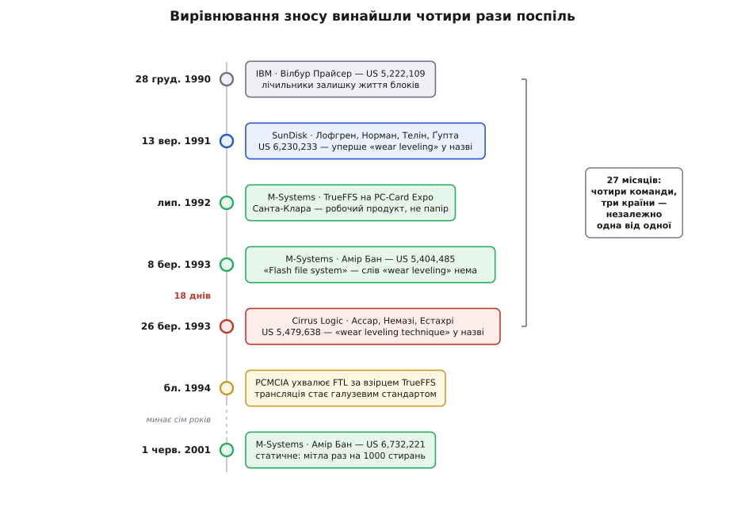

# 📜 Як народжувалося вирівнювання зносу

Флеш народився з вадою, яка на вигляд перекреслювала його головну мрію. Пам'ять, що тримає дані без живлення й не має жодної рухомої частини, аж просилася на місце жорсткого диска — але витримувала лічені тисячі стирань, тоді як диск спокійно переживав мільярди перезаписів однієї доріжки. Між груднем 1990-го й березнем 1993-го чотири незалежні команди в трьох країнах уперлися в цю стіну майже одночасно — і кожна окремо додумалася, по суті, до тієї самої відповіді.

Тим ця історія й цікава: у вирівнювання зносу немає одного винахідника. Зате в нього є на диво чіткий паперовий слід — усі чотири лінії лишили по собі патенти з точними датами подання, тож тут не доводиться гадати, хто що́ знав і коли. Рідкісний випадок, коли «хто перший» можна не вгадувати, а прочитати.

## Пам'ять, що стирається спалахом

Почалося все не з алгоритму, а з комірки. На початку 1980-х Фудзіо Масуока (Fujio Masuoka, нар. 8 травня 1943, Такасакі, префектура Ґумма) працював у дослідному центрі Toshiba в Кавасакі й шукав, як здешевити енергонезалежну пам'ять. Тодішні EEPROM тримали на кожен біт по два транзистори — дорого. Масуока з групою звів комірку до **одного** транзистора з плавним затвором, з'єднавши комірки так, що схема нагадувала логічний вентиль NOR. Патент на цю ідею він подав ще 1980 року разом із Хісакадзу Іідзукою (Hisakazu Iizuka).

Назву підказав колега — Сьодзі Аріідзумі (Shoji Ariizumi). Стирання в новій пам'яті відбувалося не побайтово й повільно, як у EEPROM, а разом, усім масивом і миттєво, — і це нагадало йому спалах фотокамери. Так пам'ять стала **флеш** (англ. *flash* — спалах). Ім'я приліпилося назавжди, хоча описувало воно якраз ту властивість, з якої згодом і виросте вся морока: стирати можна тільки гуртом.

Масуока доповів про NOR-комірку на **IEDM 1984** — щорічній International Electron Devices Meeting, головному форумі з приладів, — у Сан-Франциско. Toshiba до винаходу поставилася прохолодно: технологія вимагала непростого потрійного полікремнію, виробництво комизилося, і компанія комерціалізувати її не квапилася. Підхопив Intel: його команда — Річард Пешлі (Richard Pashley), Стефан Лай (Stefan Lai), схемотехнік Найлз Кайнетт (Niles Kynett) — показала робочі чипи 1986-го й вивела 256-кілобітний NOR-флеш 1987 року.

Сам Масуока тим часом пішов далі й переставив комірки в ланцюжок — послідовно, як у вентилі NAND. Вийшло ще щільніше й швидше на запис і стирання; доповідь «New ultra high density EPROM and flash EEPROM with NAND structure cell» (у співавторстві з М. Момодомі, Ю. Івата та Р. Сірота) прозвучала на **IEDM 1987**. *(Місто цієї доповіді джерела подають по-різному: більшість — Сан-Франциско, Музей комп'ютерної історії — Вашингтон. Для змісту це нічого не міняє, але видавати одну з версій за певну не варто.)*

Toshiba віддячила винахідникові символічно: премія за флеш склала кількасот доларів, а згодом компанія спробувала його ще й понизити. Судова тяганина скінчилася аж 2006 року мировою на 87 мільйонів єн (близько 758 тисяч доларів) — за пам'ять, на якій сьогодні тримається половина світової електроніки.

Але — і це тут головне — Масуока винайшов **комірку**, не спосіб її берегти. Фізика дала ресурс, і ресурс той виявився мізерним.

## Ресурс, якого не вистачало на диск

Ранній флеш ставав ненадійним десь після 10³–10⁴ циклів запис-стирання: вікно між стертим і записаним станом поволі затягувалося, аж поки схема зчитування переставала розрізняти нулі та одиниці. Для мікросхеми, куди прошивку заливають раз на заводі, цього з головою. Для диска — катастрофа.

Річ у тім, що файлова система пише страшенно нерівно. Дані лягають куди прийдеться, а от таблицю розміщення файлів вона правúть за кожного збереження — і завжди в тому самому місці.

```
таблиця FAT правиться ~10 разів на хвилину роботи
ресурс блоку:                    10 000 стирань
10 000 / 10 = 1000 хв ≈ 17 годин безперервної роботи
```

Сімнадцять годин. Не тому, що чип поганий, — решта його комірок за цей час лишалася незайманою. Просто вся робота била в одну цятку.

Ось звідки береться одночасність. Ніхто не «вигадував вирівнювання зносу» з цікавості: у стіну вперлися **всі, хто взявся продавати флеш як диск**, — і вперлися в неї одночасно, бо флеш саме тоді доріс до потрібної місткості. Чекати, поки хімія полагодить комірку, було довго й непевно. Лишався софт.

## Перший, хто це записав: лічильник залишку життя

Найраніший документ у цій історії — не з Кремнієвої долини і не з Ізраїлю. **28 грудня 1990 року** Вілбур Д. Прайсер (Wilbur D. Pricer) з IBM подав заявку, що стала патентом **US 5,222,109 «Endurance management for solid state files»** (видано 22 червня 1993).

Ідея в ньому вже вся: тримати при масивах даних окремий масив **лічильників**, що показують «залишок корисного життя» кожного, і керувати доступом до масивів **як функцією від цих лічильників**. Прайсер навіть застеріг окремою умовою, що лічильник мусить жити помітно довше за те, що він рахує, — інакше механізм спалить себе першим.

Це вже вирівнювання зносу по суті. Але це — **ідея в патенті**, не виріб: диска на флеші IBM із неї не збудувала. Різниця між «додумався й записав» і «зробив річ, що працює» тут не формальність, і далі вона стане ще виразнішою.

> 🔧 **Навіщо це.** Патентні дати — рідкісний подарунок історикові техніки. Стаття виходить, коли автор дозрів до публікації; продукт — коли дозрів ринок; спогади пишуться через десятиліття й підганяються під те, чим усе скінчилося. А заявка фіксує **день**, коли ідея вже була на папері, і фіксує його руками сторонньої установи, якій байдуже до чиєїсь слави. Саме тому в цій історії видно те, що зазвичай затерте: не ланцюжок «А навчив Б», а чотири команди, які нічого одна про одну не знали.

## Слово «вирівнювання»

SunDisk заснували 1 червня 1988 року Елі Гарарі (Eli Harari), Санджай Мехротра (Sanjay Mehrotra) і Джек Юань (Jack Yuan). *(На SanDisk компанія перейменувалася аж 8 листопада 1995-го — щоб її не плутали із Sun Microsystems.)* На відміну від IBM, вони не теоретизували — вони **везли товар**: 1991 року SunDisk зробила перший твердотільний накопичувач на флеші в корпусі 2.5-дюймового диска, на 20 МБ, для IBM, приблизно за тисячу доларів.

А хто везе товар, той першим і з'їдає всі граблі. **13 вересня 1991 року** SunDisk подала заявку 07/759,212 — Карл М. Й. Лофгрен (Karl M. J. Lofgren), Роберт Д. Норман (Robert D. Norman), Ґреґорі Б. Телін (Gregory B. Thelin), Аніл Ґупта (Anil Gupta). Називалася вона **«Wear leveling techniques for flash EEPROM systems»**. Це, здається, перший раз, коли термін стоїть просто в назві патенту.

Метод у ній описано прямо: стежити за кількістю перезаписів на кожну групу комірок, знаходити ту, що набрала **найбільше**, і спрямовувати подальші записи в менш ужиті банки — «тим самим зменшуючи дисбаланс на наступних циклах». Не хитро, зате точно по суті.

Патент цей має кумедну долю: подали 1991-го, а видали аж **8 травня 2001 року** — майже десять років у діловодстві, з вервечкою продовжень, що тягнулися до 2008-го. Для нас це важить ось чим: **пріоритет** у цієї лінії — 1991-й, хай навіть світ побачив папір за десятиліття. Хто судив би за датою видачі, поставив би SanDisk останнім, а не другим.

## Програма, що вдавала диск

M-Systems заснували 1989 року в Кфар-Сабі Дов Моран (Dov Moran) і Ар'є Мерґі (Aryeh Mergi). Повна назва компанії — **M-Systems Flash Disk Pioneers Ltd.** — програму мінімум оголошувала просто в шильді.

Ключову річ зробив Амір Бан (Amir Ban). 1992 року він написав **TrueFFS** — True Flash File System, програму, від якої комп'ютер бачив масив флешу як звичайний диск. У липні 1992-го її показали як готовий продукт на PC-Card Expo в Санта-Кларі. Заявку подали **8 березня 1993 року**; вона стала патентом **US 5,404,485 «Flash file system»** (видано 4 квітня 1995).

І ось тут — найцікавіша дрібниця всієї історії. У тексті цього патенту словосполучення *wear leveling* **не трапляється жодного разу**.

Бан розв'язував іншу задачу — сумісності. Йому треба було, щоб «флеш видавався операційній системі сховищем, з якого можна читати й у яке можна писати за будь-якою адресою», попри те, що «переписати вже записану ділянку без попереднього стирання блоку непрактично». Він побудував **дворівневе відображення**: віртуальна адреса → логічний вузол → фізичний вузол. Завдяки другому рівню переміщення даних між фізичними вузлами «не впливає на віртуальну карту» — номер логічного вузла не міняється, хоч би куди мандрував вміст.

Рівний знос вийшов **побічним продуктом**. Раз механізм і так періодично вибирає вузол, зчитує з нього живі блоки, переписує їх у резервний вузол і стирає джерело — знос розповзається чипом сам собою, без окремої на те заяви. Бан цілився в сумісність, а влучив ще й у довговічність.

Далі сталося те, що й робить цю лінію особливою. Близько 1994 року асоціація PCMCIA ухвалила специфікацію **Flash Translation Layer**, узявши за основу будову TrueFFS; писали її M-Systems разом зі SCM Microsystems. Приватне рішення однієї маленької компанії стало **галузевим стандартом** — і саме тому [шар трансляції флешу](topic:sf-data/ftl-flash-translation) досі зветься FTL, загальною назвою, а не чиїмось ім'ям. 1996-го Бан зробив і NFTL — варіант під NAND.

Тобто в цій історії є щонайменше чотири різні речі, і плутати їх не можна: **ідея** (Прайсер, 1990), **термін і техніка** (Лофгрен із колегами, 1991), **робочий продукт** (TrueFFS, 1992) і **стандарт** (FTL, 1994). M-Systems програла перші дві позиції й виграла дві других — а виграш саме в них, як виявилося, і важить найбільше.

## Вісімнадцять днів

**26 березня 1993 року** — через **вісімнадцять днів** після заявки Бана — Cirrus Logic подала одразу дві свої: US 5,388,083 «Flash memory mass storage architecture» і US 5,479,638, у назві якої вирівнювання стояло вже прямим текстом: **«Flash memory mass storage architecture incorporation wear leveling technique»** (видано 26 грудня 1995). Автори — Махмуд Ассар (Mahmud Assar), Сіамак Немазі (Siamack Nemazie), Петро Естахрі (Petro Estakhri); у продовженні до них додався Махмуд Мозаффарі (Mahmood Mozaffari). Іранські інженери в Кремнієвій долині — команда, яку в переказах цієї історії зазвичай не згадують узагалі.

Механізм у них свій і місцями хитріший за сусідні: лічильник стирань на кожен блок і **прапорець заборони стирання**. Але найцікавіше — що вони роблять із блоком, який ось-ось вичерпається:

> «Коли число циклів стирання блоку стає на одиницю меншим за максимум, блок стирають востаннє й записують у нього інший файл — той, що має **найменше** число стирань».

Прочитаймо, що це означає. У блок, якому лишився один цикл, свідомо кладуть **найхолодніші** дані з усього масиву — ті, що майже не міняються. Блок доживає віку, тримаючи вантаж, який його вже не потурбує, а натомість звільняється блок молодий і йде під гарячу роботу. Це **статичне вирівнювання зносу** — те саме зрушування холодних даних, до якого решта галузі дійде через роки, — тільки записане ще 1993-го й іншими словами.

Команда згодом відбрунькувалася від Cirrus Logic у власну компанію — **Lexar** (1996), і патенти помандрували за нею: до Lexar Microsystems 1997-го, до Lexar Media 1998-го, а зрештою — до Micron. Естахрі, співавтор понад 120 патентів, потім заснував Avalanche Technology.


*Народження вирівнювання зносу за датами подання заявок. Чотири команди — IBM, SanDisk, M-Systems, Cirrus Logic — дійшли до тієї самої відповіді незалежно, за двадцять сім місяців; дві останні розминулися на вісімнадцять днів. Вісь показує порядок подій, не масштаб часу: між ухваленням стандарту FTL і патентом на статичне вирівнювання минуло сім років.*

## Чому «хто перший» — погане питання

Складімо все докупи. Ідею з лічильниками залишку життя першим поклав на папір **Прайсер з IBM, у грудні 1990-го**. Термін *wear leveling* і техніку для флешу першими назвали своїм ім'ям **Лофгрен і колеги з SunDisk, у вересні 1991-го**. Річ, яка справді працювала й пішла в люди, зробив **Бан у M-Systems, улітку 1992-го**, а 1994-го його рішення стало стандартом усієї галузі. І цілком незалежно, **на вісімнадцять днів пізніше за Бана**, ту саму задачу — з ближчою до сьогоднішньої відповіддю — розв'язали **Ассар, Немазі й Естахрі в Cirrus Logic**.

Жодна з цих команд не «вкрала» в іншої. Жодна, судячи з паперів, про інших і не знала: у заявці Бана 1993 року взагалі не цитується попередніх патентів — лише туманна згадка, що «в попередньому стані техніки пропонувалися програмні продукти». Це класичний **одночасний винахід**: спільне обмеження (мала кількість стирань) плюс спільна мета (продати флеш як диск) плюс спільний інструмент (таблиця відповідності) — і чотири незалежні голови роблять той самий крок за два роки.

**Статус доказовості** тут високий, і це варто сказати прямо: усі чотири лінії підперті патентами з датами подання, які реєструвала стороння установа заднім числом не перепишеш. Що *не* доведено — це чи знав хтось із них про роботу інших; про це папери просто мовчать, і вгадувати не будемо.

Одне застереження про джерела. Патент US 5,479,638 у мережі регулярно приписують SanDisk — трапляється це й у довідкових текстах. Насправді його подала **Cirrus Logic**, і достатньо відкрити сам патент, щоб це побачити. Помилка живуча, бо кінцівка історії підказує «правильну» відповідь: SanDisk урешті зібрав у себе половину цього патентного поля, і заднім числом здається, ніби він там був завжди.

## Мітла Аміра Бана

Лишався останній акт — і зіграв його той самий Бан, через вісім років.

Динамічне вирівнювання, яке всі вже вміли, крутить лише **вільний пул**. Дані, що не міняються — прошивка, давно записані файли, — сидять у своїх блоках і в кругообіг не потрапляють; ті блоки лишаються вічно молодими, а весь знос лягає на меншу частку чипа. Знали про це давно. Не зрозуміло було, як полагодити **дешево**: щоб зрушити холодні дані, їх начебто спершу треба **знайти**, тобто вести облік, хто гарячий, а хто холодний, — а це пам'ять і робота на кожному записі.

**1 червня 2001 року** Бан подав заявку **US 6,732,221 «Wear leveling of static areas in flash memory»** (видано 4 травня 2004). Хід у ній — зразок того, як ощадливе міркування б'є ретельний облік.

Не шукаймо холодні дані **взагалі**. Раз на велике число операцій — у патенті прикладом стоїть **раз на 1000 стирань вузлів** — беремо **наступний вузол за фізичним порядком** («від першого до останнього, а тоді знов до першого») і проганяємо його крізь звичайне [прибирання сміття](topic:sf-data/flash-garbage-collection): живі дані переїжджають у вільне місце, вузол стирається. Ніякого обліку. Мітла просто методично обходить чип. Як варіант, вузол можна брати й навмання, з рівною ймовірністю для кожного.

Чому цього досить — Бан пояснює одним реченням, і воно варте того, щоб його розібрати:

> «Статичні ділянки записують один раз, а нестатичні — багато разів, тож записи в нестатичні ділянки значно переважають записи в статичні».

Виверни це — і все стає на місце. Ми не вміємо відрізнити холодний вузол від гарячого, зате знаємо: **гарячі вузли й так стираються постійно**, мітла їм нічого не додає й не віднімає. А от коли вона доходить до холодного, той єдиний раз, коли його зрушили, і є вся потрібна подія: дані переїхали, молодий блок звільнився й пішов у пул. Тобто мітла впливає **тільки** на тих, на кого треба, — не тому, що вона їх розрізняє, а тому, що на решту вплинути просто нема чим. Обраний статичний вузол, як пише Бан, «має високу ймовірність перестати бути статичним».

Патент формулює виграш просто: метод «заощаджує накладні витрати й облік, які були б потрібні, щоб виявляти статичні ділянки на носії».

А коштує ця мітла ось скільки:

**Приклад (ціна мітли в підсиленні запису).** Проганяємо крізь прибирання один зайвий вузол на кожну 1000 стирань:

```
зайвих стирань:  1 / 1000 = 0.001 = 0.1 %
було  WAF ≈ 1.20  →  стало  WAF ≈ 1.20 · 1.001 ≈ 1.2012
```

Одна десята відсотка. За це холодні дані перестають бути мертвим вантажем, і в роботу йде **весь** чип замість самого лише вільного пулу — а це, коли статика займає більшість чипа, кратне подовження життя. Одна тисячна витрат за кратний виграш: у програмуванні такі обміни трапляються нечасто, і майже завжди — там, де хтось здогадався **не міряти**.

## Чим це скінчилося

Дороги зійшлися. **30 липня 2006 року** SanDisk оголосив угоду про купівлю M-Systems, і **19 листопада** вона закрилася — 1.55 мільярда доларів акціями. Патенти команди Cirrus Logic поїхали через Lexar до Micron. Патент Прайсера теж кінець кінцем опинився в реєстрі за SanDisk Technologies. Чотири лінії, що починалися нарізно в трьох країнах, за півтора десятиліття стислися в портфелі двох компаній — і разом із ними стиснулася історія, з якої публіка запам'ятала щонайбільше одне ім'я.

Масуока за флеш отримав свої 87 мільйонів єн — через мирову, того самого 2006-го.

А Амір Бан, крім флешу, відомий зовсім іншим: разом із Шаєм Бушинським (Shay Bushinsky) він автор шахового рушія **Junior**, чемпіона світу серед програм (Париж 1997, Маастрихт 2001 і 2002, Рамат-Ган 2004, Турин 2006), який узимку 2003-го звів унічию матч із Гаррі Каспаровим — 3:3. Шахи він почав писати ще 1985 року, задовго до флешу; докторський ступінь — із **раціональності**, Єврейський університет, 2008. Людина, що навчила пам'ять розкладати знос порівну, все життя займалася тим самим: як приймати добрі рішення, не перебираючи всього.

---

Вирівнювання зносу не вигадав ніхто конкретний — і це не вада історії, а її суть. Флеш прийшов у світ із ресурсом у тисячі стирань і з файловими системами, що б'ють в одну цятку; стіна була одна на всіх, і всі, хто йшов на неї з розгону, відскочили в один бік — до таблиці відповідності й лічильників. Прайсер записав ідею, Лофгрен дав їй ім'я, Бан зробив річ, яка працювала, і виторгував їй статус стандарту, Ассар із колегами додумалися класти холодні дані у вмираючий блок. А тоді Бан вернувся й показав, що найтоншу частину задачі — холодні дані — можна взагалі не розв'язувати розумно: досить методичної мітли раз на тисячу стирань. Кожен із них зробив свій шар, і в сьогоднішньому контролері флешу лежать усі чотири.
