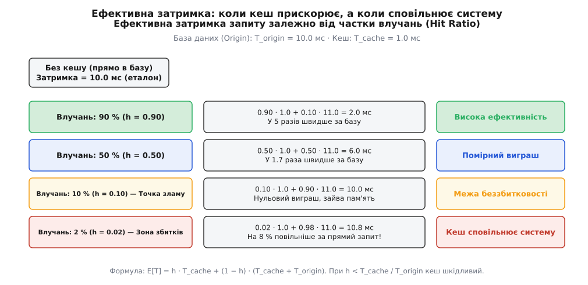
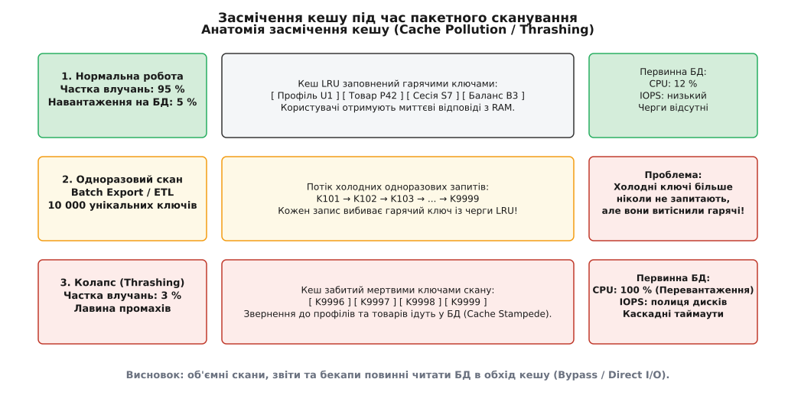
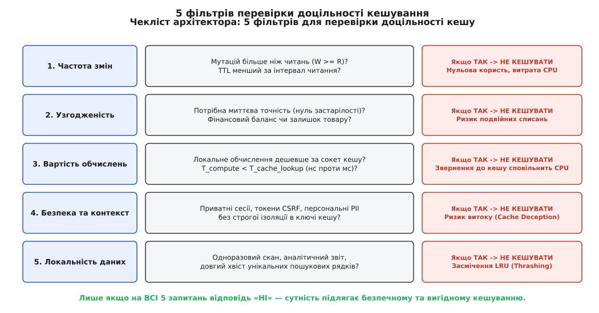

# Що НЕ кешувати і чому

<preknowlist>
- [Кеш](topic:hw-arch/cache) — швидка пам'ять із копіями гарячих даних; влучання, промах, локальність звернень.
- [Патерни кешування](topic:sf-data/caching-strategies) — Cache-Aside, Read-Through, Write-Through, Write-Behind.
- [Кеш вводить друге джерело правди (ціна)](topic:sf-data/cache-invalidation-intro) — інвалідація, розходження стану та ризики узгодженості.
- [Політики витіснення кешу: LRU, LFU, CLOCK](topic:sf-data/cache-eviction-policies) — як кеш вибирає жертву за браку місця.
</preknowlist>

Команда інтернет-магазину готується до святкового розпродажу. Щоб захистити реляційну базу даних від перевантаження, розробники встановлюють кластер Redis і кешують у ньому геть усе: залишки товарів на складі, профілі користувачів, кошики покупок, складні пошукові фільтри каталогу та сесійні токени. За п'ять хвилин після старту акції система падає:
1. Залишок останньої популярної приставки (`count = 1`) закешувався з часом життя дві секунди. За ці дві секунди двадцять покупців одночасно побачили наявність товару й оформили замовлення — магазин продав двадцять одиниць товару, маючи лише одну на складі (овербукінг).
2. Фоновий процес щохвилини формував аналітичний звіт за всіма замовленнями й зберіг 200 000 одноразових рядків у Redis. Цей масивний скан миттєво вибив із пам'яті кешу гарячі профілі користувачів.
3. Частка влучань для звичайних клієнтів обвалилася з 98 % до 3 %. Мільйон одночасних запитів ринувся напряму в первинну базу даних (Cache Stampede), заблокувавши пул з'єднань і викликавши каскадну відмову всіх мікросервісів.

Ця аварія демонструє головну ілюзію початківців: уявлення про те, що кеш є «безкоштовною срібною кулею», здатною прискорити будь-яку операцію. Насправді **кеш — це розподілений стан із ціною пам'яті, витратами на серіалізацію, затримкою мережевих сокетів і постійним ризиком розходження даних**. Якщо закешувати сутність, яка не відповідає законам локальності або вимагає абсолютної узгодженості, система стає **повільнішою, дорожчою й значно крихкішою**, ніж за умови прямого звернення до первинного сховища.

## Фізика та економіка кешу: фундаментальна нерівність

Щоб зрозуміти, чому певні сутності категорично заборонено кешувати, погляньмо на те, як виникає затримка запиту в розподіленій системі.

Коли прикладний сервіс читає дані з первинної бази даних напряму, час виконання запиту становить `T_origin`. Якщо перед базою додається кеш (наприклад, Redis), затримка залежить від частки влучань (англ. *hit ratio*) `h`:
- У разі **влучання** (з імовірністю `h`) сервіс витрачає час `T_cache` на мережевий сокет до Redis і десеріалізацію.
- У разі **промаху** (з імовірністю `1 − h`) сервіс витрачає час `T_cache` на невдалий пошук у кеші, після чого змушений виконати повний запит до бази даних `T_origin`. Сумарна затримка промаху дорівнює `T_cache + T_origin`.

Математичне сподівання затримки з кешем описується формулою:

```
E[T]
= h · T_hit + (1 − h) · T_miss
= h · T_cache + (1 − h) · (T_cache + T_origin)
= T_cache + (1 − h) · T_origin
```

Кешування дає реальне технічне прискорення лише тоді, коли `E[T] < T_origin`. Це приводить до фундаментальної умови беззбитковості:

```
T_cache + (1 − h) · T_origin < T_origin
h > T_cache / T_origin
```


*Якщо частка влучань падає нижче порогу беззбитковості h_min = T_cache / T_origin, кеш починає працювати в збиток: кожен запит виконує зайвий мережевий виклик до Redis, сповільнюючи обслуговування користувачів порівняно з прямим запитом до бази даних.*

Якщо читання з Redis займає 1.5 мс, а швидкий індексований SQL-запит у PostgreSQL — 15 мс, мінімальна частка влучань для беззбитковості складає `1.5 / 15 = 10 %`. Якщо для якоїсь сутності через рідкісні запити або часті мутації частка влучань становить лише 4 %, встановлення кешу **сповільнює роботу системи на 6 %** на кожному запиті.

Детальне виведення формул з урахуванням пуассонівського потоку мутацій, витрат процесорного часу на збирач сміття (Garbage Collector) та фінансової вартості гігабайта RAM проти NVMe SSD винесено в окремий розділ: [математична модель економіки та ефективності кешу](topic:sf-data/what-not-to-cache/math-cache-cost-model.md).

Розглянемо покроково всі категорії даних, які не можна або небезпечно піддавати кешуванню.

## Категорія 1: Високочастотні мутації без повторного читання (Write-Heavy Data)

Кеш окупає себе лише тоді, коли записане значення читають багаторазово до того, як воно застаріє або зміниться. Якщо дані оновлюються частіше, ніж їх запитують, кешування перетворюється на чисті витрати ресурсів.

Типові представники цієї категорії:
- **Координати GPS кур'єрів або транспорту в реальному часі**: водій рухається містом, і мобільний додаток надсилає координати щосекунди (`λ_w = 1.0 / с`). Клієнт відкриває екран стеження раз на дві хвилини (`λ_r = 0.008 / с`).
- **Телеметрія IoT-датчиків і показники промислового обладнання**: вібрація турбіни, температура процесора або струм мережі фіксуються кожні 50 мілісекунд.
- **Фінансові котирування (Tick Data)** на фондових біржах: ціна акції оновлюється тисячі разів на секунду.
- **Лічильники переходів і переглядів сторінок**: інкремент лічильника на кожен клік користувача.

### Механізм деградації

Розглянемо, що відбувається під капотом, коли сервіс намагається кешувати GPS-координати за шаблоном Cache-Aside:
1. Кур'єр надсилає нову координату `(lat_1, lon_1)`.
2. Сервіс оновлює базу даних і виконує операцію інвалідації або перезапису в Redis: серіалізує об'єкт у JSON, відкриває мережевий сокет, записує байти в пам'ять Redis.
3. За 500 мілісекунд кур'єр надсилає наступну координату `(lat_2, lon_2)`. Сервіс знову серіалізує JSON і перезаписує ключ у Redis.
4. Попереднє значення `(lat_1, lon_1)` так ніхто й не прочитав. Частка влучань для нього склала рівно 0 %.
5. Процесор витратив такти на дві серіалізації, мережевий адаптер обробив чотири TCP-пакети, а пам'ять Redis виконала дві алокації — і все це без жодного збереженого запиту до бази.

У системах із переважанням запису (`Write-Heavy`, де `R:W < 1:1`) спроба кешувати сутності створює подвійне навантаження на систему (Double Write Penalty).

> 🔧 **Як робити правильно.** Замість кешування окремих записів використовуйте прямий запис у спеціалізовані часові сховища (Time-Series DB: TimescaleDB, ClickHouse, InfluxDB). Якщо клієнту потрібні свіжі дані в реальному часі, організуйте пряму передачу через шину повідомлень або вебсокети (Kafka, NATS, WebSockets), де кожна нова подія транслюється підписнику без збереження проміжних копій у пам'яті кешу.

## Категорія 2: Дані без просторової та часової локальності (Одноразові скани та довгий хвіст)

Кешування фундаментально тримається на двох принципах локальності:
- **Часова локальність (Temporal Locality)**: якщо дані запитали щойно, їх із високою ймовірністю запитають знову найближчим часом.
- **Просторова локальність (Spatial Locality)**: якщо звернулися до елемента `A`, незабаром запитають сусідні елементи `A + 1`.

Якщо дані не мають жодної з цих ознак, їх поява в кеші призводить до руйнівного явища — **засмічення кешу (англ. *Cache Pollution / Thrashing*)**.

Типові сценарії відсутності локальності:
- **Пакетні вивантаження та аналітичні звіти (Batch ETL, CSV Export)**: фоновий воркер проходить по всій таблиці замовлень за рік (500 000 рядків), щоб порахувати суму податків.
- **Резервне копіювання бази даних (DB Dump / Backup)**: послідовне зчитування всіх сторінок даних.
- **Повнотекстовий пошук за унікальними рядками з високою ентропією**: мільйони унікальних комбінацій слів, помилок у наборі та фільтрів у рядку пошуку інтернет-магазину.
- **Запити до довгого хвоста каталогу (Long Tail)**: рідкісні товари, які запитують раз на кілька місяців.


*Пакетний скан витісняє гарячі ключі з кешу LRU одноразовими записами. Після завершення скану кеш містить мертві дані, а користувацький трафік спричиняє лавину запитів у базу даних.*

### Чому скан убиває навіть великий кеш

У більшості систем пам'ять кешу обмежена, тому при досягненні ліміту спрацьовує політика витіснення (наприклад, LRU — Least Recently Used). LRU виселяє той ключ, до якого найдовше не зверталися, вважаючи щойно доданий ключ найгарячішим.

Коли запускається фоновий скан на 100 000 записів:
1. Кожен прочитаний запис скану вставляється в голову черги LRU.
2. Справді гарячі дані (профілі користувачів, активні картки товарів, сесії) зсуваються в кінець черги й витісняються геть.
3. Після завершення скану в кеші залишаються 100 000 записів звіту. Оскільки звіт уже сформовано, ці записи більше **ніколи** не знадобляться жодному запиту.
4. Наступний клієнт, який заходить у свій профіль, отримує промах повз кеш. Усі мікросервіси одночасно йдуть у базу даних, викликаючи її падіння.

Щоб захистити системи від цієї вразливості, розробляють спеціальні алгоритми допуску: [фільтри допуску до кешу на базі Bloom Filter та TinyLFU](topic:sf-data/what-not-to-cache/proj-cache-admission.md).

> 🔧 **Як робити правильно.** Будь-які масові вивантаження, регламентні джоби та аналітичні звіти повинні виконуватися в режимі **прямого обходу кешу (Direct I/O / Cache Bypass)**. На рівні SQL-запитів використовуйте репліки читання (Read Replicas), курсори та прапорці, які забороняють клієнтській бібліотеці оновлювати спільний Redis.

## Категорія 3: Дані з вимогами абсолютної узгодженості (Zero-Staleness & Linearizability)

У розподілених системах кеш завжди є **другим джерелом правди**. Якщо дані зберігаються одночасно в реляційній базі даних і в Redis, між моментом зміни в базі та моментом оновлення/видалення ключа в кеші завжди існує часове вікно неузгодженості (Replication Lag / Invalidation Window).

Для багатьох бізнес-доменів читання даних із затримкою у 200 мілісекунд є неприпустимим:
- **Залишки дефіцитних товарів і бронювання місць (Inventory & Ticketing)**: продаж квитків на концерт чи місць у літаку, де фізично існує рівно одне місце.
- **Баланс банківського рахунку та транзакції списання коштів**: операції авторизації платежів, де перевірка залишку повинна гарантувати відсутність подвійного списання (Double Spending).
- **Лімити використання API та кредитні баланси під час паралельних викликів**.
- **Розподілені замки та лідерство (Leader Leases)** за відсутності кворумного узгодження.

### Механізм аварії: перегони замовлень (Race Condition)

Уявімо склад, де на залишку є рівно один ноутбук (`stock = 1`). Сервіс використовує кеш для читання залишку з TTL = 1 секунда.

1. Користувач A натискає «Купити». Сервіс читає з кешу `stock = 1` і створює транзакцію в базі.
2. Одночасно користувач B натискає «Купити». Запит користувача B приходить за 10 мілісекунд, коли база ще не зафіксувала транзакцію користувача A. Запит B читає з кешу `stock = 1`.
3. Обидва запити отримують дозвіл на списання товару.
4. Система підтверджує два замовлення на один фізичний товар.

```
Клієнт A ────► Читає кеш (Stock = 1) ───► Списує в БД (Успіх, Stock = 0)
                      ▲
                      │ Вікно застарілості (10-500 мс)
                      ▼
Клієнт B ────► Читає кеш (Stock = 1) ───► Списує в БД (Овербукінг!)
```

Спроби «полагодити» цю проблему через розподілені замки (Distributed Locks у Redis / Redlock) або двофазний коміт (2PC) призводять до того, що кеш стає **повільнішим і менш надійним, ніж одна реляційна база даних з ACID-транзакціями**: мережеві блокування, таймаути та ризик розщеплення мозку (Split-Brain) руйнують масштабованість.

> 🔧 **Як робити правильно.** Списання залишків і фінансові транзакції повинні виконуватися безпосередньо в первинній ACID-базі за допомогою атомарних операцій: `UPDATE products SET stock = stock - 1 WHERE id = 42 AND stock >= 1;`. Кешувати можна лише приблизний публічний статус товару (наприклад, прапорець `is_in_stock = true/false`), але фінальне рішення про продаж завжди ухвалює база даних.

## Категорія 4: Контекстно-залежні та безпекові дані (Security Boundaries & Cache Deception)

Кешування відповідей на рівні API-шлюзів, зворотних проксі (Reverse Proxies: NGINX, Envoy) та CDN створює серйозну загрозу безпеці, якщо відповідь залежить від контексту користувача.

До цієї групи належать:
- **Токени CSRF (Cross-Site Request Forgery)** та одноразові OTP-коди авторизації.
- **Персональні дані користувачів (PII)**: сторінки налаштувань профілю, історія медичних записів, адреси доставки.
- **Відповіді, що залежать від заголовків авторизації (`Authorization: Bearer ...`, `Cookie`)**.
- **Мультиорендні дані (Multi-Tenant Data)** за відсутності ідентифікатора орендаря (`tenant_id`) у складеному ключі кешу.

### Механізм уразливості: Web Cache Deception

Класичний сценарій витоку даних на рівні CDN або проміжного проксі:

1. Додаток має кінцеву точку `/api/user/profile`, яка повертає паспортні дані та пошту поточного авторизованого користувача на основі сесійної Cookie.
2. Зловмисник змушує жертву перейти за посиланням `/api/user/profile/avatar.css`.
3. Вебсервер ігнорує штучне закінчення `/avatar.css` і повертає JSON-профіль жертви.
4. Проміжний CDN-кеш бачить розширення `.css`, вважає відповідь публічним статичним ресурсом і зберігає її в кеші.
5. Зловмисник відкриває той самий URL `/api/user/profile/avatar.css` і отримує з кешу CDN повний приватний профіль жертви.

Аналогічна катастрофа виникає в мікросервісних бекендах, коли розробники кешують об'єкт за простим числовим ідентифікатором `user:100`, забуваючи додати `tenant_id`: компанія A раптово отримує в кеші конфіденційні звіти компанії B.

> 🔧 **Як робити правильно.** Усі приватні та сесійні ендпоінти повинні мати суворі HTTP-заголовки заборони кешування: `Cache-Control: no-store, no-cache, private, must-revalidate`. Складені ключі в Redis повинні обов'язково включати ідентифікатор орендаря та хеш прав доступу: `cache:tenant_99:user_100:v2`.

## Категорія 5: Дешеві обчислення та гігантські об'єкти (Compute vs Network & Huge Payloads)

Існує дві протилежні крайнощі в розмірі даних, які однаково згубно впливають на ефективність кешування.

### 1. Дешеві обчислення в пам'яті (Compute Cost < Network Roundtrip)
Деякі розробники намагаються кешувати в Redis результати функцій, які процесор обчислює за наносекунди:
- Форматування дати або валюти (наприклад, перетворення timestamp у ISO-рядок).
- Перевірка простих математичних формул чи обчислення хешу від короткого рядка.
- Перетворення внутрішніх Enum-статусів у локалізовані назви.

Локальне виконання функції на CPU займає **2–10 наносекунд** безпосередньо в регістрах. Мережевий виклик до Redis вимагає серіалізації, системного виклику сокета, передачі пакета по мережі комутатора та очікування відповіді — це займає **500 000 – 2 000 000 наносекунд (0.5–2 мс)**. Кешування таких операцій у віддаленому кеші сповільнює виконання функції в **200 000 разів**.

### 2. Гігантські об'єкти (Huge Payloads & Large Blobs)
Інша крайність — збереження в key-value кеші монолітних структур розміром від 10 до 100 МБ (наприклад, сирий дампи всього дерева каталогу, велетенські JSON-відповіді або нестиснені зображення).

Наслідки збереження гігантських об'єктів у Redis:
- **Фрагментація пам'яті (Memory Fragmentation)**: алокатори пам'яті (jemalloc) швидко фрагментують адресний простір, викликаючи Out-Of-Memory (OOM) навіть за наявності вільної пам'яті.
- **Блокування однопотокового ядра Redis**: передача 50-мегабайтного ключа по мережі блокує цикл подій Redis, заморожуючи обслуговування тисяч дрібних запитів інших мікросервісів.
- **Паузи збирача сміття (GC Stop-The-World)**: у Go, Java чи C# десеріалізація 50 МБ JSON створює мільйони дрібних тимчасових об'єктів у купі (Heap), викликаючи різке зростання хвостової затримки `p99`.

> 🔧 **Як робити правильно.** Для важких статичних файлів використовуйте об'єктні сховища (S3, MinIO) зі стрімінговою роздачею через CDN. Для складних дерев каталогу кешуйте компактні бінарні структури (Protocol Buffers, FlatBuffers) окремими вузлами, а не гігантським єдиним шматком JSON.

## Категорія 6: Негативні результати та транзиторні помилки (Transient Failures & Negative Caching)

Коли запит клієнта завершується помилкою, перед сервісом постає вибір: зберігати цей результат у кеші чи ні?

### Небезпека кешування транзиторних збоїв (HTTP 5xx)

Уявімо ситуацію: через короткочасне моргання мережі база даних не відповіла мікросервісу протягом 500 мілісекунд, і бекенд згенерував помилку `HTTP 500 Internal Server Error`.

Якщо сервіс автоматично зберігає всі відповіді в кеші на стандартний час (наприклад, 10 хвилин):
1. Односекундний збій мережі консервується в кеші на 10 хвилин.
2. База даних уже повністю відновилася через дві секунди, але користувачі продовжують отримувати закешовану помилку `500` протягом наступних десяти хвилин.
3. Короткочасний збій перетворюється на масштабну аварію (Failure Amplification).

```
База даних:  ───[ Збій 1 с ]──────────────── Відновлено (OK) ─────────────────►
                                                      │
Кеш:         ─────────────[ Закешовано HTTP 500 на 10 хвилин ]────────────────►
                                                      │
Користувачі: ─────────────[ Отримують помилки 10 хвилин замість 1 с ]────────►
```

### Коли негативне кешування обов'язкове (HTTP 404)

З іншого боку, повна відмова від негативного кешування відкриває вразливість до атак вичерпання ресурсів (Cache Penetration). Якщо ботнет надсилає мільйони запитів за неіснуючими ідентифікаторами (`/user/random_id_99999`), кожен такий запит пробиває кеш і навантажує базу даних.

Правильне негативне кешування підпорядковується суворим обмеженням:
- Кешувати можна **виключно детерміновані бізнес-відсутності (HTTP 404 Not Found)**.
- Час життя негативного запису повинен бути в рази коротшим за позитивний (наприклад, `TTL = 30 секунд` для 404 замість `TTL = 1 година` для 200).
- **Категорично заборонено** кешувати помилки таймаутів, збоїв підключення, блокування бази та помилки `500`, `502`, `503`, `504`.

## Анатомія збоїв у продакшені: три класичні інциденти

Розглянемо три реальні аварії у високонавантажених системах, спричинені порушенням правил вибору даних для кешування:

### 1. Витік сесій у платіжному сервісі (The Authorization Header Bleed)
Платіжний шлюз обслуговував ендпоінт перегляду збережених карток `/api/v1/user/cards`. Щоб прискорити інтерфейс, інженер додав спільний NGINX-кеш із простим ключем за URL. Заголовок `Authorization: Bearer <token>` ігнорувався в конфігурації проксі.

*Наслідок:* Перший користувач виконав вхід і переглянув свої картки. Його персональна відповідь закешувалася на 60 секунд. Наступні 150 випадкових користувачів, які зайшли на сторінку оплати протягом цієї хвилини, побачили замасковані номери карток і персональні адреси першого користувача. Інцидент призвів до аудиту безпеки та термінового відкликання токенів.

### 2. Лавинний OOM через непагіновані потоки активності (Unbounded Stream OOM)
Соціальна платформа кешувала стрічку сповіщень користувача `/api/users/{id}/notifications`. У середнього користувача в базі було 20 сповіщень (близько 8 КБ у JSON). Проте в системі існували акаунти брендів та ботів-інтеграторів із 300 000 подій (понад 65 МБ JSON).

*Наслідок:* Коли сервіс отримав запит на сповіщення великого бренду, він спробував закешувати 65 МБ одним рядком у Redis. Серіалізація заблокувала потік Node.js на 350 мс, сокет зазнав таймауту, клієнт повторив запит (Retry Storm), і паралельні алокації 65-мегабайтних буферів спричинили падіння шести мікросервісних подів через Out-Of-Memory.

### 3. Заморожування аварії під час канареечного розгортання (Canary Deploy Lock-In)
Під час розгортання оновленого мікросервісу один із подів не зміг підключитися до бази через помилку конфігурації секретів і повертав помилку `HTTP 502 Bad Gateway`. Балансувальник трафіку мав увімкнене кешування відповідей бекенду на 15 хвилин без фільтрації статусів.

*Наслідок:* Помилки `502` закешувалися для 25 % популярних карток товарів. Інженери відкотили версію мікросервісу за дві хвилини, але покупці продовжували бачити екран аварії ще 13 хвилин, поки не закінчився таймаут у Redis.

## Архітектурні альтернативи: що робити замість сліпого кешування

Коли інженер бачить повільний запит, перша реакція — загорнути його в `cache.get()` / `cache.set()`. Проте якщо сутність належить до однієї з описаних вище категорій, кешування лише замаскує архітектурний дефект або створить нові точки відмови.

Розглянемо чотири надійні інженерні альтернативи для сценаріїв, де кеш заборонений:

### 1. Оптимізація моделі даних та індексів у первинній БД
Якщо запит до бази виконується 200 мілісекунд через послідовне сканування таблиці (Sequential Scan), додавання B-Tree чи BRIN індексу скорочує час виконання до 0.5 мілісекунди. Запит стає настільки швидким, що потреба в проміжному кеші зникає взагалі, а система позбавляється другого джерела правди.

### 2. Пакетна коалесценція записів (Write Buffering & Coalescing)
Для високочастотних мутацій (лічильники, аналітичні кліки, телеметрія) замість кешування окремих значень застосовують локальне накопичення в пам'яті процесу. Робочий потік збирає 1000 інкрементів лічильників у локальний буфер і раз на секунду скидає сумарний дельта-зріз до бази даних одним пакетним викликом:
```
UPDATE page_views SET views = views + 1000 WHERE page_id = 42;
```
Це зменшує навантаження на базу на три порядки без ризику розходження кешу.

### 3. Реплікація читання та колонкові сховища (Read Replicas & OLAP)
Для важких аналітичних звітів і сканів виділяють асинхронні репліки читання (Read Replicas) або організують потокову реплікацію (Change Data Capture через Debezium) до колонкових сховищ (ClickHouse, Snowflake). Це дозволяє виконувати вивантаження будь-якого обсягу без ризику витіснення гарячих даних із транзакційного контуру.

### 4. Патерн Singleflight (Mutex Coalescing)
Якщо сотні конкурентних клієнтів одночасно запитують дорогий некешований ресурс, замість кешування застосовують патерн **Singleflight**. Перший потік ініціює обчислення в базі, а решта 99 потоків підписуються на очікування його результату через блокувальний примітив або канал. Виконується рівно один запит до бази даних, результат якого одночасно віддається всім очікуючим клієнтам.

## Психологічна пастка: чому кешування «про всяк випадок» маскує дефекти

Найнебезпечніший патерн виникає за кілька днів до запуску продукту, коли навантажувальне тестування показує незадовільну затримку API. Замість профілювання повільних запитів, оптимізації структури таблиць чи додавання пропущених індексів команда поспіхом огортає всі ендпоінти в шар Redis-кешу.

Це створює небезпечну оману добробуту:
- На синтетичних тестах із кількома десятками повторюваних ключів частка влучань штучно досягає 99 %, і графіки затримки виглядають ідеально.
- Коли реальні користувачі починають надсилати мільйони різноманітних запитів із довгим хвостом, частка влучань падає до реальних 5 %.
- Неоптимізована первинна база даних, яка так і залишилася повільною через відсутність індексів, миттєво захлинається під реальними промахами.

Кешування повинно бути свідомим рішенням для оптимізації масштабованості вже налагодженої системи, а не способом замаскувати архітектурні дефекти бази даних перед релізом.

## Діагностика у Prometheus: метрики «шкідливого кешу»

Щоб виявити сутності, які помилково потрапили в кеш і деградують інфраструктуру, на дашбордах Grafana відстежують чотири критичні метрики:

- **`cache_hit_ratio{keyspace="..."}`**: якщо частка влучань для окремого простору ключів тримається нижче 10 %, цей тип даних є кандидатом на негайне вилучення з кешу.
- **`cache_eviction_rate / cache_hit_rate`**: якщо швидкість витіснення ключів перевищує швидкість успішних читань, у системі відбувається постійне вибивання гарячого набору (Thrashing).
- **`cache_mutation_rate / cache_read_rate`**: співвідношення оновлень до читань більше за 1.0 вказує на марне спалювання пам'яті під високочастотні мутації.
- **`redis_mem_fragmentation_ratio`**: зростання коефіцієнта фрагментації вище 1.5 свідчить про наявність гігантських нестандартизованих об'єктів у кеші.

## Чекліст архітектора: 5 фільтрів доцільності кешування

Перед тим як додати будь-яку сутність у кеш, пропустіть її крізь послідовність із п'яти фільтрів ухвалення рішень:


*Якщо сутність не проходить хоча б один із п'яти бар'єрів, вона не підлягає кешуванню. Замість кешу застосовують оптимізацію індексів, реплікацію або прямий стрімінг.*

### Матриця перевірки

1. **Фільтр частоти мутацій**: чи перевищує кількість читань кількість записів щонайменше в 5 разів (`R:W ≥ 5:1`)?
   - *Ні* → **НЕ КЕШУВАТИ**. Висока частота інвалідацій знецінить кеш.
2. **Фільтр вимог до узгодженості**: чи припустима затримка інвалідації навіть на 100 мс без фінансових втрат чи овербукінгу?
   - *Ні* → **НЕ КЕШУВАТИ**. Читайте напряму з ACID-бази через оптимістичні або песимістичні блокування.
3. **Фільтр вартості обчислень**: чи займає розрахунок або запит до бази більше часу, ніж мережевий сокет до Redis (`T_compute > 2 мс`)?
   - *Ні* → **НЕ КЕШУВАТИ**. Локальне виконання на CPU набагато швидше за мережу.
4. **Фільтр безпеки та контексту**: чи є відповідь повністю публічною або строго ізольованою за складеним ключем із правами орендаря?
   - *Ні* → **НЕ КЕШУВАТИ**. Ризик витоку персональних даних між сесіями.
5. **Фільтр просторової та часової локальності**: чи існує висока ймовірність повторного запиту того самого ключа (розподіл Зіпфа), а не одноразовий скан?
   - *Ні* → **НЕ КЕШУВАТИ**. Використовуйте фільтри допуску або прапорці обходу кешу (Bypass).

Лише тоді, коли сутність успішно проходить усі п'ять бар'єрів, кешування стає надійним і високорентабельним архітектурним рішенням.
