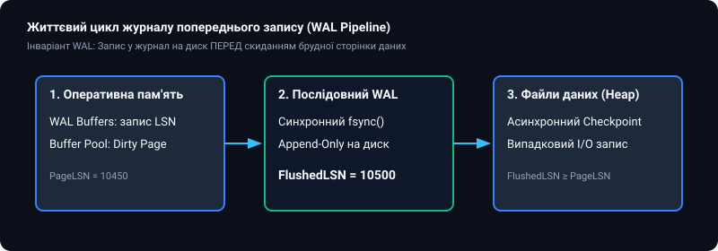
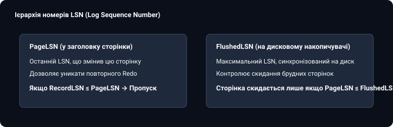
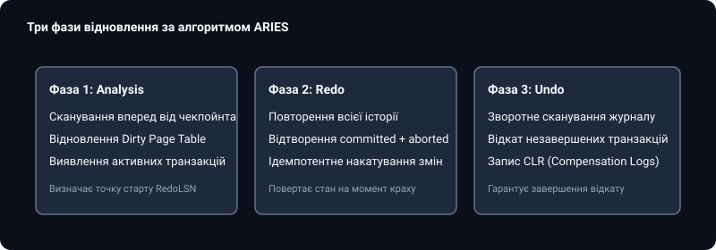

# 📜 Журнал попереднього запису (WAL) та протокол ARIES

<preknowlist>
- [Реляційна модель даних](root:sf-data/relational-model)
- [Індекси баз даних: B-Tree та Hash](root:sf-data/database-indexes)
- [Транзакції та властивості ACID](root:sf-data/transactions-acid)
- [Рівні ізоляції транзакцій](root:sf-data/isolation-levels)
- [Багатоверсійне керування конкурентним доступом (MVCC)](root:sf-data/mvcc)
</preknowlist>

Головне протиріччя в архітектурі реляційних систем керування базами даних полягає у несумісності вимог до високої швидкодії та гарантій довговічності (Durability) за стандартом ACID. З одного боку, сучасні бази даних обробляють десятки тисяч запитів на секунду, зберігаючи модифіковані дані у швидкій енергозалежній оперативній пам'яті (Buffer Pool). З іншого боку, в разі раптового зникнення електроживлення або краху операційної системи всі незбережені зміни в RAM безповоротно зникають.

Прямий запис кожної зміненої сторінки розміром 8 КБ на диск у момент виконання команди `COMMIT` є катастрофічно повільним: він вимагає випадкового доступу до різних ділянок файлової системи (Random I/O), що швидко вичерпує ресурс дискового контролера.

Розв'язанням цієї фундаментальної проблеми став **журнал попереднього запису (Write-Ahead Logging, WAL)**. Замість важкого скидання випадкових сторінок даних на диск, рушій СУБД формує компактний, строго послідовний журнал змін і синхронізує його на енергонезалежний носій.


*Життєвий цикл запису WAL: випереджальна фіксація в журналі перед скиданням брудних сторінок Buffer Pool*

---

### Фундаментальний інваріант WAL та фізіологічне журналювання

Основою надійності журналу є так званий **інваріант WAL (Write-Ahead Logging Invariant)**:

> **Жодна брудна сторінка з пулу буферів не може бути записана на постійний диск раніше, ніж відповідний запис журналу змін буде скинуто через системний виклик `fsync()`.**

Якщо операційна система скине брудну сторінку на диск до запису у WAL, а після цього станеться збій живлення, система не зможе відкотити непідтверджені зміни, що призведе до незворотного пошкодження цілісності бази даних.

#### Еволюція форматів журналювання

1. **Фізичне журналювання (Physical Logging)**: Зберігає побайтовий образ сторінки «до» та «після» зміни. Гарантує найвищу надійність, але створює гігантський надлишковий обсяг дискового трафіку.
2. **Логічне журналювання (Logical Logging)**: Зберігає вихідні SQL-команди (наприклад, `UPDATE accounts SET balance = balance + 100`). Журнал має мінімальний розмір, проте не забезпечує детермінізму при паралельному виконанні та ускладнює відновлення внутрішніх дерев'яних індексів.
3. **Фізіологічне журналювання (Physiological Logging)**: Сучасний стандарт, що поєднує фізичну адресацію сторінки (Page ID) із логічним описом операції над кортежем усередині цієї сторінки. Дозволяє ефективно підтримувати рядкові блокування та паралельне оновлення B-Tree індексів без необхідності логування масивних дискових сторінок.

---

### Фізична організація сегментів WAL та каталог pg_wal

У PostgreSQL журнал зберігається у спеціальному підкаталозі кластера `pg_wal` (у версіях до PostgreSQL 10 вона мала назву `pg_xlog`). Журнал розбивається на окремі файли фіксованого розміру (за замовчуванням 16 МБ).

Кожен файл сегмента має 24-символьне шістнадцяткове ім'я, наприклад:

```text
00000001000000A10000003F
```

Це ім'я складається з трьох 8-значних компонентів:
* **Timeline ID (8 символів)**: Ідентифікатор часової лінії (`00000001`). Змінюється при аварійному відновленні Point-in-Time Recovery (PITR) або підвищенні репліки до статусу майстра, що захищає базу даних від конфліктів розгалуження історії.
* **Логічний номер журналу (8 символів)**: Старша частина зміщення LSN.
* **Номер 16-мегабайтного сегмента (8 символів)**: Порядковий номер файлу всередині поточного логічного сегмента.

Рушій постійно підтримує кільцевий пул сегментів. Коли файл повністю заповнюється, процес Checkpointer або Archiver перейменовує старий непотрібний сегмент для повторного використання, уникаючи накладних витрат файлової системи на видалення та створення нових дискових блоків.

---

### Ієрархія номерів послідовності журналу (LSN)

Кожен запис, що потрапляє до журналу WAL, отримує унікальний, монотонно зростаючий 64-бітний числовий ідентифікатор — **Log Sequence Number (LSN)**. Номер LSN фактично позначає точний байтовий зсув запису від самого початку файлового потоку журналу.

У системі діє сувора ієрархія номерів LSN:

* **`PageLSN`**: Записується в системний заголовок кожної фізичної сторінки таблиці чи індексу. Позначає LSN останнього запису в журналі, який вніс зміни до цієї конкретної сторінки.
* **`FlushedLSN`**: Глобальний лічильник у пам'яті СУБД, що вказує максимальний LSN, який вже гарантовано скинуто на дисковий носій через `fsync()`.


*Контроль інваріанту через порівняння PageLSN сторінки та FlushedLSN журналу*

Перед тим як виштовхнути будь-яку брудну сторінку з оперативної пам'яті на диск, фоновий процес фонового запису (Background Writer) перевіряє умову:

```text
Якщо PageLSN <= FlushedLSN:
    Дозволити запис сторінки на диск
Інакше:
    Викликати примусовий скид WAL до PageLSN, і лише потім записати сторінку
```

Математичні доведення коректності інваріанту та властивості ідемпотентності наведено у вставці [Математична формалізація протоколу ARIES та доказ коректності](root:sf-data/write-ahead-log/math-recovery-correctness.md).

---

### Пакетна синхронізація транзакцій (Group Commit)

При виконанні команди `COMMIT` кожна транзакція вимагає гарантованого скидання своїх журнальних записів на диск. Проте виклик `fsync()` є надзвичайно дорогою операцією, яка змушує магнітний диск або SSD скидати внутрішні кеші, що зазвичай займає від 0.5 до 5 мілісекунд.

Якщо кожна з 5 000 паралельних транзакцій викликатиме власний `fsync()`, система зможе обробити лише кілька сотень операцій на секунду через жорстке апаратне обмеження IOPS.

Для усунення цього вузького місця використовується алгоритм **Group Commit**:

1. Перша транзакція, яка викликає `COMMIT`, стає **лідером групи (Group Leader)**.
2. Поки лідер готується до системного виклику, решта паралельних транзакцій реєструються як учасники групи (Followers) і переходять у стан очікування на умовній змінній.
3. Лідер виконує **один єдиний виклик `fsync()`**, скидаючи на диск сумарний буфер, що містить журнальні записи всіх зареєстрованих учасників групи.
4. Лідер пробуджує всіх учасників черги, повідомляючи про успішне завершення їхніх транзакцій.


*Об'єднання десятків транзакцій в один дисковий виклик fsync завдяки Group Commit*

Завдяки Group Commit пропускна здатність підсистеми запису зростає на порядки за умов високого паралелізму.

---

### Трифазний алгоритм відновлення ARIES

Сучасний стандарт відновлення баз даних після аварійних збоїв базується на алгоритмі ARIES, створеному Сі Моханом у дослідницькому центрі IBM Almaden. Історія розробки протоколу детально викладена в історичному нарисі [Історія створення ARIES: революція Сі Мохана в IBM Almaden](root:sf-data/write-ahead-log/hist-aries-mohan.md).

Алгоритм ARIES виконує відновлення у три чіткі послідовні фази:


*Послідовність виконання фаз Analysis, Redo та Undo при старті СУБД після краху*

#### 1. Фаза аналізу (Analysis Phase)
* Сканує журнал WAL уперед, починаючи від останньої зафіксованої контрольної точки (Checkpoint).
* Відновлює стан системи на момент падіння: формує таблицю транзакцій (Transaction Table), що були активними під час збою, та таблицю брудних сторінок (Dirty Page Table, DPT).
* Визначає найменше значення `RecLSN` серед усіх брудних сторінок — точку, з якої має розпочатися наступна фаза Redo.

#### 2. Фаза накатування (Redo Phase — Repeating History)
* Сканує журнал уперед від знайденого `RedoLSN` до самого кінця файлу журналу.
* Повторює абсолютно всі операції (навіть тих транзакцій, які пізніше були відкочені або не встигли завершитися).
* Якщо $LSN$ запису менший або рівний $PageLSN$ на сторінці, оновлення пропускається. Це забезпечує повну ідемпотентність.
* Наприкінці фази Redo фізичний стан сторінок у пам'яті точно відповідає стану на мікросекунду перед аварійним вимкненням.

#### 3. Фаза скасування (Undo Phase)
* Сканує журнал у зворотному напрямку, відкочуючи всі дії транзакцій, які залишилися незавершеними (були активними на момент краху).
* Для кожної скасованої дії записує в журнал спеціальний **компенсаційний запис (Compensation Log Record, CLR)**.
* Запис CLR містить покажчик `UndoNextLSN`, що унеможливлює повторний відкат при повторних збоях під час самого процесу відновлення.

#### Алгоритмічна реалізація фаз відновлення

Нижче наведено базовий скелет сканування журналу під час відновлення:

:::tabs
@tab C
```c
#include <stdint.h>
#include <stdbool.h>
#include <stdio.h>

typedef uint64_t LSN;

typedef struct {
    LSN lsn;
    LSN prev_lsn;
    LSN undo_next_lsn;
    uint32_t xid;
    uint32_t type;
    uint32_t page_id;
    int32_t new_val;
} WalRecord;

void aries_redo_scan(WalRecord *log, size_t count, int32_t *pages, LSN *page_lsns) {
    for (size_t i = 0; i < count; ++i) {
        WalRecord *rec = &log[i];
        // Перевірка ідемпотентності: застосовуємо лише якщо LSN запису новіший за PageLSN
        if (rec->lsn > page_lsns[rec->page_id]) {
            pages[rec->page_id] = rec->new_val;
            page_lsns[rec->page_id] = rec->lsn;
            printf("Redo: застосовано LSN %llu до сторінки %u\n", (unsigned long long)rec->lsn, rec->page_id);
        }
    }
}
```
@tab C++
```cpp
#include <vector>
#include <iostream>
#include <cstdint>

using LSN = uint64_t;

struct WalRecord {
    LSN lsn{0};
    LSN prev_lsn{0};
    LSN undo_next_lsn{0};
    uint32_t xid{0};
    uint32_t page_id{0};
    int32_t new_val{0};
};

void aries_redo_scan(const std::vector<WalRecord>& log, std::vector<int32_t>& pages, std::vector<LSN>& page_lsns) {
    for (const auto& rec : log) {
        if (rec.lsn > page_lsns[rec.page_id]) {
            pages[rec.page_id] = rec.new_val;
            page_lsns[rec.page_id] = rec.lsn;
            std::cout << "Redo: застосовано LSN " << rec.lsn << " до сторінки " << rec.page_id << "\n";
        }
    }
}
```
:::

Практична побудова повноцінного рушія відновлення доступна у проєкті [Розробка міні-рушія відновлення WAL за протоколом ARIES](root:sf-data/write-ahead-log/proj-mini-wal-engine.md).

---

### Контрольні точки (Checkpoints) та захист від розірваних сторінок (Torn Pages)

Без періодичного очищення журналу обсяг файлів WAL зростав би безкінечно, а час відновлення бази даних після краху сягав би багатьох годин.

Для обмеження часу відновлення використовується механізм **нечітких контрольних точок (Fuzzy Checkpointing)**:
1. Процес Checkpointer фіксує поточний $CheckLSN$ і зчитує список усіх брудних сторінок.
2. Процес плавно записує накопичені брудні сторінки на диск, не блокуючи виконання паралельних транзакцій.
3. Після завершення скидання сторінок позиція контрольної точки записується у файл керування (`global/pg_control`). Усі сегменти WAL, старіші за цю точку, можуть бути безпечно видалені або перейменовані для повторного використання.

#### Проблема розірваних сторінок (Torn Page Problem)
Сторінка бази даних зазвичай має розмір 8 КБ, тоді як розмір атомарного сектора запису жорсткого диска або файлової системи становить 512 байт або 4 КБ. Якщо в момент запису 8-кілобайтної сторінки відбувається раптове вимкнення живлення, на диск записується лише частина сторінки (наприклад, перші 4 КБ нової версії та другі 4 КБ старої).

Така сторінка стає фізично пошкодженою, і стандартне фізіологічне Redo-накатування не може бути виконане через невідповідність заголовків і зміщень.

Для захисту від цієї загрози у PostgreSQL використовується механізм **`full_page_writes`**:
* Під час першої модифікації сторінки після створення чергового чекпойнта рушій записує в журнал WAL її **повний побайтовий зліпок розміром 8 КБ**.
* Якщо під час краху сторінка на диску буде розірвана, процедура відновлення ARIES візьме її цілісний повносторінковий образ із WAL, відновить початковий стан сторінки, і лише потім почне покрокове накатування дельт.

Повний перелік параметрів налаштування чекпойнтів, розмірів журналів та діагностичних запитів представлено у вставці [Довідник конфігурації та моніторингу WAL і Redo Log](root:sf-data/write-ahead-log/api-wal-configuration.md).

---

### Підсумкові інженерні правила експлуатації WAL

1. **Баланс між надійністю та латентністю**: У критичних фінансових модулях завжди використовуйте `synchronous_commit = on` (`innodb_flush_log_at_trx_commit = 1`). Для некритичних аналітичних черг або логів метрик вимикайте синхронне скидання для отримання максимального IOPS.
2. **Згладжування навантаження чекпойнтів**: Встановлюйте `checkpoint_completion_target = 0.9`, щоб розтягнути запис брудних сторінок на весь інтервал між контрольними точками та уникнути просідання пропускної здатності дискової підсистеми.
3. **Заборона вимикання `full_page_writes`**: Ніколи не вимикайте прапорець `full_page_writes` у виробничих середовищах, якщо файлова система не гарантує атомарного 8-кілобайтного запису на апаратному рівні.
4. **Використання алгоритмів стиснення WAL**: Увімкнення `wal_compression = lz4` або `zstd` дозволяє значно розвантажити пропускну здатність дискової підсистеми без створення суттєвого навантаження на центральний процесор.
5. **Моніторинг залишку дискового простору для реплікації**: Завжди налаштовуйте моніторинг розміру утриманого журналу на слотах реплікації, щоб уникнути переповнення дискового накопичувача `pg_wal` у разі аварії на вузлах Standby.
