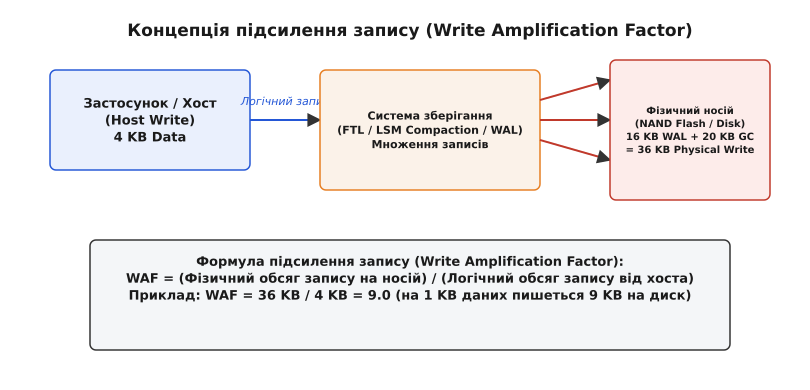
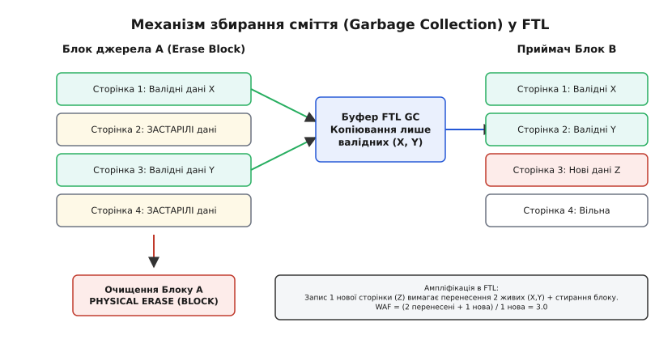
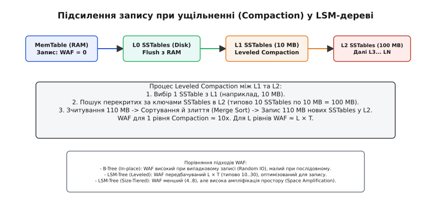

# Коефіцієнт підсилення запису (Write Amplification Factor)

<preknowlist>
- [FTL та трансляція адрес](root:sf-data/ftl-flash-translation) — поняття сторінки (Page), блоку стирання (Erase Block) та збирання сміття у флеш-пам'яті.
- [LSM-дерева](root:sf-data/lsm-tree) — структура з додаванням у кінець (append-only), MemTable, SSTable та процес ущільнення (Compaction).
- [B-дерева](root:sf-algorithms/binary-search-tree) — оновлення за місцем (in-place modification) та розщеплення вузлів.
- [Вирівнювання зносу](root:sf-data/wear-leveling) — розподіл циклів стирання (P/E cycles) між блоками NAND Flash.
</preknowlist>

Уявіть, що ви приносите до бібліотеки нову книжку на 100 сторінок із проханням поставити її на полицю. Замість того, щоб просто приставити нову книжку на вільне місце, бібліотекар бере цілу шафу на 10 000 книжок, зчитує назви кожної з них, виносить усі 10 000 книжок у коридор, спалює порожню шафу, будує нову шафу і розставляє назад 10 001 книжку. Зусилля, витрачені на розміщення однієї книжки, перевищили розмір самої книжки в тисячі разів.

Саме цей феномен у комп'ютерній інженерії називається **коефіцієнтом підсилення запису** (Write Amplification Factor, WAF). Він виникає тоді, коли логічна модифікація невеликого фрагмента даних змушує нижчележачу систему — чи то контролер SSD, чи то двигун бази даних — переписувати набагато більші обсяги фізичного носія.


*Співвідношення між логічним записом застосунку та фізично індукованими записами носія.*

Розуміння WAF є межею між абстрактним програмуванням, де пам'ять вважається безкінечною та безкоштовною, і реальною системною інженерією, де неконтрольований WAF руйнує твердотільні накопичувачі за кілька місяців, створює тривалі паузи в обробці транзакцій (P99 tail latency spikes) та обмежує пропускну здатність розподілених сховищ.

Детальний аналіз виникнення поняття у процесі розвитку промислових накопичувачів та СУБД наведено у вставці [📜 Еволюція терміна Write Amplification: від флеш-накопичувачів до розподілених СУБД](root:sf-data/write-amplification/hist-waf-origins.md).

---

## 1. Першопричина: Асиметрія читання, запису та стирання

Щоб зрозуміти, чому виникає підсилення запису, необхідно повернутися до фізичних першопричин двох ключових класів носіїв та структур даних: напівпровідникової пам'яті NAND Flash та дискових структур впорядкування.

### Фізична асиметрія NAND Flash

На відміну від оперативної пам'яті (DRAM), у якій будь-який байт можна переписати незалежно в будь-який момент часу, осередки плаваючого затвора (Floating Gate) або пастки заряду (Charge Trap) у NAND Flash мають жорсткі фізичні обмеження. У сучасній багатошаровій пам'яті (3D NAND TLC та QLC) один фізичний осередок зберігає від 3 до 4 бітів інформації за рахунок кодування 8 або 16 різних рівнів електричної напруги (Vth states). Фізичний устрій кристала вимагає трьох дискретних за розміром операцій:

1. **Операція читання (Read)** виконується на рівні **сторінки** (Page, типово 4 KB, 8 KB або 16 KB). Зчитування полягає у вимірюванні порогової напруги осередків уздовж одного рядка слів (Wordline).
2. **Операція запису (Program)** також виконується на рівні **сторінки**, але лише у ті осередки, які заздалегідь знаходяться у повністю стираному стані (логічна 1 для всіх бітів). Запис виконується імпульсами високої напруги (Fowler-Nordheim tunneling), які інжектують електрони в пастку заряду.
3. **Операція стирання (Erase)** можлива **виключно на рівні блоку стирання** (Erase Block), який складається з 128, 256 або 512 сторінок (від 2 MB до 16 MB). Стирання подає зворотний високовольтний імпульс на всю підкладку кристала, витягуючи електрони з усіх осередків блоку одночасно.

Коли застосунок змінює 512 байтів у файлі, фізичний носій не може перезаписати відповідні транзистори на місці. Якщо сторінка вже містить дані, для зміни хоча б одного біта потрібно стирати весь блок. Але якщо витерти весь блок одразу, будуть знищені сусідні сторінки, які містять інші важливі дані.

Тому шар трансляції флеш-пам'яті (Flash Translation Layer, FTL) застосовує алгоритм out-of-place update (запис у нове місце):
- Нові дані записуються у вільну сторінку іншого стираного блоку.
- У внутрішній таблиці адресації FTL логічна адреса (LBA) перенаправляється на нову фізичну адресу (PBA).
- Стара фізична сторінка позначається як застаріла або невалідна (invalid).

З часом накопичувач заповнюється сумішшю валідних та невалідних сторінок. Коли вільні блоки вичерпуються, контролер змушений запускати фоновий процес **збирання сміття** (Garbage Collection, GC).


*Процес перенесення живих сторінок під час стирання блоків у NAND Flash.*

Процес Garbage Collection зчитує всі збережені валідні сторінки з частково заповненого блоку, копіює їх у новий блок, і лише після цього стирає старий блок. 

### Невирівняний запис (Unaligned Writes) та невідповідність секторів

Додатковим фізичним джерелом апаратного підсилення запису є невідповідність між розмірами логічних секторів операційної системи та фізичних сторінок NAND Flash:

- Операційна система або застаріле програмне забезпечення може надсилати записи, вирівняні по логічних секторах 512 байтів.
- Якщо запис розміром 4 KB починається з непарного зміщення (наприклад, з 512-го байта замість межі 4096 байтів), цей запис перетинає межу двох фізичних сторінок SSD.
- Контролер SSD змушений зчитати дві суміжні фізичні сторінки, модифікувати їх у внутрішньому буфері та записати назад дві повні фізичні сторінки. Невирівняний 4 KB запис перетворюється на 32 KB фізичного запису, створюючи миттєвий WAF = 8.0 лише через розсинхронізацію меж сторінок.

> 🔧 **Навіщо це.**
> Якщо ви пишете високонавантажений сервіс запису (наприклад, логувальник подій або брокер повідомлень), ігнорування розміру сторінки носія та невирівняний I/O призведуть до того, що на кожні 100 MB корисних даних SSD перепише 500 MB внутрішніх сторінок. Це скорочує термін служби накопичувача у 5 разів та створює раптові затримки в I/O.

---

## 2. Два рівні підсилення: Програмне (DB WAF) та Апаратне (Hardware WAF)

У реальних інфраструктурах зберігання даних підсилення запису завжди відбувається на двох незалежних рівнях, які множаться один на одного.

```
Total WAF = Database WAF × FTL WAF
```

```
                        [Застосунок / App]
                                │ (10 MB Logical Writes)
                                ▼
                   ┌─────────────────────────┐
                   │  СУБД (RocksDB/InnoDB)  │
                   └─────────────────────────┘
                                │ (150 MB File System Writes) -> DB WAF = 15.0
                                ▼
                   ┌─────────────────────────┐
                   │  OS Page Cache / VFS    │
                   └─────────────────────────┘
                                │ (150 MB Block I/O)
                                ▼
                   ┌─────────────────────────┐
                   │  SSD Controller / FTL   │
                   └─────────────────────────┘
                                │ (450 MB NAND Flash Writes) -> FTL WAF = 3.0
                                ▼
                       [NAND Flash Memory]
                                Total WAF = 15.0 × 3.0 = 45.0
```

### Рівень 1: Програмне підсилення запису (Database / Software WAF)

Визначається як відношення обсягу даних, записаних файловою системою на диск, до логічного обсягу даних, відправлених застосунком у СУБД:

```
WAF_software = Bytes_written_to_storage_by_software / Bytes_written_by_user
```

Джерела програмного підсилення у СУБД та файлових системах:
- **Журналювання передзапису (Write-Ahead Logging, WAL)**: кожна транзакція записується у послідовний лог для забезпечення властивостей ACID, а потім додатково модифікує основні структури даних.
- **Буфер подвійного запису (Doublewrite Buffer)**: для запобігання частковому розриву сторінок (torn pages) при раптовому вимкненні живлення такі СУБД, як MySQL InnoDB, спочатку копіюють модифіковані 16 KB сторінки у суцільну зону doublewrite buffer, і лише після цього скидають їх у відповідні дискові файли.
- **Журналювання файлових систем (EXT4 / XFS / Btrfs)**: режими журналювання ext4 (наприклад, `data=journal`) копіюють і метадані, і самі дані у журнал файлової системи, що подвоює WAF на рівні ядра операційної системи. Файлові системи класу Copy-on-Write (Btrfs, ZFS) при кожній модифікації каскадно переписують дерево метаданих аж до суперблоку (Uberblock).
- **Перезапис сторінок на місці (In-place B-Tree modification)**: зміна первинного ключа чи одного рядка розміром 50 байтів змушує СУБД скидати на диск усю сторінку вузла B-дерева (4 KB, 8 KB або 16 KB).

### Рівень 2: Апаратне підсилення запису (Hardware / FTL WAF)

Визначається як відношення обсягу байтів, фізично записаних у кристали NAND Flash, до обсягу байтів, переданих хостом через інтерфейс NVMe/SATA:

```
WAF_hardware = Bytes_written_to_NAND_flash / Bytes_written_by_host_controller
```

Джерела апаратного підсилення у SSD:
- **Збирання сміття (Garbage Collection)** у FTL при евакуації живих сторінок із віктимних блоків.
- **Скидання з SLC-кешу (SLC Cache Folding)**: гібридні SSD спочатку приймають записи у швидкий SLC-режим (1 біт на осередок). Коли SLC-буфер заповнюється, контролер зчитує ці сторінки та перегруповує їх для запису в щільний TLC/QLC масив (3 або 4 біти на осередок), що генерує повторний фізичний запис.
- **Вирівнювання зносу (Wear Leveling)**: переміщення статичних (холодних) даних із блоків із малою кількістю циклів стирання у блоки з високим зносом, щоб рівномірно вичерпувати ресурс осередків по всьому кристалу.
- **Свопінг таблиць трансляції FTL**: у накопичувачах великої ємності таблиця трансляції LBA-to-PBA не вміщується повністю в DRAM контролера і частково підкачується з кристалів NAND.

---

## 3. Вплив структур даних на підсилення запису: B-Tree проти LSM-Tree

Архітектурний вибір структури даних для зберігання є головним чинником, що визначає рівень програмного WAF у базах даних.

### In-Place Mutation у B-деревах

У класичних B-деревах та B+ деревах (які використовуються у PostgreSQL, SQLite, MySQL InnoDB) вузли дерева відповідають дисковим сторінкам фіксованого розміру. 

Коли відбувається операція запису (UPDATE або INSERT):
1. Пошук знаходить відповідний листок B-дерева.
2. Модифікація виконується безпосередньо у пам'яті (у буферному пулі).
3. Під час скидання брудних сторінок (dirty page flush) вся сторінка розміром P байтів записується на диск.
4. Якщо вставка спричиняє розщеплення вузла (Node Split), СУБД аллокує нову сторінку, переподіляє ключі навпіл і модифікує батьківський вузол, що викликає перезапис одразу трьох сторінок.

Якщо розмір запису дорівнює r, а розмір сторінки P, то для випадкових записів підсилення становить:

```
WAF_btree ≈ P / r
```

Для запису 64 байтів при розмірі сторінки 16 KB:

```
WAF_btree = 16384 / 64 = 256.0
```

Якщо додати обов'язковий запис у WAL (64 байти) та Doublewrite Buffer (16 KB), підсилення зростає до значення WAF ≈ 513.0.

### Append-Only та Compaction у LSM-деревах

LSM-дерево (Log-Structured Merge-tree), яке лежить в основі RocksDB, LevelDB, Apache Cassandra та ClickHouse, усуває проблему випадкового перезапису сторінок шляхом повного відмови від модифікації даних на місці.

Усі нові записи потрапляють у послідовний файл WAL та оперативну пам'ять MemTable. Коли MemTable заповнюється, вона скидається на диск як незмінний файл SSTable (Sorted String Table) на рівні L0.


*Підсилення запису при ущільненні (Compaction) у LSM-дереві.*

Проте LSM-дерево переносить навантаження запису на фоновий процес **ущільнення (Compaction)**:
- На кожному рівні L_i файли впорядковані за ключами.
- Коли обсяг даних на рівні L_i перевищує ліміт, фонові потоки зчитують файли з L_i, зливають їх із перекритими файлами рівня L_(i+1) за допомогою алгоритму Merge Sort і записують нові впорядковані файли на рівень L_(i+1).

Математичні моделі та точні аналітичні межі для оцінки WAF під час ущільнення в LSM-деревах і збиранні сміття FTL виведено у вставці [🧮 Математичні моделі та виведення меж Write Amplification Factor](root:sf-data/write-amplification/math-waf-bounds.md).

### Концепція RUM-теореми (Read, Update, Memory Conjecture)

У 2016 році дослідники з Гарвардського університету формалізували гіпотезу RUM (RUM Conjecture). Вона стверджує, що будь-яка структура даних для зберігання оптимізує максимум дві з трьох величин, завжди жертвуючи третьою:
- **Read Amplification (R)**: кількість фізичних сторінок, зчитаних для пошуку одного ключа.
- **Update / Write Amplification (U / W)**: кількість фізичних байтів, записаних при вставці ключа.
- **Memory / Space Amplification (M / S)**: відношення обсягу дискового простору, зайнятого структурою, до чистого розміру даних.

```
                  Read Amplification (R)
                          ▲
                         / \
                        /   \
                       /     \
                      /   *   \  <- Неможливо мінімізувати всі три одночасно!
                     /         \
                    /           \
  Write Amplification (W) ────── Space Amplification (S)
```

B-дерева оптимізують Read (R ≈ 1) та Space (S ≈ 1.2), але мають жахливий Write (W ≈ 40–100+).
LSM Leveled оптимізує Read (завдяки Bloom filters) та Space (S ≈ 1.1), але має помірний Write (W ≈ 10–30).
LSM Size-Tiered оптимізує Write (W ≈ 2–8), але жертвує Read (R високий) та Space (S ≈ 2.0).

---

## 4. Потрійний удар високого WAF: Ресурс, Пропускна здатність, Затримки

Високий коефіцієнт WAF не є суто теоретичною абстракцією. Він має три конкретні інженерні наслідки, які безпосередньо впливають на розгортання та експлуатацію систем у продакшені.

### 1. Виснаження ресурсу накопичувачів (Endurance & TBW)

Кожен осередок NAND Flash витримує лише обмежену кількість циклів стирання й програмування (P/E cycles):
- SLC (Single-Level Cell): ≈ 50 000 – 100 000 P/E циклів.
- TLC (Triple-Level Cell): ≈ 1000 – 3000 P/E циклів.
- QLC (Quad-Level Cell): ≈ 100 – 1000 P/E циклів.

Ресурс SSD вимірюється в TBW (Terabytes Written — загальний обсяг терабайтів, які можна записати на накопичувач за його життя).

Припустимо, що накопичувач ємністю 1 TB має ресурс 600 TBW.
Якщо застосунок пише дані з швидкістю 20 MB/s:
- При WAF = 1.0 обсяг запису на день дорівнює: `20 MB/s × 86400 s ≈ 1.72 TB/day`. Накопичувач опрацює `600 / 1.72 ≈ 348 днів` безупинного запису.
- При WAF = 10.0 той самий застосунок змусить FTL писати `17.2 TB/day` на фізичні осередки. Накопичувач повністю вийде з ладу через `600 / 17.2 ≈ 35 днів`!

### 2. Деградація пропускної здатності (Write Bandwidth Starvation)

Фізична шина інтерфейсу (наприклад, PCIe 4.0 x4) та внутрішні канали контролера SSD мають обмежену смугу пропускання. 

Якщо WAF системи дорівнює 15.0, це означає, що 93.3% всієї фізичної швидкості запису накопичувача витрачається на внутрішнє перенесення застарілих даних під час Garbage Collection або Compaction. Користувацький застосунок отримує лише 6.7% від реального потенціалу заліза.

### 3. Сплески затримок у хвості (Tail Latency / P99 Spikes)

Коли контролер SSD вичерпує пуфер вільних стираних блоків, операція `WRITE` від операційної системи блокується доти, доки FTL не витере хоча б один фізичний блок. Стирання блоку в NAND Flash — це повільна фізична операція, яка триває від 2 ms до 10 ms.

Аналогічно, коли у базі даних RocksDB накопичуються SSTable-файли на рівні L0 через затримку Compaction (перевищення `level0_slowdown_writes_trigger` або `level0_stop_writes_trigger`), двигун застосовує межу уповільнення запису (Write Stall), повністю зупиняючи нові транзакції хоста, щоб ущільнення встигло вирівняти структуру. Це призводить до катастрофічних сплесків затримки P99.9 у REST API та мікросервісах.

> 🔧 **Навіщо це.**
> При проектуванні високонавантажених сервісів із жорсткими вимогами до SLA (SLA P99 < 10 ms) моніторинг WAF є першим інструментом діагностики: якщо P99 затримка бази зростає в разі збільшення навантаження, причиною майже завжди є Write Stall, викликаний високим WAF.

---

## 5. Практичний симулятор FTL та оцінка WAF

Для глибшого розуміння того, як FTL переміщує сторінки при збиранні сміття, розроблено практичний симулятор мовами C та C++. Симулятор дозволяє наочно побачити вплив Over-Provisioning та випадкового розподілу записів на підсумкове значення WAF.

Детальний вихідний код симулятора з розбором реалізації подано у вставці [⚙️ Симуляція підсилення запису (WAF) та збирання сміття у Flash-пам'яті](root:sf-data/write-amplification/proj-waf-simulator.md).

Нижче наведено ключовий фрагмент розрахунку WAF у симуляторі:

:::tabs
```c
// Обчислення підсумкового WAF у C-симуляторі
double calculate_waf(uint64_t host_writes, uint64_t gc_page_copies) {
    if (host_writes == 0) return 1.0;
    return (double)(host_writes + gc_page_copies) / (double)host_writes;
}
```
```cpp
// Ідіоматичний розрахунок WAF у C++20 симуляторі
[[nodiscard]] double calculate_waf(std::uint64_t host_writes, std::uint64_t gc_copies) noexcept {
    if (host_writes == 0) return 1.0;
    return static_cast<double>(host_writes + gc_copies) / static_cast<double>(host_writes);
}
```
:::

---

## 6. Інженерні методи приборкання WAF

Сучасна комп'ютерна інженерія створила комплекс методів для боротьби з WAF як на рівні апаратного забезпечення, так і на рівні архітектури баз даних.

### Апаратні та системні методи

1. **Збільшення Over-Provisioning (OP)**:
   - Виділення додаткового резервного простору на SSD (наприклад, залишення 20–30% диска нерозміченим).
   - Як показує математичний аналіз, збільшення OP з 7% до 28% знижує WAF з 15.3 до 4.6.

2. **Команда TRIM / UNMAP**:
   - Операційна система повідомляє FTL про те, які файли або блоки були видалені користувачем.
   - Завдяки TRIM FTL позначає відповідні сторінки як `INVALID` без їх зчитування, що звільняє GC від необхідності копіювати видалені дані.

3. **Зоновані накопичувачі (ZNS — Zoned Namespaces / SMR — Shingled Magnetic Recording)**:
   - Відмова від довільного запису в FTL.
   - Зона вимагає виключно послідовного запису (Sequential Append). Шар FTL спрощується або усувається, а управління збиранням сміття переноситься безпосередньо в застосунок або операційну систему (WAF ≈ 1.0).

### Програмні методи у СУБД

1. **Відокремлення ключів від значень (Key-Value Separation / WiscKey)**:
   - У класичному LSM-дереві під час Compaction переписуються як ключі, так і великі значення (values).
   - Архітектура WiscKey (реалізована у BadgerDB та RocksDB BlobDB) зберігає у LSM-дереві лише ключі та прямі вказівники на фізичне зміщення, а самі значення записує у послідовний лог (Value Log / Blob File).
   - Оскільки під час Compaction переміщуються лише компактні ключі, WAF бази даних знижується з 30.0 до 1.5–2.5.

2. **Гібридні стратегії ущільнення (Size-Tiered + Leveled)**:
   - Використання Size-Tiered Compaction для свіжих даних (зменшує WAF за рахунок більшого Space Amplification).
   - Використання Leveled Compaction для глибоких старих рівнів, де важливе швидке точкове зчитування (Point Lookups).

---

## 7. Порівняльний підсумок та метрики інспекції

Для ефективного управління підсиленням запису в продакшн-системах необхідно вміти зчитувати та інтерпретувати відповідні лічильники на рівні ядра та СУБД.

Детальний довідник системних інтерфейсів, команд `smartctl`, `sysfs` та C++ API RocksDB зібрано у вставці [📋 Інтерфейси та метрики інспекції Write Amplification у Linux та СУБД](root:sf-data/write-amplification/api-waf-metrics.md).

### Сводна таблиця компромісів структур даних

| Структура / Стратегія | WAF (Запис) | Read Amplification (Читання) | Space Amplification (Простір) | Оптимальний сценарій |
| :--- | :--- | :--- | :--- | :--- |
| **B-Tree (In-place)** | Високий (20–100+) | Низький (O(log N)) | Низький (1.1–1.3) | OLTP з переважанням читання |
| **LSM Leveled** | Середній (10–30) | Середній (Bloom Filter) | Низький (1.1–1.2) | Збалансований Write/Read |
| **LSM Size-Tiered** | Низький (2–8) | Високий (Пошук по SST) | Високий (1.5–2.0) | Інтенсивний логувальний запис |
| **WiscKey (KV Split)** | Дуже низький (1.5–3)| Помірний | Низький | Великі значення (Blob > 1 KB) |
| **ZNS SSD + Append** | Мінімальний (1.0–1.1)| Низький | Низький | Спеціалізовані виділені сховища |

Вибір архітектури системи зберігання завжди є компромісом між трьома величинами: підсиленням запису (Write Amplification), підсиленням читання (Read Amplification) та підсиленням простору (Space Amplification). Неможливо мінімізувати всі три параметри одночасно, проте розуміння природи WAF дозволяє проектувати надійні, високопродуктивні та довговічні обчислювальні системи.
