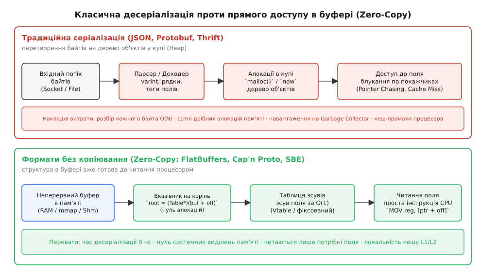
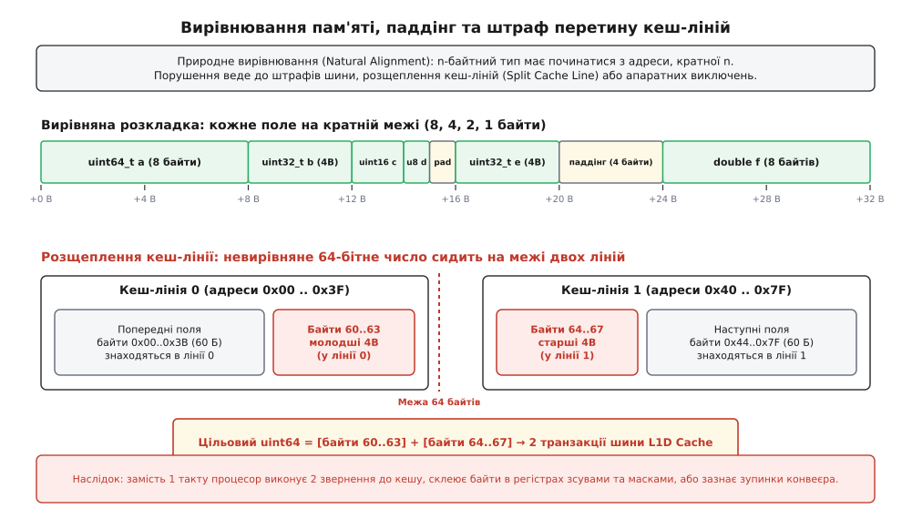
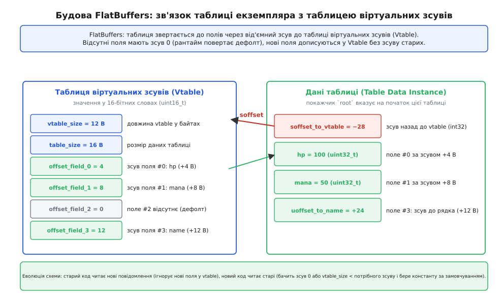
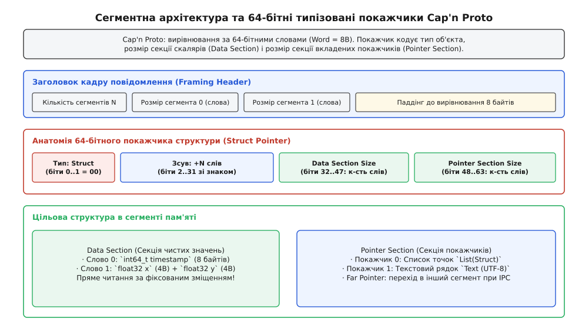
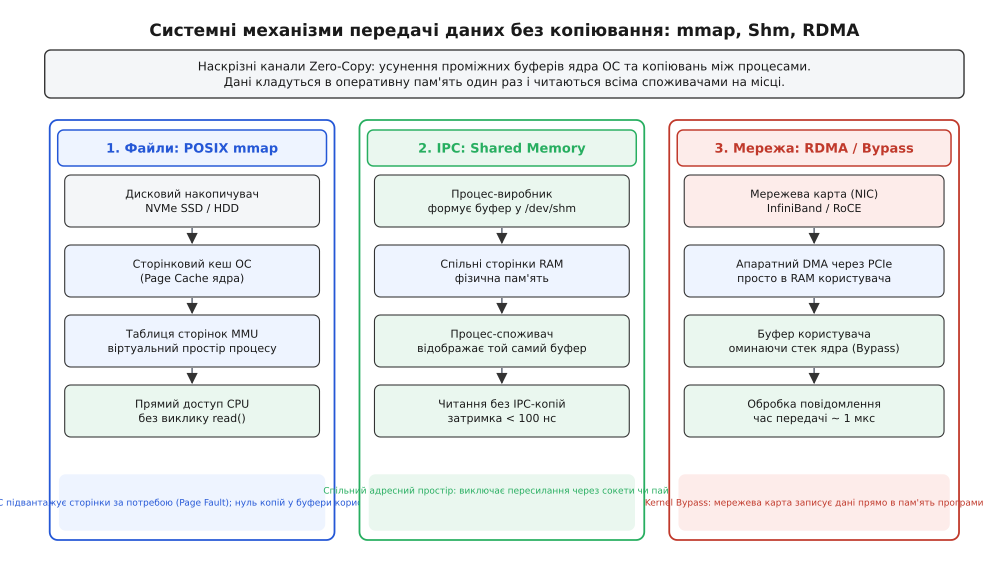
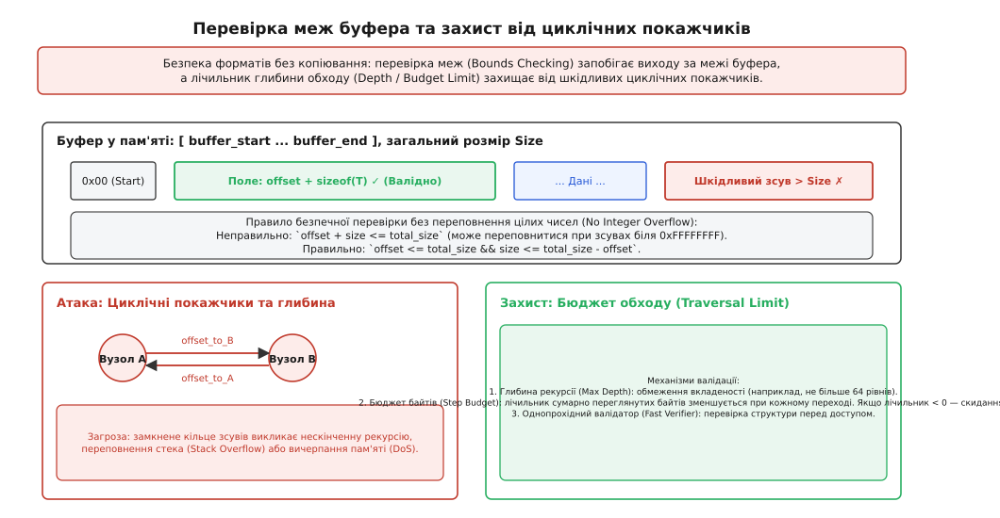

# Формати без копіювання: доступ до полів просто в буфері

<preknowlist>
- [Біти й порядок байтів](topic:sf-algorithms/bits-bytes-endianness) — порядок байтів (Little-Endian / Big-Endian) та бітові операції.
- [Вирівнювання даних у пам'яті](topic:sf-apps/memory-alignment) — природне вирівнювання типів, паддінг і межі машинних слів.
- [Віртуальна пам'ять](topic:hw-arch/virtual-memory) — сторінкова організація пам'яті, системний виклик mmap та ізоляція процесів.
- [Суворе аліасування (strict aliasing)](topic:sf-lang/strict-aliasing) — правила типізованого доступу до сирих буферів без невизначеної поведінки.
- [JSON: текстове подання об'єктів і масивів](topic:sf-data/json-format) — текстова серіалізація, накладні витрати розбору та алокацій.
</preknowlist>

Сервер обробки ринкових котирувань біржового шлюзу отримує 500 000 пакетів на секунду через 10-гігабітний мережевий інтерфейс. Кожне повідомлення містить числовий ідентифікатор інструмента, високоточну часову мітку в наносекундах, рівні біржового стакана та обсяги заявок. Якщо кожне вхідне повідомлення запаковано в JSON чи класичний Protocol Buffers, процесор витрачає понад 70% своїх тактів не на розрахунок алгоритмічної торгової стратегії, а на лексичний розбір рядків, декодування varint-чисел і виділення динамічної пам'яті в купі (Heap) під тимчасові структури даних. Коли з тридцяти полів повідомлення обробнику потрібні лише два (найкраща ціна продажу та доступний обсяг), традиційний десеріалізатор все одно змушений розібрати всі байти від початку до кінця і побудувати повне дерево об'єктів у пам'яті.

Формати без копіювання (Zero-Copy Serialization) розв'язують цю проблему через повну відмову від окремого етапу десеріалізації: двійковий буфер у пам'яті проектується так, що процесор читає потрібні поля безпосередньо за їхніми відносними адресами за сталий час `O(1)`, використовуючи звичайні апаратні інструкції зчитування пам'яті.


*Конвеєр класичної десеріалізації з розбором та алокаціями в купі проти прямого нуль-копійного доступу до полів у неперервному буфері пам'яті*

---

## Анатомія ціни серіалізації: чому класичні формати зупиняють процесор

Щоб зрозуміти перевагу прямого доступу в буфері, необхідно простежити шлях байтів від мережевої карти до регістрів процесора в класичних бібліотеках серіалізації (від лат. *series* — ряд, послідовність).

У традиційній моделі (JSON, XML, Protocol Buffers, Apache Thrift) переданий буфер є лише проміжним транспортним контейнером. Для того щоб прикладна програма отримала об'єкт мови програмування (наприклад, структуру `Order` або екземпляр класу `MarketUpdate`), бібліотека десеріалізації виконує чотири послідовні кроки:

1. **Синтаксичний розбір і декодування (Parsing):** потік байтів сканується з першого до останнього символу. У JSON шукаються лапки, двокрапки й фігурні дужки; у Protocol Buffers читаються префіксні теги полів та розпаковуються цілі числа зі змінною довжиною (Varint / LEB128). Це обчислювально складна операція: розпакування кожного 64-бітного числа вимагає серії бітових зсувів, маскувань та розгалужень (branches), які збивають конвеєр передбачення переходів (Branch Predictor) процесора.
2. **Динамічні алокації (Heap Allocations):** кожен вкладений об'єкт, масив або текстовий рядок вимагає окремого виклику системного алокатора пам'яті (`malloc()` або оператора `new`). Якщо повідомлення містить масив із 100 вкладених структур, програма робить 100 окремих виділень пам'яті.
3. **Копіювання даних (Data Copying):** байти з первинного буфера мережевого сокета копіюються у виділені ділянки пам'яті в купі.
4. **Побудова графа покажчиків (Pointer Chasing):** об'єкти в купі пов'язуються між собою через абсолютні 64-бітні віртуальні адреси.

```
Класичний конвеєр (JSON / Protobuf):
[Вхідні байти] → [Лексичний парсер] → [malloc() × N] → [Копіювання] → [Дерево в купі]
                   (Висока затримка CPU)   (Фрагментація RAM)    (Кеш-промахи L1/L2)
```

Головна прихована ціна цього конвеєра полягає в руйнуванні локальності даних у кеш-пам'яті процесора (Cache Locality). Пам'ять, виділена через `malloc()`, розпорошена по адресній купі процесу. Коли програма проходить по списку замовлень, кожне розіменування покажчика змушує контролер пам'яті звертатися до нового рядка кешу або навіть робити запит до зовнішньої RAM. Час очікування одного промаху кешу L3 сягає 200–300 тактів процесора (близько 50–70 наносекунд). За цей час сучасний суперскалярний процесор міг би виконати понад 1000 базових арифметичних операцій.

У керованих мовах (Java, Go, C#) створення мільйонів короткоживучих об'єктів десеріалізації перевантажує механізм Garbage Collector, що призводить до періодичних зупинок потоків (Stop-The-World pauses) тривалістю від кількох мілісекунд до сотень мілісекунд, що неприпустимо для систем реального часу.

Формати без копіювання змінюють цю філософію: первинний двійковий буфер проектується так, що його внутрішня розкладка збігається з машинним представленням даних у регістрах CPU. Жоден байт не копіюється, жодна структура в купі не виділяється, а доступ до поля `msg.price()` зводиться до одного зчитування пам'яті за відомим зсувом.

Детальніше про те, як індустрія перейшла від передачі небезпечних структур C через сокети до Protocol Buffers, а згодом до сучасної парадигми прямого доступу, описано в історичній довідці [Від двійкових структур C до нуль-копіювання: як народилася архітектура прямого доступу](topic:sf-data/zero-copy-serialization/hist-evolution-to-zerocopy.md).

---

## Природне вирівнювання, паддінг і апаратна геометрія пам'яті

Щоб процесор міг читати числа безпосередньо з байтового буфера без попереднього копіювання, розкладка даних у буфері зобов'язана підпорядковуватися законам апаратного вирівнювання (англ. *alignment*).

Сучасні процесори архітектур x86-64 та ARM64 взаємодіють з оперативною пам'яттю не окремими байтами, а машинними словами шириною 32, 64 або 128 бітів через 64-байтні кеш-лінії (Cache Lines). Закон **природного вирівнювання (Natural Alignment)** вимагає, щоб будь-яке `n`-байтне значення розташовувалося за адресою, кратною `n`:

* 1-байтні типи (`uint8_t`, `int8_t`, `bool`) можуть лежати за будь-якою адресою (вирівнювання 1);
* 2-байтні типи (`uint16_t`, `int16_t`) — за адресою, кратною 2 (`addr % 2 == 0`);
* 4-байтні типи (`uint32_t`, `int32_t`, `float`) — за адресою, кратною 4 (`addr % 4 == 0`);
* 8-байтні типи (`uint64_t`, `int64_t`, `double`) — за адресою, кратною 8 (`addr % 8 == 0`).


*Природне вирівнювання полів із заповнювачами (паддінгом) та апаратний штраф розщеплення читання (Split Load) при перетині межі 64-байтної кеш-лінії*

Якщо 8-байтне число `double` або `uint64_t` розміщено за невирівняною адресою (наприклад, `0x1003`), на архітектурах зі строгим вирівнюванням (ARM Cortex-M0, певні конфігурації SPARC і MIPS) апаратний контролер пам'яті згенерує апаратне переривання вирівнювання (Alignment Fault), що призведе до аварійного завершення програми сигналом `SIGBUS`.

На архітектурі x86-64 процесор здатний прочитати невирівняне число, проте ціною суттєвої втрати швидкодії:
1. Якщо 8-байтне число потрапляє всередину однієї кеш-лінії, процесор виконує додаткові апаратні операції маскування та зсуву на внутрішніх шинах L1-кешу;
2. Якщо 8-байтне число розташоване на межі двох 64-байтних кеш-ліній (наприклад, байти з `0x3C` до `0x43`), виникає ситуація **розщепленого читання (Split Load)**. Контролер пам'яті вимушений виконати два незалежні звернення до кешу L1D, заблокувати кеш-лінії й виконати склеювання двох половин слова. Якщо ця операція є атомарною (`atomic`), вона викликає блокування шини кешу (Split Lock), яке уповільнює всі ядра процесора на сотні тактів.

Щоб запобігти порушенню вирівнювання, формати без копіювання вставляють між полями порожні байти-заповнювачі — **паддінг (Padding)**. Розмір структури та зсуви полів обчислюються за формулою вирівнювання:

```
aligned_offset = (current_offset + (alignment - 1)) & ~(alignment - 1)
```

де операція `& ~(alignment - 1)` округлює адресу вгору до найближчого кратного степеня двійки.

Під час генерації коду компілятор схеми автоматично сортує поля всередині таблиці за спаданням їхнього вирівнювання (спочатку 8-байтні числа, потім 4-байтні, потім 2-байтні й наприкінці 1-байтні). Це мінімізує обсяг необхідного паддінгу та гарантує, що розмір повідомлення залишається компактним без жодних втрат продуктивності процесорних інструкцій завантаження.

### Порядок байтів (Endianness)

Усі провідні формати без копіювання (FlatBuffers, Cap'n Proto, Simple Binary Encoding) стандартизують двійкове кодування чисел у форматі **Little-Endian** (молодший байт за меншою адресою). Це зумовлено домінуванням архітектур x86-64 та ARM64 у серверах, настільних комп'ютерах і мобільних пристроях. Завдяки стандартизації Little-Endian читання числа з буфера не вимагає інструкцій перестановки байтів (`bswap` на x86 або `rev` на ARM): значення з пам'яті завантажується в регістр процесора безпосередньо інструкцією `MOV`.

---

## Архітектури індирекції та еволюція схем без парсингу

Головна інженерна суперечність форматів без копіювання полягає у сумісності та еволюції схем. Якщо структура даних у пам'яті є статичним двійковим блоком, як змінити схему (додати нове поле або видалити старе) без порушення роботи старих клієнтів, які звертаються до полів за жорстко закодованими зміщеннями?

Різні формати пропонують три фундаментальні архітектурні підходи до вирішення цієї проблеми.

### 1. FlatBuffers: Таблиці віртуальних зсувів (Vtables)

У форматі FlatBuffers кожна таблиця екземпляра даних відділена від метаданих схеми. Екземпляр таблиці містить від'ємне 32-бітне зміщення зі знаком (`soffset_t`), яке вказує назад у буфер на таблицю віртуальних зсувів — **Vtable**.


*Зв'язок екземпляра таблиці даних із таблицею віртуальних зсувів (Vtable) у FlatBuffers: від'ємне зміщення, прямі зсуви полів та значення за замовчуванням*

Таблиця Vtable складається з:
* `uint16_t vtable_size` — повного розміру Vtable у байтах;
* `uint16_t table_size` — розміру екземпляра таблиці даних у байтах;
* Масиву 16-бітних зміщень полів `uint16_t field_offsets[]`.

Коли згенерований код викликає метод доступу до поля `msg.mana()`, виконується такий алгоритм за час `O(1)`:
1. За вказівником таблиці читається від'ємне зміщення до Vtable: `vtable_ptr = table_ptr - *(int32_t*)table_ptr`;
2. Обчислюється позиція запису для поля з індексом `N`: `entry_offset = 4 + N * 2`;
3. Якщо `entry_offset >= vtable_ptr->vtable_size`, поле відсутнє у повідомленні (воно з'явилося у новішій версії схеми). Бібліотека миттєво повертає константне значення за замовчуванням, визначене у схемі (`default value`);
4. Якщо запис присутній, з Vtable читається відносний зсув `offset = vtable_ptr->field_offsets[N]`;
5. Якщо `offset == 0`, поле було явно видалене або не встановлене автором повідомлення (повертається дефолт);
6. Якщо `offset > 0`, значення читається за адресою `table_ptr + offset`.

```
Формула адреси скаляра у FlatBuffers:
field_address = table_base + vtable[field_index]    [якщо field_index < vtable_size і зсув ≠ 0]
```

Цей механізм забезпечує бездоганну зворотну та пряму сумісність:
* **Старий клієнт читає новий буфер:** новий буфер має довший Vtable з новими полями наприкінці. Старий клієнт знає лише про перші кілька записів Vtable і безпечно ігнорує нові поля.
* **Новий клієнт читає старий буфер:** новий клієнт перевіряє `vtable_size`, бачить, що Vtable закінчився раніше за індекс нового поля, і використовує значення за замовчуванням без жодних помилок чи копіювань.

Крім того, FlatBuffers виконує дедуплікацію Vtables: якщо декілька об'єктів у повідомленні мають однакові набори встановлених полів, вони посилаються на одну й ту саму Vtable у буфері, заощаджуючи пам'ять.

### 2. Cap'n Proto: 64-бітна сегментна модель і типізовані покажчики

Cap'n Proto повністю відмовляється від проміжних Vtables для скалярних полів. Усі структури Cap'n Proto вирівнюються за межами 64-бітних слів (Word = 8 байтів). Повідомлення ділиться на дві чіткі частини:

1. **Секція даних (Data Section):** суцільний масив 64-бітних слів, де зберігаються всі скалярні типи (`int32`, `int64`, `double`, бітові маски). Кожне поле схеми має жорстко закріплений індекс слова та бітове зміщення всередині Data Section.
2. **Секція покажчиків (Pointer Section):** масив 64-бітних слів, де зберігаються покажчики на вкладені об'єкти, списки та рядки.


*Сегментна розкладка повідомлення Cap'n Proto та анатомія 64-бітного покажчика структури (Struct Pointer)*

64-бітний покажчик Cap'n Proto кодує зміщення та геометрію об'єкта:
* **Біти 0..1 (Type Tag):** тип цільового об'єкта (`00` = Struct, `01` = List, `10` = Far Pointer для переходу між сегментами);
* **Біти 2..31 (Signed Offset):** знаковий зсув у 64-бітних словах від кінця поточного покажчика до початку цільової структури;
* **Біти 32..47 (Data Section Size):** розмір секції скалярів цільової структури у словах;
* **Біти 48..63 (Pointer Section Size):** розмір секції покажчиків цільової структури у словах.

Для читання скаляра в Cap'n Proto не потрібно навіть звернення до Vtable: програма додає до адреси структури фіксоване зміщення `data_section_offset`. Якщо структура, надіслана старою програмою, має менший розмір Data Section, ніж очікує новий код, заголовок структури вказує її реальний `Data Section Size`, і читач повертає нуль для всіх полів за межами реального розміру.

### 3. Simple Binary Encoding (SBE): Фіксовані шаблони фінансових ринків

Ультранизьколатентні біржові протоколи (наприклад, протокол CME iLink 3 та NASDAQ ITCH, оптимізовані під LMAX Disruptor) не можуть дозволити собі навіть мінімальних накладних витрат на Vtable чи розбір покажчиків.

SBE організує повідомлення як монолітний плоский блок пам'яті:
1. **Заголовок повідомлення (Message Header):** фіксовані 8 байтів (`blockLength`, `templateId`, `schemaId`, `version`);
2. **Кореневий блок полів (Root Block):** суворо детермінована структура C з фіксованими зміщеннями всіх скалярів. Оновлення схеми дозволяється лише дописуванням нових полів у кінець блоку `blockLength`;
3. **Повторювані групи (Repeating Groups):** масиви однорідних записів із 4-байтним префіксом лічильника;
4. **Змінні дані (VarData):** рядки та сирі байти, які завжди записуються в самий кінець повідомлення.

SBE забезпечує максимальну **механічну чуйність (Mechanical Sympathy)**: оскільки всі поля розташовані в пам'яті суворо послідовно одне за одним, процесорний блок апаратної попередньої вибірки (Hardware Prefetcher) завантажує наступні кеш-лінії ще до того, як код запитає доступ до них.

Повний опис двійкових контрактів, бітових прапорців та структур розкладки наведено у довіднику [Специфікація бінарної розкладки, контрактів vtable та інтерфейсу валідації](topic:sf-data/zero-copy-serialization/api-schema-and-traversal.md).

---

## Механіка доступу за O(1) та відносні покажчики

Чому формати без копіювання не використовують звичайні абсолютні вказівники віртуальної пам'яті (`void*` або `uintptr_t`)?

Абсолютна адреса пам'яті (наприклад, `0x7fff5bc010a0`) має сенс виключно всередині одного процесу в конкретний момент часу. Механізм рандомізації адресного простору (ASLR — Address Space Layout Randomization), застосовуваний сучасними ОС для захисту від експлойтів, завантажує пам'ять кожного процесу за випадковими базовими адресами. Якщо один процес запише абсолютний вказівник у файл або надішле його через сокет іншому процесу, спроба розіменувати таку адресу призведе до негайного падіння (`Segmentation Fault`) або читання чужих конфіденційних даних.

Формати без копіювання будують усю внутрішню адресацію на **відносних зсувах (Self-Relative Offsets / Relative Pointers)**.

Відносний покажчик зберігає не цільову адресу, а різницю між власною адресою в пам'яті та адресою цільового об'єкта:

```
target_address = pointer_address + offset_value
```

Завдяки цьому двійковий буфер стає **повністю переміщуваним (Fully Relocatable)**. Його можна скопіювати у довільну ділянку пам'яті, відобразити через `mmap` на будь-яку базову віртуальну адресу або зберегти на флеш-накопичувач — усі внутрішні зв'язки між таблицями, рядками й масивами залишаються коректними без модифікації жодного байта.

### Безпечний доступ до пам'яті та суворе аліасування (Strict Aliasing)

У мовах низького рівня (C та C++) пряме приведення покажчиків типу `*(const uint32_t*)(buffer + offset)` для доступу до поля буфера може порушити правило **суворого аліасування (Strict Aliasing Rule)** та спричинити невизначену поведінку (UB), якщо компілятор припустить, що покажчики на `uint8_t` і `uint32_t` не можуть посилатися на одну й ту саму область пам'яті.

Ідіоматичним і гарантовано безпечним способом зчитування є використання копіювання за допомогою `memcpy` або (починаючи з C++20) виклику `std::bit_cast`. Сучасні оптимізуючі компілятори (GCC, Clang, MSVC) розпізнають такий патерн і транслюють його у звичайну машинну інструкцію завантаження з пам'яті `mov eax, [rdi + rsi]`, не генеруючи жодного фактичного виклику функції.

Нижче наведено порівняння доступу до полів без копіювання мовами C та C++.

:::tabs
```c
#include <stdint.h>
#include <stdbool.h>
#include <string.h>

/* Безпечне завантаження скаляра з буфера з урахуванням вирівнювання */
static inline uint32_t load_u32_le(const uint8_t *src) {
    uint32_t val;
    memcpy(&val, src, sizeof(val));
    return val;
}

/* Структура безпечного доступу до таблиці без копіювання */
typedef struct {
    const uint8_t *buf;
    size_t size;
    const uint8_t *table;
    const uint8_t *vtable;
    uint16_t vtable_len;
} packet_view_t;

bool packet_view_init(packet_view_t *view, const uint8_t *buf, size_t size) {
    if (!view || !buf || size < 8) return false;
    view->buf = buf;
    view->size = size;

    uint32_t root_off = load_u32_le(buf);
    if (root_off >= size || size - root_off < 4) return false;
    view->table = buf + root_off;

    int32_t vtable_soff = (int32_t)load_u32_le(view->table);
    ptrdiff_t vtable_abs = (view->table - buf) - vtable_soff;
    if (vtable_abs < 0 || (size_t)vtable_abs + 4 > size) return false;

    view->vtable = buf + vtable_abs;
    memcpy(&view->vtable_len, view->vtable, 2);
    return true;
}

uint32_t packet_get_price(const packet_view_t *view, uint16_t field_idx, uint32_t def_val) {
    size_t voff_pos = 4 + field_idx * 2;
    if (voff_pos + 2 > view->vtable_len) return def_val;

    uint16_t field_off;
    memcpy(&field_off, view->vtable + voff_pos, 2);
    if (field_off == 0) return def_val;

    return load_u32_le(view->table + field_off);
}
```
```cpp
#include <cstdint>
#include <cstddef>
#include <cstring>
#include <span>
#include <optional>

namespace zerocopy {

template <typename T>
[[nodiscard]] constexpr T load_le(const std::byte* ptr) noexcept {
    T val{};
    std::memcpy(&val, ptr, sizeof(T));
    return val;
}

class PacketView {
public:
    [[nodiscard]] static std::optional<PacketView> create(std::span<const std::byte> buf) noexcept {
        if (buf.size() < 8) return std::nullopt;

        const auto root_off = load_le<std::uint32_t>(buf.data());
        if (root_off >= buf.size() || buf.size() - root_off < 4) return std::nullopt;

        const std::byte* table = buf.data() + root_off;
        const auto vtable_soff = load_le<std::int32_t>(table);
        const auto vtable_abs = static_cast<std::ptrdiff_t>(table - buf.data()) - vtable_soff;

        if (vtable_abs < 0 || static_cast<std::size_t>(vtable_abs) + 4 > buf.size()) {
            return std::nullopt;
        }

        const std::byte* vtable = buf.data() + vtable_abs;
        const auto vtable_len = load_le<std::uint16_t>(vtable);

        return PacketView(buf, table, vtable, vtable_len);
    }

    [[nodiscard]] std::uint32_t get_price(std::uint16_t field_idx, std::uint32_t def_val = 0) const noexcept {
        const std::size_t voff_pos = 4 + field_idx * sizeof(std::uint16_t);
        if (voff_pos + sizeof(std::uint16_t) > vtable_len_) return def_val;

        const auto field_off = load_le<std::uint16_t>(vtable_ + voff_pos);
        if (field_off == 0) return def_val;

        return load_le<std::uint32_t>(table_ + field_off);
    }

private:
    constexpr PacketView(std::span<const std::byte> buf,
                         const std::byte* table,
                         const std::byte* vtable,
                         std::uint16_t vlen) noexcept
        : buf_(buf), table_(table), vtable_(vtable), vtable_len_(vlen) {}

    std::span<const std::byte> buf_;
    const std::byte* table_;
    const std::byte* vtable_;
    std::uint16_t vtable_len_;
};

} // namespace zerocopy
```
:::

Повну робочу реалізацію рушія з генерацією повідомлень та валідацією наведено у практичному проєкті [Реалізація рушія серіалізації без копіювання з таблицею віртуальних зсувів](topic:sf-data/zero-copy-serialization/proj-zerocopy-engine.md).

---

## Системні канали нуль-копіювання: mmap, Shared Memory та RDMA

Справжня потужність форматів без копіювання розкривається під час їхнього поєднання з системними механізмами передачі даних операційної системи та апаратного забезпечення.


*Наскрізні канали Zero-Copy: відображення файлів у пам'ять (mmap), міжпроцесна взаємодія через Shared Memory та апаратний доступ до пам'яті через мережу (RDMA)*

### 1. Відображення файлів у віртуальну пам'ять (POSIX mmap)

Замість послідовного читання гігабайтних двійкових файлів за допомогою системного виклику `read(fd, buffer, size)`, який копіює дані зі сторінкового кешу ядра (Page Cache) у користувацький буфер процесу, програма відображає файл безпосередньо у віртуальний адресний простір.

:::tabs
```c
#include <sys/mman.h>
#include <sys/stat.h>
#include <fcntl.h>
#include <unistd.h>
#include <stdint.h>

const uint8_t *map_binary_file(const char *path, size_t *out_size) {
    int fd = open(path, O_RDONLY);
    if (fd < 0) return NULL;

    struct stat st;
    if (fstat(fd, &st) < 0) {
        close(fd);
        return NULL;
    }

    void *data = mmap(NULL, st.st_size, PROT_READ, MAP_SHARED, fd, 0);
    close(fd); /* Дескриптор можна закрити після mmap */

    if (data == MAP_FAILED) return NULL;
    *out_size = (size_t)st.st_size;
    return (const uint8_t *)data;
}
```
```cpp
#include <sys/mman.h>
#include <sys/stat.h>
#include <fcntl.h>
#include <unistd.h>
#include <cstddef>
#include <span>
#include <string_view>
#include <optional>

class MmapFile {
public:
    [[nodiscard]] static std::optional<MmapFile> open(std::string_view path) noexcept {
        int fd = ::open(path.data(), O_RDONLY);
        if (fd < 0) return std::nullopt;

        struct stat st;
        if (::fstat(fd, &st) < 0) {
            ::close(fd);
            return std::nullopt;
        }

        void* addr = ::mmap(nullptr, st.st_size, PROT_READ, MAP_SHARED, fd, 0);
        ::close(fd);

        if (addr == MAP_FAILED) return std::nullopt;
        return MmapFile(static_cast<std::byte*>(addr), static_cast<std::size_t>(st.st_size));
    }

    ~MmapFile() noexcept {
        if (data_) ::munmap(data_, size_);
    }

    [[nodiscard]] std::span<const std::byte> bytes() const noexcept {
        return {data_, size_};
    }

    MmapFile(const MmapFile&) = delete;
    MmapFile& operator=(const MmapFile&) = delete;
    MmapFile(MmapFile&& o) noexcept : data_(o.data_), size_(o.size_) { o.data_ = nullptr; }

private:
    MmapFile(std::byte* data, std::size_t size) noexcept : data_(data), size_(size) {}
    std::byte* data_{nullptr};
    std::size_t size_{0};
};
```
:::

Системний виклик `mmap()` виділяє діапазон віртуального адресного простору процесу (VMA — Virtual Memory Area), але **не завантажує жодного байта з накопичувача негайно**.
* Коли програма звертається до поля `data->layer(12)->weight(4)`, процесорний блок MMU фіксує сторінковий збій (**Page Fault**);
* Ядро ОС прозоро завантажує з NVMe SSD рівно одну 4-кілобайтну сторінку, в якій лежить запитане число, та відображає її у фізичну пам'ять;
* Решта 100 гігабайтів файлу не споживають оперативної пам'яті взагалі.

Саме так влаштовано інференс нейромереж у бібліотеці **TensorFlow Lite**: ваги моделей зберігаються у форматі FlatBuffers і монтуються через `mmap`, що дає змогу запускати важкі моделі на мобільних телефонах із мінімальним споживанням RAM. При роботі з великими датасетами в Linux можна задіяти прапорець `MAP_HUGETLB` для виділення HugePages (2 МБ або 1 ГБ), що в рази зменшує кількість записів у буфері асоціативної трансляції TLB та прискорює пряме читання.

### 2. Міжпроцесна взаємодія через спільну пам'ять (POSIX Shared Memory)

Коли два процеси на одному сервері обмінюються даними через Unix Domain Sockets або канали (`pipe`), ядро копіює дані з буфера відправника в буфер ядра, а звідти — в буфер отримувача (подвійне копіювання).

При використанні спільної пам'яті (`shm_open()` + `mmap()` з прапорцем `MAP_SHARED`):
* Обидва процеси відображають одні й ті самі фізичні сторінки оперативної пам'яті у свої адресні простори;
* Виробник формує FlatBuffers/SBE повідомлення просто в регіоні спільної пам'яті;
* Споживач миттєво отримує зміщення повідомлення через кільцевий буфер (Ring Buffer) на атомарних змінних і читає поля. Затримка передачі між процесами падає з 5–10 мікросекунд до **менш ніж 80 наносекунд**.

### 3. Мережевий доступ без ядра: RDMA та Kernel Bypass

У розподілених базах даних і кластерах високопродуктивних обчислень (HPC) передача через класичний стек протоколів TCP/IP створює значні накладні витрати: переривання мережевої карти, перемикання контексту ядра (Context Switch) та копіювання пакетів через системні структури `sk_buff`.

Технологія **RDMA (Remote Direct Memory Access)** через протоколи InfiniBand або RoCE (RDMA over Converged Ethernet) дозволяє мережевому адаптеру (NIC) одного сервера самостійно, через шину PCIe, прочитати буфер пам'яті процесу та через мережу безпосередньо записати його у фізичну пам'ять віддаленого сервера, повністю оминаючи операційну систему обох машин (Kernel Bypass).

Реєстрація регіону пам'яті у мережевій карті здійснюється через системний виклик `ibv_reg_mr()` бібліотеки `libibverbs`. Після цього відправник надсилає робочий запит через пару черг (`ibv_post_send`), і мережевий адаптер апаратно виконує передачу.

Поєднання RDMA з форматами Cap'n Proto та SBE забезпечує справжнє наскрізне нуль-копіювання: байти з RAM сервера А переміщуються мережевою картою прямо в RAM сервера Б, де віддалений процесор негайно читає потрібні поля без жодної інструкції десеріалізації.

---

## Безпека, перевірка меж та захист від шкідливих буферів

Прямий доступ до сирих буферів за зміщеннями створює серйозні загрози інформаційної безпеки, якщо вхідні дані отримано з ненадійного джерела (відкритої мережі). Неправильна або відсутня перевірка меж (Bounds Checking) може перетворити формат без копіювання на критичну вразливість.


*Захист від виходу за межі буфера (Bounds Checking) та запобігання атакам вичерпання ресурсів через циклічні покажчики за допомогою лічильника глибини*

### 1. Атака виходом за межі пам'яті (Out-of-Bounds Read)

Якщо зловмисник передасть у повідомленні маніпулятивний зсув (наприклад, `offset = 0x7FFFFFF0`), наївне розіменування адреси `buffer + offset` призведе до аварійної зупинки процесу (`SIGSEGV`) або до витоку конфіденційної пам'яті сусідніх сесій (механізм, аналогічний вразливості *Heartbleed* у OpenSSL).

**Пастка переповнення цілих чисел (Integer Overflow):**
Поширена помилка розробників — перевірка меж за допомогою прямого додавання:

:::tabs
```c
/* НЕБЕЗПЕЧНО! Можливе переповнення 32-бітного типу */
bool unsafe_check(uint32_t offset, uint32_t field_size, uint32_t buffer_size) {
    if (offset + field_size > buffer_size) {
        return false;
    }
    return true;
}
```
```cpp
/* НЕБЕЗПЕЧНО! Можливе переповнення 32-бітного типу */
constexpr bool unsafe_check(std::uint32_t offset, std::uint32_t field_size, std::uint32_t buffer_size) noexcept {
    if (offset + field_size > buffer_size) {
        return false;
    }
    return true;
}
```
:::

Якщо зловмисник передасть `offset = 0xFFFFFFFF` та `field_size = 4`, їхня сума переповнить 32-бітний регістр і перетвориться на `3`, що буде менше за `buffer_size`, і некоректна перевірка пропустить атаку.

**Правильна форма перевірки без переповнення:**

:::tabs
```c
/* БЕЗПЕЧНО: використання віднімання запобігає переповненню */
bool safe_check(uint32_t offset, uint32_t field_size, uint32_t buffer_size) {
    if (offset > buffer_size || field_size > (buffer_size - offset)) {
        return false;
    }
    return true;
}
```
```cpp
/* БЕЗПЕЧНО: використання віднімання запобігає переповненню */
constexpr bool safe_check(std::uint32_t offset, std::uint32_t field_size, std::uint32_t buffer_size) noexcept {
    if (offset > buffer_size || field_size > (buffer_size - offset)) {
        return false;
    }
    return true;
}
```
:::

### 2. Атака циклічними покажчиками (Cyclic Pointer Bomb / Zip Bomb)

Оскільки відносні покажчики можуть вказувати в будь-яку точку буфера, зловмисник може сформувати структуру, в якій об'єкт А посилається на об'єкт Б, а об'єкт Б посилається назад на об'єкт А.

Якщо код обходу повідомлення (наприклад, функція друку в JSON або валідатор) рекурсивно обходить графи об'єктів, циклічне посилання викличе нескінченний цикл, переповнення стека викликів (Stack Overflow) та повну відмову в обслуговуванні (DoS).

Аналогічно, кілька різних покажчиків можуть посилатися на одну й ту саму вкладену підтаблицю, створюючи експоненційне дерево обходу (Pointer Bomb).

### Стратегії валідації безпеки

1. **Однопрохідна попередня верифікація (Upfront Verifier):** бібліотека FlatBuffers надає клас `Verifier`, який перед наданням доступу до полів виконує повний прохід буфера:
   - Перевіряє, що всі Vtables і таблиці лежать строго в межах `[buffer_start, buffer_end]`;
   - Перевіряє природне вирівнювання кожного поля;
   - Перевіряє коректність нуль-термінаторів рядків UTF-8;
   - Контролює максимальну глибину вкладеності (за замовчуванням не більше 64 рівнів).
2. **Лічильник бюджету обходу (Traversal Limit):** бібліотека Cap'n Proto використовує механізм лічильника слів:
   - При створенні читача встановлюється бюджет (наприклад, не більше 64 Мегабайт сумарно переглянутих даних);
   - Кожне розіменування покажчика зменшує лічильник на розмір прочитаної структури;
   - Якщо лічильник досягає нуля, обробка негайно переривається з помилкою, що унеможливлює DoS-атаки циклічними структурами.

---

> 🔧 **Навіщо це.**
>
> Формати без копіювання обирають за такими інженерними критеріями:
>
> * **Обирайте Simple Binary Encoding (SBE),** коли критична кожна наносекунда затримки (HFT-трейдинг, гейтвеї бірж, обробка потоків телеметрії від сенсорів), а структура повідомлень фіксована й рідко змінюється. SBE усуває навіть Vtables, забезпечуючи максимальну швидкість процесорного конвеєра.
> * **Обирайте FlatBuffers,** коли потрібен вибірковий доступ до полів у великих ієрархічних структурах (ваги нейромереж TensorFlow Lite, файли конфігурацій ігор, клієнт-серверний зв'язок мобільних додатків) без завантаження всього масиву даних у пам'ять.
> * **Обирайте Cap'n Proto,** коли будується розподілена система мікросервісів або RPC-фреймворк із передачею великих обсягів даних через спільну пам'ять (Shared Memory IPC) та підтримкою можливостей об'єктного захисту (Capability-based Security).
> * **Залишайтеся на Protocol Buffers або JSON,** якщо критичний мінімальний розмір повідомлення в байтах у повільних публічних мережах (мобільний інтернет, публічні HTTP REST API), обсяг повідомлень невеликий, а накладні витрати на розбір не є вузьким місцем системи.
