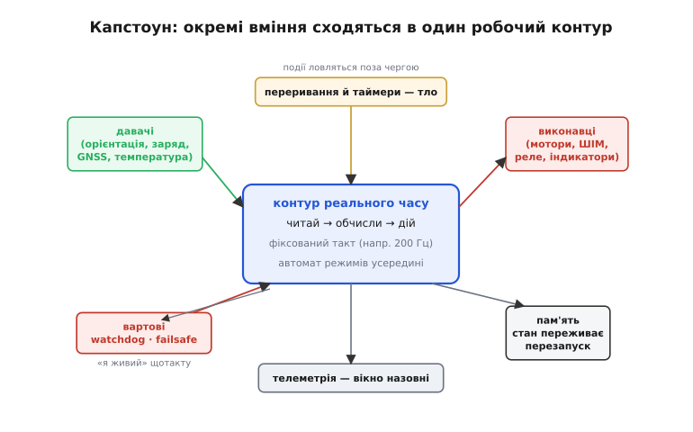
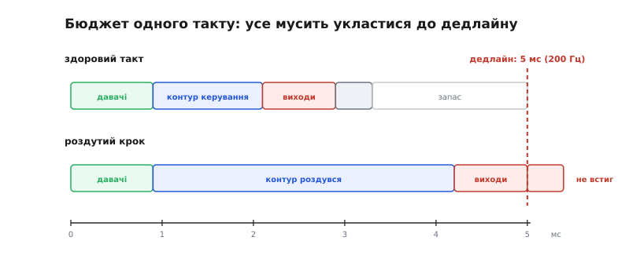
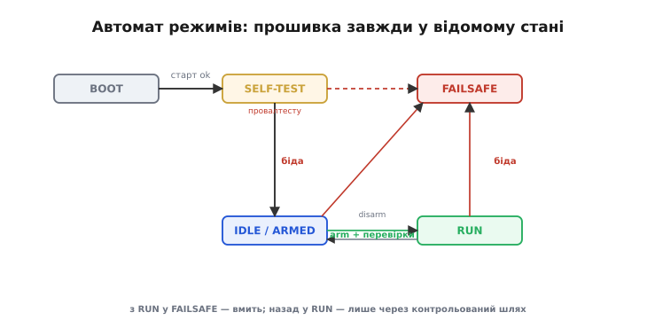

# Капстоун: одна прошивка, що зводить усе докупи

Окреме вміння легко перевірити. Змусити світлодіод блимати за таймером, прочитати давач по шині, крутнути мотор через ШІМ, зберегти число в пам'ять, що переживе перезапуск, — кожна така вправа маленька й самодостатня, і, зробивши її, ти справедливо кажеш «я це вмію». Та між «умію кожну деталь» і «умію зібрати з деталей робочий пристрій» лежить прірва, якої окремі вправи не показують. Пристрій живе не в лабораторії, де все по черзі й під наглядом, а в реальному світі, де давач мовчить саме тоді, коли мотор мусить крутитися, зв'язок рветься посеред обчислення, а живлення просідає в найгіршу мить. **Капстоун** — це задача, зумисне складена так, щоб перевірити не деталь, а **шов**: чи витримає купа вмінь, зведена в одну прошивку під тиском реального часу й реальних відмов.

Саме слово прийшло з мурування (англ. *cap* — «шапка, вершок» + *stone* — «камінь»; ужиток засвідчено з 1680-х). **Капстоун** — це верхній камінь, яким увінчують готову стіну чи стовп: він не тримає конструкцію, як тримає замковий камінь склепіння, а **завершує** її й захищає від негоди. В інженерній освіті слово прижилося саме в цьому переносному сенсі: капстоун-задача не додає ще одного вміння, а **вивершує** всі попередні в одну цілісну роботу. І тут ховається головне непорозуміння новачка: він думає, що капстоун — це «велика вправа, просто складніша». Насправді капстоун перевіряє те, чого жодна окрема вправа перевірити не може, — **інтеграцію**: як частини поводяться, коли працюють **разом і одночасно**, а не по черзі.

## Чому ціле — не сума частин

Річ у тім, що у вбудованій системі частини не стоять рядком, а **ділять** те саме залізо в той самий час. Один процесор мусить і читати давачі, і крутити контур керування, і відповідати на переривання, і годувати сторожовий таймер, і слати телеметрію — і все це впродовж однієї секунди, безліч разів. Тому помилки капстоуна — не такі, як помилки окремих вправ. Це не «я неправильно налаштував регістр» (таке видно одразу), а куди підступніші біди стику: контур керування розтягнувся й перескочив свій строк; переривання й головний цикл побилися за спільну змінну; давач завис і потягнув за собою весь цикл; пристрій перезавантажився й забув, у якій фазі місії був. Жодна з цих бід не з'являється, поки частину гониш саму; усі вони народжуються **на межі** між частинами.

Ось чому капстоун цінний. Він змушує тебе спроєктувати не набір функцій, а **систему**: домовитися, хто з ким і коли говорить, хто має право загальмувати цикл, а хто ні, що станеться, коли одна частина відмовить. Придивімося до тих швів, які капстоун зшиває, і до того, як їх зшивати надійно.


*Капстоун — це момент, коли всі стрілки замикаються в одне. У центрі — контур реального часу «читай → обчисли → дій», що б'ється з фіксованим тактом; довкола нього сходяться давачі (входи), виконавці (виходи), переривання й таймери (термінове тло), вартові (watchdog і failsafe), пам'ять (стан переживає перезапуск) і телеметрія (вікно назовні). Поки кожна стрілка існувала окремо, це були вправи; коли вони замкнулися в один робочий контур — це вже система.*

## Хребет: ритм, а не купа функцій

Перше рішення, від якого залежить усе, — **звідки береться час**. Наївна прошивка просто ставить усі справи в один цикл підряд: прочитати давач, порахувати, вивести, повторити. Працює, доки кроки короткі; та щойно якийсь із них затягнеться, весь цикл провисне — бо швидкість циклу визначає його **найповільніший** крок. Для пристрою, що просто блимає, це байдуже. Для пристрою, що **керує** (стабілізує апарат, тримає температуру, крутить мотор за завданням), — це вирок: контур керування мусить оновлюватися **рівно** й **вчасно**, інакше те, чим він керує, встигає піти врозріз, поки цикл мовчить.

Тому серцем капстоуна роблять не просто цикл, а цикл із **фіксованим тактом**: контур керування спрацьовує строго через рівні проміжки — скажімо, 200 разів на секунду, тобто раз на 5 мілісекунд. Це і є перехід від «швидко, як вийде» до [**реального часу**](topic:sf-tasks/realtime-determinism): важливо не «як швидко в середньому», а «чи встигаю **завжди**, навіть у найгірший такт». А щоб такт узагалі можна було витримати, кожен крок циклу мусить бути **неблокуючим** — жодного `delay()`, жодного очікування «поки давач відповість»: цикл або встигає зробити крок і йде далі, або відкладає його, але **не зависає**.

> 🔧 **Навіщо це.** Найперше питання капстоуна — не «які функції я напишу», а «**з якою частотою б'ється мій контур і що я встигаю за один такт**». Візьми найшвидшу справу, якій потрібна рівність (контур керування), признач їй такт, а тоді впиши в цей такт усе інше так, щоб укластися із запасом. Хто спроєктував ритм першим — той володіє прошивкою; хто дописав ритм «потім» — той її переписуватиме.

Ось як виглядає хребет капстоуна в коді — цикл, прив'язаний до часу, а не до швидкості заліза:

**Умова:** контур керування має спрацьовувати рівно 200 разів на секунду (кожні 5 мс), хоч би скільки залишку часу з'їдали інші справи.

```c
#define TICK_US   5000u          // період такту: 5 мс = 200 Гц

static uint32_t next_tick;       // мітка часу наступного такту (мкс)

void loop(void) {
    uint32_t now = micros();

    // чи настав час чергового такту контуру?
    if ((int32_t)(now - next_tick) >= 0) {
        next_tick += TICK_US;    // планування від ПОПЕРЕДНЬОЇ мітки, не від now

        sensors_read();          // 1. читай входи (неблокуюче)
        control_step();          // 2. обчисли реакцію
        actuators_write();       // 3. дій на виходи

        watchdog_feed();         // «я живий» — рівно раз на такт
    }

    // тут можна робити НЕтермінове: телеметрія, службове —
    // воно з'їдає лише залишок часу й не зсуває такт контуру
    housekeeping();
}
```

Дрібниця, на якій усе тримається, — рядок `next_tick += TICK_US`. Мітку наступного такту рахують **від попередньої мітки**, а не «зараз плюс 5 мс». Якби писали `next_tick = now + TICK_US`, то кожне дрібне запізнення накопичувалося б, і за хвилину контур повз би. А рахунок від попередньої мітки **не дає похибці накопичуватись**: навіть якщо один такт трохи спізнився, наступний ціляє в правильну сітку часу. І ще тонкість — порівняння `(int32_t)(now - next_tick) >= 0`, а не `now >= next_tick`: лічильник `micros()` [**переповнюється** й обнуляється](topic:hw-arch/timer-overflow), тож пряме порівняння колись зламається, а різниця через знакове віднімання лишається правильною й через момент переповнення.

## Бюджет такту: усе мусить укластися

Раз контур мусить укластися в 5 мілісекунд, ці 5 мілісекунд стають **бюджетом**, який ти розподіляєш між справами. І тут капстоун навчає думати не «скільки коду я написав», а «**скільки часу він з'їдає в найгіршому випадку**». Кожен крок такту — читання давачів, обчислення, вивід — з'їдає свою частку; усе разом плюс невеликий запас має вміститися в період. Якщо не вміщається — контур зриває строк, і жодні «оптимізації потім» цього не сховають.


*Період такту — це дедлайн (тут 5 мс для 200 Гц). У здоровому такті давачі, контур керування, виходи й службове вкладаються, лишаючи запас. Та варто одному кроку роздутися — блокуюче читання, важке обчислення, — і робота перескакує межу: такт зірвано, наступний уже спізнюється. Капстоун змушує рахувати цей бюджет наперед, а не дивуватися провисанню потім.*

Звідси випливає жорстка дисципліна кожного кроку. Читання давачів роблять **неблокуючим**: не «запусти вимір і чекай 40 мс, доки готово», а «забери результат минулого виміру й запусти наступний» — так вимір іде **у тлі**, а такт лише знімає готове число. Важкі обчислення, якщо без них не обійтися, або вкладають у бюджет, або **розмазують** на кілька тактів. А все, що можна робити не щотакту (записати лог, зібрати статистику), виносять у `housekeeping()` поза контуром — хай гризе залишок часу, не чіпаючи ритму.

> 🔧 **Навіщо це.** Виміряй час свого такту — запиши `micros()` на вході в контур і на виході, віднімай, шли максимум у телеметрію. Це найдешевша страховка капстоуна: поки максимум такту менший за період із добрим запасом (скажімо, гризеш не більш як половину бюджету), ти спиш спокійно. Щойно максимум поповз до межі — знаєш, який крок роздувся, ще **до** того, як пристрій почне провисати в полі.

## Тло: термінове ловлять переривання, не цикл

Хребет-цикл неквапний за задумом — він робить справи по черзі. Але реальний світ не питає дозволу: імпульс від давача обертів, край байта по зв'язку, натискання — усе це стається **між** тактами, і якби цикл мусив на них чатувати, він або зривав би свій ритм, або губив події. Тому термінове віддають [**перериванням**](topic:hw-arch/interrupts): апаратура сама вихоплює процесор на мить, [обробник (ISR)](topic:hw-arch/isr) хапає подію — і повертає керування циклові. Виходить поділ на дві сцени: **передній план** тягне контур, а **тло** — переривання ловлять миттєве.

І ось на цьому стику народжується класична біда капстоуна, якої немає в окремих вправах: ISR і цикл **ділять** дані. Переривання лишило прапорець чи лічильник — цикл його читає. Якщо про це не подумати, стаються дві речі. Перша: компілятор, не бачачи, що змінну міняє ще хтось, **закешує** її в регістрі, і цикл ніколи не помітить оновлення — рятує ключове слово [`volatile`](topic:sf-lang/volatile), яке каже «читай завжди з пам'яті, значення може змінитись поза цим кодом». Друга, підступніша: цикл читає багатобайтове число саме тоді, коли ISR його наполовину оновила, — і ловить «зшите» з двох половинок сміття. Проти цього дані читають **атомарно**, на мить заборонивши переривання:

**Умова:** ISR рахує імпульси від давача обертів; контур щотакту забирає накопичену кількість, не впіймавши напівоновлене число.

```c
volatile uint32_t pulse_count;     // міняє ISR, читає цикл → ОБОВ'ЯЗКОВО volatile

void IRAM_ATTR on_pulse(void) {    // ISR: коротка, лише лічить
    pulse_count++;
}

uint32_t take_pulses(void) {
    uint32_t v;
    noInterrupts();                // забороняємо переривання на мить
    v = pulse_count;               // читаємо цілим — ISR не втрутиться
    pulse_count = 0;               // і одразу обнуляємо
    interrupts();                  // повертаємо переривання
    return v;                      // критична секція — 3 інструкції, не більше
}
```

Заборона переривань триває лічені інструкції — рівно стільки, щоб узяти й обнулити число цілим. Тримати їх вимкненими довше не можна: поки вони мовчать, [реакція на термінове відкладається](topic:hw-arch/interrupt-priorities), а це б'є по всьому, що на переривання спирається. Правило капстоуна тут просте: **ISR — коротка й лише лишає слід**; уся справжня робота (порахувати оберти в об/хв, зреагувати) робиться в контурі, куди ISR лише передала число.

## Скелет безпеки: автомат режимів

Поки все справне, прошивка могла б і не мати явних станів — просто крутити контур. Та капстоун перевіряє саме несправне, а в біді питання «що робити?» залежить від того, **де** пристрій зараз: щойно ввімкнувся й ще не перевірив себе — це одне; готовий, але не запущений — інше; активно керує — третє; уже впіймав відмову — четверте. Змішати ці стани в купу `if`-ів означає гарантовано колись опинитися в дірі між ними: увімкнути мотор до перевірки, спробувати «злетіти» з непройденим тестом, застрягти між «керую» і «здаюся». Тому скелетом надійної прошивки роблять **автомат станів** (англ. *state machine*): пристрій **завжди** рівно в одному відомому режимі, а переходи дозволені лише певні.


*Прошивка завжди в одному з відомих станів, і переходи не довільні. Після старту — самоперевірка; пройшла — пристрій готовий (IDLE), не пройшла — одразу FAILSAFE. З готового у RUN пускають лише перевірки «arm»; активний RUN будь-якої миті може впасти у FAILSAFE через біду. А ось назад із FAILSAFE у RUN наосліп ходу немає — лише через контрольований шлях. Ця карта — і є скелет безпеки: у ній фізично немає стрілки, якою можна «випадково» опинитись у небезпечному стані.*

Сила автомата — не в тому, що він додає станів, а в тому, що він **прибирає** заборонені переходи. Дивишся на карту й одразу бачиш: з `SELF-TEST` у `RUN` **немає** прямої стрілки — тільки через `IDLE` і лише коли [перевірки готовності («arming») пройдено](topic:sys-dron/arming-checks). Отже, «запуститися з непройденим тестом» — не забутий випадок, а **фізично неможливий** перехід. Ось скелет автомата в коді:

```c
typedef enum { ST_BOOT, ST_SELFTEST, ST_IDLE, ST_RUN, ST_FAILSAFE } mode_t;

static mode_t mode = ST_BOOT;

void control_step(void) {
    switch (mode) {
    case ST_BOOT:
        init_peripherals();
        mode = ST_SELFTEST;
        break;

    case ST_SELFTEST:
        mode = self_test_ok() ? ST_IDLE : ST_FAILSAFE;   // не пройшов → одразу failsafe
        break;

    case ST_IDLE:
        actuators_safe();                    // виходи в безпечному стані, поки чекаємо
        if (arm_requested() && arming_ok())  // у RUN — лише через перевірки
            mode = ST_RUN;
        break;

    case ST_RUN:
        if (!health_ok()) { mode = ST_FAILSAFE; break; }  // біда → failsafe, поза чергою
        run_control();                       // нормальна робота контуру
        if (disarm_requested()) mode = ST_IDLE;
        break;

    case ST_FAILSAFE:
        failsafe_action();                   // заздалегідь задана безпечна дія
        break;
    }
}
```

Зверни увагу на порядок у `ST_RUN`: перевірку `health_ok()` роблять **першою**, ще до самого керування. Спершу питаєш «а я взагалі маю право зараз керувати?» — і лише потім керуєш. Це і є дух капстоуна: безпека не десь у кінці, як «обробка помилок наостанок», а **вплетена** в кожен такт як перша думка.

## Останній рубіж: коли ламається саме керування

Автомат режимів рятує, поки код виконується. Та капстоун мусить пережити й гірше — коли код **завис** зовсім: зациклився, застряг в очікуванні мовчазного пристрою, або [заряджена частинка перевернула біт](topic:sf-devices/redundancy) і процесор перестав просуватися. Тоді немає кому навіть перейти у `FAILSAFE` — сам виконавець мертвий. На цей випадок є рубіж, незалежний від коду: [**сторожовий таймер**](topic:sf-devices/watchdog) (*watchdog*). Це окремий лічильник у залізі, який контур мусить **скидати щотакту** — оте `watchdog_feed()` у хребті. Поки цикл живий, він раз за разом каже «я тут»; щойно перестав — таймер добігає нуля й **апаратно перезавантажує** чип, а той піднімається в заздалегідь безпечному стані.

Ось де в капстоуна замикаються дві лінії оборони, які поодинці неповні. **Failsafe** — це заздалегідь задана безпечна реакція на **передбачену** біду (зник зв'язок → повернутись і сісти; сів заряд → сідати; давач замовк → перейти на резерв і чесно [позначити деградацію](topic:sf-devices/graceful-degradation)). А **watchdog** ловить **непередбачене** — саме зависання, коли failsafe нікому виконати. Разом вони кажуть: на кожну відому біду є план, а на невідому — перезапуск у безпечний стан. Тонкість, яку капстоун виявляє негайно: годувати watchdog треба **з контуру, після перевірки здоров'я**, а не сліпо в кінці циклу. Якщо годувати завжди, watchdog «бачитиме» живий цикл навіть тоді, коли контур насправді збожеволів, — і мовчатиме, коли мав би рятувати.

> 🔧 **Навіщо це.** Тримай у голові два різні питання й не плутай їх. «**Що робити, коли підсистема відмовила, а код ще працює?**» — це failsafe: заздалегідь вписана безпечна дія. «**Що робити, коли не працює сам код?**» — це watchdog: залізо, що перезапустить завислий чип без участі коду. Капстоун вимагає **обох**: перше рятує від відомих бід, друге — від тих, яких ти не передбачив.

## Пам'ять і телеметрія: пережити перезапуск і бути видимим

Лишаються два шви, без яких капстоун не «дорослий». Перший: після перезапуску (від watchdog, від просідання живлення, від оператора) прошивка не має **все забувати**. Дещо мусить пережити скидання — лічильник перезавантажень (щоб помітити, що пристрій увійшов у [цикл падінь](topic:sf-devices/reboot-strategy)), налаштування, остання відома фаза місії. Це кладуть у [**енергонезалежне сховище**](topic:sys-fw/nvs), яке тримає дані й без живлення. Тонкість капстоуна: **не** писати туди щотакту — [пам'ять має обмежений ресурс запису](topic:sf-data/wear-leveling), і контур, що на кожному оберті пише в неї, зжере її за дні. Пишуть **рідко й тільки важливе**: при зміні режиму, при новому налаштуванні, при аварії.

Другий шов — **видимість**. Пристрій, що працює наосліп, неможливо ні налагодити, ні довірити йому. Тому назовні відкривають **вікно** — телеметрію: раз на скількись тактів (не щотакту — щоб не з'їдати бюджет) прошивка виштовхує назовні свій стан: поточний режим, здоров'я підсистем, максимальний час такту, лічильник перезавантажень. Це м'який реальний час — [спізнитися з пакетом телеметрії не смертельно](topic:sf-tasks/realtime-determinism), тож її й виносять у `housekeeping()`, у залишок часу поза контуром. Але без неї капстоун — «чорна скринька»: працює чи ні — видно лише по тому, впав пристрій чи ще ні.

## Що насправді перевіряє капстоун

Якщо звести все до однієї думки: капстоун перевіряє, чи вмієш ти проєктувати **систему**, а не писати функції. Функцію оцінюють питанням «чи робить вона те, що мала?». Систему — питаннями стику: хто володіє часом (ритм контуру), хто має право його забрати (ніхто, крім коротких ISR), що станеться, коли частина відмовить (failsafe за станом автомата), що станеться, коли відмовить сам код (watchdog), що переживе перезапуск (енергонезалежне сховище), і як усе це видно ззовні (телеметрія). Кожне з цих питань окрема вправа обходить, бо ганяє частину **саму**; капстоун ставить їх усі разом, бо тільки разом вони й складають пристрій.

І остання, найважливіша риса цього способу мислити: **безпеку кладуть у скелет, а не в оздоблення**. У наївній прошивці обробка помилок — це те, що дописують «як буде час», десь у кінці. У зрілій — навпаки: ритм, автомат режимів, перевірка здоров'я перед дією, watchdog і failsafe **є** несучою конструкцією, а корисна робота вкладається в цю конструкцію. Капстоун — саме та задача, що не дає цього уникнути: зробиш безпеку оздобленням — вона обвалиться на першій же відмові, а відмова у справжньому пристрої буде неодмінно. Тому верхній камінь і кладуть останнім, коли стіна вже стоїть: він не тримає її замість тебе, він показує, що вона витримає негоду.
