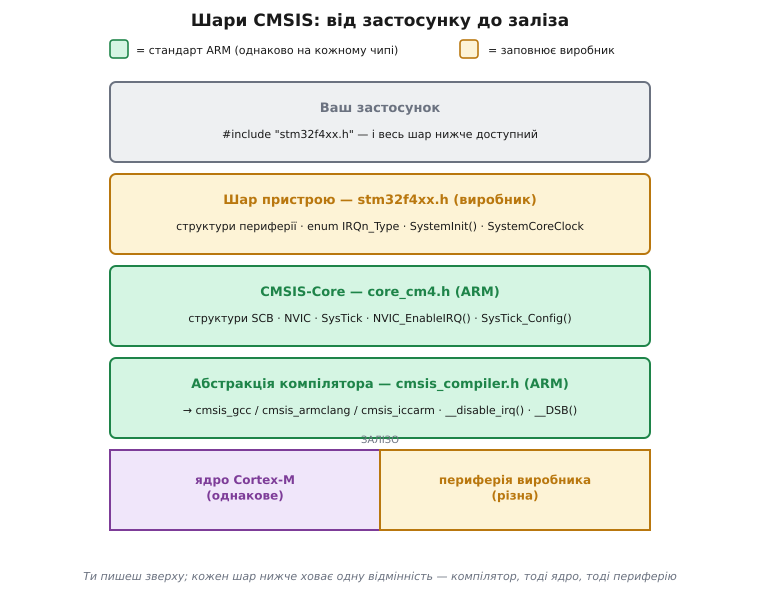
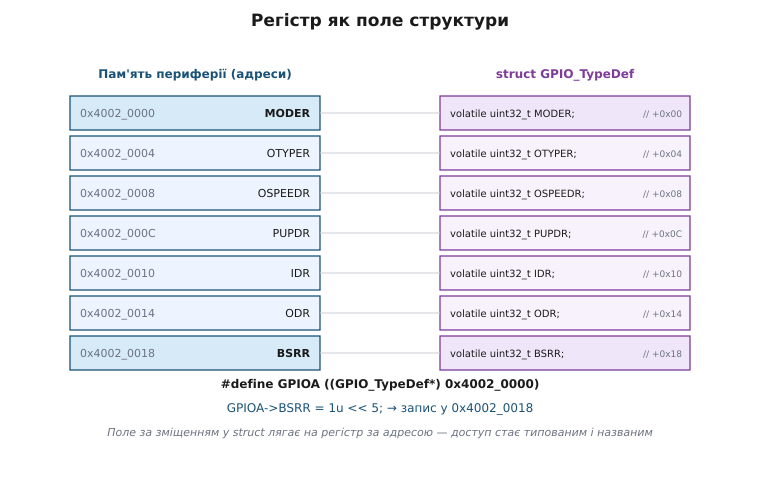
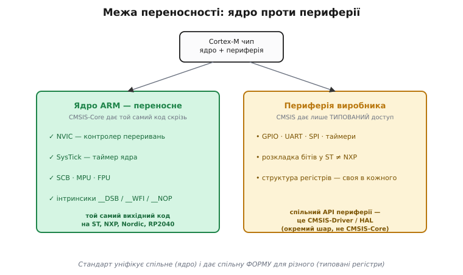
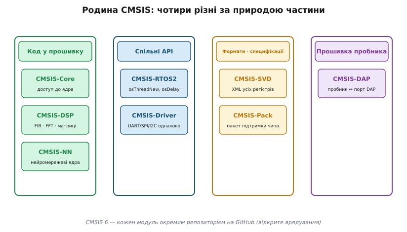

# CMSIS: стандартний інтерфейс ПЗ для Cortex-M

<preknowlist>
- [ARM Cortex-M](root:hw-arch/cortex-m) — будова ядра: NVIC, SysTick, SCB, модель винятків, регістри. CMSIS — це програмний шар саме над цими блоками.
- [Memory-mapped IO](root:hw-arch/memory-mapped-io) — периферія й регістри ядра лежать за фіксованими адресами єдиного простору; доступ до регістра = читання чи запис за адресою.
- [volatile і компілятор](root:sf-tasks/volatile-register) — навіщо змінну-регістр позначати `volatile`, щоб компілятор не кешував і не переставляв доступи.
- [Переривання](root:hw-arch/interrupts) — що таке лінія переривання (IRQ) і навіщо нею керувати; на цьому стоїть API NVIC.
</preknowlist>

Візьми три мікроконтролери: STM32 від STMicroelectronics, nRF52 від Nordic, RP2040 від Raspberry Pi. Усередині кожного — ядро [ARM Cortex-M](root:hw-arch/cortex-m), і воно байт-у-байт однакове: той самий контролер переривань NVIC за адресою 0xE000_E100, той самий таймер SysTick, та сама модель входу у виняток. Логічно очікувати, що код, який чіпає *лише ядро* — вмикає переривання, ставить пріоритет, заводить системний тік, — перенесеться з чипа на чип без жодної правки.

Історично він не переносився. І ламали його дві геть різні речі одночасно.

Перша — **компілятор**. Щоб заборонити переривання, треба виконати одну машинну команду `CPSID i`. Мовою C її не запишеш — немає такого оператора. Тому кожен компілятор дав свій спосіб: Keil armcc розумів `__disable_irq()`, GCC вимагав вбудований асемблер `asm volatile("cpsid i")`, IAR — ще щось третє. Той самий намір «вимкнути переривання» у трьох тулчейнах писався трьома різними рядками, і код не переносився навіть між компіляторами для *того самого* чипа.

Друга — **виробник**. NVIC однаковий апаратно, але як його назвати в C? Один виробник оголошував структуру регістрів `NVIC`, інший — з іншими полями; номер лінії таймера в одного був `#define TIM2_IRQ 28`, в іншого — елемент enum з іншою назвою; функцію початкової ініціалізації хтось звав `SystemInit`, хтось інакше. Навіть лишаючись в одному компіляторі, при переході від ST до NXP доводилося переписувати весь код доступу до ядра.

CMSIS — відповідь ARM на обидві проблеми одразу: один стандартний C-інтерфейс до ядра Cortex-M, однаковий на **кожному** виробнику й у **кожному** компіляторі.

## Що це насправді таке

Назва CMSIS — англ. *Cortex Microcontroller Software Interface Standard*, стандартний програмний інтерфейс для мікроконтролерів Cortex; згодом розшифровку змінили на *Common* («спільний»), коли стандарт розрісся за межі Cortex-M на молодші Cortex-A. ARM оприлюднив його 12 листопада 2008 року разом із виходом Cortex-M3 і розробляв не сам, а в партнерстві з виробниками чипів і тулчейнів — Atmel, IAR, Keil, Luminary Micro, NXP, SEGGER, STMicroelectronics ([як народився стандарт](root:sf-devices/cmsis/hist-cmsis.md)).

Найважливіше, що дивує вперше, — CMSIS здебільшого **не бібліотека, яку лінкуєш**. Це насамперед набір **заголовкових файлів** і **домовленостей про імена**. Майже весь він працює на етапі компіляції: підставляє потрібному компілятору потрібну машинну команду, накладає на голі адреси зрозумілі структури, дає єдині назви. Лише кілька частин родини (обчислювальні бібліотеки DSP і NN) — справжній код, що компілюється у прошивку. Тонкий шар угорі, а не важкий пласт.

## Три шари, зібрані знизу

Щоб побачити, як CMSIS закриває обидві осі непереносності, найкраще зібрати його знизу вгору — від того, що ближче до заліза.


*Ти пишеш зверху. Кожен шар нижче ховає одну відмінність: абстракція компілятора — синтаксис GCC/armclang/IAR; CMSIS-Core — доступ до ядра; шар пристрою — периферію конкретного чипа. Зелене дає ARM (однакове скрізь), амброве заповнює виробник за шаблоном CMSIS.*

Найнижчий шар CMSIS — **абстракція компілятора**. Заголовок `cmsis_compiler.h` дивиться, яким тулчейном тебе компілюють, і підключає відповідний файл: `cmsis_gcc.h`, `cmsis_armclang.h` чи `cmsis_iccarm.h`. Кожен визначає ті самі імена — `__disable_irq()`, `__DSB()`, `__NOP()`, `__REV()` — але через ту конструкцію, яку розуміє саме цей компілятор. Ти пишеш `__disable_irq()` один раз, а те, чи стане воно інтринсиком armclang, чи вбудованим асемблером GCC, вирішує заголовок. Перша вісь непереносності — компілятор — закрита.

Над ним — **шар доступу до ядра**, серце CMSIS-Core: файли `core_cm0.h`, `core_cm3.h`, `core_cm4.h`, `core_cm7.h`, `core_cm33.h`, по одному на профіль. Вони описують блоки *самого ядра* як C-структури за їхніми архітектурними адресами: `SCB` (System Control Block — блок системного керування), `NVIC`, `SysTick`, `MPU`. Оскільки ядро в усіх виробників однакове, цей шар однаковий теж — його пише ARM, і він не залежить від того, чий це чип. Тут же — функції-обгортки над цими регістрами: `NVIC_EnableIRQ()`, `NVIC_SetPriority()`, `SysTick_Config()`.

Ще вище — **шар пристрою**, і оце вже пише **виробник**, але за шаблоном CMSIS. Для STM32F407 це файл `stm32f407xx.h`: він підключає потрібний `core_cm4.h`, оголошує структури регістрів периферії (`GPIO_TypeDef`, `USART_TypeDef` тощо), enum `IRQn_Type` з конкретними номерами ліній переривань саме цього чипа, а також `SystemInit()` і глобальну `SystemCoreClock`. Специфіка виробника лишається — але у **стандартній формі**: скрізь однаково названо, однаково влаштовано, тож інструменти й код наперед знають, чого чекати.

Твій застосунок пише лише `#include "stm32f4xx.h"` — і вся ця вежа доступна: інтринсики, структури ядра, структури периферії, номери переривань.

## Регістр як поле структури

Найцікавіший механізм цієї вежі — як звичайний запис `GPIOA->MODER = 3` перетворюється на збереження числа за адресою `0x4002_0000`. Периферія у Cortex-M — це [регістри, відображені в пам'ять](root:hw-arch/memory-mapped-io): кожен лежить за своєю фіксованою адресою. Голими руками це виглядало б як `*(volatile uint32_t*)0x40020000 = 3` — працює, але нечитабельно й помилконебезпечно.

CMSIS-заголовок виробника робить розумніше. Він оголошує `struct`, поля якого стоять рівно за зміщеннями регістрів, а тоді визначає базу як покажчик на цю структуру:

```c
typedef struct {
    volatile uint32_t MODER;    // 0x00  режим виводів
    volatile uint32_t OTYPER;   // 0x04
    volatile uint32_t OSPEEDR;  // 0x08
    volatile uint32_t PUPDR;    // 0x0C
    volatile uint32_t IDR;      // 0x10  вхідні дані
    volatile uint32_t ODR;      // 0x14  вихідні дані
    volatile uint32_t BSRR;     // 0x18  атомарний set/reset
} GPIO_TypeDef;

#define GPIOA  ((GPIO_TypeDef*) 0x40020000)
```

Тепер `GPIOA->BSRR` — це поле за зміщенням 0x18 від бази `0x4002_0000`; адресу компілятор порахує сам. Доступ став типованим і названим: замість магічного числа — `GPIOA->MODER`, з автодоповненням і перевіркою типів.


*Поле за зміщенням у структурі лягає на регістр за адресою: база плюс зміщення. Тому `GPIOA->BSRR` — це просто запис за фіксованою адресою, тільки типований і названий замість голого числа.*

**Куди насправді пише `GPIOA->BSRR = 1u << 5`:**

```
база GPIOA     = 0x4002_0000
зміщення BSRR  = 0x18
адреса         = 0x4002_0000 + 0x18 = 0x4002_0018
значення       = 1u << 5 = 0x0000_0020      (звести біт 5)
```

Одна машинна команда `STR` кладе `0x20` за адресою `0x4002_0018` — і вивід 5 піднято, без послідовності read-modify-write.

Три деталі роблять цей трюк робочим, і кожна — типова пастка. Поля мусять бути `volatile` (англ. «летючі, мінливі»), інакше компілятор, не бачачи, що за адресою — залізо, закешує значення чи викине «зайвий» запис ([чому саме volatile](root:sf-tasks/volatile-register)). Розкладка структури мусить *точно* збігтися з картою регістрів — діри між регістрами заповнюють полями-заглушками `uint32_t RESERVED0;`, а компілятор не сміє вставляти власне вирівнювання. І частина регістрів вимагає не «прочитати-змінити-записати», а писати ціле слово (як `BSRR`, що атомарно зводить і скидає біти) — інакше переривання вклиниться посеред read-modify-write і загубить зміну. Повний робочий приклад — від голого покажчика до типованої структури й пастки з пакуванням — розібрано в [проєкті про доступ через структуру](root:sf-devices/cmsis/proj-register-struct.md).

## Інтринсики: одне ім'я на команду

Найнижчий шар вартий окремого погляду. Інтринсик (англ. *intrinsic* — «вбудований»; власна функція компілятора, яку той замінює конкретною машинною командою) потрібен там, де операція ядра — це одна машинна команда без відповідника в C. `__WFI()` (Wait For Interrupt) присипляє ядро до наступного переривання. `__DSB()`, `__DMB()`, `__ISB()` — [бар'єри пам'яті](root:hw-arch/memory-barrier-instructions), що впорядковують доступи навколо себе. `__REV()` міняє порядок байтів у слові за одну команду. `__LDREXW()`/`__STREXW()` — ексклюзивний доступ для атомарних операцій. Записати їх мовою C неможливо, а кожен компілятор називає свій інтринсик по-своєму — тому CMSIS дає одне ім'я на операцію, а різницю тулчейнів ховає під ним.

Саме звідси й та зручність, з якої почалася розмова: `__disable_irq()` у твоєму коді компілюється незмінно і під GCC, і під armclang, і під IAR. Повний перелік стандартних інтринсиків, функцій NVIC і структур ядра зібрано в [довідці контракту CMSIS-Core](root:sf-devices/cmsis/api-cmsis-core.md).

> 🔧 **Навіщо це.** Реальна цінність спливає при міграції. Змінюєш компілятор (Keil armcc на GCC у CI) — код доступу до ядра не міняється жодним рядком, бо синтаксис ховає `cmsis_compiler.h`. Переносиш прошивку зі STM32 на nRF — увесь шар переривань, тіків і критичних секцій лишається, переписуєш лише драйвери периферії. Тому вивірений роками рівень роботи з ядром команда возить із продукту в продукт як є, а не пише щоразу наново.

## Служби ядра: NVIC, SysTick, старт

Над інтринсиками стоять функції-служби ядра — те, чим користуєшся щодня. Увімкнути лінію переривання таймера: `NVIC_EnableIRQ(TIM2_IRQn)`. Дати їй пріоритет: `NVIC_SetPriority(TIM2_IRQn, 3)`. Перезавантажити чип: `NVIC_SystemReset()`. Завести системний тік раз на мілісекунду: `SysTick_Config(SystemCoreClock / 1000)`.

Цінність тут не лише в іменах. `NVIC_SetPriority` робить за тебе тонку роботу, на якій легко спіткнутися вручну: у Cortex-M реалізовано *старші* біти байта пріоритету, тож задане число треба зсунути саме в них, а не покласти як є ([модель пріоритетів NVIC](root:hw-arch/interrupt-priorities)). CMSIS-функція зсуває правильно під конкретний чип — ти передаєш логічний рівень, вона кладе його куди слід. Ручний запис «пріоритет = 3» у регістр без зсуву — класичне джерело того, що переривання поводяться не за очікуваним порядком.

Дві назви CMSIS стандартизує окремо, бо на них спираються і стартовий код, і будь-яка RTOS. Перша — `SystemInit()`: цю функцію викликає `Reset_Handler` ще до `main`, і вона робить мінімальне налаштування ядра — вмикає FPU через регістр `CPACR` на ядрах з дробовим блоком ([блок дробових чисел](root:hw-arch/fpu)), за потреби переставляє базу таблиці векторів VTOR, іноді заводить тактування. Уся стартова послідовність від скидання до `main` спирається саме на цей контракт ([boot-послідовність МК](root:hw-arch/bootloader), [таблиця векторів](root:hw-arch/vector-table)).

Друга — глобальна змінна `SystemCoreClock`: 32-бітне число з поточною частотою ядра в герцах, яке оновлює `SystemCoreClockUpdate()` після зміни тактування. Її сенс — щоб ніхто не зашивав частоту константою. `SysTick_Config(SystemCoreClock / 1000)` дає тік щомілісекунди байдуже, чи чип працює на 48 МГц, чи на 168 — код таймінгу лишається переносним.

## Де закінчується переносність

Тут — головне непорозуміння, яке варто зняти прямо. CMSIS-Core робить переносним **ядро**: NVIC, SysTick, SCB, інтринсики справді однакові скрізь. Але він **не** уніфікує **периферію**.


*CMSIS-Core уніфікує спільне — ядро, однакове в усіх. Периферію він лише типує: `GPIOA->MODER` названо й перевірено за типом, але що означають його біти — вирішує виробник. Спільний API до периферії — це вже окремий шар (CMSIS-Driver чи HAL), не CMSIS-Core.*

`GPIOA->MODER` — типований доступ, так. Але *що означають біти* в `MODER` — вирішує ST, і в NXP регістр керування виводом влаштований геть інакше, з іншою назвою й розкладкою. CMSIS дав тобі зручний, названий доступ до регістрів виробника — але не спільний *інтерфейс* до них. Переноситься форма (типовані структури), а не зміст (що і як у них налаштовувати).

Спільний API периферії — це вже окремий шар, який обираєш свідомо: або власна бібліотека виробника (ST HAL, NXP SDK — англ. *Hardware Abstraction Layer*, шар апаратної абстракції), або напівстандартний **CMSIS-Driver** — невеликий спільний API до UART, SPI, I²C та інших вузлів.

> 🔧 **Навіщо це.** Саме тут вирішується, наскільки переносна твоя прошивка. Якщо голі звернення `GPIOA->...` до регістрів виробника розсипані по всій бізнес-логіці — міграція на інший чип стає переписуванням усього. Якщо ж код, що чіпає ядро, тримати на іменах CMSIS, а периферію ховати за власним інтерфейсом драйвера ([шаблон драйвера периферії](root:sf-devices/driver-pattern)), то зміна виробника коштує переписування лише тонкого шару драйверів, а логіка й рівень ядра лишаються цілими.

## Родина CMSIS: чотири різні речі

CMSIS-Core — лише одна частина родини, і плутанина часто в тому, що «CMSIS» — не одне, а кілька різних за природою речей.


*«CMSIS» об'єднує чотири різні за природою частини: код, що компілюється у прошивку; спільні програмні API; файлові формати-специфікації; і прошивку налагоджувального пробника. Плутають їх саме тому, що всі мають префікс «CMSIS», але роблять зовсім різне.*

Перша група — **код, що йде у прошивку**. Крім CMSIS-Core сюди входять **CMSIS-DSP** — бібліотека цифрової обробки сигналів (FIR- і FFT-фільтри, операції над матрицями), оптимізована під команди DSP і FPU старших ядер ([архітектура DSP](root:hw-arch/dsp-architecture), [насичувальна арифметика](root:sf-lang/saturating-arithmetic)), — і **CMSIS-NN** — набір ядер нейромереж для інференсу на краю мережі.

Друга — **спільні API**. **CMSIS-RTOS2** — незалежний від виробника інтерфейс до операційної системи реального часу: `osThreadNew()`, `osDelay()`. Він не сама RTOS, а фасад: під ним працює або еталонна Keil RTX5, або перехідник до [FreeRTOS](root:sf-devices/freertos). Пишеш під CMSIS-RTOS2 — і зможеш підмінити ядро ОС, не переписуючи задачі. Сюди ж належить і CMSIS-Driver, згаданий вище.

Третя — **файлові формати й специфікації**, які самі не є кодом. **CMSIS-SVD** (System View Description — опис системного вигляду) — XML-опис *усіх* регістрів периферії чипа; з нього генерують і device-заголовки, і той вигляд регістрів із поточними значеннями, що його показує відлагоджувач ([формат SVD](root:sys-ide/svd-format)). **CMSIS-Pack** — формат «пакета підтримки»: як виробник постачає заголовки, драйвери й опис чипа одним встановлюваним архівом.

Четверта — **прошивка налагоджувального пробника**. **CMSIS-DAP** — стандартний протокол прошивки для дешевих пробників, щоб вони говорили з портом доступу до налагодження (DAP) на чипі ([SWD і JTAG зсередини](root:sys-ide/swd-jtag-internals)).

У CMSIS 6 (2024) ці частини розділили на окремі репозиторії на GitHub з відкритим врядуванням — кожен модуль тепер версіонується самостійно.

Тож коли [ядро Cortex-M](root:hw-arch/cortex-m) вивчене один раз, CMSIS перетворює «зрозумів, як воно влаштоване» на «написав це раз і назавжди»: той самий код NVIC, SysTick та інтринсиків збереться під будь-який Cortex-M і будь-який компілятор. А те, що уніфікувати не можна — периферію кожного виробника, — стандарт бодай приводить до єдиної форми: типовані структури в заголовках, повний опис регістрів у SVD, єдине пакування у Pack. У цьому й сенс «стандартного інтерфейсу»: не в тому, що все стало однаковим, а в тому, що однакове зафіксовано, а відмінне — описано однією спільною мовою, зрозумілою і людині, і інструментам.
