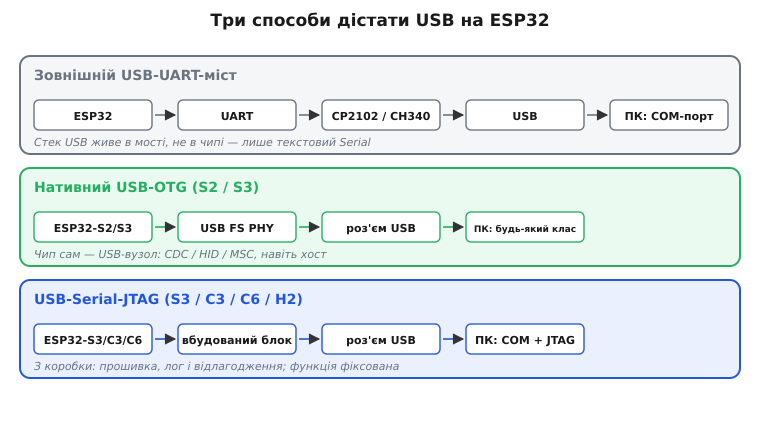
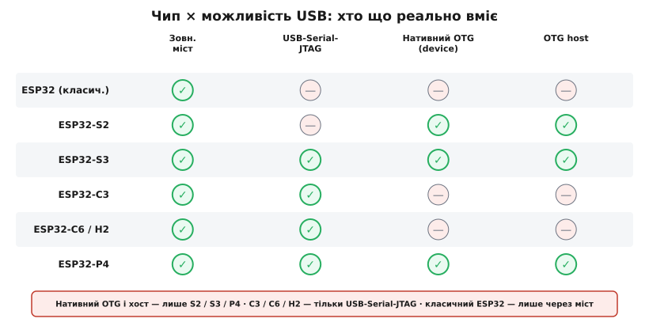
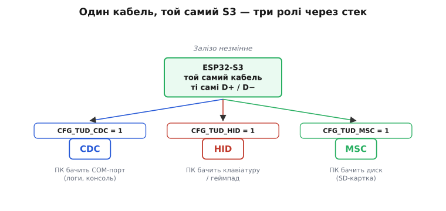
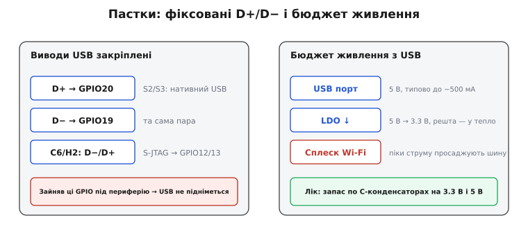

# USB в ESP32

<preknowlist>
- [UART (несинхронний послідовний обмін)](root:com-devices/async-serial) — байти рамками «старт-біт, дані, стоп-біт» на узгодженій швидкості; на ньому тримається зовнішній USB-міст.
- [USB-класи](root:com-devices/usb-device-classes) — CDC (віртуальний COM-порт), HID (клавіатура/миша), MSC (диск): як хост за дескриптором добирає драйвер.
- [Загальна картина USB](root:com-devices/usb-overview) — хто на шині командує (host) і хто лише відповідає (device).
</preknowlist>

USB на ESP32 — це не одна функція, а кілька різних рішень, і яким саме шляхом чип отримує USB, залежить від моделі. [Сімейство ESP32 строкате](root:embedded/esp32-family): щодо USB картина суттєво відрізняється від чипа до чипа — одні моделі мають повноцінний апаратний USB-контролер, інші лише спрощений фіксований блок, а класичний ESP32 взагалі покладається на зовнішній перетворювач. З'ясуймо, чим оснащена кожна модель і яке рішення під яку задачу.

## Три способи дістати USB



*Зовнішній міст бачить ОС як COM-порт, але сам ESP32 у USB «сліпий». Нативний OTG (англ. on-the-go — «на ходу», бо одне гніздо може бути то пристроєм, то хостом) робить чип повноцінним вузлом. USB-Serial-JTAG дає прошивку, лог і відлагодження одним кабелем без жодного коду.*

**Зовнішній USB-UART-міст** (класичний ESP32 і будь-яка інша модель). Мікроконтролер спілкується через [UART](root:com-devices/async-serial), а окремий чип — CP2102, CH340, FT232 — перетворює UART на USB-CDC (англ. Communications Device Class — «клас пристроїв зв'язку», стандартний профіль віртуального COM-порту). Для ОС це COM-порт. Спосіб простий, надійний і дешевий. Та суть у тому, що USB-стек живе в зовнішньому чипі, а не в ESP32. Сам мікроконтролер у USB нічого не «бачить» і ним не керує, тому такий ESP32 не прикинеться флешкою, клавіатурою чи хостом — лише текстовий Serial.

**Нативний USB-OTG** (ESP32-S2, S3 і High-Speed P4). У цих моделях є повноцінний апаратний блок USB 2.0 OTG. ESP32 сам стає USB-контролером: формує дескриптори, відповідає на запити хоста, реалізує будь-який клас — CDC, HID, MSC — або навіть [сам стає хостом для інших пристроїв](root:com-devices/usb-host). Для цього потрібен програмний USB-стек, скажімо [TinyUSB у ролі пристрою](root:sf-devices/tinyusb-device), що входить до ESP-IDF. Швидкість на S2/S3 — Full-Speed, 12 Мбіт/с; High-Speed (480 Мбіт/с) є лише на P4.

**USB-Serial-JTAG** (ESP32-S3, C3, C6, H2 і новіші). Це вбудований апаратний блок, що дає CDC-порт (для прошивки й Serial-логів) і JTAG (англ. Joint Test Action Group — галузева група, чиє ім'я закріпилось за стандартом IEEE 1149.1 на апаратне відлагодження) — JTAG-over-USB просто «з коробки», без зовнішнього моста і без власного USB-стека. Підключаєш кабель — і ОС бачить два нових пристрої: COM-порт і JTAG-інтерфейс. Зручно для розробки. Але функція фіксована: змінити клас чи додати HID уже не вийде. ESP32-S3 має обидва блоки — і USB-Serial-JTAG, і нативний OTG — на спільній нативній USB-парі GPIO19/20; який із них керує портом, обираєш при конфігуруванні.

> 🔧 **Навіщо це.** Розуміння «що в моєму чипі — справжній USB, а що лише UART-міст» рятує від класичної плутанини «чому S3 прикидається флешкою, а класичний ESP32 ні». Це пряме інженерне рішення на старті: проєкту потрібен нестандартний USB-клас або хост → відразу бери S2 чи S3; досить Serial і відлагодження → вистачить C3/C6 із вбудованим USB-Serial-JTAG чи навіть класичного ESP32 з мостом.

## Окремий блок USB-Serial-JTAG зсередини

USB-Serial-JTAG легко сприйняти як «менший OTG», та насправді це інший звір. OTG — це програмований контролер: дескриптори, класи й кінцеві точки задаєш ти. USB-Serial-JTAG — апаратний автомат із намертво зашитими дескрипторами: він завжди представляється як композитний пристрій із двох частин — CDC-ACM (віртуальний COM-порт) і WinUSB-інтерфейс JTAG. Хост-комп'ютер бачить готовий пристрій ще до того, як на чипі стартує бодай рядок твого коду, бо логіка дескрипторів — у залізі, а не у прошивці.

Звідси його головна цінність і його межа. Цінність: чистий чип просто з заводу вже прошивається й віддає лог через USB — нічого налаштовувати. Межа: ти не зміниш ні VID/PID, ні клас, ні набір кінцевих точок. Потрібен HID чи MSC — це вже інший блок, нативний OTG на S2/S3, а не USB-Serial-JTAG.

> 🔧 **Навіщо це.** Саме USB-Serial-JTAG прибирає з плати зовнішній CP2102/CH340: на C3/C6 одне USB-гніздо одночасно заливає прошивку, віддає `printf`-лог і дає крапкову точку зупину через JTAG. Менше деталей, дешевша плата, а відлагодження — по тому ж кабелю, що й живлення.

## Довільний клас — лише там, де є OTG

Тут криється поширена пастка. Легко вирішити, що новіший чип уміє більше: якщо C3 має USB-Serial-JTAG, то C6 і H2 нібито «доросли» й до довільного USB-класу. Насправді ні. **C3, C6 і H2 несуть рівно один USB-блок — той самий фіксований USB-Serial-JTAG**, і жоден із них не стане ні клавіатурою, ні диском: молодші кристали додали Wi-Fi 6, Thread і Zigbee, тобто нову радіочастину, а не нові USB-класи. «Довільний клас» дає тільки нативний OTG — а він є лише на S2, S3 і P4.

Отже, межа проходить чітко: будь-який клас **пристрою** (CDC, HID, MSC через TinyUSB) — S2/S3 (Full-Speed) або P4 (High-Speed); **хост** (читати USB-флешку чи клавіатуру) — так само лише S2/S3 і P4. Решта сімейства — C3, C6, H2 — по USB робить дві речі: прошивається й віддає Serial із JTAG, і нічого понад те.

Найновіший **ESP32-P4** стоїть осібно ще й швидкістю: у нього USB 2.0 High-Speed (480 Мбіт/с) і повноцінний хост, тож стеля 12 Мбіт/с на ньому вже не діє.

## Виводи

На S2 і S3 лінії USB D+ і D− закріплені за конкретними GPIO і довільно не перепризначаються: D+ → GPIO20, D− → GPIO19. Поки USB активний, ці виводи зайняті й під інше не вільні. На C6 закріплена інша пара, під USB-Serial-JTAG: D− → GPIO12, D+ → GPIO13. Strapping-виводи і [режим завантаження](root:hw-arch/bootloader) при цьому нікуди не діваються: вибір джерела USB не скасовує логіку входу в bootloader під час скидання.



*Що реально вміє кожна модель. Нативний OTG (довільний клас) і хост — лише S2/S3 та High-Speed P4. C3, C6 і H2 мають тільки фіксований USB-Serial-JTAG: прошивка, лог і JTAG, без інших класів. Класичний ESP32 живе лише через зовнішній міст.*

## Коли що обирати

| Задача | Рекомендований шлях |
|--------|---------------------|
| Залити прошивку, читати Serial, відлагоджувати | USB-Serial-JTAG (S3/C3/C6/H2) або зовнішній міст |
| МК як COM-порт для власного ПЗ | CDC через нативний OTG (S2/S3/P4) або CDC через міст |
| МК як клавіатура, геймпад, макропад | HID через нативний OTG — лише S2/S3 (чи P4) |
| МК віддає SD-картку як диск | MSC через нативний OTG — лише S2/S3 (чи P4) |
| МК читає USB-флешку чи клавіатуру | [Хост-режим](root:com-devices/usb-host) — лише S2/S3 (і P4) |

**Один кабель, той самий S3 — три ролі**

Один ESP32-S3 DevKit, один USB-кабель. Залізо незмінне; змінюється тільки конфігурація стека:

```c
/* Варіант 1: CDC (COM-порт для логів) */
/* tusb_config.h: CFG_TUD_CDC = 1, CFG_TUD_HID = 0, CFG_TUD_MSC = 0 */
tud_cdc_write_str("Hello from CDC!\r\n");
tud_cdc_write_flush();

/* Варіант 2: HID-клавіатура — надіслати натискання 'A' */
/* CFG_TUD_HID = 1 */
uint8_t keycode[6] = { HID_KEY_A, 0, 0, 0, 0, 0 };
tud_hid_keyboard_report(REPORT_ID_KEYBOARD, 0 /*modifier*/, keycode);
tud_task();                                       /* обробити USB-події */
tud_hid_keyboard_report(REPORT_ID_KEYBOARD, 0, NULL);  /* відпустити клавішу */

/* Варіант 3: MSC (флешка з SD-карткою) */
/* CFG_TUD_MSC = 1 */
/* реалізувати tud_msc_read10_cb() / tud_msc_write10_cb() → SD через SPI */
```



*Той самий роз'єм і ті самі D+/D− дають COM-порт, клавіатуру або диск. Клас визначають дескриптори, а їх задає конфігурація TinyUSB — не паяння.*

Залізо те саме. Змінюється конфігурація TinyUSB і, відповідно, дескриптори, що формуються при ініціалізації.

## Дві пастки на старті

Перша — виводи. На S2/S3 GPIO19 і GPIO20 — це D−/D+; якщо ти вже завів їх під свою периферію (скажімо, SPI чи I²C), USB просто не підніметься, і це не «глюк плати», а конфлікт за вивід. Спершу плануй USB-пару, тоді решту.

Друга — живлення. USB-порт дає 5 В і типово до ~500 мА; після LDO на 3.3 В частина потужності йде в тепло, а сплески струму під час передавання по Wi-Fi легко просаджують шину. Лік простий: запас по конденсаторах на лініях 3.3 В і 5 В, інакше чип перезавантажуватиметься саме в найгарячіший момент.



*Дві типові поразки на першому ввімкненні: конфлікт за виводи D+/D− і просідання живлення на піках струму. Обидві лікуються плануванням до розведення плати.*
