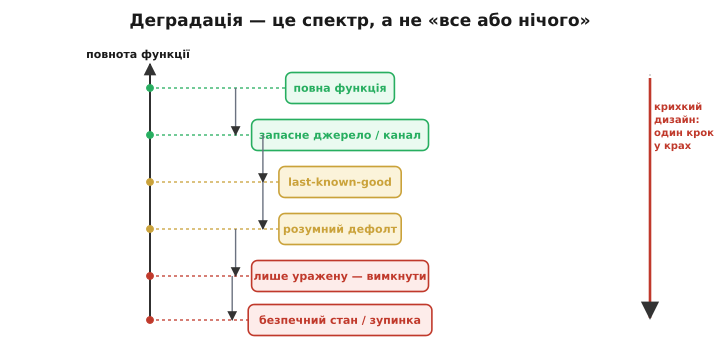
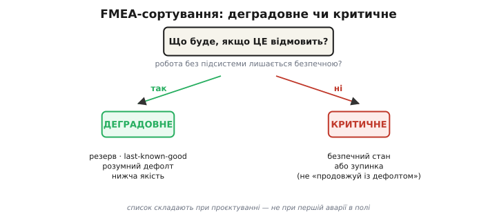
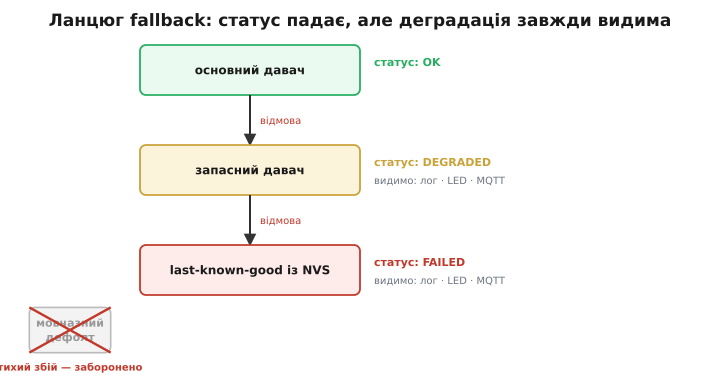

# Деградація з гідністю

Вершина відмовостійкості — не «все або нічого», а здатність втратити одну підсистему й **продовжити робити решту**. Зрілий пристрій при частковій відмові слабшає, а не вмирає. Англійці назвали це **graceful degradation** (англ. *graceful* — гідний, плавний; *degradation* — спад): функція спадає плавно й гідно, а не обвалюється вся одразу.

## Крихкий дизайн проти стійкого

Уявімо клімат-пристрій, у якому відвалився давач температури. У крихкому дизайні наслідок один: відмова будь-якого компонента валить усе, і один несправний давач = повна зупинка. Користувач лишається в холодній кімнаті не тому, що пристрій не може гріти, а тому, що код не знає, що робити без одного числа.

Чи справді треба глушити весь пристрій? Майже ніколи. Можна перейти на запасний давач або на останнє відоме значення, продовжувати підтримувати базову температуру — але **чесно позначити**, що система деградувала, і не приховувати це. Різниця між двома пристроями не в залізі, а в тому, чи передбачив інженер відмову заздалегідь. Стійкий пристрій втрачає одну здатність і працює рештою; крихкий від першої ж дрібниці падає цілком.

Тому деградація — це не одне рішення «жити чи померти», а **спектр відповіді**: між повною функцією й безпечною зупинкою є кілька сходинок, і завдання інженера — спуститися на найвищу з можливих, а не стрибнути одразу в крах.



*Між повною роботою й крахом лежать сходинки: резерв, останнє добре значення, розумний дефолт, вимкнення лише ураженого, нижча якість. Крихкий дизайн жодної з них не має.*

## П'ять стратегій деградації

Спускаючись цим спектром, інженер має п'ять типових ходів, від найм'якшого до найжорсткішого.

**Запасне джерело.** Другий давач тієї ж величини на іншій шині або резервний канал зв'язку. Основний відмовив — перемикаємося на дублікат і працюємо майже як раніше.

**Last-known-good** (англ. «останнє відоме добре») — останнє правильне значення, збережене в [енергонезалежному сховищі NVS](root:sys-fw/nvs) або в [пам'яті без зносу запису](root:embedded/eeprom-fram). Температура за секунду різко не міняється, тож кілька секунд на старому числі — прийнятна плата за те, щоб не зупинятися.

**Розумний дефолт.** Якщо немає ні резерву, ні збереженого значення, підставляємо безпечне передбачуване число замість збожеволілого. Давач віддав −1000°C — це фізична нісенітниця; краще взяти консервативні 20°C і не дати алгоритмові керування рознести систему від хибного входу.

**Вимкнути лише уражену функцію**, лишивши решту. Відмовив давач вологості — пристрій перестає керувати зволожувачем, але опалення й вентиляція працюють далі. Втрата одного входу гасить одну гілку логіки, не всю.

**Знизити якість або частоту.** Рідше міряти, грубіше керувати, передавати телеметрію раз на хвилину замість раз на секунду — замість повної відмови. Система свідомо стає гіршою, щоб лишитися живою.

## Ізоляція відмов — передумова деградації

Жодна з цих стратегій не спрацює, якщо відмова однієї підсистеми тягне за собою інші. Деградація можлива лише там, де підсистеми **розв'язані** — кожна може впасти окремо, не валячи сусідів.

У RTOS це означає конкретну архітектуру: кожна [задача](root:sf-os/tasks) живе у [своєму стеку](root:sf-lang/task-stacks) і зі своєю структурою стану. Якщо одна задача зациклилась чи її перезапустив watchdog, інші продовжують виконуватись — їхня пам'ять не зачеплена, їхній код не залежить від ураженої. Тому модульність тут не архітектурна естетика, а пряма вимога стійкості: погано розв'язаний код деградувати не вміє в принципі, бо в ньому немає межі, по якій відмову можна локалізувати. Спершу ізоляція — потім деградація; без першого друге неможливе.

## «Позначити деградацію» — критичне правило

Деградований режим **мусить бути видимим**. Це не побажання, а половина суті: пристрій, що тихо перейшов на запасний давач і показує «нормальні» значення, **бреше**. Користувач вважає систему здоровою, довіряє її числам і ухвалює рішення на основі брехні — а вона вже частково відмовила.

Тому кожен спуск сходинкою деградації супроводжуємо явним сигналом: індикатор аварії, запис у лог, статус у телеметрії чи MQTT-топіку. [Мовчазний збій](root:sf-apps/error-handling) — найгірше, що може статися з приладом, бо він знімає саму можливість зреагувати. Чесна деградація проста на формулювання: я знаю, що неповний, і кажу про це. Усе інше — тихий обман.

## Межа деградації

Не будь-яка підсистема має право деградувати. Якщо відмовила та, без якої робота стає **небезпечною** — давач полум'я в газовому котлі, давач положення в маніпуляторі поруч із людиною, — продовжувати з дефолтом не можна. Розумний дефолт замість реального полум'я означав би, що пристрій вважає вогонь там, де його немає, або навпаки. Це випадок не для «працюй далі», а для [безпечного стану чи зупинки](root:sf-devices/safe-mode).

Звідси головне проєктне рішення: для кожної підсистеми треба заздалегідь відповісти, **деградовна вона чи критична**. Деградовна — та, без якої часткова робота лишається безпечною (їй даємо резерв або дефолт). Критична — та, без якої робота небезпечна (їй даємо лише безпечний стан). Цей список складають за столом при проєктуванні, а не нашвидкуруч під час першої аварії в полі.



*Одне питання — «що буде, якщо ЦЕ відмовить?» — розводить підсистеми на два кошики: деградовні (резерв, дефолт, нижча якість) і критичні (безпечний стан чи зупинка).*

## Проєктування під деградацію — думати FMEA

Систематичний спосіб скласти цей список — мислити в дусі **FMEA** (англ. *Failure Mode and Effects Analysis* — аналіз видів і наслідків відмов). Для кожної підсистеми ставимо одне питання: «Що буде, якщо ЦЕ відмовить?» — і записуємо наслідок та категорію: деградовне (з резервом чи дефолтом) або критичне (безпечний стан чи зупинка).

Дефолти й резерви закладаємо **заздалегідь**, ще на етапі коду, бо саме тут ховається пастка. Якщо давач відмовить у полі, а в коді немає жодного fallback-шляху (англ. *fallback* — запасний хід), то «рішення» доведеться писати в паніці поверх уже зламаної системи — неперевірене, поспішне й тому небезпечне. Шлях відступу має бути написаний і продуманий тоді, коли все ще працює; аварія — невдалий час винаходити порятунок.

> 🔧 **Навіщо це.** Різниця між іграшкою й надійним приладом: іграшка від першої відмови «вмирає» вся, надійний прилад втрачає одну здатність і чесно працює рештою — поки його не полагодять. Саме деградація з гідністю робить пристрій таким, якому **довіряють у полі**: він не збреше про свій стан і не зупиниться несподівано від дрібниці.

## Worked-приклад: читання температури з повним ланцюгом fallback

Зберемо все докупи — функцію читання температури з трьома сходинками відступу й чесним прапорцем деградації. Спочатку основний давач, тоді запасний, тоді останнє добре значення; статус на кожній сходинці падає й стає видимим.

```c
#include "nvs_flash.h"
#include "esp_log.h"
static const char *TAG = "temp_reader";

// Статус деградації — видимий іншим підсистемам
typedef enum {
    SENSOR_OK         = 0,
    SENSOR_DEGRADED   = 1,   // резерв або last-known-good
    SENSOR_FAILED     = 2,   // повна відмова, консервативний режим
} sensor_status_t;

static sensor_status_t s_temp_status = SENSOR_OK;

// Зовнішні API давачів
esp_err_t primary_sensor_read(float *out_c);    // основний (I2C)
esp_err_t backup_sensor_read(float *out_c);     // запасний (ADC)

float read_temperature_degc(void) {
    float temp;

    // Сходинка 1: основний давач
    if (primary_sensor_read(&temp) == ESP_OK) {
        if (s_temp_status != SENSOR_OK) {
            ESP_LOGI(TAG, "primary sensor restored");
        }
        s_temp_status = SENSOR_OK;
        // Оновити last-known-good, але не щоразу — інакше зносимо Flash
        static uint32_t s_lkg_update_tick = 0;
        if (xTaskGetTickCount() - s_lkg_update_tick > pdMS_TO_TICKS(60000)) {
            nvs_set_i32(nvs_h, "temp_lkg", (int32_t)(temp * 100));
            nvs_commit(nvs_h);
            s_lkg_update_tick = xTaskGetTickCount();
        }
        return temp;
    }

    ESP_LOGW(TAG, "primary sensor failed — trying backup");

    // Сходинка 2: запасний давач
    if (backup_sensor_read(&temp) == ESP_OK) {
        s_temp_status = SENSOR_DEGRADED;
        ESP_LOGW(TAG, "DEGRADED: using backup sensor, temp=%.1f C", temp);
        // Позначити деградацію (індикатор, телеметрія)
        gpio_set_level(GPIO_FAULT_LED, 1);
        mqtt_publish("status/sensor", "degraded:backup");
        return temp;
    }

    ESP_LOGE(TAG, "BOTH sensors failed — using last-known-good");

    // Сходинка 3: last-known-good із NVS
    int32_t lkg_raw = 2000;   // дефолт 20.0 °C, якщо в NVS ще нічого не писали
    nvs_get_i32(nvs_h, "temp_lkg", &lkg_raw);

    s_temp_status = SENSOR_FAILED;
    // Консервативний режим — нагрівач лише до 50% потужності
    heating_set_max_power(50);
    gpio_set_level(GPIO_FAULT_LED, 1);
    mqtt_publish("status/sensor", "failed:last-known-good");

    // ЗАБОРОНЕНО повертати дефолт мовчки — це тихий збій
    return lkg_raw / 100.0f;   // завжди з прапорцем, ніколи мовчки
}

sensor_status_t get_temperature_status(void) {
    return s_temp_status;
}
```

Три деталі тут несуть усю вагу. По-перше, `s_temp_status` — публічний стан, який будь-яка інша підсистема може прочитати через `get_temperature_status()`, тож алгоритм керування сам вирішує, наскільки довіряти числу. По-друге, last-known-good записується раз на 60 секунд, а не щотакту: Flash має скінченний ресурс перезаписів, і безоглядний запис зносив би його за дні. По-третє, кожна деградована гілка піднімає `GPIO_FAULT_LED` і шле MQTT — деградація тут видима завжди, мовчазної гілки в коді просто немає.

Один такий прапорець описує одну підсистему. У реальному пристрої їх багато, і постає окреме питання: як звести десяток статусів у єдиний режим усього пристрою, де найгірший голос вирішує, а вага підсистеми (деградовна чи критична) визначає, наскільки серйозний наслідок.

> ⚙️ **Звести голоси в режим.** Окремі прапорці підсистем мало що варті, поки хтось не збере їх у єдиний health-рівень пристрою: найгірший статус вирішує, критична підсистема важить більше за деградовну. Як це закодувати разом із пастками (незкинутий прапорець, дрижання режиму) — у вставці [Агрегатор стану](root:sf-devices/graceful-degradation/proj-health-aggregator.md).



*Кожна сходинка вниз опускає статус і вмикає видимий сигнал (лог, індикатор, телеметрія). Бічна гілка «мовчазний дефолт» заборонена — це той самий тихий збій.*

## Дрібні правильні рішення проти однієї пропущеної перевірки

Відмовостійкість — не героїзм, а дисципліна дрібних правильних рішень. Кожне з них окремо просте: одна перевірка return-коду, один assert на інваріант, один безпечний дефолт для актуатора, один рядок у лічильнику відмов. Жодне не дивовижне саме по собі. Але разом вони — різниця між столовим прототипом, що «працює в ідеальних умовах», і промисловим пристроєм, що виживає в реальних.

Ціна пропущеної дрібниці буває величезною. Ракета Ariane 5 загинула за 37 секунд після старту саме тому, що одне рішення — перевірити переповнення при приведенні 64-бітного числа до 16-бітного — не було прийняте, і необроблений виняток поклав справну систему наведення. Одна перевірка. Один рядок коду. Деградація з гідністю — це звичка приймати такі рішення завчасно, поки ще є кому й де їх приймати.
