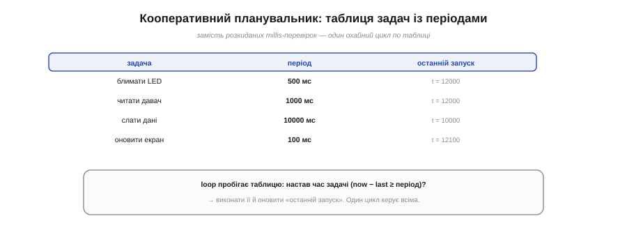
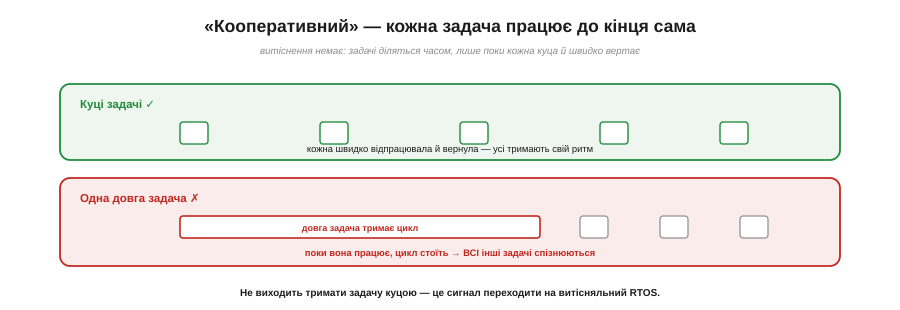

# ⚙️ Кооперативний планувальник на millis: список задач із періодами

## Задача

[Неблокуючий патерн](topic:sf-devices/nonblocking-time) — «настав час? → зроби» — чудовий для **однієї** періодичної дії. Та реальний пристрій робить багато такого заразом: блимати раз на 500 мс, читати давач раз на секунду, слати дані раз на 10 секунд, оновлювати екран десять разів на секунду. Розкидати по `loop()` десяток окремих `if (now − last_i >= period_i)` — швидко стає мішаниною змінних, у якій легко помилитися. Як **організувати** багато періодичних задач охайно?

## Ідея

Складімо задачі в **таблицю**. Кожен рядок — це задача: її **функція**, її **період** і час **останнього запуску**. А `loop()` робить одне: **пробігає** таблицю й для кожної задачі питає «настав час?» — і якщо так, виконує її та оновлює мітку.


*Задачі складено в таблицю: функція, період, час останнього запуску. Цикл пробігає рядки й для кожної перевіряє now − last ≥ період; настав час — виконує й оновлює мітку. Один цикл керує всіма замість розкиданих перевірок.*

Це й зветься **кооперативний планувальник**. «Кооперативний» — бо задачі **співпрацюють**: кожна виконується **до кінця** й сама добровільно вертає керування. Витіснення тут немає — ніхто нікого не перебиває; задачі діляться процесором лише тому, що кожна **куца** й швидко звільняє цикл. Це найпростіший «диспетчер» на світі — і його вистачає для дивовижно багатьох пристроїв.

## Таблиця задач у коді

Ось та сама таблиця в коді. Рядок — це структура з трьох полів: **що** виконати (покажчик на функцію), **як часто** (період) і **коли робили востаннє** (мітка). `loop()` пробігає масив і для кожного рядка ставить те саме питання, що й неблокуючий патерн для однієї дії, — «now − last ≥ період?».

:::tabs
```cpp
// задачі-функції визначені деінде у скетчі
void blink();
void readSensor();
void sendData();
void updateScreen();

typedef void (*TaskFn)();          // покажчик на функцію задачі

struct Task {
  TaskFn        run;               // що виконати
  unsigned long period;            // період, мс
  unsigned long last;              // мітка останнього запуску
};

Task tasks[] = {
  { blink,        500,   0 },
  { readSensor,   1000,  0 },
  { sendData,     10000, 0 },
  { updateScreen, 100,   0 },
};
const size_t TASK_COUNT = sizeof(tasks) / sizeof(tasks[0]);

void loop() {
  unsigned long now = millis();
  for (size_t i = 0; i < TASK_COUNT; i++) {
    if (now - tasks[i].last >= tasks[i].period) {
      tasks[i].run();                     // задача виконується до кінця
      tasks[i].last += tasks[i].period;   // рівна сітка, а не = now
    }
  }
}
```
```micropython
import time

# кожна задача — [функція, період_мс, остання_мітка]
tasks = [
    [blink,         500,   0],
    [read_sensor,   1000,  0],
    [send_data,     10000, 0],
    [update_screen, 100,   0],
]

while True:
    now = time.ticks_ms()
    for t in tasks:
        if time.ticks_diff(now, t[2]) >= t[1]:
            t[0]()                              # задача виконується до кінця
            t[2] = time.ticks_add(t[2], t[1])   # рівна сітка, а не = now
```
:::

Покажчик на функцію (`TaskFn` у C++, сам об'єкт функції в Python) — це та ланка, що дає скласти **дії** в таблицю: у першому полі лежить не код, а те, **що** запустити. Тому додати нову задачу — це **один рядок** у масиві, а не нова жменя розкиданих змінних; уся механіка часу зосереджена в єдиному циклі.

## Тонкість: `last += period` чи `last = now`

Оновлюючи мітку, є два способи. `last = now` простий, але якщо задача запізнилася (цикл був зайнятий чимось довгим), наступний період відлічиться **від моменту запізнення** — і середній темп попливе. `last += period` тримає темп **точним** у середньому: мітки лягають на рівну сітку, без накопичення дрейфу, — та якщо задача відстала надовго, вона може кілька разів «доганяти» поспіль. Для рівномірних періодичних справ зазвичай беруть `last += period`.

## Складність і пастки на МК

- **Задачі мусять бути куці.** Витіснення немає — тож **довга** задача затримує **всі** інші. Жодного `delay()` усередині, жодних довгих циклів: задача має швидко зробити своє й вернути.
- **Спільний пік.** Якщо кілька задач стають «на часі» в один тік, вони біжать **по черзі** в порядку таблиці; довга з них зсуне решту. Розкидайте важкі задачі або робіть їх коротшими.
- **Не плутати з RTOS.** Кооперативний планувальник — це RTOS **без витіснення**: простий, передбачуваний, без окремого стека на задачу. Та коли задачу **не виходить** тримати куцою, настає час **витісняльного** RTOS, що сам перерве довгу задачу.
- **Багато таймерів — інша структура.** Для **кількох** періодичних задач лінійна таблиця ідеальна. Для **сотень** динамічних таймерів є спритніша структура — [«колесо таймерів»](topic:sf-devices/periodic-scheduling).


*Витіснення немає: куці задачі швидко відпрацьовують і вертають — усі тримають ритм. Одна довга задача тримає цикл, і всі інші спізнюються. Не виходить тримати задачу куцою — час переходити на витісняльний RTOS.*

Головний зиск — не лише охайність, а й те, що **поведінка пристрою стає даними**: додати, прибрати чи переналаштувати задачу — це правка одного рядка таблиці, а не переписування `loop()`. Доки задачі куці, цієї таблиці з єдиним циклом вистачає, щоб вести цілий пристрій без жодного RTOS.
