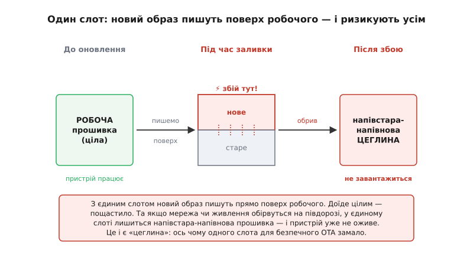
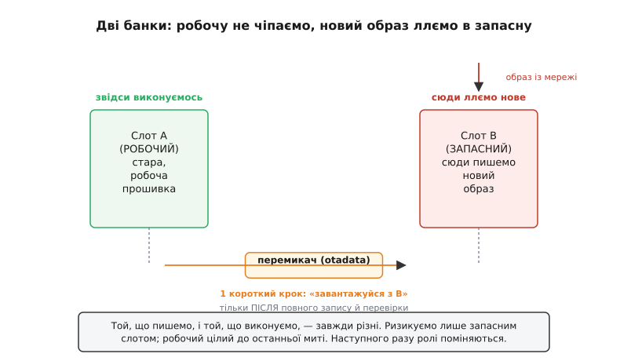
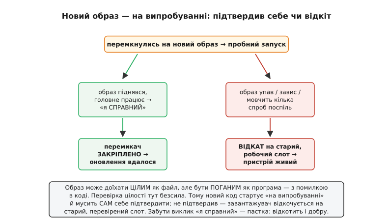
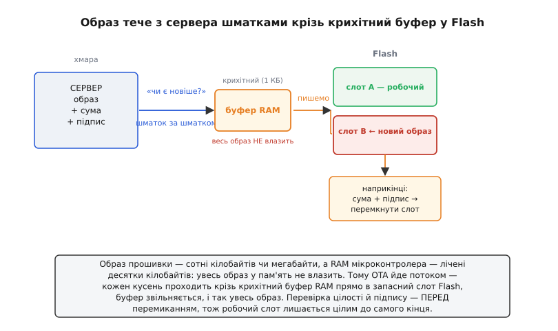
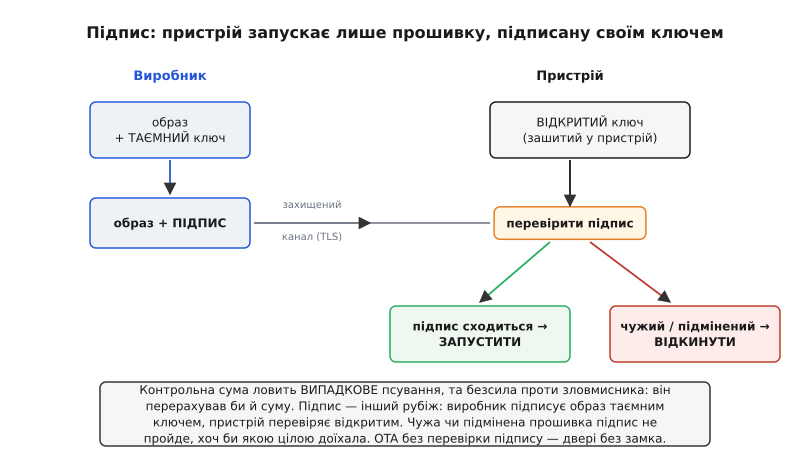

# Оновлення прошивки через ефір (OTA)

Уявіть тисячу датчиків, розкиданих по полях, чи десять тисяч розумних лампочок у будинках по всьому місту. У кожному — прошивка, і в ній знайшлася помилка: вузенька, та неприємна. Виправлення готове за годину. А тепер найгірше питання: **як його туди залити?** Об'їхати тисячу адрес із ноутбуком і кабелем? Попросити кожного власника принести лампочку й тицьнути в USB? Це не просто незручно — це **неможливо** в будь-якому реальному масштабі. Саме з цієї безвиході й народилося оновлення **через ефір** — коли нова прошивка прилітає до пристрою сама, тим самим каналом, яким він уже спілкується зі світом: по Wi-Fi, по мобільному зв'язку, по радіо.

Англійською це звуть **OTA** (*over-the-air* — «по повітрю»), і назва точна: дріт не потрібен, пристрій лишається там, де висить, а код у ньому міняється на новіший. Звучить як дрібна зручність, та насправді це вододіл. Пристрій без OTA — застиглий: яким його випустили, таким він і помре, бо полагодити вже навряд чи вийде. Пристрій з OTA — **живий**: його можна виправляти, додавати йому вміння, латати діри в захисті роками після продажу. Різниця та сама, що між книжкою, надрукованою раз і назавжди, і книжкою, яку автор досилає й виправляє, поки ви її читаєте.

Тож розберімо це чесно й до дна: чому така спокуса криє в собі смертельний ризик, як від нього бороняться, як насправді тече оновлення від сервера до Flash і чому без перевірки цілості та підпису пускати чужий код у пристрій — божевілля.

### Спокуса і її ціна — «цеглина»

Найперше бажання, коли чуєш «оновлюй по повітрю», — найпростіше: прийняв нову прошивку й **записав її поверх старої**, прямо в той Flash, звідки пристрій працює. Один слот, ніякого клопоту. І ось тут підстерігає катастрофа, яку треба зрозуміти раз і назавжди.

Прошивка — це код, який **виконується просто зараз**: процесор крок за кроком зчитує з Flash інструкції чинної програми. Спробувати переписати цей самий Flash новим кодом — однаково що пиляти гілку, на якій сидиш. А тепер додаймо найгіршу можливість: оновлення летить по **ненадійній** мережі — Wi-Fi мигнув, сервер відвалився, у пристрої сіла батарея — рівно посеред запису. Напів-записаний блок Flash — це [небезпечне вікно, коли пів-записаний стан гірший за обидва цілих](root:sf-data/write-integrity): на чипі лишиться напівстара-напівнова прошивка, нежиттєздатне місиво. Пристрій більше **не завантажиться**.

Оце і є страшна «цегла» (*brick* — буквально «цеглина»): пристрій, що з робочого виробу перетворився на дорогий шматок пластику, бо в його єдиній прошивці тепер сміття. Назва жорстока, але точна: цеглина не вмикається, не оновлюється, нічого не робить — її лишається тільки везти в ремонт із паяльником або викинути.


*Наївне OTA з одним слотом: новий образ пишуть поверх робочого. Доїде цілим — пощастило. Обірветься мережа чи живлення на півдорозі — у єдиному слоті напівстара-напівнова прошивка, і пристрій не завантажиться. Це й є «цеглина».*

Відчуйте різницю в ставках. На столі цеглина — прикрість на п'ять хвилин: увіткнув кабель, перепрошив, забув. Та сама цеглина за тисячу кілометрів, на вишці, у запаяному корпусі, помножена на десять тисяч пристроїв — це **фінансова й репутаційна руїна**. Тому для підключеного виробу безпечне оновлення — не оздоба, а питання життя і смерті: оновлення, що інколи лишає цеглину, ніхто не наважиться розіслати в поле. З цього страху й виростає вся подальша конструкція.

> 🔧 **Навіщо це.** Перш ніж писати бодай рядок OTA, постав собі тверезе питання: **що буде, якщо заливка обірветься в найгіршу мить?** Якщо чесна відповідь — «пристрій стане цеглиною», твоя схема ще не готова до поля. Уся складність OTA нижче — це методична відповідь рівно на це питання, крок за кроком прибрати кожен спосіб лишитися без робочого образу.

### Дві банки: чому неодмінно два слоти

Корінь біди — у тому, що ми руйнуємо **єдину** добру копію, ще не маючи готової заміни. Отже, ліки очевидні: не чіпати робочу прошивку, поки нова не лягла повністю й не підтвердила, що вона ціла. А для цього потрібне **друге місце** у Flash.

Звідси — головний принцип безпечного OTA: пристрій тримає **дві банки** під прошивку (їх частіше звуть **слотами**, на ESP32 — розділи `ota_0` і `ota_1`). У будь-яку мить один слот — **робочий**: із нього зараз виконується пристрій. Другий — **запасний**: саме в нього заливають новий образ. Той, що пишемо, і той, що виконуємо, — **завжди різні**.


*Дві банки під прошивку. Зараз працює слот A; новий образ ллється у вільний B, поки A недоторканий. Запис скінчено й перевірено — крихітний перемикач каже «віднині завантажуйся з B». Наступного разу ролі поміняються: писатимемо в A. Робочу копію не руйнують ніколи.*

Сила цієї будови — у тому, що **ризикуємо лише запасним слотом, ніколи робочим**. Обірвись мережа чи живлення посеред заливки запасного слота — і байдуже: робоча прошивка ціла й незмінна, пристрій просто перезавантажиться зі старої, доброї версії, наче нічого й не починалося. Жодної цеглини: у найгіршому разі оновлення просто не сталося, і його повторять згодом.

А коли новий образ дописано повністю й перевірено, лишається останній, крихітний крок: **перемкнути** покажчик, що каже [завантажувачу](root:hw-arch/bootloader), з якого слота стартувати наступного разу. Завантажувач — це маленька програма, що відпрацьовує до вашого коду й вирішує, яку прошивку запустити; саме він читає цей покажчик при кожному старті. Цей перемикач робиться **однією короткою дією** — він або клацнув, або ні, проміжного стану немає. Збій до перемикача лишає стару прошивку, після — нову; обидві цілі. Це і є **атомарність**: «пиши нове поряд, потім перемкни одним кроком», піднята до масштабу цілого мегабайта коду.

Уся ця механіка зберігання — як саме влаштовані два слоти, що таке розділ-перемикач `otadata` і чому він теж захищений, як працює пробний запуск, — це окрема, ближча до Flash історія. Тут досить знати принцип «дві банки + атомарний перемикач»; докладна будова — у темі [про механіку двох OTA-слотів](root:sf-devices/ota-slots).

### Відкат: остання сітка безпеки

З прошивкою є підступна тонкість, якої не було б із простими даними. Образ може доїхати **цілим як файл** — жодного зіпсованого байта, контрольна сума сходиться, — і все одно бути **поганим як програма**: через помилку в коді він одразу падає, або зависає, або застрягає в нескінченних перезавантаженнях. Перевірка цілості тут безсила: байти ж правильні, поганий сам код. Перемкнулися ми на такий образ остаточно — і самі собі зробили цеглину, цього разу справну на вигляд.

Рятунок — **пробний запуск із відкатом** (*rollback*). Перемкнувшись на новий образ, пристрій запускає його не остаточно, а **на випробуванні**. Новий код мусить піднятися, переконатися, що головне працює (мережа є, датчики відповідають), і **сам себе підтвердити** — явно гукнути «я справний». Тоді перемикач закріплюється назавжди, оновлення вдалося. А якщо новий образ упав, завис чи так і не сказав «я в нормі» за кілька спроб, завантажувач виносить вирок — образ поганий — і **відкочується** на старий слот, який навмисно не стирали. Старий код піднімається, пристрій живий, чекає на виправлене оновлення.


*Новий образ стартує «на випробуванні». Піднявся й сам підтвердив «я справний» — перемикач закріплює його назавжди. Упав, завис чи мовчить кілька спроб поспіль — завантажувач відкочується на старий, робочий слот. Відкат рятує навіть від цілого, але поганого коду.*

Тут — обов'язок, що лягає на вас, автора прошивки, і про нього легко забути на біду собі. Відкат спрацює, **лише** якщо новий образ зобов'язаний сам себе підтвердити. Забудете цей виклик у коді — і навіть бездоганна прошивка вічно лишатиметься «на випробуванні»; завантажувач, не дочекавшись знаку, відкотить її назад, ніби вона зламана, і пристрій застрягне на старій версії, хоч нова чудова. Пробний режим — це угода: система дає вам сітку безпеки, але ви маєте подати їй знак, що приземлилися вдало. (Сам механізм пробного запуску й лічильника невдалих спроб живе в завантажувачі — деталі там само, [у темі про два слоти](root:sf-devices/ota-slots).)

### Як насправді тече оновлення

Тепер, тримаючи в голові «дві банки + перемикач + відкат», простежмо весь шлях нової прошивки — від сервера до робочого слота. Це і є власне OTA: **доставка** образу й безпечне його приймання.

Усе починається не в пристрої, а на **сервері оновлень**. Десь лежить новий образ прошивки — і поряд із ним два супутники, без яких далі нікуди: **контрольна сума** (щоб переконатися, що образ доїхав цілим) і **цифровий підпис** (щоб переконатися, що образ — справді ваш, а не чужий). До цих двох ми ще повернемось — поки що просто знайте, що вони їдуть разом із образом.

Пристрій час від часу **питає сервер**: «чи є новіша версія, ніж моя?» Дізнавшись, що є, він починає **завантаження** — і одразу впирається в межу, дуже характерну для вбудованих систем. Образ прошивки — це сотні кілобайтів або мегабайти, а оперативної пам'яті в мікроконтролері — лічені десятки чи сотні кілобайтів. Вмістити весь образ у RAM, а тоді записати — **неможливо**, він туди просто не влізе.

Тому OTA завжди йде **потоком, шматками**: пристрій приймає невеликий кусень (скажімо, кілька кілобайтів), тут-таки **записує його в запасний слот** Flash, звільняє буфер у RAM і приймає наступний кусень. RAM при цьому тримає лише крихітне вікно образу — рівно стільки, скільки треба, щоб перекласти черговий шматок з мережі у Flash. Так помалу, кусень за куснем, увесь мегабайт перетікає крізь вузеньку оперативну пам'ять у запасний слот, ніде не вимагаючи місця під себе цілого.


*Повний потік OTA. Сервер тримає образ із сумою й підписом. Пристрій питає «чи є новіше?», тоді приймає образ малими шматками: кожен кусень проходить крізь крихітний буфер RAM прямо в запасний слот Flash, буфер звільняється — і так увесь образ. Наприкінці — перевірка цілості й підпису, і лише тоді атомарний перемикач на новий слот.*

Коли останній шматок ліг, пристрій **не поспішає** перемикатися. Спершу він **перевіряє** увесь записаний образ: чи сходиться контрольна сума (доїхало без ушкоджень?) і чи правильний підпис (це справді наша прошивка?). Тільки якщо обидві перевірки пройдено, він робить **атомарний перемикач** на новий слот і перезавантажується — у пробний запуск, який ми вже знаємо. Порядок тут священний і ніколи не міняється:

```
1. дізнатися, що є нова версія        (питаємо сервер)
2. приймати образ шматками            (мережа → буфер RAM → запасний слот Flash)
3. перевірити записаний образ         (контрольна сума + цифровий підпис)
4. перемкнути слот одним кроком       (атомарно; робочий слот ще цілий)
5. перезавантажитись у новий образ    (пробний запуск)
6. новий код підтверджує «я справний» (інакше — відкат на старий слот)
```

Прочитайте ці шість кроків згори вниз — і ви побачите, що **на жодному з них пристрій не лишається без робочого образу**. Поки йде приймання (крок 2), робочий слот цілий. Перевірка (крок 3) стоїть **перед** перемиканням — зіпсований образ просто не пустять у роботу. Перемикач (крок 4) атомарний — або старе, або нове. А пробний запуск із відкатом (кроки 5–6) ловить навіть цілий, але поганий код. Кожен крок прибирає по одному способу зробити цеглину — і саме тому весь ланцюг безпечний.

### Перевірка цілості: чи доїхав образ непошкодженим

Зупинімося на кроці перевірки — він заслуговує окремої уваги, бо саме він відрізняє надійне OTA від лотереї. Образ летів крізь ненадійну мережу: пакети могли загубитися, біти — перевернутися від завади, з'єднання — обірватися на півдорозі. Перш ніж бодай думати про перемикання, треба **впевнитись**, що те, що лягло у Flash, — точна копія того, що відправив сервер. Жодного зайвого чи перевернутого байта.

Найперший рубіж — **контрольна сума**. Ідея проста й елегантна: сервер заздалегідь рахує з образу коротке «контрольне число» за певним правилом, що перемішує всі байти, і надсилає це число разом із образом. Пристрій, прийнявши й записавши образ, рахує число **ще раз** із того, що лягло у Flash, і звіряє з присланим. Збіглося — образ цілий, байт у байт. Не збіглося — десь усередині щось ушкодилося чи недописалося, і такий образ **відкидають**, навіть не перемикаючись на нього.

Найпростіша контрольна сума — поскладати чи побітово додати (XOR) усі байти; та для прошивки беруть надійніше правило — **[CRC](root:com-modulation/crc)** (*cyclic redundancy check*, циклічна надлишкова перевірка). Воно ловить навіть дрібні, хитрі ушкодження — кілька перевернутих сусідніх бітів, зсуви, — які проста сума проґавила б, пропустивши биту прошивку як добру. Часто замість CRC беруть **криптографічний дайджест** (як-от SHA-256) — він рахується так само «з усіх байтів у коротке число», але стійкий ще й до навмисної підробки, тож зручно лягає в основу підпису.

Та затямте чітку межу: контрольна сума захищає лише від **випадкового** псування — завади, недопису, обірваного пакета. Від **навмисної** підробки вона безсила: зловмисник, підмінивши прошивку, просто перерахував би й суму під свої дані, і пристрій нічого б не запідозрив. Сума чесно каже «це не та прошивка, що відправляли», тільки коли псування випадкове. Проти зловмисника потрібна зовсім інша зброя — і це наступний рубіж.

> 🔧 **Навіщо це.** Контрольна сума нічого не **лагодить** — вона лише **викриває**. Її робота — дати пристрою право сказати «цьому образу довіряти не можна» й відступити, **поки робочий слот іще цілий**. Саме тому перевірку ставлять **перед** перемиканням, а не після: краще чесно лишитися на старій версії, ніж перемкнутися на биту нову й самому зробити собі цеглину.

### Безпека: чий саме код ми запускаємо

Дотепер ми боронилися від випадку — від ненадійної мережі й несвоєчасного збою. Та з OTA приходить загроза страшніша за будь-яку заваду: **зловмисник**. Подумайте, що ми, по суті, робимо: даємо пристрою канал, яким у нього **залітає й запускається новий код**. Якщо цим каналом скористається не виробник, а нападник, він зможе залити пристрою **свою** прошивку — і відтоді володіти ним повністю: красти дані, шпигувати, зробити його зброєю в чужій мережі. Відкритий, незахищений OTA — це фактично запрошення «приходь і став свій код».

Тому надійне OTA стоїть на двох стовпах безпеки, і обидва обов'язкові. Перший — **цифровий підпис** образу. Виробник «підписує» прошивку своїм таємним ключем (математичною дією, яку без цього ключа не підробити), а в пристрої зашито відповідний **відкритий ключ**, яким він **перевіряє підпис** кожного образу перед запуском. Прошивка від виробника підпис пройде; чужа, непідписана чи підмінена — **ні**, і пристрій її відкине, хоч би як цілою вона доїхала. Це відповідь на питання «**чий** це код?»: підпис — як печатка з гербом, яку має лише виробник.


*Безпека OTA. Виробник підписує образ таємним ключем; у пристрої зашито відкритий ключ для перевірки. Прошивка зі справжнім підписом проходить і запускається; чужа чи підмінена — підпис не сходиться, образ відкинуто. Контрольна сума ловить випадкове псування, підпис — навмисну підробку: це різні рубежі.*

Другий стовп — **захищений канал**. Образ варто везти не голим, а зашифрованим з'єднанням (як-от TLS), щоб дорогою його не підгледіли й не підмінили на льоту. Підпис і захищений канал доповнюють одне одного: канал береже образ **у дорозі**, підпис — перевіряє його **на місці**, вже у Flash, безпосередньо перед запуском. Навіть якщо нападник якось підсуне свій образ повз канал, без правильного підпису пристрій його не виконає.

Уся ця оборона — перевірка підпису перед запуском, ланцюжок довіри від незмінного завантажувача, шифрування самого Flash, щоб ніхто не вичитав ваш код, — складає окрему велику тему [захищеного завантаження (secure boot)](root:sf-security/firmware-secure-boot). OTA й secure boot — нерозлучна пара: OTA впускає в пристрій новий код, а secure boot стежить, щоб цей код був **тільки** ваш. Робити OTA без перевірки підпису — однаково що поставити в дім двері навстіж і без замка.

> 🔧 **Навіщо це.** Дешевий пристрій без перевірки підпису — улюблена здобич для масового зараження: знайшовши діру в одному, нападник заливає свою прошивку **всім** таким пристроям одразу через їхній же канал оновлень. Саме так складалися величезні мережі захоплених «розумних» речей. Тому правило без винятків: **жодного OTA без перевірки підпису образу**. Канал можна обрати простіший, формат — легший, але підпис — ніколи не опускайте.

### Де це працює: від лампочки до дрона

Озирніться довкола — і ви побачите OTA всюди, де пристрій підключений і його незручно тримати на повідку кабелю.

У **інтернеті речей** (*IoT*) це норма життя: розумні лампочки, розетки, термостати, датчики тихо оновлюються вночі, поки ви спите, — латають діри в захисті, додають уміння. Власник часто й не помічає: пристрій на хвилину «задумався», моргнув і поновішав. Без OTA кожна така річ застигла б на версії з коробки з усіма її дитячими хворобами назавжди.

У **дронах і польотних контролерах** ставки ще вищі, а вимоги до обережності — жорсткіші. Прошивку польотного контролера й супутнього комп'ютера оновлюють, щоб виправити поведінку в польоті чи додати режим, — але робити це **під час** польоту ніхто при здоровому глузді не стане: оновлюються тільки на землі, у безпеці, бо цеглина в повітрі — це падіння апарата. Тут пробний запуск і відкат — не зручність, а пряма страховка від падіння: якщо нова прошивка раптом поведеться дивно, апарат мусить мати куди відступити.

Той самий принцип масштабується далеко вгору — аж до автомобілів, які нічними оновленнями додають собі вміння й латають захист, не заїжджаючи в сервіс. Скрізь, від копійчаної лампочки до автомобіля, працює та сама конструкція: **дві банки, перевірка цілості й підпису, атомарний перемикач, відкат**. Міняється лише масштаб і ціна помилки — кістяк один.

> 🔧 **Навіщо це.** Вирішуючи, чи закладати OTA у свій пристрій, зважте просту арифметику: скільки коштує **доїхати** до пристрою й перепрошити його руками — і помножте на кількість пристроїв та на те, як часто ви захочете щось виправити. Для одного приладу на столі OTA може бути зайвим клопотом. Для будь-чого, розкиданого по полю чи проданого тисячами, OTA — не розкіш, а єдиний спосіб лишити виріб полагоджуваним і захищеним протягом усього його життя.

### Робочий потік на C

Складімо все докупи в реальному коді. Нижче — кістяк OTA на ESP32 з ESP-IDF: він приймає образ шматками, пише в запасний слот, перевіряє й перемикається. Спрощено лишень доставку (звідки беруться шматки — з HTTP, з MQTT — то деталь каналу), а саму механіку OTA показано чесно, справжніми викликами.

**Приклад (приймання образу шматками й перемикання слота).**

```c
#include "esp_ota_ops.h"

esp_err_t do_ota_update(void) {
    // 1. Обрати ВІЛЬНИЙ слот (не той, з якого виконуємось)
    const esp_partition_t *target = esp_ota_get_next_update_partition(NULL);
    if (target == NULL) return ESP_FAIL;          // нема куди писати

    // 2. Почати OTA: це СТИРАЄ цільовий слот і дає робочий «дескриптор»
    esp_ota_handle_t handle = 0;
    esp_err_t err = esp_ota_begin(target, OTA_SIZE_UNKNOWN, &handle);
    if (err != ESP_OK) return err;

    // 3. Приймати образ ШМАТКАМИ й одразу писати у Flash.
    //    Буфер крихітний — увесь образ у RAM не тримаємо.
    uint8_t buf[1024];
    int n;
    while ((n = receive_next_chunk(buf, sizeof(buf))) > 0) {  // n=0 → образ скінчився
        err = esp_ota_write(handle, buf, n);
        if (err != ESP_OK) {
            esp_ota_abort(handle);                // збій запису → відкинути, слот робочий цілий
            return err;
        }
    }

    // 4. Завершити: тут IDF ПЕРЕВІРЯЄ образ (цілість, а з secure boot — і ПІДПИС)
    err = esp_ota_end(handle);                    // образ битий або непідписаний → помилка
    if (err != ESP_OK) return err;

    // 5. Атомарно перемкнути завантаження на новий слот (робочий слот досі цілий!)
    err = esp_ota_set_boot_partition(target);
    if (err != ESP_OK) return err;

    // 6. Перезавантажитись у новий образ — у ПРОБНИЙ запуск
    esp_restart();
    return ESP_OK;                               // сюди вже не дійдемо
}
```

Прочитайте код поряд із нашими шістьма кроками — вони збігаються один в один. `esp_ota_get_next_update_partition()` обирає **вільний** слот, ніколи не робочий. `esp_ota_begin()` стирає його й дає дескриптор. Цикл `esp_ota_write()` — це і є потік шматків крізь крихітний буфер: ні на мить не тримаємо весь образ у RAM. Найважливіше — `esp_ota_end()`: саме **тут** IDF перевіряє цілість образу, а якщо ввімкнено secure boot — і **підпис**; битий чи чужий образ далі не пройде. Аж тоді `esp_ota_set_boot_partition()` робить атомарний перемикач — і лише після нього `esp_restart()` перезавантажує пристрій у новий слот. Помітьте: до самого перемикання робочий слот недоторканий, тож обрив на будь-якому ранньому кроці нічим не загрожує.

Та це лише пів справи. Новий образ стартував — і тепер **він сам** мусить підтвердити, що живий, інакше завантажувач його відкотить. Цей обов'язок виконують уже в новому коді, після того як він піднявся й переконався, що головне працює:

**Приклад (новий образ підтверджує себе або просить відкат).**

```c
#include "esp_ota_ops.h"

void confirm_or_rollback(void) {
    // Викликати ПІСЛЯ старту, коли переконались, що все головне працює:
    if (self_test_passed()) {                          // мережа є, датчики ок, ...
        esp_ota_mark_app_valid_cancel_rollback();      // «я справний» → закріпити назавжди
    } else {
        esp_ota_mark_app_invalid_rollback_and_reboot();// «зі мною біда» → негайно відкотитись
    }
}
```

Ось та сама **угода** в коді: `esp_ota_mark_app_valid_cancel_rollback()` — це і є явне «я справний», що закріплює новий образ; без цього виклику завантажувач рано чи пізно відкотить навіть бездоганну прошивку. А `esp_ota_mark_app_invalid_rollback_and_reboot()` — чесне «зі мною щось не так», яким образ сам просить повернути старий, перевірений слот, не чекаючи кількох падінь. Забути перший виклик — типова й болісна пастка новачка: прошивка чудова, а пристрій уперто відкочується на стару, бо так і не почув від неї знаку, що вона приземлилася вдало.

Підсумуймо весь шлях. Оновлення через ефір народилося з безвиході — неможливості доїхати руками до тисяч розкиданих пристроїв. Найпростіше рішення «пиши поверх» криє смертельний ризик **цеглини**, тож надійне OTA тримає **дві банки** під прошивку: працюємо з однієї, ллємо новий образ у другу, не чіпаючи робочої. Образ тече з сервера **шматками** крізь крихітний буфер RAM, бо весь у пам'ять не влазить. Перед перемиканням його неодмінно **перевіряють** — контрольною сумою на цілість і цифровим підписом на справжність, бо впускати в пристрій неперевірений код означало б віддати його випадку й зловмисникові. І аж тоді — **атомарний перемикач** на новий слот та **пробний запуск із відкатом**, щоб навіть цілий, але поганий код не лишив пристрій мертвим. Кожна ланка прибирає по одному способу зробити цеглину — і тому виріб лишається живим, полагоджуваним і захищеним усе своє життя, де б він не висів.

---
