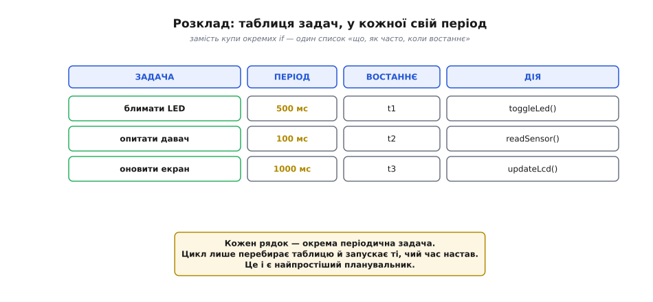
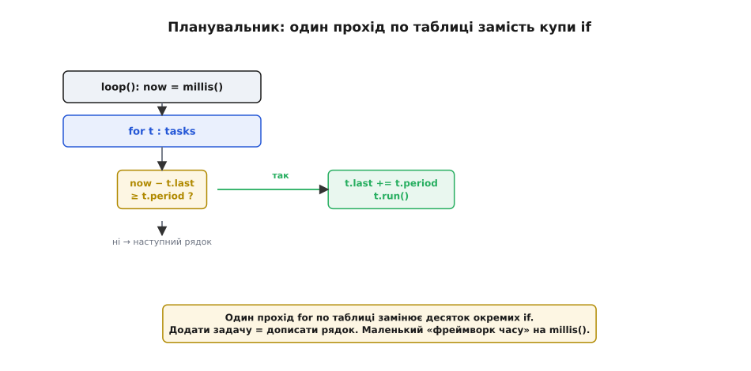
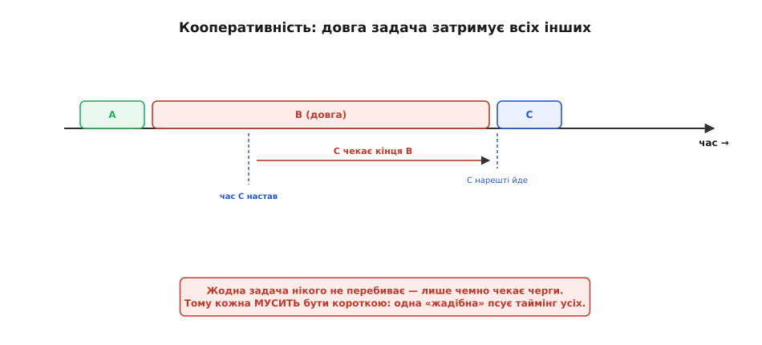
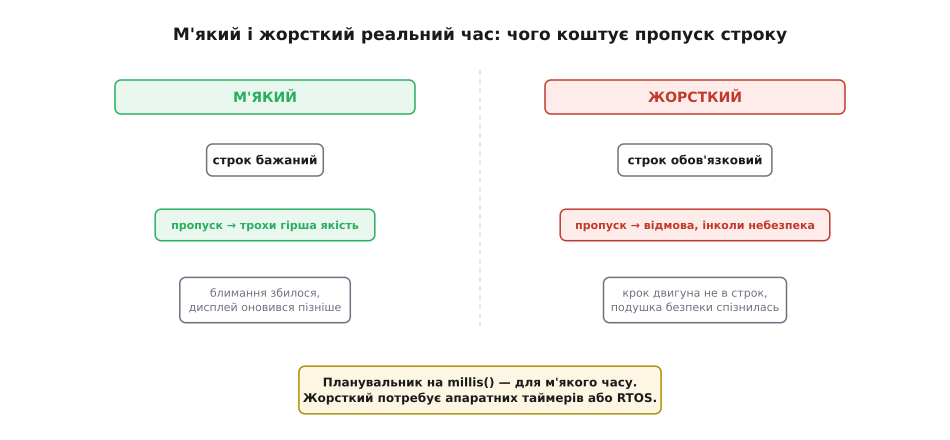
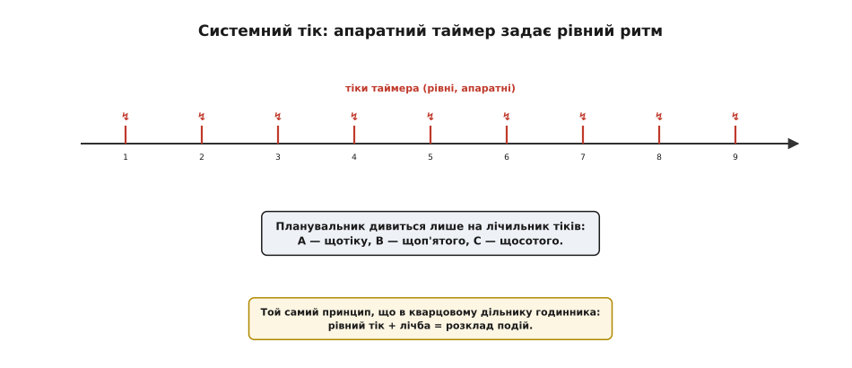
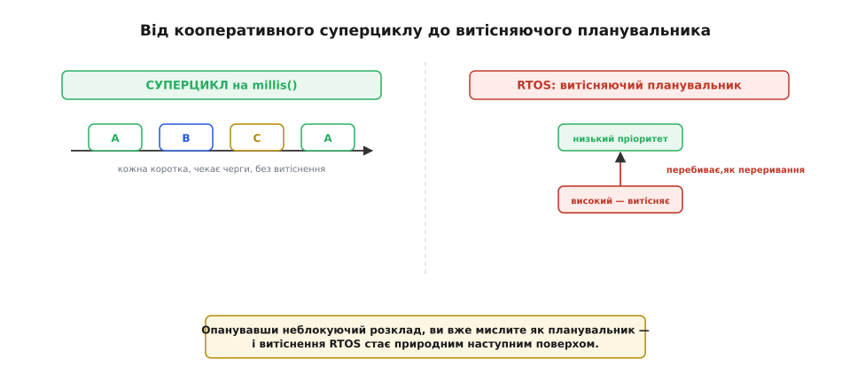

# Періодичні події

Вести кілька періодичних справ можна [неблокуюче](root:sf-devices/nonblocking-time), кожну зі своєю парою `(last, interval)`. Та коли справ стає багато, розкидані по `loop()` блоки `if` починають захаращувати код. Час навести лад: зібрати задачі в **розклад** і доручити їх запуск маленькому **планувальнику** (англ. *scheduler*, від *schedule* — «розклад», через латину *schedula* — «аркуш-список»). За цим простим кроком стоять поняття, на яких тримаються системи реального часу: **кооперативність**, **м'який і жорсткий** реальний час та **системний тік**. Скромний цикл на `millis()` — це насправді перший щабель до справжньої операційної системи.

### Від купи if до таблиці задач

Придивімося до [неблокуючої періодичної задачі](root:sf-devices/nonblocking-time): кожна — це трійця «**як часто** (період), **коли востаннє** (мітка), **що робити** (дія)». А якщо так, то замість окремого `if` для кожної можна скласти всі трійці в **таблицю** — список задач, де кожен рядок описує одну справу.


*Кожна періодична задача — рядок таблиці: що робити, як часто, коли спрацювала востаннє. Блимати LED раз на 500 мс, опитати давач раз на 100 мс, оновити екран раз на 1000 мс. Цикл перебирає цю таблицю й запускає ті задачі, чий час настав, — це і є найпростіший планувальник.*

Така таблиця — велике поліпшення. Замість дублювати перевірку часу в кожному `if`, ми описуємо задачі **даними** (рядками таблиці), а саму перевірку пишемо **один раз**. Додати нову періодичну справу стає тривіально — дописати рядок, не чіпаючи решти коду. Це перший крок від «купи окремих перевірок» до організованого розкладу.

За цим криється загальний і потужний принцип: **описувати дані, а не дублювати код**. Поки задач дві-три, окремі `if` ще терпимі; коли їх десять, таблиця стає незрівнянно охайнішою — уся «логіка часу» в одному місці, а задачі — просто рядки. Більше того, таку таблицю легко **налаштовувати**: змінити період задачі — це поправити одне число, а не шукати потрібний `if` серед інших. Дані гнучкі й наочні там, де повторюваний код розповзається й плутає.

### Планувальник: цикл перебирає задачі

Маючи таблицю, сам `loop()` стає коротким і однаковим: пройтися по таблиці й для кожної задачі спитати «чи дозріла?», а дозрілі — запустити. Це і є **планувальник** — крихітний механізм, що вирішує, яку задачу й коли запустити.


*`loop()` бере поточний час і в циклі `for` перебирає таблицю: для кожної задачі перевіряє `now − last >= period` і, якщо так, оновлює мітку й запускає дію. Один прохід замінює десяток окремих `if`, а додати задачу — дописати рядок. Це вже маленький «фреймворк часу» на `millis()`.*

Виходить компактно й масштабовано:

:::tabs
```cpp
struct Task {
  unsigned long period;   // як часто (мс)
  unsigned long last;     // коли востаннє
  void (*run)();          // що робити
};

Task tasks[] = {
  { 500,  0, toggleLed   },   // блимати
  { 100,  0, readSensor  },   // опитати давач
  { 1000, 0, updateLcd   },   // оновити екран
};

void loop() {
  unsigned long now = millis();
  for (Task &t : tasks)
    if (now - t.last >= t.period) {
      t.last += t.period;
      t.run();              // запускаємо дозрілу задачу
    }
}
```
```micropython
import time

# кожна задача — [період (мс), мітка «востаннє», що робити]
tasks = [
    [500,  0, toggle_led],   # блимати
    [100,  0, read_sensor],  # опитати давач
    [1000, 0, update_lcd],   # оновити екран
]

while True:
    now = time.ticks_ms()
    for t in tasks:
        if time.ticks_diff(now, t[1]) >= t[0]:
            t[1] = time.ticks_add(t[1], t[0])
            t[2]()               # запускаємо дозрілу задачу
```
:::

Усього кілька рядків — а перед нами справжній, хай і простий, планувальник: він веде скільки завгодно періодичних задач, кожну в своєму ритмі, без `delay`, без дублювання. Саме так влаштовано чимало реальних прошивок.

Зверніть увагу на `t.last += t.period` замість `t.last = now`: мітка зсувається на **рівно один період**, а не на момент фактичного запуску. Це тримає середній ритм точним навіть тоді, коли задача дозріла з невеликим запізненням, — дрібні затримки не накопичуються, бо наступний строк відлічується від ідеальної сітки, а не від того, коли руки дійшли. Лічба через різницю `now - t.last` коректно переживає й переповнення лічильника `millis()`, бо віднімання беззнакових чисел «загортається» правильно.

> ⚙️ **А якщо подій не жменя, а тисячі?** Перебирати **весь** список щотіку — це O(N): для десятка задач байдуже, для тисяч таймерів — марнотратство. Тоді беруть спритнішу структуру — **колесо таймерів**, що торкається лише подій «на зараз». Як воно влаштоване — у вставці [Колесо таймерів](root:sf-devices/periodic-scheduling/proj-timer-wheel.md).

Кілька слів для тих, кому `void (*run)()` ще незнайоме: це **вказівник на функцію**. У таблиці ми зберігаємо не саму дію, а «адресу», за якою лежить потрібна функція, тож `t.run()` означає «виклич ту функцію, що записана в цьому рядку». Такий прийом — серце будь-якого планувальника: він дозволяє тримати **список дій** і викликати їх однаково, не знаючи наперед, які саме. Винаходити цей механізм щоразу не обов'язково — для Arduino є готові бібліотеки кооперативних планувальників, та корисно бодай раз зібрати його руками, щоб розуміти, що всередині.

Є й приємний побічний виграш: кожна задача стає **окремою маленькою функцією** (`toggleLed`, `readSensor`), яку легко прочитати, перевірити й змінити незалежно від інших. Програма з суцільного, заплутаного `loop()` перетворюється на охайний набір коротких справ — а це вже добра архітектура, а не лише економія рядків.

### Межа кооперативності: довга задача затримує всіх

Та цей планувальник має принципове обмеження. Він **кооперативний** (від латин. *cooperari* — «співпрацювати»): жодна задача не може **перебити** іншу. Запущена задача виконується **до кінця**, і лише потім планувальник переходить до наступної. А отже, якщо одна задача забариться, **усі** інші чекатимуть, навіть якщо їхній час давно настав.


*Планувальник на `millis()` не витісняє задач: поки виконується довга задача B, задача C, чий час уже настав, мусить чекати її завершення. Жодна задача нікого не перебиває — лише чемно чекає черги. Тому кожна мусить бути короткою, як [обробник переривання](root:hw-arch/isr): одна «жадібна» задача псує таймінг усіх інших.*

Це той самий урок, що з [обробником переривання](root:hw-arch/isr) і з блокуючим `delay()`: у кооперативній системі **кожна** задача має відпрацьовувати швидко й віддавати керування. Одна довга задача — і весь розклад «попливе». Тому довгі справи (складні обчислення, обмін даними) дроблять на короткі кроки через [автомати станів](root:sf-devices/nonblocking-time) або виносять у переривання. Кооперативний планувальник простий і надійний рівно доти, доки всі його задачі дисципліновано короткі.

Цю межу можна порахувати. У кооперативній системі задача в найгіршому разі чекає на запуск стільки, скільки триває **один повний прохід** — сума тривалостей усіх інших задач, що встигли захопити час.

**Найгірша затримка планувальника: двадцять задач по 50 мкс плюс одна на 5 мс.** Порахуймо, скільки чекатиме термінова задача, якщо одна сусідка «жадібна».

```text
коротких задач:    N = 20
кожна триває:       t = 50 мкс
разом коротких:     20 × 50 мкс = 1000 мкс = 1.0 мс
одна довга:         T = 5 мс
найгірша затримка:  1.0 мс + 5 мс = 6.0 мс
```

Висновок: поки всі задачі короткі, найбільше очікування — близько мілісекунди, і м'який строк це стерпить. Та одна-єдина задача на 5 мс одразу піднімає найгіршу затримку до 6 мс. Звідси практичне правило проєктування: тримай найдовшу задачу набагато коротшою за найжорсткіший зі своїх строків — інакше саме вона визначить, наскільки спізниться все решта.

### М'який і жорсткий реальний час

Варто познайомитися з ключовим поняттям — **реальним часом** (англ. *real-time* — «у реальному, фактичному часі»). Програма реального часу — це не та, що працює «швидко», а та, що мусить устигати до **строків** (дедлайнів): зробити дію не колись, а **вчасно**. І строки бувають двох сортів.


*М'який реальний час: пропустити строк — не катастрофа, лише трохи гірша якість (блимання збилося, дисплей оновився пізніше). Жорсткий реальний час: пропуск строку — відмова, інколи небезпечна (крок двигуна не в строк, подушка безпеки). Планувальник на `millis()` — для м'якого; жорсткий потребує апаратних таймерів або RTOS.*

**М'який** реальний час прощає випадкові запізнення: якщо світлодіод блимнув на 5 мс пізніше, ніхто не постраждає. Саме сюди й годиться кооперативний планувальник — він «зазвичай вчасно», і цього досить для переважної більшості задач. **Жорсткий** реальний час запізнень **не** прощає: пропущений строк означає поломку чи небезпеку. Тут кооперативного циклу замало — потрібні апаратні таймери ([захоплення й порівняння](root:hw-arch/capture-compare), що діють без участі коду) або витісняючий планувальник операційної системи.

> 🔧 **Навіщо це.** Чесно оцінюйте, який реальний час вам потрібен. Для **переважної** більшості аматорських і багатьох промислових задач досить **м'якого** — і тоді простий планувальник на `millis()` ідеальний: його легко написати, легко зрозуміти, важко зламати. Не тягніть RTOS чи апаратні таймери туди, де блимання й опитування чудово живуть у суперциклі. А коли з'являється **жорсткий** строк (точний крок двигуна, аудіо, безпека) — отут і час спускатися до заліза чи операційної системи.

«М'яка» програма може мати **окремі жорсткі острівці**. Якщо в загалом неквапливому пристрої є одна по-справжньому критична за часом дія — точний імпульс, крок мотора, — її віддають **апаратному** таймерові ([порівняння](root:hw-arch/capture-compare)) чи перериванню, а решту лишають кооперативному циклу. Тобто не обов'язково тягнути всю систему в жорсткий реальний час: достатньо забезпечити залізом ту єдину дію, що цього вимагає. Це найдешевший шлях — поєднати простий суперцикл із точковою апаратною точністю там, де вона справді потрібна.

Між м'яким і жорстким інженери виділяють ще проміжний — **«твердий» (firm)** реальний час: запізнілий результат уже **марний**, та не небезпечний (наприклад, кадр відео, що спізнився, просто викидають). Для практики досить пам'ятати головне розрізнення: чи коштує пропуск строку лише **якості** (м'який), чи означає **відмову** (жорсткий). Від цього й залежить, чи вистачить простого циклу на `millis()`, чи треба апаратний таймер. На щастя, більшість задач — м'які.

### Системний тік: ритм від таймера

Є й потужніший спосіб організувати розклад — не покладатися на швидкість `loop()`, а задати ритм **апаратно**. Налаштовують таймер бити перериванням рівно й часто (скажімо, раз на мілісекунду) — і цей удар називають **системним тіком** (англ. *system tick*; *tick* — «такт, цокання», як цокання годинника). Лічильник тіків стає єдиним джерелом часу для планувальника: задачі прив'язують до **кратних** тіків (кожен тік, кожен п'ятий, кожен сотий).


*Таймер б'є перериванням рівно (наприклад, щомілісекунди) — це «тік». Планувальник дивиться лише на лічильник тіків і запускає задачі за розкладом: A щотіку, B щоп'ятого, C щосотого. Системний тік — серце операційної системи реального часу. І це той самий принцип, що в кварцовому дільнику годинника: рівний тік + лічба = розклад подій.*

Перевага тіку — у **рівності**: він приходить від апаратного таймера, а не від того, як швидко крутиться `loop()`, тож ритм планувальника стає точним і незалежним від завантаженості коду. Саме на системному тіку будують **операційні системи реального часу**: їхній планувальник прокидається на кожен тік і вирішує, кому віддати процесор. Цикл на `millis()` — спрощена, «безтікова» версія тієї самої ідеї.

У живому ESP32 такий системний тік **уже працює** — його забезпечує вбудована операційна система FreeRTOS, на якій крутиться навіть звичайний Arduino-скетч. Її таймер б'є рівно (типово близько тисячі разів на секунду, хоча це налаштовується), і саме на цьому тіку тримається перемикання задач, а заразом і `delay()` на ESP32 (він відмірює час у тіках). Частота тіку — компроміс: частіший дає тоншу роздільність планування, але й більше витрачає процесора на самі переривання. Тож навіть «простий» скетч на ESP32 насправді живе поверх тікового планувальника.

> 🔧 **Навіщо це.** Знати, що під вашим скетчем уже б'є тік FreeRTOS, важливо суто практично: `delay(1)` на ESP32 не «зависання» процесора, а віддача керування планувальнику на один тік — тож надто дрібні `delay` округлюються до роздільності тіку, а зайнятий цикл без жодної віддачі може «заморити голодом» фонові задачі (Wi-Fi, сторож). Хочете передбачуваний ритм — спирайтеся на тік, а не на власні підрахунки тактів.

### Куди це веде: до справжнього планувальника

Кооперативний розклад на `millis()` — це [суперцикл](root:sf-devices/super-loop) у розвиненій формі: акуратна таблиця задач, що крутиться в одному циклі. Він чудовий для м'якого реального часу й небагатьох дисциплінованих задач. Його межа — відсутність **витіснення**: довга задача блокує всіх, а термінову не можна пропхати поза чергою.


*Ліворуч — суперцикл на `millis()`: задачі чекають черги, кожна коротка, без витіснення, просто й передбачувано. Праворуч — RTOS: планувальник може витіснити задачу заради терміновішої, з пріоритетами, як у переривань. Опанувавши неблокуючий розклад, ви вже мислите як планувальник.*

Складніший щабель — **операційна система реального часу** ([RTOS](root:sf-devices/freertos)). Її планувальник **витісняючий**: він може зупинити поточну задачу заради важливішої, як високопріоритетне переривання перебиває низьке, коли в системи є [пріоритети переривань](root:hw-arch/interrupt-priorities). Це складніше, зате знімає головну ваду кооперативного підходу. Та найважливіше: думаючи розкладом і періодами, ви засвоюєте саме той спосіб мислення, на якому стоїть будь-який планувальник, — тож перехід до RTOS буде природним.

> 🔧 **Навіщо це.** Не поспішайте до RTOS. Дуже багато добротних пристроїв усе життя працюють на простому суперциклі з таблицею задач — і це не «недороблено», а **доречно**: менше складності, менше багів, легше зрозуміти. Беріться за операційну систему, коли реально впираєтесь у її переваги (жорсткі строки, складна багатозадачність, витіснення), а не «бо так серйозніше». Уміння писати чистий неблокуючий розклад окупається в кожному проєкті, з RTOS чи без.

Кооперативний розклад і RTOS — **не** взаємовиключні: усередині окремої задачі операційної системи ви цілком можете крутити той самий неблокуючий цикл на `millis()`. Навичка нікуди не дінеться — вона лиш стане одним поверхом більшої будівлі. А сама ідея ділити процесорний час між багатьма справами має поважний родовід: вона виросла з «розподілу часу» (англ. *time-sharing* — «спільне користування часом») великих машин 1960-х. Планувальник на вашому столі — прямий нащадок тих перших систем, що навчили один комп'ютер служити багатьом.

Отже, багато періодичних задач зручно зібрати в **таблицю** й доручити маленькому **планувальнику**, що перебирає її в `loop()` і запускає дозрілі. Такий планувальник **кооперативний** — не витісняє, тож кожна задача мусить бути короткою; його стихія — **м'який** реальний час. Точніший ритм дає **системний тік** від апаратного таймера, а складніший щабель — витісняюча RTOS. Є й окрема, рятівна роль таймера — [сторож (watchdog)](root:sf-devices/watchdog), що повертає до життя пристрій, який завис.
