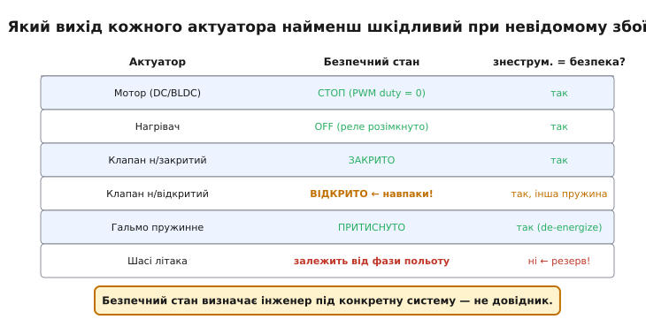
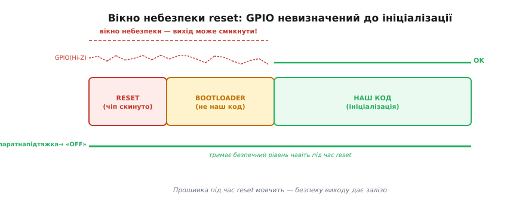
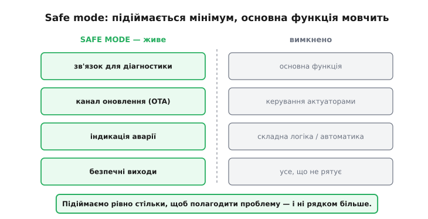

# Безпечний стан

Коли збій уже стався й довіряти системі більше не можна, найважливіше — не зробити гірше. У програмі на сервері «зависнути» означає лише, що хтось не дочекається відповіді. У фізичного пристрою все інакше: він керує струмом, теплом, рухом. Нагрівач, що далі гріє без нагляду, — це вже не впала прошивка, це пожежа. Тому в прошивці є поняття, якого немає у звичайному застосунку: **безпечний стан** — те положення виходів, у яке пристрій переводить себе, щойно зрозумів, що працювати нормально не може.

## Безпечний стан фізичного пристрою

Питання «який вихід кожного виконавчого механізму (актуатора — від лат. *actus*, «дія») найменш шкідливий при невідомому збої?» не має однієї відповіді на всіх. Вона залежить від того, що цей механізм робить і чим небезпечний.

Мотор треба зупинити: PWM duty = 0, обертів немає. Нагрівач — вимкнути, розімкнувши реле. Клапан, який за конструкцією має бути закритим у спокої («нормально-закритий»), — закрити. А от клапан «нормально-відкритий» — навпаки, відкрити, бо для нього саме відкрите положення є станом спокою, і тримати його закритим під збій небезпечно. Пружинне гальмо притискається, коли з нього **знімають** струм, тож безпечно для нього — знеструмитись. Кожен механізм диктує свою відповідь.



*Матриця безпечних станів. «Знеструмлено — безпечно» працює для більшості, але клапан нормально-відкритий і шасі літака показують, що винятки реальні.*

Звідси головне правило: **безпечний стан визначає інженер під конкретну систему**, а не бере з довідника. Та сама команда «вимкнути все живлення» рятує нагрівач і губить літак на посадці. Тому перший крок проєктування надійної прошивки — не код, а таблиця: для кожного виходу записати, у яке положення його ставити при аварії й чому саме туди.

> 🔧 **Навіщо це.** Цю таблицю складають **до** написання обробників помилок, бо вона визначає, що ці обробники взагалі мають робити. Без неї «безпечний стан» перетворюється на випадковий набір `gpio_set_level(...)`, який автор писав по пам'яті — і десь там ховається той вихід, що при збої смикне реле не в той бік.

## Безпека задарма: знеструмлення як безпечний стан

Найнадійніший безпечний стан — той, що настає **сам**, без жодного рядка коду. Багато механізмів навмисно проєктують так, щоб **відсутність сигналу означала безпеку**: пружина повертає клапан у закрите положення, гальмо стискається без струму, реле розмикається, коли на котушці немає напруги. Таку конструкцію називають **відмовостійкою через знеструмлення** (fail-safe — англ. «безпечний при відмові»; принцип прийшов із залізничної сигналізації XIX століття, де семафор під дією ваги падав у заборонне положення, щойно обривався трос або зникав струм).

Така схема рятує навіть тоді, коли прошивка вже не здатна ні на що: повисла, перезавантажується по колу, втратила живлення. Сигналу немає — отже, виходи самі впали в безпечне положення. Код міг не виконатись зовсім, а пристрій усе одно безпечний.

Цей принцип не придумали інженери прошивок — його вистраждала залізниця XIX століття: семафор під власною вагою падав у «небезпеку», коли обривався трос, а закритий колійний ланцюг гаснув на тріснутій рейці чи мертвій батареї. Як аварія Abbots Ripton перевела сигнали в стан «нормально в небезпеці» й чому будь-яка несправність мусить означати «стій» — у [нарисі про походження принципу](root:sf-devices/safe-mode/hist-fail-safe.md).

Контрприклад показує межу принципу. Шасі літака часто влаштоване так, що «немає сигналу» = «прибрано». Знеструмити його під час посадки — катастрофа. Тут знеструмлення саме по собі небезпечне, і конструктори йдуть протилежним шляхом: резервне живлення й окремі канали, щоб критична команда виконалась навіть при відмові основної системи. Тому правило «знеструмлено — безпечно» — добрий орієнтир за замовчуванням, але кожен виняток коштує життя, і його шукають свідомо.

## Пастка моменту reset

Є проміжок часу, коли прошивка ще нічим керувати не може, а виходи вже існують. Від миті скидання (reset) до того рядка, де код викликає `gpio_set_direction()`, ніжки мікроконтролера перебувають у невизначеному, високоомному стані (Hi-Z). Спершу чіп тримає reset, потім працює завантажувач (bootloader) — і весь цей час наш код мовчить, бо до своєї ініціалізації ще не дійшов.

Якщо до такої ніжки підключений вхід Enable [драйвера мотора](root:hw-motion/h-bridge) або котушка реле, він може на мить «смикнутись» — рівень плаває, поки його ніхто не тримає. Для світлодіода це непомітно. Для силового ключа, що вмикає десятки ампер, навіть короткий імпульс — реальна шкода.



*Від скидання до ініціалізації GPIO висить у Hi-Z і вихід може смикнути. Зовнішня підтяжка тримає безпечний рівень увесь цей час, ще до старту прошивки.*

Висновок прямий: безпечний рівень виходу в момент пуску мусить забезпечувати **залізо**, а не код. Зовнішня [підтяжка — pull-up чи pull-down](root:hw-digital/floating-pullups) на вході Enable тримає драйвер у положенні «вимкнено» від першої мілісекунди живлення, ще до того, як прошивка прокинулась. Те, у яке положення тягне сам вихід, коли його боронить підтяжка, залежить від того, чи це [двотактний (push-pull) вихід](root:hw-digital/push-pull-output) чи з відкритим стоком. Це не зайва обережність — це базова вимога до будь-якої схеми із силовою периферією, і її закладають у плату, а не в програму.

## Safe mode: режим зниженої функціональності

Іноді пристрій сам доходить висновку, що нормально працювати не може, хоча залізо ще живе: пошкоджений конфіг у Flash, відмова критичного давача, [цикл збоїв](root:sf-devices/reboot-counter), коли кожен старт знову падає в ту саму помилку. Перезавантажуватись вічно безглуздо — наступний пуск повторить попередній. Замість цього пристрій піднімається в **безпечний режим** (safe mode — англ. «безпечний режим»), де працює лише найнеобхідніше.

Що саме лишається живим — питання тверезого вибору. Орієнтир дають готові реалізації: у популярній прошивці ESPHome safe mode вмикається після десяти невдалих стартів поспіль і лишає ввімкненими тільки три речі — журнал через серійний порт, мережу (Wi-Fi чи Ethernet) і канал [оновлення (OTA)](root:sf-devices/ota-update). Усе решта вимкнено. Логіка проста: лишаємо рівно те, без чого до пристрою не дістатись, щоб виправити причину, — зв'язок, оновлення, індикацію стану й безпечні виходи. Основна функція мовчить.



*У безпечному режимі живе лише те, що дає до пристрою достукатись і полагодити його; усе, що не рятує, вимкнено.*

Це той самий задум, що й «безпечний режим» Windows чи macOS: система підіймається з мінімальним набором драйверів, без сторонніх служб, щоб дати спокійне середовище для ремонту. Різниця в тому, що настільна машина в безпечному режимі просто чекає на людину за клавіатурою, а пристрій у полі мусить **сам** покликати на допомогу й тримати доступний канал, бо клавіатури біля нього немає.

Safe mode не плутають із [деградацією з гідністю](root:sf-devices/graceful-degradation). Деградація — це коли пристрій **далі робить основну роботу**, тільки гірше: відмовив один давач — рахуємо за двома, що лишились. Safe mode — навпаки, основну роботу **зупинено**, лишилось тільки те, що дає себе полагодити. Перше тримає функцію живою, друге визнає, що функцію тримати вже не можна.

## Порядок дій при збої: безпека — завжди першою

Коли спрацював тяжкий збій, кроки мають строгий порядок: **спершу зробити виходи безпечними → потім записати лог → потім ухвалювати рішення** (перезапуск, safe mode, деградація). Спокуса велика зробити навпаки — спочатку акуратно залогувати, що сталось, а вже тоді гасити. Але між виявленням збою й вимкненням виходу так виникає затримка: запис у Flash, форматування рядка, мережа. Для теплового нагрівача зайва секунда непомітна. Для силового ключа, що завис у короткому замиканні, — це секунда наростання струму, якої могло не бути.

Тому функція переходу в безпечний стан мусить бути найпершою дією будь-якого обробника критичної помилки. Спершу знеструмити небезпечне, і лише після цього з'ясовувати, що пішло не так.

> 🔧 **Навіщо це.** Лог потрібен, щоб потім зрозуміти причину, — але мертвий інженер логів не читає, а згорілий прилад не вмикається. Порядок «безпека → діагностика → рішення» гарантує: навіть якщо запис логу зависне чи мережа не відповість, виходи вже в безпеці. Діагностика важлива, але вона ніколи не йде поперед безпеки.

## Worked-приклад: вхід у безпечний стан і в safe mode після N збоїв

Дві частини однієї логіки. Перша — функція безпечного стану: її викликають **до всього іншого** при будь-якій критичній помилці. Друга — гейт на старті: якщо лічильник патологічних збоїв перейшов поріг, пристрій не повторює звичайний пуск, а піднімається в safe mode.

```c
#include "driver/ledc.h"
#include "driver/gpio.h"
#include "esp_system.h"
#include "esp_log.h"
static const char *TAG = "safe";

#define GPIO_HEATER_RELAY  GPIO_NUM_5    // active HIGH: HIGH = гріє
#define GPIO_VALVE_CLOSE   GPIO_NUM_18   // active HIGH: HIGH = закрити н/з клапан
#define GPIO_FAULT_LED     GPIO_NUM_19   // active HIGH: індикатор аварії
#define MOTOR_LEDC_CHANNEL LEDC_CHANNEL_0

#define FAULT_THRESHOLD    5             // патологічних збоїв за "вікно"

// Лічильник у RTC-пам'яті: переживає reset, але не повне знеструмлення.
RTC_NOINIT_ATTR static uint32_t s_fault_cnt;

// 1) Безпечний стан — найперша дія при будь-якій критичній помилці.
void enter_safe_state(void) {
    ESP_LOGE(TAG, "ENTER SAFE STATE");                 // лог — ПІСЛЯ гасіння

    ledc_set_duty(LEDC_LOW_SPEED_MODE, MOTOR_LEDC_CHANNEL, 0);  // мотор: duty 0
    ledc_update_duty(LEDC_LOW_SPEED_MODE, MOTOR_LEDC_CHANNEL);
    ledc_stop(LEDC_LOW_SPEED_MODE, MOTOR_LEDC_CHANNEL, 0);      // idle level = 0

    gpio_set_level(GPIO_HEATER_RELAY, 0);   // нагрівач: реле розімкнуто
    gpio_set_level(GPIO_VALVE_CLOSE, 1);    // н/з клапан: закрити
    gpio_set_level(GPIO_FAULT_LED, 1);      // індикатор аварії
    // Wi-Fi/BLE стек НЕ зупиняємо — він потрібен для діагностики й OTA.
}

// 2) На старті: вирішити, чи піднімати safe mode, чи нормальний режим.
void startup(void) {
    enter_safe_state();                     // виходи безпечні ще до рішення

    esp_reset_reason_t r = esp_reset_reason();
    if (r == ESP_RST_POWERON) s_fault_cnt = 0;          // людина увімкнула — чисто
    else if (r == ESP_RST_PANIC || r == ESP_RST_TASK_WDT)
        s_fault_cnt++;                                  // патологічний збій — рахувати

    if (s_fault_cnt >= FAULT_THRESHOLD) {
        ESP_LOGE(TAG, "fault loop (cnt=%lu) -> SAFE MODE", s_fault_cnt);
        start_minimal_services();           // лише зв'язок + OTA + індикація
        return;                             // основну функцію НЕ запускаємо
    }

    start_full_application();               // звичайний режим
}
```

Покроково на конкретних числах: пристрій падає в паніку п'ять разів поспіль. Лічильник `s_fault_cnt` росте `1 → 2 → 3 → 4 → 5`; кожен пуск, поки він нижче порога, ще пробує звичайний режим — і знову падає. На шостому старті `esp_reset_reason()` повертає `ESP_RST_PANIC`, лічильник стає рівним порогу `5`, і замість `start_full_application()` виконується `start_minimal_services()`. Цикл смерті розірвано: пристрій більше не повторює фатальний пуск, а висить у safe mode зі світним індикатором і відкритим каналом оновлення й чекає на нову прошивку. Лічильник скине лише чисте `ESP_RST_POWERON` — коли людина вимкне й увімкне живлення.

> 🔧 **Навіщо це.** Без гейта пристрій із поганим конфігом перезавантажується вічно й виглядає мертвим: залізо ціле, але до нього не достукатись. Гейт перетворює нескінченний цикл на діагноз — «я зациклився» — і лишає відкритий канал, щоб залити виправлення. Це і є різниця між цеглиною та пристроєм, який можна оживити з-за тисячі кілометрів.

## Безпечний стан — це пауза, а не лікування

Безпечний стан зупиняє небезпеку, але сам по собі нічого не лагодить — він лише виграє час. Контроль напруги живлення з аварійним [скиданням за причинами reset](root:hw-arch/reset-causes) бере на себе brownout-детектор (brownout — англ. «просідання» напруги, на відміну від повного blackout). А коли причину збою усунуто, найчистіший спосіб повернутись до нормальної роботи — [перезапуститися начисто](root:sf-devices/reboot-strategy), щоб жоден залишок зіпсованого стану не потрапив у свіжий пуск. Безпечний стан тримає пристрій неушкодженим рівно доти, доки не настане момент полагодити причину й стартувати заново.

---
