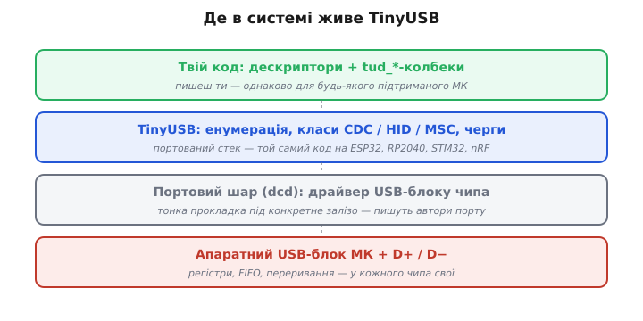
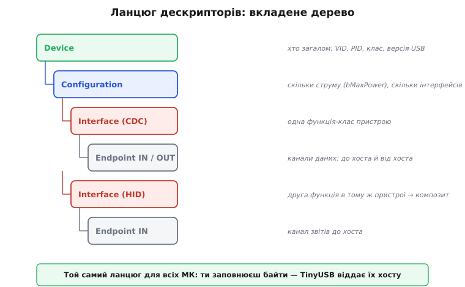
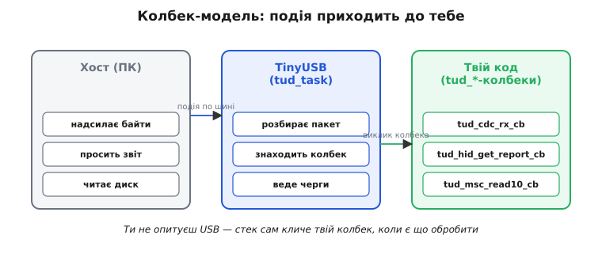

# TinyUSB: пристрій

Коли мікроконтролер має апаратний USB-блок, виникає оманливе відчуття, що далі лишилось «просто записати кілька регістрів». Насправді USB — це не дріт, яким біжать байти, а цілий протокол із розпізнаванням пристрою, узгодженням швидкості, класами, кінцевими точками й суворими таймінгами відповіді. Писати все це руками для кожного чипа — велика й невдячна робота, яку до того ж довелося б повторювати наново на кожній новій платі. TinyUSB (англ. *tiny* — «крихітний») саме цю роботу й знімає: це переносний USB-стек для мікроконтролерів, що бере на себе весь протокол, а тобі лишає описати, **яким пристроєм** ти хочеш бути.

## Навіщо стек, а не голий регістровий код

Уяви, що хочеш зробити з [ESP32 клавіатуру](root:sf-devices/esp32-usb) — USB-HID-пристрій. «Голий» шлях виглядає так: вчитати сотні сторінок документації на USB-контролер конкретного чипа, навчитися відповідати на запити хоста при під'єднанні, вручну скласти бінарні дескриптори, розкласти дані по кінцевих точках, упіймати всі переривання USB-блоку й не зірвати жодного таймінгу. Зробив — а потім переніс проєкт на RP2040, і весь цей регістровий код треба викинути й написати заново, бо USB-блок там геть інший.

USB-стек розриває цей зв'язок. Він ділиться на дві частини: **портовий шар** (драйвер конкретного USB-блоку — те, що знає регістри саме цього чипа) і **переносне ядро** (логіка протоколу, однакова скрізь). Ти працюєш лише з ядром; портовий шар уже написаний авторами стека під десятки чипів.



*Залізо внизу різне на кожному чипі; портовий шар — тонка прокладка під нього; ядро TinyUSB і твій код над ним — ті самі на будь-якому підтриманому МК. Саме незмінність двох верхніх шарів і означає переносність.*

TinyUSB обрали для цієї ролі багато хто, бо він справді легкий (мало пам'яті, без важких залежностей), має дозвільну ліцензію й портований на широкий парк чипів: ESP32-S2/S3/C6, RP2040 (Raspberry Pi Pico), сімейства STM32, нордівські nRF та інші. В ESP-IDF він приходить готовим компонентом (`esp_tinyusb`), у Pico SDK — теж із коробки. Один і той самий код твоїх класів збирається під кожен із них.

> 🔧 **Навіщо це.** Переносність — не абстрактна чеснота. Прототип почали на Pico, а у виріб пішов ESP32-S3 — на голому регістровому коді це означало б переписати USB з нуля; на TinyUSB змінюється лише складальний таргет, а твої дескриптори й колбеки лишаються ті самі. Це прямо економить тижні.

## Дескриптор: анкета пристрою

Щоб зрозуміти TinyUSB, треба зрозуміти **дескриптор**. Коли пристрій під'єднують, хост (комп'ютер) про нього не знає нічого. Він подає живлення й починає **енумерацію** (англ. *enumerate* — «перелічувати, обчислювати») — низку стандартних запитів «хто ти?». Пристрій відповідає дескрипторами: короткими бінарними структурами, що описують його самого. Це анкета, на основі якої операційна система вирішує, який драйвер вантажити й як із пристроєм говорити.

Анкета не пласка, а вкладена — дерево, де кожен рівень відповідає на своє питання:



*Хост читає не один опис, а вкладене дерево. Device каже, хто пристрій загалом; Configuration — скільки струму й інтерфейсів; Interface — одну функцію-клас; Endpoint — конкретні канали даних. Кілька інтерфейсів під одним Device дають композитний пристрій.*

- **Device Descriptor** — найвищий рівень: VID (ідентифікатор виробника), PID (ідентифікатор продукту), клас пристрою, версія USB. По парі VID/PID операційна система і впізнає, що це за пристрій.
- **Configuration Descriptor** — скільки струму пристрій просить (`bMaxPower`) і скільки в ньому інтерфейсів.
- **Interface Descriptor** — одна логічна функція. Один інтерфейс = один клас: CDC, HID чи MSC. Кілька інтерфейсів в одному пристрої роблять його **композитним**.
- **Endpoint Descriptor** — конкретний канал даних. `IN` — потік до хоста, `OUT` — від хоста.

Уся свобода «бути ким завгодно» живе саме тут: змінюєш дескриптори — і той самий чип постає перед системою то COM-портом, то клавіатурою, то диском. TinyUSB не вигадує ці байти за тебе — він віддає хосту те, що ти описав, і веде з ним весь подальший протокол.

## Класи: CDC, HID, MSC

Клас — це домовленість про те, **як саме** пристрій спілкується, щоб для нього вже існував стандартний драйвер в ОС і нічого не треба було ставити окремо. TinyUSB реалізує найхідовіші класи; три з них покривають переважну більшість задач на мікроконтролері.

**CDC** (англ. *Communications Device Class* — «клас пристроїв зв'язку») — віртуальний послідовний порт. Для системи це звичайний COM-порт; пристрій читає й пише байти, ніби між ним і програмою фізичний дріт. Це найпростіший і найчастіший клас: логи, консоль, обмін із власним застосунком на ПК.

**HID** (англ. *Human Interface Device* — «пристрій взаємодії з людиною») — клавіатури, миші, геймпади, а також довільні «сирі» пристрої керування. Дані тут ідуть структурованими **звітами** (англ. *report*), формат яких задає окремий дескриптор звіту. ОС має штатний HID-драйвер, тож саморобний макропад чи педаль працюють без жодного встановлення.

**MSC** (англ. *Mass Storage Class* — «клас накопичувачів») — пристрій прикидається диском. Хост бачить флешку й читає-пише сектори; а звідки ті сектори береш ти (SD-картка, внутрішня пам'ять) — твоя справа. Так мікроконтролер віддає файли простим перетягуванням, без власної програми на боці ПК.

Є й інші — Audio (звукова карта), MIDI (музичні інструменти) — і їх можна поєднувати в одному пристрої. Композит «CDC + HID» — типова річ: пристрій водночас і COM-порт для логів, і клавіатура.

## Колбек-модель: подія приходить до тебе

Друга половина TinyUSB після дескрипторів — це **як ти реагуєш на події**. Тут легко припуститися хибної звички й почати «опитувати» USB у циклі. Стек улаштований інакше: ти даєш йому набір **колбеків** (англ. *callback* — функція «зворотного виклику», яку кличе не ти, а бібліотека), а він сам викликає потрібний, коли по шині щось сталося.



*Хост ініціює обмін; TinyUSB розбирає пакет і кличе твій колбек; ти лише пишеш тіло цього колбека. Опитувати шину вручну не треба — стек робить це за тебе.*

Усі функції стека названі за єдиною схемою. Префікс **`tud_`** означає *TinyUSB Device* — бік пристрою (є й `tuh_` для хоста, але це окрема тема — [МК у ролі хоста](root:com-devices/usb-host)). Далі йде клас і дія: `tud_cdc_write()` — записати в CDC-порт; `tud_hid_keyboard_report()` — надіслати звіт клавіатури; `tud_cdc_rx_cb()` — колбек «прийшли байти по CDC». Функції, що ти **кличеш**, і колбеки, що **кличуть тебе**, легко розрізнити: колбеки закінчуються на `_cb`.

Одна функція стоїть осібно — **`tud_task()`**. Це насос стека: вона прокручує внутрішній автомат, розбирає накопичені події й кличе твої колбеки. Її треба викликати регулярно — у головному циклі або в окремій задачі [RTOS](root:sf-devices/freertos). Забув кликати `tud_task()` — і USB просто «замерзає»: пристрій під'єднався, а далі тиша, бо нікому обробляти події. Це класична перша пастка новачка.

> 🔧 **Навіщо це.** Колбек-модель тримає USB неблокувальним. Поки немає подій, `tud_task()` повертається миттєво, і процесор вільний для твоєї основної роботи — читання давачів, керування. Не треба ні чекати на USB у циклі, ні боятися, що він «з'їсть» час: стек втручається лише тоді, коли справді є що обробити.

## Конфігурація: tusb_config.h

TinyUSB треба знати наперед, які класи вмикати й скільки під них виділяти пам'яті — це задається на етапі компіляції у файлі **`tusb_config.h`**. Він невеликий, але центральний: саме тут вирішується, чим буде пристрій.

```c
/* tusb_config.h — що вмикаємо й скільки під це пам'яті */
#define CFG_TUD_ENABLED   1     /* увімкнути бік пристрою */

#define CFG_TUD_CDC       1     /* один CDC-інтерфейс (віртуальний COM) */
#define CFG_TUD_HID       0     /* HID вимкнено */
#define CFG_TUD_MSC       0     /* MSC вимкнено */

#define CFG_TUD_CDC_RX_BUFSIZE  256   /* буфери прийому/передачі CDC */
#define CFG_TUD_CDC_TX_BUFSIZE  256
```

Кожен увімкнений клас займає пам'ять під свої буфери, тож умикають лише потрібне. Зробити пристрій композитним — означає поставити кілька класів у `1` (наприклад, `CFG_TUD_CDC 1` і `CFG_TUD_HID 1`) і додати їхні інтерфейси в дескриптор конфігурації. Решта файлу — дрібні налаштування розмірів буферів і кінцевих точок.

## Робочий приклад: CDC-пристрій від дескрипторів до колбеків

Зберемо найпростіший живий пристрій — віртуальний COM-порт, що відлунює назад усе, що в нього написали. Це показує обидві половини TinyUSB разом: статичні дескриптори, які стек віддасть хосту, і колбеки, якими ти реагуєш на дані.

**Крок 1. Дескриптор пристрою** — анкета верхнього рівня. Її TinyUSB запитає першою:

```c
#include "tusb.h"

/* Device Descriptor: хто ми загалом */
static const tusb_desc_device_t desc_device = {
    .bLength            = sizeof(tusb_desc_device_t),
    .bDescriptorType    = TUSB_DESC_DEVICE,
    .bcdUSB             = 0x0200,        /* USB 2.0 */
    .bDeviceClass       = TUSB_CLASS_MISC,       /* композит-сумісний клас */
    .bDeviceSubClass    = MISC_SUBCLASS_COMMON,
    .bDeviceProtocol    = MISC_PROTOCOL_IAD,
    .bMaxPacketSize0    = 64,            /* розмір пакета EP0 */
    .idVendor           = 0xCafe,        /* VID (тестовий) */
    .idProduct          = 0x4001,        /* PID */
    .bcdDevice          = 0x0100,        /* версія пристрою 1.0 */
    .iManufacturer      = 0x01,          /* індекси рядкових описів */
    .iProduct           = 0x02,
    .iSerialNumber      = 0x03,
    .bNumConfigurations = 0x01,
};

/* TinyUSB кличе цей колбек, коли хост просить Device Descriptor */
uint8_t const *tud_descriptor_device_cb(void) {
    return (uint8_t const *) &desc_device;
}
```

**Крок 2. Дескриптор конфігурації** — список інтерфейсів. Для CDC їх два (керування + дані), і TinyUSB складає їх одним готовим макросом `TUD_CDC_DESCRIPTOR`:

```c
enum { ITF_NUM_CDC = 0, ITF_NUM_CDC_DATA, ITF_NUM_TOTAL };

#define EPNUM_CDC_NOTIF  0x81   /* IN-точка сповіщень (адреса з бітом IN) */
#define EPNUM_CDC_OUT    0x02   /* OUT: дані від хоста */
#define EPNUM_CDC_IN     0x82   /* IN: дані до хоста */

#define CONFIG_TOTAL_LEN  (TUD_CONFIG_DESC_LEN + TUD_CDC_DESC_LEN)

static const uint8_t desc_configuration[] = {
    /* конфіг: к-сть інтерфейсів, номер, рядок, атрибути, струм (мА) */
    TUD_CONFIG_DESCRIPTOR(1, ITF_NUM_TOTAL, 0, CONFIG_TOTAL_LEN, 0x00, 100),
    /* один CDC: номер інтерфейсу, рядок, EP сповіщень і його розмір,
       пара EP даних (OUT/IN) і розмір пакета 64 байти */
    TUD_CDC_DESCRIPTOR(ITF_NUM_CDC, 4, EPNUM_CDC_NOTIF, 8,
                       EPNUM_CDC_OUT, EPNUM_CDC_IN, 64),
};

uint8_t const *tud_descriptor_configuration_cb(uint8_t index) {
    (void) index;
    return desc_configuration;
}
```

**Крок 3. Колбек даних** — серце логіки. TinyUSB кличе `tud_cdc_rx_cb()`, щойно від хоста прийшли байти; ми їх читаємо й одразу пишемо назад:

```c
/* Прийшли байти по CDC — відлунюємо їх назад до хоста */
void tud_cdc_rx_cb(uint8_t itf) {
    uint8_t buf[64];
    uint32_t count = tud_cdc_n_read(itf, buf, sizeof(buf));  /* прочитати */
    tud_cdc_n_write(itf, buf, count);                        /* записати назад */
    tud_cdc_n_write_flush(itf);                              /* проштовхнути */
}

int main(void) {
    tusb_init();                 /* підняти стек */
    while (1) {
        tud_task();              /* насос: тут і викличеться rx_cb */
    }
}
```

Розберімо, що сталося. У `tusb_config.h` ми ввімкнули `CFG_TUD_CDC = 1`. Дескриптори описали пристрій як один CDC-інтерфейс із трьома кінцевими точками. При під'єднанні TinyUSB сам провів енумерацію, віддавши хосту наші дескриптори через колбеки `tud_descriptor_*_cb`; ОС упізнала CDC і підняла COM-порт. Далі щоразу, коли в порт щось пишуть, стек у `tud_task()` кличе наш `tud_cdc_rx_cb`, і пристрій відлунює дані. Жодного регістра USB-блоку ми не торкнулись — і цей самий код збереться під ESP32-S3, Pico чи STM32 без єдиної зміни.

Щоб зробити з цього не відлуння, а клавіатуру, досить трьох речей: у `tusb_config.h` поставити `CFG_TUD_HID = 1`, у дескрипторі конфігурації замість `TUD_CDC_DESCRIPTOR` дати `TUD_HID_DESCRIPTOR`, а в коді кликати `tud_hid_keyboard_report()`. Залізо те саме — змінюються лише дескриптори й колбеки.

## Дві типові пастки

Перша вже названа: **забутий `tud_task()`**. Пристрій під'єднується (бо на ранні запити заліза стек відповідає сам), а далі мертвий — колбеки не приходять, дані не йдуть. Якщо USB «частково працює», перше, що перевіряють, — чи крутиться `tud_task()` достатньо часто.

Друга — **помилка в дескрипторі**. Дев'ять із десяти «пристрій не визначається» — це переплутана довжина, невідповідність між кількістю кінцевих точок у дескрипторі й у `tusb_config.h`, нульовий VID/PID або адреса точки без правильного біта напрямку. Хост читає анкету суворо; найменша неузгодженість — і він відвертається. Рятує готовий шаблон дескрипторів TinyUSB (макроси `TUD_*_DESCRIPTOR`), що зводить цей клас помилок майже до нуля, і перегляд енумерації з боку ОС (у Linux — `dmesg`, `lsusb -v`).

Отже, TinyUSB зводить USB-пристрій до двох зрозумілих частин: **дескриптори** кажуть хосту, ким ти є, а **`tud_`-колбеки** обробляють події, коли вони стаються. Усе залізо й увесь протокол стек ховає за переносним ядром — тож той самий код працює і на ESP32, і на RP2040, і на STM32. Коли треба більша швидкість, ніж дає Full-Speed, обирають чип із High-Speed-блоком на кшталт [ESP32-P4](root:hw-arch/esp32-p4), а сам підхід — дескриптори плюс колбеки — лишається незмінним. Поглиблено — ланцюг дескрипторів байт за байтом, повна енумерація, композити з IAD і черги колбеків — у [детальній версії](root:sf-devices/tinyusb-device/detail).
