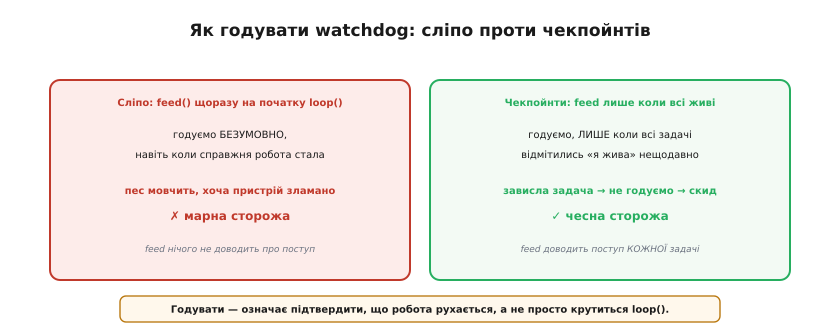
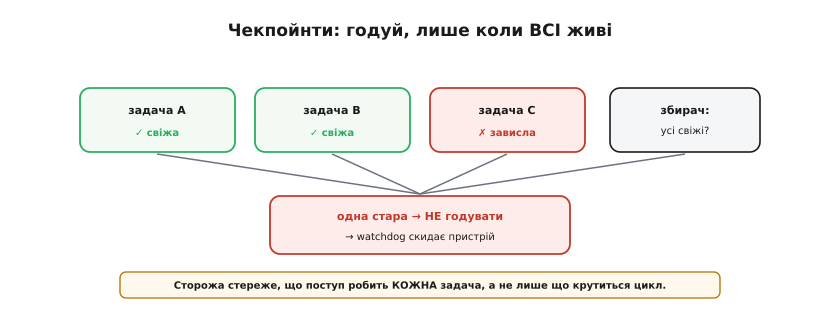

# ⚙️ Як «годувати» watchdog правильно: чекпойнти задач, а не сліпе скидання

> Алгоритмічна вставка про те, як годувати [watchdog — таймер, що рятує від зависання](topic:sf-devices/watchdog). Годувати сторожа треба з місця, що **доводить поступ**. А коли задач багато — як довести, що жива **кожна**? Чекпойнтами.

## Задача

Watchdog скидає пристрій, якщо його не «нагодувати» вчасно. Та з багатьма задачами постає питання: **звідки** годувати? Сліпий `feed()` на початку `loop()` — найгірша помилка: він годує **завжди**, навіть коли одна із задач давно зависла, а решта цикл усе ще крутиться. Сторожа годують, а пристрій тим часом наполовину мертвий — і весь сенс охорони втрачено. Як годувати так, щоб watchdog справді стеріг поступ **усіх** задач?


*Сліпий feed() на початку loop() годує безумовно — пес мовчить, хоча справжня робота стала (марна сторожа). Чекпойнти годують, лише коли всі задачі відмітились «я жива»; зависла одна — не годуємо, watchdog скидає (чесна сторожа).*

## Ідея

Замість одного безумовного `feed()` — **чекпойнти**. Кожна важлива задача, завершивши свій цикл, **відмічається**: ставить мітку «я жива, ось мій останній успішний оберт». А **одне** місце (раз на цикл) перевіряє: чи всі задачі відмітилися **нещодавно**? Якщо так — `feed()`. Якщо хоч одна не відмічалась довше за свій строк — **не годуємо**, і watchdog чесно скидає пристрій.


*Кожна задача відмічається своїм чекпойнтом. Збирач годує watchdog, лише коли всі свіжі; одна застрягла (стара мітка) — годівлю припинено, watchdog скидає. Сторожа стереже поступ КОЖНОЇ задачі, а не лише обертання loop().*

Так годівля стає **доказом**, що поступ робить **кожна** задача, а не лише що крутиться головний цикл. Зависла будь-яка — її чекпойнт «протух», збір не складається, watchdog спрацьовує.

> 🔧 **Навіщо це.** На реальному пристрої задачі майже завжди різношвидкісні: опитування давача — десятки разів на секунду, запис у флеш — раз на хвилину, відправлення по радіо — раз на кілька хвилин. Один спільний таймаут на всіх або зніме охорону з повільної задачі, або сипатиме хибними скидами на швидкій. Чекпойнти з **окремим строком на задачу** — єдиний чесний спосіб стерегти такий різнобій.

## Робочий C: чекпойнти й один збирач

Суть — маленький модуль-«реєстр»: задачі відмічаються, збирач звіряє строки й годує лише за повного збору. Ось мінімальна, але цілком робоча реалізація для ESP-IDF/Arduino-ESP32:

```c
#include "esp_task_wdt.h"
#include "esp_timer.h"          // esp_timer_get_time() — мікросекунди від старту
#include <stdint.h>
#include <stdbool.h>

#define TASK_COUNT 3

// останній успішний оберт кожної задачі (мс) і її дозволений строк (мс)
static volatile uint32_t last_ok[TASK_COUNT];
static const    uint32_t deadline_ms[TASK_COUNT] = { 200, 2000, 300000 };

static inline uint32_t now_ms(void) {
    return (uint32_t)(esp_timer_get_time() / 1000);   // мкс → мс
}

// кожна задача кличе це, завершивши УСПІШНИЙ оберт:
void checkpoint(int task_id) {
    last_ok[task_id] = now_ms();
}

// збирач: годуємо watchdog ЛИШЕ якщо всі задачі свіжі
void watchdog_collect(void) {
    uint32_t t = now_ms();
    for (int i = 0; i < TASK_COUNT; i++) {
        if (t - last_ok[i] > deadline_ms[i]) {
            return;                  // ця задача протухла → НЕ годуємо
        }
    }
    esp_task_wdt_reset();            // усі свіжі → доказ поступу → годуємо
}
```

Збирач ставлять у задачу, яку стереже watchdog (її підписують через `esp_task_wdt_add(NULL)`), і кличуть раз на оберт. Кожна прикладна задача наприкінці свого успішного циклу викликає `checkpoint(i)`:

```c
void sensor_task(void *arg) {           // швидка задача, строк 200 мс
    for (;;) {
        read_sensor();
        checkpoint(0);                  // відмітились «я жива»
        vTaskDelay(pdMS_TO_TICKS(50));
    }
}

void watchdog_task(void *arg) {         // збирач + єдина підписана під TWDT
    esp_task_wdt_add(NULL);
    for (;;) {
        watchdog_collect();
        vTaskDelay(pdMS_TO_TICKS(100));
    }
}
```

Один тонкий момент — **переповнення** лічильника. `now_ms()` росте і колись «обернеться» через ≈49.7 доби (межа `uint32_t`). Віднімання `t - last_ok[i]` в беззнаковій арифметиці переповнення переживає коректно: різниця лишається правильною, поки реальний проміжок менший за період обертання. Саме тому ми зберігаємо мітки в `uint32_t` і **віднімаємо**, а не порівнюємо абсолютні значення — інакше раз на 50 діб ловили б хибний скид.

## Worked-приклад: який таймаут поставити самому сторожу

Чекпойнти вирішують, **коли** годувати; лишається ще таймаут **самого** watchdog — скільки секунд терпіти без годівлі до скиду. Він має перекривати найгірший випадок: збирач крутиться раз на 100 мс, і найповільніша задача має строк 300 000 мс (5 хв). Але збирач годує не миттєво — між двома його обертами максимум 100 мс. Складаємо найгірший проміжок між двома годівлями за здорової системи:

```
найдовший строк задачі      = 300000 мс   (радіо, раз на 5 хв)
період збирача              =    100 мс
найгірший проміжок годівлі  = 300000 + 100 = 300100 мс ≈ 300.1 с
таймаут watchdog (запас ×2) = 300100 × 2  ≈ 600 с = 10 хв
```

Таймаут TWDT не може бути коротшим за 300.1 с — інакше навіть здорова система не встигне нагодувати між двома обертами повільної задачі. Подвійний запас (10 хв) лишає місце на джитер планувальника. Якби радіо-задача була єдиною «повільною» і її зависання прикро терпіти 10 хв, правильна відповідь — **не** роздувати спільний таймаут, а дати цій задачі **власний** зовнішній строк (окремий watchdog або коротший `deadline[i]` зі своїм збирачем), бо спільний таймаут завжди тягнеться за найповільнішим учасником.

## Готовий механізм FreeRTOS замість саморобки

Реєстр вище корисно розуміти, та на ESP32 його здебільшого **не** пишуть руками: FreeRTOS-шар уже має задачний watchdog, що робить те саме. Кожна задача один раз **підписується**, а далі сама звітує:

```c
esp_task_wdt_add(NULL);            // підписати поточну задачу
// ... у кожному успішному оберті:
esp_task_wdt_reset();             // «я жива» — еквівалент checkpoint()
```

Тут роль «збирача» бере на себе сам TWDT: він внутрішньо тримає список підписаних задач і скидає чип, щойно **будь-яка** з них не покличе `reset` за відведений час. Тобто `esp_task_wdt_reset()` — це і є `checkpoint()`, а перевірку «чи всі свіжі» виконує драйвер. Саморобний реєстр лишають на випадки, коли строки задач сильно різні (TWDT дає один спільний таймаут на всіх підписаних) або коли годувати треба не з самих задач, а зі стороннього наглядача.

## Складність і пастки на МК

- **Не годувати наосліп.** Головний гріх — `feed()`, що виконується **незалежно** від реальної роботи (на початку `loop()`, з переривання таймера). Він нічого не доводить — лише глушить сторожа. Годуй **після** доказу поступу, не до.
- **Строк під задачу.** `deadline[i]` має бути **більший** за найдовший законний оберт задачі, інакше — **хибні** скиди на чесних, але довгеньких операціях. Бери з запасом: приблизно подвоєний типовий оберт.
- **Збирач має бути досяжним.** Якщо саме той код, що збирає чекпойнти й годує, опиниться в зависанні — годівлі не буде, і watchdog скине. Це **правильно**: краще зайвий скид, ніж мертвий пристрій.
- **Пріоритет збирача.** Збирач не варто робити найвищим за пріоритетом: тоді він годуватиме навіть тоді, коли нижчі задачі **голодують** і не дістають часу взагалі — і знов засліпить сторожа. Хай збирач крутиться на **звичайному** пріоритеті: якщо планувальник перевантажений і не дає йому ходу, годівля припиниться, і watchdog це викриє — саме те, що треба.
- **Відмічайся лише на успіх.** `checkpoint(i)` ставлять **після** корисної роботи оберту, а не на його початку — інакше задача, що зависла всередині, встигне відмітитись і знов засліпить сторожа.
- **Атомарність мітки.** Запис `uint32_t` на 32-розрядному ESP32 атомарний, тож `volatile` досить. Якби мітка була ширшою (64 біти) або МК — 8/16-розрядним, читання збирачем могло б «зловити» половину запису; тоді мітку оновлюють під коротким [захистом критичної секції](topic:sf-tasks/atomicity-races).
- **Розслідуй, а не глуши.** Коли watchdog таки скинув — **запиши**, яка задача протухла: [скиди watchdog не можна замовчувати](topic:sf-devices/watchdog). Інакше полагодите симптом, а не причину.
- **В RTOS — task watchdog.** Серйозні системи мають готовий «задачний watchdog»: кожна задача **підписується** через `esp_task_wdt_add`, і сторож сам стежить, що всі підписані відмічаються своїм `esp_task_wdt_reset`. На ESP32 (FreeRTOS) такий механізм є з коробки — для багатьох випадків він заміняє саморобний реєстр вище.

## Підсумок

Правильно годувати watchdog — означає годувати **лише як доказ**, що робота справді рухається. З багатьма задачами це **чекпойнти**: кожна відмічається, а сторожа годуємо, тільки коли **всі** живі. Зависла одна — годівля припиняється, і watchdog чесно перезапускає пристрій. Сліпий `feed()` перетворює сторожа на бутафорію; чекпойнти роблять його справжнім.
