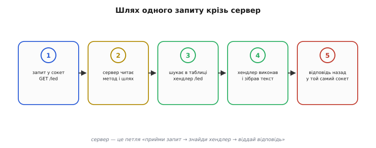

# Веб-сервер на МК: глибоко

Базова картина веб-сервера на мікроконтролері проста: пристрій тримає таблицю маршрутів, на кожен шлях має свою функцію-хендлер і віддає браузерові то готову сторінку, то порцію даних. Тут ми розберемо те, що під цією простотою ховається: як саме один HTTP-запит проходить крізь сервер байт за байтом, як влаштоване зіставлення шляху з хендлером, звідки беруться файли сторінки й чому файлова система виграє в зашитого рядка, як живуть REST-ендпоінти й коли їх змінює WebSocket, як насправді працює captive portal, і де лежать тверді межі — пам'ять, з'єднання, безпека. Усе на матеріалі ESP32 та його фреймворку ESP-IDF, бо саме там веб-сервер на МК став буденним інструментом.

### Що несе один HTTP-запит: розбираємо текст руками

Щоб відчути, з чим працює сервер, корисно один раз побачити сирий **HTTP** (англ. *HyperText Transfer Protocol* — «протокол передавання гіпертексту») на власні очі, без бібліотеки-посередника. Коли браузер відкриває `192.168.4.1/state`, він шле в [TCP-сокет](root:sf-os/sockets-tcp-udp) ось такий текст:

```
GET /state HTTP/1.1
Host: 192.168.4.1
User-Agent: Mozilla/5.0 ...
Accept: application/json

```

Розберімо рядок за рядком. Перший рядок — **стартовий**: метод (`GET`), шлях (`/state`) і версія протоколу (`HTTP/1.1`). Це найважливіше — саме звідси сервер дізнається, чого хочуть. Далі йдуть **заголовки** (англ. *header* — «шапка»): пари «назва: значення», по одній на рядок. `Host` каже, до якого хоста звертаються; `Accept` — який формат відповіді браузер радо прийме. Заголовків може бути багато або мало. Кінчається шапка **порожнім рядком** — це сигнал «заголовки скінчилися». Після нього в запитах `POST` ішло б **тіло** (самі дані), а в `GET` його зазвичай немає.

Відповідь сервера збудована дзеркально:

```
HTTP/1.1 200 OK
Content-Type: application/json
Content-Length: 13

{"temp":24.3}
```

Перший рядок — **стан**: версія, код (`200`) і його словесна назва (`OK`). Код `200` означає «все гаразд»; `404` — «такого шляху не знаю»; `500` — «у мене всередині помилка». Далі знову заголовки: `Content-Type` каже браузерові, **як читати** тіло (`application/json` — це дані, `text/html` — сторінка для малювання), а `Content-Length` — скільки байтів тіла буде. Знову порожній рядок — і саме тіло.

Бачачи цей текст, легко зрозуміти, **що насправді робить** бібліотека-сервер. Вона читає з сокета стартовий рядок, відрізає метод і шлях; читає заголовки до порожнього рядка; для `POST` дочитує рівно `Content-Length` байтів тіла; знаходить хендлер; а коли хендлер віддав відповідь — складає назад дзеркальний текст: рядок стану, заголовки, порожній рядок, тіло. Уся ця «текстова бухгалтерія» — рутинна й однакова, тому її й винесли в `esp_http_server`. Але знати, що там усередині простий текст, корисно: коли щось не працює, ти дивишся в сирий обмін і одразу бачиш, чи правильний шлях, чи той `Content-Type`, чи дійшло тіло.

> 🔧 **Навіщо це.** Уміння прочитати сирий HTTP рятує під час налагодження пристрою. Сторінка не оновлюється — глянь, який `Content-Type` віддає хендлер `/state`: якщо там помилково `text/html` замість `application/json`, скрипт у браузері не розбере відповідь. Кнопка не діє — перевір, чи дійшло тіло `POST` і чи збігається його довжина з `Content-Length`. Інструменти розробника в браузері показують цей обмін дослівно; розуміючи його будову, ти знаходиш причину за хвилини, а не гадаєш навмання.

### Як сервер знаходить хендлер: зіставлення шляху

У базовій статті таблиця маршрутів виглядала як простий список «(метод, шлях) → функція». Зблизька тут є тонкощі, від яких залежить поведінка пристрою. Перша: **порядок і точність збігу**. Вбудований сервер ESP-IDF за замовчуванням зіставляє шлях **точно** — `/led` ловить лише `/led`, а не `/led/on`. Коли запит приходить, сервер пробігає зареєстровані хендлери й бере **перший**, чий метод і шлях збіглися; не збіглося нічого — повертає `404`. Тому реєструвати маршрути варто свідомо, а не покладатися на «десь воно знайдеться».

Друга тонкість — **шляхи з підстановкою**. Часто хочеться один хендлер на цілу гілку: усі файли в `/static/...` віддавати одним обробником, що бере ім'я файлу зі шляху. Для цього сервер уміє **зіставлення за зразком** (англ. *wildcard* — «символ-замінник»): зареєструвавши `/static/*` із увімкненою опцією `uri_match_fn = httpd_uri_match_wildcard`, ти ловиш одним хендлером `/static/index.html`, `/static/app.js` і будь-що інше під `/static/`. Усередині хендлера ти дістаєш повний шлях запиту з поля `req->uri`, відрізаєш префікс — і знаєш, який файл просять.

Третя — **витягування параметрів**. Браузер часто чіпляє до шляху рядок запиту: `GET /led?state=on`. Усе, що після `?`, — це **параметри запиту** (англ. *query string* — «рядок запиту»): пари «ключ=значення». Сервер дає функції, щоб їх дістати: ти питаєш значення ключа `state` і отримуєш `on`. Те саме стосується заголовків: хендлер може спитати будь-який заголовок запиту — скажімо, прочитати `Content-Type` тіла чи токен авторизації.

:::tabs
```cpp
// Хендлер на гілку /static/* — один обробник віддає будь-який файл звідти.
static esp_err_t static_get(httpd_req_t *req)
{
    // req->uri = "/static/app.js" → відрізаємо префікс, лишається "app.js"
    const char *path = req->uri + strlen("/static/");
    return send_file_from_fs(req, path);     // читаємо файл і віддаємо (нижче)
}

// Хендлер із параметром запиту: /led?state=on
static esp_err_t led_get(httpd_req_t *req)
{
    char buf[16] = {0};
    size_t qlen = httpd_req_get_url_query_len(req) + 1;
    if (qlen > 1 && qlen <= sizeof(buf)) {
        char query[16];
        httpd_req_get_url_query_str(req, query, qlen);          // "state=on"
        char val[8];
        if (httpd_query_key_value(query, "state", val, sizeof(val)) == ESP_OK)
            set_led(strcmp(val, "on") == 0);                    // вмикаємо/вимикаємо
    }
    httpd_resp_sendstr(req, "ok");
    return ESP_OK;
}
```
```python
# Хендлери на Flask: гілка /static/* і параметр запиту /led?state=on.
from flask import request

@app.route("/static/<path:name>")           # <path:...> ловить усю гілку
def static_get(name):                        # name = "app.js" — уже без префікса
    return send_file_from_fs(name)           # читаємо файл і віддаємо (нижче)

@app.route("/led")                           # /led?state=on
def led_get():
    state = request.args.get("state")        # окремий ключ query string
    if state is not None:
        set_led(state == "on")               # вмикаємо/вимикаємо
    return "ok"
```
```js
// Хендлери на Express: гілка /static/* і параметр запиту /led?state=on.
app.get("/static/*", (req, res) => {         // '*' ловить усю гілку
  const name = req.params[0];                // "app.js" — уже без префікса
  sendFileFromFs(res, name);                 // читаємо файл і віддаємо (нижче)
});

app.get("/led", (req, res) => {              // /led?state=on
  const state = req.query.state;             // окремий ключ query string
  if (state !== undefined)
    setLed(state === "on");                  // вмикаємо/вимикаємо
  res.send("ok");
});
```
```go
// Хендлери на net/http: гілка /static/ і параметр запиту /led?state=on.
func staticGet(w http.ResponseWriter, r *http.Request) {
    // r.URL.Path = "/static/app.js" → відрізаємо префікс, лишається "app.js"
    name := strings.TrimPrefix(r.URL.Path, "/static/")
    sendFileFromFS(w, name) // читаємо файл і віддаємо (нижче)
}

func ledGet(w http.ResponseWriter, r *http.Request) { // /led?state=on
    state := r.URL.Query().Get("state") // окремий ключ query string
    if state != "" {
        setLED(state == "on") // вмикаємо/вимикаємо
    }
    io.WriteString(w, "ok")
}
```
```micropython
# MicroPython на Microdot: гілка /static/* і параметр запиту /led?state=on.
@app.route("/static/<path:name>")            # <path:...> ловить усю гілку
def static_get(req, name):                   # name = "app.js" — без префікса
    return send_file_from_fs(name)           # читаємо файл і віддаємо (нижче)

@app.route("/led")                           # /led?state=on
def led_get(req):
    state = req.args.get("state")            # окремий ключ query string
    if state is not None:
        set_led(state == "on")               # вмикаємо/вимикаємо
    return "ok"
```
:::

Тут видно, як сервер віддає хендлерові **сам запит** об'єктом `req`, а той дістає з нього все потрібне: повний шлях через `req->uri`, рядок параметрів через пару викликів `..._query_len` / `..._query_str`, окремий ключ через `httpd_query_key_value`. Жодного ручного розбору рядків — лише акуратні питання до об'єкта запиту.

### Статика з файлової системи: повний хендлер

Базова стаття сказала: статику тримають готовими файлами у файловій системі чипа. Тут — як це працює зблизька й чому так роблять. У ESP32 під файли відводять окремий **розділ флеш** (англ. *partition* — «розділ»): таблиця розділів каже, що ось ця ділянка пам'яті — не код, а файлова система. Дві поширені системи — **SPIFFS** (англ. *SPI Flash File System*) і новіша **LittleFS** (англ. *little file system* — «маленька файлова система»). Обидві дають звичні файлові операції — відкрити, прочитати, закрити, — але по-різному поводяться з раптовим вимкненням живлення: LittleFS веде **журнал** змін, тож після зриву живлення не «розсипається», а SPIFFS такої гарантії не дає. Тому для нових проєктів частіше беруть LittleFS.

Повний хендлер віддачі файлу робить три речі: відкриває файл, визначає його **тип за розширенням** (щоб поставити правильний `Content-Type`) і віддає вміст **порціями**, бо цілий файл у пам'ять може й не влізти:

:::tabs
```cpp
// Віддати файл path із файлової системи (примонтованої в /spiffs).
static esp_err_t send_file_from_fs(httpd_req_t *req, const char *name)
{
    char full[64];
    snprintf(full, sizeof(full), "/spiffs/%s", name);
    FILE *f = fopen(full, "r");
    if (!f) {                                   // нема файлу — чесний 404
        httpd_resp_send_404(req);
        return ESP_FAIL;
    }

    // тип за розширенням — щоб браузер знав, як читати
    if (strstr(name, ".html"))      httpd_resp_set_type(req, "text/html");
    else if (strstr(name, ".css"))  httpd_resp_set_type(req, "text/css");
    else if (strstr(name, ".js"))   httpd_resp_set_type(req, "application/javascript");
    else                            httpd_resp_set_type(req, "text/plain");

    // віддаємо ПОРЦІЯМИ: великий файл не тримаємо в пам'яті цілком
    char chunk[512];
    size_t n;
    while ((n = fread(chunk, 1, sizeof(chunk), f)) > 0)
        httpd_resp_send_chunk(req, chunk, n);   // кожна порція — окремим шматком
    httpd_resp_send_chunk(req, NULL, 0);        // порожній шматок = «файл скінчився»

    fclose(f);
    return ESP_OK;
}
```
```python
# Віддати файл name зі статичної теки, порціями через генератор.
import os
from flask import Response, abort

TYPES = {".html": "text/html", ".css": "text/css",
         ".js": "application/javascript"}

def send_file_from_fs(name):
    full = os.path.join("/spiffs", name)
    if not os.path.isfile(full):                # нема файлу — чесний 404
        abort(404)

    ext = os.path.splitext(name)[1]             # тип за розширенням
    ctype = TYPES.get(ext, "text/plain")

    def chunks():                               # ПОРЦІЯМИ: не тримаємо файл у пам'яті
        with open(full, "rb") as f:
            while True:
                data = f.read(512)              # кожна порція — окремим шматком
                if not data:
                    break                       # файл скінчився
                yield data

    return Response(chunks(), mimetype=ctype)
```
```js
// Віддати файл name зі статичної теки, порціями через потік.
const fs = require("fs");
const path = require("path");

const TYPES = { ".html": "text/html", ".css": "text/css",
                ".js": "application/javascript" };

function sendFileFromFs(res, name) {
  const full = path.join("/spiffs", name);
  if (!fs.existsSync(full)) {                   // нема файлу — чесний 404
    res.status(404).end();
    return;
  }

  const ext = path.extname(name);               // тип за розширенням
  res.type(TYPES[ext] || "text/plain");

  // ПОРЦІЯМИ: потік читає файл шматками, не тримаючи його в пам'яті цілком
  fs.createReadStream(full, { highWaterMark: 512 }).pipe(res);
}
```
```go
// Віддати файл name із файлової системи, порціями через io.Copy.
var types = map[string]string{
    ".html": "text/html", ".css": "text/css",
    ".js": "application/javascript",
}

func sendFileFromFS(w http.ResponseWriter, name string) {
    full := filepath.Join("/spiffs", name)
    f, err := os.Open(full)
    if err != nil { // нема файлу — чесний 404
        http.Error(w, "not found", http.StatusNotFound)
        return
    }
    defer f.Close()

    ctype, ok := types[filepath.Ext(name)] // тип за розширенням
    if !ok {
        ctype = "text/plain"
    }
    w.Header().Set("Content-Type", ctype)

    // ПОРЦІЯМИ: io.Copy жене файл шматками, не тримаючи його в пам'яті цілком
    io.Copy(w, f)
}
```
```micropython
# MicroPython на Microdot: віддати файл name порціями через генератор.
import os
from microdot import Response

TYPES = {".html": "text/html", ".css": "text/css",
         ".js": "application/javascript"}

def send_file_from_fs(name):
    full = "/spiffs/" + name
    try:
        f = open(full, "rb")
    except OSError:                             # нема файлу — чесний 404
        return "not found", 404

    ext = "." + name.rsplit(".", 1)[-1]         # тип за розширенням
    ctype = TYPES.get(ext, "text/plain")

    def chunks():                               # ПОРЦІЯМИ: не тримаємо файл у пам'яті
        try:
            while True:
                data = f.read(512)              # кожна порція — окремим шматком
                if not data:
                    break                       # файл скінчився
                yield data
        finally:
            f.close()

    return Response(chunks(), headers={"Content-Type": ctype})
```
:::

Найважливіше тут — **порційна віддача** (англ. *chunked transfer* — «передавання шматками»). Замість того щоб прочитати цілий файл у буфер і віддати одним викликом (на що пам'яті може не вистачити), хендлер крутить цикл: прочитав 512 байтів — віддав шматком, ще 512 — ще шматок, і так до кінця файлу. Завершальний порожній шматок `httpd_resp_send_chunk(req, NULL, 0)` каже браузерові «це все». Так пристрій віддає й сторінку на десятки кілобайтів, маючи буфер лише на півкілобайта.

Чому взагалі файли, а не рядок у коді? Бо це **розв'язує дві руки**. Поки `index.html` лежить окремим файлом, дизайнер сторінки правит його, не торкаючись прошивки: поміняв розмітку, перезалив образ файлової системи — обличчя пристрою оновилося, код не перекомпільовано. По-друге, файлів може бути багато (сторінка, стилі, скрипт, іконки), і тримати їх купою рядків у коді було б пеклом. Зашитий у код HTML лишають хіба для **зовсім крихітної** сторінки на кілька рядків, де окрема файлова система — зайвий клопіт.

### REST-ендпоінти: пристрій як мережевий сервіс

Коли з пристроєм говорить не людина в браузері, а інша програма, у пригоді стає **REST** (англ. *Representational State Transfer* — «передавання представлення стану») — усталений стиль будувати інтерфейс поверх HTTP. Його суть лягає на вже знайому таблицю маршрутів так: кожна **річ** пристрою (англ. *resource* — «ресурс») має свій шлях, а **метод** каже, що з нею зробити. Склалася звична відповідність методів до дій:

```
GET    /led         → прочитати стан світла (нічого не міняє)
POST   /led         → задати стан (тіло: {"on":true})
GET    /config      → віддати поточні налаштування
PUT    /config      → замінити налаштування цілком
DELETE /log         → стерти журнал
```

Поділ методів несе зміст. `GET` — **безпечний**: лише читає, нічого не змінює, його можна повторювати скільки завгодно без наслідків. `POST` і `PUT` — **змінюють** стан. Ця дисципліна не примха: проміжні ланки (кеші, проксі) покладаються на те, що `GET` нешкідливий, і можуть його повторити чи закешувати, тоді як `POST` вони чіпати не сміють. Тому навіть на МК варто тримати правило «читання — `GET`, зміна — `POST`», а не вмикати світло через `GET /led?state=on` (зручно, але порушує домовленість).

Хендлер `POST` відрізняється від `GET` тим, що мусить **прочитати тіло** запиту:

:::tabs
```cpp
// POST /led з тілом {"on":true} — прочитати тіло й перемкнути світло.
static esp_err_t led_post(httpd_req_t *req)
{
    char body[64];
    int total = req->content_len;               // скільки байтів тіла обіцяно
    if (total >= (int)sizeof(body)) {           // захист від завеликого тіла
        httpd_resp_send_err(req, HTTPD_400_BAD_REQUEST, "тіло завелике");
        return ESP_FAIL;
    }
    int got = httpd_req_recv(req, body, total); // читаємо тіло з сокета
    if (got <= 0) return ESP_FAIL;
    body[got] = '\0';

    bool on = strstr(body, "true") != NULL;     // (у житті — нормальний розбір JSON)
    set_led(on);

    httpd_resp_set_type(req, "application/json");
    httpd_resp_sendstr(req, on ? "{\"led\":true}" : "{\"led\":false}");
    return ESP_OK;
}
```
```python
# POST /led з тілом {"on":true} — прочитати тіло й перемкнути світло.
from flask import request, jsonify, abort

@app.route("/led", methods=["POST"])
def led_post():
    if request.content_length and request.content_length >= 64:
        abort(400, "тіло завелике")             # захист від завеликого тіла
    data = request.get_json(silent=True) or {}  # нормальний розбір JSON
    on = bool(data.get("on"))
    set_led(on)
    return jsonify(led=on)                       # Content-Type виставиться сам
```
```js
// POST /led з тілом {"on":true} — прочитати тіло й перемкнути світло.
app.post("/led", express.json({ limit: 64 }),   // захист від завеликого тіла
  (req, res) => {
    const on = Boolean(req.body.on);            // тіло вже розібране як JSON
    setLed(on);
    res.json({ led: on });                      // Content-Type виставиться сам
  });
```
```go
// POST /led з тілом {"on":true} — прочитати тіло й перемкнути світло.
func ledPost(w http.ResponseWriter, r *http.Request) {
    r.Body = http.MaxBytesReader(w, r.Body, 64) // захист від завеликого тіла
    var data struct {
        On bool `json:"on"`
    }
    if err := json.NewDecoder(r.Body).Decode(&data); err != nil {
        http.Error(w, "тіло завелике", http.StatusBadRequest)
        return
    }
    setLED(data.On)

    w.Header().Set("Content-Type", "application/json")
    json.NewEncoder(w).Encode(map[string]bool{"led": data.On})
}
```
```micropython
# MicroPython на Microdot: POST /led — прочитати тіло й перемкнути світло.
@app.route("/led", methods=["POST"])
def led_post(req):
    if req.content_length and req.content_length >= 64:
        return "тіло завелике", 400             # захист від завеликого тіла
    data = req.json or {}                        # нормальний розбір JSON
    on = bool(data.get("on"))
    set_led(on)
    return {"led": on}                           # dict → JSON автоматично
```
:::

Тут важлива деталь — `req->content_len` і **перевірка розміру перед читанням**. Сервер каже хендлерові, скільки байтів тіла обіцяв клієнт; хендлер зобов'язаний переконатися, що це влізе в його буфер, **перш ніж** читати, інакше зловмисний (чи просто помилковий) велетенський `POST` переповнить пам'ять. На великій машині про це думає фреймворк; на МК буфери крихітні, тож обмеження розміру тіла — твоя пряма відповідальність.

Краса REST на пристрої в тому, що **браузерна сторінка й зовнішня програма б'ють в одні й ті самі ендпоінти**. Скрипт твоєї сторінки шле `POST /led` — і домашня автоматика шле `POST /led`; пристрій не розрізняє, хто на тому кінці. Один раз зробивши інтерфейс REST-style, ти відчиняєш пристрій усьому, що вміє HTTP.

> 🔧 **Навіщо це.** Дисципліна REST — це сумісність наперед. Поки пристрій має чисті `GET /state` і `POST /led` з передбачуваними методами, його легко вплести в готові системи розумного дому, написати під нього мобільний застосунок чи зв'язати кілька пристроїв між собою. Зламаєш домовленість (зміна через `GET`, безладні шляхи) — і кожен, хто інтегрує твій пристрій, мучитиметься з винятками. Кілька зайвих хвилин на охайні маршрути окупаються щоразу, коли пристрій треба з чимось подружити.

### WebSocket: відкрита лінія для живих даних

Схема «скрипт раз на секунду стукає на `/state`» (англ. *polling* — «опитування») має дві вади, помітні, щойно даних треба багато й часто. По-перше, кожне опитування — це **повний HTTP-запит** з усією шапкою, кодом стану й заголовками; задля кількох байтів показання пересилається купа службового тексту. По-друге, між опитуваннями екран показує **застарілі** дані: подія сталася відразу після запиту — і ти побачиш її лише за секунду. Для живого графіка струму чи потоку телеметрії це і марнотратно, і неправильно.

Розв'язок — **WebSocket** (англ. *web socket* — «веб-розетка»): надбудова над тим самим сервером, що перетворює разову модель «запит-відповідь» на **постійно відкриту двобічну лінію**. Починається все звичайним HTTP-запитом із особливим заголовком `Upgrade: websocket` — браузер просить «давай перейдемо в режим відкритого з'єднання». Сервер погоджується спеціальною відповіддю (код `101`, «перемикаю протокол»), і з цієї миті те саме TCP-з'єднання вже не закривається після відповіді: обидва кінці можуть слати дані **коли завгодно**, без нового запиту щоразу. Цей перехід звуть **рукостисканням** (англ. *handshake* — «потиск руки»).

Дані в WebSocket їдуть не текстовими HTTP-повідомленнями, а короткими **кадрами** (англ. *frame* — «кадр»): кожен кадр має крихітну шапку (тип — текст чи двійкові дані, довжина) і саме корисне навантаження. Накладні витрати кадру — лічені байти проти десятків рядків HTTP-шапки, тож гнати десятки оновлень на секунду стає дешево. У ESP-IDF той самий `esp_http_server` уміє WebSocket: ти реєструєш хендлер із прапорцем `is_websocket = true`, і він ловить кадри від браузера; а щоб **самому штовхнути** дані клієнтові, сервер дає виклик, що шле кадр у вибране з'єднання.

:::tabs
```cpp
// WebSocket-хендлер: ловить кадр від браузера й відповідає.
static esp_err_t ws_handler(httpd_req_t *req)
{
    if (req->method == HTTP_GET) return ESP_OK;   // це саме рукостискання — пропускаємо

    httpd_ws_frame_t frame = { .type = HTTPD_WS_TYPE_TEXT };
    httpd_ws_recv_frame(req, &frame, 0);          // спершу дізнаємось довжину
    // ... виділити буфер на frame.len, дочитати кадр, обробити ...
    return ESP_OK;
}

// Штовхнути свіже показання ВСІМ підключеним клієнтам (з іншої задачі).
void ws_push_temperature(httpd_handle_t server, int fd, float t)
{
    char msg[32];
    snprintf(msg, sizeof(msg), "{\"temp\":%.1f}", t);
    httpd_ws_frame_t frame = {
        .type = HTTPD_WS_TYPE_TEXT,
        .payload = (uint8_t *)msg,
        .len = strlen(msg),
    };
    httpd_ws_send_frame_async(server, fd, &frame);  // пристрій сам ініціює відправку
}
```
```python
# WebSocket на websockets: ловить кадр і сам штовхає показання.
import asyncio, json
import websockets

clients = set()

async def ws_handler(ws):                        # рукостискання вже позаду
    clients.add(ws)
    try:
        async for frame in ws:                   # кожен кадр від браузера
            handle(frame)                        # ... обробити ...
    finally:
        clients.discard(ws)

# Штовхнути свіже показання ВСІМ підключеним клієнтам (з іншої задачі).
async def ws_push_temperature(t):
    msg = json.dumps({"temp": round(t, 1)})
    for ws in clients:                           # сервер сам ініціює відправку
        await ws.send(msg)
```
```js
// WebSocket на ws: ловить кадр і сам штовхає показання.
const { WebSocketServer } = require("ws");
const wss = new WebSocketServer({ server });     // поверх того самого сервера

wss.on("connection", (ws) => {                   // рукостискання вже позаду
  ws.on("message", (frame) => handle(frame));    // кожен кадр від браузера
});

// Штовхнути свіже показання ВСІМ підключеним клієнтам (з іншої задачі).
function wsPushTemperature(t) {
  const msg = JSON.stringify({ temp: Number(t.toFixed(1)) });
  for (const ws of wss.clients)                  // сервер сам ініціює відправку
    ws.send(msg);
}
```
```go
// WebSocket на gorilla/websocket: ловить кадр і сам штовхає показання.
var upgrader = websocket.Upgrader{}
var clients = map[*websocket.Conn]bool{} // множина підключених

func wsHandler(w http.ResponseWriter, r *http.Request) {
    ws, _ := upgrader.Upgrade(w, r, nil) // рукостискання: HTTP → WebSocket
    clients[ws] = true
    defer delete(clients, ws)
    for {
        _, frame, err := ws.ReadMessage() // кожен кадр від браузера
        if err != nil {
            break
        }
        handle(frame) // ... обробити ...
    }
}

// Штовхнути свіже показання ВСІМ підключеним клієнтам (з іншої ґорутини).
func wsPushTemperature(t float64) {
    msg, _ := json.Marshal(map[string]float64{"temp": t})
    for ws := range clients { // сервер сам ініціює відправку
        ws.WriteMessage(websocket.TextMessage, msg)
    }
}
```
```micropython
# MicroPython на Microdot: WebSocket ловить кадр і сам штовхає показання.
from microdot.websocket import with_websocket

clients = set()

@app.route("/ws")
@with_websocket
async def ws_handler(req, ws):                   # рукостискання вже позаду
    clients.add(ws)
    try:
        while True:
            frame = await ws.receive()           # кожен кадр від браузера
            handle(frame)                        # ... обробити ...
    finally:
        clients.discard(ws)

# Штовхнути свіже показання ВСІМ підключеним клієнтам (з іншої задачі).
async def ws_push_temperature(t):
    msg = '{"temp":%.1f}' % t
    for ws in clients:                           # пристрій сам ініціює відправку
        await ws.send(msg)
```
:::

Різниця в моделі розмови — суть усього. Звичайний HTTP: пристрій **мовчить, доки його не спитають**. WebSocket: пристрій **сам штовхає** нове показання тієї ж миті, коли воно з'явилося. Платня — з'єднання, що **весь час зайняте**: на МК із його лічильником сокетів кожна відкрита веб-розетка — це постійно витрачений сокет і буфер. Тому WebSocket лишають саме для **справді живих** потоків (графіки реального часу, телеметрія, події), а рідкісні показання чудово обслуговує дешевий `GET /state`, що звільняє сокет одразу після відповіді.

### Captive portal: чому сторінка налаштувань вискакує сама

Найчастіша робота веб-сервера на МК — **портал налаштування Wi-Fi**: новий пристрій не знає ні назви домашньої мережі, ні пароля, а екрана в нього нема. Базова схема відома: пристрій спершу сам стає **точкою доступу** (англ. *access point*, AP — створює власну Wi-Fi-мережу), піднімає на ній веб-сервер зі сторінкою-формою, ти під'єднуєшся телефоном, обираєш свою мережу, вводиш пароль — пристрій його запам'ятовує й перемикається в звичайний режим клієнта. Тут розберемо хитрий прийом, що робить це зручним, — **captive portal** (англ. *captive* — «полонений»; *portal* — «вхідна сторінка»), завдяки якому форма вискакує **сама**, без вгадування адреси.

Механізм спирається на те, **як телефон перевіряє інтернет**. Під'єднавшись до будь-якої Wi-Fi-мережі, сучасний телефон тихо шле запит на відому йому контрольну адресу (в Android це `connectivitycheck.gstatic.com`, в Apple — `captive.apple.com`) і дивиться на відповідь: прийшло очікуване «все гаразд» — отже, інтернет справжній; прийшло щось інше — отже, мережа «з полоном», і треба показати сторінку входу. Пристрій цим і користується: він підіймає поряд із веб-сервером ще й крихітний **DNS-сервер**, який на **будь-яке** питання «де такий сайт?» відповідає **власною адресою**.


*Та сама петля «прийми запит → знайди хендлер → віддай відповідь» обробляє й контрольний запит телефона. Тільки тепер на будь-який шлях, який телефон спробує відкрити, сервер відповідає перенаправленням на свою сторінку налаштувань — тож вона й вискакує сама.*

Звідси й «магія». Телефон під'єднався до мережі пристрою → запитав свою контрольну адресу → DNS пристрою збрехав, що цей сайт живе за адресою самого пристрою → телефон постукав туди → веб-сервер на **будь-який** шлях відповів перенаправленням (`HTTP 302`) на `/` зі сторінкою налаштувань. Телефон бачить, що замість очікуваного «все гаразд» прийшло перенаправлення, вирішує «це мережа з полоном» — і сам відкриває цю сторінку спливним вікном. Користувачеві лишається заповнити форму.

:::tabs
```cpp
// Будь-який невідомий шлях під час налаштування → перенаправлення на форму.
static esp_err_t redirect_to_portal(httpd_req_t *req, httpd_err_code_t err)
{
    httpd_resp_set_status(req, "302 Found");
    httpd_resp_set_hdr(req, "Location", "http://192.168.4.1/");  // адреса пристрою-AP
    httpd_resp_send(req, NULL, 0);
    return ESP_OK;
}
// реєструємо як обробник «не знайдено», щоб ловити геть усі чужі шляхи:
// httpd_register_err_handler(server, HTTPD_404_NOT_FOUND, redirect_to_portal);
```
```python
# Будь-який невідомий шлях під час налаштування → перенаправлення на форму.
from flask import redirect

@app.errorhandler(404)                           # ловить геть усі чужі шляхи
def redirect_to_portal(err):
    return redirect("http://192.168.4.1/", code=302)  # адреса пристрою-AP
```
```js
// Будь-який невідомий шлях під час налаштування → перенаправлення на форму.
// Ставимо ОСТАННІМ, щоб він ловив геть усі чужі шляхи:
app.use((req, res) => {
  res.redirect(302, "http://192.168.4.1/");      // адреса пристрою-AP
});
```
```go
// Будь-який невідомий шлях під час налаштування → перенаправлення на форму.
// Хендлер на "/" ловить геть усі чужі шляхи (найширший префікс).
func redirectToPortal(w http.ResponseWriter, r *http.Request) {
    http.Redirect(w, r, "http://192.168.4.1/", http.StatusFound) // адреса AP
}
```
```micropython
# MicroPython на Microdot: невідомий шлях → перенаправлення на форму.
from microdot import Response

@app.errorhandler(404)                           # ловить геть усі чужі шляхи
def redirect_to_portal(req):
    return Response(status_code=302,
                    headers={"Location": "http://192.168.4.1/"})  # адреса AP
```
:::

Так під'єднання нового пристрою зводиться до «приєднайся до його мережі — заповни форму, що сама відкрилась», без жодного застосунку й без жодної адреси напам'ять. Дрібний DNS-сервер, що на все відповідає своєю адресою, плюс перенаправлення з обробника `404` — і пристрій сам приводить телефон до своєї сторінки. Це найхарактерніше застосування веб-сервера на МК узагалі.

### Тверді межі: пам'ять, з'єднання, час

Тепер про те, де веб-сервер на МК упирається в стелю, — і чому ці межі не вада, а пряма ціна чипа за кілька доларів. Корінь усього — **оперативна пам'ять**. На ESP32 її сотні кілобайтів, і кожне TCP-з'єднання з'їдає свій шмат: буфери прийому й передавання, службові структури стека. Звідси жорсткий ліміт на **одночасні з'єднання**: у вбудованому сервері це поле `max_open_sockets`, і реально воно — одиниці, рідко більше десятка, а не тисячі, як на великій машині.

З цього ліміту випливає неприємна пастка — **браузер відкриває кілька з'єднань на одну сторінку**. Завантажуючи сторінку з кількома файлами (HTML, CSS, скрипт, іконки), браузер тягне їх **паралельно**, відкриваючи по 4–6 з'єднань одразу. Якщо `max_open_sockets` малий, частина запитів **не дістане сокета** й відвалиться, сторінка завантажиться криво. Звідси практичні висновки: тримати файлів **мало** (краще один HTML зі вбудованими стилями й скриптом, ніж розсип дрібних), і ставити `max_open_sockets` із запасом на ці паралельні запити, але не понад те, що тягне пам'ять.

Друга межа — **час і блокування**. Сервер ESP-IDF за замовчуванням обробляє запити в **одній задачі**: поки хендлер працює, наступний запит чекає. Тому хендлер мусить бути **швидким** і не блокувати надовго: робити в ньому повільне читання давача із затримками чи `vTaskDelay` на секунди — означає підвісити весь сервер для решти клієнтів. Важку роботу виносять в окрему задачу, а хендлер лише віддає вже готовий результат.

Третя — **час життя об'єкта запиту**. Об'єкт `req` дійсний **лише доки виконується хендлер**; зберегти вказівник на нього й відповісти «пізніше» з іншої задачі не можна — після виходу з хендлера він недійсний. Для відкладеної відповіді є окремий механізм (англ. *async handler* — «асинхронний хендлер»), але це вже тонкощі; за замовчуванням правило просте: відповів — у межах хендлера, тут і зараз.

> 🔧 **Навіщо це.** Ці межі диктують **дизайн сторінки**, а не лише налаштування сервера. Знаючи, що з'єднань одиниці й кожен файл — це з'єднання, ти свідомо ліпиш **одну легку сторінку** замість десятка файлів, вантажиш важкі бібліотеки з інтернету (а не з пристрою) або взагалі без них, а живі дані гониш дрібним JSON чи через одну WebSocket-лінію. Пристрій, спроєктований під свої межі, працює рівно; пристрій, що вдає велику машину, відвалюється на третьому відкритому браузері.

### Безпека: чому такий сервер не виставляють у відкритий інтернет

Остання й найважливіша межа — **безпека**, і тут позиція має бути твердою: **веб-сервер на МК не виставляють просто у відкритий інтернет**. Причин дві, і обидві серйозні.

Перша — **шифрування**. Звичайний HTTP передає все **відкритим текстом**: пароль Wi-Fi, який ти вводиш у форму налаштувань, летить по мережі так, що його видно наскрізь будь-кому між тобою й пристроєм. У великому вебі це лікують через **HTTPS** (англ. *HTTP Secure* — захищений HTTP), тобто HTTP поверх шифрованого з'єднання **TLS** (англ. *Transport Layer Security* — «безпека транспортного шару»). На ESP32 TLS **можливий** — є вбудований сервер `esp_https_server`, що вміє шифрувати, — але це **дорого коштує**: саме рукостискання TLS з'їдає десятки кілобайтів пам'яті на з'єднання й помітно його сповільнює, а тримати сертифікат на пристрої — окремий клопіт. Тому на дрібних чипах HTTPS часто **немає взагалі**, а отже, пароль через таке з'єднання захистити нічим.

Друга — **аутентифікація** (англ. *authentication* — «засвідчення особи»). Веб-сервер на МК зазвичай **не питає, хто ти**: будь-хто в тій самій мережі, відкривши адресу пристрою, дістає повний доступ до його кнопок. Базовий захист (англ. *Basic Auth* — простий пароль до сторінки) додати можна, але без шифрування він **марний**: пароль однаково летить відкритим текстом. Без TLS немає й справжньої аутентифікації.

Звідси єдина правильна межа застосування: веб-сервер на МК живе в **довіреній локальній мережі** — домашній Wi-Fi, до якого пристрій під'єднано, або власна точка доступу пристрою на час налаштування. Там, де всі учасники й так свої, відсутність шифрування — прийнятна ціна. А **в інтернет** пристрій виводять інакше: не виставляючи його сервер назовні, а навпаки — пристрій **сам** ходить назовні до захищеної хмари по шифрованому з'єднанню (наприклад, по [MQTT](root:com-protocol/mqtt) поверх TLS), і вже хмара дає доступ ззовні. Так пристрій лишається за фаєрволом, а назовні стирчить надійний шифрований канал, а не голий HTTP крихітного чипа.

### Як це збирається докупи

Зведімо всі шари в одну картину пристрою. Знизу — [TCP-сокети](root:sf-os/sockets-tcp-udp), що несуть байти без втрат; над ними `esp_http_server`, що читає сирий HTTP, веде таблицю маршрутів і кличе хендлери. Хендлери діляться на ролі: одні віддають **статику** з [файлової системи](root:hw-arch/esp32-architecture) порціями (обличчя пристрою), інші збирають **живий JSON** під кожен запит (дані), треті приймають **накази** через `POST` у REST-стилі. Для справді живих потоків поверх того самого сервера підіймають **WebSocket** — відкриту лінію, якою пристрій сам штовхає оновлення. А найперше, ще до всякої мережі, той самий сервер у парі з дрібним DNS працює **порталом налаштування** з captive portal, що сам приводить телефон до форми Wi-Fi.

Усе це тримається в межах, заданих залізом: одиниці одночасних з'єднань, швидкі неблокуючі хендлери, легка сторінка, довірена локальна мережа замість відкритого інтернету. У цих межах копійчаний [ESP32](root:hw-arch/esp32-architecture) дає те, що ще недавно вимагало окремого комп'ютера, — повноцінний веб-інтерфейс до фізичної речі, доступний із будь-якого телефона без жодного застосунку. А коли «мозок» пристрою власного радіо не має, мережу під цей самий сервер [позичають у сусіднього чипа через ESP-Hosted](root:sys-fw/esp-hosted) — для коду сервера нічого не міняється: він і далі бачить звичайну мережу, хай вона й приходить із сусіднього корпусу.

---
