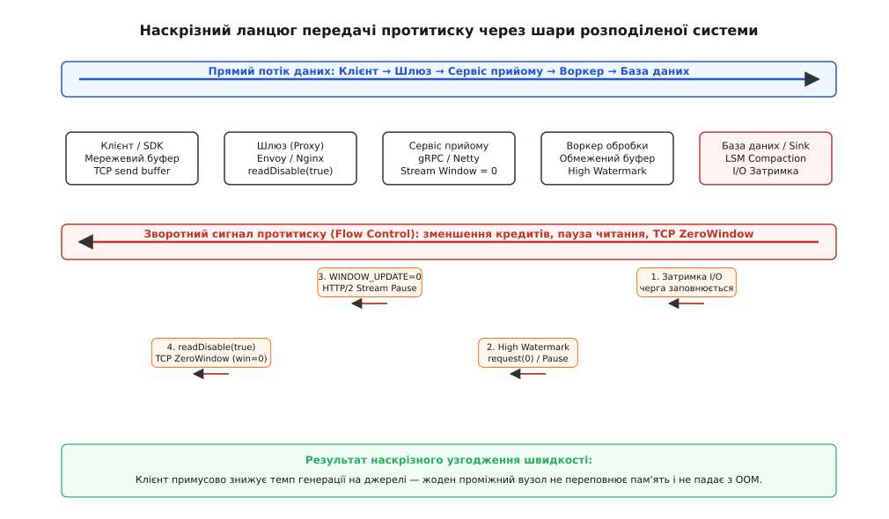
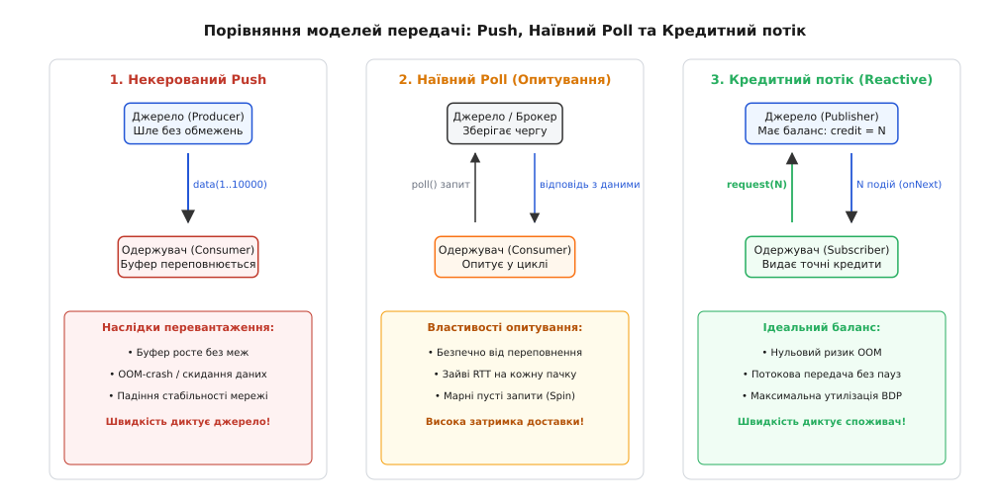
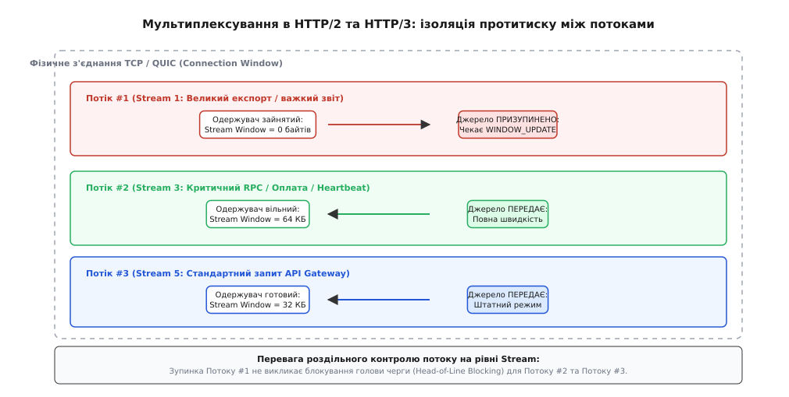
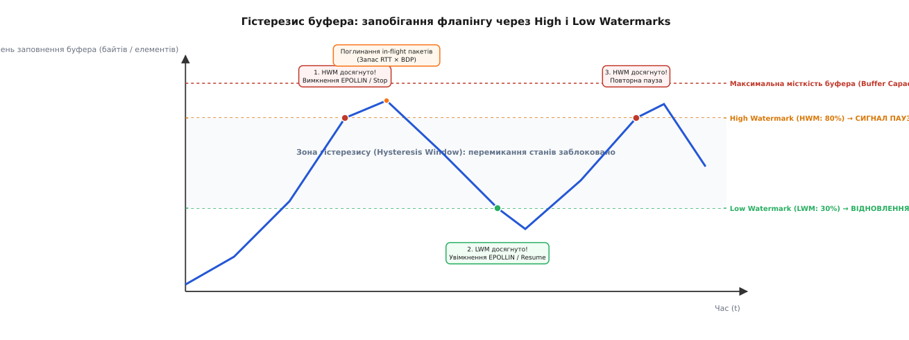

# Наскрізний протитиск

<preknowlist>
- [Таймаути і бюджет часу](root:sf-distributed/timeouts-deadlines) — дедлайни запитів, клієнтські таймаути та бюджет часу наскрізного виклику.
- [Скидання навантаження і плавна деградація](root:sf-distributed/load-shedding) — захист серверів від перевантаження через проактивне відсікання надлишкових запитів.
- [Керування допуском (Admission Control)](root:sf-distributed/admission-control) — обмеження кількості одночасних операцій на вході в систему.
- [Повідомлювальні брокери](root:sf-distributed/message-broker) — моделі черг, топології повідомлень та буферизація асинхронного навантаження.
- [Адаптивна конкурентність](root:sf-distributed/adaptive-concurrency) — динамічне регулювання лімітів паралелізму на основі вимірювання затримок.
- [Вісім оман розподілених обчислень](root:sf-distributed/distributed-fallacies) — фізичні обмеження мережі, затримки та асиметричні затримки передачі.
</preknowlist>

Під час розпродажу на платформі електронної комерції аналітичний конвеєр реєстрації клієнтських подій зазнає раптового сплеску вхідного трафіку з 12 000 до 180 000 подій на секунду. Нижній шар збереження даних — кластер сховища на основі LSM-дерев — входить у фазу інтенсивного фонового ущільнення (Compaction) та скидання сторінок пам'яті на диск, через що його швидкість прийому записів падає зі штатних 100 000 до 15 000 операцій на секунду. Проміжний рівень воркерів продовжує сумлінно вичитувати події з вхідних мережевих сокетів HTTP-шлюзів і записувати їх у внутрішні необмежені черги пам'яті (асинхронні канали Go, черги завдань Netty та поштові скриньки Akka). Протягом 45 секунд обсяг зайнятої оперативної пам'яті на вузлах воркерів перетинає позначку 32 гігабайти. Збирач сміття (Garbage Collector) входить у багаторазові фази повної зупинки світу (Stop-the-World) тривалістю по 4.5 секунди. Через ці паузи воркери перестають надсилати підтвердження, а зовнішні API-шлюзи, не маючи сигналу про перевантаження, продовжують приймати нові з'єднання та накопичувати мегабайти корисного навантаження. За дві хвилини планувальник ядра Linux винищує всі 40 процесів воркерів за допомогою `OOM Killer` (`Out of Memory: Kill process`), шлюзи вичерпують системні файлові дескриптори, і вся розподілена платформа занурюється в катастрофічний каскадний колапс.

Ця аварія демонструє головну пастку асинхронних архітектур: **наявність проміжних буферів пам'яті не вирішує невідповідність швидкостей компонентів, а лише відкладає момент системної катастрофи**. Якщо джерело генерує дані зі швидкістю `λ = 180 000`, а споживач здатний приймати лише `μ = 15 000`, будь-який локальний буфер місткістю `B` неминуче переповниться за детермінований час `T = B / (λ - μ)`.

Архітектурний принцип **наскрізного протитиску (англ. *end-to-end backpressure*, від лат. *retro* — назад та *pressura* — тиск, стискання)** усуває цю проблему за допомогою замкненого зворотного зв'язку: повільний споживач наприкінці конвеєра сигналізує про свій реальний ліміт пропускної здатності вгору за течією, примушуючи кожен проміжний вузол і, зрештою, саме джерело даних знизити швидкість генерації до фізично можливого рівня.


*Наскрізний ланцюг передачі протитиску: затримка I/O в базі даних транслюється через заповнення буферів воркерів, паузу читання вхідних потоків HTTP/2 та нульове вікно TCP ZeroWindow безпосередньо до клієнтського сокета, запобігаючи переповненню пам'яті.*

## Чому локального контролю недостатньо: закон збереження тиску

У монолітних однопроцесних системах протитиск часто зводиться до блокування виклику: якщо черга заповнена, викликаючий потік зупиняється на примітиві синхронізації (`std::condition_variable`, монітор м'ютекса або блокуючий канал).

У розподілених системах компоненти розділені фізичною мережею, асинхронними протоколами та незалежними пулами потоків. Якщо хоча б одна ланка в розподіленому ланцюжку використовує некерований буфер або безконтрольно породжує фонові асинхронні завдання (`fire-and-forget`), наскрізний ланцюг зворотного зв'язку розривається:

1. **Ілюзія швидкого прийому:** Проміжний мікросервіс відповідає клієнту `202 Accepted` або швидко вичитує сокет, створюючи враження високої продуктивності, тоді як насправді він просто складує завдання в купу оперативної пам'яті.
2. **Втрата контексту перевантаження:** Джерело трафіку не знає, що база даних захлинається, і продовжує нарощувати паралелізм.
3. **Вибух затримки (Bufferbloat):** Повідомлення проводять у чергах секунди або хвилини. До моменту, коли воркер добирається до виконання завдання, клієнт уже розірвав з'єднання за таймаутом і надіслав повторну спробу (Retry), що призводить до марнування ресурсів на обробку сміття.

Справжній протитиск є **наскрізним (End-to-End)** лише тоді, коли сигнал уповільнення проходить без розривів від кінцевого виконавця через усі проксі, шлюзи та мережеві протоколи безпосередньо до джерела навантаження.

Про історію виникнення проблеми переповнення буферів від перших експериментів у мережі ARPANET до стандартів сучасних реактивних систем можна прочитати у вставці [📜 Історія розвитку керування потоком: від ARPANET до Reactive Streams](root:sf-distributed/backpressure-end-to-end/hist-reactive-manifesto-and-flow-control.md).

## Моделі взаємодії: Push, Poll та кредитне керування (Credit-Based)

Щоб узгодити темп передачі між відправником і одержувачем, у комп'ютерних системах застосовують три фундаментальні моделі комунікації:


*Порівняння архітектурних моделей: некерований Push викликає вибух буферів пам'яті, наївний Poll марнує затримку на опитування, а кредитний потік поєднує нульовий ризик переповнення з максимальною швидкістю доставки.*

### 1. Некерований Push (Push-модель)

Відправник транслює повідомлення в сокет або чергу одразу в міру їхньої появи. Одержувач є пасивним приймачем. Якщо інтенсивність генерації перевищує швидкість обробки, єдиним порятунком є аварійне скидання даних або падіння процесу через вичерпання пам'яті.

### 2. Наївний Poll (Модель опитування)

Споживач сам ініціює запит на отримання наступної порції даних (`fetch()`, `poll()`). Відправник або брокер ніколи не надсилає більше, ніж явно запитано.
* **Перевага:** Фізична неможливість переповнення буфера споживача.
* **Недолік:** Висока додаткова затримка (Latency Overhead). На кожну пачку повідомлень споживач витрачає час кругового обігу сигналу (`RTT`). Якщо даних немає, опитування перетворюється на марне навантаження процесора (Busy-Spin) або вимагає компромісних тайм-аутів очікування.

### 3. Кредитне керування (Credit-Based Flow Control / Dynamic Pull)

Найбільш досконала модель, покладена в основу стандартів Reactive Streams, HTTP/2 та RSocket:
* Споживач асинхронно надає відправнику початковий запас дозволів (кредитне вікно на `N` повідомлень або байтів: `request(N)`).
* Відправник надсилає повідомлення потоком (Push) на максимальній швидкості, зменшуючи залишок доступного кредиту з кожним відправленим кадром.
* Коли кредит вичерпується до нуля, відправник зобов'язаний призупинити генерацію та чекати на новий сигнал.
* Споживач, у міру вивільнення місця у своєму буфері, завчасно надсилає кадри поповнення кредиту (`WINDOW_UPDATE` або `REQUEST_N`), утримуючи конвеєр постійно заповненим без пауз і без ризику переповнення.

Математичне виведення мінімального розміру кредитного вікна для утилізації мережевого каналу без зупинок, розрахунок порогів водяних знаків та закон Літтла для обмежених черг наведено у вставці [🧮 Математика кредитного вікна, гістерезису водяних знаків та динаміки черг](root:sf-distributed/backpressure-end-to-end/math-credit-and-watermark-dynamics.md).

## Фізичні рівні передачі протитиску

Наскрізний протитиск у реальних розподілених системах забезпечується скоординованою роботою трьох рівнів мережевого та прикладного стека.

```
┌──────────────────────────────────────────────────────────────────┐
│ РІВЕНЬ 4 (ТРАНСПОРТ): TCP Flow Control (SO_RCVBUF, ZeroWindow)   │
└────────────────────────────────┬─────────────────────────────────┘
                                 │
┌────────────────────────────────▼─────────────────────────────────┐
│ РІВЕНЬ 7 (ПРОТОКОЛ): HTTP/2 & HTTP/3 Multiplexed WINDOW_UPDATE   │
└────────────────────────────────┬─────────────────────────────────┘
                                 │
┌────────────────────────────────▼─────────────────────────────────┐
│ РІВЕНЬ 8 (ДОДАТОК / РАНТАЙМ): Reactive Streams / Bounded Buffers  │
└──────────────────────────────────────────────────────────────────┘
```

### Рівень 4: Транспортний потік TCP та сокети ядра Linux

На транспортному рівні операційна система керує буферами прийому (`SO_RCVBUF`, параметри ядра `net.ipv4.tcp_rmem`) та відправки (`SO_SNDBUF`, `tcp_wmem`).

Механізм зв'язку між користувацьким застосунком та мережевим стеком:
1. Застосунок використовує подієвий цикл введення-виведення (`epoll` у Linux) із реєстрацією прапорця `EPOLLIN` на сокеті.
2. Коли внутрішній буфер застосунку заповнюється до критичної межі (High Watermark), застосунок тимчасово вимикає прапорець `EPOLLIN` через системний виклик `epoll_ctl(epfd, EPOLL_CTL_MOD, sock_fd, &ev_without_in)`.
3. Застосунок перестає викликати `recv()` / `read()`.
4. Вхідні мережеві пакети починають накопичуватися в буфері сокета ядра Linux `sk_buff`.
5. Коли буфер `SO_RCVBUF` ядра заповнюється, стек TCP операційної системи зменшує рекламований розмір вікна прийому в заголовках TCP ACK-пакетів (`Window Size`).
6. Коли місця в ядрі не залишається, операційна система відправляє пакет із розміром вікна `win=0` — стан **TCP ZeroWindow**.
7. Стек TCP на боці клієнта отримує `win=0` і блокує відправку нових пакетів. Системний виклик клієнта `send()` або `write()` повертає помилку `EAGAIN` / `EWOULDBLOCK` (або блокує потік).
8. Клієнтський мережевий стек періодично надсилає однобайтні зондуючі пакети (Zero Window Probes), щоб дізнатися, коли вікно відкриється знову.

### Рівень 7: Мультиплексовані протоколи HTTP/2, HTTP/3 та gRPC

Хоча TCP ZeroWindow надійно зупиняє трафік, він має критичний архітектурний дефект у сучасних системах: **блокування всього з'єднання (Connection-level Head-of-Line Blocking)**.

У протоколах HTTP/2, HTTP/3 та gRPC десятки або сотні незалежних логічних запитів (Streams) мультиплексуються поверх одного фізичного TCP-з'єднання або сесії QUIC. Якщо один потік (наприклад, важкий звіт або завантаження файлу) змусить сервер зупинити вичитування TCP-сокета, зупиняться абсолютно всі сусідні потоки в цьому сокеті, включно з критичними мікросекундними викликами перевірки працездатності (Health Checks) та фінансовими транзакціями.


*Мультиплексування в HTTP/2: блокування окремого важкого потоку через нульове вікно Stream Window не впливає на інші потоки, що продовжують обмінюватися даними на повній швидкості з'єднання.*

Для вирішення цієї проблеми специфікації HTTP/2 (RFC 7540) та HTTP/3 запровадили дворівневий контроль потоку на основі спеціальних двійкових кадрів `WINDOW_UPDATE`:
* **Connection Flow Control:** загальне вікно для всіх байтів, що проходять через з'єднання;
* **Stream Flow Control:** індивідуальне вікно для кожного окремого `Stream ID`.

Коли обробник конкретного gRPC-виклику перевантажений, сервер перестає відправляти кадри `WINDOW_UPDATE` для цього конкретного `Stream ID`. Відправник зупиняє передачу кадрів `DATA` виключно для сповільненого потоку, тоді як решта потоків у межах того самого TCP-з'єднання продовжують передавати дані без затримок.

Повний перелік структур двійкових кадрів, інтерфейси Reactive Streams та правила контракту наведено у вставці [📋 Специфікація Reactive Streams та протокольні контракти протитиску](root:sf-distributed/backpressure-end-to-end/api-reactive-streams-contract.md).

### Рівень проміжного ПЗ: Брокери повідомлень (Kafka та RabbitMQ)

У брокерах повідомлень взаємодія з протитиском залежить від базової моделі транспорту:

* **Apache Kafka / Redpanda:** Архітектура за замовчуванням побудована на моделі Pull (`KafkaConsumer.poll(Duration)`). Якщо сервіс-споживач не встигає обробляти повідомлення, він просто збільшує інтервал між викликами `poll()`. Дані накопичуються у персистентному лозі на диску брокера, не перевантажуючи пам'ять застосунку.
  * *Головна пастка:* Якщо обробка пачки повідомлень триває довше, ніж конфігураційний параметр `max.poll.interval.ms` (за замовчуванням 5 хвилин), координатор кластера вважає споживача завислим або мертвим, викидає його з групи та запускає важкий шторм перебалансування партицій (Rebalance Storm). Правильний патерн — використання методу `consumer.pause(partitions)` для тимчасового вимкнення вичитування конкретних партицій із збереженням регулярних викликів `poll()` для надсилання сигналів пульсу (Heartbeats).
* **RabbitMQ / AMQP:** Використовує Push-модель із механізмом попередньої вибірки (Prefetch). Споживач встановлює квоту непідтверджених повідомлень за допомогою виклику `basic.qos(prefetch_count = 100)`. Брокер надсилає споживачеві щонайбільше 100 повідомлень і зупиняє відправку доти, доки споживач не надішле хоча б одне підтвердження `basic.ack`.

## Механізм водяних знаків та гістерезис буферів

Для зв'язування асинхронного буфера пам'яті з мережевим контролером використовують концепцію **водяних знаків (Watermarks)** із гістерезисом:


*Гістерезис буфера: використання розділених порогів High Watermark (пауза читання) та Low Watermark (відновлення прийому) запобігає паразитному високочастотному перемиканню сокета.*

Принцип роботи контуру:
1. **High Watermark (HWM — верхня межа, наприклад 80% місткості):** Коли черга сягає цього рівня, контролер негайно надсилає сигнал зупинки (вимикає `EPOLLIN` на сокеті або припиняє видачу кредитів). Решта 20% ємності буфера (Headroom) призначена для поглинання пакетів, які вже були надіслані відправником і перебувають у польоті в мережевому кабелі на момент надсилання сигналу зупинки.
2. **Low Watermark (LWM — нижня межа, наприклад 30% місткості):** Контролер **не відновлює** прийом одразу після того, як черга опустилася на один елемент нижче HWM. Він чекає, поки воркери звільнять значну частину буфера (до рівня LWM). Лише тоді контролер знову вмикає `EPOLLIN` або видає нову пачку кредитів.
3. **Зона гістерезису (Hysteresis Window):** Різниця між `HWM` та `LWM` гарантує стабільність системи, виключаючи паразиттєве перемикання станів (Flapping/Chatter), яке інакше перевантажило б планувальник операційної системи системними викликами.

Практичну реалізацію такого контролера потоку на мовах C та C++ з використанням потокобезпечних кільцевих буферів та синхронізації наведено у вставці [⚙️ Проект: Реалізація асинхронного рушія протитиску на основі кредитів та водяних знаків](root:sf-distributed/backpressure-end-to-end/proj-credit-flow-controller.md).

## Стратегії обробки переповнення на межі системи

Коли потік даних генерується фізичним джерелом реального світу, яке фізично неможливо призупинити (потокове відео з камери, апаратні датчики IoT, реєстрація колісних імпульсів в автомобілі чи біржовий біржовий тікер UDP Multicast), зворотний сигнал протитиску не може змусити джерело генерувати менше подій.

У таких крайових точках застосовують нормалізовані стратегії реактивного скидання:

| Стратегія | Механізм дії | Сфера застосування |
| :--- | :--- | :--- |
| **`BUFFER`** | Тимчасове накопичення в обмеженій черзі з активацією `HWM`/`LWM`. | Стандартний режим для згладжування короткочасних сплесків трафіку. |
| **`DROP_LATEST`** | Відкидання найновішого щойно прибулого повідомлення, якщо буфер заповнений. | Системи, де збереження старої історії транзакцій є важливішим за нові події. |
| **`DROP_OLDEST`** | Видалення найстарішого повідомлення з голови буфера для запису свіжого в хвіст. | Датчики телеметрії та GPS-трекінг, де актуальні лише найсвіжіші заміри. |
| **`LATEST` (Conflation)** | Злиття нових подій з існуючими (оновлення стану за ключем у хеш-таблиці). | Біржові котирування (Order Book), де потрібна лише поточна ціна акції. |
| **`ERROR` / `FAIL`** | Негайне аварійне переривання потоку з генерацією винятку або коду помилки. | Фінансові аудити, де втрата навіть одного запису є неприпустимою. |

## Головні пастки та збої наскрізного протитиску

Реалізація протитиску в розподілених архітектурах пов'язана з низкою неочевидних інженерних ризиків:

### 1. Пастка некерованих черг у середині асинхронних конвеєрів

Найпоширеніша помилка розробників на мовах із підтримкою легких потоків (Go goroutines, Tokio в Rust, Node.js EventEmitter, Akka actors) — передача повідомлень через канали з необмеженою місткістю (`make(chan T)` без ліміту, `tokio::sync::mpsc::unbounded_channel()`).

Якщо хоча б один крок конвеєра використовує такий канал, наскрізний ланцюг протитиску розривається. Попередній воркер вважає, що успішно відправив завдання, і продовжує вичитувати сокет, тоді як пам'ять процесу непомітно роздувається гігабайтами завислих об'єктів.

### 2. Розподілений клінч у циклічних потоках (Distributed Deadlock)

Якщо Сервіс A передає потік у Сервіс B, а Сервіс B для обробки кожного запиту надсилає зустрічний потік або залежні RPC назад у Сервіс A поверх спільних буферів, обидва сервіси можуть одночасно зупинити прийом через досягнення High Watermark:
* Сервіс A чекає, поки Сервіс B звільнить місце для нових повідомлень;
* Сервіс B чекає, поки Сервіс A вичитає зустрічні повідомлення;
* Система потрапляє в класичний взаємний клінч (Deadlock).

**Правило проектування:** Графи передачі даних із наскрізним протитиском повинні бути **строго ациклічними орієнтованими графами (DAG)**. Зворотні виклики та координація повинні йти через виділені окремі канали зв'язку або супроводжуватися жорсткими таймаутами.

### 3. Конфлікт протитиску з клієнтськими таймаутами

Коли протитиск уповільнює обробку запитів, час перебування повідомлення в системі зростає. Якщо клієнтські застосунки мають короткий статичний таймаут (наприклад, 1000 мс), клієнт розриває з'єднання саме тоді, коли його запит нарешті доходить до черги виконання, і надсилає повторний запит.

Це генерує руйнівний шторм повторів (Retry Storm). Для запобігання цьому явища протитиск завжди повинен поєднуватися з **наскрізною передачею дедлайнів** (`grpc-timeout`, контексти дедлайнів), щоб воркер перед початком обробки міг перевірити, чи клієнт усе ще чекає на відповідь.

## Інженерний приклад: Конфігурація водяних знаків у проксі Envoy

У сучасних хмарних архітектурах зворотні проксі та сервіс-меші (Envoy, Nginx, Traefik) є ключовими вузлами передачі протитиску між клієнтами та бекенд-мікросервісами.

Якщо проксі не має налаштованих обмежень пам'яті на з'єднання, він виступає в ролі нескінченного накопичувача, поглинаючи мегабайти трафіку від швидких клієнтів і приховуючи перевантаження бекендів.

```yaml
# Приклад конфігурації Envoy для наскрізного протитиску
static_resources:
  listeners:
  - name: ingress_http
    address:
      socket_address: { address: 0.0.0.0, port_value: 443 }
    # Ліміт буфера на одне TCP-з'єднання з боку клієнта (Downstream)
    per_connection_buffer_limit_bytes: 65536 # 64 КБ
    filter_chains:
    - filters:
      - name: envoy.filters.network.http_connection_manager
        typed_config:
          "@type": type.googleapis.com/envoy.extensions.filters.network.http_connection_manager.v3.HttpConnectionManager
          stat_prefix: ingress_http
          route_config:
            name: local_route
            virtual_hosts:
            - name: backend_service
              domains: ["*"]
              routes:
              - match: { prefix: "/" }
                route: { cluster: payment_cluster }
  clusters:
  - name: payment_cluster
    connect_timeout: 0.25s
    type: STRICT_DNS
    # Ліміт буфера з'єднання до бекенда (Upstream)
    per_connection_buffer_limit_bytes: 65536 # 64 КБ
    circuit_breakers:
      thresholds:
      - priority: DEFAULT
        max_connections: 1024
        max_pending_requests: 100 # Максимальна черга в очікуванні сокета
        max_requests: 4096
```

### Покрокова механіка роботи Envoy під час перевантаження:
1. Бекенд сповільнює вичитування з'єднання;
2. Буфер відправки Envoy до бекенда досягає `per_connection_buffer_limit_bytes` (64 КБ) — поріг High Watermark;
3. Envoy негайно викликає внутрішній метод `downstream_connection->readDisable(true)`;
4. Метод `readDisable(true)` вимикає подію читання на сокеті клієнта;
5. Сокет клієнта перестає вичитуватися з ядра Linux, що змушує ядро відправити `TCP ZeroWindow` безпосередньо клієнту.

## Спостережуваність протитиску: метрики та діагностика через eBPF

Для виявлення прихованих заторів і діагностики затримки зворотного зв'язку в розподілених системах використовують моніторинг на рівні ядра та прикладні метрики:

```
                                  ┌──────────────────────────────────┐
                                  │      МЕТРИКИ ПРОТИТИСКУ          │
                                  └────────────────┬─────────────────┘
                                                   │
          ┌────────────────────────┬───────────────┴──────────────┬────────────────────────┐
          ▼                        ▼                              ▼                        ▼
┌──────────────────┐      ┌────────────────────┐         ┌────────────────────┐    ┌────────────────────┐
│   Ядро Linux     │      │   HTTP/2 / gRPC    │         │  Реактивний пуфер  │    │  Брокери (Kafka)   │
│   (TCP Stack)    │      │   (Stream Flow)    │         │  (Reactive Stream) │    │  (Consumer Lag)    │
├──────────────────┤      ├────────────────────┤         ├────────────────────┤    ├────────────────────┤
│ • TCPZeroWindow- │      │ • http2_inbound_   │         │ • executor_queue_  │    │ • records_lag_max  │
│   Sent / Recv    │      │   stream_window_0  │         │   depth_percentage │    │ • fetch_throttle_  │
│ • TCPSynBacklog- │      │ • grpc_flow_cntrl_ │         │ • reactive_demand_ │    │   time_ms          │
│   Drops          │      │   wait_duration_ms │         │   current_value    │    │ • poll_idle_ratio  │
└──────────────────┘      └────────────────────┘         └────────────────────┘    └────────────────────┘
```

1. **TCP ZeroWindow лічильники:** зростання лічильника `netstat -s | grep -i zerowindow` або системних подій `TCPAckZeroWindow` вказує на те, що користувацький застосунок не встигає вичитувати сокет.
2. **eBPF-простеження черг сокетів:** за допомогою утиліт BCC (`tcpdrop`, `tcpretrans`, `tcprtt`) або програми eBPF відстежується час, який байти проводять у буферах ядра до виклику `recv()`.
3. **Затримка черги (Sojourn Time):** відстеження інтервалу часу між додаванням повідомлення в чергу воркера та початком його фактичного виконання. Якщо `Sojourn Time` перевищує 50 мс, контролер потоку повинен активувати протитиск до того, як пам'ять буде вичерпано.

---

> 🔧 **Навіщо це на практиці.**
> Наскрізний протитиск перетворює катастрофічне падіння розподіленої системи (з вибиванням процесів через OOM-killer, зависанням збирача сміття та каскадним доміно збоїв) на контрольоване й детерміноване узгодження швидкості. Система зберігає 100% корисної пропускної здатності (Goodput) навіть за десятикратного перевантаження, гарантуючи передбачувану стабільність інфраструктури.

