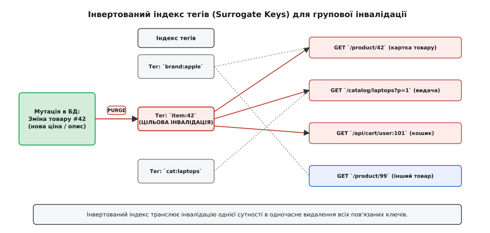
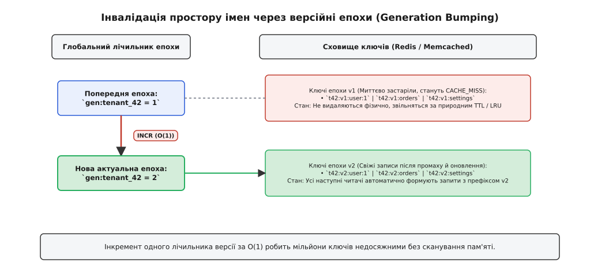
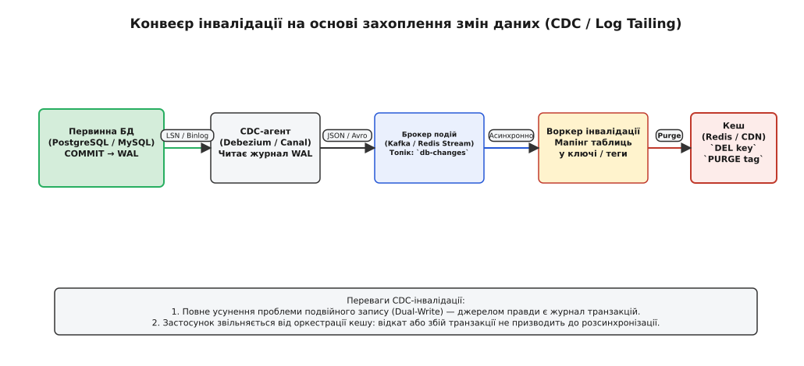
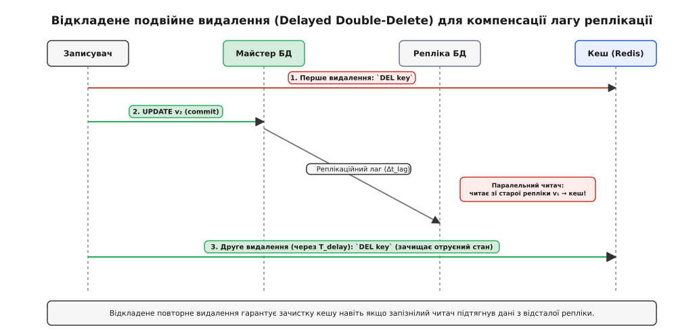

# Патерни інвалідації

<preknowlist>
- [Кеш](root:hw-arch/cache) — призначення швидкої тимчасової пам'яті для гарячих даних ціною оперативної пам'яті.
- [Кеш вводить друге джерело правди (ціна)](root:sf-data/cache-invalidation-intro) — фундаментальний дуалізм стану, вікно застарілості та гонки примарних записів.
- [Патерни кешування](root:sf-data/caching-strategies) — стратегії взаємодії між сховищами: Cache-Aside, Read-Through, Write-Through та Write-Behind.
- [Політики витіснення кешу: LRU, LFU, CLOCK](root:sf-data/cache-eviction-policies) — правила звільнення оперативної пам'яті під час вичерпання лімітів на відміну від інвалідації застарілих даних.
- [Єдине джерело правди](root:sf-apps/single-source-of-truth) — принцип єдиного авторитетного сховища для уникнення розбіжностей стану.
</preknowlist>

Користувач маркетплейсу змінює ціну смартфона з 30 000 на 25 000 гривень. Реляційна база даних успішно фіксує зміну в рядку таблиці `products` за 2 мілісекунди. Однак цей смартфон одночасно присутній у кеші картки товару, у знімку першої сторінки категорії «Електроніка», у результатах сортування за ціною, у кешованому блоці персональних рекомендацій 10 000 користувачів та на прикордонних серверах CDN у трьох регіонах. Якщо застосунок просто видалить ключ `product:42`, користувачі в каталозі продовжать бачити стару ціну 30 000, а при переході в кошик — нову ціну 25 000, що спричинить конфлікт оформлення замовлення та недовіру покупців. Якщо ж виконати повне очищення кешу, 80 000 паралельних запитів щосекунди вдарять безпосередньо в базу даних, викликавши лавинне падіння всієї інфраструктури (cache stampede).

Ця криза демонструє фундаментальну інженерну відмінність між витісненням за браком пам'яті (eviction) та скасуванням чинності копій через зміну оригіналу. **Інвалідація кешу** (*інвалідація* — від лат. *invalidus*, нечинний, позбавлений сили) — це сукупність архітектурних патернів, які гарантують своєчасне, безпечне й адресне анулювання застарілих похідних копій у розподілених шарах зберігання без перевантаження первинного джерела правди.

## Виміри простору інвалідації

Щоб обрати правильний патерн, необхідно класифікувати механізми інвалідації за трьома ортогональними осями:

1. **Гранулярність цілі (Target Scope):**
   * *Точкова (Point):* Анулювання одного конкретного ключа (`DEL product:42`). Мінімальний радіус ураження, але не вирішує проблему складених агрегатів.
   * *Групова / Тегована (Group / Tag):* Одночасне видалення довільної множини ключів, об'єднаних спільним семантичним дескриптором (`PURGE tag:brand:apple`).
   * *Просторова / Епохальна (Namespace / Epoch):* Миттєве знецінення мільйонів ключів одного контексту за `O(1)` шляхом зміни версії простору імен.
   * *Повне очищення (Flush / Scan):* Скидання всього сховища або пошук за маскою `KEYS *pattern*`. Вкрай небезпечна операція у виробничому середовищі, оскільки блокує подієвий цикл Redis і руйнує захисний екран бази даних.
2. **Джерело та спосіб ініціації (Trigger & Propagation):**
   * *Синхронна оркестрація застосунком (Application-Driven):* Застосунок виконує мутацію в базі й одразу надсилає команду видалення в кеш у межах того самого HTTP-запиту.
   * *Подієва інвалідація на базі журналу (Log-Centric / CDC):* Фоновий агент зчитує журнал транзакцій бази даних (WAL / Binlog) і транслює зміни через брокер повідомлень.
   * *Пасивне вичерпання часу (Time-based Expiration):* Очищення спирається на лічильник `TTL` (Time To Live).
3. **Момент виконання (Execution Timing):**
   * *Негайне вилучення (Eager Eviction):* Фізичне видалення запису з пам'яті в момент зміни оригіналу.
   * *Лінива перевірка (Lazy Validation):* Запис залишається в пам'яті, але перед віддачею читач перевіряє актуальність його версійного маркера або токена лізи.
   * *Випереджальне ймовірнісне оновлення (Probabilistic Refresh):* Застосунок оновлює запис у фоні за частку секунди до його планового застарівання, запобігаючи виникненню холодних промахів.

## Патерн 1. Точкове видалення та явний скид (Explicit Key Eviction)

Найпростішим і найдавнішим підходом є пряме адресне видалення ключа з кешу при успішній фіксації запису в базі даних.

```
[ Клієнт ] ──(1. UPDATE product SET price=25000)──> [ База даних ]
[ Клієнт ] ──(2. DEL product:42)───────────────────> [ Кеш (Redis) ]
```

### Механізм і послідовність операцій

У патерні Cache-Aside обов'язковим правилом є **видалення замість оновлення значення**. Якщо замість `DEL` виконати `SET product:42 new_value`, два конкурентні записувачі через непередбачувані затримки мережі можуть виконати операції в різному порядку на базі даних та на кеші, що призведе до незворотної розсинхронізації стану.

Точкове видалення позбавлене цієї вади: після `DEL` наступний читач фіксує промах, звертається до бази даних і завантажує гарантовано актуальний стан.

### Обмеження та крайові випадки

* **Проблема подвійного запису (Dual-Write Failure):** Якщо база даних зафіксувала транзакцію, а мережевий виклик `DEL` до кешу зазнав тайм-ауту або процес упав, кеш залишиться назавжди отруєним старим значенням.
* **Відсутність зв'язку зі складеними сутностями:** Видалення ключа `product:42` ніяк не впливає на кеш сторінки `/category/laptops` або кеш пошукової видачі. Цей патерн придатний виключно для простих key-value структур прямого доступу за первинним ключем.

## Патерн 2. Тегована інвалідація та сурогатні ключі (Surrogate Keys / Cache Tags)

Коли зміна одного об'єкта впливає на безліч різноманітних сторінок та API-відповідей, застосовують патерн **тегованої інвалідації** (у термінології мереж доставки контенту — сурогатні ключі, `Surrogate Keys`).

Детальний аналіз виникнення цього підходу в архітектурі Akamai, Squid та Varnish викладено в історичному нарисі про [історію сурогатних ключів](root:sf-distributed/cache-invalidation-patterns/hist-surrogate-keys-and-tags.md).


*Інвертований індекс тегів: зміна однієї сутності транслюється у миттєве видалення всіх залежних кешованих ключів без сканування сховища.*

### Архітектура інвертованого індексу

Суть патерну полягає у формуванні метаданих під час генерації кешованої відповіді. Сервер походження, збираючи HTML-сторінку або JSON-відповідь, маркує її набором семантичних тегів:

```http
HTTP/1.1 200 OK
Content-Type: application/json
Surrogate-Key: item:42 cat:laptops brand:apple
```

Кеш-система (Redis, CDN або Varnish) зберігає цільовий об'єкт за його прямим ключем URL, але додатково записує цей ключ у множини інвертованого індексу для кожного зі згаданих тегів:

* `tag:item:42 -> { "/product/42", "/catalog/laptops?p=1", "/cart/user:101" }`
* `tag:brand:apple -> { "/product/42", "/product/99", "/brand/apple/about" }`
* `tag:cat:laptops -> { "/catalog/laptops?p=1", "/category/laptops/filters" }`

Коли адміністратор змінює опис або ціну товару `#42`, система надсилає єдину команду інвалідації: `PURGE TAG item:42`. Рушій знаходить множину `tag:item:42`, витягує з неї всі три асоційовані ключі й атомарно видаляє їх. Решта сторінок бренду Apple або категорії ноутбуків, які не містять товару `#42`, залишаються цілими й продовжують обслуговуватися з високою швидкістю.

Математичне обґрунтування накладних витрат пам'яті на підтримку інвертованих індексів та оцінку ймовірності лавини запитів під час групового скидання наведено в [математичній моделі витрат на індексування](root:sf-distributed/cache-invalidation-patterns/math-invalidation-cost.md).

### Очищення м'яких тегів (Soft Tags)

Якщо тег посилається на 50 000 ключів (наприклад, категорія з мільйоном переглядів), одночасне фізичне видалення всіх цих ключів спричинить миттєвий шквал промахів до бази даних. Для запобігання цій аварії застосовують **м'яке очищення (Soft Purge / Stale-While-Revalidate)**:
Ключі не видаляються фізично, а позначаються застарілими. Перший клієнт, що звернувся після інвалідації, отримує старий стан і запускає фоновий процес перерахунку, а всі наступні користувачі продовжують отримувати закешовану копію до завершення генерації нового знімка.

## Патерн 3. Версійні епохи та простори імен (Namespace Generation Bumping)

Якщо системі потрібно миттєво анулювати сотні тисяч або мільйони ключів (наприклад, скинути весь кеш клієнта в мультиарендній системі `tenant_42` або оновити глобальну схему цін), тегований індекс вимагатиме занадто багато операцій видалення.

Для таких задач застосовують патерн **версійних епох** (Generation Bumping, або Versioned Namespaces).


*Інвалідація епохами: атомарний інкремент одного лічильника версії за O(1) робить мільйони ключів недосяжними без навантаження на мережу та диск.*

### Принцип роботи лічильників епох

Замість збереження ключів у плоскому просторі `tenant_42:users:101`, застосунок додає до кожного ключа динамічний префікс поточної епохи:

1. У кеші зберігається глобальний лічильник версії простору імен: `gen:tenant_42 = 1`.
2. Застосунок формує кінцевий ключ як суперпозицію: `key = "tenant_42:v" + gen + ":users:101"` (тобто `tenant_42:v1:users:101`).
3. Коли виникає потреба миттєво інвалідувати **всі** дані цього простору імен, застосунок виконує рівно одну атомарну операцію: `INCR gen:tenant_42`.
4. Значення лічильника стає `gen:tenant_42 = 2`.
5. Усі наступні операції читання автоматично шукатимуть ключі з префіксом `tenant_42:v2:...`. Оскільки таких ключів у сховищі ще немає, клієнти отримують природний промах `CACHE_MISS` і завантажують свіжий стан із бази даних.

### Переваги та ціна рішення

* **Часова складність `O(1)`:** Інвалідація будь-якої кількості даних (від 10 записів до 100 мільйонів) виконується за фіксований час одного мережевого виклику (менше 1 мс).
* **Відсутність блокування Redis:** Немає потреби сканувати простір ключів або викликати важкі цикли видалення.
* **Природне очищення сміття:** Старі ключі `v1` ніколи більше не будуть прочитані. Вони спокійно витісняються фоновим механізмом `TTL` або алгоритмом звільнення пам'яті `LRU` у міру надходження нових даних.

Повноцінну реалізацію двостороннього індексу тегів, генератора версійних епох та захисних ліз наведено у [проекті створення рушія інвалідації](root:sf-distributed/cache-invalidation-patterns/proj-tag-and-version-invalidation.md).

## Патерн 4. Інвалідація на базі журналу транзакцій (CDC / Log-Tailing)

Оркестрація кешу з коду бізнес-логіки застосунку несе непереборну ваду: якщо транзакція в базі даних успішно завершилася, а виклик інвалідації кешу впав через мережевий збій або аварійне завершення процесу (OOM), стан розійдеться назавжди.

Для усунення проблеми подвійного запису застосовують патерн **CDC-інвалідації (Change Data Capture)** на базі вичитування журналу попереднього запису (WAL у PostgreSQL або Binlog у MySQL).


*Конвеєр CDC-інвалідації: читання журналу транзакцій WAL усуває проблему подвійного запису й гарантує монотонний порядок анулювання копій.*

### Будова конвеєра інвалідації

1. **Фіксація транзакції (Commit):** Застосунок виконує звичайний SQL-запит і більше не турбується про кеш. База даних гарантує надійний запис змін у персистентний журнал WAL на диску.
2. **Захоплення змін (Capture):** Агент CDC (наприклад, Debezium) підключається до реплікаційного слота бази даних і в реальному часі транслює потік бінарних подій мутацій у брокер повідомлень (Apache Kafka).
3. **Партиціонування за сутністю:** Повідомлення надсилаються в топік Kafka з ключем партиції `<table_name>:<primary_key>`. Це забезпечує суворе збереження порядку оновлень для кожного окремого рядка.
4. **Споживач інвалідації (Worker):** Легковажний сервіс вичитує події з Kafka, генерує відповідні ключі або теги сутності та надсилає команди `DEL` або `PURGE` до кеш-серверів і CDN.

Повний структурний контракт подій CDC, формати JSON-повідомлень та специфікацію взаємодії через gRPC задокументовано в [довіднику протоколу інвалідації](root:sf-distributed/cache-invalidation-patterns/api-invalidation-protocol.md).

## Патерн 5. Відкладене подвійне видалення та лізи поколінь (Delayed Double-Delete)

У розподілених системах із реплікацією бази даних (Master-Replica) виникає прихована гонка станів через лаг реплікації.


*Відкладене подвійне видалення: повторна зачистка кешу після тайм-ауту реплікації нейтралізує отруєння застарілими даними з відсталої репліки.*

### Анатомія аварії реплікаційного лагу

1. Записувач оновлює значення товару на **Майстрі** БД (`v2`) і надсилає команду `DEL product:42` у кеш. Кеш очищено.
2. У цей самий момент паралельний читач намагається отримати `product:42`. Отримавши промах, читач звертається до найближчої **Репліки** для читання.
3. Через реплікаційний лаг (`Δt_lag = 200 мс`) репліка ще не встигла отримати оновлення від Майстра і повертає читачеві застаріле значення `v1`.
4. Читач бере старе значення `v1` і записує його назад у кеш (`SET product:42 v1`).
5. Результат: на Майстрі лежить актуальне `v2`, але кеш знову отруєно застарілим `v1` на невизначений термін.

### Алгоритм відкладеного подвійного видалення

Щоб гарантовано зачистити отруєний стан, застосовують протокол подвійного видалення:

1. **Перше видалення:** Виконується негайно перед комітом або одразу після фіксації транзакції на Майстрі.
2. **Пауза очікування (`T_delay`):** Завдання на друге видалення відправляється у чергу затриманих повідомлень. Інтервал затримки вибирається з умови гарантованого перевищення максимального лагу реплікації:
   `T_delay > max(L_repl) + 2·RTT + σ_jitter` (зазвичай 300–500 мс).
3. **Друге видалення:** Після вичерпання таймера фоновий воркер повторно виконує `DEL product:42`. Навіть якщо запізнілий читач встиг отруїти кеш даними зі старої репліки, друге видалення безповоротно стирає фантомний запис.

## Патерн 6. Ймовірнісне та випереджальне оновлення (XFetch & Early Refresh)

Для гарячих ключів (наприклад, курси валют, головна сторінка новинного сайту) повне видалення з кешу є небезпечним, оскільки навіть мілісекундна відсутність ключа викликає падіння бази даних через шквал паралельних промахів.

Для таких сценаріїв застосовують **алгоритм ймовірнісного дострокового оновлення (XFetch)**.

Замість очікування моменту закінчення дії ключа (`t_expiry`), кожен клієнт під час звичайного читання обчислює ймовірнісний вираз:

```
t_now - β · δ · ln(U) > t_expiry
```

де `δ` — виміряний час обчислення запиту базою даних, `β` — конфігураційний коефіцієнт агресивності (`β ≥ 1`), а `U` — випадкове число від 0 до 1.

Задовго до закінчення `TTL` ймовірність спрацювання умови наближається до нуля. Але за кілька секунд до застарівання перший випадковий клієнт отримує позитивний результат, повертає собі поточні дані без затримки й паралельно у фоновому потоці ініціює перерахунок значення в базі даних. Коли настане момент остаточного застарівання, у кеші вже лежатиме свіжий знімок, і жоден клієнт не зазнає паузи очікування.

## Порівняльна матриця патернів інвалідації

| Патерн інвалідації | Часова складність | Гарантії свіжості | Радіус ураження (Blast Radius) | Накладні витрати пам'яті | Головна сфера застосування |
| :--- | :--- | :--- | :--- | :--- | :--- |
| **Точковий скид (DEL)** | `O(1)` | Суворі (з ризиком Dual-Write) | Тільки цільовий ключ | Нульові | Прості сутності з доступом за ID (профілі користувачів). |
| **Теги (Surrogate Keys)** | `O(K_tag)` | Високі (залежно від затримки індексу) | Всі зв'язані представлення сутності | 15–30% оверхеду на індекс зв'язків | Електронна комерція, складні новинні сторінки, CDN-кеш. |
| **Версійні епохи** | `O(1)` | Миттєві за `O(1)` на весь простір | Весь логічний домен / тенант | Мінімальні (один числовий лічильник) | Мультиарендні системи (SaaS), зміна глобальних тарифів. |
| **CDC на базі WAL** | `O(1)` (асинхронно) | Кінцева узгодженість (лаг 10–100 мс) | Точковий або тегований | Пам'ять брокера повідомлень (Kafka) | Високонавантажені мікросервіси, усунення Dual-Write. |
| **Подвійне видалення** | `O(1) + T_delay` | Захист від лагу реплікацій | Тільки цільовий ключ | Пам'ять черги відкладених завдань | Бази даних із пулом асинхронних реплік для читання. |
| **XFetch / Soft Purge** | `O(1)` (фоново) | Свіжість із випередженням | Нульовий (без промахів) | Додаткові поля `δ` та `t_expiry` в об'єкті | Гарячі агрегати з високим ризиком Cache Stampede. |

> 🔧 **Навіщо це.**
> У промисловій розробці найбільшою помилкою є спроба вирішити всі задачі єдиним універсальним викликом `cache.del()`. 
> Практичне правило побудови надійної архітектури інвалідації:
> 1. **Шар даних:** Оновлення бази завжди транслюються через CDC-конвеєр (Debezium + Kafka), звільняючи прикладний код від ручної синхронізації сховищ.
> 2. **Шар читання:** Складені сторінки маркуються сурогатними ключами `Surrogate-Key`, а прикордонні проксі налаштовуються на `Fastly-Soft-Purge` або `stale-while-revalidate`.
> 3. **Шар реплікації:** Якщо читання йде з відстаючих реплік, інвалідація обов'язково дублюється через відкладене повідомлення з тайм-аутом 500 мс.
> 4. **Шар ізоляції:** Мультиарендні клієнти адресуються виключно через версійні префікси `tenant:v{gen}:key`, що дозволяє миттєво очищати дані окремого замовника за одну операцію `INCR` без ризику загальносистемного колапсу.
