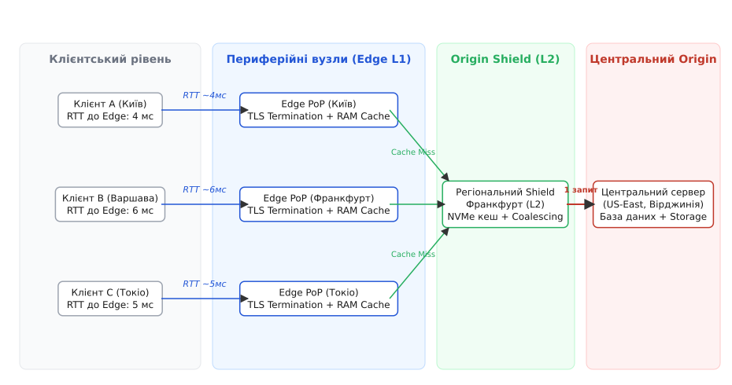
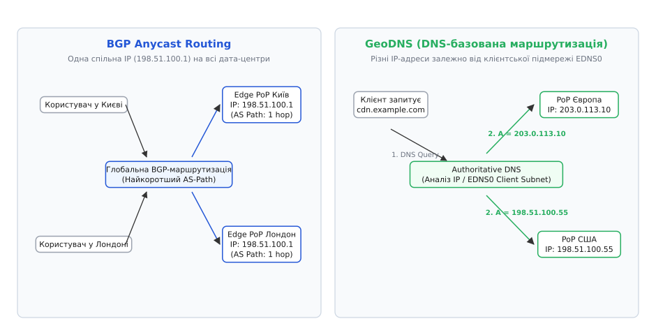
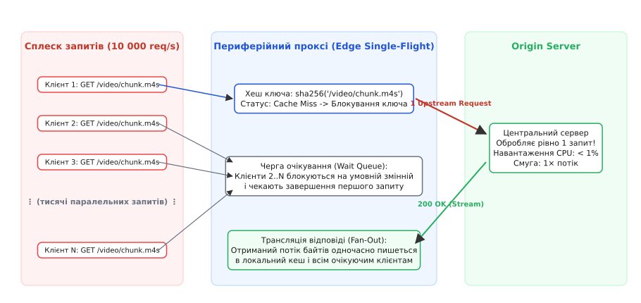

# Мережі доставки вмісту (CDN)

<preknowlist>
- [TCP проти UDP](topic:com-transport/tcp-vs-udp) — різниця між орієнтованим на потік з'єднанням із контролем доставки та датаграмами без стану.
- [Життєвий цикл TCP-з'єднання](topic:com-transport/tcp-connection-lifecycle) — триетапне рукостискання, потік байтів, стани TIME_WAIT та закриття сокетів.
- [Протокол TLS](topic:sf-security/tls) — криптографічне рукостискання, узгодження симетричних ключів та накладні витрати RTT.
- [Зворотний проксі](topic:sf-web/reverse-proxy) — термінація клієнтських з'єднань та перенаправлення запитів на групу бекендів.
- [Балансування на 4-му та 7-му рівнях](topic:sf-distributed/load-balancing) — розмежування між комутацією TCP-потоків та семантичною обробкою HTTP-запитів.
- [Патерни кешування](topic:sf-data/caching-strategies) — кешування поруч із джерелом, політики оновлення та ціна узгодженості.
- [Request coalescing / single-flight](topic:sf-distributed/request-coalescing) — згортання паралельних запитів до холодного ресурсу в один вихідний запит.
</preknowlist>

Коли веб-сервіс розміщує єдиний дата-центр у Північній Вірджинії (США), користувач із Києва або Сіднея відчуває помітну затримку відкриття кожної сторінки, навіть якщо сервер має надпотужні процесори, а користувач підключений до гігабітного оптоволоконного каналу. Причина криється у фундаментальному фізичному обмеженні: швидкість поширення електромагнітного сигналу в оптичному склі становить близько 200 000 км/с. На географічній дистанції у десять тисяч кілометрів один пакет летить туди й назад щонайменше 150–200 мілісекунд. 

Оскільки протоколи TCP та TLS 1.3 вимагають послідовного обміну службовими пакетами для відкриття з'єднання та узгодження криптографічних ключів, клієнт витрачає три повні цикли очікування (3 RTT) ще до того, як сервер надішле перший байт HTML-документа. Якщо на сторінці розміщено десятки зображень, скриптів і стилів, централізований сервер перетворюється на вузьке місце, а глобальна мережа деградує до стану багаторазового очікування на трансокеанських магістралях.

Єдиним архітектурним вирішенням цієї проблеми є децентралізація: перенесення точок обслуговування трафіку максимально близько до кінцевих користувачів за допомогою мереж доставки вмісту — CDN (англ. *Content Delivery Network*, від лат. *distributio* — поділ, розподіл).


*Ієрархічна структура CDN: наближення периферійних вузлів L1 до клієнтів, проміжний захисний щит L2 та оптимізована магістраль до центрального сервера-джерела.*

---

### Фізичний бар'єр RTT та пропускна здатність TCP

Щоб зрозуміти, чому просте нарощування пропускної здатності серверного каналу не вирішує проблему швидкодії, необхідно проаналізувати взаємозв'язок між затримкою кругового обігу (Round Trip Time, RTT) та динамікою транспортного протоколу TCP.

Під час відкриття нового TCP-з'єднання протокол не може миттєво заповнити гігабітний канал даними. Щоб уникнути переповнення буферів проміжних маршрутизаторів у глобальній мережі, алгоритм керування перевантаженням (TCP Congestion Control) починає передачу з невеликого початкового вікна (Initial Congestion Window, `initcwnd` зазвичай 10 MSS, тобто ~14.6 КБ). Лише після успішного отримання підтверджень (`ACK`) розмір вікна експоненційно подвоюється на кожному кроці RTT під час фази повільного старту (Slow Start).

Добуток пропускної здатності на затримку (Bandwidth-Delay Product, BDP) показує обсяг даних, який канал здатен утримувати в процесі польоту:
```
BDP = Пропускна_здатність · RTT
```

На трансатлантичному маршруті з `RTT = 180 мс` для утилізації гігабітного каналу розмір TCP-вікна передачі має досягати понад 20 МБ. Якщо розмір вікна обмежений налаштуваннями операційної системи (наприклад, стандартними 64 КБ), теоретична швидкість передачі падає до скромних 2.9 Мбіт/с незалежно від фізичної товщини оптоволоконного кабелю.

Докладний розрахунок оптичних затримок, формул BDP та математичне зіставлення часу передачі файлів наведено у [математичному виведенні BDP та оцінці мережевої латентності](topic:sf-distributed/cdn/math-latency-bdp.md).

---

### Анатомія периферійного вузла (Edge PoP)

CDN розв'язує фізичне обмеження швидкості світла через розгортання сотень географічно розподілених точок присутності — PoP (англ. *Point of Presence*). Такі вузли встановлюються безпосередньо всередині точок обміну інтернет-трафіком (Internet Exchange Points, IXP) та локальних дата-центрах інтернет-провайдерів (ISP).

Кожен вузол присутності містить групу високопродуктивних серверів периферії (Edge Servers, від англ. *edge* — край, периферія), які виконують дві ключові ролі:
1. **Термінація транспортного та захищеного з'єднань (TCP/TLS Termination):** Клієнт встановлює TCP-з'єднання та узгоджує ключі TLS 1.3 не з віддаленим сервером у США, а з найближчим Edge-сервером у своєму місті чи країні. Час RTT скорочується з 180 мс до 2–10 мс. Рукостискання завершується за лічені мілісекунди.
2. **Локальне кешування та проксування:** Edge-вузол зберігає статичні ресурси (зображення, відеофрагменти, JavaScript, CSS, шрифти) у надшвидкій оперативній пам'яті (RAM) та на NVMe-накопичувачах. Якщо запитаний файл є в локальному сховищі (Cache HIT), він віддається клієнту миттєво.

Між периферійними вузлами CDN та первинним сервером додатку (Origin, від лат. *origo* — початок, джерело) підтримуються заздалегідь відкриті, постійні та прогріті пули TCP-з'єднань (Connection Pooling). Це дозволяє передавати некешовані запити до Origin без повторних затримок на рукостискання та з максимально розгорнутим вікном передачі `cwnd`.

Історичні передумови виникнення цієї технології, починаючи від виклику Тіма Бернерса-Лі у стінах MIT та першого краш-тесту під час релізу «Зоряних війн», викладено в [історії народження CDN та боротьби з «World Wide Wait»](topic:sf-distributed/cdn/hist-birth-of-cdn.md).

---

### Механізми маршрутизації запитів (Request Routing)

Щоб надіслати HTTP-запит користувача саме на той Edge-сервер, який є географічно та топологічно найближчим, CDN застосовує один із двох фундаментальних мережевих механізмів.


*Механізми вибору найближчого вузла: BGP Anycast направляє трафік на спільну IP-адресу через найкоротший AS-шлях, тоді як GeoDNS видає конкретну адресу на основі підмережі клієнта.*

#### 1. Маршрутизація Anycast на базі BGP
У моделі Anycast (англ. *anycast* — адресація до найближчого з багатьох) усі периферійні дата-центри CDN по всьому світу анонсують одну й ту саму IP-адресу (або префікс підмережі) у глобальну таблицю протоколу динамічної маршрутизації BGP (Border Gateway Protocol).

Коли провайдер клієнта передає IP-пакет, проміжні магістральні маршрутизатори обирають шлях із найменшою кількістю транзитних автономних систем (найкоротший BGP AS-Path). У результаті пакети клієнта автоматично та прозоро потрапляють до найближчого вхідного вузла CDN.

* **Переваги Anycast:** Миттєве перемикання при відмовах (якщо дата-центр вимикається, BGP-анонс знімається, і світові маршрутизатори за секунди перенаправляють трафік на сусідній PoP); відсутність залежності від DNS-кешування; природний захист від розподілених атак на відмову в обслуговуванні (DDoS), оскільки атакуючий трафік розсіюється по сотнях точок присутності у світі.
* **Складнощі Anycast:** Нестабільність маршрутів (BGP Flapping). Якщо в магістрального провайдера змінюється вага маршруту посеред активної сесії, наступні пакети того самого TCP-з'єднання можуть прилетіти на інший фізичний PoP. Сучасні CDN нівелюють це завдяки stateless-балансувальникам на базі консистентного хешування або синхронізації сесій між сусідніми дата-центрами.

#### 2. Географічний DNS (GeoDNS) та EDNS0 Client Subnet
У моделі GeoDNS доменне ім'я CDN обслуговується інтелектуальними авторитетними DNS-серверами. 

Коли клієнт запитує IP-адресу домену, DNS-сервер аналізує IP-адресу резолвера, що надіслав запит, або використовує розширення EDNS0 Client Subnet (RFC 7871), яке передає початкові байти IP-адреси самого клієнта. На основі вбудованої геолокаційної бази та поточної карти завантаженості мережі DNS-сервер повертає унікальну A/AAAA-адресу конкретного регіонального PoP.

* **Переваги GeoDNS:** Можливість тонкого балансування трафіку на прикладному рівні, маршрутизація з урахуванням вартості транзиту в конкретних регіонах, робота в мережах без власної BGP-інфраструктури.
* **Складнощі GeoDNS:** Кешування DNS-відповідей (TTL). Якщо PoP виходить із ладу, клієнти продовжують надсилати запити на мертву IP-адресу, доки не спливе час життя запису (TTL) у локальному DNS-кеші провайдера.

---

### Багаторівнева ієрархія: Edge, Regional Shield та Origin

У великих сервісах із каталогами на мільйони файлів пряме звернення сотень тисяч Edge-серверів до єдиного Origin під час промахів кешу спричиняє ефект «отари запитів» (Thundering Herd), що призводить до колапсу бази даних та переповнення вихідного каналу джерела.

Щоб захистити Origin, CDN будує трирівневу ієрархію кешування:

```
[ Клієнти ] ──► [ Edge PoPs (L1) ] ──► [ Regional Origin Shield (L2) ] ──► [ Origin Server ]
```

1. **Рівень L1 (Edge PoP):** Невеликі периферійні сервери, розташовані в сотнях міст. Оснащені швидким RAM-кешем для найгарячішого контенту (верхні 10–20% найпопулярніших файлів).
2. **Рівень L2 (Origin Shield / Regional Mid-Tier):** Потужні регіональні дата-центри (наприклад, один у Європі, один у Північній Америці, один в Азії) з масивними дисковими сховищами NVMe. Вони акумулюють промахи сотень підпорядкованих Edge-вузлів L1.
3. **Механізм згортання запитів (Request Coalescing / Collapsing):** Якщо тисяча користувачів одночасно запитують новий вірусний відеофрагмент, якого ще немає в кеші, Edge-вузол L1 не надсилає тисячу запитів до Shield, а Shield не надсилає їх до Origin. Перший запит блокує ключ у черзі (In-flight request), виконує реальне завантаження з джерела, а решта 999 запитів переходять у стан очікування і після завершення отримують спільну копію з локального кешу.


*Захист від шторму запитів: Edge-проксі об'єднує тисячі одночасних клієнтських запитів до холодного ресурсу в єдиний вихідний запит до першоджерела.*

Робочий код низькорівневого кешувального проксі з механізмом Single-Flight Coalescing представлено у [практичній реалізації периферійного кешувального проксі на мовах C та C++](topic:sf-distributed/cdn/proj-edge-reverse-proxy.md).

---

### Семантика свіжості та протокольний контракт HTTP

Управління життєвим циклом даних у CDN здійснюється за допомогою стандартних заголовків HTTP (RFC 9111) та спеціалізованих розширень.

> 🔧 **Навіщо це.**
> Неправильне налаштування заголовка `Cache-Control` є головною причиною або «залипання» застарілого коду у користувачів після релізу, або миттєвого падіння бекенда від шторму запитів, коли кеш раптово перестає працювати.

Ключові директиви та механізми:
* `Cache-Control: public, max-age=3600, s-maxage=86400`: Браузер користувача кешує відповідь на 1 годину (`max-age`), тоді як публічні периферійні вузли CDN кешують її на 24 години (`s-maxage`).
* `stale-while-revalidate=60`: Дозволяє Edge негайно віддати клієнту трохи застарілий контент із кешу, одночасно запустивши у фоновому режимі асинхронний запит до Origin для оновлення. Клієнт не чекає на завантаження з джерела.
* `stale-if-error=300`: Якщо сервер-джерело тимчасово впав і повертає статус 500/502/503, CDN продовжує віддавати збережену копію з кешу протягом 5 хвилин, маскуючи аварію на бекенді від відвідувачів.
* `CDN-Cache-Control` та `Surrogate-Control`: Дозволяють задавати специфічні правила для Edge-вузлів CDN окремо від директив для кінцевих браузерів.
* **Тегування контенту (Cache-Tags / Surrogate-Keys):** Відповідь Origin містить перелік сутностей, до яких вона прив'язана (наприклад, `Cache-Tag: product-123, category-45`). Це дає можливість виконувати миттєву точкову інвалідацію (Purge by Tag) через REST API провайдера CDN у разі зміни ціни товару, не очищуючи весь каталог.

Повний структурний опис директив, матрицю валідації (`ETag`, `304 Not Modified`) та JSON-схему Purge API наведено у [протокольному контракті HTTP-кешування та API керування CDN](topic:sf-distributed/cdn/api-cache-control-headers.md).

---

### Прискорення динамічного контенту (Dynamic Site Acceleration — DSA)

Поширеною помилкою є уявлення про те, що CDN корисний виключно для статичних файлів. Сучасні мережі доставки вмісту забезпечують значне прискорення навіть для повністю персоналізованих та динамічних відповідей API (`Cache-Control: no-store`), які принципово неможливо зберегти в кеші.

Механізми прискорення динамічного трафіку:
1. **Edge TLS Termination:** Криптографічне рукостискання завершується на найближчому Edge-вузлі за 5 мс.
2. **Оптимізована магістраль (Route Optimization):** Замість непередбачуваної маршрутизації публічним інтернетом із перевантаженими стиками провайдерів трафік від Edge до Origin передається через власну приватну оптоволоконну мережу CDN із гарантованою пропускною здатністю.
3. **TCP Connection Multiplexing:** Edge-вузол використовує вже встановлені та прогріті HTTP/2 або HTTP/3 з'єднання до Origin, виключаючи фазу Slow Start для кожного клієнтського запиту.
4. **Сучасні алгоритми керування перевантаженням:** На магістралі Edge-Origin застосовуються агресивні транспортні алгоритми (наприклад, Google BBR), які спираються на пряме вимірювання затримки доставки та пропускної здатності каналу, запобігаючи затримкам буферизації (Bufferbloat).

---

### Програмована периферія (Edge Compute)

Еволюція CDN перетворила периферійні вузли зі звичайних зворотних проксі-серверів на глобально розподілену платформу безсерверних обчислень (Serverless at the Edge).

Традиційні хмарні функції (AWS Lambda, Google Cloud Functions) запускаються у важких контейнерах або мікро-віртуальних машинах, що створює затримку холодного старту (Cold Start) від кількох сотень мілісекунд до секунд. Периферійні платформи (Cloudflare Workers, Fastly Compute@Edge, Vercel Edge Runtime) використовують легковажні ізоляти рушія V8 або пісочниці WebAssembly (WASM).

Це забезпечує:
* Старт користувацького коду за час **менше 5 мілісекунд**.
* Виконання обчислень безпосередньо в точці прийому трафіку (перевірка JWT-токенів автентифікації, A/B тестування без мережевих редиректів, персоналізація HTML на льоту, геофенсинг, нормалізація заголовків).
* Доступ до периферійних реплікованих сховищ стану (Edge KV-stores, реплікація баз даних за протоколами CRDT або Raft на периферії).

---

### Безпека на периферійному контурі

Оскільки CDN є першою точкою контакту інфраструктури з глобальним інтернетом, вона слугує головним ешелоном кіберзахисту:
* **Поглинання об'ємних DDoS-атак (Volumetric Attacks):** Мережа Anycast із сумарною смугою пропускання у 100–300 Тбіт/с здатна поглинати масовані атаки рівня L3/L4 (SYN-флуд, UDP amplification), рівномірно розподіляючи навантаження між сотнями дата-центрів.
* **Периферійний WAF (Web Application Firewall):** Аналіз HTTP-запитів на наявність SQL-ін'єкцій, XSS, аномальних сигнатур та бот-мереж виконується на Edge до того, як пакет дійде до основного бекенда.
* **Автоматичне керування сертифікатами TLS:** Периферійні проксі беруть на себе автоматичний випуск, ротацію та захист сертифікатів за протоколом ACME, ізолюючи приватні ключі від скомпрометованих бекендів.

---

### Архітектурні пастки та крайові випадки

1. **Пробивання кешу (Cache Penetration):** Зловмисник генерує мільйони унікальних запитів до неіснуючих ресурсів (`/item/random-uuid-xyz`). Кожен такий запит створює Cache MISS і пробиває захист, доходячи безпосередньо до бази даних Origin. 
   * *Захист:* Кешування негативних відповідей (404 Not Found) на короткий проміжок часу (10–30 секунд) або встановлення фільтрів Блума (Bloom Filters) на Edge для відсікання неіснуючих ідентифікаторів.
2. **Розрив узгодженості та лаг інвалідації (Stale Split-Brain):** Після виклику Purge API різні Edge-вузли по всьому світу отримують сигнал скидання не одночасно (лаг становить 50–300 мс). Якщо користувач виконує запис у форму, а наступний запит потрапляє на вузол, який ще не скинув кеш, користувач бачить застарілий стан, що призводить до ілюзії втрати даних.
3. **Пастка вартості вихідного трафіку (Cloud Egress Pricing Traps):** Хмарні провайдери (AWS, GCP, Azure) стягують високу плату за вихідний трафік (Egress Traffic) із дата-центру до сторонніх CDN. Неправильне налаштування низького TTL на статику може призвести до лавиноподібного зростання рахунків за трафік між хмарою та периферійною мережею. Використання Origin Shield мінімізує кількість звернень до джерела, зберігаючи коефіцієнт попадання в кеш (Cache Hit Ratio) на рівні понад 98–99%.
