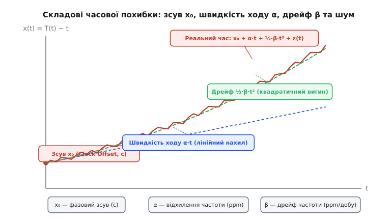
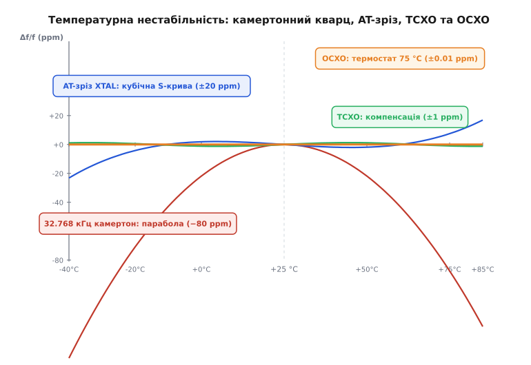
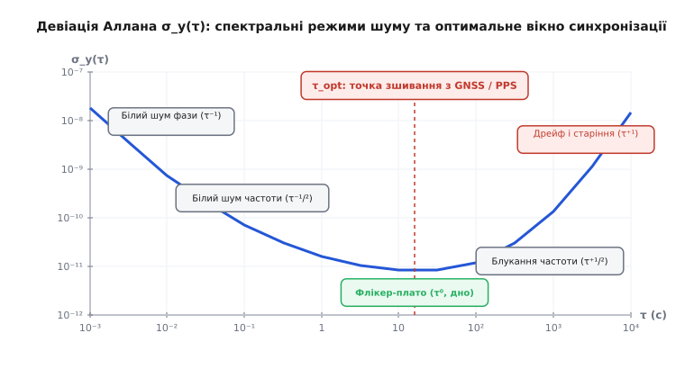
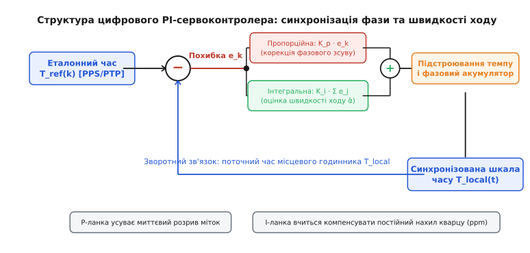

# Дрейф годинників

<preknowlist>
- [Мітки часу](topic:sf-distributed/timestamps) — представлення моментів часу цілими числами та конвертація шкал.
- [PPS-імпульс](topic:hw-sensing/pps-pulse) — апаратний секундний фронт та похибка квантування міток.
- [Кварцовий резонатор](topic:hw-components/quartz-resonator) — фізика п'єзоелектричного коливання та параметри еквівалентної схеми.
- [Точність частоти в ppm](topic:hw-components/frequency-accuracy-ppm) — відносне відхилення частоти в мільйонних частках.
- [Девіація Аллана і стабільність частоти](topic:hw-components/allan-deviation) — різниця між точністю та стабільністю, межі класичної дисперсії.
</preknowlist>

Два бездротові вузли в розподіленій мережі зв'язку увімкнулися в одну мить і виставили свої таймери на нуль. Обидва тактуються стандартними кварцовими резонаторами з паспортною похибкою 20 [ppm](topic:hw-components/frequency-accuracy-ppm) (мільйонних часток). Уже через одну секунду їхні шкали часу розійдуться на 20 мікросекунд — цього достатньо, щоб зірвати синхронне приймання пакетів у протоколі TDMA з таймслотами в кілька мікросекунд. Через одну годину неузгодженість сягне 72 мілісекунд, а за добу становитиме 1.7 секунди. Приймач просто втратить передавача у часовому просторі.

Причина цієї розбіжності полягає в тому, що жоден реальний генератор не видає абсолютно сталу частоту. Час, який вимірює електронна система, є звичайним підрахунком періодів коливань фізичного резонатора. Якщо розмір, температура або пружність кристала зазнають найменших коливань, довжина «метра часу» непомітно змінюється. 

Розкладання похибки годинника на окремі фізичні складові — початковий фазовий зсув, сталу швидкість ходу, динамічний дрейф і стохастичний шум — дозволяє побудувати математичну модель, яка прогнозує розходження та виправляє його програмними й апаратними фільтрами.

## Рівняння шкали часу: зсув, швидкість ходу та дрейф

Позначимо через `t` ідеальний, рівномірно поточний фізичний час (еталонну шкалу, наприклад, UTC чи TAI). Місцевий годинник системи генерує власну шкалу часу `T(t)`. Зв'язок між показами місцевого годинника та ідеальним часом описується класичним поліномом другого порядку з додаванням випадкового шумового процесу:

```
T(t) = T₀ + (1 + α)·t + ½·β·t² + φ(t)
```

де:
- `T₀` — початкове показання годинника в момент `t = 0`;
- `α` — безрозмірне відносне відхилення частоти від номіналу (швидкість ходу, англ. *clock skew* або *fractional frequency offset*);
- `β` — швидкість зміни частоти з часом (дрейф частоти, англ. *frequency drift rate*, вимірюється в `с⁻¹` або `ppm/добу`);
- `φ(t)` — випадкова стохастична флуктуація фази (шум генератора).

На практиці інженерів цікавить не абсолютне значення `T(t)`, а **часова похибка** (англ. *time error* або *clock offset*) `x(t) = T(t) − t`, яка показує, на скільки секунд місцевий годинник поспішає чи відстає від еталону:

```
x(t) = x₀ + α·t + ½·β·t² + ε(t)
```

де `x₀ = T₀` — початковий часовий зсув, а `ε(t) = φ(t)` — шумовий процес часової похибки в секундах.


*Розкладання похибки часу x(t) на фізичні компоненти. Початковий зсув x₀ зміщує криву вертикально; швидкість ходу α задає лінійний нахил розходження; коефіцієнт дрейфу β спричиняє параболічний вигин шкали; випадковий шум ε(t) створює високочастотне тремтіння навколо кривої.*

Розглянемо фізичну сутність і одиниці вимірювання кожної зі складових:

### 1. Часовий зсув (Clock Offset / Time Offset, x₀)

Це миттєва різниця між показами двох годинників у заданий момент часу `t`. Зсув вимірюється в одиницях часу: секундах, мілісекундах (`мс`), мікросекундах (`мкс`) або наносекундах (`нс`). 

Якщо два годинники йдуть з ідеально однаковою швидкістю (`α = 0`, `β = 0`), але один показує `12:00:00.000`, а інший `12:00:00.005`, часовий зсув становить `x₀ = +5 мс`. Ця похибка усувається простим додаванням або відніманням константи.

### 2. Швидкість ходу / похибка частоти (Clock Skew / Fractional Frequency Offset, α)

Швидкість ходу (від грец. *skaios* — косий, кривий) визначає темп лічби годинника відносно еталону. Математично це перша похідна від часової похибки за часом:

```
α = dx(t) / dt = (f_real − f₀) / f₀
```

де `f_real` — фактична тактова частота генератора, а `f₀` — її номінальне паспортне значення.

Оскільки `α` є відношенням частот, це безрозмірна величина. У прецизійній техніці її виражають у частинах на мільйон ([ppm](topic:hw-components/frequency-accuracy-ppm), `1 ppm = 10⁻⁶`) або частинах на мільярд (ppb, `1 ppb = 10⁻⁹`). 

Коли генератор з номіналом 10 МГц видає `10 000 010 Гц`, його похибка частоти дорівнює:

```
α = (10 000 010 − 10 000 000) / 10 000 000 = +10⁻⁶ = +1 ppm
```

При постійному `α = +1 ppm` накопичення часового зсуву відбувається лінійно: за кожну секунду годинник поспішає на 1 мікросекунду, за добу накопичується `86 400 · 1 мкс = 86.4 мс`.

### 3. Дрейф годинника / дрейф частоти (Clock Drift / Frequency Drift Rate, β)

Дрейф (від нід. *drijven* — гнати, плавати) — це швидкість зміни похибки частоти з часом. Це друга похідна від часової похибки за часом (або прискорення розходження шкали часу):

```
β = dα / dt = d²x(t) / dt²
```

Дрейф вимірюється в `с⁻¹`, або в прикладних одиницях `ppm/добу`, `ppb/день`, `ppm/рік`. 

Через наявність члена `½·β·t²` похибка часу зростає **квадратично**. Якщо генератор має дрейф частоти `β = 0.1 ppm/добу`, то навіть якщо в початковий момент його частоту було точно виставлено в нуль (`α = 0`), через 10 діб швидкість ходу зросте до `α(10 діб) = 1 ppm`, а сумарна накопичена часова похибка складе:

```
x(10 діб) = ½ · β · t²
          = ½ · (0.1 · 10⁻⁶ / 86400 с) · (864 000 с)²
          = 43.2 мілісекунди
```

> 🔧 **Навіщо це.** У мережевих протоколах синхронізації (NTP, PTP IEEE 1588) розрізнення понять *Offset* (фазовий зсув) та *Skew/Drift* (відхилення та дрейф частоти) є критичним. Якщо протокол лише періодично переставляє лічильник годинника (*Offset correction*), шкала часу рухається пилкоподібно, постійно розбігаючись між пакетами синхронізації. Якщо ж алгоритм оцінює *Skew* `α` і змінює швидкість апаратного таймера, годинник продовжує йти синхронно навіть за тривалої відсутності мережевих пакетів.

## Фізика резонатора: чому частота не тримається на місці

Щоб зрозуміти походження величин `α`, `β` та `ε(t)`, необхідно зазирнути у фізичні процеси, що відбуваються всередині п'єзоелектричного кристала [кварцового резонатора](topic:hw-components/quartz-resonator) або кремнієвого MEMS-елемента.

Власна резонансна частота механічних коливань пластини кварцу визначається її товщиною `d`, модулем пружності `c_ij` (модулем Юнга або зсуву) та густиною матеріалу `ρ`:

```
f₀ = (1 / (2·d)) · √(c_ij / ρ)
```

Зміна будь-якого з цих трьох параметрів під впливом навколишнього середовища прямо зміщує робочу частоту.

### Еквівалентна електрична схема та чутливість навантаження
В електричному колі кварц описується еквівалентною схемою Баттерворта — Ван Дайка (BVD), яка містить динамічну гілку коливань (індуктивність пластини `L₁`, ємність пружності `C₁`, опір втрат `R₁`) та статичну паралельну ємність електродів `C₀`. 

Частота коливань автогенератора визначається не лише самим кристалом, а й зовнішньою навантажувальною ємністю схеми `C_L` (конденсаторами на платі та ємністю ніжок мікроконтролера):

```
f_osc = f_s · √( 1 + C₁ / (C₀ + C_L) )
```

де `f_s = 1 / (2π · √(L₁·C₁))` — частота послідовного резонансу.

Чутливість частоти до зміни ємності навантаження (англ. *pulling sensitivity*) описується похідною:

```
S_L = (df / f₀) / dC_L = −C₁ / [ 2 · (C₀ + C_L)² ]
```

Це означає, що якщо на платі застосувати дешеві керамічні конденсатори діелектрика Y5V або X7R, ємність яких «пливе» на 10–30 % від тепла, частота кварцу змінюватиметься на десятки ppm незалежно від стабільності самого монокристала. Тому для обв'язки кварцу дозволено використовувати виключно термостабільні конденсатори класу **NP0 / C0G**.

### 1. Температурна нестабільність кристала

Температура є найпотужнішим фактором дестабілізації частоти. Зі зміною температури кристалічна ґратка кварцу зазнає теплового розширення (змінюється товщина `d`), а міжатомні сили змінюють модуль пружності `c_ij`. Залежність частоти від температури принципово різниться для різних типів зрізів кристала.

#### Камертонний годинниковий кварц (32.768 кГц, XY-зріз)
Низькочастотні резонатори для годинників реального часу (RTC) працюють на згинальних коливаннях камертонної структури. Їхня температурна залежність має форму **перевернутої параболи** з вершиною поблизу кімнатної температури:

```
(f(T) − f₀) / f₀ = −k · (T − T₀)²
```

де `T₀ ≈ 25 °C` — температура нульового температурного коефіцієнта (точка перегину), а `k` — параболічний коефіцієнт, що для кварцу становить приблизно `0.035…0.040 ppm/°C²`.


*Температурна залежність відносного відхилення частоти Δf/f. Параболічна характеристика камертонного кварцу 32.768 кГц демонструє глибоке просідання на межах діапазону; кубічна S-крива AT-зрізу забезпечує значно ширшу зону стабільності; термокомпенсовані генератори TCXO та термостатовані OCXO мінімізують температурний вплив.*

Обчислимо похибку камертонного резонатора при відхиленні температури на вуличний холод (`0 °C`) або спеку в закритому корпусі (`+50 °C`):

```
ΔT = 50 °C − 25 °C = 25 °C
Δf / f₀ = −0.035 · (25)² = −0.035 · 625 = −21.875 ppm
```

За температури `50 °C` годинник відставатиме на 22 мікросекунди щосекунди (майже 1.9 секунди на добу). За температури `−20 °C` (`ΔT = 45 °C`):

```
Δf / f₀ = −0.035 · (45)² = −0.035 · 2025 = −70.875 ppm
```

Похибка сягає понад 6 секунд на добу. Знак «мінус» означає, що за будь-якого відхилення від кімнатної температури камертонний кварц завжди сповільнює свій хід.

#### Високочастотний кварц AT-зрізу (1…100 МГц)
Для високочастотних генераторів застосовують пластини, вирізані під кутом приблизно `35°15'` до оптичної осі монокристала кварцу (зріз типу AT). У таких пластинах реалізуються коливання зсуву по товщині. Завдяки компенсації змін пружності різними компонентами тензора пружності, температурна характеристика описується **кубічним поліномом** (S-подібна крива):

```
(f(T) − f₀) / f₀ = a₁·(T − T₀) + a₂·(T − T₀)² + a₃·(T − T₀)³
```

Підбором точного кута зрізу при виробництві лінійний коефіцієнт `a₁` зводять майже до нуля. Це створює широку смугу слабкої температурної чутливості поблизу кімнатної температури: похибка не перевищує `±10…20 ppm` у всьому промисловому діапазоні від `−40 °C` до `+85 °C`.

#### Подвійний поворотний SC-зріз (Stress-Compensated Cut)
Для найвимогливіших застосувань (термостатовані генератори OCXO) використовують подвійний зріз **SC** (кути орієнтації `φ ≈ 21°57'`, `θ ≈ 34°11'`). Завдяки подвійній геометрії зріз має дві унікальні фізичні переваги:
1. **Відсутність динамічного теплового удару (Thermal Transient Immunity).** При раптовій зміні температури градієнт тепла всередині пластини створює механічні напруження. У кварцах AT-зрізу це викликає різкий сплеск частоти `df/dt`. В SC-зрізі тензор механічних напружень компенсує цей ефект, дозволяючи генератору залишатися стабільним навіть при швидкому прогріві.
2. **Знижена чутливість до вібрацій.** SC-зріз має чутливість до прискорення в 5–10 разів нижчу за AT-зріз (близько `0.2…0.5 ppb/g`).

#### Кремнієві MEMS-генератори
Монокристалічний кремній має власний лінійний температурний коефіцієнт частоти близько `−30 ppm/°C` (у 30 разів гірше за некомпенсований кварц). Тому в кожен кремнієвий MEMS-генератор обов'язково інтегрують надточний цифровий термометр і схему ФАПЧ з дробовим коефіцієнтом ділення, яка на льоту перераховує та виправляє частоту, знижуючи сумарну похибку до `±1…5 ppm`.

### 2. Ієрархія стабільності: XTAL, TCXO, OCXO

Для подолання температурного дрейфу розроблено три конструктивні рівні генераторів:

1. **XTAL (Simple Crystal Oscillator)** — звичайний некомпенсований резонатор. Стабільність: `10…50 ppm`. Не споживає додаткової енергії, дешевий.
2. **TCXO (Temperature-Compensated Crystal Oscillator)** — термокомпенсований генератор. Містить внутрішній аналоговий або цифровий термодавач і варикап (електронно керовану ємність). При зміні температури варикап змінює навантажувальну ємність контуру, зсуваючи частоту у протилежний бік. Стабільність: `0.1…2 ppm`.
3. **OCXO (Oven-Controlled Crystal Oscillator)** — термостатований генератор. Кристал кварцу (часто SC-зрізу) разом зі схемою автогенератора розміщують у мініатюрній термокамері, розігрітій до фіксованої температури (зазвичай `+75…+85 °C`), де похідна `df/dT = 0`. Стабільність: `0.001…0.05 ppm` (`1…50 ppb`). Недолік — високе енергоспоживання (1–3 Вт на нагрів) і тривалий час виходу на робочий режим (кілька хвилин).

## Старіння та зовнішні збурення: логарифмічний дрейф

Навіть якщо температура підтримується строго постійною, частота генератора безперервно змінюється з плином часу. Цей довготривалий систематичний процес називається **старінням** (англ. *aging*).

### Механізми старіння кристала:
1. **Релаксація механічних напружень.** При механічній фіксації кварцової пластинки в тримачах корпусу та під дією паяння виникають мікронапруження кристалічної ґратки, які повільно спадають протягом місяців.
2. **Масоперенос (десорбція та адсорбція).** Молекули залишкових газів у вакуумному корпусі резонатора осідають на металевих електродах (золотому чи срібному напиленні), або, навпаки, молекули матеріалу електродів випаровуються. Додавання шару товщиною лише в один атом змінює масу пластини, зміщуючи частоту на одиниці ppm.
3. **Міграція дефектів ґратки.** Домішкові іони в структурі кварцу повільно дифундують під дією постійного електричного поля коливань.

Старіння має яскраво виражений затухаючий характер і описується **логарифмічною моделлю**:

```
(Δf(t) / f₀)_aging = A · ln(B·t + 1)
```

де `A` і `B` — константи резонатора, а `t` — час експлуатації.

Найшвидше зміщення частоти відбувається в перші 30–90 діб після виготовлення або паяння на плату (типово `1…3 ppm/місяць` для звичайних кристалів). Через рік експлуатації швидкість старіння знижується до сталих `0.5…1 ppm/рік`.

```
Типовий бюджет старіння кварцу AT-зрізу:
- Перші 30 діб:   ±1.5 ppm
- Перший рік:      ±3.0 ppm
- Кожен наступний: ±1.0 ppm/рік
```

### Додаткові дестабілізуючі фактори:
- **Чутливість до прискорення та вібрацій (g-sensitivity).** Прискорення деформує кристал, змінюючи його пружність. Типова чутливість становить `1…2 ppb/g`. У дронах і ракетах вібрація двигунів перетворюється на широкосмуговий фазовий шум.
- **Зсув живлення (Pulling / Supply sensitivity).** Зміна напруги живлення мікросхеми генератора змінює вхідні та вихідні ємності інвертора, зсуваючи резонанс на `0.1…1 ppm/В`.
- **Магнітні поля та іонізуюче випромінювання.** У космічних апаратах потік високоенергетичних протонів і гамма-квантів створює центри забарвлення у кварці, що викликає стрибкоподібні зсуви частоти до десятків ppb.

## Шумові процеси та девіація Аллана

Окрім передбачуваних детермінованих змін (температура, старіння), частота генератора зазнає неперервних випадкових флуктуацій.

Якщо виміряти частоту генератора послідовно багато разів і спробувати обчислити класичне середньоквадратичне відхилення, виникає фундаментальна математична проблема: зі збільшенням кількості спостережень класична дисперсія не сходиться до сталого числа, а безперервно зростає. 

Причина полягає в наявності низькочастотних шумових процесів: флікер-шуму (`1/f`) та випадкового блукання частоти (інтегрування шуму). Їхня спектральна густина потужності `S_y(f)` описується степеневим рядом:

```
S_y(f) = h₋₂·f⁻² + h₋₁·f⁻¹ + h₀ + h₁·f + h₂·f²
```

де:
- `h₂·f²` — білий шум фази (WPM, тепловий шум підсилювача);
- `h₁·f` — флікер-шум фази (FPM, шум напівпровідникових переходів);
- `h₀` — білий шум частоти (WFM, фундаментальний тепловий шум у кварці);
- `h₋₁·f⁻¹` — флікер-шум частоти (FFM, плато нестабільності);
- `h₋₂·f⁻²` — випадкове блукання частоти (RWFM, повільні температурні мікрофлуктуації).

Для коректного кількісного опису нестабільності в часовій області застосовують **девіацію Аллана** `σ_y(τ)` (квадратний корінь із двовибіркової дисперсії Аллана), яка обчислює різницю між двома сусідніми вибірками частоти, усередненими за інтервал `τ`:

```
σ_y²(τ) = ½ · E[ (ȳₖ₊₁ − ȳₖ)² ]
```


*Характерна крива девіації Аллана σ_y(τ) для високоякісного кварцового генератора. На малих інтервалах τ переважає високочастотний вимірювальний шум (спадання кривої); у зоні τ = 10…100 с досягається дно стабільності (флікер-плато); на великих τ починають домінувати повільний дрейф і температурні коливання.*

Залежність `σ_y(τ)` на подвійній логарифмічній шкалі має характерну U-подібну форму:
1. **Зона спадання (`τ < 1…10 с`):** Нахил `τ⁻¹` або `τ⁻¹/²`. Збільшення часу усереднення фільтрує швидкий шум вимірювань і тепловий білий шум.
2. **Дно стабільності / флікер-плато (`τ = 10…100 с`):** Нахил `τ⁰`. Найвища можлива стабільність генератора (для якісного кварцу `σ_y ≈ 10⁻¹¹…10⁻¹²`).
3. **Зона розходження (`τ > 100…1000 с`):** Нахил `τ⁺¹/²` (випадкове блукання) та `τ⁺¹` (лінійний дрейф і температурні добові коливання). Зі збільшенням вікна генератор втрачає пам'ять про свою частоту.

Повний математичний вивід інтегрального зв'язку між спектральною густиною `S_y(f)` та девіацією Аллана `σ_y(τ)` для всіх п'яти типів шуму наведено у вставці [🧮 математичне виведення девіації Аллана](topic:sf-distributed/clock-offset-drift/math-allan-variance.md).

Точка мінімуму `τ_opt` на кривій Аллана має фундаментальне практичне значення: вона визначає оптимальну смугу зрізу для систем зовнішньої синхронізації.

## Мережева синхронізація та асиметрія затримок

У розподілених мережах зв'язку вимірювання часового зсуву виконується шляхом двостороннього обміну повідомленнями з мітками часу (протоколи NTP та PTP IEEE 1588):

```
Майстер ──────(t₁)────────────────────────────(t₄)──►
                  \                          /
                   \  t_fwd                 /  t_rev
                    ▼                      /
Підлеглий ───────────(t₂)────────────(t₃)─/──────────►
```

Майстер відправляє повідомлення у момент `t₁` (за своїм годинником), підлеглий приймає його в момент `t₂` (за своїм). Потім підлеглий відправляє відповідь у момент `t₃`, майстер приймає її в `t₄`.

Якщо вважати, що час поширення пакету в прямому напрямку `t_fwd` та зворотному `t_rev` однаковий (`t_fwd = t_rev = D`), то фазовий зсув `θ` та затримка `D` обчислюються як:

```
θ = [ (t₂ − t₁) − (t₄ − t₃) ] / 2
D = [ (t₂ − t₁) + (t₄ − t₃) ] / 2
```

### Пастка асиметрії каналу (Path Asymmetry)
Якщо пряма і зворотна затримки не рівні (`t_fwd ≠ t_rev`, наприклад, через різну довжину оптоволоконних ліній чи черги в комутаторах), виникає асиметрія `Δ_asym = t_fwd − t_rev`. 

Істинний зсув становить:

```
θ_true = θ_measured − ½ · Δ_asym
```

Асиметрія затримки всього на 1 мікросекунду створює нездоланну системну похибку оцінки часу в 500 наносекунд, яку жоден алгоритм фільтрації не здатен відрізнити від справжнього фазового зсуву годинника.

### Апаратне штемпелювання (Hardware Timestamping)
Для усунення джиттеру операційної системи (який сягає десятків мікросекунд через черги мережевих стеків та планувальник задач ОС) стандарт IEEE 1588 вимагає апаратного штемпелювання міток часу на рівні фізичного рівня PHY або MAC-контролера. Мережевий контролер захоплює час у момент проходження стартового розділювача кадру (SFD) безпосередньо через інтерфейс MII/GMII, знижуючи похибку вимірювання затримки до одиниць наносекунд.

## Цифрові алгоритми компенсації зсуву та дрейфу

Щоб утримувати точний час у цифровій системі, необхідне періодичне звіряння місцевого годинника з зовнішнім джерелом еталонного часу (наприклад, імпульсом [PPS-імпульс](topic:hw-sensing/pps-pulse) від супутникового GNSS-приймача чи пакетами PTP/NTP).

Отримавши черговий вимір похибки `e_k = T_ref(t_k) − T_local(t_k)`, система повинна оновити стан свого годинника.

### Стрибок проти плавного підстроювання (Step vs Slew)

Найгрубіший метод — просто перезаписати лічильник часу: `T_local = T_ref`. Це називається **кроком часу** (*time step*).

Чому кроки часу заборонені в робочому режимі:
- Якщо годинник поспішав, крок назад створює від'ємні різниці часу `Δt = t₂ − t₁ < 0`. Це ламає операційні системи, тайм-аути сокетів, монотонні таймери в ядрі та бази даних.
- Виникає нескінченна похідна швидкості зміни часу, що дестабілізує замкнені контури автоматичного керування.

Тому кроки часу дозволені лише один раз — при холодному старті системи. Надалі застосовують виключно **плавне підстроювання темпу** (*slewing*): частоту ходу програмного годинника тимчасово прискорюють або сповільнюють на малу величину (зазвичай не більше `±500 ppm`), поки фазовий розрив плавно не зійде нанівець.

### Пропорційно-інтегральний сервоконтролер годинника (PI Clock Servo)

Стандартом для синхронізації годинників (зокрема в утилітах `ptp4l`, `chrony`, `ntpd`) є замкнена цифрова петля фазового автопідстроювання частоти (DPLL) на базі PI-регулятора.


*Схема цифрового PI-сервоконтролера. Пропорційна ланка генерує короткочасне прискорення для усунення фазового розриву, а інтегральна ланка обчислює точну постійну поправку до частоти місцевого кварцу.*

Рівняння керування в дискретні моменти надходження імпульсів синхронізації (раз на секунду при 1PPS):

```
1. Вимірювання фазової похибки:
   e_k = T_ref(k) − T_local(k)

2. Пропорційна корекція (усунення фазового зсуву):
   u_p(k) = K_p · e_k

3. Інтегральна корекція (накопичення оцінки дрейфу частоти α̂):
   u_i(k) = u_i(k − 1) + K_i · e_k · Δt

4. Сумарна корекція швидкості ходу:
   α_corr(k) = u_p(k) + u_i(k)
```

Детальна програмна реалізація такого сервоконтролера з фіксованою комою, захистом від переповнення та анти-віндапом інтегратора наведена у практичній вставці [⚙️ цифровий PI-сервоконтролер](topic:sf-distributed/clock-offset-drift/proj-clock-servo.md).

### Оцінка стану через фільтр Калмана

Коли вхідні мітки часу мають високий рівень джиттеру (наприклад, при синхронізації через бездротовий зв'язок або завантажену Ethernet-мережу), або коли температура змінюється динамічно, застосовують оптимальну лінійну фільтрацію Калмана.

Вектор стану годинника об'єднує фазовий зсув, швидкість ходу та прискорення (дрейф):

```
x_k = [ x(t_k) ]   — часовий зсув (с)
      [ α(t_k) ]   — відносна похибка частоти (безрозмірна)
      [ β(t_k) ]   — дрейф частоти (с⁻¹)
```

Неперервна динаміка системи описується диференціальним рівнянням `dx/dt = A·x + w(t)`:

```
    [ 0  1  0 ]
A = [ 0  0  1 ]
    [ 0  0  0 ]
```

Дискретна матриця переходу стану на інтервалі `Δt`:

```
       [ 1   Δt   ½·Δt² ]
F(Δt) = [ 0    1    Δt   ]
       [ 0    0     1   ]
```

Матриця коваріації шуму процесу `Q(Δt)` виводиться безпосередньо з коефіцієнтів шуму девіації Аллана:

```
Q(Δt) = ∫₀^(Δt) F(s) · Q_c · F^T(s) ds
```

де `Q_c = diag(q_phase, q_freq, q_drift)`. Значення `q_phase` відповідає білому шуму фази `h₂`, `q_freq` — білому шуму частоти `h₀`, а `q_drift` — випадковому блуканню частоти `h₋₂`.

Фільтр Калмана автоматично зважує довіру між вимірюванням фази (яке зашумлене на коротких масштабах) та прогнозом моделі кварцу (яка точна на коротких масштабах, але дрейфує на довгих), забезпечуючи математично мінімальну дисперсію помилки відновленої шкали часу.

## Бюджет автономності (Holdover)

У критично важливих системах (базові станції стільникового зв'язку 5G, радари, авіоніка) синхронізація з GNSS може періодично зникати через глушіння сигналу, затінення антени або аварії зв'язку. Період роботи годинника на власній стабільності без зовнішньої корекції називається **режимом утримання** (англ. *Holdover*).

Максимальна часова похибка `x_max`, що набігає за час автономності `t_hold`, визначається залишковими похибками оцінки стану:

```
x(t_hold) = x_res + α_res · t_hold + ½ · β · t_hold² + σ_temp(t_hold) + ε_noise(t_hold)
```

де:
- `x_res` — залишкова похибка фази в момент зникнення сигналу (типово 5–20 нс при PPS);
- `α_res` — залишкове нескомпенсоване зміщення швидкості ходу після відключення сервопетлі (залежить від шуму оцінки інтегратора);
- `β` — швидкість старіння кристала;
- `σ_temp` — зміщення частоти через зміну температури навколишнього середовища за час утримання.

| Клас генератора | Типова стабільність (ppm) | Дрейф за добу (Holdover 24 год) | Максимальний час утримання для похибки < 1.5 мкс (LTE/5G) |
|:---|:---:|:---:|:---:|
| Звичайний кварц (XTAL) | ±25 ppm | ~2.1 секунди | < 0.06 секунди |
| Гарний TCXO | ±0.5 ppm | ~43 мілісекунди | ~3 секунди |
| Прецизійний TCXO | ±0.1 ppm | ~8.6 мілісекунди | ~15 секунд |
| Компактний OCXO | ±0.01 ppm (10 ppb) | ~860 мікросекунд | ~2.5 хвилини |
| Високостабільний OCXO (SC-cut) | ±0.0005 ppm (0.5 ppb) | ~43 мікросекунди | ~50 хвилин |
| Рубідієвий атомний стандарт (Rb) | ±0.00005 ppm (0.05 ppb)| ~4.3 мікросекунди | ~8–12 годин |

Розрахунок показує, що для стільникових мереж 5G TDD, де розсинхронізація базових станцій не повинна перевищувати `±1.5 мкс` для запобігання міжстільниковій інтерференції, звичайний кварц не витримує навіть частки секунди аварії GNSS, тоді як прецизійний OCXO або рубідієвий стандарт забезпечують безперебійну роботу базової станції від десятків хвилин до кількох діб.

## Інженерний висновок

Вимірювання та збереження шкали часу в цифровій системі — це завжди компроміс між короткочасною стабільністю резонатора та довготривалою точністю зовнішнього еталону. 

Жоден кварц не здатен утримати час самостійно: його температурна парабола, старіння кристалічної ґратки та флікер-шум неминуче розмивають часові рамки. Водночас жоден зовнішній канал синхронізації (GNSS чи мережевий протокол) не дає безшумного сигналу в кожну мить через джиттер пакетів і квантування лічильників.

Поєднання фізично стабільного осцилятора (TCXO/OCXO) з адаптивним цифровим сервоконтролером або фільтром Калмана дозволяє взяти найкраще від обох світів: короткочасну плавність і тишу кварцу на малих інтервалах `τ` та абсолютну незмінність світового часу на великих масштабах.
