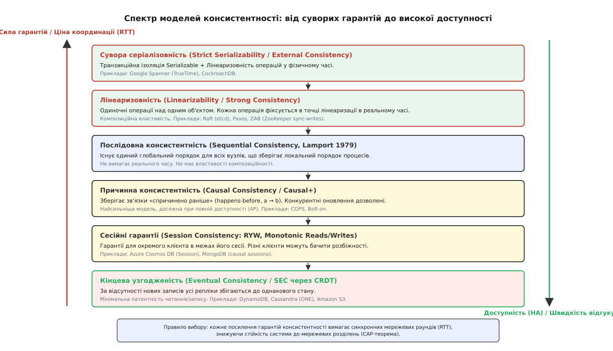
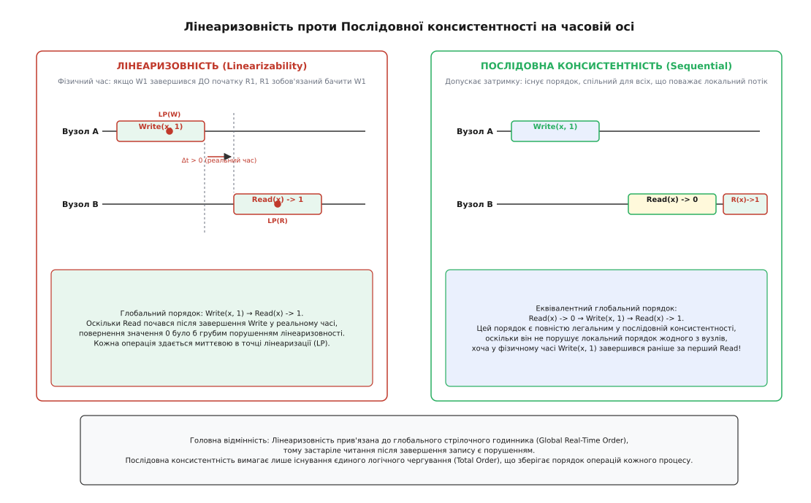
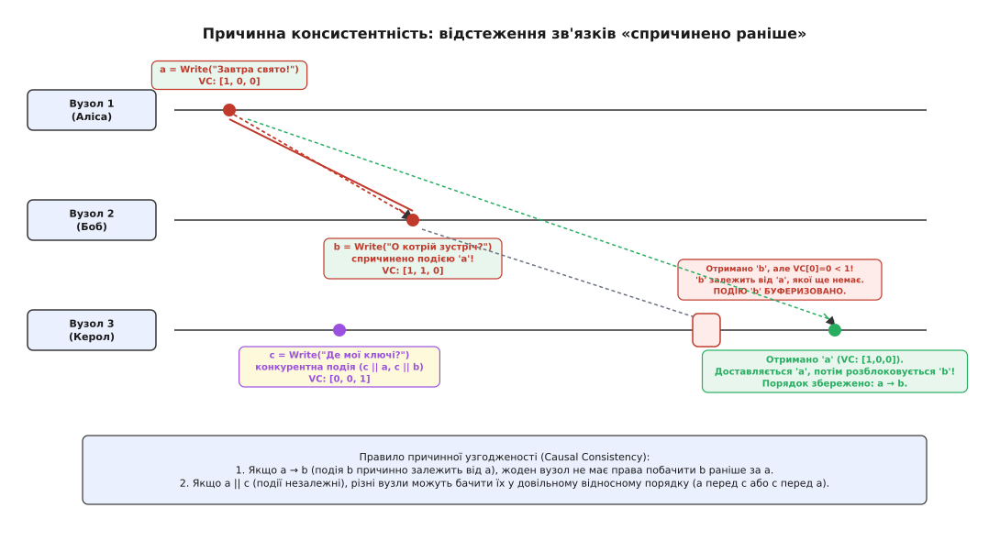
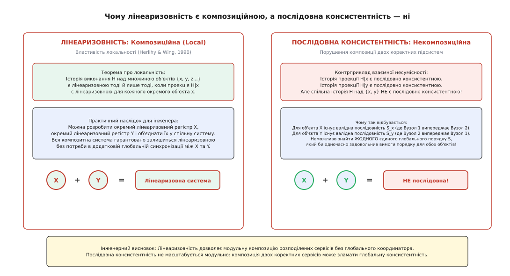

# Спектр консистентності

<preknowlist>
- [Лідер-фоловерна реплікація](root:sf-distributed/replication-leader-follower) — архітектура з одним активним вузлом для записів та асинхронним поширенням журналу на підлеглі репліки.
- [Реплікаційний лаг і сесійні гарантії](root:sf-distributed/replication-lag) — природа відставання реплік та аномалії порушення монотонності читання й запису.
- [Кворуми та безлідерна реплікація](root:sf-distributed/quorum-and-leaderless) — баланс параметрів читання і запису (R, W, N) для забезпечення перетину множин вузлів.
- [Теорема CAP та модель PACELC](root:sf-distributed/cap-theorem) — фундаментальний компроміс між консистентністю, доступністю та мережевими затримками.
- [Омани розподілених обчислень](root:sf-distributed/distributed-fallacies) — фізична природа мережевих затримок, втрати пакетів і відсутності спільної пам'яті.
</preknowlist>

Розподілена система обробки замовлень інтернет-магазину розгорнута у трьох дата-центрах: Франкфурт, Ашберн та Токіо. На складі залишився рівно один екземпляр товару (`item_count = 1`). О 14:00:00.000 клієнт у Франкфурті натискає кнопку купівлі, сервер успішно списує залишок (`item_count = 0`) і повертає покупцеві статус підтвердження оплати `200 OK`.

Рівно через 50 мілісекунд, о 14:00:00.050, покупець у Токіо відкриває сторінку того самого товару. Запит читання потрапляє на локальний сервер у Токіо і повертає значення `item_count = 1`. Покупець у Токіо натискає «Купити», система приймає друге замовлення й списує залишок у від'ємне значення `item_count = -1`. Стався оверсел (подвійний продаж), склад не може відвантажити замовлення, а бізнес зазнає фінансових і репутаційних збитків.

Причина катастрофи полягає не в багу програмного коду і не в апаратній поломці серверів. Вона криється у фундаментальному законі фізики: світловий сигнал в оптичному волокні поширюється зі швидкістю приблизно `200 000 км/с` (близько 5 мікросекунд на кілометр), а з урахуванням вигинів оптоволокна, затримок комутації та повторювачів долає відстань між Франкфуртом і Токіо приблизно за 90 мілісекунд (час повного мережевого раунду RTT сягає 180 мс). Запис, успішно зафіксований у Європі, фізично не встиг досягти Азії до моменту виконання операції читання.

Щоб проєктувати системи, які не припускаються таких помилок, інженери використовують **моделі консистентності** (англ. *consistency models*, від лат. *consistere* — «стояти разом, бути стійким»).

## Що таке модель консистентності: семантичний контракт

У системі з одним процесором та однією мікросхемою оперативної пам'яті інтуїція програміста працює бездоганно: кожна операція читання `read(x)` завжди повертає значення, записане найостаннішою за фізичним часом операцією `write(x, v)`. Пам'ять поводиться як єдине абсолютне джерело правди.

У розподіленій системі дані дублюються на багатьох вузлах для захисту від аварій і наближення до користувачів. Оскільки між вузлами відсутня спільна фізична пам'ять, а мережеві повідомлення зазнають непередбачуваних затримок, концепція «останнього запису» втрачає однозначність. Навіть системні годинники на серверах постійно розходяться через похибки кварцових резонаторів і мережевий джиттер протоколу NTP (англ. *Network Time Protocol*), що робить неможливим встановлення абсолютного порядку подій лише за настінним часом.

**Модель консистентності** — це формальний контракт між розподіленим сховищем даних і програмою-клієнтом, який визначає:
1. Які значення дозволено повертати операціям читання в умовах конкурентних записів, реплікаційного відставання та мережевих затримок.
2. Який глобальний порядок видимості змін спостерігатимуть різні вузли системи.
3. Яку ціну в термінах затримки (латентності) та доступності під час збоїв змушена платити система за надання цих гарантій.

Модель консистентності не є властивістю мережі чи апаратного забезпечення — це суто **програмно-архітектурна угода**. Якщо застосунок задовольняє правила взаємодії зі сховищем, сховище математично гарантує коректність стану даних у межах обраної моделі.

Детальний аналіз історичного шляху від ранніх спроб узгодження кешів процесорів до сучасних георозподілених баз даних викладено у вставці [еволюція моделей консистентності від пам'яті процесорів до глобальних баз даних](root:sf-distributed/consistency-models/hist-consistency-evolution.md).

## Спектр моделей: від строгих гарантій до високої доступності

Моделі консистентності не є бінарним вибором між «дані правильні» та «дані зламані». Вони утворюють неперервний спектр (ієрархію або ґратку порядків), де кожна сходинка вгору посилює гарантії для програміста, але вимагає більшої синхронної координації між вузлами.


*Ієрархія моделей консистентності від суворої серіалізовності до кінцевої узгодженості: баланс між силою гарантій для програміста та ціною затримки й координації.*

Розглянемо ключові рівні цього спектру в порядку послаблення гарантій.

### 1. Сувора серіалізовність (Strict Serializability / External Consistency)

Сувора серіалізовність є абсолютною вершиною гарантій у комп'ютерних науках. Вона об'єднує два ортогональні виміри:
- **Транзакційну серіалізовність (Serializability):** множина операцій у межах транзакцій виконується атомарно й ізольовано, так ніби всі транзакції виконувалися суворо по черзі без перекриття.
- **Лінеаризовність у фізичному часі (Real-time Linearizability):** якщо транзакція `T₁` успішно зафіксувалася у фізичному часі до того, як транзакція `T₂` розпочалася, то результат транзакції `T₂` зобов'язаний бачити зміни, зроблені `T₁`.

У системі із суворою серіалізовністю повністю виключені будь-які часові парадокси: програміст може мислити про глобальну базу даних точно так само, як про роботу одного потоку на одному комп'ютері.

- **Ціна:** екстремально висока координація. Потребує або двофазного фіксування (2PC) у поєднанні з протоколами консенсусу (Paxos/Raft), або спеціального апаратного синхронізування часу (як TrueTime у Google Spanner з інтервалом commit-wait).
- **Приклади систем:** Google Spanner, CockroachDB, YugabyteDB.

### 2. Лінеаризовність (Linearizability / Strong Consistency / Atomic Consistency)

Сформульована Морісом Герлігі та Дженнетт Вінг у 1990 році, лінеаризовність застосовується до **одиночних операцій над окремими об'єктами** (наприклад, читання або запис окремого ключа/регістра).

Лінеаризовність базується на двох аксіомах:
1. **Точка лінеаризації (Linearization Point):** кожна операція, що має ненульову тривалість у фізичному часі (від моменту відправлення запиту `inv` до моменту отримання відповіді `res`), повинна здаватися такою, що виконується миттєво в деякій точці часу між `inv` і `res`.
2. **Збереження порядку реального часу:** якщо операція `op₁` завершилася у фізичному часі раніше, ніж розпочалася операція `op₂` (`res(op₁) < inv(op₂)`), то `op₁` зобов'язана передувати `op₂` у глобальному порядку.

Як тільки запис значення завершено і клієнт отримав підтвердження, будь-який наступний запит читання від будь-якого клієнта на будь-якому вузлі зобов'язаний повернути це значення або ще новіший запис.

- **Ціна:** неможливість збереження доступності під час мережевих розділень (клас CP у теоремі CAP). Будь-який запис вимагає опитування більшості кворуму або проходження крізь журнал лідера консенсусу.
- **Приклади систем:** etcd, Consul, Apache ZooKeeper (для операцій запису), черги Apache Kafka (у режимі конфігурації `min.insync.replicas`).

### 3. Послідовна консистентність (Sequential Consistency)

Сформульована Леслі Лампортом у 1979 році для багатопроцесорної спільної пам'яті.

Послідовна консистентність вимагає виконання двох умов:
1. Результат виконання системи має бути таким, ніби всі операції всіх вузлів були виконані в деякому **єдиному глобальному послідовному порядку (Total Order)**.
2. Операції кожного окремого процесу входять у цей загальний порядок у тій послідовності, в якій вони були ініційовані його локальною програмою (Program Order).

Ключова відмінність від лінеаризовності: **послідовна консистентність не прив'язана до фізичного стрілочного годинника**. Вона дозволяє системі відставати від реального часу, якщо всі вузли погоджуються на однакове логічне перевпорядкування подій.


*Часова діаграма виконання операцій: при лінеаризовності операції впорядковуються за точками лінеаризації в реальному часі, тоді як послідовна консистентність допускає затримку спостереження за умови збереження глобального порядку.*

У правій частині діаграми Вузол A завершив `Write(x, 1)`, після чого у фізичному часі Вузол B виконав `Read(x)` і отримав старе значення `0`. Для лінеаризовності це є грубим порушенням. Але для послідовної консистентності це цілком коректно: існує глобальний порядок `Read(x)->0  →  Write(x,1)  →  Read(x)->1`, який однаково бачать усі процеси й який не порушує локальний потік жодного вузла.

### 4. Причинна консистентність (Causal Consistency / Causal+)

Причинна консистентність послаблює вимогу єдиного глобального порядку для всіх операцій. Вона розділяє події на дві категорії:
- **Причинно залежні події (`a → b`):** операції, пов'язані відношенням «спричинено раніше» (happens-before) Лампорта. Наприклад, якщо користувач зчитав запис `A` і на його основі опублікував коментар `B`, то `A → B`. Усі вузли системи зобов'язані бачити `A` раніше за `B`.
- **Конкурентні події (`a || b`):** операції, між якими немає причинного зв'язку (наприклад, два незалежні користувачі одночасно пишуть пости в різні теми). Різні вузли системи мають повне право спостерігати конкурентні операції в **різному відносному порядку**.


*Причинна узгодженість: операції із причинним зв'язком бачаться всіма вузлами в однаковому порядку, тоді як незалежні (конкурентні) оновлення можуть спостерігатися в довільному порядку.*

Причинна консистентність із конвергенцією (**Causal+**) додає детерміністичне правило вирішення конкурентних конфліктів (наприклад, CRDT або порівняння міток часу), що гарантує: після припинення нових записів усі репліки збігаються до ідентичного стану.

Математичне виведення та строгі формальні критерії розбиття історій на причинні підпорядки наведено у вставці [формальний математичний апарат історій виконання та доведення композиційності](root:sf-distributed/consistency-models/math-execution-histories.md).

### 5. Консистентність процесора та PRAM (Pipelined RAM)

У моделі PRAM (Lipton & Sandberg, 1988) кожен процес розглядається як незалежний конвеєр:
- Усі операції запису, виконані процесом `P₁`, спостерігаються всіма іншими процесами строго в порядку їхнього відправлення (`FIFO`).
- Однак записи від різних процесів `P₁` та `P₂` можуть спостерігатися різними вузлами в різному порядку.

PRAM запобігає перевпорядкуванню повідомлень одного клієнта, але не гарантує узгодження порядку між різними клієнтами.

### 6. Сесійні моделі консистентності (Session Guarantees)

Запропоновані дослідниками проєкту Bayou (Xerox PARC) у 1994 році для систем, де клієнт взаємодіє з різними репліками через балансувальник навантаження. Гарантії ізолюються в межах індивідуальної сесії клієнта:
- **Read-Your-Writes (RYW):** клієнт завжди бачить результати власних попередніх операцій запису.
- **Monotonic Reads:** клієнт ніколи не спостерігає відкату часу назад (якщо зчитано версію `v₂`, наступні читання ніколи не повернуть `v₁ < v₂`).
- **Monotonic Writes:** записи клієнта застосовуються всіма репліками строго в порядку їх створення.
- **Writes-Follow-Reads (Causal Writes):** записи, створені клієнтом після виконання читання версії `v`, застосовуються всіма вузлами лише після застосування версії `v`.

Сесійні гарантії є де-факто промисловим стандартом для користувацьких вебсервісів і мобільних застосунків, де глобальна лінеаризовність коштує занадто дорого.

### 7. Кінцева узгодженість (Eventual Consistency) та SEC

Кінцева узгодженість — найслабша модель у спектрі. Вона гарантує лише одну умову: **якщо нові оновлення перестануть надходити, через скінченний проміжок часу всі репліки прийдуть до однакового стану**.

Під час активного потоку записів клієнти можуть бачити застарілі дані, пропуски змін та перевпорядкування повідомлень.

Підвид — **строга кінцева узгодженість (Strong Eventual Consistency / SEC)**: репліки, що отримали однакову множину оновлень (незалежно від черговості доставки пакетів через мережу), негайно переходять в абсолютно однаковий стан без потреби в додатковій координації чи обміні блокуваннями. Цей механізм реалізується за допомогою конфліктно-вільних реплікованих типів даних (**CRDT** — *Conflict-free Replicated Data Types*).

## Анатомія реплікаційних аномалій: чому слабкі моделі ламають бізнес

Щоб усвідомити практичну ціну вибору слабких моделей консистентності, розглянемо чотири фундаментальні аномалії, які виникають у реальних розподілених системах за відсутності належних гарантій:

1. **Втрачене оновлення (Lost Update) в Eventual Consistency:**
   Два сервіси майже одночасно змінюють профіль користувача на різних репліках без блокувань. Перший сервіс додає новий номер телефону, а другий оновлює поштову адресу. Якщо система розв'язує конфлікт за правилом Last-Write-Wins (LWW) за часовими мітками, запис з пізнішим фізичним годинником повністю перезапише весь об'єкт, безповоротно знищивши зміну першого сервісу.
2. **Перекіс запису (Write Skew) при Snapshot Isolation без лінеаризовності:**
   У медичній системі діє бізнес-правило: «На чергуванні в лікарні повинен залишатися щонайменше один лікар». На чергуванні перебувають лікарі Аліса та Боб (`on_call_count = 2`).
   Аліса та Боб одночасно подають запит на зняття з чергування через різні репліки.
   - Транзакція Аліси зчитує `on_call_count = 2`, бачить, що умова виконується, і знімає Алісу з чергування.
   - Транзакція Боба паралельно зчитує `on_call_count = 2`, бачить, що умова виконується, і знімає Боба з чергування.
   Обидві транзакції успішно фіксуються, оскільки вони модифікували різні рядки бази даних. У результаті на чергуванні залишається нуль лікарів (`on_call_count = 0`). Рівень ізоляції Snapshot Isolation допустив перекіс запису. Запобігти цьому дозволяє лише сувора серіалізовність (Strict Serializability), яка примушує транзакції до лінеаризованого порядку.
3. **Інверсія причинності (Causality Inversion) у безлідерних кластерах:**
   Клієнт завантажує фотографію (Подія A) і публікує коментар із посиланням на ідентифікатор цієї фотографії (Подія B). Через асиметрію мережевих маршрутів репліка 3 отримує подію B раніше за подію A. Користувачі, що підключені до репліки 3, бачать коментар із битим посиланням на неіснуюче зображення.
4. **Брудне читання під час зміни лідера (Stale Leader Read Anomaly):**
   Вузол-лідер кластера втрачає зв'язок з більшістю реплік через мережевий збій (розщеплення мережі). Більшість обирає нового лідера й продовжує приймати записи. Старий лідер, не знаючи про вибори, продовжує локально відповідати на операції читання клієнтів, віддаючи застарілий стан, що вже ніколи не стане правдою.

## Дві ортогональні осі: Serializability проти Linearizability

Одне з найпоширеніших джерел плутанини в розподілених системах — змішування понять «серіалізовність» (Serializability) та «лінеаризовність» (Linearizability).

Хоча обидва терміни означають «все відбувається так, ніби воно послідовне», вони описують принципово різні виміри системи:

| Критерій | Серіалізовність (Serializability) | Лінеаризовність (Linearizability) |
| :--- | :--- | :--- |
| **Предмет гарантії** | **Транзакції** (групи операцій над багатьма об'єктами) | **Окремі операції** (читання/запис одного регістра) |
| **Категорія** | Ізоляція транзакцій у базах даних (ACID / ANSI SQL) | Консистентність пам'яті в розподілених системах |
| **Фізичний час** | **Не прив'язана** до фізичного часу | **Строго прив'язана** до фізичного часу |
| **Суть контракту** | Існує деякий послідовний порядок виконання транзакцій | Кожна операція фіксується в точці лінеаризації в реальному часі |

### Чому серіалізовність без лінеаризовності обманює

Уявімо історію виконання двох транзакцій у реляційній базі даних, налаштованій на рівень ізоляції `Serializable`:
- О 10:00:00 Транзакція `T₁` записує ціну акції `Price = 100` і фіксується.
- О 12:00:00 (через дві години) Транзакція `T₂` читає ціну акції і отримує `Price = 50` (стан дводенної давнини).

Ця історія є **на 100% серіалізовною**, оскільки існує еквівалентний послідовний порядок транзакцій `T₂ → T₁`. Серіалізовність гарантує відсутність аномалій перекриття транзакцій (як-от брудне читання чи фантомні рядки), але вона не вимагає, щоб порядок виконання відповідав фізичному годиннику на стіні.

Щоб заборонити перенесення транзакцій у минуле відносно реального часу, потрібна комбінація обох властивостей — **Strict Serializability** (або *External Consistency*).

```
Strict Serializability  =  Serializability  +  Linearizability
```

## Механізми лінеаризовних читань: кворуми, Read Index та Leases

Забезпечення лінеаризовності для операцій читання є однією з найскладніших задач розподіленої інженерії. Просте читання з лідера кластера Raft або Paxos **не є лінеаризовним**, оскільки під час мережевого розділення (розщеплення мозку / split-brain) старий лідер може тимчасово не знати, що більшість кластера вже обрала нового лідера й зафіксувала нові записи. Читання зі старого ізольованого лідера поверне застарілі дані (Stale Read Anomaly).

Для гарантування лінеаризовних читань застосовують три інженерні підходи:

1. **Кворумне опитування (Read Quorum):**
   Клієнт або координатор надсилає запит читання на кворум реплік `R` (де `R + W > N`). Він збирає версії та часові мітки від усіх реплік і повертає значення з найвищим номером версії. Якщо виявлено репліку зі застарілим значенням, координатор виконує фоновий або синхронний запис відновлення (Read Repair).
2. **Read Index у протоколі Raft:**
   Коли лідер отримує запит читання, він фіксує свій поточний індекс журналу `read_index = commit_index`. Перш ніж відповісти клієнту, лідер надсилає швидкий раунд повідомлень Heartbeat усім послідовникам. Отримавши підтвердження від більшості вузлів, лідер доводить, що він залишається легітимним лідером на момент запиту. Далі він чекає, поки локальний кінцевий автомат застосує всі записи до `read_index`, і повертає результат.
3. **Оренда лідера (Leader Lease):**
   Щоб уникнути мережевого оверхеду Heartbeat на кожне читання, послідовники надають лідеру право на одноосібне обслуговування читань протягом фіксованого інтервалу часу (наприклад, 2000 мс). Поки оренда активна, послідовники гарантують, що не розпочнуть вибори нового лідера.
   - *Підводний камінь оренди:* якщо на сервері лідера відбувається пауза збирання сміття (GC Pause) або віртуальна машина зависає на 3000 мс, термін оренди спливає, послідовники обирають нового лідера, а старий лідер після пробудження продовжує вважати свою оренду валідною і віддає застарілі читання. Захист від цього вимагає перевірки монотонного апаратного таймера перед кожною відповіддю.

## Протоколи консенсусу та їхній зв'язок із моделями консистентності

Моделі консистентності визначають контракт «що бачить клієнт», а протоколи консенсусу (Paxos, Raft, Zab, Viewstamped Replication) є низькорівневими рушіями, які втілюють ці контракти на практиці:

1. **Raft та Multi-Paxos (Linearizable Engine):**
   Будують лінеаризовний лог реплікованого кінцевого автомата (Replicated State Machine). Записи стають видимими клієнтам лише після того, як лідер зафіксував їх на більшості вузлів кластера (`Quorum = ⌊N/2⌋ + 1`). Читання через механізм Read Index гарантують строгу лінеаризовність.
2. **Zab у ZooKeeper (Гібрид FIFO-записів та Sequential-читань):**
   Протокол Zab гарантує строгий лінійний порядок для всіх операцій модифікації (ZAB Total Order Broadcast). Проте для оптимізації продуктивності операції читання в ZooKeeper за замовчуванням обслуговуються локально будь-яким послідовником. Як наслідок, читання в ZooKeeper надають **послідовну консистентність (Sequential Consistency)**: клієнт може прочитати знімок даних, що відстає на кілька мілісекунд від лідера, але гарантовано бачить оновлення в правильній черговості. Для отримання строго лінеаризовного читання клієнт зобов'язаний явно викликати метод `sync()` перед читанням.
3. **Гнучкі кворуми (Flexible Paxos):**
   У 2016 році Гайді Говард довела, що класична вимога більшості кворумів для обох фаз Paxos є надлишковою. Достатньо, щоб кворум виборів лідера `Q₁` та кворум фіксації запису `Q₂` перетиналися хоча б на одному вузлі: `Q₁ ∩ Q₂ ≠ ∅`. Це дозволяє налаштувати кластер із 6 вузлів так, що фаза виборів вимагає 5 вузлів (`Q₁ = 5`), а фаза швидкого запису — лише 2 вузли (`Q₂ = 2`), кардинально прискорюючи лінеаризовні записи у стабільному стані.

## Локальність і композиційність: чому лінеаризовність унікальна

У системній архітектурі критично важлива властивість **композиційності** (локальності): чи можна спроєктувати два незалежні сервіси, переконатися в їхній коректності окремо, а потім з'єднати їх разом без ризику зламати всю систему?

Моріс Герлігі та Дженнетт Вінг довели фундаментальну теорему про локальність лінеаризовності:

> **Теорема про локальність:** Історія розподіленої системи над множиною об'єктів `{X, Y, Z, ...}` є лінеаризовною тоді й лише тоді, коли для кожного окремого об'єкта його історія є лінеаризовною.

Якщо розробник створив лінеаризовний сервіс аутентифікації `X` і лінеаризовний сервіс платежів `Y`, то система, що викликає `X` і `Y`, гарантовано залишиться лінеаризовною без необхідності введення глобального координатора між ними.


*Властивість композиційності: два окремо лінеаризовні регістри формують лінеаризовну систему, тоді як об'єднання двох послідовно консистентних регістрів може порушувати послідовну консистентність.*

**Послідовна консистентність не є композиційною.** Якщо об'єкт `X` окремо задовольняє послідовну консистентність, і об'єкт `Y` окремо задовольняє послідовну консистентність, їхнє спільне використання може породити цикл залежностей, який унеможливлює побудову жодного глобального послідовного порядку для всієї системи.

Саме тому лінеаризовність є безальтернативним вибором для побудови фундаментальних примітивів синхронізації, розподілених замків та координаційних шин.

Практичний код симулятора, що демонструє роботу лінеаризовного кворуму, причинної буферизації з векторними годинниками та кінцевої узгодженості мовами C та C++, наведено у вставці [практичний симулятор розподіленого регістра з перемиканням моделей узгодженості](root:sf-distributed/consistency-models/proj-causal-register-simulator.md).

## Карта сучасних сховищ даних

Сучасні розподілені бази даних надають інженерам чіткі перемикачі рівнів консистентності під різні бізнес-задачі:

```
┌──────────────────────────────────────────────────────────────────────────────────────────┐
│                             МАПА МОДЕЛЕЙ КОНСИСТЕНТНОСТІ                                 │
├───────────────────────────────┬───────────────────────────────┬──────────────────────────┤
│ Рівень моделі                 │ Механізм забезпечення         │ Промислові системи       │
├───────────────────────────────┼───────────────────────────────┼──────────────────────────┤
│ Strict Serializability        │ TrueTime / HLC + 2PC + Paxos  │ Google Spanner,          │
│ (External Consistency)        │ Raft-транзакції               │ CockroachDB, YugabyteDB  │
├───────────────────────────────┼───────────────────────────────┼──────────────────────────┤
│ Linearizability               │ Кворумний Paxos/Raft          │ etcd, Consul, ZooKeeper, │
│ (Strong Single-Object)        │ Read Index / Lease Read       │ S3 (Strong Read-After-W) │
├───────────────────────────────┼───────────────────────────────┼──────────────────────────┤
│ Causal Consistency (Causal+)  │ Векторні годинники            │ MongoDB Causal Sessions, │
│                               │ Ланцюги залежностей           │ COPS, AntidoteDB         │
├───────────────────────────────┼───────────────────────────────┼──────────────────────────┤
│ Session Guarantees            │ Sticky Sessions / Client LSN  │ Azure Cosmos DB,         │
│ (RYW, Monotonic Reads)        │ Маршрутизація на Primary      │ MySQL/Postgres репліки   │
├───────────────────────────────┼───────────────────────────────┼──────────────────────────┤
│ Eventual Consistency          │ Gossip + LWW / CRDT           │ Amazon DynamoDB,         │
│                               │ Read Repair + Hinted Handoff  │ Apache Cassandra, Riak   │
└───────────────────────────────┴───────────────────────────────┴──────────────────────────┘
```

Розглянемо практичні нюанси конфігурації провідних рушіїв:

1. **Apache Cassandra / ScyllaDB:**
   - Читання та записи приймають параметри `ConsistencyLevel`: `ONE`, `TWO`, `THREE`, `QUORUM`, `LOCAL_QUORUM`, `ALL`.
   - Якщо `R + W > N` (наприклад, `N=3, W=QUORUM (2), R=QUORUM (2)`), множини вузлів запису та читання гарантовано перетинаються щонайменше на одному вузлі. Однак це дає **строгу кінцеву узгодженість, але НЕ гарантує лінеаризовність**, оскільки відсутній централізований координатор точок лінеаризації (конкурентні читачі можуть спостерігати частково записані дані).
   - Для справжньої лінеаризовності Cassandra надає легковикові транзакції (**LWT** — *Lightweight Transactions*), побудовані на протоколі Paxos.
2. **Azure Cosmos DB:**
   - Надає п'ять чітко розмежованих рівнів консистентності з математично гарантованими SLA: *Strong* (Linearizable), *Bounded Staleness* (відставання обмежене `K` версіями або `T` секундами), *Session* (дефолтний рівень з RYW та Monotonic Reads), *Consistent Prefix* (без пропусків і перевпорядкування), *Eventual*.
3. **MongoDB:**
   - Налаштовується комбінацією `writeConcern: "majority"` та `readConcern`:
     - `readConcern: "local"` — повертає локальний стан вузла (можливий відкат під час failover).
     - `readConcern: "majority"` — повертає дані, зафіксовані на більшості реплік (захист від відкату, але не повна лінеаризовність).
     - `readConcern: "linearizable"` — виконує кворумну перевірку первинного вузла для захисту від фантомного лідера під час розщеплення мозку (split-brain).
     - `ClientSession(causalConsistency=True)` — клієнтський драйвер автоматично передає токен сесії (`clusterTime` та `operationTime`) між запитами, забезпечуючи причинну консистентність без блокування паралельних операцій інших користувачів.
4. **Amazon DynamoDB:**
   - За замовчуванням операції читання `GetItem` використовують кінцеву узгодженість (Eventual Consistency), витрачаючи 0.5 одиниці зчитування (RCU).
   - Увімкнення прапорця `ConsistentRead = true` вимагає читання з вузла-лідера розділу (Strong Consistency), подвоюючи вартість операції (1 RCU), але унеможливлюючи застарілі читання.

## Архітектурний вибір: модель PACELC та ціна гарантій

Вибір моделі консистентності безпосередньо диктується розширенням теореми CAP — моделлю **PACELC**, сформульованою Деніелом Абаді у 2012 році:

```
Якщо є розділення (P) ⟹ компроміс між Доступністю (A) та Консистентністю (C)
ІНАКШЕ (E)            ⟹ компроміс між Латентністю (L) та Консистентністю (C)
```

Навіть коли в розподіленому кластері немає жодних аварій чи збоїв мережі, система **змушена платити додатковою затримкою (Latency)** за кожен крок угору по спектру консистентності:
- Для читання зі статусом `Linearizable` сервер зобов'язаний виконати додатковий мережевий раунд узгодження (Heartbeat до більшості або перевірку оренди лідера Read Lease), що додає до часу відповіді затримку мережевого пірінгу (1–5 мс у межах дата-центру, 50–150 мс між регіонами).
- Для читання зі статусом `Eventual` або `Session` сервер негайно повертає дані з пам'яті локального ядра без жодних мережевих викликів (затримка менше 0.1 мс).

> 🔧 **Навіщо це.**
>
> 1. **Фінансові транзакції, баланси рахунків, авторизація, зміна паролів, розподілені блокування та вибори лідера** вимагають **Strict Serializability** або **Linearizability**. Економія на затримках тут неминуче призводить до розкрадання коштів, подвійних витрат (double spending) та розриву бізнес-інваріантів.
> 2. **Стрічки новин, коментарі в соціальних мережах, чати, кошики покупок та каталоги товарів** проектуються на рівні **Causal Consistency** або **Session Consistency (Read-Your-Writes)**. Користувачеві критично бачити власні дії та логічний порядок діалогу, але абсолютно байдуже, чи побачить інший користувач на протилежному боці Землі його повідомлення через 50 мілісекунд чи через 400 мілісекунд.
> 3. **Метрики моніторингу, телеметрія датчиків IoT, статистика переглядів відео та логи трафіку** проектуються на **Eventual Consistency**. Втрата кількох міток часу або тимчасовий розсинхрон лічильників не впливають на працездатність бізнесу, тоді як висока швидкість запису мільйонів подій на секунду є критичною.

Спектр консистентності — це інструмент точного інженерного калібрування. Розуміння меж кожного рівня дозволяє обрати мінімально достатню модель, яка надійно захищає бізнес-інваріанти системи, не сплачуючи за непотрібну глобальну координацію ціною швидкодії та доступності.
