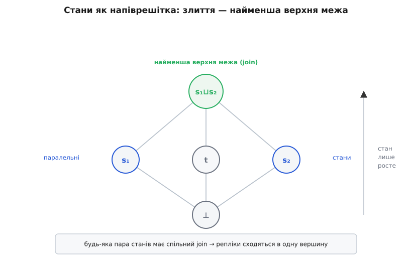
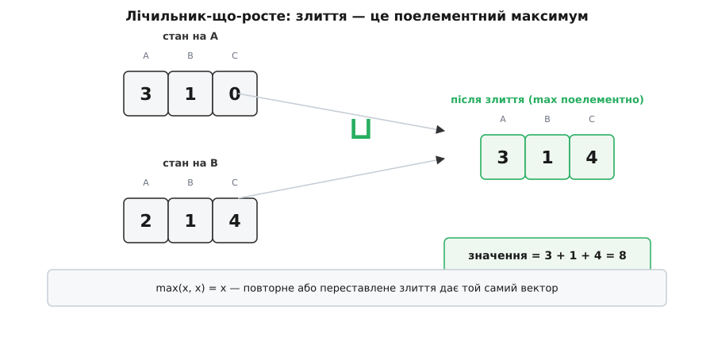

# Безконфліктні типи даних (CRDT)

<preknowlist>
- [Кінцева узгодженість](topic:sf-distributed/eventual-consistency) — репліки тимчасово розходяться, а коли обмін відновлюється, мусять самі зійтися до спільного стану.
- [Векторні годинники](topic:sf-distributed/vector-clocks) — як відрізнити «одна подія сталася до іншої» від «вони паралельні», не звіряючись із настінним годинником.
- [Напіврешітка](topic:math-algebra/semilattice) — частковий порядок, у якому будь-яка пара елементів має найменшу спільну верхню межу (об'єднання, join).
- [Ідемпотентність](topic:sf-distributed/idempotency) — властивість операції, коли повторне застосування не змінює результату понад перше.
</preknowlist>

Двоє редагують той самий документ із різних кінців світу, і мережа між ними на хвилину зникла. Обидва щось дописали, кожен у свою копію. Мережа повернулася — і тепер треба з двох версій зробити одну. Хто переміг? Якщо ми скажемо «переможе та, що прийшла останньою за годинником», ми мовчки викинемо чужу правку. Якщо покличемо людину розсудити — заплатимо затримкою й роботою на кожному розходженні. А якщо перед кожним словом брати глобальний замок, щоб ніхто не писав одночасно, — навіщо тоді дві копії, які нібито мали працювати незалежно?

Ця сцена — не про текстові редактори. Це загальна ціна того, що дані **репліковані** (лат. *replicare* — повторювати, відображати): та сама інформація живе копіями на багатьох вузлах. Копії тримають задля доступності (один вузол упав — інші відповідають), задля близькості (читати з сусіднього дата-центру швидше, ніж із-за океану) і задля роботи офлайн (телефон у метро приймає правки й досинхронізує потім). Але щойно копій більше однієї й вони можуть **приймати запис незалежно**, ви приречені колись отримати дві розбіжні версії того самого — і мусите знати, як їх звести.

## Чому наївні відповіді погані

Коли мережа розрізана надвоє, [теорема CAP](topic:sf-distributed/cap-theorem) ставить різкий вибір: під час розбіжності (partition) система або відмовляє в записі, поки не відновиться зв'язок (обирає строгу узгодженість), або приймає запис в обидві половини й лишається доступною (обирає доступність) — але тоді половини розходяться. CRDT — це відповідь для другого табору: ми **хочемо** приймати запис завжди, навіть у розрізаній мережі, і згодні, що копії тимчасово різні, — за умови, що вони гарантовано зійдуться.

Питання лише — **як** зійдуться. Переберемо очевидні відповіді й побачимо, чому кожна муляє.

**«Перемагає остання за годинником» (last-write-wins).** Проста, але тихо втрачає дані: з двох паралельних правок одна зникає без сліду лише тому, що її мітка часу виявилася меншою. Гірше — самі мітки бріхливі: настінний годинник вузлів дрейфує й стрибає від синхронізації, тож «остання» може означати «та, чий годинник поспішав». Порядок, який ми накинули, — вигаданий, бо паралельні події насправді **не** впорядковані в часі.

**«Хай розсудить людина» (siblings).** Так робить, наприклад, [мультилідерна реплікація](topic:sf-distributed/multi-leader-replication): система зберігає обидві розбіжні версії й на наступному читанні віддає їх застосунку — розбирайся сам. Чесно, але перекладає роботу на кожного, хто читає, і на кожному конфлікті. Це прийнятно для рідкісних зіткнень, та не для тисяч дрібних правок на секунду.

**«Замок або консенсус перед кожним записом».** Домовитися заздалегідь, хто пише, — і конфліктів не буде. Але [домовленість між вузлами дорога](topic:sf-distributed/consensus-problem): вона потребує кількох раундів мережею й **зупиняється**, коли вузли не бачать одне одного. А саме заради роботи в розрізаній мережі ми й завели копії. [Двофазний коміт](topic:sf-distributed/two-phase-commit) блокується, якщо координатор зник; [консенсус на кшталт Raft](topic:sf-distributed/raft) чекає більшості. Купувати відсутність конфліктів ціною доступності — означає викинути головну вигоду реплікації.

Спільна вада всіх трьох — вони **розв'язують конфлікт постфактум**: спершу дозволяють станам розійтися так, що звести їх стає проблемою, а тоді героїчно її розрулюють. А що, як конфлікту взагалі **не давати виникнути** — сконструювати сам тип даних так, щоб будь-які дві копії зливались автоматично, однозначно й без арбітра?

## Ідея: зробити злиття алгебраїчною операцією

Ось у чому суть **CRDT** (англ. *conflict-free replicated data type* — безконфліктний реплікований тип даних). Ми не покладаємось на порядок надходження правок і не кличемо суддю. Натомість вимагаємо, щоб у типу була операція **злиття** двох станів, яка задовольняє три властивості. Тоді — і це головне — хоч у якому порядку, хоч скільки разів злиття не застосовуй, усі копії, що бачили той самий набір правок, обчислять **той самий** результат.

Чому саме три властивості — випливає з того, що робить із повідомленнями реальна мережа.

Мережа **переставляє** повідомлення: пакет, відправлений першим, може прийти другим. Отже, результат злиття не має залежати від порядку — операція мусить бути **комутативною** (лат. *commutare* — міняти місцями): `a ⊔ b = b ⊔ a`.

Мережа **дробить і перегруповує**: одна репліка встигла злити свій стан із двома сусідами, інша — спершу з одним, потім з другим. Отже, результат не має залежати від групування — операція мусить бути **асоціативною** (лат. *associare* — поєднувати): `(a ⊔ b) ⊔ c = a ⊔ (b ⊔ c)`.

Мережа **дублює**: пакет загубився, його переслали, а потім раптом дійшов і перший. Отже, повторне злиття того самого стану не має нічого зіпсувати — операція мусить бути [ідемпотентною](topic:sf-distributed/idempotency) (лат. *idem* — той самий): `a ⊔ a = a`.

Тип даних, чиє злиття комутативне, асоціативне й ідемпотентне, стійкий до всього, що мережа може зробити з порядком, групуванням і повторами. Конфлікт не «розв'язується» — його **сконструйовано неможливим**. Звідси й назва: *conflict-free*.

> 🔧 **Навіщо це.** Лічильники переглядів, «онлайн зараз», кошики, прапорці функцій, спільні нотатки — усе це хочеться оновлювати в кожному дата-центрі локально, без походу до лідера через океан, і не боятися, що синхронізація щось зітре. CRDT дає рівно це: вузли пишуть незалежно, гуртом обмінюються станами як завгодно — і сходяться самі, без координатора.

## Три властивості — це насправді напіврешітка

Три вимоги виглядають як окремі побажання, та разом вони описують одну знайому математичну структуру. Уявімо, що стани впорядковані відношенням «включає»: стан *x* «більший або рівний» стану *y* (пишемо `y ⊑ x`), якщо *x* відображає **все**, що відображає *y*, і, можливо, ще щось. Це — [частковий порядок](topic:math-algebra/semilattice): деякі пари станів порівнянні (один включає інший), а деякі — ні (кожен знає щось, чого не знає другий; це і є паралельні правки).

У такому порядку злиття двох станів — це їхня **найменша верхня межа** (об'єднання, join): найменший стан, що включає обидва. Комутативність, асоціативність та ідемпотентність — це рівно аксіоми того, що об'єднання визначене й поводиться як належить; структура з таким об'єднанням зветься **напіврешітка** (об'єднання-напіврешітка, join-semilattice). А ще правки лише **додають** знання — стан під час оновлення тільки «лізе вгору» порядком, ніколи не вниз. Цю монотонність (гр. *mónos* — один + *tónos* — напрям, тобто рух в один бік) і дає ідемпотентність разом з тим, що об'єднання не менше за жоден з аргументів.



*Стани як напіврешітка: злиття — це найменша верхня межа, і будь-яка пара має спільну вершину, тож репліки сходяться.*

Ось чому збіжність не диво, а наслідок. Дві репліки, що бачили той самий набір правок, злилися до найменшої верхньої межі цього набору — а вона одна-єдина, хоч у якому порядку її брати. Формальне твердження й доведення того, що монотонна напіврешітка (для станів) і комутативність паралельних операцій (для операцій) справді гарантують збіжність, винесено окремо — [чому саме ці властивості дають однаковий кінцевий стан](topic:sf-distributed/crdt/math-convergence.md): там показано, що з ідемпотентності, комутативності й асоціативності об'єднання випливає **сильна кінцева узгодженість** — усі коректні репліки, які прийняли однакову множину оновлень, мають ідентичний стан.

## Найчистіший приклад: лічильник, що росте

Абстракція оживає на найпростішому CRDT — **лічильнику, що лише зростає** (G-Counter, grow-only). Здавалося б, куди простіше за число, яке кожен збільшує; та якщо тримати одне спільне число й на злитті брати більше з двох, ми знову втратимо правки: два вузли, що незалежно додали по одиниці до 5, обидва матимуть 6, і після злиття вийде 6 замість 7.

Хитрість — не змішувати внески різних вузлів. Стан лічильника — це **вектор**: по одній комірці на кожну репліку, де записано, скільки нарахувала **саме вона**. Збільшити лічильник — це збільшити **свою** комірку. Значення лічильника — сума всіх комірок. А злиття бере **поелементний максимум**: у кожній комірці лишаємо більше з двох чисел.



*Лічильник-що-росте: розділивши внески по комірках, ми звели злиття до поелементного максимуму — комутативного, асоціативного й ідемпотентного.*

**Дві репліки нарахували незалежно.**

```
стан A = [3, 1, 0]     (A нарахувала 3, бачить у B — 1, у C — 0)
стан B = [2, 1, 4]     (B нарахувала 1, бачить у A — 2, знає про C — 4)

злиття = поелементний max:
  комірка A: max(3, 2) = 3
  комірка B: max(1, 1) = 1
  комірка C: max(0, 4) = 4
результат  = [3, 1, 4]
значення   = 3 + 1 + 4 = 8
```

Максимум комутативний (`max(x,y)=max(y,x)`), асоціативний і ідемпотентний (`max(x,x)=x`) — отже, вектор під поелементним максимумом є напіврешітка, і лічильник збігається за будь-якого перемішування доставки. Щоб дозволити ще й **віднімання**, беруть два таких лічильники — один рахує додавання, другий віднімання, — а значення є їхня різниця (це PN-Counter, від positive/negative — додатний і від'ємний). Тим самим прийомом — «розділи внески, зливай максимумом» — будують багато складніших типів.

## Дві сім'ї: везеться стан чи везеться операція

Досі ми мовчки припускали, що репліки шлють одна одній **весь свій стан** і зливають отримане. Це одна з двох сімей — і корисно бачити обидві, бо вони по-різному платять за збіжність.


*Дві сім'ї CRDT: обидві сходяться, але купують збіжність різною ціною — товстими повідомленнями за дешевий канал або тонкими повідомленнями за суворий канал.*

**Стан (CvRDT, convergent — збіжний).** Репліка час від часу відправляє сусідам **увесь свій стан**, а ті зливають його об'єднанням напіврешітки. Вимоги суто алгебраїчні: стани утворюють напіврешітку, а кожне оновлення лише піднімає стан порядком. Величезна перевага — **невибагливість до каналу**: оскільки злиття ідемпотентне й комутативне, канал може губити, дублювати й перемішувати пакети; треба тільки, щоб кожен стан **колись** дійшов. Це ідеально лягає на плітки (gossip) і [анти-ентропію](topic:sf-distributed/anti-entropy-repair) — фонове звіряння реплік, яке потихеньку затягує розбіжності. Плата — **товсті повідомлення**: ганяти весь стан щоразу дорого. Її знімають **дельта-CRDT** (δ-CRDT): пересилають не цілий стан, а маленьку «дельту» — рівно ту частинку напіврешітки, що змінилася від останнього оновлення, — і все одно зливають об'єднанням.

**Операції (CmRDT, commutative — комутативний).** Репліка розсилає не стан, а саму **операцію** («додай x», «збільш на 1»), і кожен застосовує її в себе. Повідомлення крихітні. Але оскільки операція вже не ідемпотентна (застосувати «збільш на 1» двічі — не те саме, що раз), канал мусить бути **надійним причинним мовленням** (reliable causal broadcast): доставити кожну операцію **рівно один раз** і з дотриманням причинного порядку — якщо одна правка логічно спиралася на іншу, вони й прийдуть у цьому порядку. Причинність тут визначають [векторними годинниками](topic:sf-distributed/vector-clocks), а не настінним часом. За такого каналу від типу вимагається менше: щоб **паралельні** (причинно незалежні) операції **комутували** між собою; причинно впорядковані й так прийдуть у правильному порядку. З погляду алгебри операції утворюють [комутативну структуру](topic:math-algebra/monoid), у якій порядок незалежних дій не впливає на підсумок.

Обидві сім'ї **рівносильні** за виразністю: будь-який тип, зроблений в одній, можна перетворити на іншу. Вибір — інженерний компроміс: товсті повідомлення й невибагливий канал проти тонких повідомлень і суворого каналу.

## Де інтуїція ламається: множини

Лічильник оманливо легкий. Справжня школа CRDT — **множина** з операціями «додати» й «видалити», бо тут наївний проєкт розбивається об паралельність, і видно, як його латають.

**Множина, що лише росте** (G-Set): дозволяємо тільки додавання, злиття — об'єднання множин. Збігається бездоганно, бо об'єднання — та сама напіврешітка. Але без видалення це піврішення.

**Двофазна множина** (2P-Set): додамо видалення так — заведемо другу, «цвинтарну» множину видалених елементів; елемент присутній, якщо він у доданих і **не** у видалених. Дві множини, що ростуть, — дві напіврешітки, усе зливається. Та ціна жорстока: раз потрапивши в цвинтар, елемент **не можна додати знову** — його **надгробок** (tombstone — намогильний камінь; тут: невидимий запис «цього більше нема») лишається навіки й забиває будь-яке майбутнє додавання. Множина, куди не можна повернути раз видалене, — рідко те, чого хочуть.

**Множина «останній переміг»** (LWW-Element-Set): чіпляємо до кожного додавання й видалення мітку часу; елемент присутній, якщо його додавання новіше за видалення. Повертати елементи вже можна. Але ми повернулися до бріхливого годинника: паралельні «додати» й «видалити» розсудить порівняння міток, і одна з правок тихо зникне — та сама вада «останній переміг», лише захована глибше.

**Множина зі спостереженим видаленням** (OR-Set, observed-remove) розриває це коло геніально простим ходом. Кожне **додавання** народжує **унікальний тег** — свій, ніде більше не повторний. Стан тримає множину доданих тегів і множину видалених. **Видалення** прибирає лише ті теги, які воно **на місці бачило** в цю мить. Елемент присутній, якщо серед доданих є хоч один тег, якого нема у видалених.


*OR-Set: унікальні теги роблять паралельний конфлікт «додати проти видалити» детермінованим — додавання перемагає, бо його новий тег видалення просто не бачило.*

Тепер паралельний конфлікт розв'язано **однозначно й на користь додавання**. Хтось видаляє *x*, а хтось у той самий час знову його додає — видалення прибирає лише старі, бачені теги, а нове додавання дало свіжий тег, якого видалення **не могло бачити**; після злиття цей тег живий, тож *x* лишається. Повторне додавання теж працює само собою — щоразу це новий тег. Обидві множини тегів лише ростуть, злиття — об'єднання, тобто знову напіврешітка, — і при цьому семантика поводиться по-людськи. Робочий код такого типу зі зрозумілим злиттям і перевіркою збіжності розібрано окремо: [OR-Set і лічильник у коді](topic:sf-distributed/crdt/proj-or-set.md).

**Присутність елемента в OR-Set.**

```
додані   = { x:a1, x:a2, y:b1 }     (теги-свідки додавань)
видалені = { a1 }                    (видалення бачило лише a1)

x присутній?  живі теги x = {a1, a2} \ {a1} = {a2} ≠ ∅   → так
y присутній?  живі теги y = {b1}     \ {}   = {b1} ≠ ∅   → так
```

> 🔧 **Навіщо це.** Кошик покупок, список учасників каналу, набір увімкнених прапорців-функцій — усе це множини, які правлять з різних пристроїв офлайн і паралельно. OR-Set дає передбачувану відповідь на «додав тут, видалив там одночасно» без сервера-арбітра: додавання виграє, повторно додати можна, ніхто не зникає через розбіжність годинників.

## Регістри, послідовності й межа можливого

Тим самим інструментарієм будують решту абетки CRDT. **Регістр «останній переміг»** (LWW-Register) тримає одне значення з міткою — і на злитті лишає новіше; просто, але тихо губить паралельний запис. **Багатозначний регістр** (MV-Register) чесніший: помітивши, що два записи паралельні (це знову бачать [векторні годинники](topic:sf-distributed/vector-clocks)), він зберігає **обидва** значення й повертає їх разом, лишаючи вибір застосунку — це ті самі «siblings», що їх колись показував кошик у Dynamo.

Найефектніший клас — **послідовності** для спільного редагування тексту: те, заради чого CRDT значною мірою й народилися. Тут не можна ні брати максимум, ні тримати теги — треба, щоб паралельні вставки в те саме місце рядка не побилися й дали стабільний порядок символів. Ідея: дати кожному символові **щільний, унікальний, повністю впорядкований ідентифікатор позиції** — між будь-якими двома позиціями завжди можна згенерувати нову, — а видалення робити надгробками. Тоді два автори, що одночасно вставили літеру між тими самими сусідами, отримають різні, порівнянні позиції, і текст збіжиться в однаковий у всіх. На цій ідеї стоять RGA, Logoot, Treedoc, LSEQ; на них тримаються редактори спільної роботи (Automerge, Yjs) і рух «local-first» — застосунки, що працюють офлайн на пристрої, а синхронізуються, коли можуть.

І тут важливо назвати **межу**, за якою CRDT не рятує, — інакше з нього роблять чарівну паличку. CRDT гарантує збіжність до **однозначного** значення, але **не** до того, якого ви семантично хотіли: «останній переміг» збігається чудово — і мовчки викидає правки. Ба більше, CRDT сходиться лише щодо тих інваріантів, які **зберігає об'єднання**. «Множина лише росте», «лічильник не спадає» — такі властивості об'єднання береже, бо вони монотонні. А от «баланс рахунку ≥ 0» чи «це ім'я користувача унікальне» — **не** монотонні: дві репліки, кожна законно списавши гроші чи зайнявши те саме ім'я, після злиття дадуть недозволений стан, і жодне об'єднання цього не виправить. Такі глобальні заборони вимагають сказати комусь «ні» **до** дії, тобто [координації](topic:sf-distributed/consensus-problem) — а це вже інший кут CAP, де за узгодженість платять доступністю. CRDT живе у протилежному кутку: він купує **безкоординаційний поступ** — репліки рухаються самі, без арбітра, — ціною того, що вміє берегти лише інваріанти, дружні до злиття.

Є й буденніша плата — **метадані ростуть**: надгробки видалених елементів, теги OR-Set, ідентифікатори позицій нікуди не діваються самі. Прибирати їх (garbage collection) складно, бо викинути надгробок можна лише тоді, коли **всі** репліки вже точно його побачили, — а це знову вимагає знати стан усіх, тобто дрібку тієї самої координації, від якої ми тікали.

Попри межі, CRDT давно не теорія: на них тримаються активно-активна реплікація Redis і Riak, спільні редактори через Automerge та Yjs, стрічка присутності у Phoenix, лічильники «вподобань» у SoundCloud (Roshi на LWW-множині), міжрегіональна реплікація в Azure Cosmos DB. Скрізь, де вузли мусять писати незалежно й сходитися без лідера, алгебра напіврешітки виявляється дешевшою за арбітра. Як цей апарат визрів — від систем спільного редагування й кошика Dynamo до формалізації 2011 року й дельта-варіанту — розказано окремо: [як народилися безконфліктні типи](topic:sf-distributed/crdt/hist-crdt.md).

Отже, весь фокус CRDT — перекласти надійність із протоколу на **тип даних**. Замість домовлятися, хто пише, ми обмежуємо саме злиття до об'єднання в напіврешітці — і тим купуємо право дозволити мережі найгірше: губити, дублювати, переставляти, затримувати. Що б вона не зробила, кожна репліка приходить до тієї самої вершини порядку. Ціна чесна й видима: пережити злиття можуть лише ті інваріанти, які береже об'єднання; усе, що потребує глобального «ні», досі потребує арбітра.
