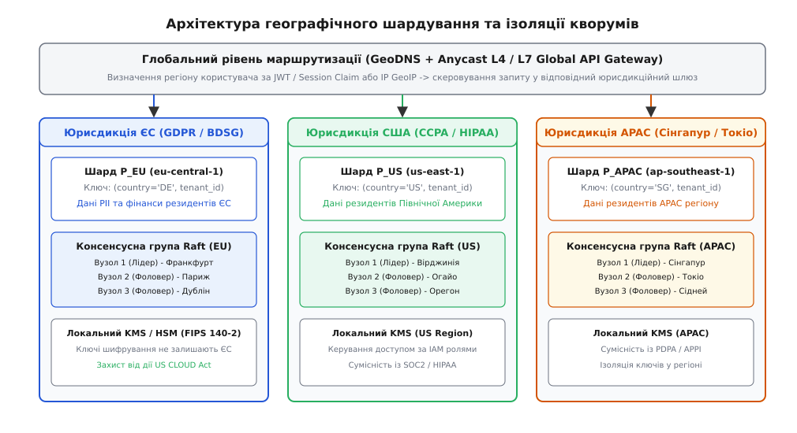
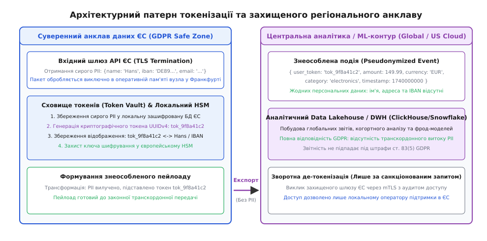
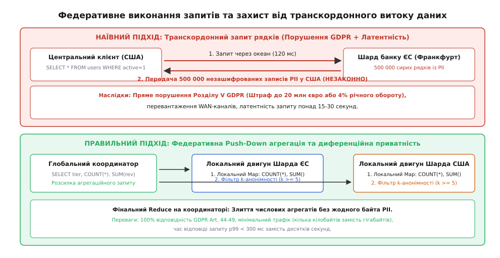

# Резидентність даних, GDPR та географічне шардування

<preknowlist>
- [Шардинг та партиціонування](root:sf-distributed/partitioning-sharding) — горизонтальне розбиття простору даних на неперетинні підмножини.
- [Лідер-фоловер / мультилідер / leaderless](root:sf-distributed/replication-leader-follower) — фізична організація реплікації та ролі вузлів у кластері.
- [Мультилідерна реплікація](root:sf-distributed/multi-leader-replication) — топології реплікації між кількома активними регіонами та вирішення конфліктів.
- [Теорема CAP](root:sf-distributed/cap-theorem) — фундаментальний компроміс між узгодженістю, доступністю та толерантністю до розділення мережі.
- [Ізоляція орендарів](root:sf-distributed/tenant-isolation) — мультитенантна архітектура, безпечне розмежування контекстів і даних.
- [API-шлюз](root:sf-web/api-gateway) — маршрутизація вхідних запитів, термінація TLS та фільтрація заголовків.
- [Консенсус у розподілених системах](root:sf-distributed/consensus-problem) — протоколи досягнення узгодженості стану (Raft, Paxos).
</preknowlist>

Міжнародна фінтех-платформа розгортає єдиний реляційний кластер бази даних у хмарному регіоні Північної Вірджинії (`us-east-1`). Протягом першого року сервіс успішно обслуговує клієнтів із 45 країн світу. Проте щойно компанія залучає корпоративних клієнтів із Німеччини та Франції, архітектура стикається з подвійною кризою. З інженерного боку, користувачі з Берліна фіксують постійну затримку мережевого раунду (RTT) у 120–150 мілісекунд на кожен запит до бази через трансатлантичний кабель, що уповільнює комплексні бізнес-операції до кількох секунд. З правового боку, європейські регулятори та корпоративні аудитори виставляють ультиматум: пряме збереження та обробка персональних даних громадян ЄС на серверах у США без додаткових технічних заходів захисту та ізоляції ключів порушує Розділ V Загального регламенту про захист даних (GDPR). Компанії загрожує адміністративний штраф згідно зі статтею 83(5) GDPR розміром до 20 мільйонів євро або до 4% її річного світового обороту, а також судова заборона на обробку платежів.

Цей конфлікт оголює фундаментальну суперечність сучасної інженерії: **закони фізики вимагають наближення даних до користувача для мінімізації затримки, а закони суверенних держав вимагають утримання даних у межах національних кордонів під загрозою кримінальної та фінансової відповідальності**. Спроба розв'язати проблему шляхом створення повністю ізольованих регіональних копій застосунку руйнує цілісність глобальної платформи, унеможливлює наскрізну аналітику та подвоює витрати на інфраструктуру. 

Єдиним стійким інженерним виходом є синтез правових норм комплаєнсу з механізмами розподілених систем: географічне шардування на рівні рядків, ізоляція консенсусних кворумів усередині юрисдикцій, регіональні криптографічні анклави токенізації та федеративні протоколи транскордонних запитів.

---

## Фізика глобальної мережі: ціна трансокеанського раунду

Щоб зрозуміти інженерну ціну географічного розміщення, необхідно розглянути фізичні обмеження поширення сигналу в оптоволокні. Швидкість світла у вакуумі становить `300 000` км/с, проте в серцевині кварцового одномодового оптоволокна з показником заломлення `n ≈ 1.47` швидкість передачі фотонів падає приблизно до `200 000` км/с (або `5` мікросекунд на один кілометр дистанції).

```
Теоретична затримка в оптоволокні:
t = (2 · d · n) / c

Для відстані d = 6 500 км (Франкфурт ── Північна Вірджинія):
t_min = (2 · 6 500 км · 1.47) / (300 000 км/с) ≈ 63.7 мс (ідеальний прямий кабель)
```

У реальній трансатлантичній магістралі оптоволоконний маршрут не є прямою лінією: він проходить через наземні кабельні колодязі, підводні ретранслятори, оптичні підсилювачі EDFA та комутатори DWDM, збільшуючи фізичну довжину траси до `8 000–8 500` км. Разом із затримками комутації пакетів у маршрутизаторах BGP реальний час кругового обігу сигналу (Round-Trip Time, RTT) між Франкфуртом та Вірджинією становить від `95` до `125` мілісекунд у стані спокою.

```
+------------------------------------+-----------------------+------------------------+
| Маршрут запиту                     | Фізична дистанція     | Реальний RTT мережі    |
+------------------------------------+-----------------------+------------------------+
| Франкфурт ── Париж (у межах ЄС)    | ~480 км               | 8 – 12 мс              |
| Франкфурт ── Дублін (у межах ЄС)   | ~1 100 км             | 18 – 24 мс             |
| Франкфурт ── Вірджинія (Трансатл.) | ~6 500 км (геодез.)   | 95 – 125 мс            |
| Франкфурт ── Сінгапур (Євразія)    | ~10 200 км (кабель)   | 160 – 190 мс           |
+------------------------------------+-----------------------+------------------------+
```

Якщо розподілена транзакція вимагає двох послідовних мережевих раундів двофазної фіксації (Two-Phase Commit, 2PC) або узгодження через консенсусний протокол Raft, сумарний час очікування мережі складає:

```
Загальна затримка транзакції:
T_total = 2 · RTT + T_disk_io

Для локального кластера у Франкфурті:
T_local = 2 · 10 мс + 2 мс = 22 мс

Для трансатлантичного виклику до США:
T_wan   = 2 · 120 мс + 2 мс = 242 мс  (уповільнення в 11 разів)
```

Збільшення затримки у понад десять разів веде до тривалого утримання блокувань рядків у реляційній СКБД, вичерпання пулу з'єднань прикладного сервера та каскадної деградації всієї системи під високим навантаженням.

---

## Тріада понять: резидентність, суверенітет та локалізація даних

В інженерних дискусіях юридичні та архітектурні терміни часто вживаються як синоніми, що призводить до хибного вибору інфраструктури. Необхідно чітко розрізняти три рівні географічного контролю інформації:

```
[ Рівень 1: Резидентність (Data Residency) ]
    │  Вимога бізнесу або регулятора: фізичне зберігання копії даних у певному географічному місці.
    ▼
[ Рівень 2: Суверенітет (Data Sovereignty) ]
    │  Підпорядкування даних законодавству держави, на території якої вони фізично розташовані.
    ▼
[ Рівень 3: Локалізація (Data Localization) ]
       Найсуворіший режим: повна заборона будь-якої обробки, реплікації чи резервування за кордоном.
```

1. **Резидентність даних (Data Residency, від лат. *residens* — «той, що перебуває на місці»):** Означає географічне місцезнаходження, де організація чи хмарний провайдер фізично зберігає статичні дані у стані спокою (Data at Rest — дискові масиви, об'єктні сховища S3, резервні копії). Вимога резидентності зазвичай дозволяє тимчасову транскордонну маршрутизацію трафіку в процесі передачі (Data in Transit) за умови належного наскрізного шифрування.
2. **Суверенітет даних (Data Sovereignty, від фр. *souveraineté* — «верховна влада»):** Концепція, згідно з якою цифрові дані підпадають під закони та юрисдикцію тієї країни, на чиїй території вони фізично обробляються або зберігаються. Найяскравішим прикладом екстериторіального конфлікту суверенітетів є американський закон **US CLOUD Act (2018)**: він зобов'язує американські технологічні корпорації (AWS, Google, Microsoft) надавати правоохоронним органам США доступ до даних клієнтів за ордером, навіть якщо ці сервери фізично розташовані у Франкфурті чи Дубліні. Для європейських компаній це створює пряму загрозу порушення GDPR.
3. **Локалізація даних (Data Localization):** Найрадикальніша форма регулювання, яка вимагає, щоб дані не лише зберігалися, але й створювалися, первинно записувалися, індексувалися та аналізувалися виключно в межах національних кордонів. Транскордонний експорт суворо заборонено або дозволено лише після проходження обов'язкової державної сертифікації чи незворотного знеособлення.

Детальну хронологію судових битв між США та ЄС, скасування угод Safe Harbor і Privacy Shield та історію створення суверенних баз даних викладено в [історії еволюції цифрових кордонів від маніфесту Барлоу до рішень Schrems I/II](root:sf-distributed/data-residency/hist-gdpr-and-sovereignty.md).

---

## Класифікація даних за чутливістю до комплаєнсу

Неможливо спроектувати ефективну систему, застосовуючи максимальний рівень захисту до 100% інформації. Спроба локалізувати кожен байт призведе до деградації продуктивності та астрономічних витрат. Архітектура географічного розподілу починається зі строгої класифікації схеми даних на чотири категорії:

```
+--------------------------+---------------------------------------+----------------------------------+
| Категорія даних          | Типові сутності в моделі даних        | Дозволена географічна поведінка |
+--------------------------+---------------------------------------+----------------------------------+
| 1. Персональні дані      | ПІБ, email, номер телефону, адреса,   | Суворо локалізоване зберігання   |
|    (PII / GDPR Art. 4)   | IP-адреса, паспорт, біометрія         | в межах юрисдикції.              |
+--------------------------+---------------------------------------+----------------------------------+
| 2. Регульовані фінанси   | Номери банківських карток (PCI DSS),  | Локальні шарди; повна заборона   |
|    та медичні записи     | залишки на рахунках, діагнози (HIPAA) | виходу у відкритому вигляді.     |
+--------------------------+---------------------------------------+----------------------------------+
| 3. Системна телеметрія   | Логи запитів, трейси OpenTelemetry,   | Дозволено глобальний експорт     |
|    та операційні метрики | час виконання, коди помилок           | після вилучення IP та user_id.   |
+--------------------------+---------------------------------------+----------------------------------+
| 4. Глобальні довідники   | Каталог товарів, курси валют,         | Глобальна асинхронна             |
|    (Reference Data)      | перелік країн, тарифні плани          | реплікація на всі вузли світу.   |
+--------------------------+---------------------------------------+----------------------------------+
```

Розподіл інформації на ці категорії визначає подальший вибір архітектурного патерну для кожного компонента системи.

---

## Патерн 1: Географічне шардування на рівні рядків (Row-Level Geo-Partitioning)

Традиційний шардинг розрізає таблицю на основі хешування випадкового первинного ключа (`hash(user_id) % N`), рівномірно розсіюючи записи по всіх вузлах кластера. У гео-розподіленому середовищі такий підхід є неприпустимим: рядок громадянина Франції з імовірністю 66% потрапить на сервер у Сінгапурі або США.

Географічне шардування (Geo-Sharding) замінює випадковий поділ детермінованим закріпленням діапазонів ключів за просторовими зонами.


*Архітектура географічного шардування: розрізання даних за кодом юрисдикції, локалізація кворумів Raft у межах суверенних кордонів та ізоляція ключів HSM.*

### 1. Анатомія гео-розподіленого ключа

Первинний ключ таблиці формується як складений індекс (Composite Primary Key), першим елементом якого є обов'язковий дескриптор юрисдикції чи країни:

```sql
CREATE TABLE customers (
    jurisdiction_code VARCHAR(8) NOT NULL, -- 'EU_EEA', 'US_FED', 'APAC'
    tenant_id         UUID NOT NULL,
    user_id           UUID NOT NULL,
    full_name         VARCHAR(128) NOT NULL,
    email             VARCHAR(128) NOT NULL,
    balance           DECIMAL(18, 2) NOT NULL,
    created_at        TIMESTAMPTZ NOT NULL,
    PRIMARY KEY (jurisdiction_code, tenant_id, user_id)
);
```

### 2. Механізм розрізання та розміщення партицій

СКБД розбиває простір ключів на логічні діапазони (Ranges у CockroachDB, Tablets у Google Spanner / YugabyteDB). Декларативна конфігурація вказує рушію зберігання зв'язок між значенням префікса ключа та фізичними тегами серверів:

```sql
-- Прив'язка діапазонів ключів до локальних регіонів дата-центрів
ALTER TABLE customers CONFIGURE ZONE USING
    num_replicas = 3,
    constraints = '{
        "+region=eu-central-1": 1,
        "+region=eu-west-1": 1,
        "+region=eu-west-3": 1
    }'
    WHERE jurisdiction_code = 'EU_EEA';

ALTER TABLE customers CONFIGURE ZONE USING
    num_replicas = 3,
    constraints = '{
        "+region=us-east-1": 1,
        "+region=us-east-2": 1,
        "+region=us-west-2": 1
    }'
    WHERE jurisdiction_code = 'US_FED';
```

Коли клієнт виконує операцію `INSERT INTO customers (jurisdiction_code, ...) VALUES ('EU_EEA', ...)`, координатор запису звертається до метаданих кластера і скеровує команду безпосередньо до лідера Raft-групи у Франкфурті. Запис ніколи не передається через океан, що забезпечує:
* **Мінімальну латентність запису:** Локальний RTT між Франкфуртом і Парижем становить менше 10 мс (замість 140 мс до США).
* **Абсолютну відповідність комплаєнсу:** Усі три копії партиції фізично створюються на накопичувачах у межах ЄС.

---

## Патерн 2: Локалізація консенсусних кворумів та обмеження реплікації

Найнебезпечніша прихована пастка гео-розподілених систем криється у консенсусних протоколах (Raft або Multi-Paxos). Якщо Raft-група з п'яти вузлів складається з двох серверів у Франкфурті, одного в Лондоні та двох у Вірджинії, то кожна операція фіксації журналу попереджувального запису (Write-Ahead Log, WAL) вимагає отримання підтвердження від більшості вузлів:

```
Розмір кворуму:
Q = ⌊N / 2⌋ + 1

Для N = 5 вузлів:
Q = ⌊5 / 2⌋ + 1 = 3 вузли
```

Якщо мережевий зв'язок між Франкфуртом і Лондоном тимчасово деградує, франкфуртський лідер змушений звертатися до вірджинських вузлів для формування кворуму з 3 голосів. У цей момент відбувається подвійний колапс:
1. **Стрибок латентності:** Час фіксації транзакції злітає з 5 мс до 150 мс.
2. **Юридичне правопорушення:** Необроблені бінарні записи WAL, які містять сирі персональні дані (PII), перетинають Атлантичний океан і записуються на диски американського дата-центра для досягнення кворуму.

### Ізоляція кворумів (Quorum Locality & Replica Pinning)

Щоб унеможливити подібні витоки, архітектура накладає жорсткі правила на топологію реплікації:

```
[ Юрисдикція ЄС: eu-central-1 / eu-west-1 / eu-west-3 ]
  ├── Вузол 1 (Лідер Raft, Франкфурт)   ── Голосуючий (Voting)
  ├── Вузол 2 (Фоловер Raft, Париж)      ── Голосуючий (Voting)
  └── Вузол 3 (Фоловер Raft, Дублін)     ── Голосуючий (Voting)
         │
         │ (Асинхронний експорт знеособлених подій після фільтрації)
         ▼
[ Глобальний контур аналітики: us-east-1 ]
  └── Вузол-спостерігач (Non-voting Learner / Read-only Observer)
```

1. **Голосуючі репліки (Voting Replicas):** Усі учасники консенсусної більшості зобов'язані перебувати виключно в межах дозволених регіонів даної юрисдикції. Кворум формується на 100% локально.
2. **Репліки-спостерігачі (Learners / Observers):** Вузли за межами юрисдикції не мають права голосу у кворумі, не можуть обиратися лідерами та отримують виключно десенсибілізовані потоки змін через асинхронні шлюзи.

Формальну специфікацію маніфестів розміщення та опис структур політик наведено у [специфікації декларативних політик резидентності та розміщення даних](root:sf-distributed/data-residency/api-residency-policy.md).

---

## Годинники та транзакційна узгодженість: TrueTime проти HLC

У розподіленій СКБД збереження послідовної серіалізованості транзакцій (Serializability) вимагає точного впорядкування подій за часом. У глобальному середовищі фізичні годинники серверів мають неминучий дрейф (Clock Drift).

```
1. Google Spanner (TrueTime API):
   Використовує апаратні атомні годинники та приймачі GPS у кожному дата-центрі.
   Гарантує похибку часу: ε ≤ 7 мс.
   Механізм Commit Wait: координатор транзакції чекає 2ε перед поверненням успіху,
   гарантуючи, що жодна наступна транзакція не отримає менший таймстемп.

2. CockroachDB / YugabyteDB (Hybrid Logical Clocks, HLC):
   Поєднує фізичний час NTP із логічним лічильником Лампорта: (physical_ms, logical_counter).
   Максимальне припустиме відхилення: MaxOffset ≈ 500 мс.
   При міжрегіональному читанні, якщо таймстемп вузла відстає від лідера,
   СКБД виконує примусовий перезапуск транзакції (Read Restart).
```

При гео-шардуванні локалізація діапазонів ключів кардинально спрощує роботу HLC: оскільки транзакції над європейськими користувачами фіксуються виключно всередині європейських вузлів, фізичний дрейф між Франкфуртом та Парижем залишається в межах кількох мікросекунд, повністю усуваючи затримки очікування трансокеанської синхронізації.

---

## Патерн 3: Анклави токенізації та псевдонімізації (Token Vault Enclaves)

Часто глобальний бізнес потребує побудови централізованих аналітичних звітів, навчання моделей виявлення шахрайства або агрегації фінансових показників на рівні світової штаб-квартири. Передавати сирі персональні дані клієнтів через кордон заборонено.

Рішення полягає у впровадженні **патерну регіонального анклаву токенізації (Token Vault Enclave Pattern)**.


*Суверенний анклав токенізації: обробка та збереження сирих персональних даних у межах ЄС із транскордонним експортом виключно знеособлених сурогатних токенів.*

### Механізм роботи анклаву

1. **Вхідний шлюз:** Запит клієнта потрапляє до регіонального шлюзу в межах юрисдикції (наприклад, Франкфурт).
2. **Фіксація у сховищі Vault:** Сирі дані (ім'я, адреса, номер банківського рахунку) записуються у зашифроване сховище (Token Vault) всередині суверенного анклаву.
3. **Генерація сурогатного токена:** Сховище генерує незворотний або псевдовипадковий токен (наприклад, `tok_9f8a41c2-881a-4e2b-91c0-00129a8f4410`).
4. **Формування знеособленого пейлоаду:** Прямі ідентифікатори видаляються з повідомлення і замінюються на токен. Усі нечутливі бізнес-метрики (сума покупки, категорія товару, час) залишаються незмінними.
5. **Транскордонний експорт:** Знеособлений пакет легально експортується до глобального сховища аналітики (Data Lakehouse / Snowflake / ClickHouse) у США.

```
Початковий об'єкт (у межах ЄС):
{
  "user_id": "usr_99120",
  "name": "Hans Zimmer",
  "iban": "DE89370400440532013000",
  "amount": 149.50,
  "currency": "EUR"
}

Трансформація в анклаві ЄС:
Hans Zimmer  ──[ HMAC-SHA256(Salt_EU) ]──► tok_88fbc910
DE89...3000  ──[ Random Vault UUID    ]──► tok_a11029fe

Експортований пакет (дозволено для передачі у США):
{
  "user_id": "usr_99120",
  "name_token": "tok_88fbc910",
  "iban_token": "tok_a11029fe",
  "amount": 149.50,
  "currency": "EUR"
}
```

### Збереження формату при шифруванні (Format-Preserving Encryption, FPE)

У банківських процесингових системах стандарту ISO 8583 номери платіжних карток (PAN) мають довжину строго 16 цифр і проходять валідацію за алгоритмом Луна (Luhn Checksum). Заміна 16-значного номера на 36-значний UUID токена ламає існуючі реляційні схеми з типом `VARCHAR(16)`.

Для таких сценаріїв застосовується шифрування зі збереженням формату за стандартом **NIST SP 800-38G (алгоритм FF3-1)**:
* Вхідний номер картки `4111 2222 3333 4444` розбивається на дві половини у мережі Фейстеля.
* Шифротекст залишається 16-значним числовим рядком `4891 0482 9102 3319`, проходячи валідацію схеми та алгоритму Луна, проте є криптографічно стійким шифротекстом під локальним ключем HSM.

Зворотна де-токенізація (отримання справжнього імені за токеном) можлива лише за наявності легітимного бізнес-запиту від авторизованого співробітника підтримки в межах ЄС через захищений mTLS-шлюз із обов'язковим аудиторським логуванням.

Повний вихідний код маршрутизатора з анклавною токенізацією реалізовано у [проєкті гео-розподіленого проксі-маршрутизатора мовами C та C++](root:sf-distributed/data-residency/proj-georouter.md).

---

## Патерн 4: Суверенна клітинна архітектура (Sovereign Cell Architecture)

Для систем найвищого рівня критичності (національний банкінг, державні реєстри, системи охорони здоров'я) навіть гео-шардування єдиної бази даних може вважатися недостатньо ізольованим через спільну площину управління (Control Plane) або спільні сервіси автентифікації.

У таких випадках застосовується суверенна клітинна архітектура ([клітинна архітектура](root:sf-distributed/cell-based-architecture)):

```
[ Глобальний маршрутизатор L4 / Anycast DNS ]
       │
       ├─── [ Клітина ЄС (Франкфурт) ] ── Повний стек: API + App + DB + KMS
       ├─── [ Клітина США (Вірджинія) ] ── Повний стек: API + App + DB + KMS
       └─── [ Клітина Швейцарії (Цюрих) ] ── Повний стек: API + App + DB + KMS
```

Кожна клітина (Cell) є повністю автономним екземпляром усієї платформи (обчислювальні вузли, бази даних, черги повідомлень, сховища секретів та апаратні модулі HSM). Клітина не має спільних баз даних чи синхронних мережевих залежностей від інших регіонів. Відмова або компрометація американського сегмента жодним чином не впливає на життєздатність та безпеку європейської клітини.

---

## Потокова обробка подій та гео-реплікація брокерів (Kafka & MirrorMaker 2)

У сучасних мікросервісних архітектурах обмін повідомленнями відбувається через розподілені журнали подій (Apache Kafka). Помилкове підключення американських споживачів (Consumers) до європейських топіків або наскрізна дзеркальна реплікація (MirrorMaker) є найпоширенішим джерелом прихованих порушень комплаєнсу.

Правильна топологія брокерів будується на принципі суверенних топіків та фільтрованих мостів:

```
[ Кластер Kafka ЄС (Франкфурт) ]
  ├── Топік eu.orders.raw (Містить PII) ── Тільки локальні європейські воркери
  └── Топік eu.orders.anonymized        ── Дозволено для експорту
             │
             ▼ (MirrorMaker 2 / Cluster Link з фільтром схем)
[ Кластер Kafka США (Вірджинія) ]
  └── Топік global.orders.aggregated   ── Доступно для аналітики та ML
```

1. **Регіональне іменування топіків:** Префікс топіка (`eu.*`, `us.*`) жорстко визначає юрисдикцію походження подій.
2. **Фільтри трансформації при реплікації (SMT — Single Message Transforms):** Коннектор MirrorMaker 2 на льоту видаляє поля класу `PII_RESTRICTED` або викликає шлюз токенізації перед записом байтів у мережевий сокет до закордонного брокера.
3. **Локальність груп споживачів:** Мікросервіси бізнес-логіки обслуговують виключно локальні партиції брокера без крос-регіонального опитування (Polling).

---

## Маршрутизація вхідного трафіку та проблема «першого дотику»

Коли мобільний застосунок або браузер надсилає перший HTTP-запит, система ще не знає, громадянином якої країни є користувач. Якщо спрямувати клієнта за найближчим GeoIP-вузлом (наприклад, європеєць під час відпустки в Нью-Йорку потрапляє на шлюз у США), виникає ризик несанкціонованого збереження його облікових даних у транзитному американському лозі.

Ця проблема вирішується дворівневою моделлю вхідної маршрутизації:

```
[ Крок 1: Неавтентифікований клієнт ]
    │
    ▼ Надсилає запит на global.api.bank.com
[ L4 Anycast Edge Proxy (TLS Passthrough / No-Log Ingress) ]
    │
    ▼ Термінація TLS без збереження тіла запиту на диск
[ Сервіс ідентифікації та автентифікації (Auth Gateway) ]
    │
    ├─ 1. Перевірка логіна та пароля (або JWT токена)
    ├─ 2. Вичитування атрибута home_jurisdiction: "EU_EEA"
    └─ 3. Повернення клієнту підписаного токена із закріпленим регіоном
           та заголовком: HTTP 307 Temporary Redirect -> eu.api.bank.com
```

Після автентифікації клієнтський застосунок зберігає у локальній сесії кінцеву точку свого суверенного шлюзу (`eu.api.bank.com`) і спрямовує всі наступні запити безпосередньо до європейських серверів, оминаючи глобальні проміжні вузли.

---

## Федеративні запити та розподілені об'єднання (Cross-Border Joins)

Найскладніший інженерний виклик у гео-шардованих системах виникає тоді, коли бізнесу потрібно виконати аналітичний запит над даними всіх філій компанії.

Наївний підхід полягає у виконанні стандартного запиту вибірки:

```sql
-- НАЇВНИЙ ПІДХІД (КРИТИЧНЕ ПОРУШЕННЯ КОМПЛАЄНСУ)
SELECT u.full_name, u.email, o.order_amount
FROM users u
JOIN orders o ON u.user_id = o.user_id
WHERE o.order_date >= '2026-01-01';
```

Якщо такий запит запускається з координатора в США, база даних спробує вичитати мільйони сирих рядків із європейського та азійського шардів через глобальну мережу. Це призводить до миттєвого порушення Розділу V GDPR та перевантаження WAN-каналів.


*Порівняння наївного транскордонного вивантаження рядків із федеративною Push-Down агрегацією та фільтрацією k-анонімності.*

### Федеративна Push-Down агрегація та k-анонімність

Правильна архітектура базується на принципі **делегування обчислень до джерела даних (Compute Push-Down)**:

```sql
-- ПРАВИЛЬНИЙ ФЕДЕРАТИВНИЙ ЗАПИТ
SELECT
    tier,
    COUNT(*) AS total_customers,
    SUM(order_amount) AS total_revenue
FROM customers
GROUP BY tier
HAVING COUNT(*) >= 5; -- Фільтр k-анонімності (k >= 5)
```

1. **Паралельне виконання на місцях (Map Phase):** Глобальний координатор надсилає лише синтаксичне дерево агрегаційного запиту до кожного регіонального шарда.
2. **Локальна обробка:** Кожен шард у Франкфурті, Вірджинії та Сінгапурі обчислює проміжні суми `SUM()` та лічильники `COUNT(*)` локально над своїми даними.
3. **Фільтрація k-анонімності (k-Anonymity Guard):** Якщо агрегована група містить менше ніж `k` осіб (наприклад, у сегменті преміум-клієнтів лише 2 особи), шард відкидає цю групу або додає математичний шум (диференційна приватність), щоб унеможливити ідентифікацію конкретної людини за непрямими ознаками.
4. **Злиття числових агрегатів (Reduce Phase):** Через транскордонну мережу передаються лише кілька підсумкових числових значень. Жоден байт персональних даних не залишає суверенної території.

---

## Криптографічний суверенітет: ізоляція ключів, BYOK та HYOK

Шифрування даних на диску (Encryption at Rest за стандартом AES-256) є базовою вимогою безпеки, проте саме по собі воно не вирішує проблему суверенітету. Якщо база даних зашифрована, але майстер-ключ шифрування зберігається в сервісі AWS KMS або Azure Key Vault, контрольованому американською материнською компанією, то за законом US CLOUD Act провайдер може бути примушений надати ключі правоохоронним органам без відома європейського клієнта.

Для досягнення реального криптографічного суверенітету застосовуються три ієрархічні моделі керування ключами:

```
[ 1. Provider-Managed Keys ]
    Провайдер генерує і зберігає ключі у своєму глобальному KMS.
    Статус: Нульовий захист від екстериторіальних ордерів.

[ 2. Bring Your Own Key (BYOK) ]
    Клієнт генерує ключ у власному локальному KMS і передає його в хмару.
    Статус: Хмара оперує ключем у пам'яті; ризик перехоплення залишається.

[ 3. Hold Your Own Key (HYOK) / External HSM ]
    Ключ НІКОЛИ не потрапляє в хмару. Зберігається у виділеному локальному
    апаратному модулі безпеки (HSM FIPS 140-2 Level 3) у власному дата-центрі клієнта.
    Статус: Повний криптографічний суверенітет.
```

### Конвертне шифрування з локальним HSM (Envelope Encryption)

При записі рядка таблиці локальний рушій генерує одноразовий симетричний ключ даних (Data Encryption Key, DEK). Дані шифруються ключем DEK на місці. Після цього DEK надсилається через захищений канал до європейського апаратного модуля HSM, де шифрується регіональним майстер-ключем (Key Encryption Key, KEK). 

Зашифрований DEK зберігається поруч із рядком таблиці. Без доступу до локального європейського HSM розшифрувати дані неможливо навіть за наявності повного фізичного доступу до дискових образів бази даних.

---

## Аварійне відновлення (Disaster Recovery) в умовах юрисдикційних обмежень

Класична стратегія аварійного відновлення (DR) передбачає географічне рознесення основної та резервної систем на різні континенти для захисту від глобальних катастроф (наприклад, реплікація з Європи до США).

При впровадженні вимог резидентності та суверенітету така практика стає незаконною. Перемикання навантаження (Failover) на закордонний дата-центр під час аварії означає миттєвий експорт усіх конфіденційних баз даних за межі дозволеної юрисдикції.

### Стратегія внутрішньоюрисдикційного відновлення (Intra-Jurisdiction DR)

Архітектура відмовостійкості повинна проектуватися за принципом повної локальної замкненості:

```
[ Юрисдикція ЄС: Три незалежні зони в межах ЄЕЗ ]
  ├── Основний регіон (Primary): eu-central-1 (Франкфурт, Німеччина)
  ├── Резервний регіон (Secondary DR): eu-west-1 (Дублін, Ірландія)
  └── Третій регіон (Tertiary / Quorum Tie-Breaker): eu-west-3 (Париж, Франція)
```

1. **Розподіл за трьома країнами ЄС:** Якщо весь дата-центр у Франкфурті зазнає знеструмлення або повені, лідерство автоматично переходить до Дубліна та Парижа. Усі три точки лежать у межах правового поля ЄС.
2. **Multi-Cloud у межах однієї держави:** Якщо юрисдикція обмежена кордонами однієї країни (наприклад, суворі банківські норми Швейцарії чи Німеччини, де хмарний провайдер має лише один регіон), застосовується гібридна реплікація або Multi-Cloud топологія: основна база розміщується в AWS у Франкфурті, а резервна — у Google Cloud або в локальному приватному дата-центрі Equinix у Франкфурті.

---

## Спостережуваність та санітизація логів (Observability & PII Scrubbing)

Поширена інженерна діра виникає на рівні телеметрії: база даних суворо гео-шардована, проте агенти розподіленого трасування (OpenTelemetry, Jaeger, Datadog) збирають сирі SQL-запити разом із параметрами `WHERE email = '...'` та автоматично пересилають їх до центрального сховища логів у США.

```
[ Клієнтський HTTP-запит ] ──► [ Ingress Proxy (Envoy) ] ──► [ Локальна БД ЄС ]
                                     │
                                     ▼ (Неочищений потік трейсів)
                        [ eBPF / WASM PII Scrubber ]
                                     │
                                     ▼ (Санітизований потік: параметри видалено)
                        [ Global OpenTelemetry Collector (США) ]
```

Щоб запобігти транскордонному витоку через телеметрію, на рівні Ingress-проксі впроваджуються автоматизовані фільтри санітизації (WASM-плагіни для Envoy або eBPF-зонди ядра):
1. **Параметризація SQL у трейсах:** Усі літерали в тілі SQL замінюються на позиційні плейсхолдери (`WHERE email = ?`).
2. **Маскування заголовків HTTP:** Заголовки `Authorization`, `Cookie` та користувацькі метадані відтинаються до експорту метрик.
3. **Хешування ідентифікаторів у логах:** Замість відкритого `user_id` у розподілений трейс записується лише солений хеш сесії.

---

## Технічна оцінка транскордонної передачі: модель EDPB

Після рішення Європейського суду у справі Schrems II Європейська рада із захисту даних (EDPB) затвердила обов'язкові рекомендації щодо оцінки впливу передачі даних (Transfer Impact Assessment, TIA). Для інженера розподілених систем це означає формалізований чекліст проектування:

1. **Інвентаризація всіх потоків даних (Data Mapping):** Складання точної карти кожного мережевого з'єднання, виклику gRPC та реплікаційного каналу брокерів повідомлень із зазначенням країни розташування віддаленого сокета.
2. **Визначення правового інструменту передачі:** Перевірка наявності рішення про адекватність або стандартних договірних застережень (SCC).
3. **Оцінка законодавства країни призначення:** Аналіз ризику екстериторіального доступу іноземних спецслужб (зокрема законів FISA 702 та CLOUD Act у США).
4. **Впровадження додаткових технічних заходів (Supplementary Technical Measures):** 
   - Якщо передача є неминучою, дані шифруються алгоритмами з відкритою специфікацією (AES-GCM-256), а ключі шифрування зберігаються виключно в модулях HSM на території ЄС/ЄЕЗ під контролем європейського оператора (Use Case 1 рекомендацій EDPB).
   - Будь-яка схема, де закордонний хмарний сервіс потребує доступу до відкритих даних у пам'яті (Data in the Clear / Use Case 6), визнається регулятором технічно неможливою для захисту і забороняється.
5. **Процедура оскарження та моніторингу:** Регулярний аудит журналів де-токенізації та періодична зміна криптографічних ключів.

---

## Складні інженерні випадки та приховані пастки

### 1. Міграція користувача між юрисдикціями та «Право на забуття»

Коли клієнт змінює податкове резиденство і переїжджає з Німеччини до США, його дані повинні бути перенесені з європейського шарда до американського. Простий виклик `UPDATE customers SET jurisdiction_code = 'US_FED'` у розподіленій базі даних породжує приховані ризики:

```
Протокол міграції записів між суверенними шардами:
1. Захоплення розподіленого замка або відкриття транзакції 2PC.
2. Читання повного запису з шарда ЄС.
3. Токенізація / шифрування під ключами американського HSM.
4. Вставка запису в шард США: INSERT INTO customers VALUES ('US_FED', ...).
5. Гарантоване фізичне вилучення (Hard Delete) з шарда ЄС з перезаписом сторінок
   згідно зі статтею 17 GDPR (Right to Erasure / Право на забуття).
6. Оновлення та видалення старих токенів у сховищі Token Vault.
```

Якщо на кроці 5 залишити старий запис або позначити його як логічно видалений (`is_deleted = true`), це стає порушенням регламенту під час наступного аудиту безпеки.

### 2. Глобальні вторинні індекси (Global Secondary Indexes)

Якщо таблиця `customers` шардована за ключем `(jurisdiction_code, user_id)`, то точковий пошук за адресою електронної пошти `SELECT * FROM customers WHERE email = 'klaus@example.de'` без зазначення юрисдикції змушує систему виконувати віялове сканування (Scatter-Gather) по всіх шардах світу.

Спроба створити глобальний вторинний індекс за полем `email` на єдиному вузлі в США призводить до того, що адреси електронної пошти всіх громадян ЄС автоматично реплікуються до США, порушуючи закон.

**Архітектурне вирішення:**
* **Локальні індекси (Local Secondary Indexes):** Індекс будується строго всередині кожного регіонального шарда. Пошук без зазначення юрисдикції виконується паралельним запитом, але кожен шард повертає відповідь лише у разі збігу.
* **Глобальний хешований індекс (Blind Index / Deterministic Hash):** Якщо глобальний пошук критичний для авторизації, у глобальній базі зберігається лише незворотний криптографічний хеш адреси з регіональною сіллю `hmac_sha256(email, salt) -> shard_id`. За цим хешем шлюз дізнається, до якого саме регіону надіслати запит, не зберігаючи самого відкритого email.

### 3. Резервні копії, снапшоти та конвеєри аналітики

Найпоширеніша помилка DevOps-інженерів — налаштування автоматичного створення снапшотів дисків або дампів баз даних у глобальний бакет Amazon S3, розташований у регіоні за замовчуванням `us-east-1`. 

Один такий бекап миттєво нівелює всю складну архітектуру гео-шардування, оскільки повний образ європейської бази даних опиняється на американських серверах. Конфігурації резервного копіювання, експорту журналів ELK/Datadog та трейсів Jaeger повинні мати окремі ізольовані сховища всередині кожної суверенної юрисдикції.

---

> 🔧 **Навіщо це.**
> Інженер, який не враховує географічні та правові межі, проектує кластери за застарілою парадигмою «єдиної пласкої хмари». Наслідком стають або багатомільйонні регуляторні штрафи, блокування роботи бізнесу та примусовий поділ системи на ізольовані неефективні копії, або гігантські мережеві затримки через трансокеанські виклики.
> 
> Архітектор, який володіє принципами резидентності та гео-шардування:
> 1. Проектує складені первинні ключі з просторовими дескрипторами юрисдикцій (`jurisdiction_code`), забезпечуючи фізичну ко-локацію рядків у потрібних дата-центрах та час відгуку локального читання й запису `p99 < 10 мс`.
> 2. Ізолює консенсусні групи Raft/Paxos у межах правових зон, унеможливлюючи витік бінарних журналів WAL через кордон та усуваючи вплив трансатлантичних мережевих збоїв на локальні кворуми.
> 3. Впроваджує регіональні анклави токенізації (Token Vaults) та схеми FPE, відокремлюючи чутливі персональні дані від аналітичних контурів і забезпечуючи легальний транскордонний експорт знеособлених подій.
> 4. Розділяє топології брокерів Kafka на суверенні регіональні топіки з обов'язковою трансформацією та маскуванням повідомлень у коннекторах MirrorMaker 2.
> 5. Будує аварійне відновлення за принципом локальної замкненості (Intra-Jurisdiction Multi-AZ / Multi-Cloud), захищаючи інфраструктуру від відмов без порушення міжнародного комплаєнсу.
> 6. Налаштовує спостережуваність із автоматичною санітизацією трейсів на рівні Ingress-шлюзів, унеможливлюючи прихований витік конфіденційної інформації через логи та метрики.
