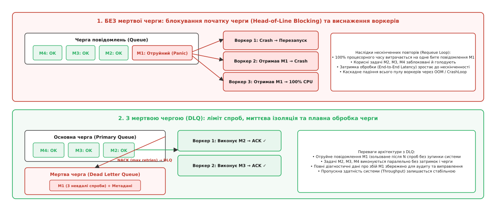
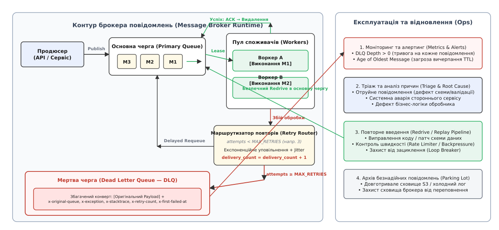
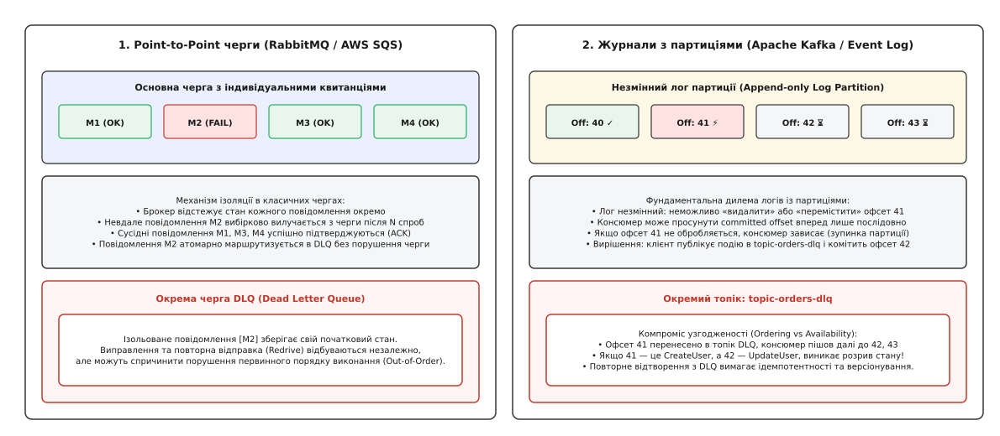
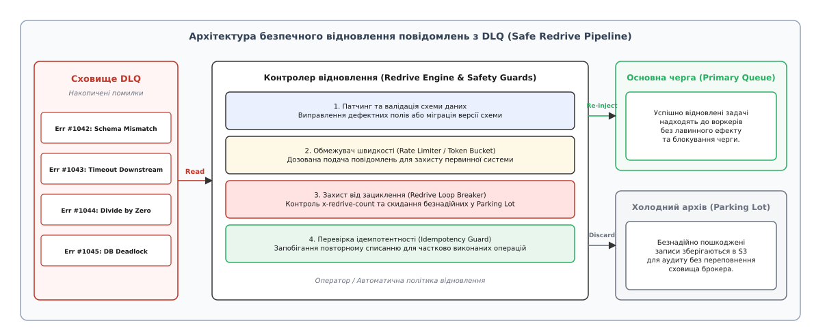

# Мертва черга: ізоляція отруйних повідомлень, ліміти спроб, конверти діагностики та безпечний redrive

<preknowlist>
- [Черга повідомлень](root:sf-distributed/message-queue) — асинхронний буфер між продюсером і споживачем, що забезпечує часове та просторове розв'язання компонентів.
- [Гарантії доставки](root:sf-distributed/delivery-guarantees) — семантика at-least-once, at-most-once та неминучість дублікатів через мережеві збої.
- [Ідемпотентність](root:sf-distributed/idempotency) — здатність системи багаторазово виконувати одну й ту саму операцію без зміни підсумкового стану.
- [Повтори](root:sf-distributed/retries-backoff) — стратегії повторних спроб із експоненційним уповільненням та випадковим тремтінням (jitter).
- [Таймаути і бюджет часу](root:sf-distributed/timeouts-deadlines) — механізми обмеження часу очікування відповіді в умовах ненадійної мережі.
- [Конкурентні споживачі](root:sf-distributed/competing-consumers) — паралельна вибірка задач пулом воркерів з механізмом оренди та підтвердження (ACK/NACK).
- [Журнал подій](root:sf-distributed/event-log) — незмінний розподілений лог із послідовним зміщенням (offset) консюмера.
</preknowlist>

Сервіс обробки замовлень інтернет-магазину вичитує повідомлення з черги зі швидкістю 500 операцій на секунду. Користувачі купують товари, платіжний шлюз генерує події транзакцій, а пул із сорока фонових воркерів списує залишки зі складу, формує фіскальні чеки та надсилає сповіщення. Кожна операція триває в середньому 40 мілісекунд. Черга працює стабільно, її глибина коливається біля нуля, а клієнти отримують підтвердження за лічені частки секунди.

Але о 14:02 надходить специфічний запит: через помилку у сторонньому мобільному додатку поле адреси доставки містить 80 кілобайт невалідного двійкового сміття замість очікуваного об'єкта JSON.

Перший вільний воркер забирає це повідомлення. Парсер JSON викидає фатальний виняток `JsonParseException`. Обробник перехоплює помилку, не може розпізнати ідентифікатор замовлення, робить відкат локальної транзакції та повертає повідомлення назад у чергу через команду негативного підтвердження (`NACK` із прапорцем `requeue=true`). За 2 мілісекунди брокер знову віддає це саме повідомлення іншому вільному воркеру. Той падає з тією ж помилкою і знову повертає його в чергу. За 100 мілісекунд усі сорок воркерів захоплюють це єдине повідомлення по колу, безперервно викидаючи винятки, спалюючи 100% ресурсів процесора та генеруючи гігабайти логів аварій.

У цей час позаду зависають тисячі цілком коректних замовлень від інших користувачів. Пропускна здатність системи падає до нуля, а затримка зростає від мілісекунд до десятків хвилин.

Єдине дефектне повідомлення повністю паралізувало розподілену платформу. Спроба мовчки видаляти помилкові записи призводить до втрати грошей і транзакцій без жодного сліду для аудиту, а нескінченні повтори знищують обчислювальні ресурси.

Для розв'язання цієї дилеми використовують патерн **мертвої черги** (англ. *Dead Letter Queue*, DLQ, від поштового терміна *Dead Letter Office* — бюро недоставлених листів). Це спеціалізований ізольований буфер брокера повідомлень, куди автоматично або програмно перенаправляються повідомлення, які не вдалося успішно обробити після вичерпання встановленого ліміту спроб або через виявлення невиправних структурних помилок, зі збереженням оригінального тіла даних та діагностичного контексту збою.

## Анатомія збою: чому звичайних повторних спроб недостатньо

У розподілених системах усі помилки обробки асинхронних повідомлень поділяються на два принципово різні класи: **перехідні** (*transient*) та **постійні** (*permanent / deterministic*).

Перехідні збої виникають через тимчасову недоступність зовнішнього середовища: короткочасний розрив TCP-з'єднання з базою даних, таймаут запиту до стороннього платіжного API через сплеск трафіку, або блокування рядка в реляційній таблиці. Такі збої успішно лікуються повторними спробами з експоненційним уповільненням (*exponential backoff*) та джитером (*jitter*): через 500 мілісекунд або 2 секунди мережа відновлюється, і повідомлення виконується без жодних змін у коді чи даних.

Постійні збої мають детерміновану природу. Їх спричиняють так звані **отруйні повідомлення** (*poison messages / poison pills*):
1. **Порушення контракту даних:** некоректний формат серіалізації (битий Protobuf або непарний XML), відсутність обов'язкових полів схеми, невідповідність типів даних (рядок замість масиву чисел).
2. **Семантичні та бізнес-аномалії:** спроба списати від'ємну суму грошей, переказ на неіснуючий рахунок, ділення на нуль у формулі розрахунку знижки.
3. **Дефекти коду обробника (*Bugs*):** розіменування нульового вказівника (`NullPointerException`), вихід за межі масиву або вичерпання пам'яті (`OutOfMemoryError`), спровоковані нетиповим поєднанням параметрів.


*Без мертвої черги отруйне повідомлення циркулює по колу між воркерами, викликаючи блокування початку черги (Head-of-Line Blocking) та падіння системи. Із DLQ дефектне повідомлення після кількох невдалих спроб ізолюється, звільняючи чергу для коректного потоку задач.*

Скільки б разів система не повторювала обробку детерміновано отруйного повідомлення, результат буде ідентичним: виняток, відкат і повторний збій.

Без спеціального механізму ізоляції архітектура опиняється перед руйнівною трилемою:
- **Нескінченні повтори (Infinite Retries):** отруйне повідомлення блокує голову черги (*Head-of-Line Blocking*). Воркери витрачають 100% процесорного часу на циклічні падіння, вичерпують пул з'єднань з базою даних і перегрівають систему. Черга розростається до мільйонів елементів, пам'ять брокера переповнюється, а здорові задачі голодують.
- **Тихе видалення (Silent Drop / At-Most-Once):** у разі будь-якого винятку споживач підтверджує повідомлення (`ACK`), і брокер його знищує. Пропускна здатність зберігається, але система безповоротно втрачає бізнес-дані. Якщо помилка виникла через тимчасовий таймаут мікросервісу розсилки, користувач ніколи не отримає квиток, замовлення буде оплачене, але не відправлене, а інженери не матимуть можливості відновити втрачені дані.
- **Аварійне зупинення процесу (Fail-Fast CrashLoop):** якщо необроблений виняток вбиває процес воркера, оркестратор (наприклад, Kubernetes) перезапускає контейнер. Новий екземпляр знову бере те саме перше повідомлення з черги й миттєво гине. Контейнери входять у нескінченний стан `CrashLoopBackOff`, повністю вимикаючи обчислювальний контур.

Мертва черга розриває це замкнене коло: вона надає безпечний коридор відступу, ізолюючи токсичні записи від основного потоку без їхнього знищення.

Історія того, як концепція фізичного поштового моргу перетворилася на обов'язковий інструмент розподілених систем, детально розібрана у вставці: [від лондонського бюро недоставлених листів до корпоративних черг EIP](root:sf-distributed/dead-letter-queue/hist-dead-letter-office.md).

## Механіка перенаправлення: лічильники спроб, затримки та політики перекидання

Переміщення повідомлення в мертву чергу не повинно бути хаотичним або передчасним. Якщо відправити задачу в DLQ після першого ж мережевого таймауту, мертва черга швидко перетвориться на смітник, куди потраплятимуть сотні цілком валідних замовлень, змушуючи чергових інженерів розбирати інциденти вручну.

З іншого боку, якщо дозволити системі робити 50 повторних спроб підряд, затримка доставки зросте до неприйнятних меж, а навантаження на систему під час інцидентів лише посилиться.


*Життєвий цикл повідомлення: успішна обробка підтверджується через ACK; збій збільшує лічильник delivery_count та відправляє повідомлення на повторну спробу з затримкою; після досягнення ліміту спроб брокер перенаправляє збагачений конверт у DLQ для моніторингу та подальшого аудиту.*

Конвеєр надійної доставки базується на багатоетапному алгоритмі:

```
[Основна черга] ──> [Споживач (Воркер)]
                          │
         ┌────────────────┴────────────────┐
     [Успіх]                            [Збій]
         │                                 │
   [Брокер: ACK]               [delivery_count += 1]
         │                                 │
 [Видалено з черги]            ┌───────────┴───────────┐
                       [count < MAX_RETRIES]   [count ≥ MAX_RETRIES]
                               │                       │
                       [Черга затримки]        [Мертва черга (DLQ)]
                               │                       │
                       [Експоненційний         [Алерт інженерам,
                        Backoff + Jitter]       збереження метаданих]
```

### 1. Лічильник доставок (Delivery Count / Redelivery Counter)

Брокер або клієнтська бібліотека зобов'язані відстежувати, скільки разів конкретне повідомлення видавалося споживачам для обробки:
- **Управління на боці брокера (Broker-Managed):** брокер автоматично інкрементує службовий лічильник у заголовках повідомлення кожного разу, коли воно передається через протокол. В AWS SQS це атрибут `ApproximateReceiveCount`, у RabbitMQ (починаючи з версії 3.8 і Quorum Queues) — заголовок `x-delivery-count`. Цей підхід є найнадійнішим, оскільки лічильник зберігається на рівні самого сховища брокера і не скидається навіть у разі раптового падіння процесу воркера.
- **Управління на боці застосунку (Application-Managed):** якщо брокер не підтримує нативних лічильників (як класичні топіки Apache Kafka чи Redis List), споживач змушений сам вести облік. При збої воркер формує копію повідомлення з додатковим заголовком `x-retry-count: N+1`, публікує його в проміжну чергу повторів і підтверджує старе повідомлення.

### 2. Черги повторів із затримкою (Delayed Retry Queues)

Спроба виконати повтор негайно (*immediate redelivery*) практично гарантує повторний збій, якщо зовнішній сервіс перевантажений або перезавантажується. Тому між спробами вводиться пауза, що зростає за експоненційним законом:

`T_delay = min(T_max, T_base · 2^(attempt - 1)) ± Jitter`

У таких брокерах, як RabbitMQ, де повідомлення в межах однієї черги не можуть обганяти одне одного, затримка реалізується через ланцюжок черг із часом життя (*TTL, Time-To-Live*) та мертвою маршрутизацією:
1. Повідомлення зазнає невдачі на спробі 1.
2. Воркер відправляє його в чергу `retry-10s` із параметром `x-message-ttl: 10000` (10 секунд) та налаштуванням `x-dead-letter-exchange`, що вказує назад на основну чергу.
3. У черзі `retry-10s` немає активних споживачів. Повідомлення просто лежить там 10 секунд.
4. Після вичерпання TTL брокер автоматично вважає повідомлення «простроченим» і за правилами dead-lettering повертає його в основну чергу, де його підхоплює вільний воркер.

### 3. Політика перекидання (Redrive Policy)

Коли лічильник `delivery_count` досягає встановленого порогового значення `MAX_RETRIES` (зазвичай від 3 до 5), спрацьовує **політика перекидання** (*Redrive Policy*). Брокер або клієнтський інтерцептор припиняє цикл повторних спроб і виконує атомарне перенаправлення в термінальну чергу `orders-dlq`.

Математичне обґрунтування вибору порогу спроб та розрахунок ймовірності хибного потрапляння перехідних збоїв у DLQ наведено у вставці: [математична модель підбору ліміту спроб та оцінки накопичення черги](root:sf-distributed/dead-letter-queue/math-dlq-retries-and-capacity.md).

## Анатомія мертвого конверта: контекст, трасування та метадані

Поширена помилка проєктування — скидати в мертву чергу «голе» початкове тіло повідомлення (*raw payload*). 

Уявіть чергового інженера, який отримує алерт про появу запису в DLQ, відкриває повідомлення й бачить лише сирий JSON:

```json
{"order_id": "98124", "user_id": 4012, "amount": 120.50}
```

Дивлячись на цей об'єкт, неможливо відповісти на ключові питання:
- З якої саме черги прийшло це повідомлення (якщо кілька черг налаштовані на один DLQ)?
- Який саме мікросервіс намагався його виконати і на якому сервері?
- Який виняток було викинуто (таймаут мережі, помилка валідації чи відхилення платежу банком)?
- Який повний стек викликів (*stack trace*) зафіксовано в момент збою?
- О котрій годині сталася перша спроба і скільки всього спроб було здійснено?
- Який ідентифікатор трасування (*Trace ID / W3C Distributed Context*) прив'язаний до цієї операції, щоб знайти відповідні логи в системі моніторингу?

Якщо метадані втрачено, діагностика інциденту перетворюється на здогадки. Інженер змушений шукати логи на десятках серверів, звіряючи часові мітки, що під час серйозної аварії забирає години дорогоцінного часу.

### Структура діагностичного конверта (Dead Letter Envelope)

Промисловий стандарт вимагає загортати невдале повідомлення в **діагностичний конверт** (*Dead Letter Envelope*) або збагачувати його стандартизованими службовими заголовками брокера.

```
┌───────────────────────────────────────────────────────────────────────────┐
│                       DEAD LETTER ENVELOPE                                │
├───────────────────────────────────────────────────────────────────────────┤
│ СЛУЖБОВІ ЗАГОЛОВКИ ТА МЕТАДАНІ ДІАГНОСТИКИ:                               │
│ • x-original-queue:       orders-processing-queue                         │
│ • x-original-exchange:    ecommerce-events                                │
│ • x-original-routing-key: orders.created                                  │
│ • x-first-failed-at:      2026-08-20T14:02:11.104Z                        │
│ • x-dead-lettered-at:     2026-08-20T14:02:35.892Z                        │
│ • x-retry-count:          4                                               │
│ • x-failed-by-host:       worker-node-prod-08.internal                    │
│ • x-failed-by-service:    billing-processor-v2.4.1                        │
│ • x-exception-class:      com.shop.billing.CardDeclinedException          │
│ • x-exception-message:    "Gateway code 402: Insufficient funds on card"  │
│ • x-exception-stacktrace: "at BillingClient.charge(BillingClient.kt:142) │
│                            at OrderHandler.process(OrderHandler.kt:58)..."│
│ • traceparent:            00-4bf92f3577b34da6a3ce929d0e0e4736-00f067aa0ba│
│ • x-correlation-id:       req-8a12-b94f1082c91a                           │
├───────────────────────────────────────────────────────────────────────────┤
│ ОРИГІНАЛЬНЕ ТІЛО ДАНИХ (ORIGINAL PAYLOAD):                                │
│ {"order_id": "98124", "user_id": 4012, "amount": 120.50, ...}            │
└───────────────────────────────────────────────────────────────────────────┘
```

У середовищі RabbitMQ брокер автоматично додає масив заголовків `x-death` кожного разу, коли повідомлення перетинає Dead Letter Exchange. Масив зберігає повну історію переміщення: назву черги, причину відхилення (`rejected`, `expired`, `maxlen`), часову мітку та кількість циклів.

Окрему роль відіграє збереження контексту розподіленого трасування (*W3C Trace Context / OpenTelemetry*). При переміщенні в мертву чергу клієнтський інтерцептор повинен завершити поточний спан обробника статусом помилки (`SpanStatus.ERROR`) із записом винятку, але зберегти вихідний `traceparent` у заголовках мертвого конверта. Коли оператор запускає Redrive, новий спан відновлення створюється як дочірній або зв'язаний (*Span Link*) із початковим трейсом. Це дозволяє системам моніторингу (Jaeger, Zipkin, Datadog) візуалізувати повний наскрізний шлях замовлення: від початкового клієнтського HTTP-кліку до падіння в DLQ і подальшого успішного відновлення через кілька годин.

Повна специфікація полів діагностичного конверта, форматів CloudEvents та структур метаданих описана у вставці: [специфікація полів діагностичного конверта та інтерфейсів керування DLQ](root:sf-distributed/dead-letter-queue/api-dlq-envelope.md).

## Дві парадигми: Point-to-Point черги проти логів із партиціями

Реалізація патерну мертвої черги кардинально відрізняється залежно від базової моделі зберігання даних брокера: класичної черги повідомлень (*Message Queue*) чи розподіленого журналу подій (*Partitioned Log*).


*У Point-to-Point черзі (RabbitMQ, SQS) кожне повідомлення має індивідуальний стан: збійне повідомлення M2 вибірково переміщується в DLQ без порушення черги M3 та M4. У журналі з партиціями (Kafka) лог незмінний: щоб не заблокувати партицію на офсеті 41, консюмер пересилає подію в topic-dlq і змушений зафіксувати зміщення 42, що створює ризик розриву послідовності стану.*

### 1. Point-to-Point черги (RabbitMQ, AWS SQS, ActiveMQ)

У класичних чергах одиницею зберігання та управління є **окреме повідомлення**:
- Брокер веде облік життєвого циклу кожної одиниці даних індивідуально в оперативній пам'яті та на диску.
- Якщо повідомлення `M2` зазнає невдачі, брокер вилучає саме його з черги й атомарно записує в `M2-DLQ`.
- Сусідні повідомлення `M1` та `M3` обробляються, підтверджуються й видаляються абсолютно незалежно.
- Потік не зупиняється, а отруйне повідомлення ізолюється без жодного впливу на інші об'єкти в буфері.

### 2. Журнали з партиціями (Apache Kafka, AWS Kinesis, Apache Pulsar)

У лог-орієнтованих системах структура даних є незмінним, послідовним журналом додавання (*immutable append-only log*):
- Брокер Kafka не відстежує стан окремих повідомлень і не має вбудованої концепції «видалити повідомлення з середини партиції» або «перемістити запис за офсетом 41 в інший топік».
- Прогрес споживача визначається єдиним числом — зафіксованим зміщенням (**committed offset**).
- Якщо обробник падає на повідомленні з офсетом 41 і не фіксує зміщення, наступний виклик `poll()` знову поверне офсет 41. Консюмер намертво зависає на цій точці логу, і вся партиція блокується.

Щоб реалізувати поведінку DLQ у Kafka, логіку ізоляції переносять на рівень споживача:
1. Застосунок-споживач обгортає бізнес-код у блок перехоплення помилок `try-catch`.
2. Якщо вичерпано ліміт локальних спроб обробки повідомлення за офсетом 41, клієнтський інтерцептор бере вихідний запис, додає заголовки помилки й публікує нове повідомлення в окремий топік — наприклад, `orders-dlq-topic`.
3. Лише після того, як топік DLQ надійно підтвердив запис (*producer ack*), консюмер виконує комміт зміщення **офсету 42** в основній партиції, дозволяючи потоку рухатися далі.

### Компроміс узгодженості: замовлення проти доступності (Ordering vs Availability)

Використання DLQ у лог-орієнтованих системах несе серйозний архітектурний ризик: **порушення строгого порядку подій** (*Out-of-Order Execution*).

Уявімо потік подій для банківського рахунку:
- **Офсет 41:** `CreateAccount(acc_id=500, initial_balance=0)`
- **Офсет 42:** `DepositMoney(acc_id=500, amount=1000)`

Якщо подія 41 містить битий формат і скидається в DLQ, а консюмер продовжує роботу й обробляє подію 42, сервіс спробує поповнити баланс неіснуючого рахунку й викине нову помилку, або створить аномальний стан у базі даних. Коли через кілька годин інженери виправлять схему й виконають повторне відтворення події 41 з DLQ, вона застосується **після** події 42, порушивши хронологічну причинність бізнес-процесу.

Тому для критичних журналів, де порядок є абсолютним інваріантом предметної області, перенаправлення в DLQ на рівні окремої події забороняють: у разі непереборного збою консюмер зобов'язаний зупинити вичитування конкретної партиції (*pause partition*) та підняти критичний алерт до ручного втручання.

## Експлуатація DLQ: моніторинг, алертинг та процеси тріажу

Головна небезпека впровадження мертвої черги полягає в хибному психологічному відчутті безпеки: розробники налаштовують DLQ, сервіс перестає падати з аваріями, а графіки успішних HTTP-відповідей стають ідеально зеленими.

Насправді система може тихо зливати в мертву чергу 10% усіх фінансових транзакцій через неврахований крайовий випадок у новій версії мікросервісу. Якщо за мертвою чергою немає постійного нагляду, вона перетворюється на чорну діру, де непомітно накопичуються втрачені мільйони.

Мертва черга — це не сміттєвий бак, а **палата інтенсивної терапії** розподіленої системи. Поява будь-якого повідомлення в DLQ свідчить про аномалію, яка вимагає реакції.

### Ключові метрики та правила алертингу

Експлуатаційний контур моніторингу DLQ спирається на три фундаментальні показники:

| Метрика | Опис | Поріг для тривоги (Alert) | Небезпека ігнорування |
| :--- | :--- | :--- | :--- |
| **DLQ Inflow Rate** | Швидкість надходження нових повідомлень у DLQ (msg/sec) | `Rate > 0` (миттєвий алерт для P1 сервісів) | Непомітний збій релізу нової версії API або зміна схеми продюсером |
| **DLQ Queue Depth** | Загальна кількість нерозібраних повідомлень у буфері DLQ | `Depth > 0` (Warning), `Depth > N` (Critical) | Накопичення беклогу помилок, деградація продуктивності брокера |
| **Age of Oldest Message** | Час перебування найстарішого нерозглянутого запису в DLQ | `Age > 4-12 hours` | Автоматичне видалення повідомлень брокером через вичерпання retention TTL |

### Матриця тріажу та класифікація причин (Triage Matrix)

Коли черговий інженер отримує сигнал про появу повідомлень у DLQ, запускається процедура первинного сортування (*Triage*):

```
                               Повідомлення в DLQ
                                       │
                ┌──────────────────────┴──────────────────────┐
        [Системна помилка]                            [Бізнес-помилка]
                │                                             │
      ┌─────────┴─────────┐                         ┌─────────┴─────────┐
[Падіння бекенду]   [Таймаут мережі]          [Помилка валідації]   [Баг у коді]
      │                   │                         │                   │
[Чекати відновл.    [Патч конфігурації        [Патч схеми /        [Реліз хотфіксу
 + авто-redrive]     + повільний redrive]      ручна корекція]      + повний redrive]
```

1. **Тимчасові системні аварії:** якщо записи потрапили в DLQ через те, що база даних перебувала в стані відновлення довше, ніж тривав бюджет повторних спроб, повідомлення не потребують жодних змін у тілі. Достатньо переконатися, що база активна, і запустити конвеєр повторного введення.
2. **Невідповідність схем (Schema Mismatch):** якщо продюсер надіслав нове поле у непідтримуваному форматі, повторне введення сирих даних знову призведе до падіння. Інженер повинен або розгорнути оновлену версію споживача, або пропустити повідомлення через скрипт трансформації даних перед відправкою назад у чергу.
3. **Безнадійно пошкоджені записи (Unrecoverable / Corrupt):** повідомлення зі спамом, битими двійковими фрагментами чи спробами експлойтів, які не мають реальної бізнес-цінності, переміщуються у довготривалий холодний архів (*Parking Lot / Cold Storage*) та видаляються з оперативного брокера.

## Безпечне відновлення: архітектура конвеєра Redrive та захисні бар'єри

Процес повернення накопичених у DLQ повідомлень назад в основну чергу для повторного виконання називається **повторним введенням** (*Redrive / Replay*).

Наївний підхід до відновлення — запустити просту утиліту, яка вичитує всі 50 000 повідомлень із DLQ і залпом пересилає їх в основну чергу `orders-queue`.

Така дія майже неминуче призводить до вторинної системної катастрофи:
- **Лавинний ефект (Thundering Herd / Queue Flooding):** миттєвий викид десятків тисяч важких повідомлень забиває основну чергу, витісняючи свіжий потік клієнтських запитів. Час очікування для звичайних користувачів знову стрибає до критичних значень.
- **Вторинний каскадний збій:** якщо база даних або зовнішній платіжний шлюз лише нещодавно оговталися після аварії, залповий удар із 50 000 повторних запитів миттєво відправляє їх у повторний нокаут.
- **Нескінченна петля DLQ (DLQ Ping-Pong Loop):** якщо баг у бізнес-коді воркера не було до кінця виправлено, всі 50 000 повідомлень знову пройдуть цикл невдалих спроб і через 20 секунд дружно повернуться назад у DLQ, спаливши ресурси кластера.


*Архітектура безпечного Redrive-конвеєра: повідомлення проходять через валідацію схеми, обмежувач швидкості (Rate Limiter) для захисту системи від перевантаження, захист від повторного зациклення (Loop Breaker) та фільтр ідемпотентності.*

### Чотири захисні бар'єри безпечного Redrive

Надійний промисловий конвеєр повторного введення реалізує чотири обов'язкові захисні рівні:

#### 1. Бар'єр трансформації та міграції (Schema Patching)
Перед відправкою повідомлень оператор або автоматизована система має можливість застосувати функцію-трансформер. Якщо збій стався через те, що поле `currency` мало бути `"USD"`, а прийшло `"null"`, скрипт виправляє дефект прямо в тілі конверта, відновлюючи коректний контракт.

#### 2. Обмежувач швидкості та протитиск (Rate Limiter / Token Bucket)
Повідомлення повертаються в основну чергу не залпом, а строго дозованим потоком — наприклад, не більше 20–50 повідомлень на секунду. Це гарантує, що відновлюваний беклог займе лише 5–10% від вільного запасу пропускної здатності (*headroom*) системи, не впливаючи на обробку свіжого трафіку.

#### 3. Захист від зациклення (Redrive Loop Breaker)
Контролер відновлення додає до заголовка спеціальний лічильник: `x-redrive-count: N+1`. Якщо повідомлення вже одного разу проходило процедуру відновлення і знову опинилося в DLQ, воно автоматично дискваліфікується від наступних автоматичних редрайвів і блокується до індивідуального аудиту. Це унеможливлює нескінченний пінг-понг між чергами.

#### 4. Контроль ідемпотентності (Idempotency Guard)
Якщо повідомлення впало на фінальному етапі виконання (наприклад, гроші з карти клієнта вже було списано, але відправка email-квитанції завершилася таймаутом), простий повторний запуск може призвести до **подвійного списання коштів**. Воркери основної черги зобов'язані перевіряти статус операції за унікальним `idempotency_key` у базі даних перед виконанням будь-яких дій із побічними ефектами.

Повноцінна реалізація асинхронного воркера з лімітами спроб, збагаченням конвертів та безпечним Redrive-контролером на мовах C та C++ детально показана у вставці: [реалізація стійкого конвеєра обробки з автоматичним карантином та захищеним redrive](root:sf-distributed/dead-letter-queue/proj-resilient-dlq-pipeline.md).

## Підводні камені, безпека та типові пастки

Впровадження мертвої черги вимагає уваги до деталей, де закладено кілька неочевидних пасток:

### 1. Переповнення дискового сховища брокера (Storage Poisoning)
У багатьох брокерах (наприклад, RabbitMQ без лімітів або локальні диски Kafka) повідомлення в DLQ зберігаються за замовчуванням нескінченно довго. Якщо сервіс починає генерувати мільйони помилок на добу, мертва черга непомітно виїдає всю доступну дискову пам'ять вузлів кластера. Коли вільне місце закінчується, брокер блокує операції запису для ВСІХ продюсерів кластера (*disk alarm*), зупиняючи всю компанію.

**Захист:** встановлення суворого обмеження часу зберігання (`message-ttl` на рівні 7–14 днів) та максимального розміру черги (`x-max-length` або `x-max-length-bytes`) з автоматичним скиданням надлишку в холодний архів S3.

### 2. Витік конфіденційних даних та порушення безпеки (PII / GDPR Compliance)
Діагностичні конверти мертвої черги часто містять повні стеки викликів та початкові тіла запитів. Якщо вхідний запит містив пароль користувача, номер кредитної картки (*CVV*) або персональні медичні дані, а в стек помилки потрапили змінні оточення із секретними ключами API, мертва черга стає критичною вразливістю. Доступ до черги DLQ часто мають десятки інженерів підтримки, що порушує вимоги стандартів PCI-DSS та GDPR.

**Захист:** обов'язкова фільтрація та маскування чутливих полів (*Data Sanitization*) перед формуванням діагностичного конверта та шифрування DLQ-сховища на рівні ключів KMS.

### 3. Отруєння самого контуру DLQ (Meta-Poisoning)
Якщо сам механізм обробки помилок містить дефект (наприклад, функція серіалізації стека викликів падає з `StackOverflowError` або не може виділити пам'ять під час формування конверта), воркер гине всередині блоку перехоплення винятків. Повідомлення не потрапляє ні в основну чергу, ні в DLQ, а процес зависає або перезапускається.

**Захист:** максимальна простота коду обробки відмов, відсутність динамічних алокацій у критичних секціях та використання захисних блоків останньої надії (*catch-all fallback*).

### 4. Розрив синхронізації з патерном Transactional Outbox
Коли сервіс-продюсер публікує події через транзакційну скриньку (*Transactional Outbox*), запис про бізнес-сутність зберігається в базі даних продюсера атомарно з подією. Якщо консюмер на іншому кінці стикається з непереборною помилкою і відправляє подію в DLQ, виникає небезпечний розрив стану: у базі продюсера сутність вважається успішно створеною, тоді як у базі консюмера її стан відсутній.

**Захист:** реалізація двонапрямленого протоколу сповіщення про карантин. Якщо критична подія потрапляє в DLQ, система моніторингу або компенсуючий воркер може ініціювати сагу компенсації (*Saga Compensation*) або змінити статус сутності в базі продюсера на `PENDING_MANUAL_REVIEW`.

> 🔧 **Навіщо це.**
> 
> У реальній інженерній практиці наявність чітко спроєктованої топології DLQ — це межа між системою, яка розвалюється від першої неочікуваної помилки у сторонньому API, та зрілою відмовостійкою платформою корпоративного рівня.
> 
> Правильно налаштована мертва черга перетворює аварії високого пріоритету (P1 Outage), що вимагають нічних дзвінків та екстреного підйому команди, на штатні інциденти низького пріоритету (P3 Triage): отруйні повідомлення автоматично ізолюються в карантині, основний потік транзакцій продовжує обслуговувати живих користувачів із нульовим провалом SLO, а інженери спокійно розбирають діагностичні конверти в робочий час, виправляють причину та відновлюють дані натисканням однієї кнопки через захищений Redrive-конвеєр.

Мертва черга забезпечує системі фундаментальну властивість: вона відокремлює **доступність потоку обробки** від **детермінованих помилок окремих даних**, перетворюючи неминучі збої з катастрофи на контрольований та зворотний експлуатаційний процес.
