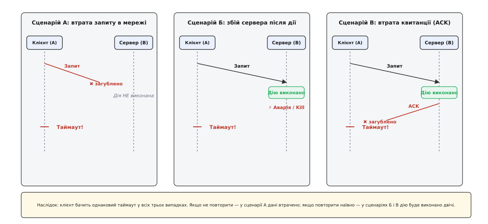
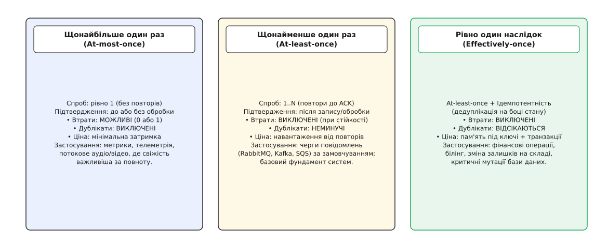
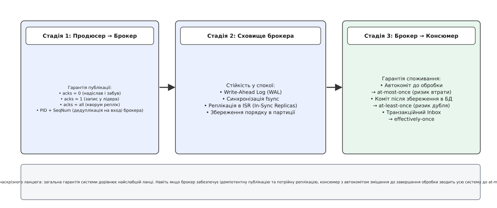
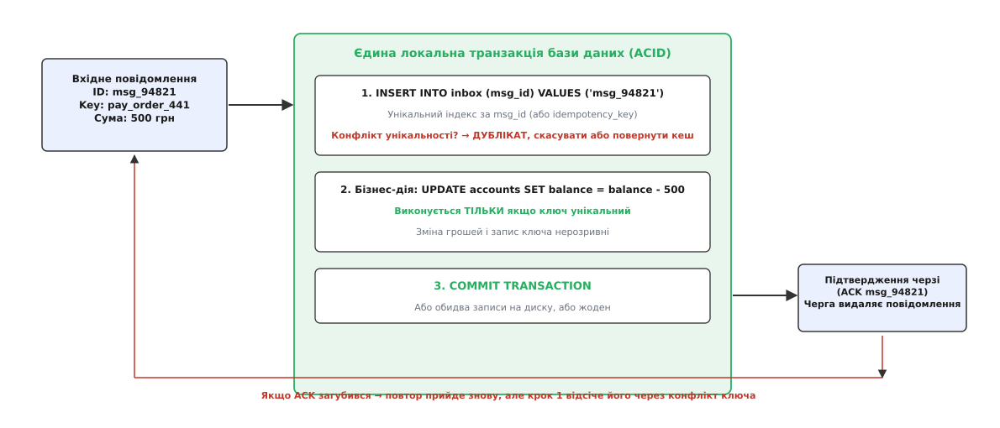

# Гарантії доставки: як ненадійна мережа ламає ілюзію єдиного разу

<preknowlist>
- [Омани розподілених обчислень](topic:sf-distributed/distributed-fallacies) — мережа губить і затримує пакети, а вузли зазнають раптових відмов; часткова аварія є штатним станом системи.
- [Таймаути й бюджет часу](topic:sf-distributed/timeouts-deadlines) — відсутність відповіді за визначений час змушує клієнта ухвалювати рішення в умовах неповної інформації.
- [Повтори](topic:sf-distributed/retries-backoff) — автоматичний повтор запиту рятує від тимчасових мережевих збоїв, але неминуче множить навантаження й створює дублікати.
- [Ідемпотентність](topic:sf-distributed/idempotency) — здатність операції давати однаковий кінцевий результат незалежно від того, скільки разів її було виконано.
- [Задача двох генералів](topic:sf-distributed/two-generals-problem) — математичне доведення неможливості досягнення абсолютної взаємної впевненості над ненадійним каналом зв'язку.
</preknowlist>

Клієнт інтернет-магазину купує ноутбук за 30 000 грн і натискає кнопку оплати. Платіжний сервіс відправляє HTTP-запит до шлюзу банку: списати гроші з картки покупця за замовлення № 84102. Шлюз банку отримує запит, знаходить рахунок, успішно списує 30 000 грн і вносить запис у внутрішній реєстр транзакцій. Але в ту саму мікросекунду, коли банківський сервер починає відправляти пакет із відповіддю «200 OK», комутатор провайдера скидає TCP-з'єднання. Клієнтський платіжний сервіс чекає дві секунди й фіксує таймаут зв'язку.

У цей момент уся розподілена система опиняється в стані повної невизначеності.

Клієнтський сервіс не знає, що саме сталося на стороні банку: чи пакет запиту загубився ще до того, як дістався банку (і гроші не списано), чи банк успішно провів транзакцію, але зникла відповідь. Якщо клієнт вирішить, що сталася помилка, і скасує замовлення, покупець втратить 30 000 грн без отримання товару. Якщо клієнт сліпо повторить той самий запит, банківський шлюз спише ще 30 000 грн, і з рахунку клієнта піде подвійна сума. Питання, що виникає, стоїть у самому центрі проєктування розподілених систем: **що саме може гарантувати відправник, мережа та отримувач, коли жодне повідомлення не застраховане від зникнення?**

## Три точки розриву комунікаційного трикутника

Будь-яка мережева взаємодія складається з трьох фізичних компонентів: вузла-відправника `A`, каналу передачі даних і вузла-отримувача `B`. Коли відправник `A` відправляє повідомлення вузлу `B` і не отримує відповіді протягом встановленого таймауту, з погляду відправника всі можливі сценарії виглядають абсолютно ідентично — як мовчання.

Проте всередині системи могла реалізуватися одна з трьох принципово різних ситуацій.

```
Сценарій 1: Запит загубився в мережі → Вузол B нічого не робив → Стан B не змінився
Сценарій 2: Вузол B виконав дію і впав → Стан B змінився → Відповідь не надіслано
Сценарій 3: Вузол B виконав дію, але ACK загубився → Стан B змінився → Відповідь втрачено
```


*Відправник не має жодного способу розрізнити втрату прямого запиту, аварію сервера після виконання дії та втрату зворотного підтвердження. Будь-яка спроба подолати це мовчання без спеціальних механізмів веде або до втрати даних, або до подвійного виконання.*

Ця фундаментальна симетрія таймауту доводить: жоден відправник не може самотужки вирішити, чи безпечно повторювати запит. Якщо він не повторить — система втратить дані в першому сценарії. Якщо повторить — система виконає дію двічі в другому та третьому сценаріях.

Цей парадокс є прямим проявом класичної [задачі двох генералів](topic:sf-distributed/two-generals-problem). Щоб упорядкувати поведінку систем в умовах такої невизначеності, інженери створили строгу таксономію гарантій доставки (англ. *delivery guarantees*).

## Таксономія гарантій: від втрат до дублікатів

У розподілених системах існує три базові моделі гарантій, які визначають, скільки разів повідомлення може бути доставлене та оброблене цільовим вузлом.


*Рівні гарантій відрізняються тим, який саме компроміс обирає розробник. At-most-once виключає дублікати ціною втрати даних; at-least-once виключає втрати ціною дублювання; effectively-once поєднує доставку з контролем стану на отримувачі.*

### 1. Щонайбільше один раз (At-most-once)

Модель **at-most-once** гарантує, що повідомлення буде оброблено **нуль або один раз**, але ніколи не буде оброблено двічі.

Механізм роботи тут гранично простий:
- Відправник надсилає повідомлення рівно один раз (*fire-and-forget*).
- Якщо виникає мережевий збій або таймаут, повторні спроби (*retries*) **не виконуються**.
- Якщо використовується черга повідомлень або журнал, споживач фіксує зміщення (*commit offset*) або підтверджує отримання (*ACK*) **до початку обробки бізнес-логіки**.

Якщо процес споживача впаде посеред обробки, повідомлення вважається вже спожитим і більше ніколи не буде доставлене.

**Де це виправдано:**
Ця модель ідеально підходить для високочастотної телеметрії, збору метрик навантаження процесора, потокового аудіо- та відеозв'язку через UDP і логів клієнтських кліків. Якщо датчик температури передає значення щосекунди, втрата одного вимірювання за 12:00:01 не має значення, оскільки о 12:00:02 надійде свіжіше значення. Будь-які повтори тут лише перевантажували б мережу застарілими даними.

### 2. Щонайменше один раз (At-least-once)

Модель **at-least-once** гарантує, що повідомлення буде оброблено **один або більше разів**, тобто воно ніколи не буде втрачене (за умови доступності сховища).

Механізм спирається на цикл підтверджень і повторів:
- Відправник надсилає повідомлення і зберігає його в локальному буфері.
- Відправник очікує явного підтвердження (*ACK*) від отримувача.
- Якщо ACK не надійшов до вичерпання таймауту, відправник **повторює відправку** те саме повідомлення знову й знову, доки не отримає успішну відповідь або не вичерпає ліміт спроб.
- Споживач підтверджує отримання повідомлення черзі **лише після того, як успішно записав результат у власне сховище**.

Зворотний бік цієї моделі — **неминучість дублікатів**. Щойно квитанція ACK губиться в мережі або затримується довше за таймаут, отримувач неминуче отримує друге, третє або десяте дублікатне повідомлення.

Більшість промислових черг повідомлень (Apache Kafka, RabbitMQ, AWS SQS, Google Cloud Pub/Sub) за замовчуванням надають саме гарантію *at-least-once*. Це найміцніший і найдешевший фундамент для побудови надійних систем, оскільки він гарантує збереження даних.

### 3. Ілюзія «рівно один раз» та семантика еквіваленту (Effectively-once)

Фраза **exactly-once delivery** (доставка рівно один раз) є найбільшою оманою в маркетингу розподілених систем.

Як показав математичний аналіз комунікаційного трикутника, **фізична доставка повідомлення крізь ненадійну мережу рівно один раз є теоретично й практично неможливою**. Якщо мережа може губити пакети, відправник не має способу відрізнити успіх від аварії без надсилання додаткових підтверджень, які самі підлягають утраті.

Те, що в індустрії називають «семантикою exactly-once» (*EOS, Exactly-Once Semantics*), насправді є **обробкою з еквівалентом єдиного разу** (англ. *effectively-once processing*):

```
Effectively-Once = At-Least-Once Delivery + Idempotent Consumer Processing
```

Це означає: транспортний рівень продовжує працювати за моделлю *at-least-once* і може фізично доставляти повідомлення п'ять разів. Проте рівень збереження стану споживача влаштований так, що друге, третє та всі наступні повтори **не змінюють стану системи й повертають той самий результат**.

Історія того, як цей термін ледь не розколов спільноту розробників і чому навколо релізу Apache Kafka 0.11 спалахнула запекла дискусія між інженерами та науковцями, детально описана окремо: [як народився термін і чому довкола нього спалахнула суперечка](topic:sf-distributed/delivery-guarantees/hist-exactly-once-debate.md).

Математичне ж обґрунтування того, як втрати зворотних квитанцій створюють лавину дублікатів, виведено у вставці: [імовірнісна модель і доведення неможливості фізичного єдиного разу](topic:sf-distributed/delivery-guarantees/math-delivery-probability.md).

## Анатомія наскрізного ланцюга доставки

Поширена архітектурна помилка — вважати, що гарантія доставки є властивістю одного обраного компонента (наприклад, брокера Kafka або RabbitMQ). Насправді будь-яка розподілена черга ділить шлях повідомлення на **три незалежні стадії**, і загальна надійність системи визначається найслабшою ланкою всього ланцюга.


*Гарантія системи — це добуток надійності всіх трьох стадій. Якщо продюсер публікує дані з acks=0, або консюмер робить автокоміт до виконання бізнес-логіки, навіть найнадійніший реплікований кластер брокера зводиться до режиму at-most-once.*

Розглянемо кожну стадію ланцюга детально.

### Стадія 1: Відправник → Брокер (Гарантія публікації)

Коли продюсер публікує повідомлення в чергу, він повинен вказати рівень підтвердження запису (*acknowledgement mode*).

У більшості брокерів існує три режими:

1. **`acks = 0` (At-most-once на вході):**
   Продюсер відправляє батч байтів у сокет і негайно вважає запис успішним, не чекаючи відповіді від брокера.
   - *Затримка:* мінімальна (немає очікування раунд-трипу).
   - *Ризик:* якщо брокер перевантажений, буфер переповнений або впав лідер партиції, повідомлення безповоротно втрачаються.

2. **`acks = 1` (Базовий At-least-once):**
   Продюсер чекає, поки лідер поточної партиції запише повідомлення у свій локальний журнал пам'яті/диска.
   - *Затримка:* середня (один мережевий раунд-трип до лідера).
   - *Ризик:* якщо лідер підтвердив запис і раптово згорів до того, як фонова реплікація встигла скопіювати батч на фоловерів, новий обраний лідер не матиме цього повідомлення — дані втрачено.

3. **`acks = all` або `acks = -1` (Повний At-least-once):**
   Продюсер чекає, поки повідомлення буде успішно зафіксоване не лише лідером, а й повним кворумом синхронізованих реплік (англ. *In-Sync Replicas, ISR*).
   - *Затримка:* максимальна (визначається найповільнішою реплікою кворуму).
   - *Надійність:* максимальна. Втрата лідера не призводить до втрати даних, оскільки кожен потенційний наступник уже має копію запису.

Щоб уникнути дублікатів на першій стадії (коли брокер записав повідомлення, але ACK загубився на зворотному шляху до продюсера), застосовують **ідемпотентний продюсер** (*Idempotent Producer*).

При старті продюсер отримує від кластера унікальний 64-бітний ідентифікатор продюсера (`Producer ID`, `PID`). Для кожної окремої партиції продюсер додає до кожного повідомлення монотонно зростаючий порядковий номер (`Sequence Number`: 0, 1, 2, ...).

Брокер пам'ятає останній отриманий `Sequence Number` для кожного `PID`. Якщо брокер отримує повідомлення з номером, який він уже записав (`SeqNum <= LastSeenSeqNum`), брокер **не записує повідомлення в журнал удруге**, але негайно відправляє продюсеру успішний `ACK`. Це забезпечує ідемпотентну публікацію на першій ланці.

### Стадія 2: Сховище брокера (Стійкість у стані спокою)

Отримавши повідомлення, брокер повинен гарантувати його збереження при перезапусках серверів.

Тут діють два фундаментальні механізми:
- **Журнал випереджального запису (WAL, Write-Ahead Log):** усі вхідні повідомлення пишуться послідовно в кінець файлу сегмента.
- **Синхронізація з диском (`fsync`):** запис у системний виклик `write()` операційної системи потрапляє лише в сторінковий кеш (*Page Cache*) оперативної пам'яті ядра Linux. Якщо живлення сервера зникне до того, як сторінки буде скинуто на енергонезалежний SSD-диск (`fsync`), дані випаруються.

У сучасних системах компроміс між швидкістю та стійкістю вирішується через реплікацію: замість виклику важкого блокуючого `fsync` на кожен запит, система покладається на синхронний запис у пам'ять трьох незалежних машин (*Replication Quorum*). Імовірність одночасного вимкнення живлення трьох серверів у різних стійках є на порядки нижчою за ймовірність відмови одного диска.

### Стадія 3: Брокер → Споживач (Гарантія споживання)

Найбільша кількість дефектів у прикладних системах трапляється саме на третій стадії — під час зчитування та обробки повідомлень споживачем (*consumer*).

Брокер відстежує прогрес читання за допомогою покажчика зміщення (англ. *offset*) або видалення підтверджених повідомлень із черги (*message ACK*). Момент, коли саме споживач повідомляє брокеру «я закінчив із цим повідомленням», повністю визначає поведінку всієї системи.

Існує дві класичні стратегії коміту:

#### Стратегія А: Автоматичний коміт до обробки (Auto-commit)
Споживач вичитує батч повідомлень із брокера. Бібліотека клієнта автоматично відправляє коміт зміщення брокеру кожні 500 мс у фоновому потоці.

Припустимо, споживач отримав 100 повідомлень, автоматично зафіксував зміщення, а на 5-му повідомленні процес зазнав фатальної помилки (вичерпання пам'яті `OOM`, аварія заліза або необроблений виняток).

**Результат:**
Брокер вважає всі 100 повідомлень успішно прочитаними. Коли споживач перезапуститься, він почне читати зі 101-го повідомлення. Повідомлення з 5-го по 100-те **назавжди втрачені**. Це чистий режим **at-most-once**.

#### Стратегія Б: Ручний коміт після завершення транзакції (Manual commit)
Споживач вимикає автокоміт (`enable.auto.commit = false`). Він бере повідомлення, виконує всю бізнес-логіку (записує рядки в базу даних, змінює баланси) і лише після успішного збереження відправляє синхронний виклик `commitSync()` або посилає `basic.ack` у чергу.

Якщо споживач впаде посеред обробки, транзакція в базі даних відкотиться, а зміщення в брокері не просунеться. Після перезапуску споживач перечитає те саме повідомлення знову.

**Результат:**
Жодне повідомлення не губиться. Але якщо процес впав *після* коміту в базу даних, але *до* відправки підтвердження брокеру, повідомлення прийде вдруге. Це класичний режим **at-least-once**.

> 🔧 **Навіщо це.** Запам'ятай залізне правило: у бізнес-критичних системах автоматичний коміт зміщень (`auto.commit`) має бути **завжди вимкнений**. Коміт зміщення — це юридичний підпис споживача про те, що робота виконана. Підписувати акт прийому робіт до їх завершення означає гарантувати втрату даних під час першої ж аварії.

## Аномалія зомбі-консюмерів та перебалансування групи

Окремий небезпечний клас дублікатів виникає у кластерах із динамічним розподілом партицій між групою споживачів (англ. *Consumer Group Rebalance*).

Розглянемо послідовність подій:
1. Споживач `C1` отримує батч повідомлень із партиції № 3.
2. Під час обробки виникає тривала пауза збирача сміття (*Stop-The-World GC Pause*) або важкий блокуючий SQL-запит, який триває довше, ніж ліміт `max.poll.interval.ms` (наприклад, 300 секунд).
3. Координатор групи в брокері вирішує, що споживач `C1` помер, виключає його з групи та ініціює перебалансування (*Rebalance*).
4. Партиція № 3 передається іншому живому споживачу `C2`. Споживач `C2` починає вичитувати ті самі повідомлення й паралельно застосовувати їх до бази даних.
5. Споживач `C1` повертається до тями після GC-паузи і, не знаючи про своє виключення, продовжує записувати оброблені дані того самого батчу в базу даних.

Такий затриманий процес називають **зомбі-консюмером** (*Zombie Consumer*). У цей проміжок часу два процеси одночасно обробляють одні й ті самі дані, створюючи хаотичні перегони станів (*race conditions*).

**Захист за допомогою фехтувальних токенів (Fencing Tokens):**
Щоб унеможливити конкурентний запис від зомбі-консюмерів, база даних або координатор транзакцій призначає кожній сесії монотонний номер покоління — **Epoch** або **Fencing Token**.

Коли споживач `C2` отримує партицію, він отримує покоління `Epoch = 8`. Коли старий споживач `C1` намагається виконати запис з `Epoch = 7`, база даних або брокер відхиляє операцію, оскільки в системі вже зафіксовано новіше покоління.

## Як побудувати «Effectively-Once» на практиці

Оскільки надійний транспорт неминуче постачає дублікати (*at-least-once*), завдання побудови системи без подвійних операцій повністю лягає на логіку обробки стану на отримувачі.

Існує три головні архітектурні патерни, що забезпечують ідемпотентну обробку.

### 1. Природна ідемпотентність операцій

Найпростіший і найдешевший спосіб — спроєктувати бізнес-операцію так, щоб її повторення було абсолютно безпечним за своєю природою (лат. *idempotens* — той, що зберігає ту саму силу).

Порівняймо два типи операцій:

```
Неідемпотентна (приріст):  UPDATE accounts SET balance = balance + 100 WHERE id = 42;
Ідемпотентна (стан):       UPDATE users SET status = 'ACTIVE' WHERE id = 42;
Ідемпотентна (версія):     UPDATE documents SET text = '...', version = 3 WHERE id = 42 AND version = 2;
```

Якщо надіслати команду «встанови статус ACTIVE» десять разів поспіль, підсумковий стан таблиці залишиться незмінним. Якщо ж десять разів надіслати «додай 100 грн», баланс збільшиться на 1000 грн.

Там, де дію неможливо зробити природно ідемпотентною (фінансові транзакції, нарахування бонусів, лічильники переглядів), застосовують синтетичну дедуплікацію.

### 2. Патерн Transactional Inbox (Вхідна скринька)

Патерн **Transactional Inbox** є золотим стандартом побудови стійких споживачів у мікросервісній архітектурі.

Ідея полягає в тому, що таблиця обліку вхідних повідомлень (`inbox_messages`) розміщується в **тій самій базі даних**, де живуть бізнес-дані, і оновлюється в межах **однієї локальної ACID-транзакції**.


*Атомарність досягається тим, що збереження бізнес-мутації та збереження ключа дедуплікації пов'язані одним дисковим журналом бази даних. Якщо транзакція фіксується — зберігається і дія, і мітка; якщо падає — скасовується все.*

Алгоритм роботи обробника:

1. Отримати повідомлення з брокера (наприклад, із ключем `idempotency_key = "order_9182_pay"`).
2. Відкрити транзакцію бази даних: `BEGIN TRANSACTION`.
3. Спробувати вставити ключ у таблицю інбоксу:
   ```sql
   INSERT INTO inbox_messages (id, created_at) VALUES ('order_9182_pay', NOW());
   ```
4. Якщо запис уже існує (спрацював `UNIQUE constraint` або первинний ключ):
   - Це дублікат.
   - Відкотити транзакцію (`ROLLBACK`) або зафіксувати порожній результат.
   - Відправити `ACK` брокеру, щоб зняти повідомлення з черги.
5. Якщо запису немає (це перше отримання):
   - Виконати бізнес-мутацію: `UPDATE accounts SET balance = balance - 500 WHERE ...`.
   - Зафіксувати транзакцію: `COMMIT`.
6. Відправити `ACK` брокеру повідомлень.

Якщо сервер впаде в будь-який момент до кроку 5, транзакція бази даних відкотиться повністю — гроші не спишуться, а ключ не збережеться. Після перезапуску повідомлення прийде знову і виконається успішно.

Якщо сервер впаде після кроку 5, але до кроку 6, повідомлення прийде вдруге, але крок 3 негайно виявить дублікат за унікальним індексом і не дозволить повторно списати гроші.

Робоча реалізація цього патерна мовами C та C++ із використанням ковзного вікна дедуплікації наведена в практичному модулі: [робоча реалізація надійного споживача з inbox-дедуплікацією](topic:sf-distributed/delivery-guarantees/proj-deduplication-inbox.md).

### 3. Двофазна фіксація та транзакції брокерів (Kafka Transactions)

Що робити, коли споживач читає повідомлення з одного топіка, обробляє його і повинен записати результат в інший топік тієї самої черги (патерн *consume-transform-produce*)?

У такій замкненій системі можна обійтися без зовнішньої реляційної бази даних, використовуючи транзакційний механізм самого брокера (наприклад, Kafka Transactions):

```
1. Продюсер ініціалізує транзакцію: initTransactions()
2. Початок транзакції: beginTransaction()
3. Відправка обчислених результатів у вихідний топік
4. Відправка зміщень споживача (offsets) у транзакційний координатор
5. Фіксація транзакції: commitTransaction()
```

Транзакційний координатор брокера записує в службовий журнал спеціальні контрольні маркери фіксації (*Commit Markers*). Консюмери, налаштовані на рівень ізоляції `read_committed`, бачать нові повідомлення у вихідному топіку **лише після появи маркера фіксації**. Якщо транзакція зазнає аварії, координатор пише маркер скасування (*Abort Marker*), і споживачі просто пропускають нефіксовані повідомлення.

Це забезпечує повний контур *effectively-once* між топіками журналу подій, але **лише доти, доки обробка не виходить у зовнішній світ** (не робить мережевих викликів до сторонніх API).

## Порівняння гарантій у популярних брокерах повідомлень

Різні платформи обміну повідомленнями пропонують різні комбінації гарантій за замовчуванням та максимально досяжних рівнів надійності:

```
Платформа          Режим за замовчуванням   Максимальна гарантія       Механізм надійності
Apache Kafka       At-least-once            Effectively-once           ISR кворум + PID Seq + EOS Transactions
RabbitMQ           At-least-once            At-least-once (+ Manual)   Publisher Confirms + Quorum Queues
AWS SQS (Standard) At-least-once            At-least-once              Масовий реплікований пул (дублікати норма)
AWS SQS (FIFO)     At-least-once            Effectively-once           5-хвилинне вікно дедуплікації MessageDeduplicationId
Apache Pulsar      At-least-once            Effectively-once           BookKeeper Ledgers + Pulsar Deduplication
NATS Core          At-most-once             At-most-once               Fire-and-forget у пам'яті (UDP-подібний)
NATS JetStream     At-least-once            Effectively-once           Stream Persistence + In-flight deduplication
```

Вибір технології визначає, які саме механізми захисту від дублікатів розробник повинен писати власноруч, а які вже вбудовано в клієнтську бібліотеку та брокер.

## Підводні камені: порядок, отруйні повідомлення та лавини повторів

При переході на надійну доставку з повторами виникають вторинні інженерні проблеми, які здатні повністю заблокувати кластер.

### Проблема 1: Порушення порядку при повторах (Out-of-Order Execution)

Припустимо, продюсер відправляє два послідовні оновлення того самого документа:
- Повідомлення 1: `status = PENDING`
- Повідомлення 2: `status = APPROVED`

Продюсер відправляє обидва повідомлення асинхронно. Повідомлення 1 зазнає тимчасового мережевого збою і йде на повторну спробу через 500 мс. Повідомлення 2 успішно доходить з першої спроби й встановлює `status = APPROVED`. Через 500 мс доходить повтор Повідомлення 1 і перезаписує статус назад на `PENDING`.

**Підсумок:**
Порядок порушено, стан системи пошкоджено.

**Як захиститися:**
1. *Обмеження конкурентності запитів:* у Kafka параметр `max.in.flight.requests.per.connection = 1` забороняє відправляти наступний батч до отримання підтвердження за попередній (або використання `enable.idempotence = true`, де порядок контролює брокер за `Sequence Number` до 5 запитів у польоті).
2. *Шардинг за ключем:* усі повідомлення, що стосуються однієї бізнес-сутності (одного замовлення або одного користувача), повинні мати однаковий ключ партиціонування (`Partition Key`). Це гарантує, що вони потраплять в одну партицію й будуть оброблені суворо послідовно одним потоком.
3. *Оптимістичні версії:* запис у базу даних супроводжується монотонною версією:
   ```sql
   UPDATE documents SET status = 'PENDING', version = 2 WHERE id = 42 AND version < 2;
   ```
   Якщо в базі вже стоїть версія 3, запит із версією 2 просто оновить 0 рядків і не зашкодить стану.

### Проблема 2: Отруйні повідомлення (Poison Pills)

У системі з гарантією *at-least-once* повідомлення, яке викликає фатальну помилку (наприклад, некоректний JSON, ділення на нуль або непідтримуваний формат), ніколи не буде підтверджене. Споживач падає, перезапускається, бере те саме повідомлення, знову падає — і так до нескінченності.

Уся черга за цим повідомленням виявляється намертво заблокованою (*head-of-line blocking*).

**Виправлення — Мертва черга (DLQ, Dead Letter Queue):**
Споживач веде лічильник спроб обробки кожного повідомлення (наприклад, у заголовку `X-Retry-Count`). Якщо кількість невдалих спроб перевищує поріг (наприклад, 5 спроб):
- Повідомлення вилучається з основного потоку й записується в спеціальний топік помилок — **Dead Letter Queue (DLQ)**.
- Основному брокеру відправляється успішний `ACK`, і черга продовжує рух.
- Інженери розбирають вміст DLQ в окремому режимі або виправляють баг у коді й перезапускають обробку.

### Проблема 3: Лавина повторів (Retry Storms)

Коли база даних або цільовий мікросервіс зазнає короткочасного перевантаження й починає відповідати таймаутами, сотні клієнтів одночасно починають повторювати невдалі запити. Якщо кожен клієнт робить по 5 спроб кожні 100 мс, потік трафіку на вмираючий сервіс миттєво зростає в 5 разів.

Сервіс, який міг би відновитися за кілька секунд, остаточно падає під лавиною повторів.

**Захист:**
- **Експоненційне відтермінування (Exponential Backoff):** кожна наступна спроба чекає вдвічі довше за попередню: `100 мс → 200 мс → 400 мс → 800 мс ...`.
- **Джитер (Jitter):** додавання випадкового шуму до інтервалу очікування, щоб розмазати запити в часі й уникнути синхронізації клієнтів ([гримучої отари](topic:sf-distributed/thundering-herd)).
- **Запобіжник (Circuit Breaker):** якщо частка помилок перевищує 50 %, клієнт негайно розриває ланцюг і відхиляє нові запити локально, даючи серверу час на відновлення.

## Наскрізна трасуваність (Distributed Tracing) гарантій

У складних багатосервісних ланцюгах, де повідомлення проходить крізь кілька черг і сервісів-трансляторів, головною проблемою діагностики стає відстеження життєвого циклу повторів.

Коли продюсер надсилає повідомлення, він вкладає в службові заголовки (*Message Headers*) контекст розподіленого трасування за стандартом W3C Trace Context (`traceparent` та `tracestate`). 

При обробці в моделі *at-least-once* виникає дві типові ситуації:
1. **Первинна обробка:** споживач витягує `traceparent`, створює дочірній спан (*child span*) та фіксує бізнес-операцію в базі даних.
2. **Обробка дубліката:** коли через втрату ACK приходить повторне повідомлення, воно несе **той самий `traceparent`**.

Якщо споживач просто викине дублікат без запису в систему трасування, інженер побачить у панелі моніторингу обірваний слід або аномальне зростання помилок. Правильний підхід полягає в тому, що обробник дублікатів створює спеціальний спан із міткою `duplicate_detected = true` та прив'язує його через `Span Link` до первинної транзакції. Це дозволяє команді експлуатації миттєво побачити в Jaeger або Zipkin, скільки саме повторів породив кожний мережевий таймаут і на якому саме етапі було відсічено зайву роботу.

## Економіка гарантій: ціна за надійність

Кожен крок угору за шкалою гарантій має точну інженерну та фінансову ціну. Безкоштовної надійності не існує.

```
Гарантія          Затримка (Latency)   Пропускна здатність   Складність коду   Ціна сховища
At-most-once      Мінімальна (<1 мс)   Максимальна (млн/с)   Мінімальна        Нульова
At-least-once     Середня (2–10 мс)    Висока (100k–500k/с)  Середня           Низька
Effectively-once  Висока (20–100 мс)   Помірна (10k–50k/с)   Висока            Висока (індекси, TTL)
```

Звідки береться ця різниця:
1. **Затримка (Latency):** At-most-once відправляє дані без очікування; at-least-once чекає підтвердження кворуму реплік через мережу; effectively-once додає дискові транзакції бази даних та блокування рядків.
2. **Пам'ять та дисковий простір:** Для дедуплікації споживач зобов'язаний тримати індекси мільйонів ключів у базі даних і кеші, витрачаючи гігабайти RAM та ресурси на очищення протухлих записів (*tombstones*).
3. **Складність супроводу:** Системи з Transactional Inbox та Outbox вимагають написання наскрізних міграцій, моніторингу черг відкладених повідомлень і налаштування сповіщень про переповнення DLQ.

> 🔧 **Навіщо це.** Завжди обирай найслабшу гарантію, якої достатньо для конкретного типу даних:
> - Для метрик, логів переглядів і трекінгу курсора миші обирай **at-most-once** — тут потрібна швидкість, а втрати нікого не хвилюють.
> - Для подій замовлень, оновлення профілів, сповіщень та аналітики обирай **at-least-once** — тут критично не втратити жодної події, а дрібні дублікати не ламають бізнес.
> - Для списання грошей, керування складом, нарахування бонусів і юридичних операцій будуй **effectively-once** через Transactional Inbox та обов'язкову ідемпотентність.
