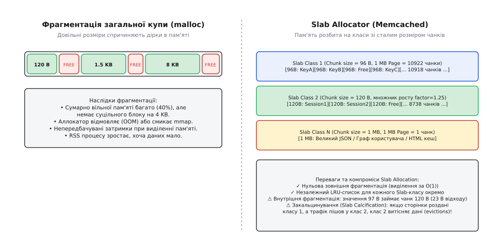
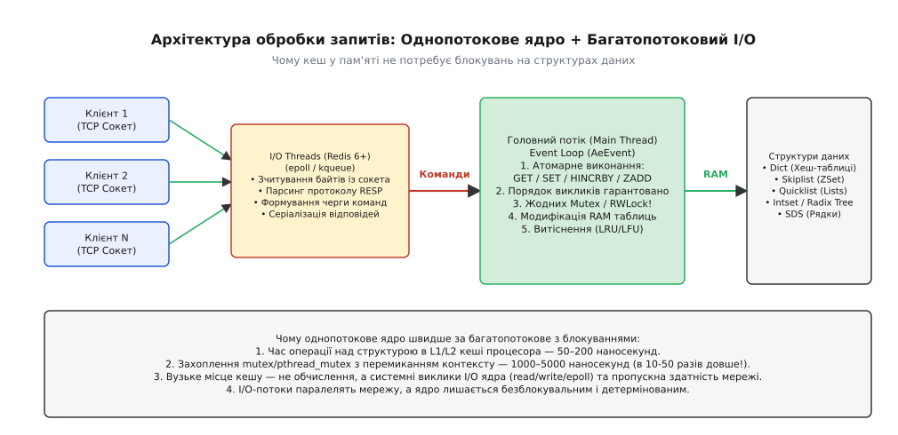
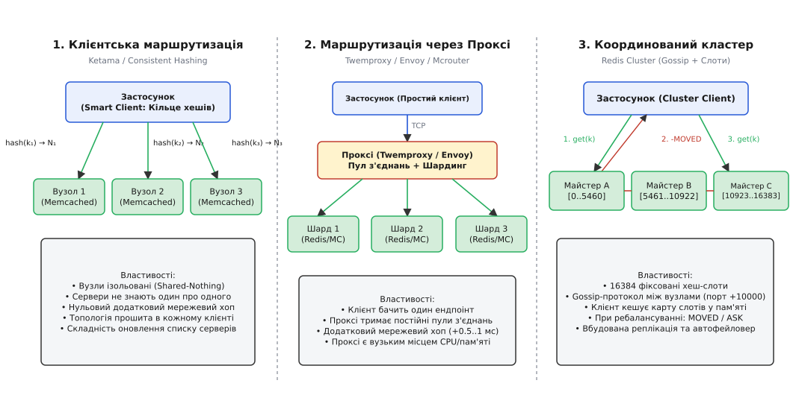
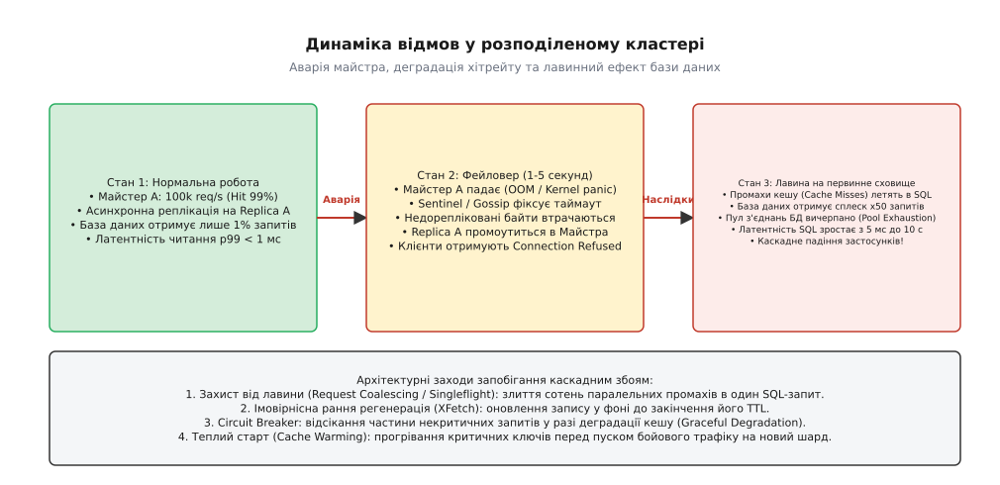

# Розподілений кеш (memcached/Redis-клас)

<preknowlist>
- [Хеш-таблиця](topic:sf-algorithms/hash-table) — базова структура даних «ключ — значення» з доступом за сталий час у пам'яті вузла.
- [Консистентне хешування](topic:sf-algorithms/consistent-hashing) — алгоритм розкладання ключів на кільце серверів зі стійкістю до зміни топології.
- [Політики витіснення кешу: LRU, LFU, CLOCK](topic:sf-data/cache-eviction-policies) — алгоритми звільнення оперативної пам'яті вузла при її переповненні.
- [Стратегії кешування](topic:sf-data/caching-strategies) — шаблони взаємодії застосунку, кешу та первинного сховища (Cache-Aside, Read-Through).
- [CAP-теорема](topic:sf-distributed/cap-theorem)` — компроміси між узгодженістю та доступністю при мережевих розділеннях.
</preknowlist>

Коли інтернет-магазин під час сезонного розпродажу отримує 300 000 запитів на секунду, первинна реляційна база даних опиняється під загрозою миттєвої відмови. Навіть якщо кожен SQL-запит оптимізовано до 5 мілісекунд, дискова підсистема NVMe та пул з'єднань бази даних вичерпують пропускну здатність уже на 10 000 операцій на секунду. Локальний кеш у пам'яті кожного окремого вебсервера (англ. *in-process cache*) не рятує: при 100 примірниках застосунку пам'ять дублюється в 100 разів, оновлення ціни товару на одному сервері залишає застарілі дані на решті 99, а перезапуск контейнера під час деплою спричиняє холодний старт і шквал запитів у базу.

Єдиний спосіб розірвати цю залежність — винести оперативну пам'ять в окремий незалежний шар: **розподілений кеш** (англ. *distributed cache*, від фр. *cacher* — «ховати», та лат. *distribuere* — «розподіляти»). Це кластер вузлів, які тримають дані виключно в оперативній пам'яті (RAM), віддають відповіді за 100–500 мікросекунд і масштабують місткість та пропускну здатність лінійно через горизонтальне шардування.

Історичний шлях від перших скриптів порятунку серверів LiveJournal до сучасних серверів складних структур даних детально розглянуто в [історії виникнення Memcached та Redis](topic:sf-distributed/distributed-cache/hist-distributed-cache.md).

---

## 1. Чому один сервер пам'яті не розв'язує задачу: фізичні межі одного вузла

Здавалося б, достатньо виділити один потужний сервер із 512 ГБ оперативної пам'яті та встановити на ньому екземпляр Redis або Memcached. Проте один фізичний вузол неминуче впирається у три апаратні стелі:

1. **Мережева пропускна здатність та обробка пакетів (PPS — Packets Per Second).** Мережева карта 10GbE здатна пропустити близько 1.25 ГБ/с. При середньому розмірі об'єкта 2 КБ та 300 000 запитів/с потік становить 600 МБ/с лише корисного навантаження. З урахуванням TCP/IP заголовків мережевий стек ядра Linux витрачає до 40% процесорного часу виключно на обробку апаратних переривань (SoftIRQ) та копіювання сокетних буферів.
2. **Пропускна здатність пам'яті та затримки шини (Memory Bandwidth).** Процесор звертається до оперативної пам'яті через контролери DDR4/DDR5 із латентністю 60–80 наносекунд на промах L3-кешу. Коли сотні тисяч запитів одночасно модифікують хеш-таблицю, кеш-лінії процесора постійно інвалідуються, знижуючи реальну швидкість роботи структур даних.
3. **Єдина точка відмови (SPOF — Single Point of Failure).** Аварія живлення, паніка ядра або перезавантаження єдиного сервера миттєво перенаправляє 100% навантаження на первинну базу даних, що спричиняє її каскадний колапс.

Розподілений кеш вирішує ці проблеми шляхом **партиціонування** (лат. *partitio* — «поділ»): простір ключів розбивається на частини (шарди), і кожен шард обслуговується ізольованим процесом на окремому ядрі чи сервері.

---

## 2. Дві філософії архітектури: Memcached проти Redis

Індустрія виробила два принципово різні підходи до організації розподіленої пам'яті:

```
                          ┌──────────────────────────────────────────────┐
                          │   Філософії розподіленого кешування          │
                          └──────────────────────┬───────────────────────┘
                                                 │
                   ┌─────────────────────────────┴─────────────────────────────┐
                   ▼                                                           ▼
       [ Модель Memcached ]                                        [ Модель Redis ]
   • Shared-Nothing (Тупий сервер)                             • Сервер структур даних
   • Багатопотоковий I/O (Worker Threads)                      • Однопотоковий Event Loop (+ I/O Threads)
   • Slab Allocator (Фіксовані чанки)                          • Динамічний malloc (jemalloc)
   • Тільки непрозорі рядки/блоби                              • Списки, Хеші, Сети, ZSet, Стріми
   • Немає реплікації і персистентності                        • Асинхронна реплікація, AOF/RDB
   • Маршрутизація цілком на клієнті                           • Вбудована кластеризація (Redis Cluster)
```

### Модель Memcached: «Тупий сервер — Розумний клієнт»

Сервер Memcached нічого не знає про існування інших серверів у кластері. Він не координує стан, не реплікує дані й не має консенсусу. 

Внутрішня архітектура Memcached оптимізована під роботу з багатоядерними процесорами:
- Головний потік приймає вхідні TCP-з'єднання й розподіляє їх між робочими потоками (англ. *worker threads*) за алгоритмом Round-Robin.
- Кожен робочий потік має власний цикл подій `libevent` і самостійно вичитує та парсить команди зі своїх сокетів.
- Доступ до глобальної хеш-таблиці та LRU-списків синхронізується за допомогою дрібногранулярних блокувань (англ. *fine-grained bucket locks*).

Щоб повністю усунути зовнішню фрагментацію оперативної пам'яті при частих перезаписах, Memcached використовує **Slab Allocator**. Пам'ять заздалегідь нарізається на сторінки розміром 1 МБ, а сторінки розподіляються між класами розмірів (Slab Classes):


*Порівняння фрагментації системної купи malloc та фіксованих slab-класів Memcached.*

Кожен Slab-клас містить чанки фіксованого розміру (наприклад, 96 байтів, 120 байтів, 150 байтів із коефіцієнтом росту за замовчуванням `1.25`). Запис розміром 100 байтів потрапляє в чанк на 120 байтів. Це створює незначну внутрішню фрагментацію (20 байтів відходу), але гарантує, що виділення та звільнення пам'яті виконується за сталий час `O(1)` без системних викликів `brk`/`mmap` і без виникнення нерозривних дірок у пам'яті.

> 🔧 **Навіщо це.** Якщо у вашому навантаженні переважають прості операції читання та запису важких серіалізованих JSON-документів або зображень розміром 10–500 КБ, а сервер має 64 ядра CPU і 256 ГБ RAM, Memcached забезпечує значно вищу утилізацію процесора та пропускну здатність на один хост завдяки нативній багатопотоковості без блокувань інтерпретаторів.

---

### Модель Redis: «Сервер структур даних»

Redis пішов протилежним шляхом. Його ядро є **однопотоковим циклом обробки подій** (англ. *single-threaded event loop*). Усі операції над даними в пам'яті виконуються строго послідовно в одному потоці.


*Модель подій Redis: багатопотоковий мережевий I/O та безблокувальний однопотоковий цикл виконання команд.*

Чому однопотокова модель виявилася надзвичайно продуктивною:
1. **Відсутність блокувань (Lock-Free).** Жодна операція над складною структурою (наприклад, вставка елемента в SkipList у складі Sorted Set) не потребує м'ютексів, `pthread_rwlock` чи атомарних інструкцій CAS процесора.
2. **Нульовий оверхед на перемикання контексту (Context Switching).** Потік процесора постійно утилізує L1/L2 кеші інструкцій і даних, не витісняючи їх чужими потоками.
3. **Атомарність будь-якої складної команди.** Команди на кшталт `HINCRBY` (інкремент поля хешу), `LPUSH` + `LTRIM` (додавання в список із фіксацією довжини) або виконання транзакційних блоків `MULTI`/`EXEC` виконуються атомарно за своєю природою — жоден інший клієнт не може вклинитися між операціями.

Починаючи з версії Redis 6.0, мережеве введення-виведення (вичитування байтів із сокетів, парсинг протоколу RESP та запис відповідей назад у дескриптори) було винесено в окремі **I/O-потоки**, тоді як виконання команд над структурами даних залишилося строго однопотоковим.

Мережеві специфікації протоколів обох систем, включно з форматами RESP2/RESP3 та бінарними фреймами, задокументовано в [специфікації протоколів кешування Memcached та Redis](topic:sf-distributed/distributed-cache/api-cache-protocols.md).

---

## 3. Топології розподіленого кластера та маршрутизація ключів

Як клієнтський застосунок дізнається, на який саме з 50 серверів кластера відправити команду `GET user:1001`? Існує три базові топології:


*Три архітектури шардингу: пряма маршрутизація клієнтом, централізований проксі та повнозв'язний кластер.*

### 1. Клієнтська маршрутизація (Client-side Sharding)

Клієнтська бібліотека тримає повний список адрес усіх серверів і використовує алгоритм **консистентного хешування (Ketama Hash Ring)**:
1. Сервери розкладаються на умовному кільці `[0, 2³² - 1]`. Кожен фізичний сервер отримує 100–256 віртуальних вузлів (vnodes) для забезпечення рівномірності.
2. Клієнт обчислює хеш ключа: `hash = FNV1a("user:1001")`.
3. За допомогою двійкового пошуку `std::lower_bound` у впорядкованому масиві клієнт за `O(log(N · V))` знаходить найближчий вузол за годинниковою стрілкою.
4. Запит відправляється безпосередньо в TCP-сокет цього сервера.

**Переваги:** Мінімально можлива латентність (нуль додаткових мережевих хопів).  
**Недоліки:** Зміна конфігурації серверів вимагає оновлення налаштувань у всіх примірниках клієнтських застосунків.

Робочу реалізацію такого клієнта з кільцем хешування та сокетним пулом реалізовано мовами C та C++ у [проєкті побудови клієнта розподіленого кешу](topic:sf-distributed/distributed-cache/proj-distributed-cache-client.md).

---

### 2. Маршрутизація через Проксі (Proxy-based Routing)

Між застосунком та кеш-серверами встановлюється шар спеціалізованих проксі: **Twemproxy (nutcracker)** від Twitter, **mcrouter** від Meta або **Envoy**.

- Клієнти підключаються до локального або центрального проксі так, ніби це єдиний сервер.
- Проксі бере на себе шардування, парсинг ключів, конвеєризацію запитів та підтримку постійного пулу TCP-з'єднань до бекендів.

**Переваги:** Клієнти залишаються гранично простими; застосунки на PHP/Python, які не можуть тримати постійні з'єднання між HTTP-запитами, не перевантажують Redis сотнями тисяч відкриттів сокетів (SYN/ACK storm).  
**Недоліки:** Додатковий мережевий хоп додає 0.3–1.0 мілісекунди затримки; проксі стає додатковим вузлом відмови та споживачем CPU.

---

### 3. Серверний кластер (Redis Cluster: 16384 хеш-слоти)

Redis Cluster реалізує децентралізовану схему без проксі та без консистентного кільця на клієнті. Весь простір ключів ділиться на фіксовану кількість — **16384 хеш-слоти**:

```
slot = CRC16(key) mod 16384
```

Слоти розподіляються між основними майстер-вузлами (наприклад, у кластері з 3 майстрів: Вузол A отримує слоти `0..5460`, Вузол B — `5461..10922`, Вузол C — `10923..16383`).

- **Gossip-протокол:** Вузли кластера спілкуються між собою через окремий службовий порт (базовий порт + 10000) за допомогою протоколу пліток (англ. *gossip protocol*), обмінюючись інформацією про стан кластера, доступність вузлів та карту закріплення слотів.
- **Розумний клієнт (Smart Cluster Client):** Під час старту клієнт завантажує карту слотів через команду `CLUSTER SLOTS` і кешує її локально.
- **Протокол редиректів (`-MOVED` та `-ASK`):** Якщо клієнт відправив запит на вузол, який більше не володіє цим слотом (наприклад, після ребалансування або аварії), сервер повертає помилку:
  ```
  -MOVED 12182 10.0.1.45:6379
  ```
  Клієнт оновлює свою внутрішню таблицю маршрутизації та прозоро повторює запит на нову адресу.

```
Спеціальний випадок: Хеш-теги (Hash Tags)
За замовчуванням дві суміжні сутності можуть потрапити в різні слоти:
CRC16("user:100:profile") mod 16384 = 4210  (Вузол A)
CRC16("user:100:orders")  mod 16384 = 11980 (Вузол C)

У Redis Cluster операції над кількома ключами (MGET, транзакції MULTI/EXEC, LUA-скрипти)
дозволені ТІЛЬКИ якщо всі ключі належать одному слоту!
Рішення — використання фігурних дужок {}:
CRC16("{user:100}:profile") -> хешується тільки рядок "user:100" -> Слот 8712 (Вузол B)
CRC16("{user:100}:orders")  -> хешується тільки рядок "user:100" -> Слот 8712 (Вузол B)
```

Математичні доведення стійкості розподілу ключів, виведення формул деградації коефіцієнта влучання та аналіз дисперсії віртуальних вузлів зібрано в [математичному аналізі розподілу ключів та хітрейту](topic:sf-distributed/distributed-cache/math-cache-distribution-and-hitrate.md).

---

## 4. Реплікація, узгодженість і дилема збереженості даних

Розподілені кеші оптимізовані під продуктивність, тому в контексті [CAP-теореми](topic:sf-distributed/cap-theorem) вони класифікуються як **AP-системи** (Availability / Partition Tolerance) або системи з **м'яким станом** (англ. *eventual consistency*).

### Механізм асинхронної реплікації Redis

Майстер-вузол приймає операції запису, фіксує їх у своїй пам'яті, повертає клієнту відповідь `+OK` і паралельно транслює потік команд реплікації (англ. *replication stream*) у неблокувальний сокет реплік:

```
[Клієнт] ──► 1. SET key val ──► [Майстер] ── (Асинхронний стрім) ──► [Репліка]
[Клієнт] ◄── 2. +OK (0.2 мс) ────┘  │
                                    └── (Аварія живлення до відправки стріму!)
                                        => Дані ВТРАЧЕНО назавжди!
```

Через асинхронну природу реплікації існує ненульове **вікно втрати даних** (англ. *data loss window*). Якщо майстер підтвердив запис клієнту і зазнав апаратного збою до того, як байти дійшли по мережі до репліки, після виявлення збою та підвищення репліки до статусу майстра (Failover) цей запис безповоротно зникає.

> 🔧 **Навіщо це.** Кеш не є системою гарантованого зберігання (Source of Truth). Спроба ввімкнути синхронну реплікацію (команда `WAIT` у Redis) змушує майстер блокуватися до отримання підтверджень від реплік, що збільшує латентність запису з 0.2 мс до 5–20 мс і нівелює головну перевагу кешу в пам'яті.


*Каскадні ефекти падіння вузла кешу: промахи, вичерпання пулу з'єднань бази даних та захисні контури.*

---

## 5. Операційні пастки та аварійні сценарії у продакшні

### 1. Гарячі ключі та «проблема знаменитості» (Hot Keys)

Шардування розподіляє простір ключів, але не розподіляє інтенсивність трафіку до одного конкретного ключа. Якщо на профіль популярного користувача підписано 10 мільйонів людей, запити `GET user:celebrity` генерують 200 000 req/s. Усі ці запити за формулою хешування потрапляють на **один і той самий фізичний шард**, перевантажуючи його CPU до 100%, тоді як решта 49 серверів кластера простоюють з утилізацією 2%.

**Методи нейтралізації:**
- **L1 Near-Cache (Дворівневий кеш):** Застосунок зберігає копію гарячого ключа в локальній пам'яті процесу на 1–5 секунд із коротким TTL.
- **Розщеплення ключа (Key Salting / Read Replicas):** Ключ записується в кеш із випадковими суфіксами: `hot_item#1`, `hot_item#2`, ..., `hot_item#16`. Клієнт під час читання випадковим чином обирає один із суфіксів `rand(1, 16)`, рівномірно розмазуючи навантаження по 16 різних шардах кластера.

---

### 2. Великі ключі (Big Keys) та блокування Event Loop

Запис у Redis значення типу JSON або списку розміром 50 МБ під одним ключем створює приховану міну:
- Команда читання `HGETALL` або `GET` такого ключа змушує однопотоковий цикл Redis серіалізувати та відправляти 50 МБ даних. На гігабітному каналі це блокує ядро сервера на 50–200 мілісекунд! Упродовж цього часу **жоден інший запит до цього шарда не обслуговується**, у клієнтів спрацьовують таймаути й формується лавина повторних спроб.
- Видалення великого ключа командою `DEL` викликає виклик `free()` для мільйонів елементів пам'яті, що заморожує потік на сотні мілісекунд (лікується асинхронним видаленням `UNLINK`).

---

### 3. Закальцинування пам'яті в Memcached (Slab Calcification)

Якщо під час запуску системи 80% трафіку становили короткі рядки (Slab Class 1, 96 байтів), Memcached виділить майже всі доступні сторінки пам'яті (1 МБ) під цей клас. Якщо згодом характер навантаження змінився і почали надходити об'єкти по 2 КБ (Slab Class 10), цьому класу дістанеться лише кілька сторінок. 

У результаті Memcached почне агресивно **витісняти щойно записані дані за LRU** (англ. *eviction storm*) у класі 10, маючи при цьому гігабайти напівпорожньої, але заблокованої пам'яті в класі 1.

**Рішення:** Увімкнення фонового перерозподілу сторінок — опція `slab_automove 1` та `slab_reassign` у сучасних версіях Memcached.

---

### 4. Гримуча отара та лавина промахів (Thundering Herd / Cache Stampede)

Коли популярний ключ із високою частотою звернень втрачає чинність (закінчився TTL) або вимивається витісненням, тисячі паралельних потоків одночасно отримують промах кешу (`Cache Miss`) і одночасно звертаються до бази даних для повторного обчислення значення.

Для захисту використовується техніка злиття запитів (англ. *request coalescing / singleflight*), розподілені блокування або алгоритм імовірнісного дострокового оновлення **XFetch**:

```
XFetch умова оновлення:
- delta · β · ln(rand()) > (TTL - time())
де delta — час обчислення значення в базі даних,
   β — коефіцієнт агресивності (типово β = 1.0),
   rand() — випадкове число від 0 до 1.
```

---

## 6. Порівняльна матриця архітектурних рішень

| Критерій оцінки | Memcached | Redis Standalone / Sentinel | Redis Cluster | Modern Multi-threaded (KeyDB / Dragonfly) |
| :--- | :--- | :--- | :--- | :--- |
| **Цільове призначення** | Простий високонавантажений K/V кеш | Багаті структури даних, кеш із транзакціями | Горизонтально масштабоване сховище RAM | Багатопотоковий Redis-сумісний надпродуктивний кеш |
| **Модель потоків** | Багатопотоковий (Shared Memory) | 1 потік ядра (+ I/O потоки) | 1 потік на шард | Багатопотоковий (Shared-Nothing / Shared-Memory) |
| **Підтримка типів даних** | Лише сирий бінарний рядок/блоб | Strings, Hashes, Lists, Sets, ZSets, Streams | Strings, Hashes, Lists, Sets, ZSets (з Hash Tags) | Повна сумісність із RESP |
| **Механізм шардингу** | Клієнтський (Ketama Ring) або Проксі | Відсутній (вертикальне масштабування) | Вбудовані 16384 хеш-слоти | Вбудований або клієнтський |
| **Персистентність** | Відсутня | RDB знімки + AOF журнал | RDB + AOF на кожному майстрі | Спеціалізовані швидкі знімки |
| **Складність експлуатації** | Мінімальна (тупі вузли) | Середня (потребує Sentinel) | Висока (Gossip, ребалансування слотів) | Середня |

---

## 7. Архітектурний синтез: як обрати рішення

1. **Обирайте Memcached**, якщо ваша система оперує виключно атомарними об'єктами (кеш вебсторінок, серіалізовані сесії, кеш результатів GraphQL/REST відповідей), сервери мають величезну кількість ядер (32–128 ядер на вузол), а втрата будь-якого вузла не є критичною для бізнесу.
2. **Обирайте Redis Standalone / Sentinel**, якщо обсяг даних уміщається в оперативну пам'ять одного сервера (до 64–128 ГБ), але критично необхідні складні типи даних (лічильники рейт-лімітів, сесії реального часу, геопросторові індекси, блокування Redlock).
3. **Обирайте Redis Cluster**, якщо сумарний обсяг оперативної пам'яті перевищує можливості одного сервера (терабайти RAM) або сумарна кількість операцій перевищує 500 000 запитів/с і вимагає горизонтального розподілу по десятках процесорних ядер.
