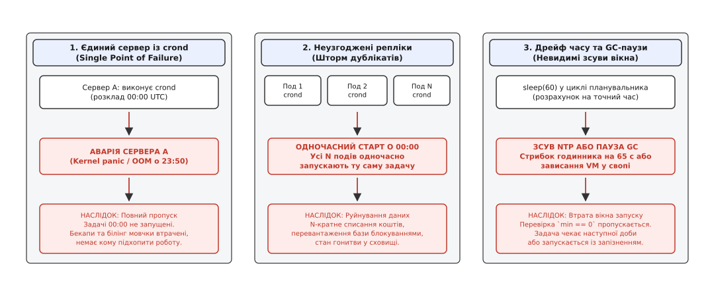
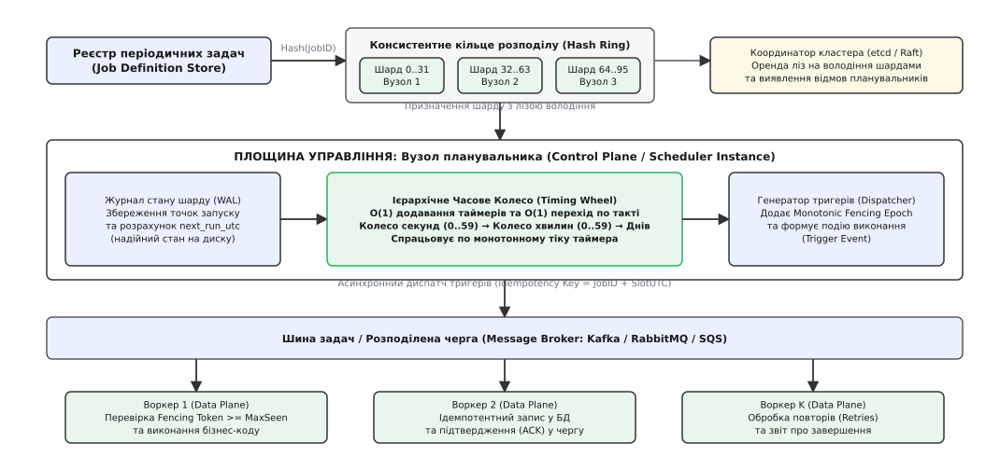
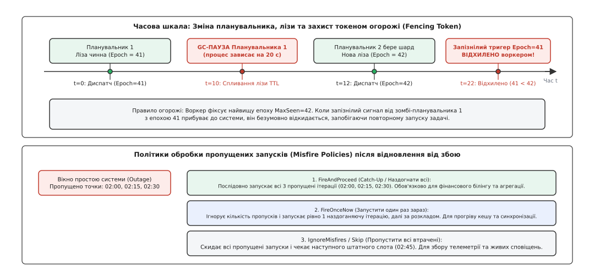

# Розподілений cron: узгоджений запуск періодичних задач у кластері

<preknowlist>
- [Розподілені замки й лізи](root:sf-distributed/distributed-locks) — взаємне виключення без спільної пам'яті вимагає обмеженого строку оренди та обов'язкового захисту монотонними токенами огорожі.
- [Вибори лідера як прикладний патерн](root:sf-distributed/leader-election) — координація через консенсус виділяє один активний вузол для прийняття рішень, але не захищає від появи старих «зомбі-лідерів» під час мережевих розривів.
- [Шардинг](root:sf-distributed/partitioning-sharding) — горизонтальне розділення простору ключів на незалежні сегменти для усунення вузьких місць централізації.
- [Черга повідомлень (point-to-point)](root:sf-distributed/message-queue) — асинхронний буфер для згладжування навантаження та надійного передавання завдань пулу виконавців.
- [Таймаути і бюджет часу](root:sf-distributed/timeouts-deadlines) — будь-яка мережева взаємодія зобов'язана мати дедлайн, а прострочені операції підлягають скасуванню.
</preknowlist>

Опівночі за всесвітнім координованим часом (00:00:00 UTC) хмарна платформа онлайн-банкінгу має запустити щоденну процедуру нарахування відсотків за депозитами та генерацію фінансових виписок. Спочатку бекенд працював на єдиній віртуальній машині під керуванням демона `crond`. Коли кількість користувачів зросла до кількох мільйонів, інфраструктуру перевели на шістнадцять контейнерів у кластері Kubernetes, розміщених у трьох зонах доступності для забезпечення високої відмовостійкості. Рівно о 00:00:00 UTC внутрішні планувальники на всіх шістнадцяти репліках одночасно зафіксували настання нової доби. Протягом кількох сотень мілісекунд шістнадцять паралельних процесів почали списувати абонентську плату з одних і тих самих банківських рахунків, відправили клієнтам шістнадцять однакових квитанцій, вичерпали ліміти запитів до платіжних шлюзів і заблокували спільну базу даних каскадом дедлоків у таблиці транзакцій.

Коли чергова зміна інженерів спробувала виправити катастрофу, прив'язавши запуск періодичних завдань до одного спеціально виділеного пода, система зіткнулася зі зворотним боком наївної централізації: о 23:45 на фізичному сервері виділеного пода сталася апаратна аварія пам'яті (Kernel Panic). Оскільки решта реплік вважали себе звичайними обробниками трафіку і не стежили за розкладом, нічні задачі просто не запустилися. Про повну відсутність бекапів, фінансових звітів та клієнтських нарахувань компанія дізналася лише вранці після дзвінків регуляторів та обурених клієнтів.

Ці дві полярні аварії демонструють фундаментальну суперечність: у розподіленому середовищі періодичний запуск коду не можна довірити ані хаотичній групі рівноправних реплік, ані єдиному статичному серверу. Потрібен механізм, який гарантує, що кожна запланована задача запуститься рівно один раз у призначений момент часу, навіть якщо окремі вузли кластера раптово гинуть, мережа зазнає розривів, а локальні годинники серверів розходяться на секунди.

## Чому класичний Unix cron безсилий у розподіленому середовищі

Системний демон `cron` (від грецького *χρόνος* — «час»), розроблений для односерверних операційних систем Unix, спирається на три негласні припущення, які автоматично руйнуються в будь-якому мережевому кластері:

1. **Єдине неподільне джерело фізичного часу**: локальне ядро операційної системи отримує апаратні переривання від єдиного кварцового таймера материнської плати. Демон `crond` щохвилини перевіряє стан локального годинника і запускає відповідні процеси. У розподіленому середовищі фізичного часу як єдиної точки відліку не існує. Кожен сервер має власний генератор тактової частоти, що зазнає температурного дрейфу. Навіть за умови постійної синхронізації через протокол NTP (англ. *Network Time Protocol*) годинники на різних серверах розходяться на десятки мілісекунд, а під час коригування можуть здійснювати немонотонні стрибки вперед або назад.
2. **Монолітна модель відмов (все або нічого)**: на одному комп'ютері або працює вся операційна система разом із демоном `crond`, або сервер вимкнено повністю. У розподілених системах панує часткова відмова: вузол може продовжувати відповідати на мережеві запити перевірки доступності (Health Checks), але зависнути на двадцять секунд у паузі збирача сміття (GC Pause) або в очікуванні відповіді від заблокованого мережевого диска.
3. **Нерозривне злиття планування та виконання**: класичний `crond` сам вираховує хвилину запуску і сам породжує дочірній процес через системні виклики `fork()` та `exec()`. Якщо запущена задача споживає 100% процесора або вичерпує оперативну пам'ять (OOM), вона паралізує сам демон планувальника, через що всі наступні розклади мовчки зсуваються або пропускаються.


*Три анатомічні пастки нерозподіленого планування: єдина точка відмови призводить до повної втрати запуску, несинхронізовані репліки породжують шторм дублікатів, а дрейф часу та паузи процесів непомітно вибивають задачі з розкладу.*

Як показує [історія еволюції від /etc/crontab до розподілених оркестраторів](root:sf-distributed/distributed-cron/hist-unix-cron-to-distributed.md), перехід до горизонтального масштабування вимагає повного розділення архітектури на дві незалежні площини:
- **Площина управління (Control Plane / Scheduler)**: відповідає виключно за відповідь на питання *«Коли і яку задачу треба запустити?»*. Вона відстежує розклад, управляє чергою таймерів і формує легковагі повідомлення-тригери.
- **Площина даних (Data Plane / Workers)**: відповідає за відповідь на питання *«Як виконати прикладний код задачі?»*. Вона отримує тригери з черги, виділяє ресурси, виконує бізнес-логіку, обробляє повтори та звітує про статус завершення.

## Фізичний час проти монотонного лічильника: пастки дрейфу та корекції NTP

Розподілений планувальник не може покладатися на системний настінний годинник (англ. *wall-clock time*, виклик `CLOCK_REALTIME` або `gettimeofday()`) для внутрішнього відліку інтервалів між спрацьовуваннями.

Кварцові генератори сучасних серверів мають виробничу похибку та температурну нестабільність частоти від 10 до 50 ppm (частин на мільйон). Це означає, що за відсутності мережевої синхронізації годинник сервера дрейфує на 1–5 секунд щодоби. Для усунення розбіжностей демони NTP періодично коригують системний час:
- Якщо похибка невелика (до 128 мс), демон NTP плавно сповільнює або прискорює хід часу зі швидкістю до 0.5 мс на секунду (механізм *slewing* через виклик `adjtime()`).
- Якщо похибка перевищує 128 мс (наприклад, після виходу віртуальної машини з режиму сну чи міграції між гіпервізорами), демон NTP здійснює миттєвий стрибок часу (*step adjustment* через виклик `settimeofday()`).

Стрибок часу є фатальним для простого циклу опитування розкладу:
- **Стрибок назад на 65 секунд**: планувальник повторно входить у хвилину, яку він уже щойно обробив, і повторно відправляє всі щохвилинні та щоденні задачі на виконання, породжуючи подвійне списання коштів чи дублювання звітів.
- **Стрибок уперед на 65 секунд**: планувальник миттєво перестрибує цілу астрономічну хвилину. Усі задачі, призначені на пропущений проміжок часу, просто ігноруються, оскільки умова `current_minute == scheduled_minute` жодного разу не набуває істинного значення.

З цієї причини розподілений планувальник зобов'язаний розділяти дві часові сутності:
1. **Шкала розкладу (UTC Timestamp)**: глобальний календарний час за стандартом ISO-8601, у якому формулюються бізнес-правила («щодня о 00:00:00 UTC»).
2. **Шкала прогресу планувальника (Monotonic Ticks)**: неперервний лічильник тактової частоти процесора (`CLOCK_MONOTONIC_RAW` у Linux або `std::chrono::steady_clock` у C++), який за жодних обставин не може стрибати назад, не зазнає впливу протоколу NTP і слугує єдиним джерелом тактування черги таймерів.

## Архетипи побудови розподілених планувальників

Світова інженерна практика виробила три основні архітектурні підходи до побудови відмовостійких планувальників, кожен із яких має чіткі межі застосовності та компроміси щодо продуктивності.

### 1. Централізований планувальник із вибором лідера (Leader-Leased Scheduler)

У цій моделі всі екземпляри сервісу беруть участь у виборах єдиного координатора за допомогою розподіленого консенсусу (наприклад, etcd, Consul або ZooKeeper). Вузол, який успішно захопив лізу лідера на строк `T_lease` (наприклад, 15 секунд), стає єдиним активним планувальником у кластері:

```text
Вузол 1 (Лідер: утримує лізу в etcd) ──► Сканує розклад ──► Відправляє тригер у чергу
Вузол 2 (Стендбай: чекає відмови)      ──► Спить
Вузол 3 (Стендбай: чекає відмови)      ──► Спить
```

- **Переваги**: простота реалізації; гарантія відсутності конкуренції між кількома планувальниками в штатному режимі; простота налагодження.
- **Вузькі місця**: масштабованість обмежена ресурсами одного процесора. Якщо в системі зареєстровано сотні тисяч розкладів, один лідер не встигає розраховувати часові точки. Крім того, виникає затримка перемикання при відмові (Failover Lag): якщо лідер гине за 2 секунди до настання 00:00:00, а ліза діє ще 10 секунд, новий лідер буде обраний лише о 00:00:08, через що критичний запуск буде затримано або пропущено.

### 2. Конкурентне опитування бази даних (Database as a Distributed Queue)

Замість вибору лідера всі періодичні задачі зберігаються у реляційній базі даних у спільній таблиці розкладів. Кожен запис містить колонки `job_id`, `cron_expression`, `next_run_at` та `status`. Усі репліки сервісу раз на секунду виконують конкурентний запит на захоплення готових до виконання рядків:

```sql
UPDATE cron_jobs
SET status = 'RUNNING',
    locked_by = 'worker-pod-4',
    locked_until = NOW() + INTERVAL '5 minutes'
WHERE id IN (
    SELECT id
    FROM cron_jobs
    WHERE next_run_at <= NOW()
      AND (status = 'IDLE' OR locked_until < NOW())
    ORDER BY next_run_at ASC
    LIMIT 50
    FOR UPDATE SKIP LOCKED
)
RETURNING *;
```

Конструкція `FOR UPDATE SKIP LOCKED` дозволяє транзакціям пропускати вже заблоковані сусідніми процесами рядки без очікування, що запобігає виникненню взаємних блокувань.

- **Переваги**: відсутність потреби в окремому кластері координації; автоматичне збереження стану на диску; природна стійкість до падіння будь-якого воркера.
- **Вузькі місця**: колосальне навантаження на підсистему вводу-виводу (IOPS) бази даних через безперервне щосекундне опитування індексів; деградація продуктивності через утворення «мертвих кортежів» (Dead Tuples) у PostgreSQL під час частих оновлень; неможливість масштабування понад 5 000–10 000 спрацьовувань на секунду через конкуренцію за B-tree індекс стовпця `next_run_at`.

### 3. Шардоване консистентне кільце з часовими колесами (Partitioned Ring Scheduler)

Для систем масштабу сотень тисяч і мільйонів розкладів застосовують повне горизонтальне шардування. Простір періодичних завдань розбивається на фіксовану кількість віртуальних шардів (наприклад, 1024 шарди). Кожен активний вузол планувальника бере на себе обслуговування певної підмножини шардів, розподілених через консистентне хешування:

```text
shard_id = MurmurHash3(job_id) % 1024
```

Кожен вузол завантажує завдання своїх шардів у високопродуктивну структуру пам'яті — **ієрархічне часове колесо**, і при настанні потрібного такту публікує подію-тригер у розподілений брокер повідомлень (Kafka, RabbitMQ або AWS SQS).


*Архітектура масштабованого розподіленого cron: простір задач шардується за консистентним кільцем, планувальники обчислюють тригери через часові колеса в пам'яті та транслюють їх у брокер повідомлень для конкурентного пулу воркерів.*

## Ієрархічні часові колеса: планування за константний час O(1)

Коли кількість активних розкладів на одному вузлі перевищує 100 000, класичні структури даних пошуку найближчої події стають обчислювальним гальмом. Зберігання таймерів у двійковій купі (Min-Heap) або червоно-чорному дереві (`std::set` чи `java.util.TreeSet`) вимагає складності `O(log N)` на кожну операцію додавання, видалення та коригування задачі. При 50 000 спрацьовувань на секунду процесор витрачає більшість часу на перебалансування вузлів дерева.

Для досягнення строго константного часу `O(1)` застосовують алгоритм **часового колеса** (англ. *Timing Wheel*), запропонований Джорджем Варгезе та Тоні Лауком у 1987 році.

### Принцип роботи однорівневого часового колеса

Часове колесо є круговим масивом із `N` слотів (наприклад, `N = 60` слотів, де кожен слот відповідає інтервалу в 1 секунду, покриваючи загальний діапазон у 60 секунд). Планувальник підтримує цілочисельний індекс поточного слота `current_slot` і монотонний лічильник часу `current_time`.

Коли в систему додається задача із затримкою виконання `delay` секунд:
1. Планувальник обчислює кількість тактів: `ticks = delay / tick_duration`.
2. Розраховує цільовий слот у масиві: `target_slot = (current_slot + ticks) % N`.
3. Вираховує кількість повних обертів колеса, які задача повинна «перечекати», перш ніж спрацювати: `rounds = ticks / N`.
4. Вставляє задачу у двозв'язний список відповідного слота `slots[target_slot]`.

Операція додавання виконується за `O(1)` операцій з пам'яттю:

```text
Слот 0  ──► [Задача A (rounds=0)] ──► [Задача B (rounds=2)]
Слот 1  ──► [Задача C (rounds=1)]
...
Слот 59 ──► [Задача D (rounds=0)]
```

Щосекунди апаратний або системний таймер генерує тік:
1. `current_slot` збільшується на одиницю: `current_slot = (current_slot + 1) % N`.
2. Планувальник проходить списком задач у новому слоті:
   - Якщо у задачі `rounds > 0`, вона лишається в списку, але її лічильник зменшується: `rounds = rounds - 1`.
   - Якщо у задачі `rounds == 0`, вона негайно вилучається зі списку та відправляється на виконання.

### Ієрархічні часові колеса (Hierarchical Timing Wheels)

Якщо діапазон можливих затримок становить не хвилини, а дні або місяці, використання одного колеса з лічильником обертів `rounds` призводить до деградації: у кожному слоті накопичуються довгі списки задач, які доводиться марно сканувати щосекунди.

Рішенням є **ієрархічне часове колесо**, побудоване за аналогією до механічного годинника зі стрілками секунд, хвилин, годин і днів:
- **Колесо 1 (Секунди)**: 60 слотів по 1 секунді (діапазон 1 хвилина).
- **Колесо 2 (Хвилини)**: 60 слотів по 1 хвилині (діапазон 1 година).
- **Колесо 3 (Години)**: 24 слоти по 1 годині (діапазон 1 доба).
- **Колесо 4 (Дні)**: 30 слотів по 1 добі (діапазон 1 місяць).

Коли хвилинне колесо робить один крок (раз на 60 секунд), усі задачі з його поточного слота «каскадуються» (переміщуються) у відповідні слоти секундного колеса. Завдяки цьому обхід списків відбувається лише тоді, коли подія дійсно наближається до моменту виконання. Детальний аналіз та практичний код шардованого таймера наведено у [робочій реалізації розподіленого планувальника](root:sf-distributed/distributed-cron/proj-distributed-scheduler.md).

## Ілюзія «рівно один раз»: генерація з огорожею та ідемпотентність

Найпоширеніша ілюзія серед системних розробників — спроба змусити розподілений планувальник забезпечити виконання задачі строго «рівно один раз» (Exactly-Once Execution) виключно власними силами.

Через теорему FLP (Фішера — Лінча — Патерсона) та проблему двох генералів в асинхронній мережі з ненадійними каналами та частковими відмовами вузлів неможливо гарантувати, що повідомлення-тригер буде надіслане і оброблене фізично в одному екземплярі. Якщо планувальник надіслав тригер у чергу, але мережа обірвалася до отримання підтвердження (ACK), планувальник зобов'язаний повторити відправку, що створює потенційний дублікат.

Тому промисловий розподілений cron будується на фундаментальному розподілі відповідальності:
1. **Планувальник гарантує доставку тригера «не менше одного разу» (At-Least-Once Triggering)**: жодна подія не буде втрачена навіть при падінні вузла в момент диспатчу.
2. **Виконавчий рівень гарантує обробку «не більше одного разу» (At-Most-Once Processing)**: система захищається від дублікатів через **токени огорожі (Fencing Tokens)** та **бізнес-ідемпотентність**.

### Токени огорожі при зміні лідерства

Уявімо критичний сценарій: Планувальник 1 володіє шардом номер 5 і має лізу до позначки часу `t = 10`. О 00:00:00 він готує тригер для щомісячного білінгу, але за мікросекунду до відправки в мережу процес потрапляє у 20-секундну GC-паузу Stop-the-world. 

Оскільки серцебиття припинилося, координатор кластера (etcd) чесно фіксує спливання лізи на 10-й секунді і передає шард номер 5 Планувальнику 2. Координатор видає Планувальнику 2 новий номер епохи — токен огорожі `fencing_epoch = 42` (тоді як у старого планувальника була епоха `41`). Планувальник 2 виявляє прострочений запуск і негайно надсилає тригер у чергу з токеном `42`. Воркер виконує задачу і фіксує в базі даних: `highest_seen_epoch = 42`.

Через 10 секунд Планувальник 1 прокидається від GC-паузи. Він не знає, що минув час, і відправляє сформований раніше тригер зі старою епохою `41`. Повідомлення прибуває до системи. Воркер порівнює токен повідомлення із зафіксованим у базі: `41 < 42`. Запізнілий сигнал «зомбі-планувальника» негайно відкидається.


*Анатомія відмовостійкості: верхня шкала показує блокування запізнілих зомбі-тригерів монотонними епохами огорожі; нижня секція ілюструє поведінку трьох базових політик пропуску після відновлення від системного збою.*

### Ключі ідемпотентності для воркерів

Окрім перевірки епохи координатора, кожен тригер містить детермінований **ключ ідемпотентності** (англ. *Idempotency Key*), сформований із комбінації ідентифікатора задачі та канонічного астрономічного моменту запуску:

```text
idempotency_key = "billing-monthly-settlement:2026-09-01T00:00:00.000Z"
```

Коли воркер починає обробку задачі, він виконує атомарну транзакцію вставки у таблицю виконання:

```sql
INSERT INTO cron_executions (idempotency_key, job_id, status, started_at)
VALUES ('billing-monthly-settlement:2026-09-01T00:00:00.000Z', 'billing-monthly-settlement', 'RUNNING', NOW())
ON CONFLICT (idempotency_key) DO NOTHING;
```

Якщо запит повертає нуль змінених рядків, це означає, що інший воркер уже взяв цей квант задачі в роботу або успішно його завершив. Повторне виконання блокується на рівні первинного ключа сховища.

## Політики пропущених запусків (Misfire Policies)

Що має відбутися, якщо весь дата-центр був знеструмлений протягом трьох годин (наприклад, з 02:00 до 05:00 UTC), а в системі було заплановано сотні щогодинних і щохвилинних задач?

Для вирішення цієї дилеми кожна періодична задача обов'язково конфігурується параметром `grace_period` (допустиме вікно запізнення, наприклад 60 секунд) та однією з трьох формальних політик пропуску запуску (англ. *Misfire Policies*), описаних у [специфікації контракту розподіленого cron](root:sf-distributed/distributed-cron/api-distributed-cron-spec.md):

1. **`FireAndProceed` (Повний хронологічний наздогін)**: планувальник розраховує всі часові кванти, які потрапили у вікно простою `[02:00, 05:00]`, і генерує послідовну чергу тригерів для кожної пропущеної точки. Якщо задача мала виконуватися щогодини, вона буде виконана рівно три рази поспіль для точок 02:00, 03:00 та 04:00. Це критично важливо для фінансового білінгу, генерації регулярних бухгалтерських проводок та нарізки часових партицій бази даних, де кожен проміжок часу містить унікальні дані.
2. **`FireOnceNow` (Одноразова компенсація)**: планувальник відкидає накопичений лічильник пропусків і відправляє рівно один компенсаційний тригер у момент відновлення системи (о 05:00), після чого повертається до звичайного календаря. Ця політика ідеально підходить для задач прогріву кешів, оновлення пошукових індексів або синхронізації довідників, де багаторазовий запуск поспіль не має сенсу і лише перевантажить базу даних.
3. **`IgnoreMisfires` / `Skip` (Повний пропуск)**: планувальник безповоротно списує всі минулі слоти і просто встановлює наступний таймер на найближчу майбутню точку за розкладом (наприклад, 06:00). Така стратегія незамінна для надсилання push-сповіщень користувачам («Ранковий дайджест новин») або збору поточної телеметрії із сенсорів, де історичні дані втратили актуальність.

## Шторм опівночі та фазове тремтіння (Jitter)

У великих організаціях понад 70% усіх створених розробниками періодичних завдань мають конфігурацію `0 0 * * *` (рівно опівночі) або `0 * * * *` (на початку кожної години).

Це створює класичну проблему **шторму опівночі (Midnight Thundering Herd)**: о 00:00:00.000 UTC сотні сервісів одночасно генерують сотні тисяч важких SQL-запитів до аналітичних сховищ, перевантажують пул з'єднань з базами даних і забивають черги воркерів. Затримки сервісів різко підскакують у десятки разів (Latency Spike), а через кілька хвилин кластер знову повертається до стану простою.

Для усунення пікових навантажень розподілений cron застосовує техніку **детермінованого фазового тремтіння (Deterministic Jitter)**. Замість того, щоб запускати задачу строго о `00:00:00`, планувальник додає псевдовипадкове, але стабільне для конкретної задачі часове зміщення `delta_t`:

```text
delta_t = MurmurHash3(job_id) % max_jitter_window
actual_run_time = scheduled_time + delta_t
```

Якщо `max_jitter_window` становить 300 секунд (5 хвилин), запуск тисяч задач рівномірно розмазується на інтервалі від 00:00 до 00:05. Використання хешу від `job_id` гарантує детермінізм: для однієї і тієї ж задачі зміщення залишається однаковим щодня, що дозволяє точно прогнозувати інтервали виконання без спотворення статистики моніторингу.

> 🔧 **Навіщо це.**
> 
> У мікросервісних архітектурах ніколи не викликайте бізнес-код безпосередньо всередині потоку планувальника. Планувальник повинен лише публікувати подію `JobTriggered` у брокер повідомлень (Kafka/RabbitMQ), яка споживається незалежним пулом воркерів через патерн [конкурентних споживачів](root:sf-distributed/competing-consumers). Це захищає площину планування від падінь через вичерпання пам'яті у прикладних задачах, дозволяє еластично масштабувати воркери незалежно від кількості розкладів і забезпечує природний буфер протитиску (Backpressure), якщо база даних тимчасово уповільнює обробку запитів.

## Наскрізне простеження життєвого циклу задачі (End-to-End Trace)

Щоб наочно побачити узгоджену роботу всіх компонентів, розглянемо повний шлях періодичної задачі від конфігурації до завершення:

1. **Реєстрація розкладу**: оператор або мікросервіс реєструє задачу `billing-daily` з розкладом `0 0 0 * * *` у конфігураційному сховищі.
2. **Шардування**: система обчислює хеш від ідентифікатора задачі `MurmurHash3("billing-daily") % 1024 = 77`. Шард 77 закріплений за Планувальником Вузол-3 на базі лізи в etcd (поточна епоха `fencing_epoch = 105`).
3. **Завантаження у часове колесо**: Планувальник Вузол-3 розраховує час наступного спрацьовування в UTC, знаходить різницю відносно поточного монотонного часу і розміщує дескриптор задачі у відповідний слот ієрархічного колеса.
4. **Настання такту колеса**: коли монотонний лічильник тактів досягає призначеного слота, потік планувальника вилучає задачу, перевіряє, що ліза шарду 77 активна, формує ключ ідемпотентності `billing-daily:2026-09-01T00:00:00Z` і публікує подію у топік Kafka з епохою 105.
5. **Споживання воркером**: вільний екземпляр воркера зчитує повідомлення з Kafka, відкриває транзакцію в PostgreSQL і намагається зафіксувати виконання із зазначеним ключем ідемпотентності та токеном огорожі 105.
6. **Виконання та звіт**: воркер успішно списує кошти, оновлює статус запису у базі на `SUCCEEDED` і відправляє підтвердження зміщення (Commit Offset) у брокер Kafka.
7. **Перерахунок розкладу**: Планувальник Вузол-3 розраховує наступну точку запуску на завтра о 00:00:00 UTC і знову поміщає задачу в часове колесо.

## Підводні камені та експлуатаційні обмеження

1. **Завислі задачі та політики конкурентності (Concurrency Conflict)**: якщо щогодинна задача агрегації логів через несподіване зростання трафіку виконується 75 хвилин, о 01:00 настає час наступного запуску. Якщо система працює в режимі безконтрольного паралелізму (`AllowConcurrent`), дві ітерації почнуть паралельно читати та писати в один набір таблиць, що призведе до блокувань і взаємного сповільнення. Промисловий cron вимагає явної фіксації політики конкурентності: або блокувати новий запуск до завершення попереднього (`ForbidConcurrent`), або примусово переривати застарілу ітерацію через сигнал скасування (`ReplaceConcurrent`).
2. **Переведення годинників на літній і зимовий час (DST)**: розклади, прив'язані до локальних часових поясів (наприклад, `Europe/Kyiv`), раз на рік стикаються з появою «неіснуючої години» (при переході вперед з 02:00 на 03:00) та «продубльованої години» (при переході назад з 03:00 на 02:00). Зберігання розкладів та обчислення тактів колеса повинно виконуватися виключно за монотонною шкалою UTC. Локальний часовий пояс застосовується лише як транслятор для відображення людині або для розрахунку разового зміщення цільової мітки UTC.
3. **Граничні ліміти тривалості ліз**: якщо ліза володіння шардом становить 30 секунд, а процес планувальника відчуває 25-секундну GC-паузу, у нього лишається лише 5 секунд на безпечну роботу. Якщо за цей час вузол спробує надіслати тригер без перевірки залишкового строку лізи, виникне стан гонитви з новим лідером. Безпечне вікно диспатчу завжди повинно бути обмеженим: `T_safe = T_lease - T_network_margin - T_clock_drift`. Будь-який диспатч за межами безпечного вікна повинен блокуватися до успішного подовження оренди.
4. **Коли розподілений cron є антипатерном**: періодичний запуск за розкладом не підходить для безперервної потокової обробки даних (де потрібні черги чи топіки з миттєвою реакцією на події) та для складних багатоетапних бізнес-процесів із розгалуженнями й компенсаціями (де доречніше використовувати оркестратори довготривалих процесів на кшталт Temporal або Apache Airflow). Cron незамінний саме там, де первинною рушійною силою є сам календарний час.
