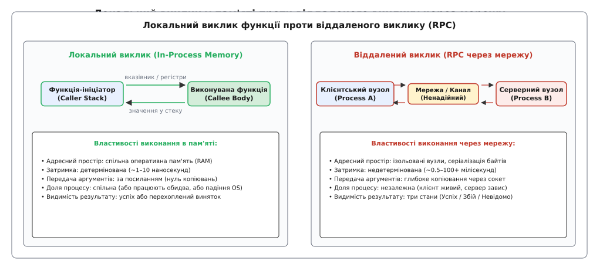
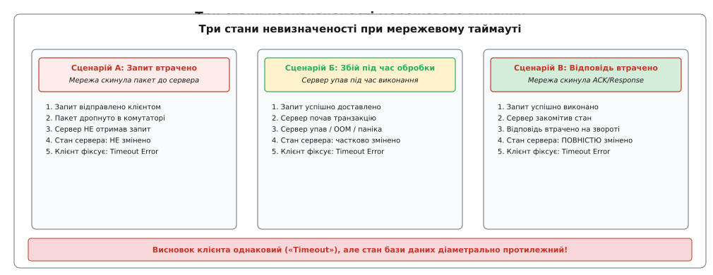
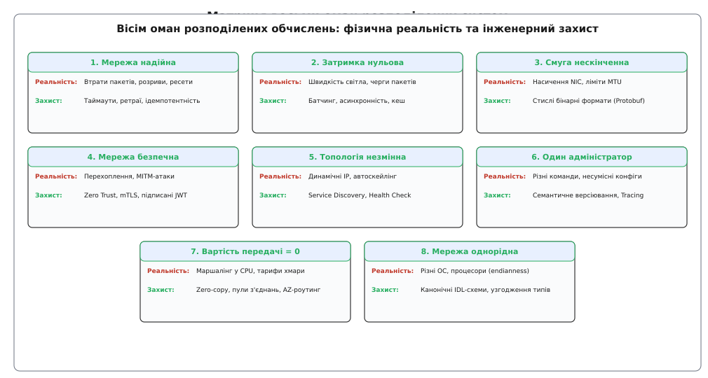

# Вісім оман розподілених обчислень

<preknowlist>
- [RPC і брокери об'єктів](root:com-protocol/corba-object-broker) — спроба сховати мережу за інтерфейсом локального виклику та чому вона провалюється.
- [Таймаути і бюджет часу](root:sf-distributed/timeouts-deadlines) — встановлення верхньої межі очікування на віддалену відповідь.
- [Ідемпотентність](root:sf-distributed/idempotency) — безпечне повторення операцій при невизначеному стані мережі.
- [Повтори і затримки](root:sf-distributed/retries-backoff) — експоненційне відтермінування та джитер для запобігання лавині запитів.
- [Моделі консистентності](root:sf-distributed/consistency-models) — що відбувається зі станом системи під час затримок і розривів зв'язку.
</preknowlist>

Коли монолітний застосунок розділяють на окремі мікросервіси, розробники часто замінюють прямий виклик методу в пам'яті на віддалений виклик через мережу (RPC або HTTP/REST), залишаючи сигнатуру функції незмінною. У локальному середовищі розробки такий код працює бездоганно: виклик сервісу замовлень повертає результат за мілісекунду, сервери не падають, а пакети не губляться на віртуальному інтерфейсі `localhost`.

У промисловій експлуатації ця ілюзія миттєво руйнується. Короткочасний сплеск навантаження на комутаторі датацентру призводить до скидання пакетів, виклики починають перевищувати очікуваний інтервал, клієнтські потоки блокуються в очікуванні сокетів, а пули з'єднань вичерпуються. Спроба клієнтів автоматично повторити невдалі запити викликає резонансну лавину повторів (*retry storm*), яка остаточно добиває відновлювані сервери.

Причина цієї системної катастрофи криється в неявному перенесенні ментальної моделі локального процесора на розподілене середовище. У локальній пам'яті комп'ютер працює за законами детермінованого автомата зі спільною долею (*fate sharing*): якщо пам'ять або шина даних пошкоджені, операційна система аварійно зупиняє весь процес. У розподіленій системі взаємодія підпорядковується законам фізичного простору, де компоненти відмовляють незалежно, затримки плавають від мікросекунд до десятків секунд, а стан віддаленого вузла стає фундаментально неспостережуваним.


*Локальний виклик виконується у спільному адресному просторі з детермінованою мікросекундною затримкою та спільною долею процесів; віддалений виклик долає мережевий стек, серіалізацію та породжує невизначений стан при неповерненні відповіді.*

---

### Фундаментальна брехня RPC: чому локальний виклик не дорівнює віддаленому

Ідея віддаленого виклику процедур (RPC, від англ. *Remote Procedure Call*) народилася з прагнення до зручності: зробити мережеву взаємодію настільки прозорою, щоб програміст не думав про мережеві протоколи, сокети та байти. Проте на рівні фізичної реальності локальний виклик функції та виклик через мережу мають фундаментально протилежну природу за чотирма параметрами:

1. **Адресний простір і передача параметрів:**
   У локальному виклику аргументи передаються через регістри процесора або стек. Якщо функція приймає структуру на 100 мегабайтів за вказівником (`const Data* ptr`), процесор копіює рівно 8 байтів адреси в пам'яті за 1 наносекунду.
   У мережевому виклику спільної пам'яті не існує. Щоб передати дані іншому вузлу, клієнт повинен пройти процес маршалінгу (серіалізації) об'єкта в байти, виділити буфер у купі, виконати системний виклик ядра для запису в сокет, розбити дані на TCP-сегменти та дочекатися підтверджень прийому (ACK). Витрати зростають із наносекунд до мілісекунд, а споживання пам'яті — у тисячі разів.

2. **Детермінізм затримки:**
   Локальний виклик займає фіксовану кількість тактів процесора (зазвичай від 1 до 50 наносекунд). Навіть у найгіршому випадку промаху кешу L3 затримка не перевищує 100 наносекунд.
   Мережевий виклик проходить крізь мережеві інтерфейси (NIC), кабелі, комутатори, черги пакетів на маршрутизаторах і операційні системи обох машин. Затримка коливається від 0.5 мс у локальній стійці до 150 мс між континентами, а під час перевантаження буферів (*bufferbloat*) може стрибати до десятків секунд.

3. **Спільна доля (*Fate Sharing*) проти незалежних відмов:**
   Якщо процес виконує локальну функцію і трапляється апаратний збій (наприклад, вимкнення живлення або паніка ядра), і викликач (*caller*), і виконавець (*callee*) гинуть одночасно в один і той самий момент. Неможлива ситуація, коли викликач живий, а виконавець наполовину виконав інструкції й завис.
   У розподіленій системі клієнт і сервер розташовані на різних фізичних машинах. Сервер може впасти через нестачу пам'яті (OOM) саме в той момент, коли клієнт чекає на відповідь. Клієнт залишається живим, але не знає, що сталося з його запитом.

4. **Три стани невизначеності результату:**
   У локальному програмуванні результат будь-якого виклику бінарний: або функція успішно повернула значення, або згенерувала виняток / код помилки.
   У мережевому виклику існує третій стан — **Невідомо (Unknown)**. Якщо клієнт не отримав відповідь протягом заданого таймауту, він стикається з фундаментальною невизначеністю.


*Клієнт фіксує таймаут у трьох принципово різних фізичних ситуаціях, що унеможливлює наївний безумовний повтор без ідемпотентності.*

Мережевий таймаут може означати три діаметрально протилежні фізичні події:
* **Сценарій А:** Запит клієнта було втрачено в комутаторі ще до того, як він дістався сервера. Сервер узагалі нічого не знає про операцію. Стан системи не змінено.
* **Сценарій Б:** Запит дістався сервера, сервер почав запис у базу даних, але впав у результаті апаратного збою або перезавантаження контейнера. Стан системи змінено частково.
* **Сценарій В:** Сервер успішно виконав операцію, зняв кошти з рахунку клієнта, зберіг транзакцію в базі даних і відправив відповідь HTTP 200 OK. Проте зворотний пакет із відповіддю було скинуто через обрив оптоволокна. Стан системи змінено повністю.

Для клієнта всі три сценарії виглядають абсолютно однаково: закінчився таймаут сокета. Якщо клієнт наївно вирішить, що таймаут означає збій операції, і повторить транзакцію, у Сценарії В він спише гроші вдруге. Детальний аналіз того, як ця омана призвела до краху технологій розподілених об'єктів у 1990-х роках, викладено в [історичному нарисі про виникнення списку оман у лабораторіях Sun Microsystems](root:sf-distributed/distributed-fallacies/hist-fallacies-origins.md).

---

### Часткова відмова як нова нормальність

У монолітній архітектурі система бінарна: вона або працює на 100%, або лежить повністю. Якщо впав головний процес, жоден користувач не отримує послуг, але й стан системи залишається узгодженим.

У розподіленій системі з сотень вузлів виникає явище **часткової відмови (*partial failure*)**. У будь-який довільний момент часу:
* 92% вузлів працюють штатно;
* 5% вузлів працюють із підвищеною затримкою через збирання сміття в JVM або сусідство з «галасливим сусідом» (*noisy neighbor*) у хмарі;
* 3% вузлів мертві або відрізані мережевим розділенням (*network partition*).

Система ніколи не буває повністю здоровою і ніколи не буває повністю мертвою. Розподілена архітектура вважається надійною не тоді, коли вузли не падають, а тоді, коли відмова будь-якого окремого вузла або сегмента мережі локалізується і не призводить до каскадного падіння решти компонентів.

---

### Вісім оман розподілених обчислень: анатомія та захист

У 1994–1997 роках інженери Sun Microsystems Л. Пітер Дейч та Джеймс Ґослінг сформулювали класичний список із восьми оман, які розробники несвідомо закладають в архітектуру програм.


*Кожна з восьми оман є хибним спрощенням фізичної природи мережі; надійна система будується через явне врахування протилежного факту на кожному рівні архітектури.*

---

#### Омана 1: Мережа надійна (The network is reliable)

**Хибне припущення:** Надісланий у мережу пакет завжди дійде до отримувача, а відкрите TCP-з'єднання існуватиме вічно, доки його явно не закриє додаток.

**Фізична реальність:**
Мережа складається з фізичних компонентів, кожен з яких має ненульову ймовірність відмови. Оптоволоконні кабелі перебивають будівельні екскаватори; у портах комутаторів деградують лазери; таблиці маршрутизації BGP перебудовуються, створюючи чорні діри для трафіку; комутатори скидають TCP-пакети через переповнення буферної пам'яті (Tail Drop).

TCP гарантує доставку байтів лише за умови, що фізичний канал функціонує. Якщо зв'язок обірвано, блокуючий виклик сокета буде чекати відповіді хвилинами, доки не спрацює стандартний системний таймаут ядра (який у Linux може сягати кількох годин, якщо не налаштовано `TCP_USER_TIMEOUT`). Більше того, існує явище асиметричного розділення мережі (*asymmetric network partition*), коли вузол А може відправляти пакети вузлу Б, але зворотний маршрут заблоковано через помилку в таблиці маршрутизації комутатора. Вузол А вважає вузол Б мертвим, тоді як вузол Б продовжує отримувати команди, що призводить до катастрофічного розщеплення мозку (*split-brain*) у кластерах баз даних.

**Інженерний захист:**
1. **Обов'язкові таймаути на всіх рівнях:** Жоден мережевий виклик не повинен виконуватися без явного дедлайну (`root:programming/timeouts-deadlines`).
2. **Ідемпотентні повтори:** Повторювати можна лише ті операції, які безпечно виконувати кілька разів із тим самим результатом за допомогою ідемпотентних ключів (`root:programming/idempotency`).
3. **Експоненційне відтермінування з джитером:** Запобігання перевантаженню відновлюваного сервера за рахунок випадкового розсіювання повторів (`root:programming/retries-backoff`).
4. **Асинхронні черги та Dead Letter Queues:** Перенесення ненадійної прямої синхронної взаємодії в брокери повідомлень із збереженням недоставлених подій у мертвих чергах (`root:programming/dead-letter-queue`).

---

#### Омана 2: Затримка дорівнює нулю (Latency is zero)

**Хибне припущення:** Мережевий виклик виконується практично миттєво, тому розбиття логіки на десятки дрібних послідовних RPC-запитів не вплине на швидкість роботи користувача.

**Фізична реальність:**
Швидкість світла у вакуумі становить `3 · 10⁸` м/с, а в оптоволоконному склі через коефіцієнт заломлення (`n ≈ 1.5`) вона падає до приблизно 200 км за одну мілісекунду. Відстань між Франкфуртом і Нью-Йорком становить близько 6200 км. Навіть в ідеальному прямому кабелі без жодного проміжного маршрутизатора мінімальний час кругової затримки (*Round-Trip Time*, RTT) чисто фізично не може бути меншим за:

```
RTT_min = (2 · 6200 км) / 200 км/мс = 62 мс
```

Додайте до цього затримки на черги в маршрутизаторах, серіалізацію пакетів, контекстні перемикання операційної системи та криптографічні обчислення TLS — реальний RTT становить 80–120 мс.

Якщо розробник проєктує мікросервіс інтернет-магазину за патерном «балакучого інтерфейсу» (*chatty API*), де для відображення однієї сторінки клієнт робить 20 послідовних запитів за кожним товаром окремо (антипатерн `N+1` викликів):

```
T_total = 20 · 80 мс = 1600 мс = 1.6 секунди
```

Крім того, у деревоподібних мікросервісних архітектурах діє закон **мультиплікації хвостової затримки (*tail latency amplification*)**. Якщо головний сервіс паралельно опитує `N = 100` бекенд-сервісів, і кожен окремий сервіс має 99-й перцентиль затримки `p = 0.99` (тобто лише 1% запитів є повільними), то ймовірність того, що хоча б один із 100 сервісів потрапить у повільний хвіст, становить:

```
P(хоча б один повільний) = 1 - (0.99)¹⁰⁰ = 1 - 0.366 = 0.634  [63.4%]
```

Майже дві третини (63.4%) усіх запитів користувачів зазнають затримки найповільнішого бекенда, хоча окремо кожен сервіс демонструє відмінні метрики!

**Інженерний захист:**
1. **Укрупнення API та пакетна обробка (*Batching*):** Замість 20 дрібних запитів передавати один запит зі списком ідентифікаторів `POST /items/batch-get`.
2. **Асинхронний паралелізм і Hedged Requests:** Одночасне надсилання незалежних RPC-запитів або надсилання дублюючого резервного запиту до іншої репліки після перевищення медіанного часу очікування (*hedging*).
3. **Географічна локалізація та Edge-кешування:** Наближення статичних і гарячих даних до користувача через мережі доставки контенту (CDN) та локальне кешування (`root:programming/caching-strategies`).

---

#### Омана 3: Пропускна здатність нескінченна (Bandwidth is infinite)

**Хибне припущення:** Мережа здатна пропустити будь-який обсяг даних без створення заторів і втрати продуктивності.

**Фізична реальність:**
Пропускна здатність мережевих інтерфейсів (NIC), шини PCIe та комутаційних матриць має суворі апаратні межі (1 Гбіт/с, 10 Гбіт/с, 100 Гбіт/с). Коли обсяг переданих даних наближається до фізичної межі каналу, виникає явище **колапсу перевантаження (*congestion collapse*)**. Буфери мережевих карт переповнюються, комутатори починають масово відкидати пакети, протокол TCP фіксує втрати й різко зменшує розмір вікна перевантаження (*congestion window*, `cwnd`), що призводить до падіння реальної пропускної здатності в рази.

Найчастіша причина насичення смуги в сучасних додатках — передача надлишкових, неструктурованих даних: мегабайтних JSON-документів із повторюваними текстовими ключами, вибірка з бази даних усіх колонок (`SELECT *`) замість необхідних двох полів, або синхронна передача важких медіафайлів через бізнес-RPC замість прямого завантаження у сховище об'єктів (S3).

**Інженерний захист:**
1. **Компактні бінарні протоколи серіалізації:** Заміна текстових форматів (JSON, XML) на бінарні схеми з кодуванням змінної довжини (*varint*) та числовими тегами полів: Protocol Buffers, FlatBuffers, Cap'n Proto.
2. **Проєкції та маски полів (*Field Masks / Projections*):** Клієнт явно вказує у запиті перелік потрібних полів, уникаючи передачі зайвих даних.
3. **Потокова передача (*Streaming*) та розбиття на сторінки (*Pagination*):** Передача великих наборів даних порціями з контролем зворотного тиску (*backpressure*).

---

#### Омана 4: Мережа безпечна (The network is secure)

**Хибне припущення:** Якщо сервер розташований усередині корпоративної мережі, закритої зовнішнім фаєрволом або хмарним VPC, трафік між сервісами є повністю безпечним і не потребує автентифікації чи шифрування.

**Фізична реальність:**
Концепція «фортеці з муром» (периметрової безпеки) остаточно застаріла. Більшість зломів починається не з прямого штурму сервера бази даних, а з компрометації робочої станції співробітника через фішинг, вразливості в сторонній npm/pip залежності або незахищеного тестового контейнера.

Опинившись усередині «безпечного» периметра, зловмисник отримує доступ до відкритої локальної мережі:
* За допомогою ARP-спуфінгу або перехоплення трафіку (Sniffing) зловмисник може читати конфіденційні паролі, токени та персональні дані, що передаються у відкритому вигляді через HTTP або сирі TCP-сокети.
* Відсутність авторизації між внутрішніми сервісами дозволяє вільно здійснювати бічне переміщення (*lateral movement*): захопивши другорядний сервіс аналітики, атакуючий надсилає прямі запити до платіжного сервісу без жодної перевірки прав.
* Атаки повторного відтворення (*replay attacks*): перехоплений нешифрований бінарний пакет може бути надісланий повторно, викликаючи повторне виконання привілейованої команди.

**Інженерний захист:**
1. **Архітектура нульової довіри (*Zero Trust Architecture*):** Жоден вузол, процес чи користувач не вважається надійним лише на основі його IP-адреси чи перебування в локальній мережі.
2. **Взаємна автентифікація TLS (mTLS):** Обов'язкове шифрування всього внутрішньосервісного трафіку з двосторонньою перевіркою криптографічних сертифікатів клієнта і сервера (часто автоматизується за допомогою Service Mesh, `root:programming/service-mesh`).
3. **Підписані токени контексту доступу та одноразові нонси:** Прокидання криптографічно завірених JWT/PASETO токенів із кожним RPC-запитом разом із часовими мітками та нонсами (*nonce*) для захисту від повторного відтворення.

---

#### Омана 5: Топологія не змінюється (Topology doesn't change)

**Хибне припущення:** Сервери мають постійні статичні IP-адреси, мережева структура фіксована, а маршрути між вузлами стабільні в часі.

**Фізична реальність:**
У сучасних хмарних платформах (Kubernetes, AWS ECS, Nomad) топологія є безперервно плинною:
* Контейнери створюються під час автомасштабування (*auto-scaling*), мігрують між фізичними хостами під час балансування навантаження та знищуються під час релізів або збоїв вузлів. IP-адреса пода живе від кількох хвилин до кількох днів.
* Хмарні спот-інстанси (*spot instances*) можуть бути відкликані провайдером із попередженням за дві хвилини.
* Якщо клієнт кешує IP-адресу сервера в пам'яті (як це роблять наївні HTTP-клієнти або застарілі JVM з нескінченним DNS TTL), після переїзду сервера клієнт продовжить надсилати запити на мертву адресу або на адресу, яку вже отримав зовсім інший сервіс.

**Інженерний захист:**
1. **Динамічне виявлення сервісів (*Service Discovery*):** Використання реєстрів сервісів (Consul, etcd, CoreDNS) для актуалізації списку живих емплімплярів (`root:programming/service-discovery`).
2. **Клієнтське балансування з оновленням пулів:** Клієнтські бібліотеки (gRPC resolver, Envoy) підписуються на події зміни топології та плавно перенаправляють трафік без розриву активних транзакцій.
3. **Зонди працездатності (*Health Checks*):** Постійна активна й пасивна перевірка стану вузлів (Liveness / Readiness probes) для негайного вилучення деградованих інстансів із маршрутизації.

---

#### Омана 6: Адміністратор один (There is one administrator)

**Хибне припущення:** Уся система підпорядкована єдиній команді інженерів, яка знає всі налаштування, одночасно оновлює компоненти та використовує узгоджені конфігурації.

**Фізична реальність:**
Масштабна розподілена система перетинає організаційні та інфраструктурні кордони:
* Сервіс авторизації підтримує команда безпеки в Німеччині, сервіс платежів розробляє зовнішній підрядник у Польщі, а інфраструктуру баз даних орендовано в американського хмарного провайдера AWS.
* Мережеві адміністратори датацентру можуть змінити розмір MTU або правила фаєрволу без попередження розробників додатків, що призведе до мовчазного відкидання великих TCP-пакетів.
* Різні команди випускають нові версії сервісів у власному темпі. У системі одночасно працюють сервіси версії `v1.2`, `v2.0` та експериментальні релізи `v2.1-beta`, що мають різні формати даних, різні ліміти та несумісні припущення про таймзони.

**Інженерний захист:**
1. **Суворі контракти інтерфейсів і семантичне версіювання:** Заборона незворотних (*breaking*) змін у контрактах без випуску нової версії ендпоінта (`/v2/`) або узгодження схем через Schema Registry (`root:programming/schema-registry`).
2. **Наскрізна спостережуваність (*Distributed Tracing*):** Прокидання єдиного ідентифікатора трасування (відповідно до стандарту W3C `traceparent` / OpenTelemetry) крізь усі сервіси, команди та хмари для візуалізації повного графа виконання запиту.
3. **Угоди про рівень обслуговування (SLA/SLO):** Чітка фіксація гарантованих затримок, бюджетів помилок і лімітів споживання між сервісами різних підрозділів.

---

#### Омана 7: Вартість транспортування нульова (Transport cost is zero)

**Хибне припущення:** Пересилання даних між вузлами безкоштовне як з точки зору використання обчислювальних ресурсів процесора, так і з точки зору фінансових витрат на інфраструктуру.

**Фізична реальність:**
Вартість транспортування вимірюється у двох вимірах:

1. **Обчислювальна вартість (CPU / RAM):**
   Щоб передати складний об'єкт через сокет, процесор повинен розібрати граф пам'яті, виконати сотні алокацій у купі, серіалізувати поля, переключити контекст із простору користувача в простір ядра (*syscall*), розрахувати контрольні суми TCP і скопіювати байти в кільцевий буфер мережевої карти. У керованих середовищах (Go, Java, Node.js) масова десеріалізація JSON створює мільйони короткоживучих об'єктів (*object churn*), що навантажує збирач сміття (GC) і призводить до регулярних зупинок додатку (*stop-the-world pauses*). У мікросервісах на базі JSON/HTTP до **30–50% усього процесорного часу** витрачається виключно на парсинг тексту й серіалізацію, а не на корисну бізнес-логіку.

2. **Фінансова вартість (Cloud Egress: плата за трафік):**
   Усі провідні хмарні провайдери (AWS, Azure, GCP) тарифікують вихідний мережевий трафік (*Egress Traffic*). Трафік між різними зонами доступності (Cross-AZ) коштує грошей (близько 0.01 USD за ГБ), трафік між регіонами (Cross-Region) — дорожче (0.02–0.05 USD за ГБ), а вихід в інтернет — до 0.09 USD за ГБ. Необдумана реплікація сирих даних або постійні нестиснені RPC між зонами датацентру щомісяця генерують тисячі доларів додаткових витрат у хмарному рахунку.

**Інженерний захист:**
1. **Zero-Copy серіалізація та ефективні структури:** Використання форматів, які дозволяють читати дані безпосередньо з буфера сокета без проміжного розбору й копіювання в об'єкти (FlatBuffers, Cap'n Proto).
2. **Локалізація трафіку за зонами доступності (*Topology-Aware Routing*):** Маршрутизація запитів усередині тієї самої зони доступності (AZ), де розташований клієнт, що одночасно знижує фінансові витрати на egress і зменшує затримку.
3. **Стиснення транспортного рівня:** Застосування швидких алгоритмів потокового стиснення (Zstandard, Snappy, lz4) на рівні TCP/gRPC каналів для зменшення фізичного обсягу байтів.


---

#### Омана 8: Мережа однорідна (The network is homogeneous)

**Хибне припущення:** Усі вузли системи використовують однакове апаратне забезпечення, однакові операційні системи, однакові компілятори та однакові налаштування мережевих стеків.

**Фізична реальність:**
Розподілена система об'єднує сервери на процесорах x86-64 (прямий порядок байтів, *little-endian*) та ARM64, вбудовані мережеві комутатори на MIPS (зворотний порядок байтів, *big-endian*), мобільні телефони на iOS/Android, браузерні рушії JavaScript та застарілі мейнфрейми.

Спроба передати «сиру пам'ять» (наприклад, структуру мови C через прямий запис `write(sock, &my_struct, sizeof(my_struct))`) призводить до фатальних помилок:
* Порядок байтів: число `0x12345678`, надіслане машиною little-endian, буде прочитане машиною big-endian як `0x78563412`.
* Вирівнювання структури (*Struct Padding*): 32-бітний компілятор вставляє 4 байти вирівнювання між полями, а 64-бітний — 8 байтів, через що зміщення полів у пам'яті не збігаються.
* Різні операційні системи по-різному обробляють розміри буферів TCP сокетів, алгоритм Нейгла (*Nagle's algorithm*) та механізми відкладеного підтвердження (*Delayed ACK*), що за певних конфігурацій створює штучні затримки у 200–500 мс на кожен запит.

**Інженерний захист:**
1. **Канонічні платформно-незалежні формати даних:** Заборона прямої передачі бінарних образів пам'яті C-структур. Усі повідомлення повинні кодуватися за чіткими міжнародними стандартами або форматами IDL із явною фіксацією порядку байтів (Network Byte Order / Big-Endian або стандартизований Protocol Buffers little-endian).
2. **Явне узгодження типів і версій протоколів:** Використання заголовків `Content-Type`, узгодження формату через ALPN у TLS та перевірка схем при десеріалізації.
3. **Уніфікована конфігурація TCP-стеку:** Явне встановлення опції сокета `TCP_NODELAY` для вимкнення алгоритму Нейгла у високошвидкісних RPC-клієнтах для уникнення конфлікту з Delayed ACK.

---

### Архітектурний чекліст для код-рев'ю та аудиту систем

Перед передачею будь-якого коду, що взаємодіє з мережею, у промислову експлуатацію, перевірте дизайн за наступним контрольним списком:

| Питання чекліста | Омана, яку перевіряємо | Що перевірити в коді та конфігурації |
| :--- | :--- | :--- |
| 1. Що станеться, якщо цей виклик зависне? | Омана 1 (Надійність) | Чи встановлено жорсткий таймаут сокета та дедлайн? Чи звільняться ресурси пулу потоків? |
| 2. Чи безпечно повторити цей запит у разі таймауту? | Омана 1 (Надійність) | Чи передається `Idempotency-Key`? Чи перевіряє сервер повторні транзакції в базі даних? |
| 3. Чи не викличе збій бекенда резонансну лавину ретраїв? | Омани 1 та 2 (Затримка) | Чи реалізовано Exponential Backoff із Full Jitter? Чи обмежено бюджет ретраїв (макс. 10%)? |
| 4. Чи не виконується N+1 послідовних RPC-запитів у циклі? | Омана 2 (Затримка) | Чи можна замінити цикл на один пакетний запит (*Batch*) або виконати запити паралельно? |
| 5. Який обсяг корисного навантаження передається? | Омана 3 (Пропускна здатність) | Чи не передаються зайві поля? Чи використовується бінарна серіалізація (Protobuf/gRPC)? |
| 6. Чи автентифікується виклик усередині локальної мережі? | Омана 4 (Безпека) | Чи налаштовано взаємний mTLS? Чи перевіряються підписи криптографічних токенів? |
| 7. Що станеться, якщо IP-адреса сервера зміниться прямо зараз? | Омана 5 (Топологія) | Чи налаштовано динамічний Service Discovery? Чи не закешовано IP-адресу назавжди в DNS? |
| 8. Як відстежити шлях запиту крізь системи різних команд? | Омана 6 (Один адмін) | Чи прокидається заголовок `traceparent`? Чи передаються мітки контексту в OpenTelemetry? |
| 9. Скільки процесорного часу й коштів коштує цей канал зв'язку? | Омана 7 (Вартість) | Чи не виконуються дорогі cross-AZ виклики без потреби? Чи налаштовано пул з'єднань (Keep-Alive)? |
| 10. Чи працюватиме протокол на машинах з іншою архітектурою CPU? | Омана 8 (Однорідність) | Чи зафіксовано формат даних у компільованій схемі IDL без залежності від вирівнювання C-структур? |

Практичну програмну реалізацію клієнтського механізму захисту на мовах C та C++, який втілює ці принципи у готовому модулі з запобіжником і монотонними таймерами, розібрано у [проєктній вставці про реалізацію відмовостійкого клієнта](root:sf-distributed/distributed-fallacies/proj-rpc-resilience.md).

> 🔧 **Навіщо це.**
> Знання восьми оман розподілених обчислень перетворює розробника з наївного споживача абстракцій на зрілого системного інженера. Замість того, щоб сприймати мережевий збій як прикру випадковість, архітектор проєктує систему виходячи з принципу «все, що може зламатися, обов'язково зламається в найбільш незручний момент».
> 
> У реальних проєктах урахування цих оман рятує бізнес від мільйонних збитків: запобіжник захищає інтернет-банкінг від падіння в «чорну п'ятницю», ключі ідемпотентності запобігають подвійному списанню коштів із карток покупців, а відмова від наївного N+1 RPC прискорює завантаження мобільного застосунку в 10 разів.

---

### Новий синтез: фізичні закони як архітектурний фундамент

Вісім оман розподілених обчислень не є інженерними недоліками або проблемами, які можна раз і назавжди виправити за допомогою нової бібліотеки чи протоколу. Вони є прямим наслідком фундаментальних фізичних законів нашого Всесвіту: скінченності швидкості світла, термодинамічної ентропії фізичних провідників та принципової неможливості миттєвої синхронізації спостережень у просторово розділених точках.

Справжня надійність розподіленої системи досягається не спробами побудувати ілюзію ідеальної монолітної машини, а відкритою інтеграцією реальності в саму структуру коду. Коли кожен мережевий виклик спроєктовано з урахуванням того, що мережа ненадійна, затримка ненульова, а топологія мінлива, система перестає бути крихкою і набуває властивості антикрихкості — здатності продовжувати роботу та деградувати передбачувано в умовах безперервних часткових відмов.
