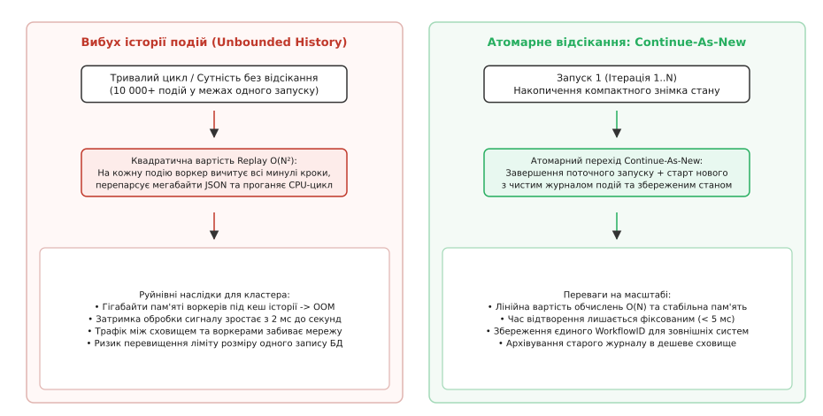
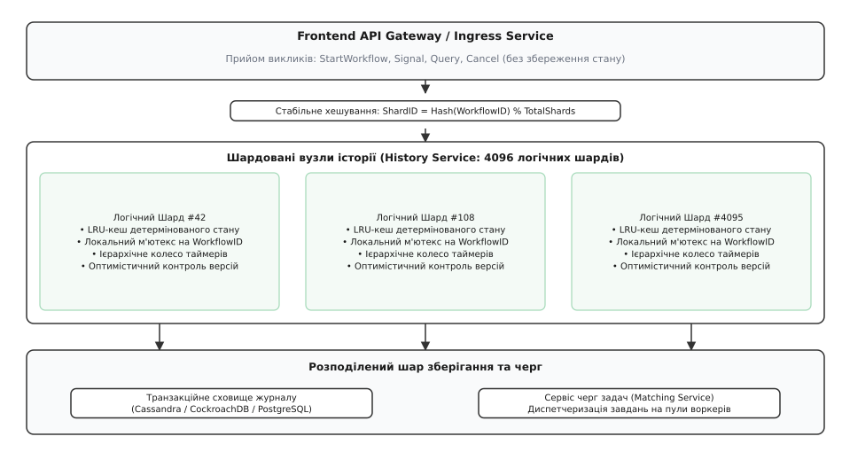
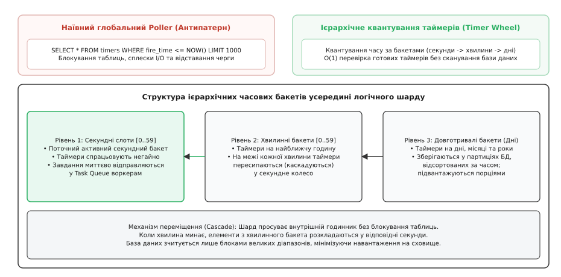
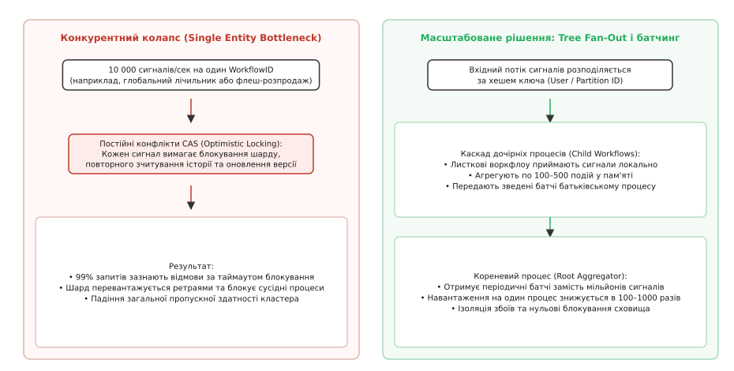

# Довговічні процеси на масштабі: шардування історії, відсікання пам'яті та керування мільйонами таймерів

<preknowlist>
- [Довговічні робочі процеси](topic:sf-distributed/durable-workflows) — базова парадигма детермінованого відтворення та журналу подій.
- [Шардинг та партиціонування](topic:sf-distributed/partitioning-sharding) — горизонтальний розподіл даних за ключем через стабільне хешування.
- [Журнал подій](topic:sf-distributed/event-log) — незмінний список фактів як першоджерело правди для відновлення стану.
- [Ідемпотентність](topic:sf-distributed/idempotency) — властивість повторного виконання запиту без повторної мутації стану.
- [Таймаути і бюджет часу](topic:sf-distributed/timeouts-deadlines) — керування життєвим циклом операцій у розподілених системах.
- [Скидання навантаження і плавна деградація](topic:sf-distributed/load-shedding) — захист системи при вичерпанні пропускної здатності.
</preknowlist>

Телеком-оператор запускає систему щорічного білінгу для 40 мільйонів активних абонентів. Кожен абонент представлений окремим довговічним робочим процесом, що обробляє щоденні тарифікації, пакети трафіку та поповнення рахунку. Через шість місяців безперервної роботи журнал подій окремого процесу накопичує 80 000 записів: при кожному новому сигналі про вхідний дзвінок воркер завантажує з бази даних 15 мегабайтів сирого JSON, повторно проганяє детерміновану функцію через 80 000 кроків і витрачає 900 мілісекунд процесорного часу замість двох мілісекунд корисної роботи. Коли опівночі 500 000 абонентів одночасно отримують щомісячні нарахування, база даних кластера отримує 40 мільярдів зчитувань історії, пул воркерів вичерпує гігабайти оперативної пам'яті через OOM, а таймери відкладених платежів відстають на вісім годин. Система з базовим Event Sourcing колапсує під власним масштабом.

Парадигма довговічного виконання (англ. *Durable Execution*), заснована на детермінованому відтворенні (англ. *Deterministic Replay*, від лат. *determinare* — визначати), бездоганно розв'язує задачу збереження стану для тисяч короткоживучих процесів. Проте перехід на рівень сотень мільйонів одночасних екземплярів із нескінченним життєвим циклом оголює системні обмеження базової моделі: неконтрольоване зростання історії подій, блокування сховища при скануванні таймерів та конкурентний колапс при штурмі гарячих сутностей.



*Порівняння неконтрольованого зростання історії подій (квадратичне навантаження на відтворення) та атомарного відсікання через Continue-As-New зі знімком стану.*

## Межа базового Event Sourcing: прокляття квадратичного відтворення

У класичному рушії довговічних процесів кожна дія фіксується у незмінному журналі подій (англ. *Event History*). Якщо процес виконує `N` послідовних кроків (наприклад, цикл обробки щоденних платежів або отримання зовнішніх вебхуків), для виконання `k`-го кроку воркер мусить відтворити історію з попередніх `k - 1` подій.

Сумарна кількість операцій верифікації подій на процесорі за весь час життя процесу зростає як сума арифметичної прогресії:

```
S_cpu(N) = 1 + 2 + 3 + ... + N = N · (N + 1) ÷ 2 = O(N²)
```

Це квадратичне зростання (лат. *quadratus* — квадрат) призводить до трьох непереборних бар'єрів:

1. **Мережевий та дисковий колапс (I/O Amplification):** при кожній новій задачі воркер завантажує з бази даних повний JSON-журнал. На 50 000-й події обсяг переданого корисного навантаження для однієї операції досягає 20–30 мегабайтів. Мережева смуга між серверами історії та воркерами забивається повторним пересиланням минулих фактів.
2. **Вичерпання пам'яті воркерів (Memory Bloat):** для детермінованого відтворення воркер десеріалізує всю історію в пам'ять віртуальної машини (Go корутина, V8 Isolate, JVM Thread). Тисяча таких паралельних відтворень вимагає десятків гігабайтів RAM, провокуючи аварійне примусове завершення процесів операційною системою через Out-Of-Memory (OOM).
3. **Ліміти розміру запису в розподілених базах даних:** Apache Cassandra, PostgreSQL та CockroachDB мають обмеження на розмір одного рядка чи партиції (наприклад, Cassandra Partition Size ≤ 100 МБ). Перевищення цього ліміту призводить до деградації комппакції (LSM-tree Compaction) та відмови вузла сховища.

Детальний математичний розрахунок складності, графіки зростання навантаження та поріг відсікання наведено в [математичному аналізі обчислювальної складності відтворення та шардингу](topic:sf-distributed/durable-workflow-cluster-under-load/math-replay-complexity.md).

### Атомарне відсікання історії: примітив Continue-As-New

Єдиним способом зупинити квадратичний ріст без втрати гарантій довговічності є примусове лінійне розбиття процесу на послідовні запуски через операцію **Continue-As-New** (англ. *продовжити як новий*).

Коли кількість подій у поточному запуску наближається до встановленого порогу (зазвичай 1 000–2 000 подій), функція робочого процесу викликає команду завершення поточного циклу, передаючи акумульований стан як аргумент наступного запуску:

:::tabs
```go
func BillingAccountWorkflow(ctx workflow.Context, state AccountState) error {
    eventCount := 0

    for {
        // Очікування зовнішнього сигналу або таймера
        var signal DepositSignal
        selector := workflow.NewSelector(ctx)
        selector.AddReceive(workflow.GetSignalChannel(ctx, "Deposit"), func(c workflow.ReceiveChannel, _ bool) {
            c.Receive(ctx, &signal)
            state.Balance += signal.Amount
            eventCount++
        })
        selector.Select(ctx)

        // Перевірка порогу відсікання історії
        if eventCount >= 1000 || workflow.GetInfo(ctx).GetCurrentHistoryLength() >= 2000 {
            // Атомарний перехід: поточний RunID закривається, новий RunID стартує зі state
            return workflow.NewContinueAsNewError(ctx, BillingAccountWorkflow, state)
        }
    }
}
```
```typescript
import { condition, defineSignal, setHandler, continueAsNew } from '@temporalio/workflow';

export async function billingAccountWorkflow(state: AccountState): Promise<void> {
  let eventCount = 0;
  const depositSignal = defineSignal<[number]>('Deposit');

  setHandler(depositSignal, (amount) => {
    state.balance += amount;
    eventCount++;
  });

  while (true) {
    await condition(() => eventCount > 0);
    eventCount = 0;

    if (state.totalProcessedSignals >= 1000) {
      // Атомарний перезапуск із чистим журналом подій
      await continueAsNew<typeof billingAccountWorkflow>(state);
    }
  }
}
```
```cpp
// C++ SDK: виклик Continue-As-New через контекстний метод
class BillingAccountWorkflow {
public:
    void run(WorkflowContext& ctx, AccountState state) {
        int event_count = 0;
        
        while (true) {
            auto signal = ctx.wait_for_signal<DepositSignal>("Deposit");
            state.balance += signal.amount;
            event_count++;

            if (event_count >= 1000) {
                // Атомарна передача знімка стану в новий запуск
                ctx.continue_as_new("BillingAccountWorkflow", ContinueAsNewOptions{}, state);
            }
        }
    }
};
```
:::

Під час виконання `ContinueAsNew` кластер оркестратора здійснює неподільну транзакцію:
1. Поточний запуск (`RunID = "run_001"`) закривається з фінальним статусом `CONTINUED_AS_NEW`.
2. Створюється новий запуск (`RunID = "run_002"`) під тим самим глобальним ідентифікатором `WorkflowID`.
3. Історія `run_002` починається з чистого аркуша: подія `WorkflowExecutionStarted` містить лише компактний серіалізований знімок `state`.
4. Усі вхідні сигнали, що надійшли під час переходу, не губляться, а автоматично переносяться в буфер нового запуску.

Повний перелік параметрів виклику, політик успадкування та гарантій черг сигналів наведено в [довіднику API-контрактів та примітивів масштабування](topic:sf-distributed/durable-workflow-cluster-under-load/api-scale-primitives.md).

## Архітектура горизонтального шардування: мільйони процесів у кластері

Класична реляційна база даних не здатна витримати мільйони паралельних транзакцій оновлення стану з блокуванням рядків. Для досягнення горизонтального масштабування сервіс оркестрації розділяється на три незалежні площини: **Frontend (Ingress Gateway)**, **History Service (Шардоване ядро станів)** та **Matching Service (Диспетчер черг задач)**.



*Архітектура шардування історії за WorkflowID: фронтенд-маршрутизація через стабільне хешування, пул воркерів історії з ізольованими чергами та спільне сховище.*

### Розподіл за стабільним хешуванням (Consistent Hashing)

Простір усіх можливих процесів розбивається на фіксовану кількість логічних шардів (англ. *shards*, від давньоангл. *sceard* — уламок, частка; зазвичай 2 048, 4 096 або 16 384 шардів).

Кожен вхідний запит від клієнта (`StartWorkflow`, `Signal`, `Query`, `Cancel`) потрапляє на безстатусний Frontend-шлюз, який детерміновано обчислює номер цільового логічного шарду:

```
ShardID = MurmurHash3(WorkflowID) % TotalShards
```

Кластер підтримує розподілену таблицю володіння шардами (через протокол консенсусу або службу членства в кластері, таку як HashiCorp Ringpop чи etcd). Завдяки цьому:
* **Одночасна локалізація стану:** усі події та сигнали для конкретного `WorkflowID` завжди обробляються рівно одним конкретним вузлом історії.
* **Відсутність розподілених блокувань:** синхронізація конкурентних операцій над процесом зводиться до швидкого внутрішньопроцесного м'ютекса (In-Memory Mutex) на відповідному сервері історії.
* **Ізоляція збоїв:** падіння одного вузла історії зачіпає лише частку шардів `K / TotalNodes`, які автоматично перерозподіляються між іншими живими вузлами кластера менш ніж за 2 секунди.

Історію розвитку цієї архітектури від перших черг в Amazon SWF до розподілених кілець Cadence та Temporal викладено в [історичному нарисі еволюції інфраструктури довговічного масштабування](topic:sf-distributed/durable-workflow-cluster-under-load/hist-temporal-cadence-scale.md).

### Оптимістичний контроль версій та Fencing-токени

Коли вузол історії здійснює запис у розподілену базу даних (Cassandra / CockroachDB), він використовує механізм оптимістичного блокування (англ. *Optimistic Concurrency Control*):

```sql
UPDATE workflow_executions
SET next_event_id = 43, last_heartbeat = NOW(), state_payload = $1
WHERE shard_id = 108 
  AND workflow_id = 'user_101' 
  AND range_id = 5 
  AND next_event_id = 42;
```

Якщо інший вузол кластера помилково вважає себе власником цього ж шарду (стан розщеплення мозку — *Split-Brain*), його запис зазнає невдачі через невідповідність `range_id` або `next_event_id`. Це гарантує строгу лінеаризованість журналу подій за будь-яких мережевих ізоляцій.

## Масштабування розподілених таймерів: квантування часу та ієрархічні колеса

У масштабованій системі мільйони процесів одночасно перебувають у стані очікування: `workflow.Sleep(ctx, 30*time.Day)`, тайм-аути активностей на 5 хвилин, експоненційні паузи між ретраями.

Спроба реалізувати ці таймери через класичний реляційний підхід із фоновим опитуванням (Poller):
```sql
SELECT * FROM timers WHERE fire_time <= NOW() LIMIT 1000 FOR UPDATE SKIP LOCKED;
```
призводить до миттєвої деградації: індекс бази даних зазнає високої конкуренції на читання/запис, виникають сплески дискового введення/виведення, а таймери починають відставати від реального часу на хвилини або години.



*Ієрархічне колесо таймерів (Timer Wheel) шарду: квантування часу по бакетах замість масового сканування рядків бази даних.*

### Структура Shard Timer Queue

Замість глобального опитування кожен логічний шард керує власною локальною чергою таймерів, організованою у вигляді **ієрархічного колеса таймерів (Hierarchical Timer Wheel)**:

1. **Секундний рівень (Рівень 1):** кільцевий буфер із 60 слотів. Кожен слот відповідає конкретній секунді поточної хвилини. Перевірка настання таймера виконується за `O(1)`: шард просто перевіряє поточний слот і негайно відправляє готові завдання в Matching Service.
2. **Хвилинний рівень (Рівень 2):** кільцевий буфер із 60 слотів для таймерів на найближчу годину. Коли секундне колесо завершує повний оберт (секунда 0), задачі з чергового хвилинного слота каскадно пересипаються у відповідні секунди.
3. **Довготривалий персистентний рівень (Дні/Місяці):** таймери, призначені на дні та місяці вперед, зберігаються в базі даних у вигляді партицій, згрупованих за великими часовими вікнами (наприклад, двогодинні бакети). Шард підвантажує наступний двогодинний бакет у пам'ять лише тоді, коли поточне вікно наближається до завершення.

Цей механізм повністю усуває сканування непідготовлених записів у базі даних: навантаження на сховище залишається рівномірним і пропорційним лише кількості реально спрацьовуючих таймерів.

Робочий вихідний код ієрархічного таймера з каскадуванням та шардованим рушієм представлено в [практичній реалізації шардованого рушія довговічних процесів](topic:sf-distributed/durable-workflow-cluster-under-load/proj-sharded-workflow-engine.md).

## Гарячі точки та колізії: штурм єдиного процесу (Single Entity Bottleneck)

Найнебезпечнішим сценарієм для довговічного кластера є наявність «гарячого процесу» (англ. *Hot Workflow*). Наприклад, процес глобального агрегатора замовлень під час флеш-розпродажу або сутність популярного чат-каналу, куди 10 000 користувачів одночасно надсилають сигнали щосекунди.

Оскільки всі операції над одним `WorkflowID` обробляються послідовно через один логічний шард, виникає феномен блокування:

* Кожен вхідний сигнал вимагає зчитування поточного стану, детермінованого проходження, генерації нової події та запису транзакції в базу даних (затримка `τ ≈ 10–20` мс).
* Максимальна теоретична пропускна здатність одного процесу обмежена:
  ```
  RPS_max = 1 ÷ τ = 1 ÷ 0.02 с = 50 операцій/сек
  ```
* Спроба надіслати 1 000 сигналів на секунду в один процес призводить до того, що 95% запитів відхиляються за таймаутом блокування або перевантажують шард лавиною повторних спроб (CAS Conflict Storm).



*Подолання гарячих точок (Hot Shards): буферизація вхідних сигналів та каскадне дерево дочірніх процесів (Tree Fan-out) замість прямої конкуренції.*

### Архітектура деревоподібного розгалуження (Tree Fan-out)

Для подолання межі в 50 RPS архітектура масштабування вимагає переходу від прямого надсилання сигналів до **деревоподібної агрегації (Tree Fan-out)** за допомогою дочірніх процесів (Child Workflows):

1. **Листкові процеси (Leaf Partition Workflows):** вхідний потік сигналів шардується за хешем користувача (`UserID`) на `B` паралельних листкових процесів (наприклад, 100 окремих процесів `Aggregator_Leaf_0` .. `Aggregator_Leaf_99`).
2. **Локальна агрегація:** кожен листковий процес накопичує сигнали у локальному стані протягом фіксованого вікна (наприклад, 1 секунда або 200 сигналів).
3. **Пакетне оновлення кореня (Root Aggregator):** листкові процеси надсилають кореневому процесу один агрегований батч (наприклад, «додати 200 до загального лічильника») замість 200 окремих викликів.

Це знижує навантаження на кореневий процес у сотні разів і дозволяє системі масштабуватися до сотень тисяч операцій на секунду без деградації затримки.

## Багатоарендність (Multi-tenancy) та ізоляція шумних сусідів

У великих організаціях єдиний кластер оркестрації обслуговує десятки різних сервісів: від критичного білінгу в реальному часі до масивних фонових пакетних задач аналітики (Batch Jobs), що генерують мільйони активностей одночасно.

Без суворої ізоляції виникає проблема **«шумного сусіда» (Noisy Neighbor)**: масивна пакетна задача забиває черги задач (Task Queues), вичерпує вільні воркери та блокує виконання критичних платежів.

### Механізми захисту на рівні кластера

1. **Простори імен (Namespaces):** логічний поділ кластера на ізольовані домени з індивідуальними квотами пропускної здатності (Rate Limits на рівні RPS) та політиками утримання історії (Retention Period).
2. **Роздільні пули воркерів (Worker Pool Segregation):** критичні процеси прив'язуються до виділених черг задач (`billing-high-prio-queue`), які обслуговуються окремою групою фізичних серверів воркерів із гарантованим CPU та RAM.
3. **Чесна диспетчеризація (Deficit Round Robin — DRR):** сервіс диспетчеризації завдань (Matching Service) розподіляє задачі між різними чергами за алгоритмом циклічного дефіциту, запобігаючи монополізації пулу воркерів одним високонавантаженим процесом.

## Зберігання та архівування: гарячі шарди проти холодного об'єктного сховища

Зберігання мільярдів завершених процесів у швидкій транзакційній базі даних (Cassandra, CockroachDB, PostgreSQL) створює непомірні фінансові витрати та перевантажує механізми реплікації сховища.

Промислова архітектура реалізує **дворівневу модель зберігання (Tiered Storage)**:

```
[Активний процес] ---> [Гаряче сховище: Cassandra / Postgres] (Retention: 1-30 днів)
                                |
                   (Асинхронний Archival Worker)
                                v
                       [Холодне сховище: AWS S3 / GCS] (Retention: 1-7 років)
```

1. **Гарячий рівень (Hot Tier):** під час виконання процесу та протягом налаштованого періоду утримання (Retention Window, наприклад, 7 днів після завершення) повний журнал подій живе в транзакційній базі даних для підтримки миттєвого доступу, повторних спроб та дебагу.
2. **Холодний рівень (Cold Archival Tier):** після завершення періоду утримання фоновий сервіс архівації вивантажує повну історію процесу в стиснутому бінарному форматі (Protobuf / Zstandard) в об'єктне сховище (AWS S3, Google Cloud Storage, Ceph).
3. **Вторинне індексування (Search Attributes):** для пошуку закритих процесів (`AccountID`, `Amount`, `ExecutionStatus`) кластер оновлює метадані у вторинному індексі OpenSearch/Elasticsearch, що дозволяє виконувати фільтрацію за мілісекунди без читання терабайтів сирих історій.

## Порівняння архітектурних парадигм довговічного виконання

Сучасна індустрія пропонує три принципово різні підходи до забезпечення незнищенності процесів:

| Критерій порівняння | Детерміноване відтворення (Temporal / Cadence) | Віртуальні об'єкти (Restate) | Інтеграція в СУБД (DBOS) |
| :--- | :--- | :--- | :--- |
| **Механізм збереження** | Журнал подій (Event History) + Replay | Журнал мутацій стану (Log-Streaming State Machine) | Транзакційні таблиці всередині ядра PostgreSQL |
| **Накладні витрати на довгу історію** | Високі без `ContinueAsNew` (`O(N²)` CPU/IO) | Низькі (`O(1)` читання актуального стану) | Мінімальні (`O(1)` локальний SQL-запит) |
| **Вимоги до детермінізму коду** | Абсолютні (заборонено неізольовані side-effects) | Помірні (контролюються через контекстні методи) | Помірні (транзакційні гарантії збережених процедур) |
| **Мінімальна затримка кроку** | 5–20 мс | 1–5 мс | < 1 мс |
| **Граничний масштаб кластера** | Десятки мільярдів процесів у розподіленому сховищі | Мільйони повідомлень/сек на вузол консенсусу | Обмежений масштабом реплікації СУБД |

## Інженерна ціна: коли будувати кластер довговічного виконання

Впровадження виділеного кластера довговічного виконання — це стратегічна інвестиція, яка має чітку точку окупності (Tipping Point):

### Коли кластер довговічних процесів НЕ потрібен

* **Прості однолінійні пайплайни без тривалих пауз:** якщо задача зводиться до послідовного виклику трьох HTTP-сервісів із загальним часом виконання < 500 мс, звичайний HTTP-клієнт із політикою ретраїв та Transactional Outbox у реляційній базі даних буде значно простішим і дешевшим в експлуатації.
* **Потокова аналітика високої частоти (Real-time Stream Processing):** для обробки мільйонів подій на секунду з ковзними вікнами та низькою затримкою (IoT телекетрія, клікстрім) природним вибором залишаються Apache Flink або Apache Spark Streaming.

### Коли довговічні процеси стають критичною необхідністю

* **Тривалі бізнес-процеси (Human-in-the-loop / Timeouts):** процеси, що очікують на дії людини (верифікація документів, схвалення заявок) або зовнішні події протягом днів, тижнів та місяців.
* **Складні розподілені саги з компенсаціями:** білінг, бронювання подорожей, виконання банківських переказів, де будь-який збій вимагає надійного зворотного каскаду компенсаційних дій.
* **Масове керування інфраструктурою:** автоматичне оновлення прошивок мільйонів пристроїв, міграції баз даних та розгортання хмарних середовищ.

На масштабі довговічне виконання усуває необхідність саморобних «костилів» із таблиць статусів, нестабільних кронів та невидимої хореографії черг, повертаючи розробнику можливість писати надійний, тестований та прозорий код розподілених систем.
