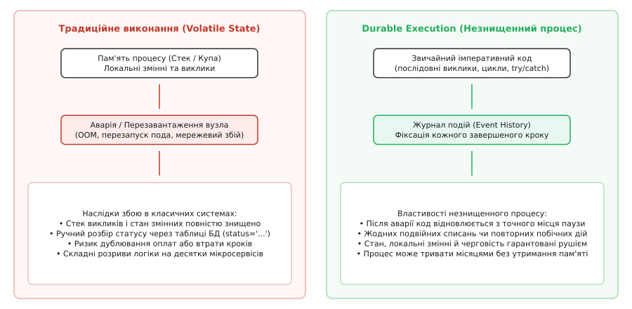
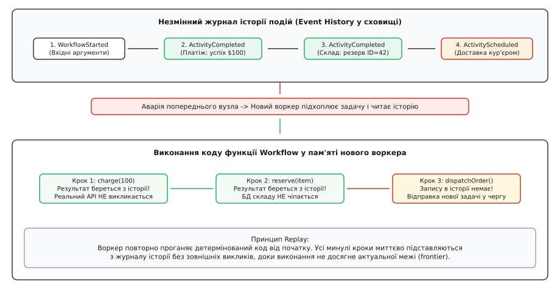
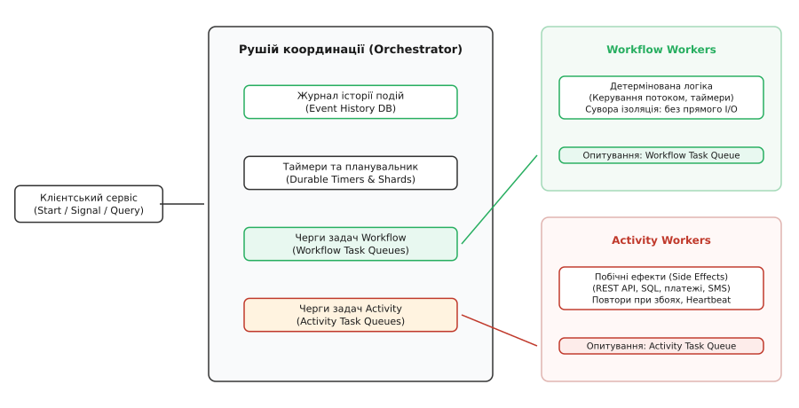
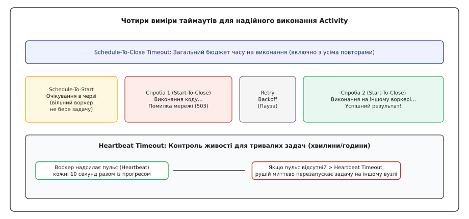

# Довговічні робочі процеси: збереження стану, детерміноване відтворення та відмовостійка оркестрація

<preknowlist>
- [Омани розподілених обчислень](topic:sf-distributed/distributed-fallacies) — чому мережа ненадійна, пакети губляться, а розподілені вузли зазнають незалежних відмов.
- [Ідемпотентність](topic:sf-distributed/idempotency) — властивість повторного виконання запиту без повторної мутації стану.
- [Патерн «Сага»](topic:sf-distributed/saga-pattern) — координація розподілених кроків через компенсаційні транзакції.
- [Повтори та відкладення](topic:sf-distributed/retries-backoff) — стратегії експоненційного відкладення з джитером при мережевих збоях.
- [Журнал подій](topic:sf-distributed/event-log) — незмінний список фактів як першоджерело правди для відновлення стану.
</preknowlist>

Користувач фінтех-сервісу оформлює заявку на отримання кредиту на суму 150 000 гривень. Процес обробки цієї заявки триває не кілька мілісекунд, а сім календарних днів: спочатку система списує комісію за розгляд, потім надсилає запит до бюро кредитних історій, чекає до сорока восьми годин на ручну верифікацію документів кредитним офіцером через внутрішній вебпортал, після схвалення надсилає клієнту SMS із кодом підтвердження, чекає до трьох діб на введення одноразового пароля і, нарешті, переказує кошти на банківську картку. На четвертий день, коли кредитна історія вже схвалена, а система очікує на підтвердження від користувача, серверний кластер зазнає аварійного перезавантаження через збій живлення в дата-центрі або оновлення операційної системи Kubernetes-ноди. Усі процеси в оперативній пам'яті раптово знищуються.

У звичайній архітектурі такий збій перетворюється на катастрофу. Якщо стан процесу жив лише в оперативній пам'яті бекенд-сервера (у стеку викликів функції, локальних змінних та очікуванні асинхронного `Promise` чи сокета), він випаровується без сліду. Клієнт більше не може ввести код, комісія за розгляд списана безповоротно, схвалення офіцера втрачено, а заявка назавжди зависає в невизначеному стані.



*Традиційне виконання втрачає стан змінних та стек викликів при збої сервера; довговічне виконання фіксує кожен крок у журналі подій і прозоро відновлює роботу.*

## Глухий кут традиційних підходів до тривалих процесів

Перш ніж аналізувати парадигму довговічного виконання (англ. *Durable Execution*), необхідно розібрати, чому три класичні інженерні спроби вирішити цю проблему створюють більше складнощів, ніж усувають.

### 1. Таблиці бази даних зі стовпчиками статусів та фонові опитувачі (Poller / Cron)

Найпоширеніша імпровізація — створення в реляційній базі даних таблиці `applications` із полем `status VARCHAR(64)`. Коли заявка проходить етапи, сервіс оновлює статус: `SUBMITTED` → `BUREAU_CHECKING` → `AWAITING_MANUAL_REVIEW` → `APPROVED` → `MONEY_DISPATCHED`.

Паралельно запускається фоновий процес (Cron або планувальник), який щохвилини виконує «важкий» SQL-запит:
```sql
SELECT * FROM applications 
WHERE status = 'AWAITING_MANUAL_REVIEW' 
  AND updated_at < NOW() - INTERVAL '48 HOURS' 
FOR UPDATE SKIP LOCKED;
```

Цей підхід стрімко деградує за трьома напрямками:
* **Комбінаторний вибух станів:** реальний бізнес-процес містить паралельні гілки, таймери скасування, винятки, повторні спроби верифікації та ескалації. Кількість можливих станів та їхніх комбінацій зростає експоненційно. Логіка переходів розмазується між десятками HTTP-контролерів, обробників вебхуків та фонових скриптів.
* **Стан перегонів (Race Conditions):** якщо вебхук від бюро кредитних історій надходить одночасно зі спрацьовуванням крону скасування за таймаутом, дві паралельні транзакції змагаються за оновлення рядка, призводячи до дедлоків або некоректної перезаписи статусу.
* **Втрата контексту виклику:** база даних зберігає лише поточний маркер статусу, але втрачає локальний стек виконання, проміжні результати попередніх кроків та причини виникнення помилок. Розробник змушений створювати додаткові таблиці для зберігання проміжного JSON-контексту кожного кроку.

### 2. Хореографія на чергах повідомлень (Message Choreography)

Другий підхід полягає у розбитті процесу на мікросервіси, що спілкуються подіями через Apache Kafka чи RabbitMQ: сервіс заявок публікує `ApplicationCreated`, сервіс бюро слухає цю подію, обробляє та публікує `BureauChecked`, сервіс сповіщень надсилає SMS і так далі.

Хореографія усуває центральну точку відмови, але створює «архітектурну сліпоту»:
* **Невидимий потік керування:** у коді немає жодного місця, де можна відкрити файл і побачити весь бізнес-процес від початку до кінця. Щоб зрозуміти ланцюг подій, розробник має проаналізувати конфігурацію десятків черг у різних репозиторіях.
* **Складність тайм-аутів:** реалізація умови «якщо користувач не ввів SMS-код протягом сімдесяти двох годин, скасувати заявку і повернути комісію» вимагає побудови окремої складної інфраструктури відкладених повідомлень (Dead Letter Queues з TTL або зовнішніх планувальників).
* **Хаос обробки помилок:** якщо на п'ятому кроці стається невідновний збій, ініціювати зворотний каскад компенсацій (зняття броні, повернення коштів) через розрізнені топіки надзвичайно важко й ризиковано.

### 3. Декларативні XML/JSON-оркестратори та BPMN-рушії

Третій підхід — використання спеціалізованих рушіїв оркестрації на кшталт Camunda, jBPM чи AWS Step Functions. Процес описується діаграмами або великими JSON-документами, що представляють направлений ациклічний граф (DAG).

Головна вада цього підходу — глибокий розрив із природними мовами програмування. Спроба виразити звичайні програмні конструкції — цикл `for`, обробку винятків `try/catch`, виклик динамічної кількості асинхронних задач чи взаємодію зі сторонніми бібліотеками — перетворює JSON чи XML на громіздкі, нечитабельні метамови, які неможливо повноцінно покрити модульними тестами, дебажити у стандартній IDE чи перевірити статичним типізатором.

Детальний аналіз чотирьох десятиліть еволюції від XA-транзакцій та BPMN до сучасних систем викладено в [історичному нарисі еволюції довговічного виконання](topic:sf-distributed/durable-workflows/hist-durable-execution-evolution.md).

> 🔧 **Навіщо це.** Довговічне виконання дозволяє писати складні розподілені процеси — з таймерами на місяці, повторами при збоях, паралельними гілками та обробкою помилок — звичайним імперативним кодом на Go, TypeScript, Python чи C#, гарантуючи, що жодна змінна чи крок не загубляться при падінні сервера.

## Сутність парадигми Durable Execution

**Довговічне виконання (Durable Execution)** — це парадигма розподіленого програмування, в якій середовище виконання гарантує абсолютне збереження стану виконання коду (локальних змінних, стека викликів, поточного рядка виконання, структурованих таймерів) незалежно від падінь процесів, мережевих ізоляцій, вичерпання пам'яті чи перезавантажень фізичних серверів.

Для розробника це виглядає як магія: можна написати звичайну функцію з послідовними рядками коду:

```go
func OnboardingWorkflow(ctx workflow.Context, userID string) error {
    // Крок 1: Миттєва дія
    err := workflow.ExecuteActivity(ctx, ChargeFeeActivity, userID, 500).Get(ctx, nil)
    if err != nil {
        return err
    }

    // Крок 2: Очікування зовнішньої дії тривалістю 3 дні
    workflow.Sleep(ctx, 3 * 24 * time.Hour)

    // Крок 3: Наступна дія після триденного сну
    return workflow.ExecuteActivity(ctx, SendWelcomeEmailActivity, userID).Get(ctx, nil)
}
```

Якщо під час триденного сну сервер згорить, контейнер перезапуститься 50 разів, а дата-центр мігрує в інший регіон, на четвертий день функція продовжить виконання **рівно з рядка виклику `SendWelcomeEmailActivity`**, зберігаючи значення `userID` та успішний статус попереднього списання коштів.

## Фундаментальний механізм: Event Sourcing та Deterministic Replay

Як рушій досягає такої надійності без збереження гігабайтних знімків оперативної пам'яті на диск?

Відповідь полягає в комбінації двох концепцій: **журналу подій (Event Sourcing)** та **детермінованого відтворення (Deterministic Replay)**.



*Воркер повторно проганяє детермінований код функції від початку: результати минулих кроків беруться з незмінного журналу історії без зовнішніх викликів.*

### Анатомія журналу подій (Event History)

Коли робочий процес стартує, центральний сервер оркестратора створює в надійній базі даних (PostgreSQL, MySQL чи Cassandra) новий незмінний журнал подій.

Кожна взаємодія робочого процесу із зовнішнім світом генерує пару або трійку подій:
1. `WorkflowExecutionStarted`: зафіксовано вхідні аргументи `userID = "user_101"`.
2. `ActivityTaskScheduled`: процес дав команду виконати активність `ChargeFeeActivity`.
3. `ActivityTaskStarted`: конкретний воркер взяв задачу в роботу.
4. `ActivityTaskCompleted`: активність завершилася успіхом і повернула результат `receipt_id = "rec_883"`.
5. `TimerStarted`: заплановано таймер на 72 години.
6. `TimerFired`: через 72 години сервер згенерував подію готовності таймера.

### Алгоритм детермінованого відтворення (Replay Loop)

Коли настає час продовжити виконання (наприклад, спрацював таймер або прийшов новий сигнал), вільний воркер завантажує повну історію подій із бази даних і починає виконувати функцію процесу з найпершого рядка:

1. **Крок 1 (ChargeFeeActivity):** Код доходить до виклику `ExecuteActivity(ChargeFeeActivity)`. Спеціальний SDK-перехоплювач зупиняє прямий мережевий виклик і дивиться в історію подій.
2. **Перевірка журналу:** В історії вже є подія `ActivityTaskCompleted` з результатом `"rec_883"`.
3. **Підстановка значення:** SDK миттєво підставляє збережений результат у змінну й віддає керування далі. **Реальний платіжний сервіс повторно не викликається!**
4. **Крок 2 (Sleep):** Код викликає `workflow.Sleep(72 * time.Hour)`. Перехоплювач перевіряє історію і бачить подію `TimerFired`. Час очікування вважається вичерпаним, і функція миттєво крокує далі без реальної затримки.
5. **Крок 3 (SendWelcomeEmailActivity):** Код доходить до виклику надсилання листа. Перехоплювач дивиться в історію, але наступних подій там немає. Це означає, що відтворення (Replay) завершено: виконання досягло актуальної межі (*frontier*).
6. **Генерація нової команди:** Рушій надсилає команду серверу оркестрації: «Запланувати задачу `SendWelcomeEmailActivity` у чергу задач».

Завдяки цьому підходу відновлення складного бізнес-процесу з тисячі подій займає лічені мілісекунди, оскільки прогін чистого детермінованого коду в пам'яті процесора не виконує жодного мережевого I/O.

Повний працюючий приклад побудови власного мінімального рушія детермінованого відтворення наведено у [практичній реалізації Replay-рушія](topic:sf-distributed/durable-workflows/proj-durable-replay-engine.md).

## Розділення обов'язків: Workflow проти Activity

Щоб механізм Replay працював бездоганно, архітектура системи довговічного виконання строго розділяє код на дві принципово різні категорії компонентів: **Робочі процеси (Workflows)** та **Активності (Activities)**.



*Центральний оркестратор зберігає історію подій та координує черги задач між ізольованими Workflow-воркерами та Activity-воркерами.*

### 1. Робочий процес (Workflow): чиста детермінована координація

Код робочого процесу виконує виключно роль диригента оркестру. Він вирішує, що, в якому порядку та за яких умов має відбутися.

**Залізні обмеження коду Workflow:**
* **Ніякого прямого I/O:** заборонено робити HTTP-запити, відкривати сокети, звертатися до бази даних чи читати файли. Будь-яка мережева дія під час Replay повторилася б, створюючи хаос дублювання.
* **Ніякого системного часу:** заборонено викликати `time.Now()` чи `new Date()`. Оскільки Replay відбувається пізніше за реальний час старту, системний годинник поверне інше значення, що зламає умовні розгалуження `if (time.Now() > deadline)`. Замість цього використовується функція `workflow.Now(ctx)`, яка повертає точний час фіксації поточної події в історії.
* **Ніякого системного рандому:** виклик `rand.Int()` під час Replay згенерує інше число, і процес піде іншою гілкою розгалуження. Дозволено лише псевдовипадкові генератори, стан зерна яких детерміновано зберігається в контексті процесу.
* **Ніяких глобальних мутабельних змінних:** стан процесу має залежати лише від його вхідних аргументів та історії подій.

### 2. Активність (Activity): ізольовані побічні ефекти

Активність — це місце, де живе вся недетермінована робота та побічні ефекти реального світу.

**Властивості Activity:**
* Має право робити будь-які HTTP/gRPC-виклики, писати в бази даних, взаємодіяти з файловою системою чи надсилати push-повідомлення.
* Може зазнавати тимчасових аварій, падінь мережі та таймаутів.
* При збої автоматично повторюється рушієм згідно з налаштованою політикою експоненційного відкладення ([Exponential Backoff with Jitter](topic:sf-distributed/retries-backoff)).
* Виконується на окремому пулі воркерів (Activity Workers), які можуть масштабуватися незалежно від воркерів процесу (наприклад, воркери для обробки важких зображень на GPU чи воркери з доступом до закритих банківських мереж).

## Чотири виміри таймаутів: чому одного таймауту замало

У класичних мікросервісах для HTTP-запиту зазвичай встановлюють один таймаут, наприклад, `Timeout = 5s`. Якщо відповіді немає за 5 секунд, клієнт викидає помилку.

У розподілених незнищенних процесах такої простої схеми недостатньо: активність може очікувати на вільний воркер у черзі, виконувати тривалу обробку великого файлу протягом години або періодично падати через перезавантаження сервера.

Тому промислові платформи довговічного виконання використовують **чотиривимірну модель таймаутів**:



*Кожен таймаут відповідає за окрему зону ризику: чергу задач, тривалість однієї спроби, контроль живості та загальний бюджет часу.*

### 1. Schedule-To-Start Timeout (Таймаут черги задач)
Час від моменту, коли процес створив задачу й поклав її в чергу, до моменту, коли вільний Activity-воркер забрав її в роботу.
* **Навіщо потрібен:** якщо всі воркери з обробки завдань впали, задачі будуть накопичуватися в черзі. Цей таймаут запобігає взяттю застарілих задач у роботу через кілька годин після їхньої втрати актуальності.

### 2. Start-To-Close Timeout (Таймаут однієї спроби)
Максимальний час, виділений на виконання **однієї конкретної спроби** активності на воркері.
* **Навіщо потрібен:** захищає від зависання мережевих сокетів або нескінченних циклів. Якщо воркер не відповів протягом цього часу, рушій фіксує збій поточної спроби й планує наступну за політикою повторів.

### 3. Heartbeat Timeout (Таймаут контролю живості)
Інтервал, протягом якого воркер зобов'язаний надсилати сигнал пульсу (`activity.RecordHeartbeat`) серверу координації під час виконання тривалих операцій.
* **Навіщо потрібен:** уявіть активність кодування відео, яка триває дві години (`Start-To-Close = 2h`). Якщо на 5-й хвилині воркер вбиває OOM-killer або вимикається живлення сервера, за відсутності Heartbeat рушій чекатиме ще 1 годину 55 хвилин, перш ніж зрозуміє, що задача мертва. З увімкненим `HeartbeatTimeout = 30s` рушій помітить збій уже через 30 секунд і негайно передасть задачу іншому воркеру, передавши йому останній зафіксований прогрес обробки.

### 4. Schedule-To-Close Timeout (Загальний часовий бюджет)
Максимальний сумарний час на повне виконання активності від створення до остаточного фінішу, включно з часом перебування в черзі, всіма невдалими спробами та паузами між ними.
* **Навіщо потрібен:** глобальний запобіжник від нескінченних повторів, якщо зовнішній сервіс зазнав тривалого простою.

Повний перелік параметрів та сигнатур примітивів довговічного виконання систематизовано в [довіднику інтерфейсів та контрактів Durable Execution](topic:sf-distributed/durable-workflows/api-durable-primitives.md).

## Зовнішня синхронізація: таймери, сигнали, запити та оновлення

Робочий процес рідко ізольований від навколишнього світу. Під час свого виконання він повинен реагувати на зовнішні події, надавати доступ до свого внутрішнього стану та синхронізуватися з користувачем.

Для цього використовуються чотири базові механізми:

### 1. Довговічні таймери (Durable Timers)
Коли процес викликає `workflow.Sleep(duration)`, він не блокує потік ОС і не утримує ресурси. Оркестратор записує подію таймера в шардоване дискове сховище розкладу і вивантажує процес з оперативної пам'яті. Коли вказаний час настає, сервер генерує подію в чергу, воркер підхоплює процес і продовжує виконання.

### 2. Сигнали (Signals: асинхронний вхід)
Сигнал — це механізм асинхронного надсилання повідомлення у працюючий процес із зовнішнього світу (наприклад, HTTP-запит від банку `POST /webhooks/payment-received`).
* Сигнал потрапляє в історію подій процесу як `WorkflowExecutionSignaled`.
* Якщо процес наразі очікує на сигнал через спеціальний канал або змінну стану, він прокидається і продовжує виконання.
* Сигнали буферизуються: якщо сигнал прийшов до того, як процес дійшов до рядка його читання, він не губиться, а чекає в історії.

### 3. Запити (Queries: синхронне читання без мутацій)
Запит дає змогу зовнішньому клієнту дізнатися поточний стан процесу (наприклад, `client.QueryWorkflow(workflowID, "GetProgress")`).
* Запити є строго безпечними для історії: вони не генерують нових подій у базі даних.
* Воркер завантажує стан процесу в пам'ять через Replay, викликає функцію-обробник запиту і негайно повертає результат клієнту.

### 4. Оновлення (Updates: синхронна валідація та мутація)
Оновлення поєднує переваги Сигналу та Запиту. Клієнт надсилає команду на зміну стану (наприклад, `UpdateAddress`) і блокується в очікуванні відповіді. Воркер спочатку виконує швидкий валідатор: якщо адреса невалідна, клієнт миттєво отримує помилку без запису в історію. Якщо валідація пройшла, зміна записується в журнал подій, застосовується до стану процесу, а клієнт отримує підтвердження.

## Внутрішня будова кластера: шардинг, черги задач та оптимістичні блокування

Щоб зрозуміти, як система довговічного виконання витримує сотні тисяч одночасних процесів, зазирнемо під капот серверного рушія (на прикладі архітектури Temporal та Cadence).

Кластер оркестрації складається з трьох ключових розподілених сервісів:

### 1. Сервіс історії (History Service) та шардинг стану
Сервіс історії відповідає за читання та додавання нових подій до журналу процесу.
* **Шардинг за хешем:** простір усіх робочих процесів розбивається на фіксовану кількість шардингів (наприклад, 4096 шардингів). Шард визначається як `hash(WorkflowID) % TotalShards`.
* **Один власник шарда:** кожен шард обслуговується рівно одним вузлом кластера в певний момент часу. Це усуває потребу в складних розподілених замках між серверами.
* **Оптимістичне блокування (Optimistic Concurrency Control):** під час оновлення історії сервер використовує версійний лічильник (`NextEventID`). Якщо два паралельні запити намагаються одночасно додати подію в той самий процес, база даних зафіксує конфлікт версій, і один із запитів буде автоматично повторений над оновленою історією.

### 2. Сервіс зіставлення (Matching Service) та черги задач
Сервіс зіставлення відповідає за маршрутизацію завдань між оркестратором та пулами воркерів.
* Коли воркер запускається, він встановлює тривале gRPC-з'єднання (Long Polling) із сервісом зіставлення, запитуючи задачі з черги `TaskQueue = "orders-v1"`.
* Коли процес генерує активність, сервіс зіставлення миттєво передає задачу очікуючому воркеру в пам'яті без попереднього запису в проміжну чергу на диску (*Sync Match*), досягаючи субмілісекундної латентності.
* Якщо вільних воркерів немає, задача тимчасово буферизується в шардованій таблиці черги в базі даних.

### 3. Кеш воркера та липкі черги (Sticky Execution)
Повний Replay з бази даних для кожного дрібного кроку створював би зайве навантаження на мережу та диски СУБД.
* Щоб оптимізувати виконання, воркер зберігає призупинену корутину процесу у локальній оперативній пам'яті (Worker Cache).
* Сервер призначає процесу так звану «липку» чергу задач (Sticky Queue), прив'язану до конкретного інстансу воркера.
* Наступні події надсилаються напряму на цей воркер, який просто розблоковує потік у пам'яті, миттєво продовжуючи виконання без повного Replay.
* Якщо воркер падає, сервер перенаправляє задачу в загальну чергу, і новий воркер прозоро реконструює стан із повного журналу історії.

## Асинхронні патерни всередині Workflow: Fan-Out, Racing та Join

Оскільки код процесу виконується у звичайному середовищі програмування, реалізація складних паралельних патернів стає тривіальною:

### 1. Паралельне виконання (Fan-Out / Fan-In)
Уявімо задачу генерації квартального звіту, де потрібно опитати 100 незалежних філій:

```go
func GenerateQuarterlyReportWorkflow(ctx workflow.Context, branchIDs []string) (Report, error) {
    // Створюємо слайс ф'ючерсів
    futures := make([]workflow.Future, len(branchIDs))

    // Запускаємо 100 активностей паралельно
    for i, id := range branchIDs {
        futures[i] = workflow.ExecuteActivity(ctx, FetchBranchDataActivity, id)
    }

    // Очікуємо завершення всіх задач (Fan-In / Join)
    results := make([]BranchData, len(branchIDs))
    for i, f := range futures {
        err := f.Get(ctx, &results[i])
        if err != nil {
            return Report{}, err
        }
    }

    return aggregateReport(results), nil
}
```
Рушій одночасно помістить 100 задач у чергу, десятки вільних воркерів розберуть їх паралельно, а процес отримає результати, щойно вони будуть готові. При цьому в історії подій буде зафіксовано планування та результати всіх 100 активностей.

### 2. Змагання асинхронних операцій (Racing Futures / Select)
Якщо необхідно запросити ціну в трьох конкуруючих постачальників і взяти першу отриману відповідь:

```go
func FastQuoteWorkflow(ctx workflow.Context) (Quote, error) {
    selector := workflow.NewSelector(ctx)
    var winningQuote Quote

    for _, vendor := range []string{"VendorA", "VendorB", "VendorC"} {
        f := workflow.ExecuteActivity(ctx, RequestQuoteActivity, vendor)
        selector.AddFuture(f, func(f workflow.Future) {
            f.Get(ctx, &winningQuote)
        })
    }

    // Чекаємо першого переможця
    selector.Select(ctx)
    return winningQuote, nil
}
```

## Пастки детермінізму та керування версіями (Versioning)

Найбільша небезпека при розробці довговічних процесів — порушення детермінізму при зміні вихідного коду програми (*Non-deterministic code changes*).

### Проблема сумісності історії
Уявімо працюючий процес версії 1:
```go
// Версія 1:
func OrderWorkflow(ctx workflow.Context) error {
    workflow.ExecuteActivity(ctx, ReserveInventoryActivity).Get(ctx, nil)
    workflow.ExecuteActivity(ctx, ProcessPaymentActivity).Get(ctx, nil)
    return nil
}
```
У системі є 10 000 процесів, які вже виконали `ReserveInventoryActivity` і зараз виконують оплату.

Розробник вирішує оптимізувати бізнес-логіку і випускає нову версію, де додає крок попередньої перевірки адреси:
```go
// Версія 2 (ПОМИЛКОВА МІГРАЦІЯ):
func OrderWorkflow(ctx workflow.Context) error {
    workflow.ExecuteActivity(ctx, ValidateAddressActivity).Get(ctx, nil) // НОВИЙ КРОК!
    workflow.ExecuteActivity(ctx, ReserveInventoryActivity).Get(ctx, nil)
    workflow.ExecuteActivity(ctx, ProcessPaymentActivity).Get(ctx, nil)
    return nil
}
```

Коли воркер із новим кодом спробує відновити старий процес із бази даних:
1. Новий код на першому ж рядку вимагає результат для `ValidateAddressActivity`.
2. Воркер відкриває збережену історію і бачить, що першою подією там записано завершення `ReserveInventoryActivity`.
3. Виникає невідповідність історії (*History Mismatch*). Рушій не знає, що робити, і викидає фатальну помилку **Non-Determinism Exception**, аварійно зупиняючи процес.

### Безпечне версіонування через API рушія

Для безпечної модифікації коду платформи довговічного виконання надають спеціальний механізм патчування версій:

```go
// Версія 2 (КОРЕКТНА МІГРАЦІЯ ЧЕРЕЗ GetVersion):
func OrderWorkflow(ctx workflow.Context) error {
    // Вказуємо унікальний ID зміни та діапазон версій
    v := workflow.GetVersion(ctx, "add-address-validation", workflow.DefaultVersion, 1)
    
    if v == 1 {
        // Нові процеси виконають валідацію
        workflow.ExecuteActivity(ctx, ValidateAddressActivity).Get(ctx, nil)
    }
    // Старі процеси з v == DefaultVersion пропустять цей блок і підуть далі

    workflow.ExecuteActivity(ctx, ReserveInventoryActivity).Get(ctx, nil)
    workflow.ExecuteActivity(ctx, ProcessPaymentActivity).Get(ctx, nil)
    return nil
}
```

Метод `GetVersion` працює за наступним детермінованим алгоритмом:
1. Якщо в історії процесу вже є маркер версії `"add-address-validation"`, метод повертає записане число `1`.
2. Якщо в історії немає маркера (це старий процес, запущений до релізу), метод повертає `workflow.DefaultVersion` (-1) і **не записує** новий маркер.
3. Якщо це абсолютно новий запуск, метод записує маркер `1` в історію подій і повертає `1`.

Це забезпечує абсолютну зворотну сумісність: тисячі старих процесів спокійно завершуються за старим сценарієм, а всі нові заявки виконуються за новою логікою.

## Нескінченні процеси та ліміти історії: Continue-As-New

Оскільки кожен крок, таймер чи сигнал додає новий запис у журнал історії подій, розмір історії постійно зростає.

Якщо бізнес-процес є нескінченним — наприклад, цифровий двійник автомобіля (Digital Twin), який зчитує показники датчиків кожні 10 секунд, або підписка, що оновлюється щомісяця роками — історія подій розростеться до десятків тисяч записів. Це призведе до двох проблем:
1. Перевантаження бази даних історії подій гігабайтами службових даних.
2. Зростання латентності Replay: воркер витрачатиме все більше часу на прогін тисяч подій при кожному оновленні.

Для розв'язання цієї проблеми використовується примітив **Continue-As-New**:

```go
func DevicePollingWorkflow(ctx workflow.Context, deviceState State) error {
    for i := 0; i < 1000; i++ {
        // Опитування пристрою та оновлення стану
        deviceState = pollDevice(ctx, deviceState)
        workflow.Sleep(ctx, 10 * time.Second)
    }

    // Досягнуто ліміту ітерацій: перезапуск із чистою історією
    return workflow.NewContinueAsNewError(ctx, DevicePollingWorkflow, deviceState)
}
```

Механізм `ContinueAsNew` атомарно завершує поточний життєвий цикл процесу і створює новий процес із тим самим ідентифікатором (`WorkflowID`), передаючи йому накопичений стан `deviceState` як вхідний аргумент. При цьому стара історія подій архівується, а новий процес стартує з абсолютно чистого журналу з першого номера події.

## Розподілена компенсація (Sagas) всередині незнищенного коду

Однією з найпотужніших переваг довговічного виконання є простота реалізації [розподілених саг](topic:sf-distributed/saga-pattern).

У традиційних архітектурах створення оркестратора саги вимагає ручного проектування складної машини станів зі збереженням списку вже виконаних дій та розгортанням зворотного графа компенсацій.

У довговічному процесі компенсації реалізуються за допомогою звичайних блоків `try/catch` або списку функцій очищення через `defer`:

```go
func BookingWorkflow(ctx workflow.Context) (err error) {
    var compensations []func(workflow.Context)

    // Гарантоване виконання компенсацій у разі виникнення помилки
    defer func() {
        if err != nil {
            // Створюємо ізольований контекст, який ігнорує скасування батька
            disconnectedCtx, _ := workflow.NewDisconnectedContext(ctx)
            for i := len(compensations) - 1; i >= 0; i-- {
                compensations[i](disconnectedCtx)
            }
        }
    }()

    // Крок 1: Бронювання готелю
    err = workflow.ExecuteActivity(ctx, BookHotelActivity).Get(ctx, nil)
    if err != nil {
        return err
    }
    compensations = append(compensations, func(c workflow.Context) {
        workflow.ExecuteActivity(c, CancelHotelActivity)
    })

    // Крок 2: Оренда автомобіля
    err = workflow.ExecuteActivity(ctx, RentCarActivity).Get(ctx, nil)
    if err != nil {
        return err // Автоматично викличе CancelHotelActivity через defer
    }
    compensations = append(compensations, func(c workflow.Context) {
        workflow.ExecuteActivity(c, CancelCarActivity)
    })

    // Крок 3: Викуп авіаквитків
    err = workflow.ExecuteActivity(ctx, BookFlightActivity).Get(ctx, nil)
    if err != nil {
        return err // Викличе CancelCarActivity, а потім CancelHotelActivity
    }

    return nil
}
```

Зверніть увагу на використання `workflow.NewDisconnectedContext`. Якщо процес було скасовано ззовні або його батьківський контекст отримав таймаут, звичайний контекст буде заблоковано. Відокремлений контекст гарантує, що компенсаційні дії обов'язково виконаються до кінця навіть у процесі, що скасовується.

## Налагодження та спостережуваність: Time-Travel Debugging

Незмінний журнал подій надає інженерам унікальну можливість, неможливу у звичайних вебдодатках: **ретроспективне налагодження в часі (Time-Travel Debugging)**.

Якщо у продакшені на мільйонному процесі виникла рідкісна логічна помилка або паніка:
1. Інженер завантажує JSON-файл повної історії подій збійного процесу через CLI або вебконсоль.
2. У тестовому середовищі запускається локальний юніт-тест, який ініціалізує тестовий воркер і передає йому завантажений файл історії.
3. Розробник ставить звичайні точки зупинки (breakpoints) у своїй IDE (VS Code, GoLand чи IntelliJ) і запускає локальний налагоджувач.
4. Воркер починає детермінований Replay, точно відтворюючи кожен крок, стан змінних та розгалуження в тому самому порядку, в якому вони відбувалися на продакшен-сервері тиждень тому.

Це скорочує час локалізації та виправлення складних розподілених багів із кількох днів до кількох хвилин.

## Архітектурний підсумок

Парадигма довговічного виконання (Durable Execution) переосмислює підхід до побудови розподілених систем:
1. Вона переносить турботу про збереження стану, повтори при збоях, планування таймерів та маршрутизацію черг із плечей прикладного програміста на надійний системний рушій.
2. Відмова від ручних машин станів у базах даних та хитких ланцюжків хореографії повідомлень на користь детермінованого відтворення (Deterministic Replay) повертає розробникам можливість описувати складні багатотижневі процеси чистою, виразною та строго типізованою мовою програмування.
3. Чітке розділення на детерміновану логіку (Workflow) та побічні ефекти реального світу (Activity) усуває стан перегонів і робить розподілені збої інфраструктури прозорою технічною деталлю, непомітною для бізнес-логіки.
